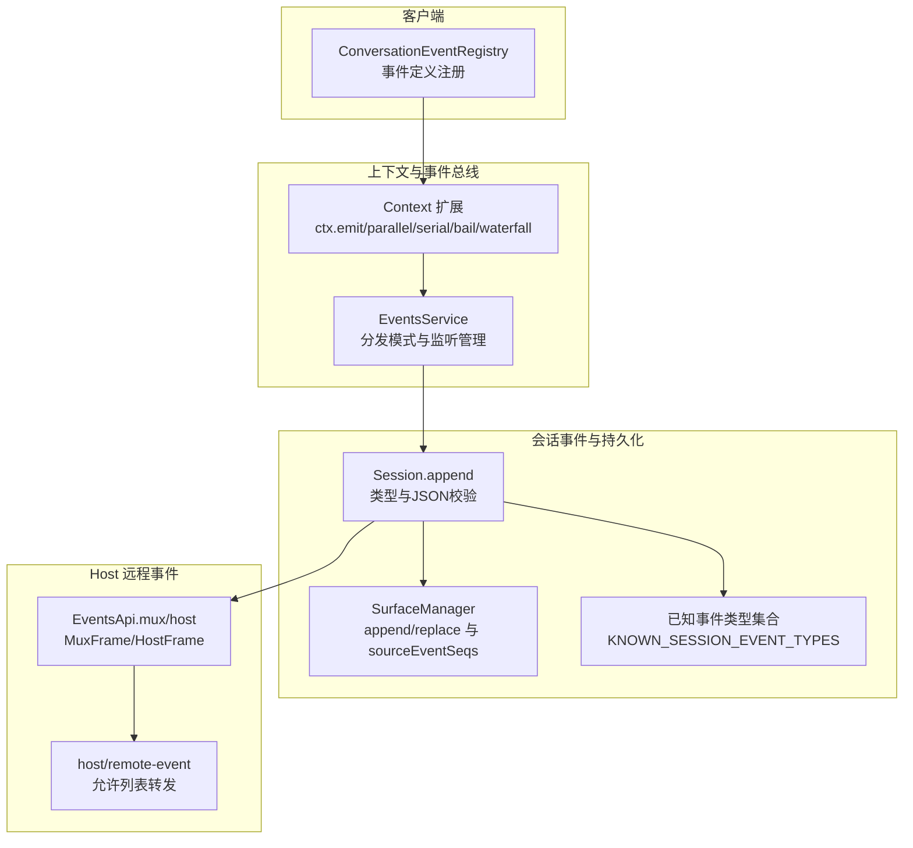
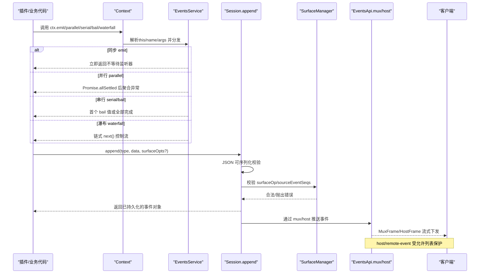
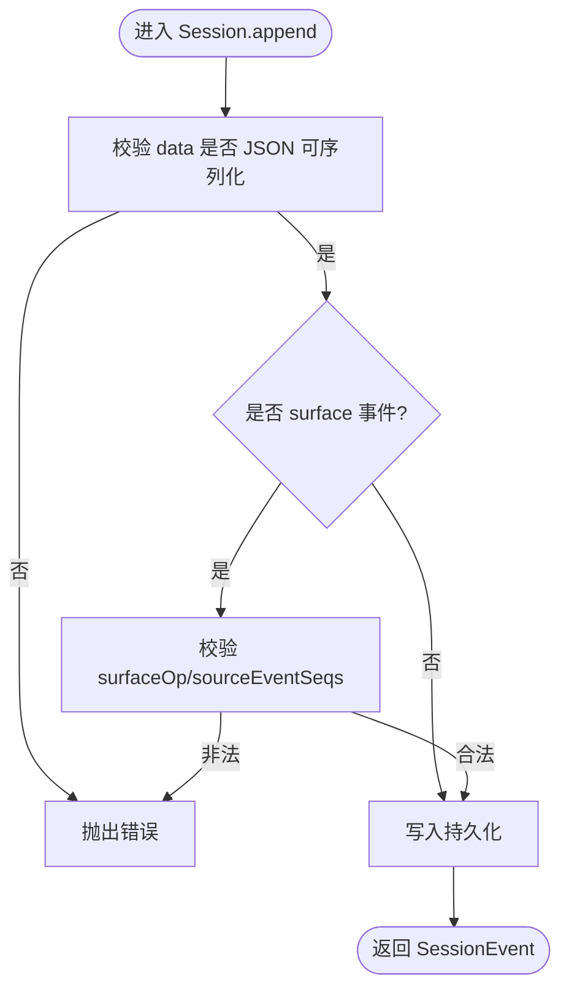
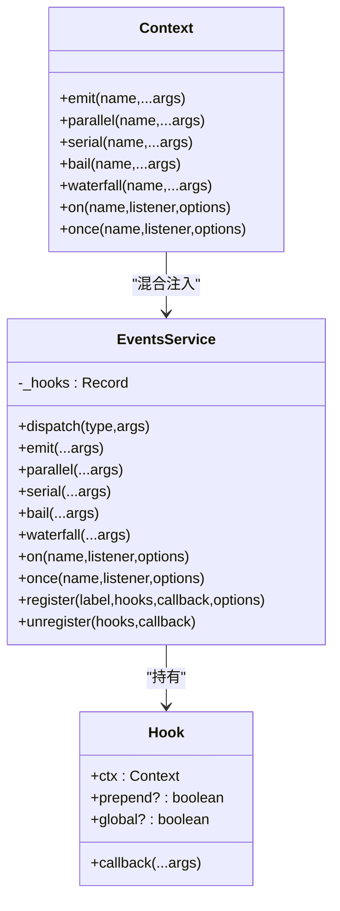
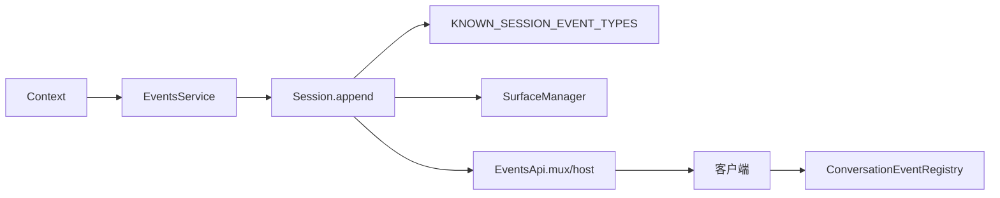

# 事件发布机制

<cite>
**本文引用的文件**
- [vendor/cordis/src/events.ts](file://vendor/cordis/src/events.ts)
- [docs/cordis-api/events.md](file://docs/cordis-api/events.md)
- [packages/host/apiproxy/src/api/events.ts](file://packages/host/apiproxy/src/api/events.ts)
- [packages/core/session/src/known-event-types.ts](file://packages/core/session/src/known-event-types.ts)
- [packages/core/session/src/index.ts](file://packages/core/session/src/index.ts)
- [packages/core/session/src/surface.ts](file://packages/core/session/src/surface.ts)
- [packages/client/runtime/src/client/conversation/event-registry.ts](file://packages/client/runtime/src/client/conversation/event-registry.ts)
- [scripts/gen-doc-graphs.ts](file://scripts/gen-doc-graphs.ts)
- [docs/testing.md](file://docs/testing.md)
</cite>

## 目录
1. [简介](#简介)
2. [项目结构](#项目结构)
3. [核心组件](#核心组件)
4. [架构总览](#架构总览)
5. [详细组件分析](#详细组件分析)
6. [依赖关系分析](#依赖关系分析)
7. [性能考虑](#性能考虑)
8. [故障排查指南](#故障排查指南)
9. [结论](#结论)
10. [附录](#附录)

## 简介
本文件系统化说明 Harness 的事件创建、序列化与发布流程，覆盖事件发布器 API、事件元数据结构与作用、异步处理机制、错误处理策略、性能优化与内存管理最佳实践，以及在插件中正确发布事件的实践方法。同时提供测试方法与调试技巧，帮助读者在开发与生产环境中稳定使用事件系统。

## 项目结构
事件相关能力横跨多个层次：
- 上下文事件总线（Cordis）：提供 ctx.emit/parallel/serial/bail/waterfall/on/once 等分发模式与监听注册。
- 会话事件持久化与表面操作：负责事件追加、JSON 序列化校验、可替换的“表面”操作（append/replace）以及源事件溯源。
- Host 远程事件转发：通过 mux/host 流将宿主侧事件以允许列表方式转发到客户端。
- 客户端事件注册：如对话事件注册表，用于按业务定义装配视图与行为。
- 文档与脚本：生成事件目录、绘制事件关系图、指导测试策略。

图表来源
- [vendor/cordis/src/events.ts:131-319](file://vendor/cordis/src/events.ts#L131-L319)
- [packages/core/session/src/index.ts:589-611](file://packages/core/session/src/index.ts#L589-L611)
- [packages/core/session/src/surface.ts:184-208](file://packages/core/session/src/surface.ts#L184-L208)
- [packages/core/session/src/known-event-types.ts:1-65](file://packages/core/session/src/known-event-types.ts#L1-L65)
- [packages/host/apiproxy/src/api/events.ts:46-156](file://packages/host/apiproxy/src/api/events.ts#L46-L156)
- [packages/client/runtime/src/client/conversation/event-registry.ts:1-68](file://packages/client/runtime/src/client/conversation/event-registry.ts#L1-L68)

章节来源
- [vendor/cordis/src/events.ts:131-319](file://vendor/cordis/src/events.ts#L131-L319)
- [packages/core/session/src/index.ts:589-611](file://packages/core/session/src/index.ts#L589-L611)
- [packages/core/session/src/surface.ts:184-208](file://packages/core/session/src/surface.ts#L184-L208)
- [packages/core/session/src/known-event-types.ts:1-65](file://packages/core/session/src/known-event-types.ts#L1-L65)
- [packages/host/apiproxy/src/api/events.ts:46-156](file://packages/host/apiproxy/src/api/events.ts#L46-L156)
- [packages/client/runtime/src/client/conversation/event-registry.ts:1-68](file://packages/client/runtime/src/client/conversation/event-registry.ts#L1-L68)

## 核心组件
- 事件总线 EventsService：实现多种分发模式（emit/parallel/serial/bail/waterfall），支持监听器的 fiber 生命周期自动释放、全局监听与前置插入、过滤与反射绑定。
- 会话事件追加 Session.append：对事件数据进行 JSON 可序列化校验，并支持“表面意图”（surfaceOp/sourceEventSeqs）进行可替换与溯源。
- Host 事件流 EventsApi：提供 mux 与 host 两个逻辑流，承载会话事件、审批/问答、后台任务、投影更新及远端事件转发。
- 客户端事件注册 ConversationEventRegistry：为对话节点等业务定义提供事件注册与回退处理。

章节来源
- [vendor/cordis/src/events.ts:131-319](file://vendor/cordis/src/events.ts#L131-L319)
- [packages/core/session/src/index.ts:589-611](file://packages/core/session/src/index.ts#L589-L611)
- [packages/host/apiproxy/src/api/events.ts:46-156](file://packages/host/apiproxy/src/api/events.ts#L46-L156)
- [packages/client/runtime/src/client/conversation/event-registry.ts:1-68](file://packages/client/runtime/src/client/conversation/event-registry.ts#L1-L68)

## 架构总览
下图展示从插件调用上下文事件到持久化与远程转发的完整链路，包括同步/异步分发、序列化校验、表面操作与允许列表转发。

图表来源
- [vendor/cordis/src/events.ts:165-243](file://vendor/cordis/src/events.ts#L165-L243)
- [packages/core/session/src/index.ts:589-611](file://packages/core/session/src/index.ts#L589-L611)
- [packages/core/session/src/surface.ts:184-208](file://packages/core/session/src/surface.ts#L184-L208)
- [packages/host/apiproxy/src/api/events.ts:46-156](file://packages/host/apiproxy/src/api/events.ts#L46-L156)

## 详细组件分析

### 事件发布器 API 与使用方法
- 分发模式
  - emit：同步触发，忽略返回值，适合日志/指标类副作用。
  - parallel：并发执行所有监听器，聚合异常，适合独立且无顺序要求的副作用。
  - serial：按序 await，遇到第一个“bail”值即停止，适合短路决策。
  - bail：同步按序执行，遇到第一个“bail”值即停止。
  - waterfall：最后一个参数为 next，监听器可选择调用 next 继续下游，否则拦截。
- 监听注册
  - on/once：在当前 fiber 下注册，支持 prepend/global 选项；fiber 销毁时自动清理。
  - 内置 internal/* 事件用于框架级钩子（配置更新、服务读写、监听注册拦截、分发诊断）。

章节来源
- [vendor/cordis/src/events.ts:165-319](file://vendor/cordis/src/events.ts#L165-L319)
- [docs/cordis-api/events.md:8-187](file://docs/cordis-api/events.md#L8-L187)

### 事件元数据与序列化
- 会话事件追加
  - 必须满足 JSON 可序列化约束（不允许 BigInt、函数、Symbol、undefined、非有限数、循环引用等）。
  - 表面意图（surfaceOp/sourceEventSeqs）仅对具备资格的事件类型可用，用于 append 或 replace 指定范围，并提供源事件溯源。
- 已知事件类型
  - KNOWN_SESSION_EVENT_TYPES 维护仓库内所有被持久化读取路径识别的事件类型集合，未知类型将被拒绝或需携带 ignorable 标记。
- 表面操作校验
  - 非 eligible 类型不得携带 surfaceOp/sourceEventSeqs；eligible 类型必须提供合法的 surfaceOp（append 或 replace）。

图表来源
- [packages/core/session/src/index.ts:589-611](file://packages/core/session/src/index.ts#L589-L611)
- [packages/core/session/src/surface.ts:184-208](file://packages/core/session/src/surface.ts#L184-L208)
- [packages/core/session/src/known-event-types.ts:1-65](file://packages/core/session/src/known-event-types.ts#L1-L65)

章节来源
- [packages/core/session/src/index.ts:589-611](file://packages/core/session/src/index.ts#L589-L611)
- [packages/core/session/src/surface.ts:184-208](file://packages/core/session/src/surface.ts#L184-L208)
- [packages/core/session/src/known-event-types.ts:1-65](file://packages/core/session/src/known-event-types.ts#L1-L65)

### 异步处理与错误处理
- 并发与聚合异常
  - parallel 使用 allSettled 收集结果并聚合所有失败原因，便于一次性定位问题。
- 短路与控制流
  - serial/bail 在遇到“bail”值时提前终止，避免不必要的后续监听器执行。
  - waterfall 通过 next 显式控制下游执行，未调用 next 即视为拦截。
- 远程事件转发错误
  - 当远端事件参数不符合预期时，会在转发监听器处抛出并被事件总线记录/丢弃该帧，避免污染上游。

章节来源
- [vendor/cordis/src/events.ts:183-243](file://vendor/cordis/src/events.ts#L183-L243)
- [packages/host/apiproxy/src/api/events.ts:144-155](file://packages/host/apiproxy/src/api/events.ts#L144-L155)

### 插件中如何正确发布事件
- 在插件 apply 中通过 ctx.on 订阅所需事件；对于需要一次性的场景使用 ctx.once。
- 对于需要控制流的场景，优先选择 waterfall（next）或 serial/bail 的组合，确保错误与短路语义清晰。
- 对于需要持久化的业务事件，使用 Session.append，并确保 payload 符合 JSON 可序列化与 surface 规则。
- 若需跨进程/跨端传递，遵循 Host 允许列表机制，通过 mux/host 流接收 host/remote-event。

章节来源
- [vendor/cordis/src/events.ts:288-319](file://vendor/cordis/src/events.ts#L288-L319)
- [packages/core/session/src/index.ts:589-611](file://packages/core/session/src/index.ts#L589-L611)
- [packages/host/apiproxy/src/api/events.ts:144-155](file://packages/host/apiproxy/src/api/events.ts#L144-L155)

### 事件发布器的内部类图

图表来源
- [vendor/cordis/src/events.ts:119-319](file://vendor/cordis/src/events.ts#L119-L319)

章节来源
- [vendor/cordis/src/events.ts:119-319](file://vendor/cordis/src/events.ts#L119-L319)

## 依赖关系分析
- 上下文与事件总线强耦合：Context 通过模块声明扩展出事件方法，统一由 EventsService 实现。
- 会话持久化依赖事件类型白名单：KNOWN_SESSION_EVENT_TYPES 决定哪些事件可被持久化读取路径识别。
- Host 流与客户端解耦：通过 MuxFrame/HostFrame 契约传输，host/remote-event 受允许列表保护，避免任意事件泄露。
- 客户端事件注册表与 UI 解耦：ConversationEventRegistry 负责业务事件定义的装配与回退。

图表来源
- [vendor/cordis/src/events.ts:131-319](file://vendor/cordis/src/events.ts#L131-L319)
- [packages/core/session/src/known-event-types.ts:1-65](file://packages/core/session/src/known-event-types.ts#L1-L65)
- [packages/core/session/src/surface.ts:184-208](file://packages/core/session/src/surface.ts#L184-L208)
- [packages/host/apiproxy/src/api/events.ts:46-156](file://packages/host/apiproxy/src/api/events.ts#L46-L156)
- [packages/client/runtime/src/client/conversation/event-registry.ts:1-68](file://packages/client/runtime/src/client/conversation/event-registry.ts#L1-L68)

章节来源
- [vendor/cordis/src/events.ts:131-319](file://vendor/cordis/src/events.ts#L131-L319)
- [packages/core/session/src/known-event-types.ts:1-65](file://packages/core/session/src/known-event-types.ts#L1-L65)
- [packages/core/session/src/surface.ts:184-208](file://packages/core/session/src/surface.ts#L184-L208)
- [packages/host/apiproxy/src/api/events.ts:46-156](file://packages/host/apiproxy/src/api/events.ts#L46-L156)
- [packages/client/runtime/src/client/conversation/event-registry.ts:1-68](file://packages/client/runtime/src/client/conversation/event-registry.ts#L1-L68)

## 性能考虑
- 选择合适的分发模式
  - 高频日志/指标：使用 emit，避免阻塞主流程。
  - 独立副作用：使用 parallel，利用并发提升吞吐，注意聚合异常。
  - 有顺序或短路需求：使用 serial/bail，减少不必要监听器执行。
  - 复杂拦截链：使用 waterfall，显式控制 next 调用，避免隐式执行。
- 序列化与表面操作
  - 严格保证 payload 可 JSON 序列化，避免运行时转换开销与错误。
  - 合理使用 surfaceOp 的 replace 操作合并连续变更，降低存储与回放成本。
- 监听器数量与过滤
  - 使用 global 谨慎开启，避免无关监听器参与分发。
  - 通过 thisArg 与 filter 缩小匹配范围，减少无效回调。
- 远程事件转发
  - 借助允许列表限制 host/remote-event 的传播面，减少网络与客户端处理负担。

[本节为通用性能建议，不直接分析具体文件]

## 故障排查指南
- 监听器异常
  - parallel 会聚合所有失败原因，检查 AggregateError 中的每个 reason。
  - serial/bail 遇到 bail 值会提前终止，确认是否为预期短路。
- 序列化失败
  - 检查 payload 是否包含不可序列化的值（BigInt、函数、Symbol、undefined、循环引用等）。
- 表面操作非法
  - 非 eligible 类型不得携带 surfaceOp/sourceEventSeqs；eligible 类型必须提供合法的 surfaceOp。
- 远程事件参数错误
  - 转发监听器抛出异常会被事件总线记录并丢弃该帧，查看宿主日志定位 malformed 事件。

章节来源
- [vendor/cordis/src/events.ts:183-243](file://vendor/cordis/src/events.ts#L183-L243)
- [packages/core/session/src/index.ts:589-611](file://packages/core/session/src/index.ts#L589-L611)
- [packages/core/session/src/surface.ts:184-208](file://packages/core/session/src/surface.ts#L184-L208)
- [packages/host/apiproxy/src/api/events.ts:144-155](file://packages/host/apiproxy/src/api/events.ts#L144-L155)

## 结论
Harness 的事件系统通过统一的上下文 API、严格的序列化与表面操作约束、灵活的异步分发模式以及安全的远程转发机制，提供了高内聚、低耦合的事件处理能力。合理选择分发模式、严格控制事件载荷与元数据、善用允许列表与过滤，可在保证一致性与安全性的前提下获得良好性能与可维护性。

[本节为总结性内容，不直接分析具体文件]

## 附录

### 事件发布器 API 速查
- 分发：emit、parallel、serial、bail、waterfall
- 监听：on、once（支持 prepend/global）
- 内置钩子：internal/config、internal/update、internal/get/set/listener/dispatch 等

章节来源
- [docs/cordis-api/events.md:8-187](file://docs/cordis-api/events.md#L8-L187)
- [vendor/cordis/src/events.ts:329-353](file://vendor/cordis/src/events.ts#L329-L353)

### 事件关系与分发点可视化
- 脚本会扫描源码中的事件分发调用，统计各包的分发点与监听者，辅助理解事件传播拓扑。

章节来源
- [scripts/gen-doc-graphs.ts:918-1092](file://scripts/gen-doc-graphs.ts#L918-L1092)

### 测试方法与调试技巧
- 单元测试：覆盖事件顺序、并发竞态、错误路径与永久回归用例。
- 快照测试：锁定外部行为（协议与呈现）、持久化日志与重放一致性。
- 真实入口测试：通过构建产物运行，暴露 tsx 掩盖的问题。
- 调试：利用 internal/dispatch 等内置事件观察分发过程；结合会话查询工具 traceEvent 追踪具体事件。

章节来源
- [docs/testing.md:7-50](file://docs/testing.md#L7-L50)