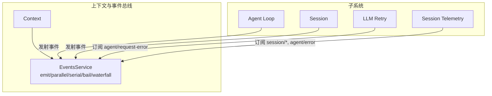
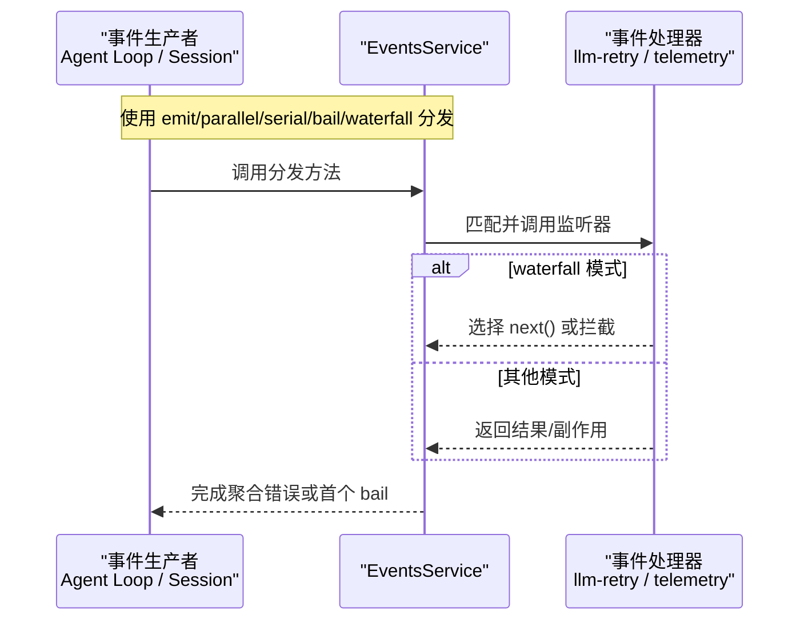
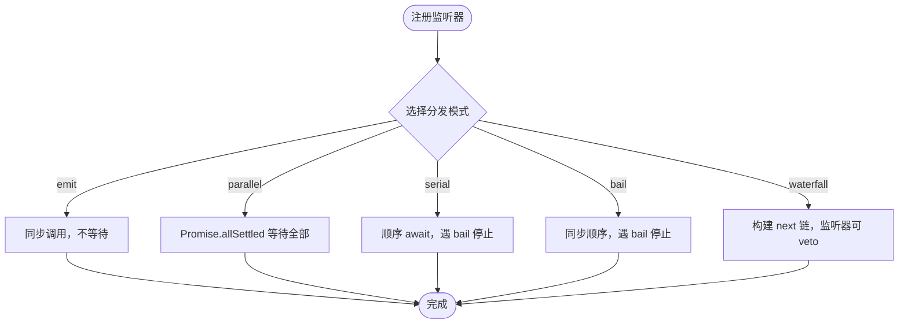
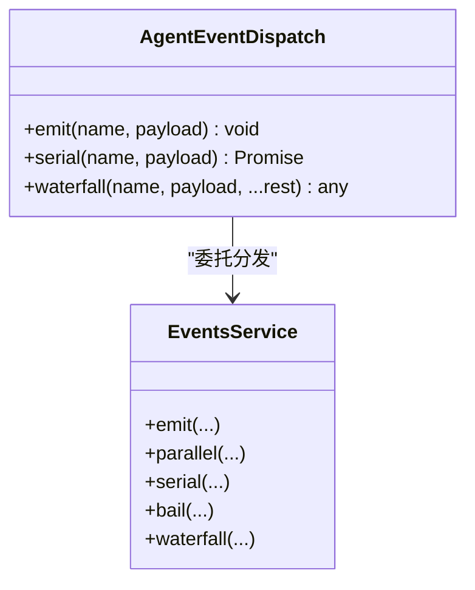
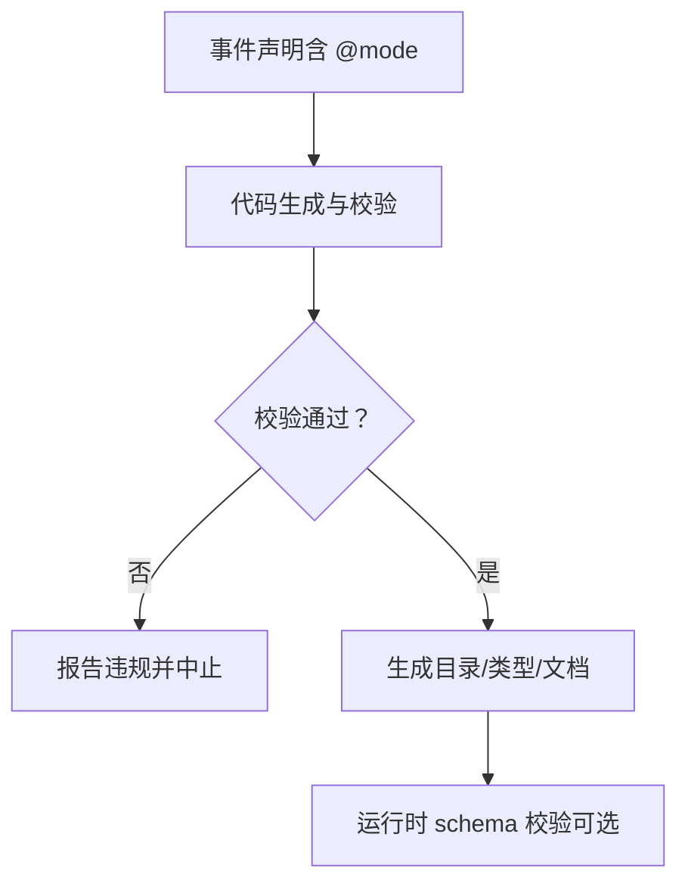
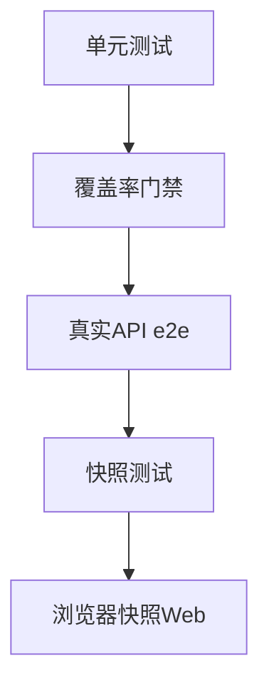
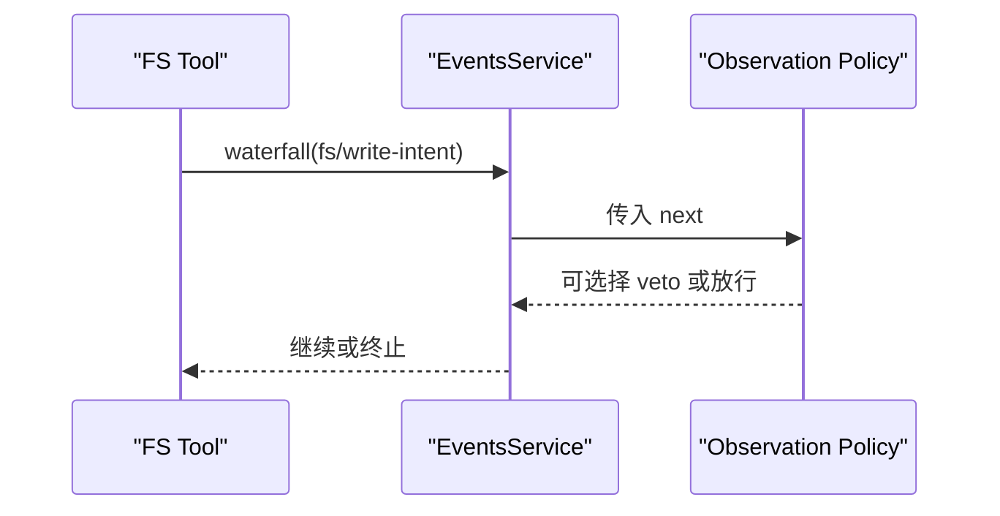
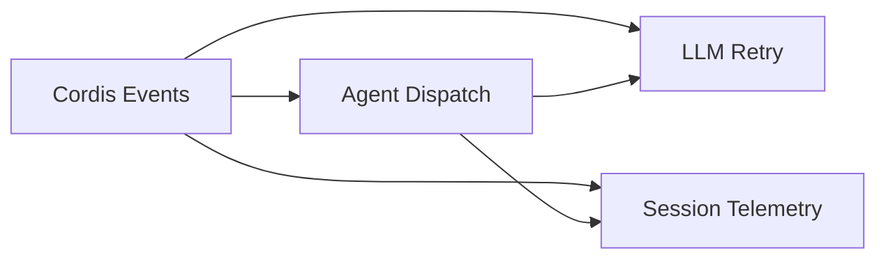

# 事件处理器开发

<cite>
**本文引用的文件**
- [events.md](file://docs/cordis-api/events.md)
- [event-producer-consumer.md](file://docs/event-producer-consumer.md)
- [testing.md](file://docs/testing.md)
- [events.ts](file://vendor/cordis/src/events.ts)
- [dispatch.ts](file://packages/core/agent/src/dispatch.ts)
- [index.ts（llm-retry）](file://packages/llm/llm-retry/src/index.ts)
- [coordinator.ts（session-telemetry）](file://packages/session/session-telemetry/src/coordinator.ts)
- [events.spec.ts（hook-protocol）](file://packages/hooks/hook-protocol/tests/events.spec.ts)
</cite>

## 目录
1. [简介](#简介)
2. [项目结构](#项目结构)
3. [核心组件](#核心组件)
4. [架构总览](#架构总览)
5. [详细组件分析](#详细组件分析)
6. [依赖关系分析](#依赖关系分析)
7. [性能考虑](#性能考虑)
8. [故障排查指南](#故障排查指南)
9. [结论](#结论)
10. [附录](#附录)

## 简介
本指南面向需要在 Harness/Cordis 中编写事件处理器的开发者，系统说明事件处理器的编写规范、生命周期钩子与扩展点、参数验证与类型检查机制、错误处理与重试策略、测试方法（单元与集成）、复杂场景实现案例，以及性能监控与优化技巧。内容基于仓库内的事件分发基础设施、子系统事件矩阵、重试与遥测等实现进行提炼。

## 项目结构
- 事件分发 API 通过 Context 混入，提供 emit、parallel、serial、bail、waterfall 五种分发模式，并支持 on/once 注册监听器。
- 各子系统通过声明事件并在生产端调用对应分发模式；消费端以插件形式注册监听器，参与拦截、增强、观测或副作用。
- 事件生产者与消费者关系由生成文档维护，便于定位事件的来源与订阅方。



图表来源
- [events.ts:131-319](file://vendor/cordis/src/events.ts#L131-L319)
- [event-producer-consumer.md:8-66](file://docs/event-producer-consumer.md#L8-L66)

章节来源
- [events.md:8-208](file://docs/cordis-api/events.md#L8-L208)
- [event-producer-consumer.md:8-66](file://docs/event-producer-consumer.md#L8-L66)

## 核心组件
- 事件分发服务：提供多种调度模式，支持上下文过滤、全局监听、按 Fiber 生命周期自动清理。
- Agent 专用事件派发：将 Agent 作为作用域载体注入事件 thisArg，并将 payload.agent 字段安全注入，避免主题与作用域键不一致。
- 重试策略：在 agent/request-error 上以 waterfall 模式接入，按 provider 配置的策略执行退避与重试。
- 遥测采集：订阅 session 与 agent 相关事件，记录指标与审计信息。

章节来源
- [events.ts:131-319](file://vendor/cordis/src/events.ts#L131-L319)
- [dispatch.ts:94-165](file://packages/core/agent/src/dispatch.ts#L94-L165)
- [index.ts（llm-retry）:99-227](file://packages/llm/llm-retry/src/index.ts#L99-L227)
- [coordinator.ts（session-telemetry）:74-103](file://packages/session/session-telemetry/src/coordinator.ts#L74-L103)

## 架构总览
下图展示了典型的事件流：生产者（如 Agent Loop、Session）通过 Context.events 分发事件；消费者（如 llm-retry、session-telemetry）通过 ctx.on 注册监听器，参与拦截或观测。



图表来源
- [events.ts:165-243](file://vendor/cordis/src/events.ts#L165-L243)
- [event-producer-consumer.md:8-66](file://docs/event-producer-consumer.md#L8-L66)

## 详细组件分析

### 事件分发与生命周期钩子
- 分发模式
  - emit：同步触发，忽略返回值，适合通知型事件。
  - parallel：并发执行所有监听器，全部完成后返回。
  - serial：顺序等待，遇到“bail”值即停止。
  - bail：同步顺序，遇到“bail”值即停止。
  - waterfall：最后一个参数为 next 回调，监听器可决定是否继续链式调用。
- 生命周期与清理
  - 监听器通过 ctx.on/ctx.once 注册，绑定到当前 Fiber；Fiber 销毁时自动移除。
  - internal/listener、internal/status、internal/update 等内部事件用于框架级拦截与诊断。



图表来源
- [events.ts:183-243](file://vendor/cordis/src/events.ts#L183-L243)
- [events.ts:288-319](file://vendor/cordis/src/events.ts#L288-L319)

章节来源
- [events.md:8-208](file://docs/cordis-api/events.md#L8-L208)
- [events.ts:131-319](file://vendor/cordis/src/events.ts#L131-L319)

### Agent 专用事件派发与参数注入
- 通过 agentEvents 构造带作用域的派发对象，确保 thisArg 为 Scoped<Agent>，且 payload.agent 被安全注入，防止覆盖。
- 提供 emit/serial/waterfall 三种便捷方法，封装了 thisArg 与 payload 注入逻辑。



图表来源
- [dispatch.ts:54-82](file://packages/core/agent/src/dispatch.ts#L54-L82)
- [dispatch.ts:107-149](file://packages/core/agent/src/dispatch.ts#L107-L149)
- [events.ts:183-243](file://vendor/cordis/src/events.ts#L183-L243)

章节来源
- [dispatch.ts:94-165](file://packages/core/agent/src/dispatch.ts#L94-L165)

### 参数验证与类型检查机制
- 事件签名与 JSDoc 中的 @mode 标签驱动代码生成与校验，确保事件签名与分发模式一致（例如 waterfall 必须包含 next）。
- 生成脚本对事件参数进行约束检查，包括是否存在 next、是否误用模式等。
- 运行时通过 schema（如 schemastery/zod）对配置与输入做校验，抛出明确错误。



图表来源
- [cordis-catalog.ts（typert generator）:180-207](file://packages/typert/generator/src/cordis-catalog.ts#L180-L207)
- [gen-scoped-events.ts:184-212](file://scripts/gen-scoped-events.ts#L184-L212)

章节来源
- [events.md:189-208](file://docs/cordis-api/events.md#L189-L208)
- [events.ts:189-208](file://vendor/cordis/src/events.ts#L189-L208)

### 错误处理与重试策略
- 通用错误隔离：emit 模式下单个监听器抛错不会阻塞后续监听器，异常被捕获并记录。
- 重试策略（llm-retry）：
  - 订阅 agent/request-error（waterfall），根据 provider 配置的 retryPolicy 决定行为。
  - 支持 normal（有限重试）与 always（无界重试）两种模式，结合指数退避与抖动。
  - 尊重 providerRetryAfterMs、AbortSignal 取消、插件生命周期。
  - 通过 session.append 记录 llm/retry 与 llm/retry-started 事件，便于追踪。

```mermaid
sequenceDiagram
participant Loop as "Agent Loop"
participant Bus as "EventsService"
participant Retry as "llm-retry"
participant Provider as "LLM Provider"
Loop->>Bus : 发出 agent/request-error
Bus->>Retry : waterfall(next)
Retry->>Provider : 尝试下游请求
alt 失败且符合策略
Retry-->>Bus : 返回 {kind : 'retry'}
Loop->>Provider : 再次尝试退避后
else 不符合策略或达到上限
Retry-->>Bus : 调用 next() 透传
end
```

图表来源
- [index.ts（llm-retry）:99-227](file://packages/llm/llm-retry/src/index.ts#L99-L227)
- [event-producer-consumer.md:18-23](file://docs/event-producer-consumer.md#L18-L23)

章节来源
- [dispatch.ts:120-137](file://packages/core/agent/src/dispatch.ts#L120-L137)
- [index.ts（llm-retry）:99-227](file://packages/llm/llm-retry/src/index.ts#L99-L227)

### 单元测试与集成测试方法
- 单元测试：围绕事件顺序、并发竞态、错误路径与契约回归编写；每个注册点需有 HMR 安全测试（确保 dispose 清理）。
- 真实 API e2e：使用真实模型与工具链，自跳过 keyless CI；覆盖文件写入、多轮对话、工具调用、中断等。
- 快照测试：关键协议与呈现输出通过 JSONL 快照锁定；变更需审查 diff。
- 针对 hook 事件：验证 invoked/result 成对出现、stderrSummary 截断、决策推导等。



图表来源
- [testing.md:7-49](file://docs/testing.md#L7-L49)
- [events.spec.ts（hook-protocol）:10-106](file://packages/hooks/hook-protocol/tests/events.spec.ts#L10-L106)

章节来源
- [testing.md:7-49](file://docs/testing.md#L7-L49)
- [events.spec.ts（hook-protocol）:10-106](file://packages/hooks/hook-protocol/tests/events.spec.ts#L10-L106)

### 复杂事件处理场景实现案例
- 会话遥测采集：订阅 session/created、session/event、session/flush、agent/error 等事件，统一采集并上报，保证 turn 延迟不受影响。
- 文件系统操作观察：fs/write-intent、fs/edit-intent 等 waterfall 事件允许策略层拦截与审计。
- 工具执行前后钩子：tools/pre-execute、tools/post-execute 用于权限、限流、日志等横切关注点。



图表来源
- [event-producer-consumer.md:34-36](file://docs/event-producer-consumer.md#L34-L36)

章节来源
- [coordinator.ts（session-telemetry）:74-103](file://packages/session/session-telemetry/src/coordinator.ts#L74-L103)
- [event-producer-consumer.md:34-58](file://docs/event-producer-consumer.md#L34-L58)

## 依赖关系分析
- 事件生产者与消费者呈多对多关系，可通过事件矩阵快速定位。
- 核心依赖：
  - vendor/cordis/events.ts 提供基础能力。
  - packages/core/agent/dispatch.ts 提供 Agent 作用域事件派发。
  - packages/llm/llm-retry 依赖 agent/request-error 实现重试。
  - packages/session/session-telemetry 依赖 session/* 与 agent/error 实现采集。



图表来源
- [events.ts:131-319](file://vendor/cordis/src/events.ts#L131-L319)
- [dispatch.ts:94-165](file://packages/core/agent/src/dispatch.ts#L94-L165)
- [index.ts（llm-retry）:99-227](file://packages/llm/llm-retry/src/index.ts#L99-L227)
- [coordinator.ts（session-telemetry）:74-103](file://packages/session/session-telemetry/src/coordinator.ts#L74-L103)

章节来源
- [event-producer-consumer.md:8-66](file://docs/event-producer-consumer.md#L8-L66)

## 性能考虑
- 选择合适分发模式：
  - 通知型使用 emit，避免不必要的等待。
  - 需要并行处理时使用 parallel，注意 AggregateError 聚合异常。
  - 需要有序控制时使用 serial/bail，谨慎设计 bail 条件。
  - 需要拦截/增强时使用 waterfall，避免过度嵌套。
- 减少分配与热路径开销：
  - Agent 事件派发复用 carrier，避免重复创建。
  - 监听器尽量轻量，I/O 下沉到异步任务。
- 监控与可观测性：
  - 利用 session/flush 提示刷新遥测后端。
  - 通过 internal/dispatch 等内部事件做诊断。
- 重试与退避：
  - 遵循 provider 的 Retry-After 指示，合理设置最大延迟与抖动。
  - 使用 AbortSignal 及时取消无效等待。

[本节为通用指导，不直接分析具体文件]

## 故障排查指南
- 监听器抛错不影响后续监听器：emit 模式下异常被捕获并记录，检查日志定位问题。
- 重试未生效：确认 provider 配置了 retryPolicy，且 failure.code 在可重试列表中；检查信号是否已中止。
- 事件未到达预期消费者：核对事件名称、thisArg 作用域过滤、global 选项；查看 internal/dispatch 诊断。
- 快照差异：对比 JSONL 与期望输出，确认是否为非确定性因素导致。

章节来源
- [dispatch.ts:120-137](file://packages/core/agent/src/dispatch.ts#L120-L137)
- [index.ts（llm-retry）:156-208](file://packages/llm/llm-retry/src/index.ts#L156-L208)
- [events.ts:165-175](file://vendor/cordis/src/events.ts#L165-L175)
- [testing.md:7-49](file://docs/testing.md#L7-L49)

## 结论
Harness/Cordis 的事件体系提供了灵活而强大的扩展点，配合严格的类型与生成期校验、完善的错误隔离与重试策略、以及丰富的测试与可观测性手段，能够支撑复杂的业务编排与横切关注点。建议在设计事件处理器时优先选择合适的分发模式、做好参数校验与错误处理、并通过测试与快照保障稳定性。

## 附录
- 常用事件参考：参见事件矩阵，了解各子系统的事件分布与依赖。
- 最佳实践清单：
  - 使用 @mode 标注事件，保持签名与模式一致。
  - 在 waterfall 中显式调用 next 或明确 veto。
  - 对 I/O 与耗时操作进行异步化与超时控制。
  - 通过 session/flush 与 internal/dispatch 提升可观测性。
  - 为关键路径编写快照与 e2e 用例。

[本节为补充信息，不直接分析具体文件]