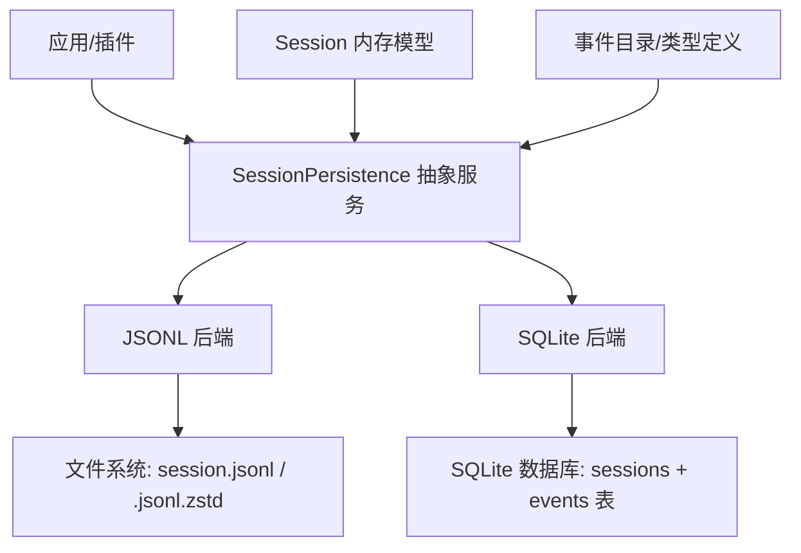
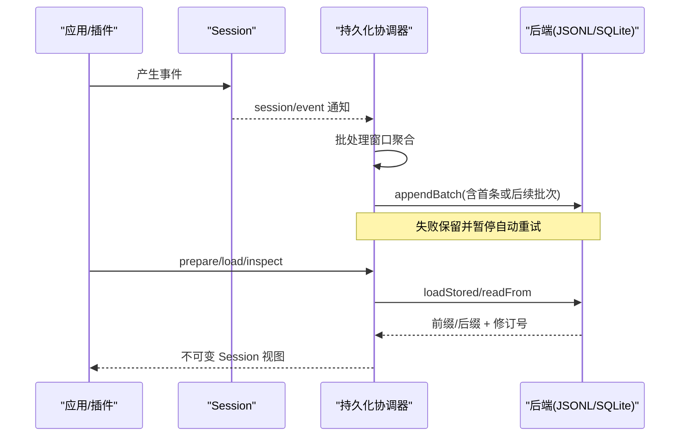
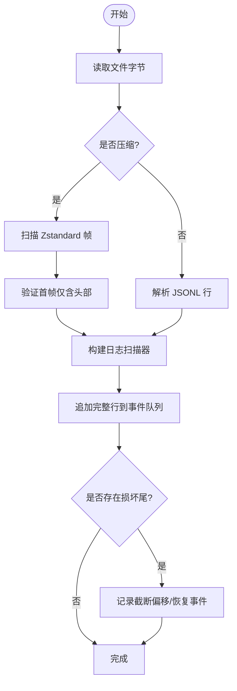
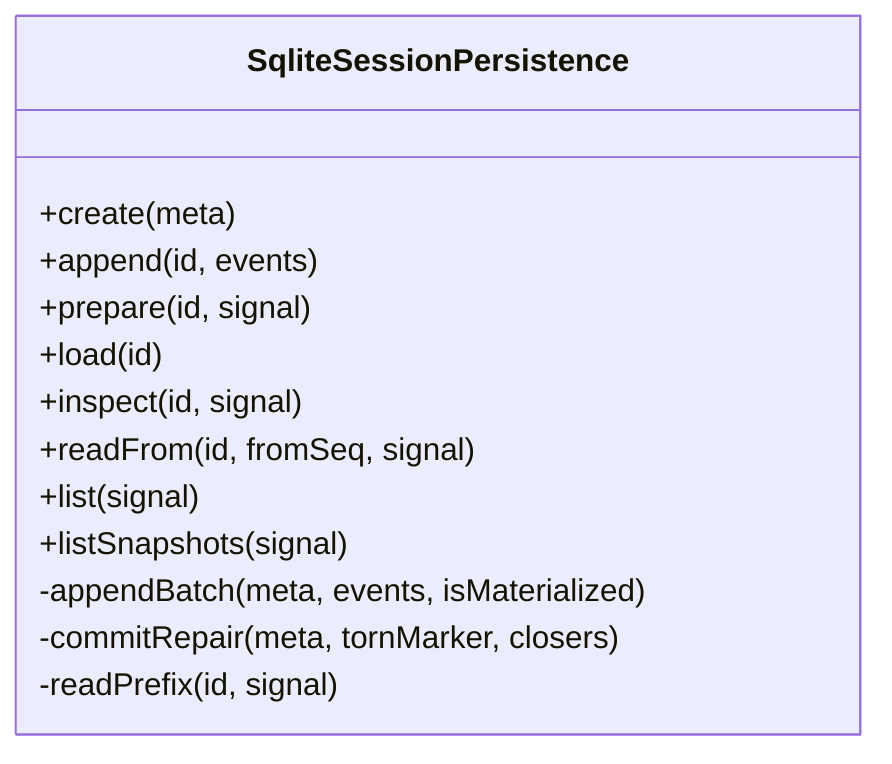
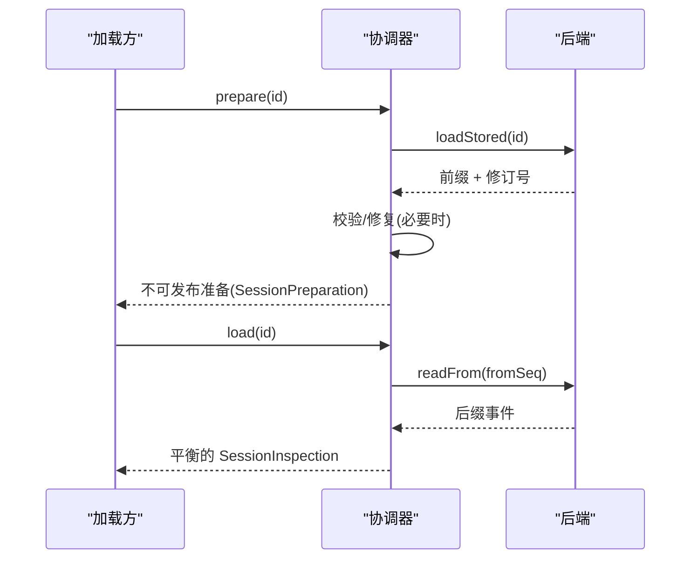
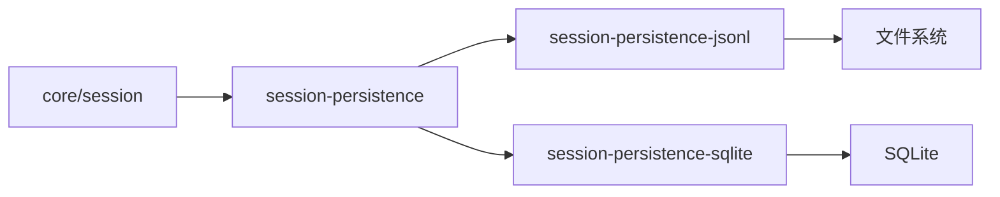

# 事件持久化

<cite>
**本文引用的文件**
- [packages/session/session-persistence/src/index.ts](file://packages/session/session-persistence/src/index.ts)
- [packages/session/session-persistence-jsonl/src/index.ts](file://packages/session/session-persistence-jsonl/src/index.ts)
- [packages/session/session-persistence-jsonl/src/format.ts](file://packages/session/session-persistence-jsonl/src/format.ts)
- [packages/session/session-persistence-sqlite/src/index.ts](file://packages/session/session-persistence-sqlite/src/index.ts)
- [packages/core/session/src/types.ts](file://packages/core/session/src/types.ts)
- [docs/subsystems/persistence.md](file://docs/subsystems/persistence.md)
- [docs/persistence-catalog.md](file://docs/persistence-catalog.md)
- [docs/event-producer-consumer.md](file://docs/event-producer-consumer.md)
</cite>

## 目录
1. [简介](#简介)
2. [项目结构](#项目结构)
3. [核心组件](#核心组件)
4. [架构总览](#架构总览)
5. [详细组件分析](#详细组件分析)
6. [依赖关系分析](#依赖关系分析)
7. [性能与容量管理](#性能与容量管理)
8. [故障排查指南](#故障排查指南)
9. [结论](#结论)
10. [附录](#附录)

## 简介
本文件系统性说明会话事件日志的持久化方案，覆盖序列化格式、存储策略、索引机制、回放与重放原理、性能与容量管理、归档清理策略，以及在会话恢复中的应用。同时给出备份与迁移建议，帮助读者在工程实践中正确设计、运维和扩展事件持久化能力。

## 项目结构
- 抽象服务与协调层：定义统一的持久化接口、写入批处理窗口、冷启动准备/检查、崩溃恢复与轻量级快照等。
- 后端实现：
  - JSONL 后端：每会话一个追加型日志文件，支持 Zstandard 压缩或明文；具备原子物化、截断修复、原始内容读取等能力。
  - SQLite 后端：单库多会话，事件按行存储，支持事务原子写入、可寻址后缀读取、轻量级 revision 列表。
- 事件模型与目录：统一的事件信封、表面事件标记、头部元数据（SessionHeader）与生成式事件目录。

图表来源
- [packages/session/session-persistence/src/index.ts:78-241](file://packages/session/session-persistence/src/index.ts#L78-L241)
- [packages/session/session-persistence-jsonl/src/index.ts:121-200](file://packages/session/session-persistence-jsonl/src/index.ts#L121-L200)
- [packages/session/session-persistence-sqlite/src/index.ts:99-200](file://packages/session/session-persistence-sqlite/src/index.ts#L99-L200)

章节来源
- [packages/session/session-persistence/src/index.ts:78-241](file://packages/session/session-persistence/src/index.ts#L78-L241)
- [docs/subsystems/persistence.md:1-120](file://docs/subsystems/persistence.md#L1-L120)

## 核心组件
- SessionPersistence 抽象服务：提供 locate/create/append/prepare/load/inspect/readFrom/list/listSnapshots 等能力，屏蔽后端差异。
- PersistenceCoordinator（协调器）：负责批处理窗口、失败重试、冷启动准备、崩溃恢复、并发隔离与发布。
- 后端接口 PersistenceBackend：定义 loadStored/appendBatch/commitRepair/list 等物理存储钩子。
- 事件与头部：
  - SessionEvent：包含 type、seq、time、data 以及可选 ignorable、surfaceOp、sourceEventSeqs。
  - SessionHeader：版本、id、创建时间、工作目录、父会话、种子边界、代理预设等。

章节来源
- [packages/session/session-persistence/src/index.ts:78-241](file://packages/session/session-persistence/src/index.ts#L78-L241)
- [packages/core/session/src/types.ts:300-437](file://packages/core/session/src/types.ts#L300-L437)
- [docs/persistence-catalog.md:12-94](file://docs/persistence-catalog.md#L12-L94)

## 架构总览
事件从业务侧进入 Session，随后通过 session/event 通知持久化协调器。协调器将事件放入有界批处理窗口，触发 appendBatch 到具体后端。加载时，协调器调用后端读取已存储前缀，进行完整性校验与必要修复，返回平衡的不可变逻辑视图。

图表来源
- [docs/event-producer-consumer.md:40-45](file://docs/event-producer-consumer.md#L40-L45)
- [packages/session/session-persistence-jsonl/src/index.ts:176-200](file://packages/session/session-persistence-jsonl/src/index.ts#L176-L200)
- [packages/session/session-persistence-sqlite/src/index.ts:177-200](file://packages/session/session-persistence-sqlite/src/index.ts#L177-L200)

## 详细组件分析

### 事件序列化格式
- 事件信封：每个事件包含单调 seq、时间戳、类型与数据；非表面事件不携带 surfaceOp/sourceEventSeqs。
- 表面事件：user/message、assistant/message、tool/result 可参与有序“表面”展示，并通过 surfaceOp 控制追加或替换。
- 忽略标记：ignorable 用于声明可安全跳过的记录，未知类型默认拒绝以保证重建一致性。
- 头部元数据：SessionHeader 独立于事件日志，包含版本、id、创建时间、cwd、父会话、种子边界、代理预设等。

章节来源
- [packages/core/session/src/types.ts:335-437](file://packages/core/session/src/types.ts#L335-L437)
- [docs/persistence-catalog.md:12-94](file://docs/persistence-catalog.md#L12-L94)
- [docs/subsystems/persistence.md:39-94](file://docs/subsystems/persistence.md#L39-L94)

### JSONL 存储策略
- 文件布局：每会话一个追加型日志文件，路径由 root/cwd/id 组合，文件名带编码后缀（明文 .jsonl 或压缩 .jsonl.zstd）。
- 头部行：首行为 session 类型的 JSON 头，承载 SessionHeader。
- 事件行：事件序列化为 JSONL 行；支持打包连续 chunk 为存储行以减少体积。
- 压缩与解码：Zstandard 帧逐帧解码，支持大文件分片与 yield 避免阻塞；首个帧必须仅包含头部。
- 原子物化与追加：首次写入采用临时文件+链接发布（POSIX）或专用发布流程（Windows），确保幂等与崩溃安全；追加失败回滚至原大小。
- 损坏尾部修复：扫描完整帧与完整记录，丢弃不完整尾帧；必要时截断并追加合成收尾事件以闭合 turn。
- 原始内容读取：支持直接读取后端物理编码的完整文本（不含损坏尾帧），便于导出与审计。

图表来源
- [packages/session/session-persistence-jsonl/src/index.ts:310-419](file://packages/session/session-persistence-jsonl/src/index.ts#L310-L419)
- [packages/session/session-persistence-jsonl/src/format.ts:221-394](file://packages/session/session-persistence-jsonl/src/format.ts#L221-L394)

章节来源
- [packages/session/session-persistence-jsonl/src/index.ts:121-200](file://packages/session/session-persistence-jsonl/src/index.ts#L121-L200)
- [packages/session/session-persistence-jsonl/src/index.ts:208-345](file://packages/session/session-persistence-jsonl/src/index.ts#L208-L345)
- [packages/session/session-persistence-jsonl/src/index.ts:421-701](file://packages/session/session-persistence-jsonl/src/index.ts#L421-L701)
- [packages/session/session-persistence-jsonl/src/format.ts:19-44](file://packages/session/session-persistence-jsonl/src/format.ts#L19-L44)
- [packages/session/session-persistence-jsonl/src/format.ts:221-394](file://packages/session/session-persistence-jsonl/src/format.ts#L221-L394)

### SQLite 存储策略
- 表结构：sessions 表保存会话元数据；events 表按行存储事件，字段与事件一一对应，包括 source_event_seqs、surface_op、ignorable。
- 事务原子性：appendBatch 在一个事务内插入所有事件并更新 revision；失败则整体回滚。
- 可寻址后缀读取：loadStoredFrom 使用 SQL 条件查询 seq >= fromSeq，按序返回，适合增量消费。
- 损坏尾部修复：commitRepair 在一个事务中删除损坏尾部并插入合成收尾事件，保证最终一致。
- 轻量级列表：listSnapshots 返回 header 与基于 store_identity/incarnation/revision 的不可变 token。

图表来源
- [packages/session/session-persistence-sqlite/src/index.ts:99-200](file://packages/session/session-persistence-sqlite/src/index.ts#L99-L200)
- [packages/session/session-persistence-sqlite/src/index.ts:284-338](file://packages/session/session-persistence-sqlite/src/index.ts#L284-L338)

章节来源
- [packages/session/session-persistence-sqlite/src/index.ts:99-200](file://packages/session/session-persistence-sqlite/src/index.ts#L99-L200)
- [packages/session/session-persistence-sqlite/src/index.ts:206-238](file://packages/session/session-persistence-sqlite/src/index.ts#L206-L238)
- [packages/session/session-persistence-sqlite/src/index.ts:284-338](file://packages/session/session-persistence-sqlite/src/index.ts#L284-L338)

### 事件日志结构与索引机制
- 顺序索引：事件通过单调 seq 形成严格递增索引，便于定位与回放。
- 表面索引：表面事件通过 surfaceOp 指定追加或替换范围，配合 sourceEventSeqs 建立来源引用。
- 轻量级 revision：
  - JSONL：基于文件 dev/inode/size/mtimeNs/ctimeNs 的组合标识。
  - SQLite：基于 store_identity/incarnation/revision 的组合标识。
- 后缀读取：readFrom 提供从指定 seq 开始的物理后缀读取，SQLite 可直接 seek，JSONL 需解析但只返回目标区间。

章节来源
- [packages/session/session-persistence-jsonl/src/index.ts:218-237](file://packages/session/session-persistence-jsonl/src/index.ts#L218-L237)
- [packages/session/session-persistence-sqlite/src/index.ts:220-238](file://packages/session/session-persistence-sqlite/src/index.ts#L220-L238)
- [packages/session/session-persistence/src/index.ts:202-241](file://packages/session/session-persistence/src/index.ts#L202-L241)

### 回放与重放原理
- 冷启动准备：prepare 会读取已存储前缀，执行必要的崩溃修复（如补全未闭合的 turn），返回不可发布的 Session 准备对象。
- 逻辑加载：load 返回平衡的不可变逻辑视图，若存在中断的 turn，会在内存中合成收尾事件但不修改已提交的前缀。
- 后缀回放：readFrom 提供从 watermark 开始的增量回放，适用于投影缓存恢复等场景。
- 种子边界：SessionHeader.seedLength 区分继承历史与当前会话工作，便于子会话回放与路由。

图表来源
- [packages/session/session-persistence/src/index.ts:145-200](file://packages/session/session-persistence/src/index.ts#L145-L200)
- [packages/session/session-persistence-jsonl/src/index.ts:188-200](file://packages/session/session-persistence-jsonl/src/index.ts#L188-L200)
- [packages/session/session-persistence-sqlite/src/index.ts:189-199](file://packages/session/session-persistence-sqlite/src/index.ts#L189-L199)

章节来源
- [docs/subsystems/persistence.md:13-20](file://docs/subsystems/persistence.md#L13-L20)
- [packages/session/session-persistence/src/index.ts:145-200](file://packages/session/session-persistence/src/index.ts#L145-L200)

### 写入批处理与故障恢复
- 批处理窗口：固定时长的窗口聚合事件，减少 I/O；显式 flush 立即排空并观察错误。
- 失败保留：后台写入失败保留事件并暂停自动重试，新事件开启新窗口；flush 立即重试并上报错误。
- 退役与销毁：会话退役时等待控制器完成初始化与当前 flush，串行执行最后一次排空，成功后移除状态。

章节来源
- [docs/subsystems/persistence.md:9-19](file://docs/subsystems/persistence.md#L9-L19)

### 会话恢复中的应用
- 恢复入口：通过 prepare/load 获取不可变 Session 视图，结合 seedLength 区分继承历史与当前工作。
- 表面重建：表面事件通过 surfaceOp 与 sourceEventSeqs 重建有序消息序列。
- 子会话路由：子会话的 seedLength 为 0 时无额外影响，父会话边界清晰。

章节来源
- [docs/subsystems/persistence.md:96-126](file://docs/subsystems/persistence.md#L96-L126)
- [packages/core/session/src/types.ts:310-333](file://packages/core/session/src/types.ts#L310-L333)

## 依赖关系分析
- 生产者/消费者矩阵显示 session/event 被多个模块监听，其中持久化协调器作为关键消费者之一。
- 事件类型由持久化目录统一管理，新增类型需遵循 envelope 约束与 ignorable 语义。

图表来源
- [docs/event-producer-consumer.md:40-45](file://docs/event-producer-consumer.md#L40-L45)
- [packages/session/session-persistence/src/index.ts:78-241](file://packages/session/session-persistence/src/index.ts#L78-L241)

章节来源
- [docs/event-producer-consumer.md:40-45](file://docs/event-producer-consumer.md#L40-L45)

## 性能与容量管理
- JSONL 压缩：默认启用 Zstandard 压缩，显著降低日志体积；支持明文模式便于调试。
- 批量写入：固定窗口聚合减少 I/O 次数；高突发场景下批处理效果更明显。
- 读取优化：
  - JSONL：仅读取首行元数据进行列表；大文件解码时分片 yield 避免阻塞。
  - SQLite：按 seq 条件查询，仅返回所需后缀，适合增量消费。
- 容量规划：
  - 根据业务规模选择后端：高频小事件倾向 JSONL；需要复杂查询与跨会话关联倾向 SQLite。
  - 合理设置 preparedSessionCacheSize 与 writeBatchMaxDelayMs 平衡内存与延迟。
- 监控指标：关注批处理窗口命中率、I/O 延迟、压缩比、文件大小增长速率。

章节来源
- [packages/session/session-persistence-jsonl/src/index.ts:37-83](file://packages/session/session-persistence-jsonl/src/index.ts#L37-L83)
- [packages/session/session-persistence-sqlite/src/index.ts:70-92](file://packages/session/session-persistence-sqlite/src/index.ts#L70-L92)
- [packages/session/session-persistence-jsonl/src/index.ts:347-419](file://packages/session/session-persistence-jsonl/src/index.ts#L347-L419)

## 故障排查指南
- 常见错误：
  - 非 JSON 可序列化数据：append 会拒绝并指明事件类型。
  - 格式不支持：版本不匹配时明确提示升级方向而非“损坏”。
  - 损坏尾部：JSONL 丢弃不完整帧；SQLite 删除损坏尾部并插入收尾事件。
- 诊断步骤：
  - 使用 readRaw 获取原始内容（JSONL）或 listSnapshots 获取轻量级 revision。
  - 检查批处理窗口与 flush 行为，确认是否有长时间未落盘。
  - 查看后端日志与系统资源（磁盘空间、权限、WAL 模式）。
- 恢复策略：
  - 冷启动 prepare/load 自动修复；热会话保持不可变视图。
  - 对 JSONL 可截断损坏尾并重放；对 SQLite 可在事务中回滚并重新插入。

章节来源
- [packages/session/session-persistence-jsonl/src/index.ts:252-282](file://packages/session/session-persistence-jsonl/src/index.ts#L252-L282)
- [packages/session/session-persistence-jsonl/src/format.ts:249-264](file://packages/session/session-persistence-jsonl/src/format.ts#L249-L264)
- [packages/session/session-persistence-sqlite/src/index.ts:304-338](file://packages/session/session-persistence-sqlite/src/index.ts#L304-L338)

## 结论
该持久化体系通过统一抽象、双后端实现与严格的崩溃恢复策略，提供了高可靠、可扩展且高性能的事件日志能力。JSONL 适合简单追加与导出，SQLite 适合复杂查询与增量消费。结合批处理、压缩与轻量级 revision，可在不同负载下取得良好平衡。建议在部署中根据业务需求选择合适的后端与参数，并配套监控与归档策略。

## 附录

### 事件归档与清理策略
- JSONL：
  - 归档：使用 readRaw 获取原始内容，按项目/会话目录组织归档；注意压缩格式与键顺序。
  - 清理：基于会话生命周期与 retention 策略删除旧日志；确保不在使用中。
- SQLite：
  - 归档：导出 sessions/events 表或使用 WAL 切换后拷贝；注意 journal_mode 兼容性。
  - 清理：按会话 id 删除事件与元数据；定期 VACUUM 回收空间。

章节来源
- [packages/session/session-persistence-jsonl/src/index.ts:252-282](file://packages/session/session-persistence-jsonl/src/index.ts#L252-L282)
- [packages/session/session-persistence-sqlite/src/index.ts:340-365](file://packages/session/session-persistence-sqlite/src/index.ts#L340-L365)

### 备份与迁移方案
- 备份：
  - JSONL：定期快照文件；校验首行头与帧完整性。
  - SQLite：关闭连接或使用 WAL checkpoint 后拷贝；验证 store_identity。
- 迁移：
  - 版本策略：SESSION_FORMAT_VERSION 与 SCHEMA_VERSION 不变时可直接迁移；否则需升级 harness 或数据库 schema。
  - 兼容读取：未知类型默认拒绝，除非标记 ignorable；迁移时需确保下游能识别新类型。

章节来源
- [docs/subsystems/persistence.md:92-94](file://docs/subsystems/persistence.md#L92-L94)
- [packages/session/session-persistence-sqlite/src/index.ts:140-168](file://packages/session/session-persistence-sqlite/src/index.ts#L140-L168)