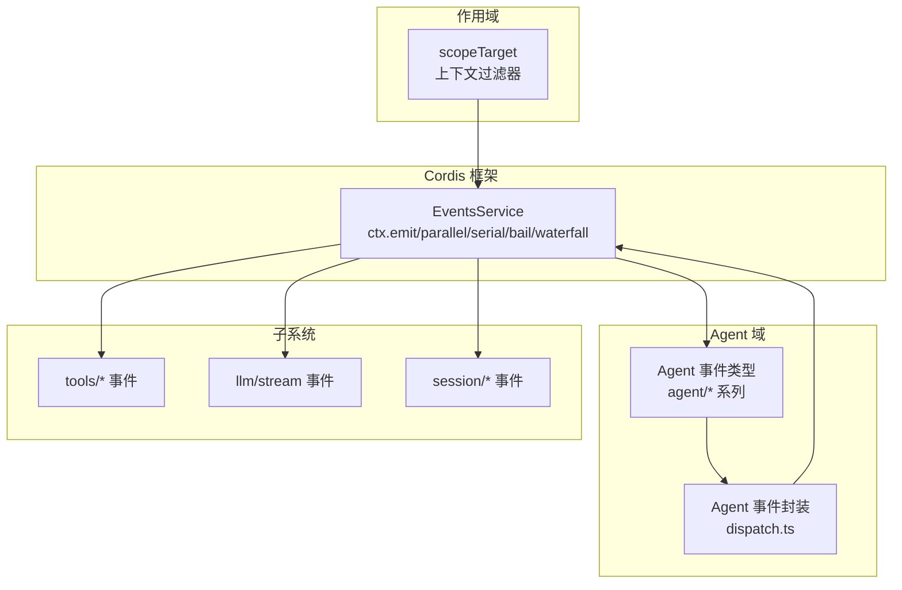
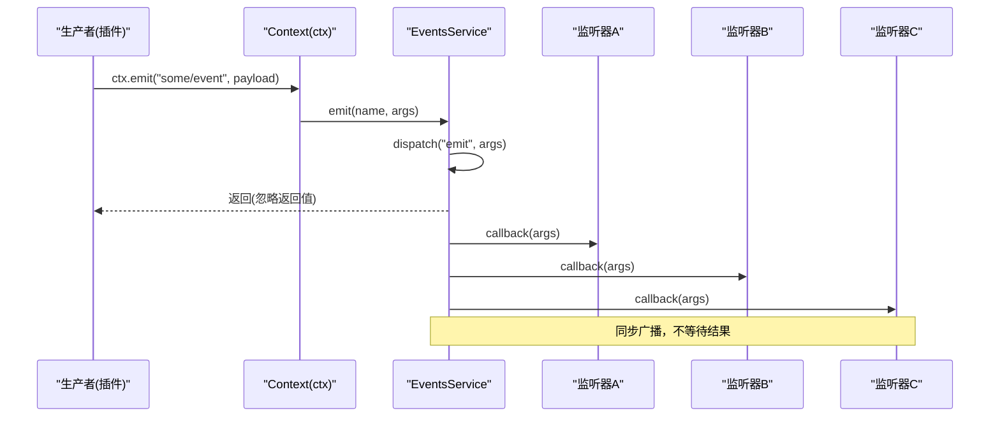
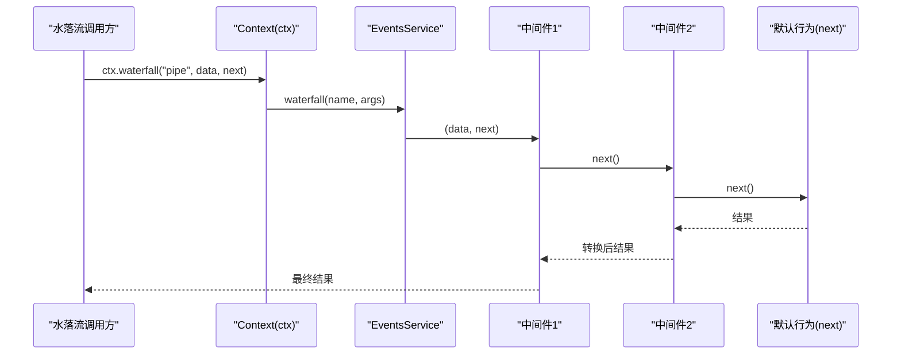
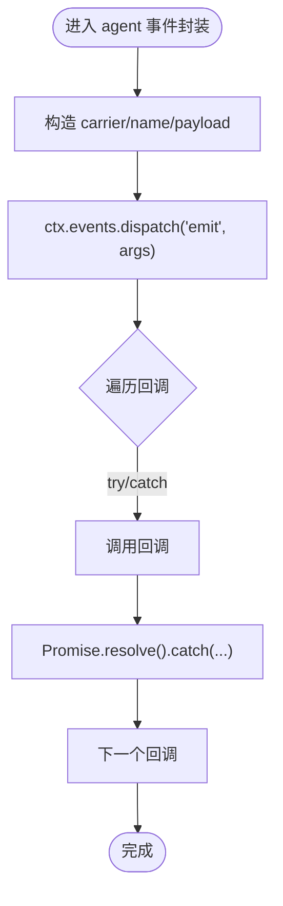
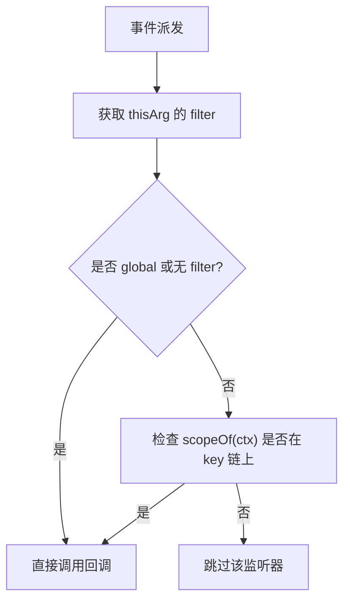
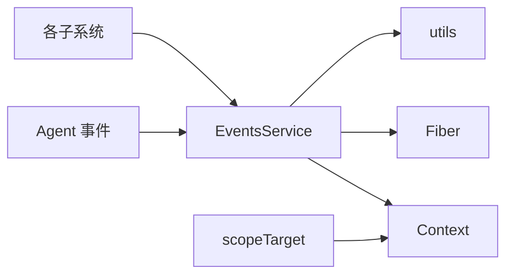

# 事件架构设计

<cite>
**本文引用的文件**
- [vendor/cordis/src/events.ts](file://vendor/cordis/src/events.ts)
- [docs/cordis-api/events.md](file://docs/cordis-api/events.md)
- [docs/event-producer-consumer.md](file://docs/event-producer-consumer.md)
- [docs/architecture.md](file://docs/architecture.md)
- [packages/core/agent/src/runtime-types.ts](file://packages/core/agent/src/runtime-types.ts)
- [packages/core/scope/src/index.ts](file://packages/core/scope/src/index.ts)
- [packages/core/agent/src/dispatch.ts](file://packages/core/agent/src/dispatch.ts)
- [docs/cordis-tutorial/04-events.md](file://docs/cordis-tutorial/04-events.md)
</cite>

## 目录
1. [简介](#简介)
2. [项目结构](#项目结构)
3. [核心组件](#核心组件)
4. [架构总览](#架构总览)
5. [详细组件分析](#详细组件分析)
6. [依赖关系分析](#依赖关系分析)
7. [性能考量](#性能考量)
8. [故障排查指南](#故障排查指南)
9. [结论](#结论)
10. [附录](#附录)

## 简介
本文件系统化阐述 DeepSeek Harness 的事件驱动架构，围绕发布-订阅模式、事件生产者与消费者职责分离、事件路由与过滤、消息传递语义（emit/parallel/serial/bail/waterfall）、以及事件系统在插件通信中的作用与最佳实践展开。文档同时提供架构图与数据流图，帮助读者快速理解事件总线如何贯穿会话、工具执行、LLM 调用、工作流等子系统，并支撑跨插件的松耦合协作。

## 项目结构
- 事件总线与分发模式定义位于 Cordis 框架层：[vendor/cordis/src/events.ts](file://vendor/cordis/src/events.ts)，提供 ctx.on/once/emit/parallel/serial/bail/waterfall 等 API，以及 EventsService 实现。
- 事件契约与使用方式在文档中集中说明：[docs/cordis-api/events.md](file://docs/cordis-api/events.md)。
- 全仓事件生产者-消费者矩阵由脚本生成，便于定位每个事件的声明位置、派发方与监听方：[docs/event-producer-consumer.md](file://docs/event-producer-consumer.md)。
- 高层架构与事件在系统中的角色说明见：[docs/architecture.md](file://docs/architecture.md)。
- Agent 域事件类型与生命周期事件集中在：[packages/core/agent/src/runtime-types.ts](file://packages/core/agent/src/runtime-types.ts)。
- 作用域过滤与范围传播机制在：[packages/core/scope/src/index.ts](file://packages/core/scope/src/index.ts)。
- Agent 事件封装与容错处理在：[packages/core/agent/src/dispatch.ts](file://packages/core/agent/src/dispatch.ts)。
- 教程示例展示事件声明、派发与监听：[docs/cordis-tutorial/04-events.md](file://docs/cordis-tutorial/04-events.md)。

图表来源
- [vendor/cordis/src/events.ts:131-319](file://vendor/cordis/src/events.ts#L131-L319)
- [packages/core/agent/src/runtime-types.ts:150-293](file://packages/core/agent/src/runtime-types.ts#L150-L293)
- [packages/core/scope/src/index.ts:158-185](file://packages/core/scope/src/index.ts#L158-L185)

章节来源
- [docs/architecture.md:53-62](file://docs/architecture.md#L53-L62)
- [docs/cordis-api/events.md:8-123](file://docs/cordis-api/events.md#L8-L123)

## 核心组件
- 事件总线 EventsService：维护监听器集合、支持多种分发模式、内置内部事件用于拦截与诊断、自动随 Fiber 生命周期释放监听器。
- 上下文 Context 扩展：通过模块合并将事件方法混入 ctx，使插件以统一 API 注册监听与派发事件。
- 事件类型系统：通过 TypeScript interface Events 声明事件名与签名，保证类型安全与可发现性。
- 作用域过滤：基于 Context.filter 与 scopeTarget 实现按 Agent/Scope 隔离的事件路由，避免跨作用域污染。
- 事件矩阵：自动生成各事件的生产者与消费者清单，辅助定位与治理。

章节来源
- [vendor/cordis/src/events.ts:119-319](file://vendor/cordis/src/events.ts#L119-L319)
- [docs/cordis-api/events.md:8-123](file://docs/cordis-api/events.md#L8-L123)
- [docs/event-producer-consumer.md:8-76](file://docs/event-producer-consumer.md#L8-L76)
- [packages/core/scope/src/index.ts:158-185](file://packages/core/scope/src/index.ts#L158-L185)

## 架构总览
事件驱动架构的核心是“解耦”：生产者只关心何时派发事件，不关心谁消费；消费者只关心何时收到事件，不关心谁生产。Harness 通过统一的 EventsService 提供五种分发模式，覆盖广播、并发、串行、短路、中间件式拦截等场景。

图表来源
- [vendor/cordis/src/events.ts:194-196](file://vendor/cordis/src/events.ts#L194-L196)
- [vendor/cordis/src/events.ts:165-175](file://vendor/cordis/src/events.ts#L165-L175)

图表来源
- [vendor/cordis/src/events.ts:234-243](file://vendor/cordis/src/events.ts#L234-L243)
- [docs/cordis-tutorial/04-events.md:94-140](file://docs/cordis-tutorial/04-events.md#L94-L140)

## 详细组件分析

### 事件总线 EventsService
- 职责：
  - 管理监听器集合 _hooks，支持 prepend/global 选项。
  - 提供 emit/parallel/serial/bail/waterfall 五种分发模式。
  - 通过 internal/listener/internal/update 等内部事件实现动态更新与拦截。
  - 通过 fiber.effect 自动释放监听器，避免内存泄漏。
- 关键流程：
  - dispatch(type, args)：解析 thisArg、name，触发 internal/dispatch 诊断事件，应用 Context.filter 过滤，绑定回调。
  - parallel：Promise.allSettled 收集所有监听器结果，聚合错误。
  - serial/bail：顺序执行，遇到 isBailed 即停止。
  - waterfall：最后一个参数作为 next，构建链式调用。
- 复杂度：
  - 分发时间复杂度 O(n)（n 为匹配监听器数量）。
  - parallel 空间复杂度 O(n)（保存 Promise 结果）。
- 优化点：
  - 对高频事件考虑批量合并或节流。
  - 对 waterfall 链过深时注意栈深度与性能。

章节来源
- [vendor/cordis/src/events.ts:131-319](file://vendor/cordis/src/events.ts#L131-L319)
- [docs/cordis-api/events.md:8-123](file://docs/cordis-api/events.md#L8-L123)

### 事件类型与声明
- 通过 interface Events 声明事件名与监听器签名，确保类型安全。
- 每个事件附带 @mode 标注（emit/parallel/serial/bail/waterfall），明确语义。
- 教程展示了如何在插件中声明、派发与监听事件。

章节来源
- [docs/cordis-api/events.md:8-123](file://docs/cordis-api/events.md#L8-L123)
- [docs/cordis-tutorial/04-events.md:7-92](file://docs/cordis-tutorial/04-events.md#L7-L92)

### Agent 事件与封装
- Agent 事件包括 agent/created、agent/disposed、agent/status、agent/inbox/*、agent/session-start、agent/pre-step、agent/request、agent/request-error、agent/turn-stopping、agent/error 等。
- 这些事件多为 waterfalls 或 emits，用于拦截请求、改写配置、控制步骤、上报错误等。
- Agent 事件封装在 dispatch.ts 中对 emit 进行容错包装，避免单个监听器异常影响其他监听器。

图表来源
- [packages/core/agent/src/dispatch.ts:117-149](file://packages/core/agent/src/dispatch.ts#L117-L149)

章节来源
- [packages/core/agent/src/runtime-types.ts:150-293](file://packages/core/agent/src/runtime-types.ts#L150-L293)
- [packages/core/agent/src/dispatch.ts:117-149](file://packages/core/agent/src/dispatch.ts#L117-L149)

### 事件路由与作用域过滤
- 作用域通过 scopeTarget 包裹接收者，结合 Context.filter 实现按 Agent/Scope 的路由。
- 规则：
  - 未标记监听器全局可见。
  - 标记监听器仅接收与其 key 或其祖先匹配的 event。
  - 保留基础 filter，允许组合过滤。
- 效果：同一事件可在不同 Agent 间隔离，避免串扰。

图表来源
- [vendor/cordis/src/events.ts:165-175](file://vendor/cordis/src/events.ts#L165-L175)
- [packages/core/scope/src/index.ts:158-185](file://packages/core/scope/src/index.ts#L158-L185)

章节来源
- [packages/core/scope/src/index.ts:158-185](file://packages/core/scope/src/index.ts#L158-L185)
- [vendor/cordis/src/events.ts:165-175](file://vendor/cordis/src/events.ts#L165-L175)

### 事件生产者与消费者矩阵
- 矩阵列出每个事件的声明位置、派发模式、派发方与监听方，便于理解事件流向与依赖。
- 典型事件：
  - session/created、session/disposed、session/event、session/flush：会话生命周期与持久化。
  - tools/execute、tools/pre-execute、tools/post-execute、tools/result：工具执行管道。
  - llm/stream：模型流式输出。
  - agent/*：代理状态、步骤、请求、错误等。
- 非 harness 或未声明的内部事件字符串也记录在内，便于排查。

章节来源
- [docs/event-producer-consumer.md:8-76](file://docs/event-producer-consumer.md#L8-L76)

### 事件系统与插件通信
- 插件通过声明 Events 接口获得类型安全的事件契约。
- 插件之间无需直接引用，只需订阅相应事件即可协作。
- 通过作用域隔离，插件可按 Agent/Session 维度订阅，避免全局污染。
- Waterfall 事件充当能力接缝，允许策略插件替换或增强默认行为。

章节来源
- [docs/cordis-tutorial/04-events.md:7-140](file://docs/cordis-tutorial/04-events.md#L7-L140)
- [docs/architecture.md:53-62](file://docs/architecture.md#L53-L62)

## 依赖关系分析
- EventsService 依赖 Context、Fiber、utils 中的 DisposableList 与 symbols。
- Agent 事件类型依赖 Scoped 与 Agent 领域模型。
- Scope 依赖 Context.filter 与 scopeParents 映射。
- 各子系统通过事件矩阵形成多对多依赖，但通过事件总线解耦。

图表来源
- [vendor/cordis/src/events.ts:1-6](file://vendor/cordis/src/events.ts#L1-L6)
- [packages/core/scope/src/index.ts:158-185](file://packages/core/scope/src/index.ts#L158-L185)

章节来源
- [vendor/cordis/src/events.ts:1-6](file://vendor/cordis/src/events.ts#L1-L6)
- [docs/event-producer-consumer.md:8-76](file://docs/event-producer-consumer.md#L8-L76)

## 性能考量
- 选择合适分发模式：
  - 高吞吐通知用 emit（同步广播，不等待）。
  - 需要全部完成再推进用 parallel（并发等待）。
  - 需要顺序且可短路用 serial/bail。
  - 需要拦截/改写用 waterfall。
- 监听器数量与复杂度：
  - 高频事件建议减少监听器数量或合并逻辑。
  - waterfall 链过长可能带来额外开销。
- 作用域过滤：
  - 合理划分 Scope，避免过多无关监听器参与分发。
- 错误隔离：
  - Agent 事件封装已做 try/catch 与 Promise 拒绝捕获，避免单点失败扩散。

章节来源
- [vendor/cordis/src/events.ts:183-243](file://vendor/cordis/src/events.ts#L183-L243)
- [packages/core/agent/src/dispatch.ts:117-149](file://packages/core/agent/src/dispatch.ts#L117-L149)

## 故障排查指南
- 事件未触发：
  - 检查事件名称与声明是否一致。
  - 确认监听器已通过 ctx.on/once 注册，且未被提前释放。
  - 检查作用域过滤是否排除了当前上下文。
- 监听器异常：
  - 查看日志中 “listener rejected/threw” 提示。
  - 对 waterfall 监听器确认是否正确调用 next()。
- 性能问题：
  - 使用事件矩阵定位热点事件与监听器数量。
  - 将并行任务拆分为多个事件或使用批处理。
- 调试手段：
  - 利用 internal/dispatch 观察事件分发路径。
  - 使用 ctx.reflect 与 logger 辅助定位。

章节来源
- [vendor/cordis/src/events.ts:165-175](file://vendor/cordis/src/events.ts#L165-L175)
- [packages/core/agent/src/dispatch.ts:117-149](file://packages/core/agent/src/dispatch.ts#L117-L149)

## 结论
Harness 的事件架构以 Cordis 事件总线为核心，通过类型化的事件契约、灵活的分发模式、作用域过滤与自动资源管理，实现了插件间的松耦合通信。事件矩阵提供了全局视图，便于治理与维护。遵循最佳实践（正确选择分发模式、合理使用 waterfall、作用域隔离、错误隔离）可显著提升系统的可维护性与可扩展性。

## 附录
- 事件模式速查：
  - emit：同步广播，忽略返回值。
  - parallel：并发等待所有监听器完成。
  - serial：顺序等待，首个有效返回值短路。
  - bail：同步版 serial。
  - waterfall：中间件式拦截，next() 控制链路。
- 推荐实践：
  - 使用 interface Events 声明事件，保持类型安全。
  - 对高频通知优先使用 emit，对需要编排的流程使用 waterfall。
  - 通过 scopeTarget 与 Context.filter 实现细粒度路由。
  - 借助事件矩阵持续审计事件依赖。

章节来源
- [docs/cordis-api/events.md:8-123](file://docs/cordis-api/events.md#L8-L123)
- [docs/event-producer-consumer.md:8-76](file://docs/event-producer-consumer.md#L8-L76)
- [docs/cordis-tutorial/04-events.md:80-140](file://docs/cordis-tutorial/04-events.md#L80-L140)