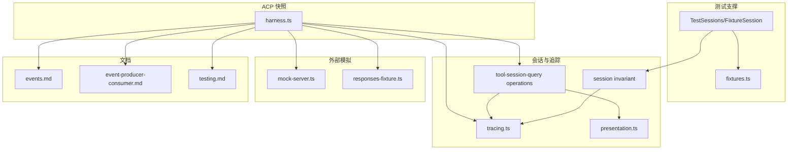
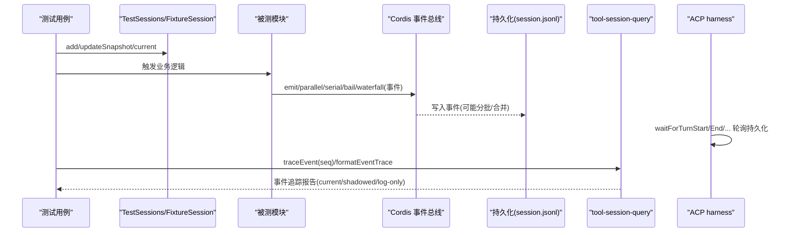
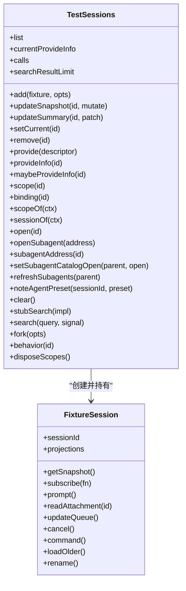
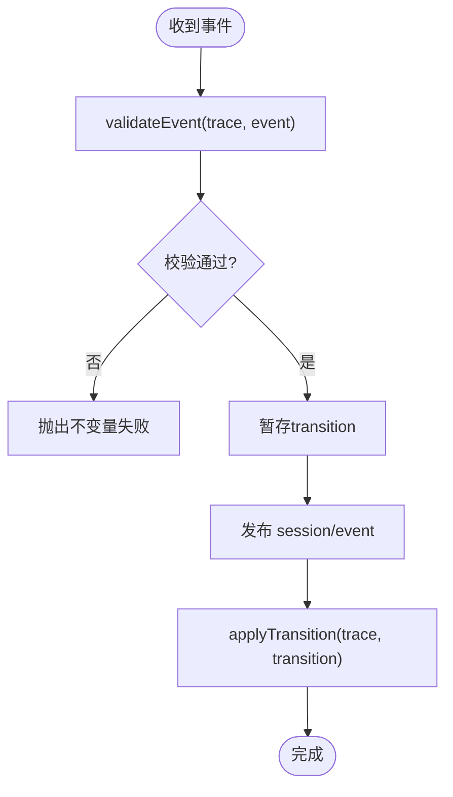
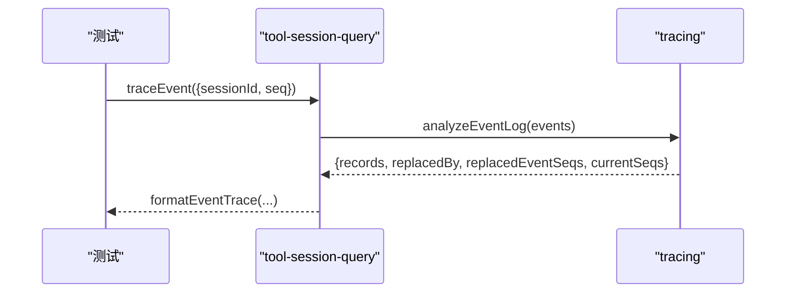
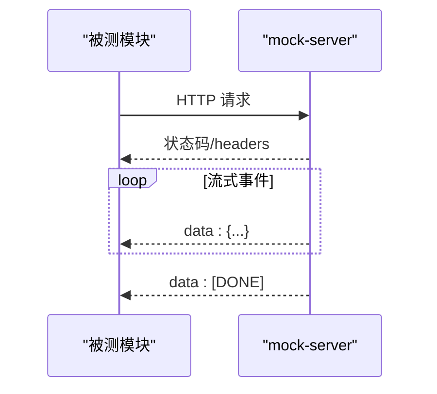
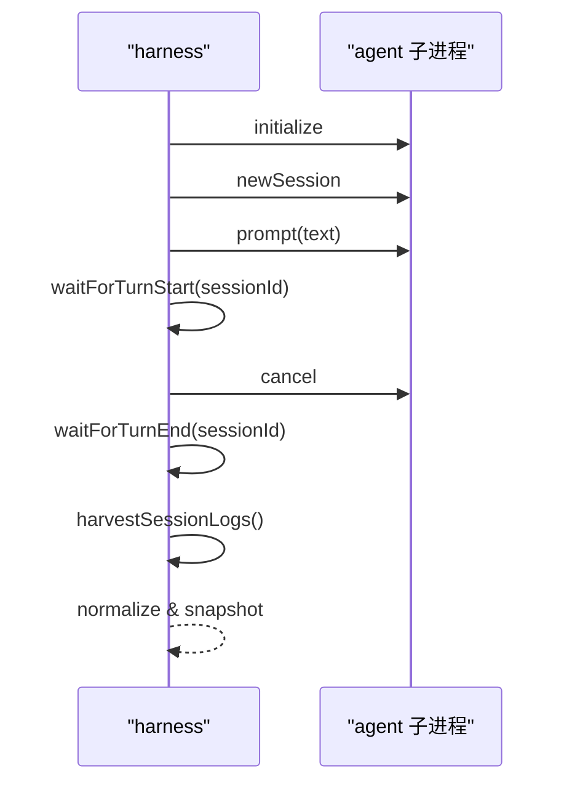
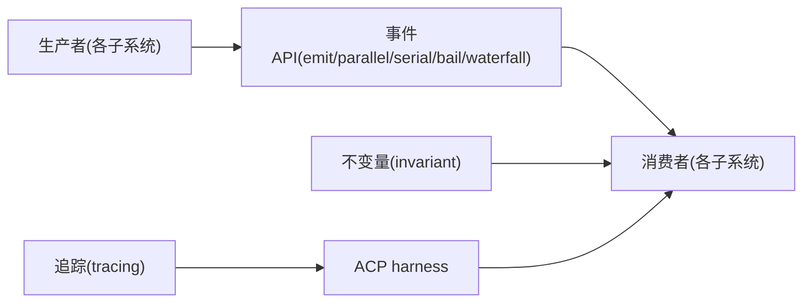

# 事件测试与调试

<cite>
**本文引用的文件**
- [packages/test-support/client-runtime/src/sessions.ts](file://packages/test-support/client-runtime/src/sessions.ts)
- [packages/test-support/client-runtime/src/fixtures.ts](file://packages/test-support/client-runtime/src/fixtures.ts)
- [packages/core/session/src/invariant.ts](file://packages/core/session/src/invariant.ts)
- [packages/session-query/session-query/src/tracing.ts](file://packages/session-query/session-query/src/tracing.ts)
- [packages/session-query/tool-session-query/src/operations.ts](file://packages/session-query/tool-session-query/src/operations.ts)
- [packages/session-query/tool-session-query/src/presentation.ts](file://packages/session-query/tool-session-query/src/presentation.ts)
- [packages/llm/llm-pi-ai/tests/mock-server.ts](file://packages/llm/llm-pi-ai/tests/mock-server.ts)
- [packages/subagent/subagent-codex/tests/responses-fixture.ts](file://packages/subagent/subagent-codex/tests/responses-fixture.ts)
- [packages/session-query/session-query-sqlite/tests/sqlite.spec.ts](file://packages/session-query/session-query-sqlite/tests/sqlite.spec.ts)
- [packages/test-support/acp-snapshot/src/harness.ts](file://packages/test-support/acp-snapshot/src/harness.ts)
- [docs/testing.md](file://docs/testing.md)
- [docs/cordis-api/events.md](file://docs/cordis-api/events.md)
- [docs/event-producer-consumer.md](file://docs/event-producer-consumer.md)
</cite>

## 目录
1. [简介](#简介)
2. [项目结构](#项目结构)
3. [核心组件](#核心组件)
4. [架构总览](#架构总览)
5. [详细组件分析](#详细组件分析)
6. [依赖关系分析](#依赖关系分析)
7. [性能考量](#性能考量)
8. [故障排查指南](#故障排查指南)
9. [结论](#结论)
10. [附录](#附录)

## 简介
本指南面向在 Harness 中编写“事件驱动”功能的测试与调试工程师，聚焦以下目标：
- 如何模拟和存根事件流（含并发、串行、瀑布等调度模式）
- 如何使用并配置事件测试框架（会话快照、ACP 快照、持久化回放）
- 如何检测与定位事件时序问题（不变量校验、追踪与分析）
- 事件测试最佳实践与常见陷阱
- 事件调试工具与日志分析方法
- 复杂事件场景的测试用例设计
- 事件性能分析与瓶颈识别技巧

## 项目结构
围绕事件测试与调试的关键代码分布在如下位置：
- 客户端运行时测试支撑：FixtureSession/TestSessions，提供会话级存根与投影能力
- 会话不变量与追踪：session invariant、tracing、tool-session-query 操作与呈现
- 外部边界模拟：LLM SSE 模拟服务器、子代理响应 fixture
- ACP 端到端快照：runScenario、输入脚本、等待条件、日志采集
- 文档与矩阵：事件 API、生产者/消费者矩阵、测试策略

图表来源
- [packages/test-support/client-runtime/src/sessions.ts:1-527](file://packages/test-support/client-runtime/src/sessions.ts#L1-L527)
- [packages/core/session/src/invariant.ts:1-251](file://packages/core/session/src/invariant.ts#L1-L251)
- [packages/session-query/session-query/src/tracing.ts:175-218](file://packages/session-query/session-query/src/tracing.ts#L175-L218)
- [packages/session-query/tool-session-query/src/operations.ts:200-214](file://packages/session-query/tool-session-query/src/operations.ts#L200-L214)
- [packages/session-query/tool-session-query/src/presentation.ts:207-255](file://packages/session-query/tool-session-query/src/presentation.ts#L207-L255)
- [packages/llm/llm-pi-ai/tests/mock-server.ts:28-61](file://packages/llm/llm-pi-ai/tests/mock-server.ts#L28-L61)
- [packages/subagent/subagent-codex/tests/responses-fixture.ts:271-305](file://packages/subagent/subagent-codex/tests/responses-fixture.ts#L271-L305)
- [packages/test-support/acp-snapshot/src/harness.ts:225-374](file://packages/test-support/acp-snapshot/src/harness.ts#L225-L374)
- [docs/cordis-api/events.md:1-208](file://docs/cordis-api/events.md#L1-L208)
- [docs/event-producer-consumer.md:1-77](file://docs/event-producer-consumer.md#L1-L77)
- [docs/testing.md:1-50](file://docs/testing.md#L1-L50)

章节来源
- [docs/testing.md:1-50](file://docs/testing.md#L1-L50)
- [docs/cordis-api/events.md:1-208](file://docs/cordis-api/events.md#L1-L208)
- [docs/event-producer-consumer.md:1-77](file://docs/event-producer-consumer.md#L1-L77)

## 核心组件
- 会话存根与投影（FixtureSession/TestSessions）
  - 通过 TestSessions.add 注入会话，使用 FixtureSession 暴露行为面；未覆盖的方法默认抛错，避免“半工作”假象
  - 支持 updateSnapshot/updateSummary/current/fork/search 等常用操作的记录与断言
  - 提供 scope/provideInfo/binding 等生产镜像能力，便于在真实作用域内验证服务解析
- 会话不变量（invariant）
  - 对 session 事件序列进行严格校验：seq 单调递增、turn/step 成对闭合、tool/call 与 tool/result 配对、步骤内上下文事件约束等
  - 以 pre-commit 阶段验证 + post-commit 应用过渡的方式保证一致性
- 事件追踪与分析（tracing）
  - 将事件折叠为“当前表面”，标注 current/shadowed/log-only，并维护 replacedBy/replacedEventSeqs 映射，便于定位被替换的事件
- 工具侧事件查询（tool-session-query）
  - 提供 traceEvent/formatEventTrace 等操作，结合 presentation 输出可读的事件追踪结果
- 外部边界模拟
  - LLM SSE mock-server：按脚本顺序返回状态码、SSE events、延迟、请求头捕获
  - 子代理 responses-fixture：构造 text/event-stream 响应，支持 complete/functionCall/hold 等行为
- ACP 快照运行器（harness）
  - 启动真实 agent 子进程，通过 JSON-RPC 驱动输入脚本，等待持久化状态（turn/start/end、goal phase、inbox message、title、任意事件），采集 session.jsonl 并归一化用于快照比对

章节来源
- [packages/test-support/client-runtime/src/sessions.ts:18-140](file://packages/test-support/client-runtime/src/sessions.ts#L18-L140)
- [packages/test-support/client-runtime/src/sessions.ts:171-527](file://packages/test-support/client-runtime/src/sessions.ts#L171-L527)
- [packages/test-support/client-runtime/src/fixtures.ts:9-41](file://packages/test-support/client-runtime/src/fixtures.ts#L9-L41)
- [packages/core/session/src/invariant.ts:54-166](file://packages/core/session/src/invariant.ts#L54-L166)
- [packages/core/session/src/invariant.ts:189-242](file://packages/core/session/src/invariant.ts#L189-L242)
- [packages/session-query/session-query/src/tracing.ts:175-218](file://packages/session-query/session-query/src/tracing.ts#L175-L218)
- [packages/session-query/tool-session-query/src/operations.ts:200-214](file://packages/session-query/tool-session-query/src/operations.ts#L200-L214)
- [packages/session-query/tool-session-query/src/presentation.ts:207-255](file://packages/session-query/tool-session-query/src/presentation.ts#L207-L255)
- [packages/llm/llm-pi-ai/tests/mock-server.ts:28-61](file://packages/llm/llm-pi-ai/tests/mock-server.ts#L28-L61)
- [packages/subagent/subagent-codex/tests/responses-fixture.ts:271-305](file://packages/subagent/subagent-codex/tests/responses-fixture.ts#L271-L305)
- [packages/test-support/acp-snapshot/src/harness.ts:225-374](file://packages/test-support/acp-snapshot/src/harness.ts#L225-L374)

## 架构总览
下图展示从测试到事件流的完整链路：测试通过 TestSessions/FixtureSession 注入会话与行为，调用被测模块触发事件；事件经 Cordis 分发（emit/parallel/serial/bail/waterfall），由监听者处理；持久化层写入 session.jsonl；ACP harness 驱动真实子进程并通过 wait* 函数等待关键事件落盘；tracing 与 tool-session-query 提供事件回溯与可视化。

图表来源
- [packages/test-support/client-runtime/src/sessions.ts:222-316](file://packages/test-support/client-runtime/src/sessions.ts#L222-L316)
- [docs/cordis-api/events.md:8-123](file://docs/cordis-api/events.md#L8-L123)
- [packages/test-support/acp-snapshot/src/harness.ts:518-681](file://packages/test-support/acp-snapshot/src/harness.ts#L518-L681)
- [packages/session-query/tool-session-query/src/operations.ts:200-214](file://packages/session-query/tool-session-query/src/operations.ts#L200-L214)
- [packages/session-query/session-query/src/tracing.ts:175-218](file://packages/session-query/session-query/src/tracing.ts#L175-L218)

## 详细组件分析

### 组件A：会话存根与测试会话（FixtureSession/TestSessions）
- 设计要点
  - 失败即报错：未 stub 的行为方法直接抛错，确保“未声明即不存在”
  - 投影面：projections.faceOf/set 提供稳定的 per-key 可观察值，便于 UI/渲染侧断言
  - 生命周期：add/remove/updateSnapshot/updateSummary/current/fork/search 等方法均记录调用，便于断言
  - 作用域：scope()/binding() 复用生产 createScope，使服务解析与依赖注入路径一致
- 复杂度与性能
  - 列表与快照更新通过 SnapshotStore 批量稳定化，减少重渲染
  - provideInfo 惰性计算，避免重复构建标准属性包
- 错误处理
  - 未知 id、重复添加、未添加的 require 均抛出明确错误
- 优化建议
  - 大量会话时注意 disposeScopes 释放作用域 fiber
  - 使用 stubSearch 替代真实搜索，提升稳定性

图表来源
- [packages/test-support/client-runtime/src/sessions.ts:25-140](file://packages/test-support/client-runtime/src/sessions.ts#L25-L140)
- [packages/test-support/client-runtime/src/sessions.ts:171-527](file://packages/test-support/client-runtime/src/sessions.ts#L171-L527)

章节来源
- [packages/test-support/client-runtime/src/sessions.ts:18-140](file://packages/test-support/client-runtime/src/sessions.ts#L18-L140)
- [packages/test-support/client-runtime/src/sessions.ts:171-527](file://packages/test-support/client-runtime/src/sessions.ts#L171-L527)
- [packages/test-support/client-runtime/src/fixtures.ts:9-41](file://packages/test-support/client-runtime/src/fixtures.ts#L9-L41)

### 组件B：会话事件不变量校验（invariant）
- 规则要点
  - seq 严格递增
  - turn/start 与 turn/end 成对且顺序正确
  - step/start 与 step/end 成对，且在 turn 内
  - assistant/chunk/message、request/header/context 等必须在 open step 内
  - tool/call 与 tool/result 配对，result 必须对应前序 call（或合成 not-started）
- 实现机制
  - validateEvent 纯校验生成 transition
  - internal/dispatch 拦截 session/event 预提交，session/event 发布后应用 transition
- 适用场景
  - 单元测试快速发现事件顺序/配对错误
  - e2e 回放前校验持久化事件合法性

图表来源
- [packages/core/session/src/invariant.ts:54-166](file://packages/core/session/src/invariant.ts#L54-L166)
- [packages/core/session/src/invariant.ts:189-242](file://packages/core/session/src/invariant.ts#L189-L242)

章节来源
- [packages/core/session/src/invariant.ts:54-166](file://packages/core/session/src/invariant.ts#L54-L166)
- [packages/core/session/src/invariant.ts:189-242](file://packages/core/session/src/invariant.ts#L189-L242)

### 组件C：事件追踪与分析（tracing + tool-session-query）
- tracing 能力
  - foldSurface 将事件折叠为“当前可见表面”，标记 current/shadowed/log-only
  - 维护 replacedBy/replacedEventSeqs，便于定位被替换事件的原始 seq
- tool-session-query
  - executeEventTrace 获取指定 seq 的事件追踪
  - presentation.formatEventTrace 输出人类可读的追踪信息
- 典型用法
  - 在 e2e 或快照场景中，断言某事件是否被后续事件替换
  - 定位“影子事件”的来源与影响范围

图表来源
- [packages/session-query/session-query/src/tracing.ts:175-218](file://packages/session-query/session-query/src/tracing.ts#L175-L218)
- [packages/session-query/tool-session-query/src/operations.ts:200-214](file://packages/session-query/tool-session-query/src/operations.ts#L200-L214)
- [packages/session-query/tool-session-query/src/presentation.ts:207-255](file://packages/session-query/tool-session-query/src/presentation.ts#L207-L255)

章节来源
- [packages/session-query/session-query/src/tracing.ts:175-218](file://packages/session-query/session-query/src/tracing.ts#L175-L218)
- [packages/session-query/tool-session-query/src/operations.ts:200-214](file://packages/session-query/tool-session-query/src/operations.ts#L200-L214)
- [packages/session-query/tool-session-query/src/presentation.ts:207-255](file://packages/session-query/tool-session-query/src/presentation.ts#L207-L255)

### 组件D：外部边界模拟（LLM SSE 与子代理响应）
- LLM SSE mock-server
  - 按脚本顺序消费请求，返回状态码/SSE events/延迟/请求头
  - 适合模拟模型流式响应、错误、超时等边界
- 子代理 responses-fixture
  - 构造 text/event-stream，支持 complete/functionCall/hold
  - 适合模拟子代理的工具调用、中断、完成等流程

图表来源
- [packages/llm/llm-pi-ai/tests/mock-server.ts:28-61](file://packages/llm/llm-pi-ai/tests/mock-server.ts#L28-L61)
- [packages/subagent/subagent-codex/tests/responses-fixture.ts:271-305](file://packages/subagent/subagent-codex/tests/responses-fixture.ts#L271-L305)

章节来源
- [packages/llm/llm-pi-ai/tests/mock-server.ts:28-61](file://packages/llm/llm-pi-ai/tests/mock-server.ts#L28-L61)
- [packages/subagent/subagent-codex/tests/responses-fixture.ts:271-305](file://packages/subagent/subagent-codex/tests/responses-fixture.ts#L271-L305)

### 组件E：ACP 快照运行器（harness）
- 能力
  - 启动真实 agent 子进程，通过 JSON-RPC 驱动输入脚本
  - 提供多种 wait* 函数等待持久化状态：turn/start、turn/end、goal phase、inbox message、title、任意事件类型
  - 采集 session.jsonl 并归一化，用于快照比对
- 典型流程
  - initialize -> newSession -> prompt -> waitForTurnStart/End -> cancel -> harvest logs

图表来源
- [packages/test-support/acp-snapshot/src/harness.ts:225-374](file://packages/test-support/acp-snapshot/src/harness.ts#L225-L374)
- [packages/test-support/acp-snapshot/src/harness.ts:376-516](file://packages/test-support/acp-snapshot/src/harness.ts#L376-L516)
- [packages/test-support/acp-snapshot/src/harness.ts:518-681](file://packages/test-support/acp-snapshot/src/harness.ts#L518-L681)

章节来源
- [packages/test-support/acp-snapshot/src/harness.ts:225-374](file://packages/test-support/acp-snapshot/src/harness.ts#L225-L374)
- [packages/test-support/acp-snapshot/src/harness.ts:376-516](file://packages/test-support/acp-snapshot/src/harness.ts#L376-L516)
- [packages/test-support/acp-snapshot/src/harness.ts:518-681](file://packages/test-support/acp-snapshot/src/harness.ts#L518-L681)

### 组件F：持久化测试桩（sqlite 测试）
- 用途
  - 模拟 load/inspect，注入 failure/loadEffect/inspectEffect 等钩子，便于测试异常路径与取消信号
- 典型用法
  - 在 inspect 中注入 effect，验证异步回调与信号传播

章节来源
- [packages/session-query/session-query-sqlite/tests/sqlite.spec.ts:129-152](file://packages/session-query/session-query-sqlite/tests/sqlite.spec.ts#L129-L152)

## 依赖关系分析
- 事件调度模式
  - emit：同步执行，忽略返回值
  - parallel：并行执行所有监听器，全部完成后 resolve
  - serial：按序 await，直到某个监听器 bail
  - bail：同步 bail 短路
  - waterfall：链式 next，允许拦截与改写
- 生产者/消费者矩阵
  - 通过 event-producer-consumer 文档可快速定位某事件的声明、分发者与监听者
- 耦合与内聚
  - TestSessions 与 FixtureSession 高内聚于“会话测试双体”
  - invariant 与 tracing 解耦：前者负责一致性，后者负责可视化和溯源
  - harness 与外部模拟低耦合：通过 JSON-RPC 与 SSE 协议交互

图表来源
- [docs/cordis-api/events.md:8-123](file://docs/cordis-api/events.md#L8-L123)
- [docs/event-producer-consumer.md:1-77](file://docs/event-producer-consumer.md#L1-L77)
- [packages/core/session/src/invariant.ts:189-242](file://packages/core/session/src/invariant.ts#L189-L242)
- [packages/session-query/session-query/src/tracing.ts:175-218](file://packages/session-query/session-query/src/tracing.ts#L175-L218)
- [packages/test-support/acp-snapshot/src/harness.ts:225-374](file://packages/test-support/acp-snapshot/src/harness.ts#L225-L374)

章节来源
- [docs/cordis-api/events.md:8-123](file://docs/cordis-api/events.md#L8-L123)
- [docs/event-producer-consumer.md:1-77](file://docs/event-producer-consumer.md#L1-L77)

## 性能考量
- 事件批处理与稳定化
  - TestSessions 使用 SnapshotStore 与 stabilize 包装，批量更新避免频繁通知
- 并发与阻塞
  - parallel 模式需关注监听器耗时；必要时拆分监听器或使用 serial/bail 控制
  - waterfall 模式应避免在 next 之前做昂贵 I/O
- 持久化与回放
  - ACP harness 的 wait* 采用轮询间隔与超时，避免无限等待；合理设置 timeoutMs
  - 回放模式下，JSONL 读取与归一化应缓存，避免重复 IO
- 内存与对象生命周期
  - 及时 disposeScopes 释放作用域 fiber；避免在测试中保留长生命周期引用
- 瓶颈识别技巧
  - 使用 tracing 的 replacedBy/replacedEventSeqs 定位热点事件
  - 在 harness 中记录每步耗时，结合 stderr 与 stdout 定位慢点
  - 对 LLM SSE mock-server 增加 delayMs 模拟网络抖动，观察系统恢复能力

[本节为通用指导，不直接分析具体文件]

## 故障排查指南
- 事件时序问题
  - 使用 invariant 快速定位 seq 不增、turn/step 不匹配、tool/call-result 不成对等问题
  - 使用 tracing 查看事件是否被替换，定位 shadowed 事件
- 事件未触发或未生效
  - 检查事件分发模式是否正确（waterfall 需要调用 next）
  - 确认监听器注册时机与作用域（global 选项）
  - 通过 TestSessions.calls 断言是否调用了预期方法
- 外部依赖不稳定
  - 使用 mock-server 固定响应与延迟，隔离网络波动
  - 使用 responses-fixture 固定子代理行为，避免随机性
- 持久化不一致
  - 使用 harness 的 wait* 等待 turn/end 后再断言
  - 使用 sqlite 测试桩注入 effect，验证异步路径
- 常见问题与修复
  - 未 stub 的行为导致抛错：补全 FixtureSession 的行为面
  - 事件未落盘：延长 wait* 超时或检查 flush/关闭流程
  - 回放失败：核对 JSONL 头部与子会话顺序

章节来源
- [packages/core/session/src/invariant.ts:54-166](file://packages/core/session/src/invariant.ts#L54-L166)
- [packages/session-query/session-query/src/tracing.ts:175-218](file://packages/session-query/session-query/src/tracing.ts#L175-L218)
- [packages/test-support/client-runtime/src/sessions.ts:171-527](file://packages/test-support/client-runtime/src/sessions.ts#L171-L527)
- [packages/llm/llm-pi-ai/tests/mock-server.ts:28-61](file://packages/llm/llm-pi-ai/tests/mock-server.ts#L28-L61)
- [packages/subagent/subagent-codex/tests/responses-fixture.ts:271-305](file://packages/subagent/subagent-codex/tests/responses-fixture.ts#L271-L305)
- [packages/test-support/acp-snapshot/src/harness.ts:518-681](file://packages/test-support/acp-snapshot/src/harness.ts#L518-L681)

## 结论
- 通过 TestSessions/FixtureSession 可精确控制会话状态与行为，避免“半工作”假象
- 使用 invariant 与 tracing 可在单元与 e2e 层面保障事件一致性与可追溯性
- ACP harness 提供强大的端到端能力，配合 wait* 与日志采集，覆盖复杂事件场景
- 外部边界通过 mock-server 与 responses-fixture 稳定可控，利于回归与性能测试
- 遵循测试策略与最佳实践，可有效降低事件相关缺陷与回归风险

[本节为总结，不直接分析具体文件]

## 附录

### 事件测试最佳实践
- 优先使用真实实现，仅对昂贵或非确定性边界进行模拟（如 LLM、网络、时钟）
- 使用 keyless 快照测试覆盖外部行为；with-key 测试覆盖真实 API 冒烟
- 断言外部世界而非自我报告：重新运行命令或读取文件，保持字节级一致
- 测试入口路径要贴近发布产物，避免 tsx 掩盖的问题
- 子进程测试统一通过共享 launcher 启动，避免手工 --import tsx

章节来源
- [docs/testing.md:17-49](file://docs/testing.md#L17-L49)

### 复杂事件场景测试用例设计示例
- 多轮对话与工具调用
  - 使用 TestSessions.updateSnapshot 逐步推进对话，断言 assistant/message 与 tool/call-result 配对
- 取消与恢复
  - 使用 harness 的 promptAndCancel/waitForTurnEnd，验证取消后状态与持久化
- 子代理嵌套
  - 使用 responses-fixture 模拟 functionCall/complete，验证子代理生命周期事件
- 权限审批
  - 使用 harness 的 permissionAnswers 队列，断言不同审批策略下的事件流
- 标题与目标阶段
  - 使用 waitForTitleAfterTurnEnd/waitForGoalPhase 等待最终状态

章节来源
- [packages/test-support/acp-snapshot/src/harness.ts:376-516](file://packages/test-support/acp-snapshot/src/harness.ts#L376-L516)
- [packages/subagent/subagent-codex/tests/responses-fixture.ts:271-305](file://packages/subagent/subagent-codex/tests/responses-fixture.ts#L271-L305)

### 事件调试工具与日志分析方法
- 使用 tool-session-query.traceEvent 获取特定 seq 的事件追踪
- 使用 tracing 的 surface 字段区分 current/shadowed/log-only，定位被替换事件
- 在 harness 中收集 stderr/stdout，结合 wait* 失败信息定位问题
- 使用 sqlite 测试桩注入 effect，验证异步回调与信号传播

章节来源
- [packages/session-query/tool-session-query/src/operations.ts:200-214](file://packages/session-query/tool-session-query/src/operations.ts#L200-L214)
- [packages/session-query/session-query/src/tracing.ts:175-218](file://packages/session-query/session-query/src/tracing.ts#L175-L218)
- [packages/test-support/acp-snapshot/src/harness.ts:225-374](file://packages/test-support/acp-snapshot/src/harness.ts#L225-L374)
- [packages/session-query/session-query-sqlite/tests/sqlite.spec.ts:129-152](file://packages/session-query/session-query-sqlite/tests/sqlite.spec.ts#L129-L152)