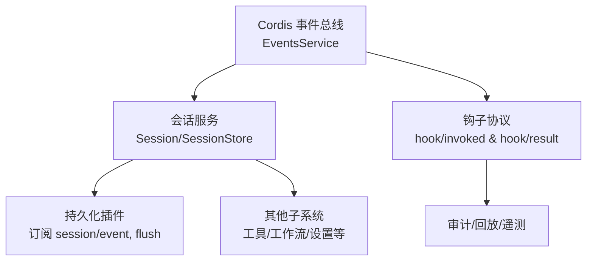
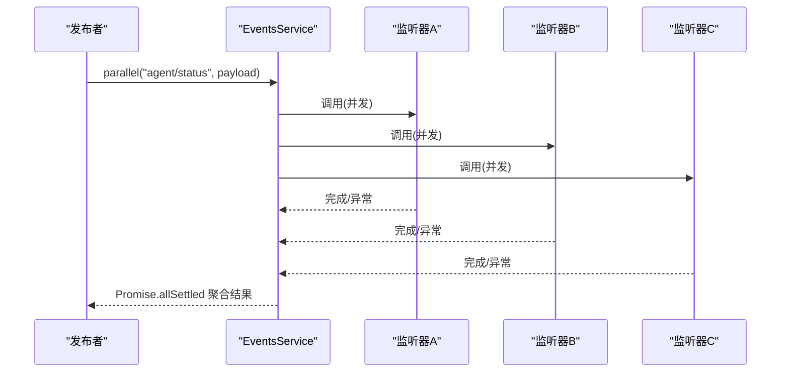
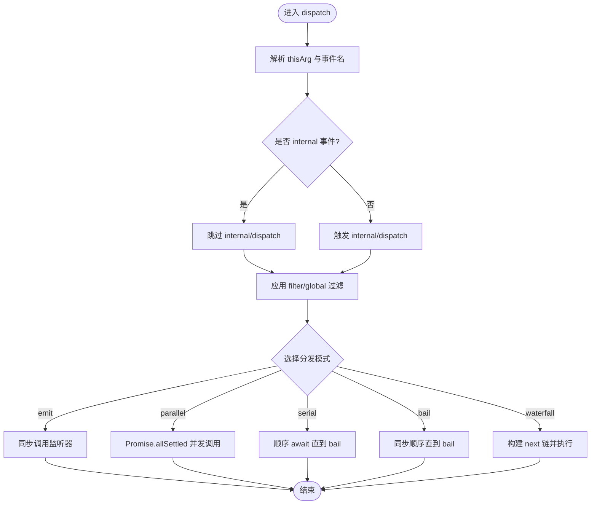
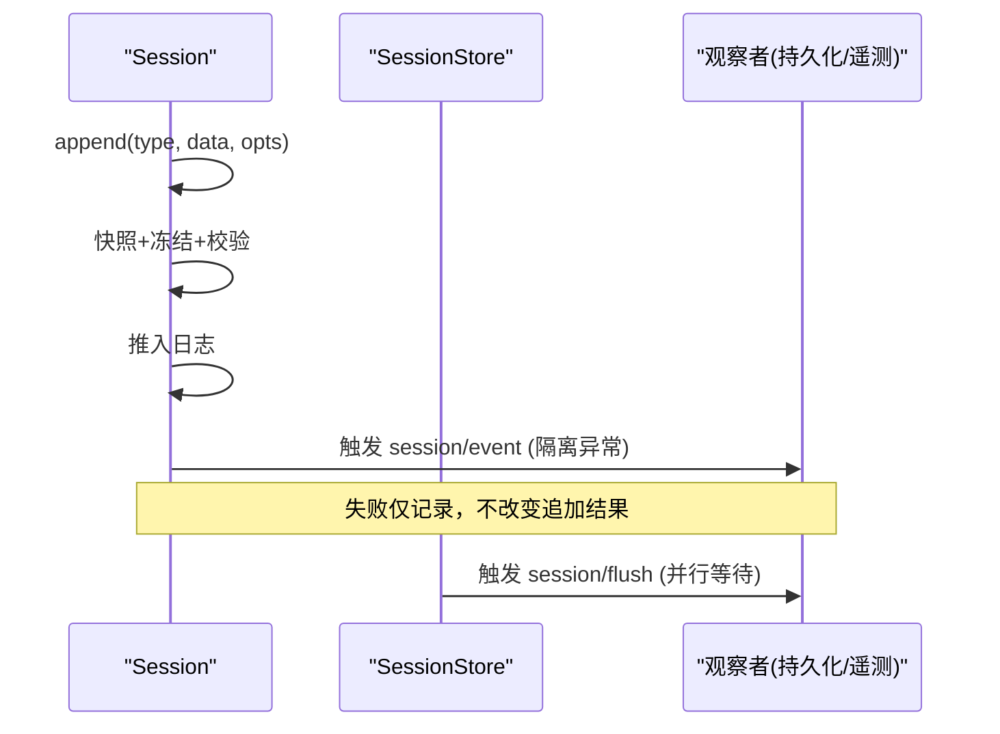
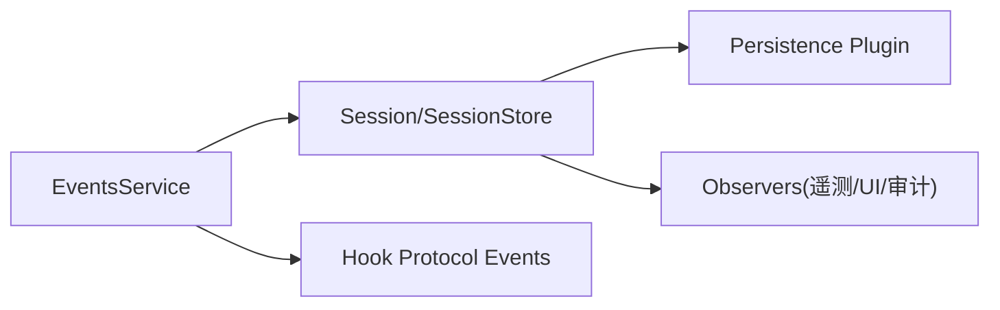

# 事件系统

<cite>
**本文引用的文件**
- [events.ts](file://vendor/cordis/src/events.ts)
- [events.md](file://docs/cordis-api/events.md)
- [event-producer-consumer.md](file://docs/event-producer-consumer.md)
- [index.ts（会话服务）](file://packages/core/session/src/index.ts)
- [events.ts（钩子协议）](file://packages/hooks/hook-protocol/src/events.ts)
- [testing.md](file://docs/testing.md)
</cite>

## 目录
1. [简介](#简介)
2. [项目结构](#项目结构)
3. [核心组件](#核心组件)
4. [架构总览](#架构总览)
5. [详细组件分析](#详细组件分析)
6. [依赖关系分析](#依赖关系分析)
7. [性能考虑](#性能考虑)
8. [故障排查指南](#故障排查指南)
9. [结论](#结论)
10. [附录](#附录)

## 简介
本文件系统性地文档化 Harness 的事件驱动架构与实现机制，覆盖事件发布/订阅、过滤与路由、生命周期与错误处理、处理器开发指南、序列化与持久化策略、插件通信场景、性能优化与内存管理最佳实践，以及测试与调试方法。该事件系统以 Cordis 的 EventsService 为核心，提供多种分发模式（同步、并行、串行、短路、瀑布流），并通过上下文注入与 Fiber 生命周期自动管理监听器注册与释放。会话子系统基于事件溯源，将事件作为唯一事实源，配合持久化插件完成落盘与回放。

## 项目结构
- 事件总线与分发模式定义位于 vendor/cordis/src/events.ts，并在 docs/cordis-api/events.md 中生成 API 文档。
- 各子系统通过 Context.Events 暴露 ctx.emit/parallel/serial/bail/waterfall/on/once 等能力。
- 会话子系统 packages/core/session/src/index.ts 实现了事件溯源的 Session/SessionStore，并声明 session/* 系列事件。
- 钩子协议在 packages/hooks/hook-protocol/src/events.ts 中以事件形式记录 hook 调用与结果，确保可审计与可回放。
- 事件生产者/消费者矩阵由 docs/event-producer-consumer.md 维护，展示跨包事件关系。

图表来源
- [events.ts:131-319](file://vendor/cordis/src/events.ts#L131-L319)
- [index.ts（会话服务）:42-86](file://packages/core/session/src/index.ts#L42-L86)
- [events.ts（钩子协议）:70-104](file://packages/hooks/hook-protocol/src/events.ts#L70-L104)

章节来源
- [events.ts:131-319](file://vendor/cordis/src/events.ts#L131-L319)
- [events.md:1-208](file://docs/cordis-api/events.md#L1-L208)
- [event-producer-consumer.md:1-77](file://docs/event-producer-consumer.md#L1-L77)
- [index.ts（会话服务）:1-86](file://packages/core/session/src/index.ts#L1-L86)
- [events.ts（钩子协议）:1-105](file://packages/hooks/hook-protocol/src/events.ts#L1-L105)

## 核心组件
- 事件总线 EventsService：提供 emit/parallel/serial/bail/waterfall 五种分发模式；支持 on/once 注册监听器；内置 internal/* 内部事件用于拦截与诊断；按 Fiber 生命周期自动管理监听器。
- 会话服务 Session/SessionStore：事件溯源存储，append-only 日志；声明 session/created、session/disposed、session/event、session/flush 等事件；对事件进行 JSON 序列化校验与冻结；派生消息历史。
- 钩子协议事件：以事件形式记录 hook 调用与结果，保证可审计与可回放。

章节来源
- [events.ts:131-319](file://vendor/cordis/src/events.ts#L131-L319)
- [index.ts（会话服务）:42-86](file://packages/core/session/src/index.ts#L42-L86)
- [events.ts（钩子协议）:70-104](file://packages/hooks/hook-protocol/src/events.ts#L70-L104)

## 架构总览
事件系统采用“总线 + 领域事件”的分层设计：
- 底层：Cordis EventsService 提供通用分发能力与生命周期集成。
- 中层：各子系统（如会话、工具、工作流、设置等）声明并消费领域事件。
- 上层：持久化、遥测、UI 等横切关注点通过订阅事件完成副作用。

图表来源
- [events.ts:183-187](file://vendor/cordis/src/events.ts#L183-L187)

章节来源
- [events.ts:183-243](file://vendor/cordis/src/events.ts#L183-L243)

## 详细组件分析

### 事件总线 EventsService
- 分发模式
  - emit：同步触发，不等待返回值。
  - parallel：并发执行所有监听器，聚合异常为 AggregateError。
  - serial：顺序 await，遇到首个“bail 值”即停止。
  - bail：同步顺序，遇到首个“bail 值”即停止。
  - waterfall：最后一个参数为 next 回调，监听器可决定是否继续链式调用。
- 监听器注册
  - on/once：绑定到当前 Fiber，随 Fiber 销毁自动移除；支持 prepend 与 global 选项。
- 过滤与路由
  - 通过 thisArg 上的 Context.filter 进行上下文过滤；global 选项可绕过过滤。
  - internal/dispatch 暴露所有非 internal 事件的派发信息，便于诊断与监控。
- 生命周期
  - 监听器以 effect 形式注册，Fiber 卸载时统一回收，避免内存泄漏。

图表来源
- [events.ts:165-243](file://vendor/cordis/src/events.ts#L165-L243)

章节来源
- [events.ts:165-243](file://vendor/cordis/src/events.ts#L165-L243)
- [events.md:8-123](file://docs/cordis-api/events.md#L8-L123)

### 会话事件与事件溯源
- 事件模型
  - session/created：会话创建公告，抛错会回滚。
  - session/disposed：会话离开 store 时触发一次。
  - session/event：追加后的“只读”事件流，失败被隔离且不影响追加。
  - session/flush：并行等待的持久化检查点。
- 追加流程
  - 数据快照与冻结，表面元数据校验，序列号连续性约束。
  - 先入日志再通知观察者，失败隔离，保证追加幂等与一致性。
- 派生消息
  - 基于有序 surface 节点推导 LLM 消息历史，缓存增量更新。

图表来源
- [index.ts（会话服务）:604-655](file://packages/core/session/src/index.ts#L604-L655)
- [index.ts（会话服务）:42-86](file://packages/core/session/src/index.ts#L42-L86)

章节来源
- [index.ts（会话服务）:42-86](file://packages/core/session/src/index.ts#L42-L86)
- [index.ts（会话服务）:604-655](file://packages/core/session/src/index.ts#L604-L655)

### 钩子协议事件
- 以事件形式记录每次 hook 调用与结果，包含 turn、point、dialect、handlerId、decision、stderrSummary、durationMs 等字段。
- 适用于跨进程/桥接的审计与回放，保持事件边界与成对性。

章节来源
- [events.ts（钩子协议）:70-104](file://packages/hooks/hook-protocol/src/events.ts#L70-L104)

### 事件生命周期与错误处理
- 生命周期
  - 监听器随 Fiber 创建而注册，随 Fiber 销毁而自动移除。
  - once 监听器首次调用后自动注销。
- 错误处理
  - parallel：聚合所有拒绝为 AggregateError。
  - emit：忽略返回值，异常由监听器自身捕获或传播。
  - serial/bail：遇到首个“bail 值”立即停止。
  - waterfall：未调用 next 即视为否决后续链。
  - 会话观察者：每个监听器异常被捕获并记录，不影响其他监听器与追加。

章节来源
- [events.ts:183-243](file://vendor/cordis/src/events.ts#L183-L243)
- [index.ts（会话服务）:376-399](file://packages/core/session/src/index.ts#L376-L399)

### 事件处理器（Event Handler）开发指南
- 注册方式
  - 使用 ctx.on(name, listener, options) 或 ctx.once(...) 注册。
  - 可通过 options.prepend 控制插入位置；options.global 绕过上下文过滤。
- 选择分发模式
  - 无副作用/高吞吐：emit。
  - 需要全部完成：parallel。
  - 需要顺序处理且可短路：serial/bail。
  - 需要链式拦截/否决：waterfall。
- 上下文过滤
  - 利用 thisArg 的 Context.filter 实现作用域过滤，避免无关监听器被触发。
- 资源清理
  - 优先使用 on/once 自动生命周期管理；必要时显式调用返回的 disposer。

章节来源
- [events.ts:288-319](file://vendor/cordis/src/events.ts#L288-L319)
- [events.md:125-187](file://docs/cordis-api/events.md#L125-L187)

### 事件序列化与持久化策略
- 序列化
  - 会话事件数据必须可无损 JSON 序列化；不可用 BigInt、函数、Symbol、undefined、循环引用等。
  - 事件对象在追加时被深冻结，防止外部修改。
- 持久化
  - 持久化插件订阅 session/event 进行增量写入，并在 session/flush 或 Fiber 销毁时落盘。
  - 恢复时严格校验事件信封、序列连续性与表面元数据，确保回放一致性。

章节来源
- [index.ts（会话服务）:604-655](file://packages/core/session/src/index.ts#L604-L655)
- [index.ts（会话服务）:482-548](file://packages/core/session/src/index.ts#L482-L548)

### 事件系统在插件通信中的应用
- 跨包解耦：生产者与消费者通过事件名称与类型约定协作，无需直接依赖。
- 典型场景
  - 会话生命周期：session/created、session/disposed、session/event、session/flush。
  - 工具执行：tools/pre-execute、tools/execute、tools/post-execute、tools/result。
  - 工作流阶段：workflow/start、workflow/end、workflow/phase、workflow/log。
  - 设置变更：settings/updated、settings/document-updated。
- 事件矩阵参考：见事件生产者/消费者矩阵，了解各包间的多对多关系。

章节来源
- [event-producer-consumer.md:8-66](file://docs/event-producer-consumer.md#L8-L66)

## 依赖关系分析
- 低耦合：事件总线与领域事件解耦，子系统仅依赖事件契约。
- 内聚性：会话服务集中管理事件日志与派生状态；持久化插件专注 I/O。
- 外部依赖：Cordis Context/Fiber 提供生命周期与反射能力；Typert 提供类型查找。

图表来源
- [events.ts:131-319](file://vendor/cordis/src/events.ts#L131-L319)
- [index.ts（会话服务）:42-86](file://packages/core/session/src/index.ts#L42-L86)
- [events.ts（钩子协议）:70-104](file://packages/hooks/hook-protocol/src/events.ts#L70-L104)

章节来源
- [events.ts:131-319](file://vendor/cordis/src/events.ts#L131-L319)
- [index.ts（会话服务）:42-86](file://packages/core/session/src/index.ts#L42-L86)

## 性能考虑
- 分发模式选择
  - 高频、轻量：emit。
  - 需全部完成：parallel（注意异常聚合成本）。
  - 可短路：serial/bail。
  - 链式拦截：waterfall（谨慎使用，避免长链）。
- 过滤与全局监听
  - 合理使用 global 选项减少不必要的过滤开销。
- 序列化与冻结
  - 避免大对象频繁克隆；尽量传递引用或使用结构化拷贝。
- 观察者隔离
  - 会话观察者失败隔离，避免阻塞主路径。
- 缓存
  - 会话派生消息按需计算并缓存，减少重复投影。

[本节为通用指导，不直接分析具体文件]

## 故障排查指南
- 常见问题定位
  - 使用 internal/dispatch 观察事件派发轨迹与参数。
  - 检查监听器是否因上下文过滤被排除。
  - 确认事件数据是否满足 JSON 序列化要求。
- 错误隔离与日志
  - 会话观察者异常会被捕获并记录，不会中断追加。
  - parallel 模式会将所有拒绝聚合为 AggregateError，便于定位多个失败点。
- 测试与调试
  - 单元测试覆盖事件顺序、并发竞态与回归用例。
  - 快照测试锁定外部行为与持久化输出。
  - 端到端测试验证真实入口与产物。

章节来源
- [events.ts:329-352](file://vendor/cordis/src/events.ts#L329-L352)
- [index.ts（会话服务）:376-399](file://packages/core/session/src/index.ts#L376-L399)
- [testing.md:7-15](file://docs/testing.md#L7-L15)

## 结论
Harness 的事件系统以 Cordis EventsService 为基础，结合会话事件溯源与钩子协议事件，形成了高内聚、低耦合、可扩展的异步通信骨架。通过多种分发模式、严格的序列化与冻结、观察者隔离与生命周期管理，既保证了可靠性与可观测性，又兼顾了性能与可维护性。建议在新功能开发中遵循事件契约、合理选择分发模式、重视序列化约束与测试覆盖。

## 附录
- 事件 API 速查：ctx.emit/parallel/serial/bail/waterfall/on/once 及 EventOptions。
- 事件矩阵：跨包事件生产者/消费者关系表。
- 测试策略：单元、覆盖率、真实 API e2e、快照与浏览器快照。

章节来源
- [events.md:8-187](file://docs/cordis-api/events.md#L8-L187)
- [event-producer-consumer.md:8-77](file://docs/event-producer-consumer.md#L8-L77)
- [testing.md:7-15](file://docs/testing.md#L7-L15)