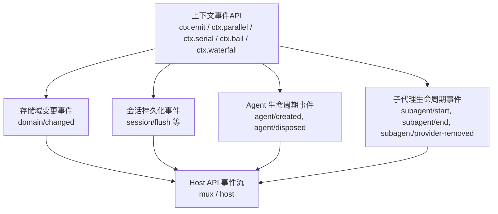
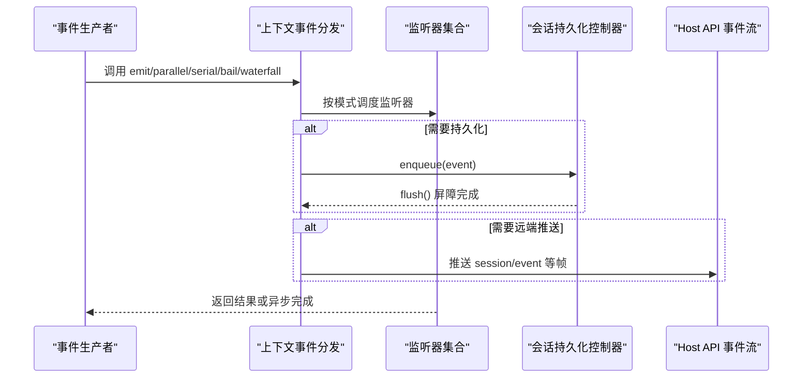
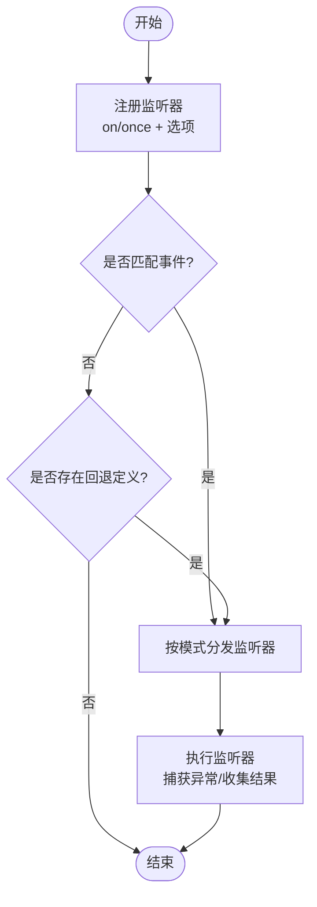
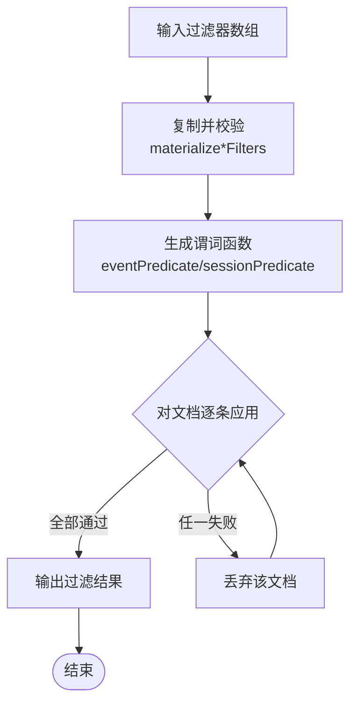
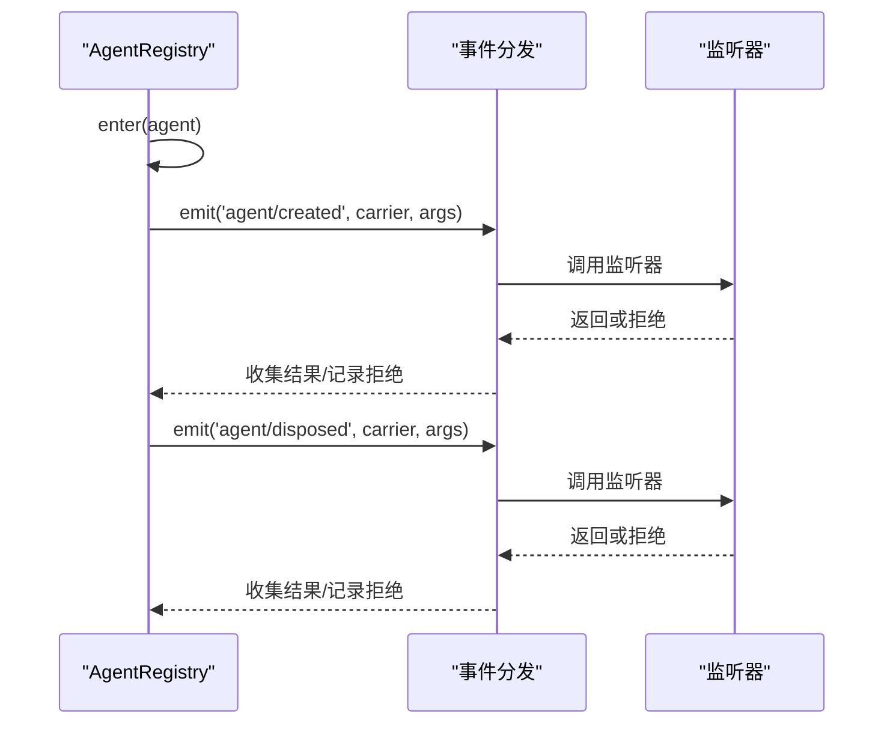
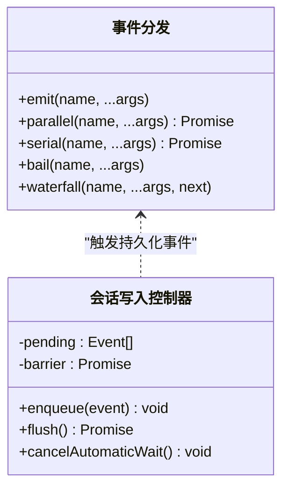
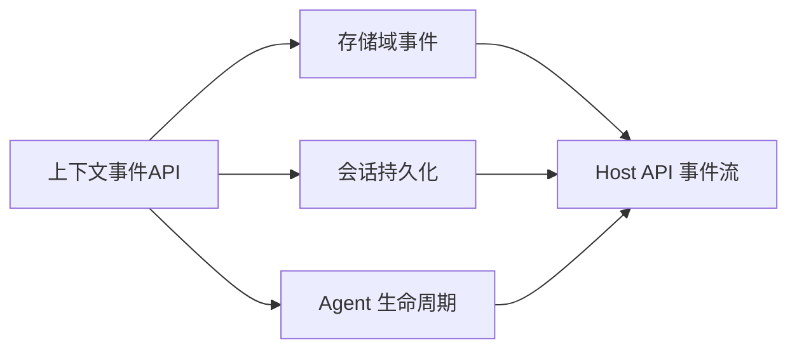

# 事件订阅机制

<cite>
**本文引用的文件**
- [packages/core/agent/src/index.ts](file://packages/core/agent/src/index.ts)
- [packages/session-query/session-query/src/filters.ts](file://packages/session-query/session-query/src/filters.ts)
- [packages/storage/storage-domain/src/events.ts](file://packages/storage/storage-domain/src/events.ts)
- [packages/host/apiproxy/src/api/events.ts](file://packages/host/apiproxy/src/api/events.ts)
- [packages/client/runtime/src/client/sessions/conversation-assembler.ts](file://packages/client/runtime/src/client/sessions/conversation-assembler.ts)
- [packages/subagent/subagent/src/lifecycle.ts](file://packages/subagent/subagent/src/lifecycle.ts)
- [packages/core/session/src/index.ts](file://packages/core/session/src/index.ts)
- [scripts/gen-doc-graphs.ts](file://scripts/gen-doc-graphs.ts)
- [docs/cordis-api/events.md](file://docs/cordis-api/events.md)
</cite>

## 目录
1. [简介](#简介)
2. [项目结构](#项目结构)
3. [核心组件](#核心组件)
4. [架构总览](#架构总览)
5. [详细组件分析](#详细组件分析)
6. [依赖关系分析](#依赖关系分析)
7. [性能考虑](#性能考虑)
8. [故障排查指南](#故障排查指南)
9. [结论](#结论)
10. [附录](#附录)

## 简介
本文件系统化说明本仓库中的事件订阅机制，覆盖注册、匹配与处理流程；事件过滤器的工作原理与配置；订阅生命周期管理与资源清理；并发控制与顺序保证；性能调优与故障恢复策略；高效处理器开发实践；以及监控与诊断方法。文档以代码为依据，配合图示帮助读者快速理解并正确使用事件系统。

## 项目结构
事件系统贯穿多个子系统：
- 事件分发与订阅接口由上下文提供，支持多种分发模式（同步广播、并行等待、串行短路、瀑布式中间件等）。
- Agent 生命周期通过事件发布创建与销毁通知，并在作用域内过滤路由。
- 会话查询提供事件结果过滤器，用于按序列号、时间、类型、表面和文本检索事件。
- 存储域在持久化完成后发出变更事件，供跨进程推送使用。
- Host API 暴露事件流（mux/host），将会话事件、审批/问答、工作区变更等推送到客户端。
- 会话写入采用写后批处理与屏障，确保高吞吐下的有序持久化。
- 子代理生命周期发射器对每个监听器进行隔离调用，避免单个失败影响其他监听器。

**图表来源**
- [docs/cordis-api/events.md:8-123](file://docs/cordis-api/events.md#L8-L123)
- [packages/core/agent/src/index.ts:549-576](file://packages/core/agent/src/index.ts#L549-L576)
- [packages/storage/storage-domain/src/events.ts:36-47](file://packages/storage/storage-domain/src/events.ts#L36-L47)
- [packages/host/apiproxy/src/api/events.ts:46-155](file://packages/host/apiproxy/src/api/events.ts#L46-L155)
- [packages/subagent/subagent/src/lifecycle.ts:100-123](file://packages/subagent/subagent/src/lifecycle.ts#L100-L123)
- [packages/core/session/src/index.ts:1009-1039](file://packages/core/session/src/index.ts#L1009-L1039)

**章节来源**
- [docs/cordis-api/events.md:8-123](file://docs/cordis-api/events.md#L8-L123)
- [packages/core/agent/src/index.ts:549-576](file://packages/core/agent/src/index.ts#L549-L576)
- [packages/storage/storage-domain/src/events.ts:36-47](file://packages/storage/storage-domain/src/events.ts#L36-L47)
- [packages/host/apiproxy/src/api/events.ts:46-155](file://packages/host/apiproxy/src/api/events.ts#L46-L155)
- [packages/subagent/subagent/src/lifecycle.ts:100-123](file://packages/subagent/subagent/src/lifecycle.ts#L100-L123)
- [packages/core/session/src/index.ts:1009-1039](file://packages/core/session/src/index.ts#L1009-L1039)

## 核心组件
- 事件分发模式：emit、parallel、serial、bail、waterfall，分别对应同步广播、并行等待、串行短路、同步短路、瀑布式中间件。
- Agent 生命周期事件：创建与销毁通过作用域载体路由，确保仅目标作用域内的监听器接收。
- 会话查询过滤器：支持 seq/time/type/surface/text 的 AND/OR 组合，提供安全的文本匹配编译。
- 存储域事件：每次持久化成功后发出 domain/changed，携带新快照与操作判别。
- Host 事件流：mux 与 host 两个逻辑流，推送会话事件、审批/问答、工作区变更、远程事件转发等。
- 会话写入控制器：写后批处理 + 固定截止时间 + 屏障，减少频繁 I/O 并保持顺序。
- 子代理生命周期发射器：逐个监听器隔离执行，捕获异常并记录，不阻塞其他监听器。

**章节来源**
- [docs/cordis-api/events.md:8-123](file://docs/cordis-api/events.md#L8-L123)
- [packages/core/agent/src/index.ts:549-576](file://packages/core/agent/src/index.ts#L549-L576)
- [packages/session-query/session-query/src/filters.ts:18-38](file://packages/session-query/session-query/src/filters.ts#L18-L38)
- [packages/storage/storage-domain/src/events.ts:36-47](file://packages/storage/storage-domain/src/events.ts#L36-L47)
- [packages/host/apiproxy/src/api/events.ts:46-155](file://packages/host/apiproxy/src/api/events.ts#L46-L155)
- [packages/core/session/src/index.ts:1009-1039](file://packages/core/session/src/index.ts#L1009-L1039)
- [packages/subagent/subagent/src/lifecycle.ts:100-123](file://packages/subagent/subagent/src/lifecycle.ts#L100-L123)

## 架构总览
事件从生产者经上下文分发到监听器，部分事件进入持久化或 Host 流，最终被客户端消费。Agent 生命周期事件与存储域事件是典型的生产者；会话查询过滤器为消费者侧的筛选工具；Host API 作为跨进程的事件通道。

**图表来源**
- [docs/cordis-api/events.md:8-123](file://docs/cordis-api/events.md#L8-L123)
- [packages/core/session/src/index.ts:1009-1039](file://packages/core/session/src/index.ts#L1009-L1039)
- [packages/host/apiproxy/src/api/events.ts:46-155](file://packages/host/apiproxy/src/api/events.ts#L46-L155)

## 详细组件分析

### 事件注册、匹配与处理流程
- 注册：通过上下文 on/once 注册监听器，支持 prepend/global 选项；插件卸载时自动移除。
- 匹配：根据事件名与作用域选择监听器；某些场景下存在“默认回退”定义，当无匹配时使用 fallbackEntry。
- 处理：依据分发模式执行监听器；错误被捕获并记录，不影响其他监听器；返回值语义依模式而定。

**图表来源**
- [packages/client/runtime/src/client/sessions/conversation-assembler.ts:360-385](file://packages/client/runtime/src/client/sessions/conversation-assembler.ts#L360-L385)
- [docs/cordis-api/events.md:125-187](file://docs/cordis-api/events.md#L125-L187)

**章节来源**
- [packages/client/runtime/src/client/sessions/conversation-assembler.ts:360-385](file://packages/client/runtime/src/client/sessions/conversation-assembler.ts#L360-L385)
- [docs/cordis-api/events.md:125-187](file://docs/cordis-api/events.md#L125-L187)

### 事件过滤器工作原理与配置
- 会话事件过滤器支持：seq/time 范围、type/surface 列表、text 文本匹配。
- 过滤器数组按逻辑与组合，单条子句的值按逻辑或组合。
- 文本匹配通过安全编译的正则表达式实现，避免注入风险。
- 过滤器在进入异步边界前进行复制与校验，确保稳定性。

**图表来源**
- [packages/session-query/session-query/src/filters.ts:18-38](file://packages/session-query/session-query/src/filters.ts#L18-L38)
- [packages/session-query/session-query/src/filters.ts:75-98](file://packages/session-query/session-query/src/filters.ts#L75-L98)
- [packages/session-query/session-query/src/filters.ts:140-162](file://packages/session-query/session-query/src/filters.ts#L140-L162)
- [packages/session-query/session-query/src/filters.ts:105-118](file://packages/session-query/session-query/src/filters.ts#L105-L118)

**章节来源**
- [packages/session-query/session-query/src/filters.ts:18-38](file://packages/session-query/session-query/src/filters.ts#L18-L38)
- [packages/session-query/session-query/src/filters.ts:75-98](file://packages/session-query/session-query/src/filters.ts#L75-L98)
- [packages/session-query/session-query/src/filters.ts:140-162](file://packages/session-query/session-query/src/filters.ts#L140-L162)
- [packages/session-query/session-query/src/filters.ts:105-118](file://packages/session-query/session-query/src/filters.ts#L105-L118)

### 生命周期管理与资源清理
- Agent 创建与销毁：enter/announce/register 管理注册状态；announce 抛出同步失败会撤销发布；dispose 路径成对发出 disposed。
- 子代理生命周期：createLifecycleEmitter 对每个监听器独立包裹 try/catch，拒绝的 Promise 被捕获并记录，不阻塞其他监听器。
- 会话持久化：flush 统一入口，所有监听器并行等待，首个拒绝值抛出；确保调用方拥有明确的失败边界。

**图表来源**
- [packages/core/agent/src/index.ts:450-576](file://packages/core/agent/src/index.ts#L450-L576)
- [packages/subagent/subagent/src/lifecycle.ts:100-123](file://packages/subagent/subagent/src/lifecycle.ts#L100-L123)
- [packages/core/session/src/index.ts:1009-1039](file://packages/core/session/src/index.ts#L1009-L1039)

**章节来源**
- [packages/core/agent/src/index.ts:450-576](file://packages/core/agent/src/index.ts#L450-L576)
- [packages/subagent/subagent/src/lifecycle.ts:100-123](file://packages/subagent/subagent/src/lifecycle.ts#L100-L123)
- [packages/core/session/src/index.ts:1009-1039](file://packages/core/session/src/index.ts#L1009-L1039)

### 并发控制与顺序保证
- 并发：parallel 模式并行运行所有监听器并一起等待；flush 使用 allSettled 聚合结果。
- 顺序：serial/bail 模式按序执行直到短路；waterfall 模式通过 next 串联中间件。
- 持久化顺序：存储域事件在每条写链中保持顺序；会话写入控制器维护 pending 队列与 barrier，确保有序落盘。

**图表来源**
- [docs/cordis-api/events.md:8-123](file://docs/cordis-api/events.md#L8-L123)
- [packages/core/session/src/index.ts:1009-1039](file://packages/core/session/src/index.ts#L1009-L1039)

**章节来源**
- [docs/cordis-api/events.md:8-123](file://docs/cordis-api/events.md#L8-L123)
- [packages/core/session/src/index.ts:1009-1039](file://packages/core/session/src/index.ts#L1009-L1039)

### 性能调优与故障恢复策略
- 批处理与屏障：将高频事件合并到固定时间窗口，减少 I/O 次数；显式 flush 绕过等待，确保关键路径及时落盘。
- 监听器隔离：子代理生命周期发射器对每个监听器单独 try/catch，避免单个失败导致整体阻塞。
- 错误边界：flush 聚合所有监听器结果，首个拒绝抛出；Agent 创建失败可撤销发布，保持状态一致。
- 文本过滤优化：预编译正则表达式，避免重复构建；空文本与非法输入提前报错。

**章节来源**
- [packages/core/session/src/index.ts:1009-1039](file://packages/core/session/src/index.ts#L1009-L1039)
- [packages/subagent/subagent/src/lifecycle.ts:100-123](file://packages/subagent/subagent/src/lifecycle.ts#L100-L123)
- [packages/session-query/session-query/src/filters.ts:105-118](file://packages/session-query/session-query/src/filters.ts#L105-L118)

### 高效事件处理器开发实践
- 明确分发模式：选择合适模式（emit/parallel/serial/bail/waterfall）以匹配业务需求。
- 轻量监听器：避免在监听器中进行重计算或阻塞 I/O；必要时使用 parallel 并发。
- 错误处理：在监听器内部捕获异常并记录，避免传播到分发层；对于关键路径使用 serial/bail 短路。
- 作用域意识：使用作用域载体确保事件仅路由到相关监听器；必要时使用 global 选项绕过过滤。

**章节来源**
- [docs/cordis-api/events.md:8-123](file://docs/cordis-api/events.md#L8-L123)
- [packages/core/agent/src/index.ts:549-576](file://packages/core/agent/src/index.ts#L549-L576)

### 监控与诊断工具使用方法
- 事件目录查询：通过 queryEventApi 获取事件清单与签名，辅助开发与调试。
- 静态分析：脚本 gen-doc-graphs 可遍历源码识别事件调用点，帮助定位生产者与消费者。
- 日志与警告：监听器拒绝或抛出的错误会被记录，便于问题追踪。

**章节来源**
- [packages/extensions/tool-cordis/src/api-catalog.ts:4719-4751](file://packages/extensions/tool-cordis/src/api-catalog.ts#L4719-L4751)
- [scripts/gen-doc-graphs.ts:918-1010](file://scripts/gen-doc-graphs.ts#L918-L1010)
- [packages/subagent/subagent/src/lifecycle.ts:112-121](file://packages/subagent/subagent/src/lifecycle.ts#L112-L121)

## 依赖关系分析
事件系统依赖上下文分发、作用域路由、持久化控制器与 Host API。各组件之间通过事件解耦，降低耦合度并提高可测试性。

**图表来源**
- [docs/cordis-api/events.md:8-123](file://docs/cordis-api/events.md#L8-L123)
- [packages/storage/storage-domain/src/events.ts:36-47](file://packages/storage/storage-domain/src/events.ts#L36-L47)
- [packages/core/session/src/index.ts:1009-1039](file://packages/core/session/src/index.ts#L1009-L1039)
- [packages/host/apiproxy/src/api/events.ts:46-155](file://packages/host/apiproxy/src/api/events.ts#L46-L155)

**章节来源**
- [docs/cordis-api/events.md:8-123](file://docs/cordis-api/events.md#L8-L123)
- [packages/storage/storage-domain/src/events.ts:36-47](file://packages/storage/storage-domain/src/events.ts#L36-L47)
- [packages/core/session/src/index.ts:1009-1039](file://packages/core/session/src/index.ts#L1009-L1039)
- [packages/host/apiproxy/src/api/events.ts:46-155](file://packages/host/apiproxy/src/api/events.ts#L46-L155)

## 性能考虑
- 使用 parallel 模式提升监听器吞吐，但需确保监听器无副作用冲突。
- 利用写后批处理减少 I/O 频率，合理设置定时器窗口以平衡延迟与吞吐。
- 过滤器预编译与早返回可降低 CPU 开销。
- 避免在监听器中进行阻塞操作，必要时拆分任务或使用后台队列。

[本节提供通用指导，无需特定文件引用]

## 故障排查指南
- 监听器异常：检查日志中的警告信息，确认是否为单个监听器失败；必要时隔离问题监听器。
- 持久化失败：关注 flush 的拒绝原因，检查后端存储与健康状况；必要时重试或降级。
- 过滤器错误：验证过滤器形状与值类型，确保传入合法参数；使用 materialize*Filters 提前捕获错误。
- 事件未到达：确认作用域与全局选项；检查是否有回退定义被误用。

**章节来源**
- [packages/subagent/subagent/src/lifecycle.ts:112-121](file://packages/subagent/subagent/src/lifecycle.ts#L112-L121)
- [packages/core/session/src/index.ts:1009-1039](file://packages/core/session/src/index.ts#L1009-L1039)
- [packages/session-query/session-query/src/filters.ts:75-98](file://packages/session-query/session-query/src/filters.ts#L75-L98)

## 结论
本事件订阅机制通过灵活的分发模式、严格的作用域路由、健壮的持久化与 Host 推送，提供了高性能、可扩展且易于调试的事件处理能力。结合过滤器与监控工具，开发者可以构建稳定可靠的事件驱动系统。

[本节总结内容，无需特定文件引用]

## 附录
- 事件分发模式参考：emit、parallel、serial、bail、waterfall。
- 会话事件过滤器类型：seq、time、type、surface、text。
- 存储域事件类型：put、deleted。
- Host API 帧类型：session/event、approval/requested、question/requested、workspace-changed 等。

[本节列出参考类型，无需特定文件引用]