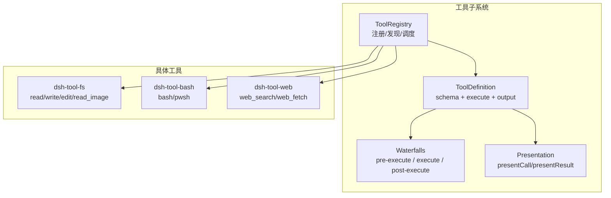
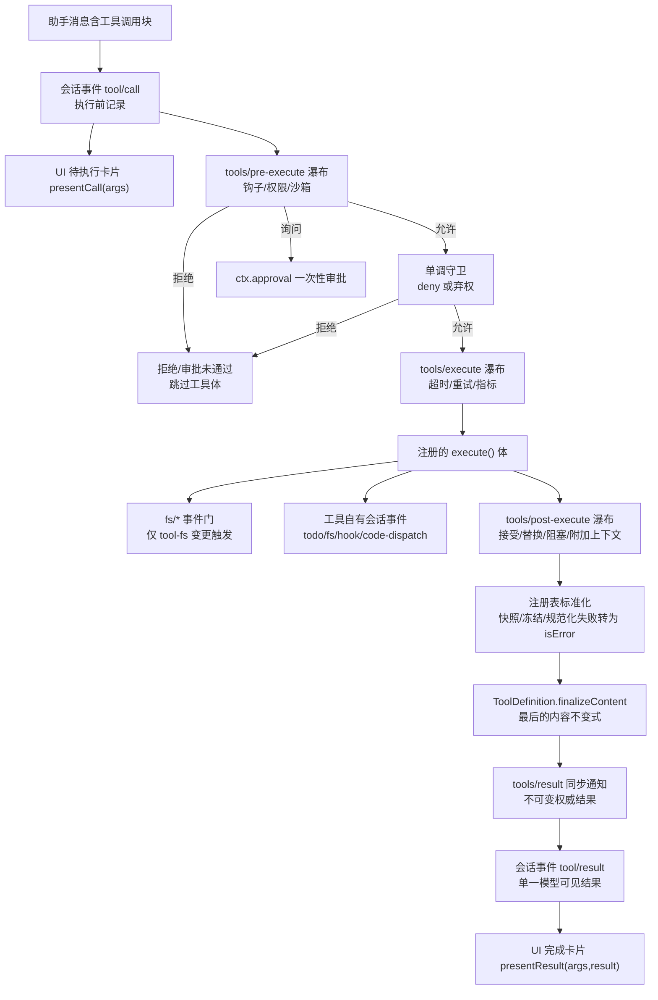
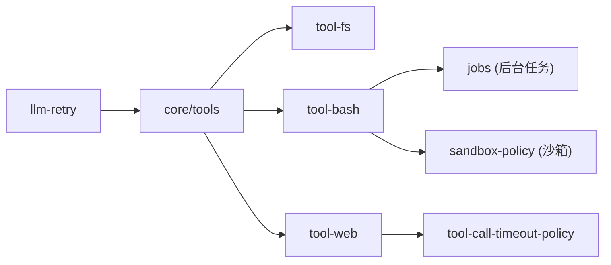

# 工具开发

<cite>
**本文引用的文件**
- [docs/cookbook/adding-a-tool.md](file://docs/cookbook/adding-a-tool.md)
- [docs/subsystems/tools.md](file://docs/subsystems/tools.md)
- [docs/tool-catalog.md](file://docs/tool-catalog.md)
- [docs/tool-execution-pipeline.md](file://docs/tool-execution-pipeline.md)
- [packages/core/tools/src/index.ts](file://packages/core/tools/src/index.ts)
- [packages/fs/tool-fs/src/index.ts](file://packages/fs/tool-fs/src/index.ts)
- [packages/shell/tool-bash/src/index.ts](file://packages/shell/tool-bash/src/index.ts)
- [packages/web/tool-web/src/index.ts](file://packages/web/tool-web/src/index.ts)
- [packages/llm/llm-retry/src/index.ts](file://packages/llm/llm-retry/src/index.ts)
- [packages/goal/tool-goal/src/authority.ts](file://packages/goal/tool-goal/src/authority.ts)
- [docs/testing.md](file://docs/testing.md)
</cite>

## 目录
1. [简介](#简介)
2. [项目结构](#项目结构)
3. [核心组件](#核心组件)
4. [架构总览](#架构总览)
5. [详细组件分析](#详细组件分析)
6. [依赖分析](#依赖分析)
7. [性能考虑](#性能考虑)
8. [故障排查指南](#故障排查指南)
9. [结论](#结论)
10. [附录](#附录)

## 简介
本指南面向在 DeepSeek Harness 中开发“工具”的工程师，覆盖接口定义、参数校验、注册与发现、执行上下文与权限控制、错误处理与重试、性能优化与资源管理、典型工具示例（文件操作、网络请求、数据处理）、测试与调试方法，以及与 Agent 的交互模式。文档基于仓库中的子系统文档与实现源码进行系统化梳理，帮助你在不深入源码细节的情况下也能正确设计并实现高质量的工具。

## 项目结构
- 工具子系统位于 packages/core/tools，提供统一的工具定义、注册表、执行管线、UI 呈现契约等能力。
- 具体工具以独立包形式存在，如文件系统工具 dsh-tool-fs、Shell 工具 dsh-tool-bash、Web 工具 dsh-tool-web 等。
- 文档集中在 docs 下：cookbook 提供上手参考，subsystems 描述系统级能力，tool-catalog 自动生成模型可见的工具清单。

图表来源
- [packages/core/tools/src/index.ts:703-729](file://packages/core/tools/src/index.ts#L703-L729)
- [docs/subsystems/tools.md:9-96](file://docs/subsystems/tools.md#L9-L96)

章节来源
- [docs/subsystems/tools.md:9-96](file://docs/subsystems/tools.md#L9-L96)
- [docs/tool-catalog.md:1-42](file://docs/tool-catalog.md#L1-L42)

## 核心组件
- ToolDefinition：一个已注册工具的完整契约，包含模型可见的 schema、execute 执行体、输出 schema 与渲染器、可选的最终内容处理器、超时预算、并发安全标记以及 UI 呈现方法。
- 统一 JSON 值 Schema DSL：作者用一套声明式语法同时描述参数与返回值，支持标量、对象、数组、oneOf 等，运行时编译为受控的 JSON Schema 子集并进行严格校验。
- 执行管线：tools/pre-execute → 单调守卫 → tools/execute → tools/post-execute → finalizeContent → tools/result。每个阶段都有明确的职责与决策类型。
- 呈现契约：presentCall 展示待执行卡片，presentResult 展示完成卡片；card 标签化视图（generic/terminal/diff/search/web/read）由宿主映射到具体 UI。

章节来源
- [docs/subsystems/tools.md:9-96](file://docs/subsystems/tools.md#L9-L96)
- [docs/subsystems/tools.md:98-151](file://docs/subsystems/tools.md#L98-L151)
- [docs/subsystems/tools.md:170-375](file://docs/subsystems/tools.md#L170-L375)
- [docs/subsystems/tools.md:459-468](file://docs/subsystems/tools.md#L459-L468)

## 架构总览
下图展示了从模型消息到工具结果落盘的完整流程，包括策略门控、沙箱、结果重写、最终观察与 UI 渲染。

图表来源
- [docs/tool-execution-pipeline.md:8-58](file://docs/tool-execution-pipeline.md#L8-L58)

章节来源
- [docs/tool-execution-pipeline.md:1-63](file://docs/tool-execution-pipeline.md#L1-L63)

## 详细组件分析

### 接口定义与参数验证机制
- 使用 defineTool 声明 name、description、parameters、output.schema、output.render、execute 等字段。
- parameters 采用统一 ValueSchemaSpec 派生的 ParameterPropertySpec，支持 required、enum、const、oneOf、嵌套对象等；运行时将编译为受控 JSON Schema 并严格校验，非法参数抛出结构化错误。
- output.schema 约束 execute 返回的“规范值”，render 负责生成模型可见内容，presentationMeta 用于可重放的 UI 元数据。
- 建议：将程序化 API 设计在 output.schema 中，人类可读说明放在 render；避免让 UI 解析自然语言。

章节来源
- [docs/cookbook/adding-a-tool.md:7-49](file://docs/cookbook/adding-a-tool.md#L7-L49)
- [docs/subsystems/tools.md:98-151](file://docs/subsystems/tools.md#L98-L151)
- [docs/subsystems/tools.md:406-457](file://docs/subsystems/tools.md#L406-L457)

### 工具的注册流程与发现机制
- 插件通过 ctx.tools.register(definition) 注册工具；fiber 销毁时自动注销，保证生命周期安全。
- schemas(scope?) 暴露给系统提示组装，仅包含白名单字段（name/description/parameters），不会泄露执行与呈现回调。
- restrict(filter) 可对全局工具进行 allow/deny 过滤；scoped 注册不受影响。
- get(name, scope?) 按作用域解析可见工具；executionMode(exec) 判定是否可并行。

章节来源
- [docs/cookbook/adding-a-tool.md:38-39](file://docs/cookbook/adding-a-tool.md#L38-L39)
- [docs/subsystems/tools.md:478-574](file://docs/subsystems/tools.md#L478-L574)
- [docs/subsystems/tools.md:153-168](file://docs/subsystems/tools.md#L153-L168)

### 执行上下文与权限控制
- 执行上下文 ToolExecution/ToolDispatchExecution 携带 callId、rootCallId、name、arguments、agent、parent token、signal 等；arguments 在进入管线前被冻结，身份字段只读。
- 权限控制分层：
  - tools/pre-execute：可扩展的允许/拒绝/询问瀑布，支持一次性审批。
  - 单调守卫：注册后只能拒绝不能放行，确保顺序无关的安全性。
  - 工具内部：结合 exec.agent 与上下文事件做细粒度授权检查（例如目标工具需当前根 Agent 的人类输入）。
- Code Mode 下的子调用会携带 parent token，限制原生工具名直接暴露。

章节来源
- [docs/subsystems/tools.md:170-313](file://docs/subsystems/tools.md#L170-L313)
- [packages/goal/tool-goal/src/authority.ts:65-93](file://packages/goal/tool-goal/src/authority.ts#L65-L93)
- [docs/tool-catalog.md:19-20](file://docs/tool-catalog.md#L19-L20)

### 错误处理与重试机制
- 工具体抛出异常或返回不符合 output.schema 的值会被捕获并归一化为 isError 结果；finalizeContent 仍会被调用以便做内容边界保护。
- 超时与取消：
  - 工具可声明 timeoutMs，由外部策略在 tools/execute 中强制协作式超时。
  - 必须尊重 exec.signal，及时中止进行中工作。
- 重试：
  - LLM 层提供通用重试策略（退避、抖动、可重试错误码集合），可在 provider 配置中启用 always/normal 模式。
  - 工具侧也可通过 tools/execute 包装实现自定义重试、指标采集与降级。

章节来源
- [docs/subsystems/tools.md:370-404](file://docs/subsystems/tools.md#L370-L404)
- [docs/subsystems/tools.md:54-74](file://docs/subsystems/tools.md#L54-L74)
- [packages/llm/llm-retry/src/index.ts:93-179](file://packages/llm/llm-retry/src/index.ts#L93-L179)

### 性能优化与资源管理
- 输出裁剪与流式读取：
  - 文件工具支持行/字符/字节上限、大文件流式读取，避免内存膨胀。
  - Web 工具对搜索结果数量、抓取输出字符数设置默认上限，防止过大响应。
- 后台任务：
  - 长耗时任务通过 ctx.jobs.start 注册为后台作业，立即返回 jobId；由 job_* 工具统一查询/终止。
  - 前台工作绑定 exec.signal，后台任务使用任务级取消信号，避免外层取消误杀已发布的工作。
- 并发：
  - isConcurrencySafe 可声明工具调用可并行；注册表据此形成滚动池与互斥屏障。
- 资源清理：
  - 插件 fiber 销毁即自动注销工具；后台任务通过 done/cancel 明确生命周期。

章节来源
- [packages/fs/tool-fs/src/index.ts:24-41](file://packages/fs/tool-fs/src/index.ts#L24-L41)
- [packages/web/tool-web/src/index.ts:26-59](file://packages/web/tool-web/src/index.ts#L26-L59)
- [docs/cookbook/adding-a-tool.md:51-55](file://docs/cookbook/adding-a-tool.md#L51-L55)
- [docs/subsystems/tools.md:61-74](file://docs/subsystems/tools.md#L61-L74)

### 不同类型工具的开发示例

#### 文件操作工具（read/write/edit/read_image）
- 特点：
  - 参数与输出均使用统一 schema 声明，read 支持 offset/limit 分页与字节/行数限制。
  - write/edit 走 fs/* 事件门，配合沙箱控制器进行访问控制与审计。
  - read_image 仅在挂载附件存储时注册，执行时校验模型是否支持图片输入。
- 关键实现要点：
  - 配置项（readLimit、maxBytes、streamMinSize）在插件初始化时校验为正整数。
  - 输出结构包含 path、lines、totalLines 等字段，便于 UI 渲染代码卡片。

章节来源
- [packages/fs/tool-fs/src/index.ts:1-80](file://packages/fs/tool-fs/src/index.ts#L1-L80)
- [docs/tool-catalog.md:599-715](file://docs/tool-catalog.md#L599-L715)

#### Shell 工具（bash/pwsh）
- 特点：
  - 每次调用在新进程中执行，无状态；支持 workdir、timeoutMs、run_in_background。
  - 背景模式返回 jobId，通过 job_* 工具收集输出与终止。
  - 若启用沙箱，支持一次性的“升级”申请（sandbox_permissions + justification），经审批后放宽权限执行一次。
- 关键实现要点：
  - presentCall/presentResult 分别渲染终端卡片与通用控制台卡片。
  - 输出规范化为 kind: foreground/background，包含 stdout/stderr、退出码、超时/中止标志、沙箱信息。

章节来源
- [packages/shell/tool-bash/src/index.ts:30-93](file://packages/shell/tool-bash/src/index.ts#L30-L93)
- [packages/shell/tool-bash/src/index.ts:190-395](file://packages/shell/tool-bash/src/index.ts#L190-L395)
- [docs/tool-catalog.md:176-263](file://docs/tool-catalog.md#L176-L263)

#### 网络请求工具（web_search/web_fetch）
- 特点：
  - 搜索与抓取分离，各自有独立的超时预算与输出上限。
  - 即使后端不可用，工具仍可见，执行时返回结构化错误而非改变 schema。
- 关键实现要点：
  - 配置项 searchMaxResults、fetchTimeoutMs、searchTimeoutMs、fetchMaxOutputChars 均需为正整数。
  - 输出包含截断标志与定位信息，便于 UI 显示“部分结果”。

章节来源
- [packages/web/tool-web/src/index.ts:1-92](file://packages/web/tool-web/src/index.ts#L1-L92)
- [docs/tool-catalog.md:41-42](file://docs/tool-catalog.md#L41-L42)

#### 数据处理工具（示例思路）
- 可复用文件与 shell 工具组合，或使用 run_code 在受限环境中执行脚本。
- 输出建议使用结构化 schema（如数组/对象），render 仅负责人类可读摘要；presentationMeta 保存可重放的结构化元数据。

章节来源
- [docs/tool-catalog.md:19-20](file://docs/tool-catalog.md#L19-L20)
- [docs/cookbook/adding-a-tool.md:61-66](file://docs/cookbook/adding-a-tool.md#L61-L66)

### 工具的测试方法与调试技巧
- 测试分层：
  - 单元测试：vitest 运行于各包 tests/**，关注边缘情况、错误路径、事件顺序与并发竞态。
  - 覆盖率门禁：要求 src 行级 100% 覆盖（特定平台例外）。
  - 真实 API e2e：带密钥场景，自跳过保障无密钥 CI 绿色。
  - 快照测试：键无关的预期输出，覆盖传输契约与呈现；ACP/headless/web GUI 各有快照套件。
- 调试建议：
  - 优先使用真实实现而非 mock，仅对昂贵/非确定性边界打桩。
  - 桥接工具调用测试使用脚本化 mock 模型 + 真实工具/执行器。
  - 产物入口测试：确保构建后的 lib/bin.js 行为一致。

章节来源
- [docs/testing.md:7-50](file://docs/testing.md#L7-L50)

### 与 Agent 的交互模式
- 工具通过 ctx.tools.execute 进入统一管线；Agent 循环根据 executionMode 组织并发与互斥。
- Code Mode 下，run_code 是保留传输，其子调用通过 code-dispatch-log 记录，保持调用/结果相邻性。
- 工具可通过 deferContext 附加后续模型请求可见的上下文；concludeTurn 可将成功结果标记为本轮终止。

章节来源
- [docs/tool-execution-pipeline.md:60-61](file://docs/tool-execution-pipeline.md#L60-L61)
- [docs/subsystems/tools.md:243-281](file://docs/subsystems/tools.md#L243-L281)
- [docs/subsystems/tools.md:214-241](file://docs/subsystems/tools.md#L214-L241)

## 依赖分析
- 工具子系统对外暴露注册表、水线事件、呈现契约；具体工具依赖相应能力 seam（fs、shell、web、jobs、systemPrompt 等）。
- 权限与策略通过 pre-execute 与 guard 解耦，不耦合到工具实现。
- 重试与超时通过 llm-retry 与工具超时策略在 execute 瀑布中组合。

图表来源
- [packages/core/tools/src/index.ts:703-729](file://packages/core/tools/src/index.ts#L703-L729)
- [packages/shell/tool-bash/src/index.ts:190-395](file://packages/shell/tool-bash/src/index.ts#L190-L395)
- [packages/web/tool-web/src/index.ts:80-91](file://packages/web/tool-web/src/index.ts#L80-L91)
- [packages/llm/llm-retry/src/index.ts:93-179](file://packages/llm/llm-retry/src/index.ts#L93-L179)

章节来源
- [packages/core/tools/src/index.ts:703-729](file://packages/core/tools/src/index.ts#L703-L729)
- [packages/shell/tool-bash/src/index.ts:190-395](file://packages/shell/tool-bash/src/index.ts#L190-L395)
- [packages/web/tool-web/src/index.ts:80-91](file://packages/web/tool-web/src/index.ts#L80-L91)
- [packages/llm/llm-retry/src/index.ts:93-179](file://packages/llm/llm-retry/src/index.ts#L93-L179)

## 性能考虑
- 参数与输出裁剪：合理设置 readLimit/maxBytes/streamMinSize、searchMaxResults/fetchMaxOutputChars，避免大对象阻塞。
- 后台任务：长耗时任务一律走 jobs，前台保持轻量；后台任务使用任务级取消信号，避免外层取消干扰。
- 并发控制：isConcurrencySafe 谨慎开启；注册表据此形成滚动池，减少串行瓶颈。
- 超时与重试：声明 timeoutMs，结合 llm-retry 的退避策略，避免雪崩。

[本节为通用指导，无需引用具体文件]

## 故障排查指南
- 常见错误分类：
  - 参数错误：ToolArgsError（INVALID_ARGS），检查 parameters 与 oneOf/required。
  - 输出错误：ToolOutputError（INVALID_TOOL_OUTPUT），检查 output.schema 与返回值。
  - 未知工具：UNKNOWN_TOOL，确认名称与作用域可见性。
  - 权限拒绝：pre-execute/guard 拒绝，检查审批通道与单调守卫。
- 调试步骤：
  - 查看 tools/result 事件获取不可变结果。
  - 检查 presentCall/presentResult 是否正确渲染。
  - 对后台任务使用 job_list/job_output/job_kill 追踪。
  - 对网络/LLM 调用启用重试策略并观察退避日志。

章节来源
- [docs/subsystems/tools.md:327-368](file://docs/subsystems/tools.md#L327-L368)
- [docs/subsystems/tools.md:576-720](file://docs/subsystems/tools.md#L576-L720)

## 结论
DeepSeek Harness 的工具体系以强类型 schema、严格的执行管线和清晰的呈现契约为核心，提供了安全的权限控制、灵活的扩展点与完善的性能与可靠性保障。遵循本文档的接口约定、注册流程、执行上下文与错误处理规范，可以快速开发出稳定、可观测、易维护的工具，并与 Agent 无缝协作。

## 附录
- 快速上手：参考 cookbook 的最小形状与 execute 契约。
- 工具清单：查阅 tool-catalog 了解已 shipped 工具及其 schema。
- 执行流程图：对照 tool-execution-pipeline 理解策略与钩子位置。

章节来源
- [docs/cookbook/adding-a-tool.md:7-49](file://docs/cookbook/adding-a-tool.md#L7-L49)
- [docs/tool-catalog.md:1-42](file://docs/tool-catalog.md#L1-L42)
- [docs/tool-execution-pipeline.md:1-63](file://docs/tool-execution-pipeline.md#L1-L63)