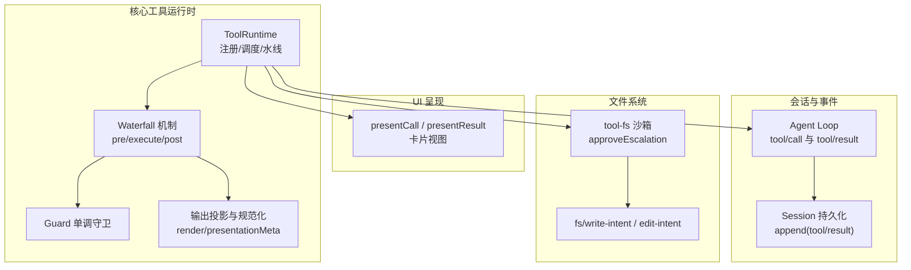
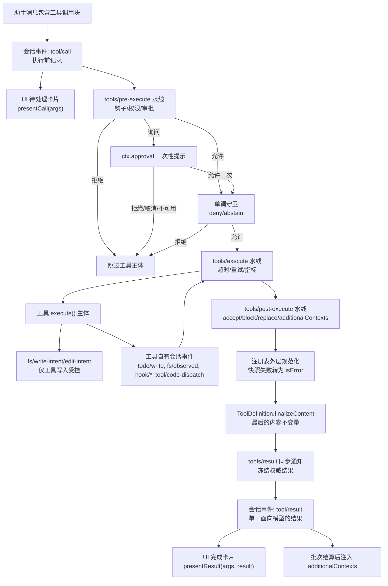
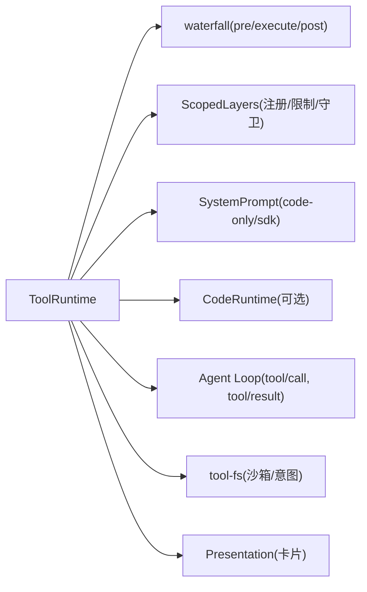

# 工具执行流程

<cite>
**本文引用的文件**
- [packages/core/tools/src/index.ts](file://packages/core/tools/src/index.ts)
- [packages/core/tools/src/presentation.ts](file://packages/core/tools/src/presentation.ts)
- [packages/core/tools/src/types.ts](file://packages/core/tools/src/types.ts)
- [packages/fs/tool-fs/src/sandbox.ts](file://packages/fs/tool-fs/src/sandbox.ts)
- [packages/core/agent-loop/src/tool-calls.ts](file://packages/core/agent-loop/src/tool-calls.ts)
- [docs/tool-execution-pipeline.md](file://docs/tool-execution-pipeline.md)
- [docs/tool-execution-pipeline.zh.md](file://docs/tool-execution-pipeline.zh.md)
- [docs/subsystems/tools.md](file://docs/subsystems/tools.md)
- [docs/cookbook/adding-a-tool.md](file://docs/cookbook/adding-a-tool.md)
- [packages/core/tools/tests/invariant.spec.ts](file://packages/core/tools/tests/invariant.spec.ts)
- [packages/core/tools/tests/tools.spec.ts](file://packages/core/tools/tests/tools.spec.ts)
- [packages/core/agent-loop/tests/interception.spec.ts](file://packages/core/agent-loop/tests/interception.spec.ts)
</cite>

## 目录
1. [简介](#简介)
2. [项目结构](#项目结构)
3. [核心组件](#核心组件)
4. [架构总览](#架构总览)
5. [详细组件分析](#详细组件分析)
6. [依赖关系分析](#依赖关系分析)
7. [性能考量](#性能考量)
8. [故障排查指南](#故障排查指南)
9. [结论](#结论)
10. [附录](#附录)

## 简介
本文系统化梳理从“模型调用”到“结果返回”的完整工具执行生命周期，覆盖以下关键阶段：
- tool/call 事件触发与 UI 待处理卡片展示
- pre-execute 水线（可扩展策略、权限检查、审批）
- 单调守卫（不可逆拒绝）
- execute 水线（超时、重试、指标等环绕调度）
- 工具主体执行（含文件系统沙箱与意图门控）
- post-execute 水线（接受、替换、附加上下文、阻断）
- 结果标准化与最终内容固化
- tools/result 同步通知与 UI 完成卡片渲染

目标是让读者在不深入源码的情况下，也能理解各阶段的职责、数据流转与异常路径。

## 项目结构
本仓库将工具执行的核心逻辑集中在 core/tools 包中，并通过 agent-loop 与 session 事件桥接到 UI；UI 呈现通过 presentation 类型体系描述；文件系统相关能力在 fs/tool-fs 中提供沙箱与意图门控；文档以 docs 下的流水线图与子系统说明为主。



图表来源
- [packages/core/tools/src/index.ts:787-1200](file://packages/core/tools/src/index.ts#L787-L1200)
- [packages/core/tools/src/presentation.ts:1-390](file://packages/core/tools/src/presentation.ts#L1-L390)
- [packages/fs/tool-fs/src/sandbox.ts:95-108](file://packages/fs/tool-fs/src/sandbox.ts#L95-L108)
- [packages/core/agent-loop/src/tool-calls.ts:267-289](file://packages/core/agent-loop/src/tool-calls.ts#L267-L289)

章节来源
- [docs/tool-execution-pipeline.md:1-63](file://docs/tool-execution-pipeline.md#L1-L63)
- [docs/tool-execution-pipeline.zh.md:1-60](file://docs/tool-execution-pipeline.zh.md#L1-L60)

## 核心组件
- ToolRuntime：工具注册、可见性解析、调度器接口实现、水线编排、结果标准化与通知。
- Waterfall：tools/pre-execute、tools/execute、tools/post-execute 三段式可插拔管线。
- Guard：单调守卫，仅能拒绝或弃权，不能反转拒绝。
- Output 投影：ToolDefinition.output.render 与 presentationMeta，负责将工具返回值转为模型内容与 UI 元数据。
- Presentation：ToolCallView/ToolResultView 描述 pending/completed 卡片。
- Agent Loop 集成：tool/call 记录、tool/result 追加并持久化。
- Filesystem 沙箱：approveEscalation 与 fs/* 意图门控，限制工具对文件系统的访问。

章节来源
- [packages/core/tools/src/index.ts:211-460](file://packages/core/tools/src/index.ts#L211-L460)
- [packages/core/tools/src/presentation.ts:1-390](file://packages/core/tools/src/presentation.ts#L1-L390)
- [docs/subsystems/tools.md:283-311](file://docs/subsystems/tools.md#L283-L311)

## 架构总览
下图展示了从模型消息中的工具调用块到最终 tool/result 事件的完整链路，以及 UI 待处理/完成卡片的出现时机。



图表来源
- [docs/tool-execution-pipeline.md:8-58](file://docs/tool-execution-pipeline.md#L8-L58)
- [packages/core/tools/src/index.ts:1346-1621](file://packages/core/tools/src/index.ts#L1346-L1621)
- [packages/core/agent-loop/src/tool-calls.ts:267-289](file://packages/core/agent-loop/src/tool-calls.ts#L267-L289)

章节来源
- [docs/tool-execution-pipeline.zh.md:1-60](file://docs/tool-execution-pipeline.zh.md#L1-L60)

## 详细组件分析

### 阶段一：tool/call 与 UI 待处理卡片
- 触发点：助手消息中出现工具调用块时，会话层记录 tool/call 事件。
- UI 行为：根据工具定义的 presentCall(args) 渲染待处理卡片；若无自定义则回退为通用卡片。
- 数据：args 为已解析的参数，尚未进入策略水线。

章节来源
- [docs/cookbook/adding-a-tool.md:71-82](file://docs/cookbook/adding-a-tool.md#L71-L82)
- [packages/core/tools/src/presentation.ts:42-118](file://packages/core/tools/src/presentation.ts#L42-L118)

### 阶段二：pre-execute 水线（可扩展门禁）
- 职责：运行所有 tools/pre-execute 监听器，支持 allow/deny/ask。
- 审批：ask 通过 ctx.approval 一次性提示；未配置或无响应视为拒绝。
- 异常：监听器抛错会被捕获并规范化为最终错误结果。
- 顺序：先于单调守卫执行，且不会改变已记录的参数。

章节来源
- [packages/core/tools/src/index.ts:142-152](file://packages/core/tools/src/index.ts#L142-L152)
- [packages/core/tools/tests/tools.spec.ts:1872-1886](file://packages/core/tools/tests/tools.spec.ts#L1872-L1886)
- [packages/core/agent-loop/tests/interception.spec.ts:692-717](file://packages/core/agent-loop/tests/interception.spec.ts#L692-L717)

### 阶段三：单调守卫（不可逆拒绝）
- 职责：在 pre-execute 之后、execute 之前，按作用域链（全局→祖先→当前）依次评估守卫；任一返回拒绝原因即终止执行。
- 特性：单调性——一旦拒绝，后续守卫无法恢复允许；身份保护，不允许修改执行标识。

章节来源
- [packages/core/tools/src/index.ts:703-711](file://packages/core/tools/src/index.ts#L703-L711)
- [packages/core/tools/src/index.ts:1100-1128](file://packages/core/tools/src/index.ts#L1100-L1128)

### 阶段四：execute 水线（环绕调度）
- 职责：围绕工具主体执行，支持超时、重试、指标采集等横切关注点；可替换 exec.signal，但不能移除原始 caller signal。
- 信号融合：注册表在调用主体前会融合 caller 信号，确保取消语义不被绕过。
- 结果：返回标准化后的 ToolExecutionResult；若抛出异常，将被捕获并转为最终错误。

章节来源
- [packages/core/tools/src/index.ts:153-163](file://packages/core/tools/src/index.ts#L153-L163)
- [packages/core/tools/src/index.ts:1562-1599](file://packages/core/tools/src/index.ts#L1562-L1599)
- [docs/subsystems/tools.md:283-311](file://docs/subsystems/tools.md#L283-L311)

### 阶段五：工具主体执行与文件系统门控
- 主体：调用注册的 ToolDefinition.execute，返回声明 schema 的 JSON 值。
- 文件系统：
  - 写意图：fs/write-intent 或 fs/edit-intent 仅在工具上下文中生效。
  - 沙箱升级：通过 approveEscalation 基于请求模式与理由进行审批，得到批准后的执行模式。
- 自有事件：工具可发出 todo/write、fs/observed、hook/invoked、hook/result、tool/code-dispatch 等会话事件。

章节来源
- [packages/fs/tool-fs/src/sandbox.ts:95-108](file://packages/fs/tool-fs/src/sandbox.ts#L95-L108)
- [docs/tool-execution-pipeline.md:18-22](file://docs/tool-execution-pipeline.md#L18-L22)

### 阶段六：post-execute 水线（结果改写与阻断）
- 职责：接受、替换内容或 value、附加 additionalContexts，或将结果转为 block（反馈作为错误）。
- 取消：若调用方已取消且结果为成功，会被转换为 ABORTED/ABORTED_BEFORE_DISPATCH 语义。
- 异常：监听器抛错同样被捕获并规范化为最终错误。

章节来源
- [packages/core/tools/src/index.ts:164-175](file://packages/core/tools/src/index.ts#L164-L175)
- [packages/core/tools/src/index.ts:1601-1621](file://packages/core/tools/src/index.ts#L1601-L1621)
- [packages/core/tools/tests/tools.spec.ts:1030-1058](file://packages/core/tools/tests/tools.spec.ts#L1030-L1058)

### 阶段七：结果标准化与 finalizeContent
- 标准化：注册表外层对候选结果进行快照与规范化，任何快照失败都会转为 isError。
- finalizeContent：定义级最后一次内容转换，必须纯函数且不抛错；用于保证内容不变量。
- 冻结：最终结果在 tools/result 前被深度冻结，确保观察者看到不可变快照。

章节来源
- [docs/tool-execution-pipeline.md:22-25](file://docs/tool-execution-pipeline.md#L22-L25)
- [packages/core/tools/src/index.ts:236-247](file://packages/core/tools/src/index.ts#L236-L247)
- [packages/core/tools/src/index.ts:529-553](file://packages/core/tools/src/index.ts#L529-L553)

### 阶段八：tools/result 通知与 UI 完成卡片
- 通知：tools/result 是同步事件，携带冻结的最终结果；监听器失败被隔离。
- 会话：agent-loop 将 tool/result 追加到会话，并携带 content、isError、可选 meta。
- UI：根据 presentResult(args, {content, isError, meta?}) 渲染完成卡片；不具备能力的 UI 回退到原始内容。

章节来源
- [packages/core/tools/src/index.ts:190-197](file://packages/core/tools/src/index.ts#L190-L197)
- [packages/core/agent-loop/src/tool-calls.ts:267-289](file://packages/core/agent-loop/src/tool-calls.ts#L267-L289)
- [docs/cookbook/adding-a-tool.md:77-82](file://docs/cookbook/adding-a-tool.md#L77-L82)

### 阶段九：嵌套调用与 Code Mode
- 父令牌：嵌套调用仅传递父 token，不暴露可变执行状态。
- 日志：tool/code-dispatch-start 与 tool/code-dispatch 记录子调用的开始与结束，便于 UI 实时追踪。
- 约束：code 模式下，模型直接调用仅限 run_code；其他工具需通过 SDK 子调用。

章节来源
- [packages/core/tools/src/types.ts:10-57](file://packages/core/tools/src/types.ts#L10-L57)
- [docs/tool-execution-pipeline.md:60-62](file://docs/tool-execution-pipeline.md#L60-L62)

## 依赖关系分析
- ToolRuntime 依赖：
  - Context.waterfall 实现三段水线。
  - ScopeLayers 管理工具注册、限制与守卫的作用域。
  - SystemPrompt 注入 code-only 规则与 SDK 生成段。
  - CodeRuntime（code/both 模式）提供语言运行时与 SDK 渲染。
  - Session 事件（由 agent-loop 驱动）记录 tool/call 与 tool/result。
- 外部依赖：
  - fs/tool-fs 提供沙箱与意图门控。
  - UI 通过 presentation 类型体系渲染卡片。



图表来源
- [packages/core/tools/src/index.ts:787-1200](file://packages/core/tools/src/index.ts#L787-L1200)
- [packages/fs/tool-fs/src/sandbox.ts:95-108](file://packages/fs/tool-fs/src/sandbox.ts#L95-L108)
- [packages/core/agent-loop/src/tool-calls.ts:267-289](file://packages/core/agent-loop/src/tool-calls.ts#L267-L289)

章节来源
- [docs/subsystems/tools.md:283-311](file://docs/subsystems/tools.md#L283-L311)

## 性能考量
- 水线开销：每段水线均为链表式遍历，应避免在监听器中进行昂贵计算；必要时使用缓存或批处理。
- 信号融合：每次替换信号需尽快恢复并达到静默，避免泄漏或竞态。
- 快照成本：output.render/presentationMeta 的返回值会被快照与冻结，应控制对象大小与复杂度。
- 并发：run_code 子调用默认最大并行度可配置；exclusive 调用形成屏障，影响吞吐。

[本节为通用指导，无需特定文件引用]

## 故障排查指南
- 常见错误与定位
  - pre-execute 监听器抛错：最终结果会被规范化为 isError，并携带人类可读消息。
  - post-execute 监听器抛错：同上，统一归一化为最终错误。
  - 未知工具：UNKNOWN_TOOL 错误，区分是否可通过 run_code 间接调用。
  - 输出无效：INVALID_TOOL_OUTPUT，检查 output.schema 与 render/presentationMeta 返回值。
- 调试建议
  - 在 tools/execute 中添加指标与耗时统计，定位慢调用。
  - 使用 tool/code-dispatch 系列事件观察嵌套调用时序。
  - 结合 fs/write-intent/edit-intent 审计文件变更范围。

章节来源
- [packages/core/tools/tests/tools.spec.ts:1864-1902](file://packages/core/tools/tests/tools.spec.ts#L1864-L1902)
- [packages/core/tools/tests/invariant.spec.ts:40-70](file://packages/core/tools/tests/invariant.spec.ts#L40-L70)
- [packages/core/tools/src/index.ts:488-522](file://packages/core/tools/src/index.ts#L488-L522)

## 结论
工具执行流水线通过三段水线与单调守卫实现了灵活而安全的扩展点：pre-execute 负责策略与审批，execute 负责横切关注点与主体执行，post-execute 负责结果改写与上下文注入。配合输出投影、finalizeContent 与 tools/result 通知，系统在保证一致性的同时，提供了丰富的 UI 呈现能力与可观测性。文件系统沙箱与意图门控进一步确保了安全边界。

[本节为总结，无需特定文件引用]

## 附录
- 关键流程图（代码级映射）
```mermaid
sequenceDiagram
participant Model as "模型"
participant Loop as "Agent Loop"
participant Reg as "ToolRuntime"
participant Pre as "pre-execute"
participant Guard as "Guard"
participant Exec as "execute"
participant Body as "工具主体"
participant Post as "post-execute"
participant UI as "UI"
Model->>Loop : 助手消息含工具调用块
Loop-->>Reg : 准备执行(input)
Reg->>Pre : 运行 pre-execute
Pre-->>Reg : allow/deny/ask
alt ask
Reg->>Loop : 审批提示
Loop-->>Reg : 允许一次/拒绝
end
Reg->>Guard : 单调守卫
alt deny
Reg-->>Loop : 最终错误
else allow
Reg->>Exec : 运行 execute 水线
Exec->>Body : 调用 execute()
Body-->>Exec : 返回值/自有事件
Exec-->>Post : 标准化结果
Post-->>Reg : accept/block/replace/context
Reg-->>Loop : tool/result
Loop-->>UI : 完成卡片
end
```

图表来源
- [packages/core/tools/src/index.ts:1346-1621](file://packages/core/tools/src/index.ts#L1346-L1621)
- [packages/core/agent-loop/src/tool-calls.ts:267-289](file://packages/core/agent-loop/src/tool-calls.ts#L267-L289)

- 参考文档与示例
  - 工具添加指南（卡片类型与呈现约定）
  - 工具执行流水线图示与说明
  - 子系统工具类型契约（ToolExecution/ToolDispatchExecution）

章节来源
- [docs/cookbook/adding-a-tool.md:71-82](file://docs/cookbook/adding-a-tool.md#L71-L82)
- [docs/tool-execution-pipeline.md:1-63](file://docs/tool-execution-pipeline.md#L1-L63)
- [docs/subsystems/tools.md:283-311](file://docs/subsystems/tools.md#L283-L311)