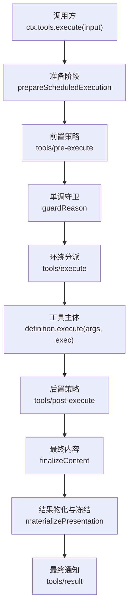
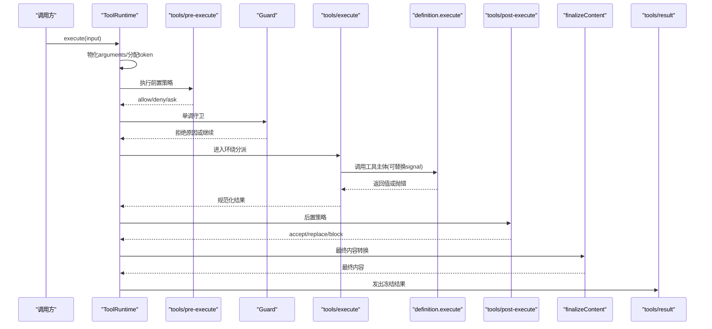
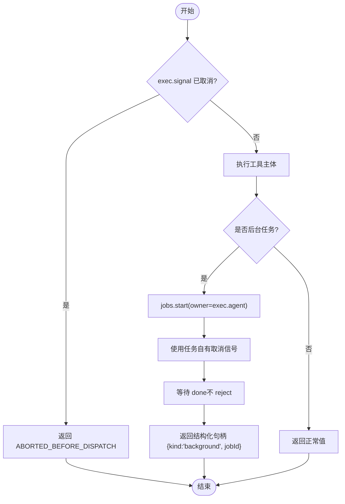
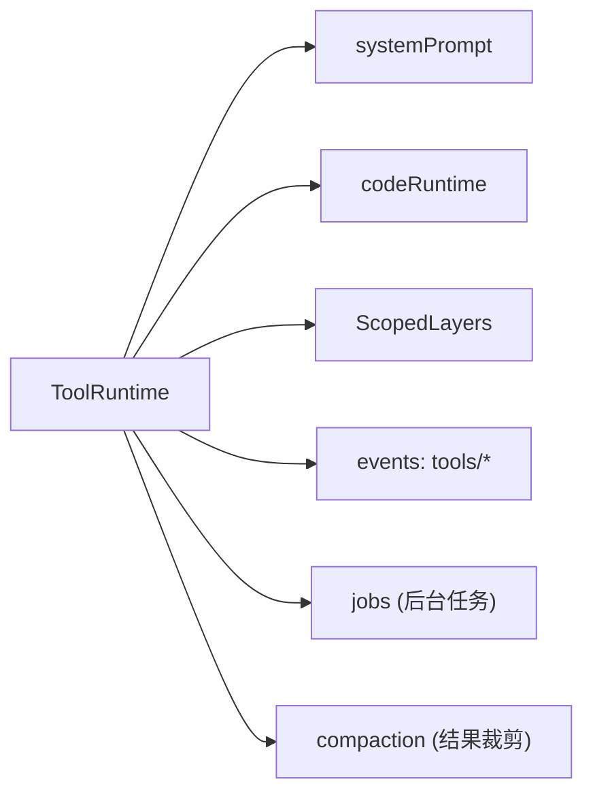

# 工具执行管道

<cite>
**本文引用的文件**
- [packages/core/tools/src/index.ts](file://packages/core/tools/src/index.ts)
- [packages/core/tools/src/schema.ts](file://packages/core/tools/src/schema.ts)
- [docs/subsystems/tools.md](file://docs/subsystems/tools.md)
- [docs/subsystems/tools.zh.md](file://docs/subsystems/tools.zh.md)
- [packages/jobs/tool-jobs/src/index.ts](file://packages/jobs/tool-jobs/src/index.ts)
- [packages/shell/tool-bash/tests/tools.spec.ts](file://packages/shell/tool-bash/tests/tools.spec.ts)
- [packages/shell/tool-pwsh/tests/tools.spec.ts](file://packages/shell/tool-pwsh/tests/tools.spec.ts)
- [packages/core/tools/tests/tools.spec.ts](file://packages/core/tools/tests/tools.spec.ts)
- [packages/core/tools/tests/execution-signal-types.spec.ts](file://packages/core/tools/tests/execution-signal-types.spec.ts)
- [packages/core/tools/tests/code-mode.spec.ts](file://packages/core/tools/tests/code-mode.spec.ts)
- [packages/compaction/compaction-tool-result-pruner/src/index.ts](file://packages/compaction/compaction-tool-result-pruner/src/index.ts)
</cite>

## 目录
1. [简介](#简介)
2. [项目结构](#项目结构)
3. [核心组件](#核心组件)
4. [架构总览](#架构总览)
5. [详细组件分析](#详细组件分析)
6. [依赖关系分析](#依赖关系分析)
7. [性能考量](#性能考量)
8. [故障排查指南](#故障排查指南)
9. [结论](#结论)
10. [附录](#附录)

## 简介
本文件系统性说明工具从注册到执行的完整流程，覆盖 execute 函数契约、参数校验与错误处理、返回值规范；解释执行上下文 exec 提供的能力（signal、agent、token 等）；阐述异常捕获与错误传播机制；说明工具生命周期与资源清理；提供长时运行工具的后台任务模式与取消机制；并给出性能优化建议与调试技巧。

## 项目结构
工具执行管道位于 core/tools 包中，围绕 ToolRuntime 实现“注册表 + 执行流水线”：
- 定义层：ToolDefinition、ToolExecutionInput、ToolRunContext、ToolExecutionResult 等类型与 DSL。
- 注册与可见性：register/restrict/guard/schemas/get/presentAs。
- 执行流水线：pre-execute → guard → execute（around-dispatch）→ post-execute → finalizeContent → result。
- 展示与协议：output.render/presentationMeta、UI 呈现词汇、Code Mode 传输 run_code。
- 事件扩展点：tools/pre-execute、tools/execute、tools/post-execute、tools/result、tools/change、tools/code-dispatch-log。

图表来源
- [packages/core/tools/src/index.ts:1459-1599](file://packages/core/tools/src/index.ts#L1459-L1599)
- [packages/core/tools/src/index.ts:1562-1599](file://packages/core/tools/src/index.ts#L1562-L1599)

章节来源
- [packages/core/tools/src/index.ts:221-288](file://packages/core/tools/src/index.ts#L221-L288)
- [docs/subsystems/tools.md:170-173](file://docs/subsystems/tools.md#L170-L173)

## 核心组件
- ToolRuntime：工具注册表与执行流水线入口，负责可见性解析、调度、错误归一化、结果物化与事件分发。
- ToolDefinition：工具声明，包含面向模型的 schema、输出契约 output、execute 函数体、可选 finalizeContent、timeoutMs、isConcurrencySafe、presentCall/presentResult。
- ToolExecutionInput/ToolExecution/ToolDispatchExecution：执行输入、管线内不可变执行视图、可替换 signal 的环绕视图。
- ToolRunContext：工具函数体收到的运行时上下文，包含 deferContext/concludeTurn 以及只读的 agent、signal、token 等。
- ToolExecutionResult：成功或失败的判别联合类型，携带 content、error、meta、additionalContexts、concludesTurn。

章节来源
- [packages/core/tools/src/index.ts:221-288](file://packages/core/tools/src/index.ts#L221-L288)
- [packages/core/tools/src/index.ts:314-424](file://packages/core/tools/src/index.ts#L314-L424)
- [packages/core/tools/src/index.ts:555-580](file://packages/core/tools/src/index.ts#L555-L580)

## 架构总览
工具执行的关键阶段与数据流如下：
- 输入校验与物化：execute 接收 ToolExecutionInput，将 arguments 物化为一次性快照并冻结，分配 token，形成 ToolExecution。
- 前置策略：tools/pre-execute 允许 allow/deny/ask；缺失审批支持时 ask 转为 deny。
- 单调守卫：guard 仅能拒绝，不能放行被拒绝的调用。
- 环绕分派：tools/execute 包装器可替换 signal，但注册表会在调用工具前重新融合原始 caller signal。
- 工具主体：definition.execute 必须返回符合 output.schema 的无损 JSON 值，并尊重 exec.signal。
- 后置策略：tools/post-execute 可接受/替换 content/value 或 block 为错误。
- 最终内容：finalizeContent 对每个结果恰好调用一次，用于最后的内容裁剪或增强。
- 结果物化与通知：materializePresentation 冻结持久字段，触发 tools/result 观察者。

图表来源
- [packages/core/tools/src/index.ts:1459-1599](file://packages/core/tools/src/index.ts#L1459-L1599)
- [packages/core/tools/src/index.ts:1562-1599](file://packages/core/tools/src/index.ts#L1562-L1599)

章节来源
- [docs/subsystems/tools.md:170-173](file://docs/subsystems/tools.md#L170-L173)
- [packages/core/tools/src/index.ts:555-580](file://packages/core/tools/src/index.ts#L555-L580)

## 详细组件分析

### execute 函数契约与参数验证
- 输入：ToolExecutionInput，包含 callId、name、arguments、agent、parent、signal。
- 参数验证：在 defineTool 封装中，先通过 validateArgs 校验 parameters，不匹配则抛出 ToolArgsError（INVALID_ARGS）。
- 返回值：execute 必须返回符合 output.schema 的无损 JSON 值；后续由注册表进行 snapshot 与校验，失败会转为 ToolOutputError（INVALID_TOOL_OUTPUT）。
- 信号：工具体必须观察或转发 exec.signal，并在其拥有的工作达到静默后 settle；注册表不会硬杀同进程代码。

章节来源
- [packages/core/tools/src/schema.ts:563-590](file://packages/core/tools/src/schema.ts#L563-L590)
- [packages/core/tools/src/index.ts:221-235](file://packages/core/tools/src/index.ts#L221-L235)
- [packages/core/tools/src/index.ts:543-553](file://packages/core/tools/src/index.ts#L543-L553)

### 执行上下文 exec 的能力
- agent：执行所属 Agent，用于作用域路由与审计。
- signal：AbortSignal，表示调用方取消；在 tools/execute 视图可替换，但注册表会融合原始 caller signal。
- token：注册表分配的不可见身份标识，用于嵌套调用的 parent 关联。
- rootCallId：根模型请求的调用 ID，贯穿所有嵌套执行。
- deferContext：将上下文附加到本次执行的结果上，延迟到 agent 循环提交后再追加。
- concludeTurn：标记当前轮次在收到该成功结果后可终止。

章节来源
- [packages/core/tools/src/index.ts:314-424](file://packages/core/tools/src/index.ts#L314-L424)
- [docs/subsystems/tools.md:179-241](file://docs/subsystems/tools.md#L179-L241)

### 错误处理与异常传播
- 未知工具：抛出 ToolNotFoundError（UNKNOWN_TOOL），作为可路由的结构化错误。
- 工具抛错：统一归一化为结构化错误，消息来自 Error.message 或对象 message，否则字符串化；极端情况下使用兜底文本。
- 输出校验失败：ToolOutputError（INVALID_TOOL_OUTPUT），包含 violations。
- 后置策略阻塞：block 会将纠正反馈转为 isError 结果。
- 非 Error 抛错：如 throw "string" 或无 message 的对象，也会被安全捕获并生成可读消息。

章节来源
- [packages/core/tools/src/index.ts:468-527](file://packages/core/tools/src/index.ts#L468-L527)
- [packages/core/tools/src/index.ts:602-622](file://packages/core/tools/src/index.ts#L602-L622)
- [packages/core/tools/tests/tools.spec.ts:630-665](file://packages/core/tools/tests/tools.spec.ts#L630-L665)
- [packages/core/tools/tests/tools.spec.ts:2402-2450](file://packages/core/tools/tests/tools.spec.ts#L2402-L2450)

### 返回值规范与结果物化
- 成功：ToolExecutionSuccess，包含 value（执行期本地）、content、meta、additionalContexts、concludesTurn。
- 失败：ToolExecutionFailure，包含 error（message/info）、content、meta、additionalContexts。
- 物化：materializePresentation 对持久字段进行快照与冻结；渲染器/投影器失败会被转换为安全的 isError。
- 观察者：tools/result 接收冻结的执行与结果，监听器失败被隔离。

章节来源
- [packages/core/tools/src/index.ts:555-580](file://packages/core/tools/src/index.ts#L555-L580)
- [packages/core/tools/src/index.ts:632-639](file://packages/core/tools/src/index.ts#L632-L639)
- [docs/subsystems/tools.md:337-375](file://docs/subsystems/tools.md#L337-L375)

### 生命周期管理与资源清理
- 注册生命周期：register/restrict/guard 通过 effect 管理，返回精确的 dispose 以便 HMR 与卸载清理。
- 执行生命周期：prepare → dispatch → finalize/finish，内部维护 deferredContexts、concludingExecutions、cancellationStates、contentFinalizers 等 WeakMap/WeakSet，避免内存泄漏。
- Code Mode 传输：run_code 作为保留名称，不在全局层注册，按 scope 动态装配，避免污染能力集。

章节来源
- [packages/core/tools/src/index.ts:803-824](file://packages/core/tools/src/index.ts#L803-L824)
- [packages/core/tools/src/index.ts:913-933](file://packages/core/tools/src/index.ts#L913-L933)
- [packages/core/tools/src/index.ts:1037-1062](file://packages/core/tools/src/index.ts#L1037-L1062)

### 长时运行工具与取消机制
- 前台工作：与 exec.signal 耦合，必须在取消时尽快到达静默。
- 后台任务：通过 jobs 子系统启动，producer 提供 cancel、done、readOutput；任务 id 发布后，外层取消不再终止已发布的工作，由 job_kill、owner 清理与服务 teardown 接管。
- 控制工具：job_kill 请求取消，返回 outcome 与 job 快照。

图表来源
- [docs/cookbook/adding-a-tool.md:51-55](file://docs/cookbook/adding-a-tool.md#L51-L55)
- [packages/jobs/tool-jobs/src/index.ts:362-394](file://packages/jobs/tool-jobs/src/index.ts#L362-L394)

章节来源
- [docs/cookbook/adding-a-tool.md:51-55](file://docs/cookbook/adding-a-tool.md#L51-L55)
- [packages/jobs/tool-jobs/src/index.ts:362-394](file://packages/jobs/tool-jobs/src/index.ts#L362-L394)

### 并行与独占调度
- executionMode：根据 isConcurrencySafe 分类，true 才允许并行；未知、隐藏、未声明、无效或抛错的分类均视为独占。
- Code Mode 子调用：默认最大并发 maxParallelSubCalls（配置项），测试保证 Promise.all 提交的执行串行化（当工具未声明并发安全时）。

章节来源
- [docs/subsystems/tools.md:546-553](file://docs/subsystems/tools.md#L546-L553)
- [packages/core/tools/tests/code-mode.spec.ts:897-933](file://packages/core/tools/tests/code-mode.spec.ts#L897-L933)

### 调试技巧与观测点
- 使用 tools/result 监听冻结的最终结果，便于断言与日志。
- 使用 tools/pre-execute 与 tools/post-execute 注入诊断信息（注意不要泄露敏感数据）。
- 使用 tools/code-dispatch-log 调整持久日志中的内容副本（例如溢出文本的预览）。
- 通过 schemas() 检查可见工具集合与参数 schema，确保模型侧一致。
- 利用 test 中的 call 辅助构造输入，快速复现问题。

章节来源
- [packages/shell/tool-bash/tests/tools.spec.ts:61-84](file://packages/shell/tool-bash/tests/tools.spec.ts#L61-L84)
- [packages/shell/tool-pwsh/tests/tools.spec.ts:252-283](file://packages/shell/tool-pwsh/tests/tools.spec.ts#L252-L283)
- [packages/core/tools/tests/execution-signal-types.spec.ts:79-104](file://packages/core/tools/tests/execution-signal-types.spec.ts#L79-L104)

## 依赖关系分析
- ToolRuntime 依赖：
  - 系统提示：systemPrompt 注入，用于组装 model-facing schema 与 SDK 段。
  - Code Runtime：codeRuntime 语言与渲染器，决定 Code Mode 行为。
  - Scope 层：ScopedLayers 管理全局与作用域的工具、限制与守卫。
  - 事件：emit tools/* 事件，供外部扩展与观测。
- 外部子系统：
  - jobs：后台任务注册表与控制工具。
  - compaction：压缩时对 tool/result 内容进行裁剪，减少存储体积。

图表来源
- [packages/core/tools/src/index.ts:787-837](file://packages/core/tools/src/index.ts#L787-L837)
- [packages/compaction/compaction-tool-result-pruner/src/index.ts:124-142](file://packages/compaction/compaction-tool-result-pruner/src/index.ts#L124-L142)

章节来源
- [packages/core/tools/src/index.ts:787-837](file://packages/core/tools/src/index.ts#L787-L837)
- [packages/compaction/compaction-tool-result-pruner/src/index.ts:124-142](file://packages/compaction/compaction-tool-result-pruner/src/index.ts#L124-L142)

## 性能考量
- 参数与结果物化：arguments 与持久字段在关键边界进行快照与冻结，避免后续修改导致不一致；代价是一次拷贝与冻结成本。
- 并发控制：isConcurrencySafe 谨慎启用；Code Mode 子调用默认上限防止过载。
- 结果裁剪：compaction 对超大结果进行压缩，降低存储与回放成本。
- 超时与取消：timeoutMs 配合工具体协作取消；exec.signal 应被及时观察，避免长时间占用。
- 展示优化：presentCall/presentResult 提供轻量卡片视图，减少 UI 渲染压力。

章节来源
- [packages/core/tools/src/index.ts:632-639](file://packages/core/tools/src/index.ts#L632-L639)
- [packages/core/tools/src/index.ts:774-781](file://packages/core/tools/src/index.ts#L774-L781)
- [packages/compaction/compaction-tool-result-pruner/src/index.ts:124-142](file://packages/compaction/compaction-tool-result-pruner/src/index.ts#L124-L142)

## 故障排查指南
- 未知工具：检查 schemas() 与 restrict 过滤，确认工具名可见且未被保留名称冲突。
- 参数校验失败：核对 parameters schema 与传入值；关注 ToolArgsError 的 violations。
- 输出校验失败：核对 output.schema 与 render/presentationMeta 的返回值；关注 ToolOutputError。
- 取消未生效：确认工具体是否正确观察 exec.signal；后台任务需使用任务自有取消信号。
- 结果过大：启用 compaction 或使用 spill 策略；通过 tools/code-dispatch-log 替换持久日志内容。
- 调试定位：订阅 tools/result 获取冻结结果；使用测试辅助构造输入快速复现。

章节来源
- [packages/core/tools/tests/tools.spec.ts:630-665](file://packages/core/tools/tests/tools.spec.ts#L630-L665)
- [packages/core/tools/tests/tools.spec.ts:2402-2450](file://packages/core/tools/tests/tools.spec.ts#L2402-L2450)
- [packages/core/tools/src/index.ts:468-527](file://packages/core/tools/src/index.ts#L468-L527)

## 结论
工具执行管道以 ToolRuntime 为核心，提供严格的输入校验、可扩展的策略水线、健壮的错误归一化与结果物化机制，并通过事件与上下文扩展点实现灵活集成。对于长时运行任务，推荐采用 jobs 子系统与任务自有取消信号，确保资源清理与生命周期可控。结合 compaction 与展示优化，可在保证正确性的同时提升性能与用户体验。

## 附录
- 参考文档：
  - 工具子系统文档：[docs/subsystems/tools.md](file://docs/subsystems/tools.md)、[docs/subsystems/tools.zh.md](file://docs/subsystems/tools.zh.md)
  - 添加工具指南：[docs/cookbook/adding-a-tool.md](file://docs/cookbook/adding-a-tool.md)、[docs/cookbook/adding-a-tool.zh.md](file://docs/cookbook/adding-a-tool.zh.md)
  - 后台任务运行时：[packages/jobs/README.zh.md](file://packages/jobs/README.zh.md)