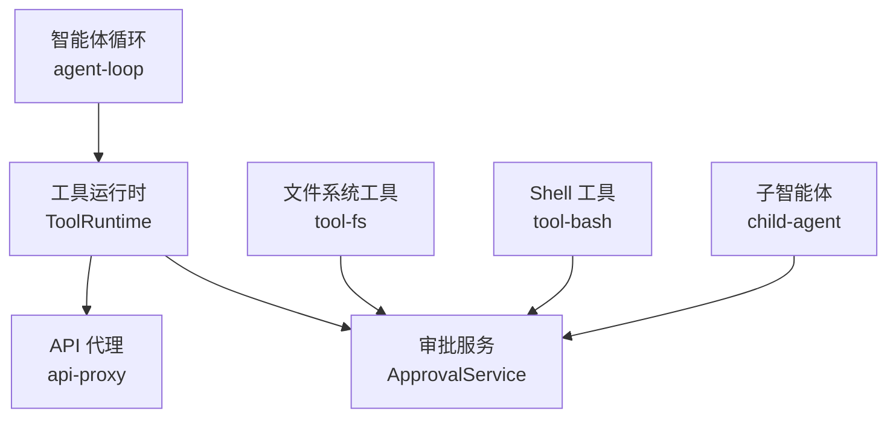
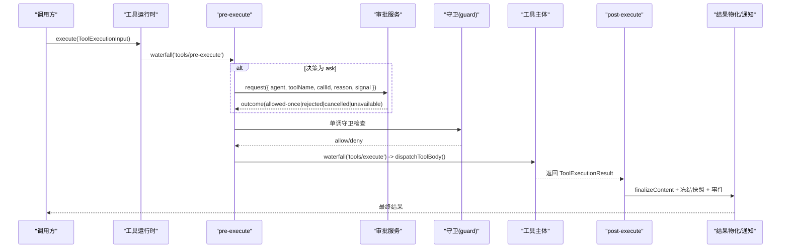
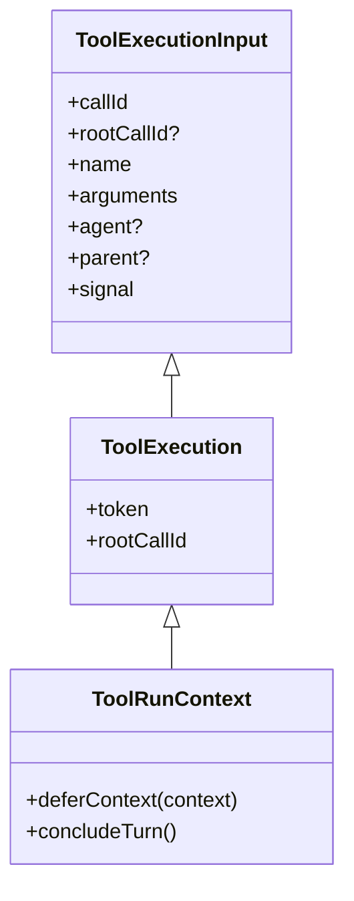
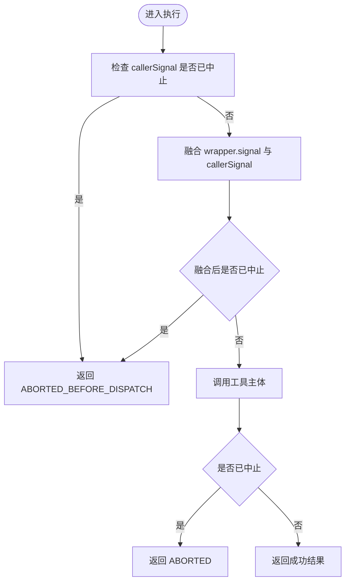
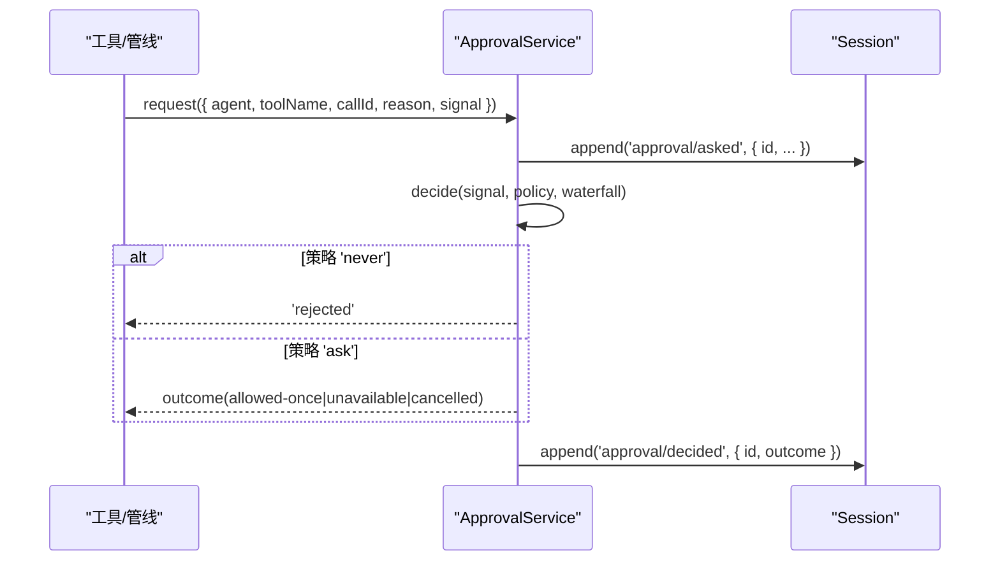
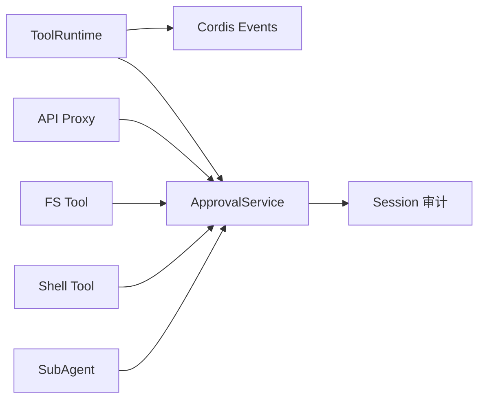

# 执行上下文管理

<cite>
**本文引用的文件**
- [packages/core/tools/src/index.ts](file://packages/core/tools/src/index.ts)
- [packages/interaction/user-approval/src/index.ts](file://packages/interaction/user-approval/src/index.ts)
- [packages/host/apiproxy/src/api-proxy.ts](file://packages/host/apiproxy/src/api-proxy.ts)
- [packages/core/agent-loop/src/index.ts](file://packages/core/agent-loop/src/index.ts)
- [packages/core/tools/tests/scoped.spec.ts](file://packages/core/tools/tests/scoped.spec.ts)
- [packages/fs/tool-fs/src/sandbox.ts](file://packages/fs/tool-fs/src/sandbox.ts)
- [packages/shell/tool-bash/src/index.ts](file://packages/shell/tool-bash/src/index.ts)
- [packages/subagent/subagent/src/child-agent.ts](file://packages/subagent/subagent/src/child-agent.ts)
</cite>

## 目录
1. [简介](#简介)
2. [项目结构](#项目结构)
3. [核心组件](#核心组件)
4. [架构总览](#架构总览)
5. [详细组件分析](#详细组件分析)
6. [依赖关系分析](#依赖关系分析)
7. [性能考量](#性能考量)
8. [故障排查指南](#故障排查指南)
9. [结论](#结论)
10. [附录：使用示例与最佳实践](#附录使用示例与最佳实践)

## 简介
本文件聚焦于“执行上下文”在工具调用生命周期中的管理，围绕以下能力展开：
- 信号（取消）：通过 AbortSignal 实现协作式取消，贯穿工具注册、预执行、审批、调度、执行与结果阶段。
- 智能体访问（Agent）：以 Agent 为作用域键，进行审批路由、审计日志归属、以及工具可见性过滤。
- 令牌（Token）：ToolExecutionToken 用于跨阶段关联同一调用的上下文，便于审计、追踪与组合工具传递。
- 审批机制（Approval）：将“ask/deny/allow”决策外置到可插拔的审批服务，支持会话策略切换与 UI 交互。

同时说明上下文的创建、传播与销毁机制，以及在工具中如何正确处理异步操作、资源管理与错误传播。

## 项目结构
与执行上下文相关的核心代码分布在如下模块：
- 工具运行时与执行管线：packages/core/tools/src/index.ts
- 审批服务与事件：packages/interaction/user-approval/src/index.ts
- API 代理对审批的桥接与清理：packages/host/apiproxy/src/api-proxy.ts
- 智能体循环中的取消竞速：packages/core/agent-loop/src/index.ts
- 工具作用域与令牌共享测试：packages/core/tools/tests/scoped.spec.ts
- 工具侧消费审批能力的示例：packages/fs/tool-fs/src/sandbox.ts、packages/shell/tool-bash/src/index.ts
- 子智能体对父级审批策略的继承：packages/subagent/subagent/src/child-agent.ts

图示来源
- [packages/core/tools/src/index.ts:1342-1600](file://packages/core/tools/src/index.ts#L1342-L1600)
- [packages/interaction/user-approval/src/index.ts:192-348](file://packages/interaction/user-approval/src/index.ts#L192-L348)
- [packages/host/apiproxy/src/api-proxy.ts:1407-1426](file://packages/host/apiproxy/src/api-proxy.ts#L1407-L1426)
- [packages/core/agent-loop/src/index.ts:108-139](file://packages/core/agent-loop/src/index.ts#L108-L139)
- [packages/fs/tool-fs/src/sandbox.ts:100](file://packages/fs/tool-fs/src/sandbox.ts#L100)
- [packages/shell/tool-bash/src/index.ts:226](file://packages/shell/tool-bash/src/index.ts#L226)
- [packages/subagent/subagent/src/child-agent.ts:202](file://packages/subagent/subagent/src/child-agent.ts#L202)

章节来源
- [packages/core/tools/src/index.ts:1342-1600](file://packages/core/tools/src/index.ts#L1342-L1600)
- [packages/interaction/user-approval/src/index.ts:192-348](file://packages/interaction/user-approval/src/index.ts#L192-L348)

## 核心组件
- ToolExecutionInput / ToolExecution / ToolRunContext：描述一次工具调用的输入、执行期身份与运行期上下文，包含 callId、rootCallId、token、signal、agent、parent、deferContext、concludeTurn 等。
- ToolExecutionToken：不可变标识，贯穿 pre-execute、execute、post-execute、result 各阶段，用于审计与组合工具上下文透传。
- ApprovalService：提供 ctx.approval.request(req)，基于会话策略（ask/never）与可插拔 answerer 链决定 allowed-once/rejected/cancelled/unavailable，并追加审计事件 approval/asked + approval/decided。
- 工具执行管线：pre-execute → 审批 ask 分支 → guard → execute（around-dispatch 包裹）→ post-execute → finalizeContent → result 事件。
- 取消融合：wrapper 可替换 exec.signal，但会被回融原始 callerSignal；工具主体启动后若被取消，返回 ABORTED；未启动即取消返回 ABORTED_BEFORE_DISPATCH。

章节来源
- [packages/core/tools/src/index.ts:314-424](file://packages/core/tools/src/index.ts#L314-L424)
- [packages/core/tools/src/index.ts:468-472](file://packages/core/tools/src/index.ts#L468-L472)
- [packages/core/tools/src/index.ts:1342-1600](file://packages/core/tools/src/index.ts#L1342-L1600)
- [packages/interaction/user-approval/src/index.ts:153-174](file://packages/interaction/user-approval/src/index.ts#L153-L174)
- [packages/interaction/user-approval/src/index.ts:257-348](file://packages/interaction/user-approval/src/index.ts#L257-L348)

## 架构总览
下图展示一次工具调用从入口到结果的完整流程，包括审批、取消、审计与结果物化。

图示来源
- [packages/core/tools/src/index.ts:1463-1600](file://packages/core/tools/src/index.ts#L1463-L1600)
- [packages/interaction/user-approval/src/index.ts:257-348](file://packages/interaction/user-approval/src/index.ts#L257-L348)

## 详细组件分析

### 工具执行上下文与令牌
- 创建：createExecution 生成 token、callId/rootCallId、冻结参数、记录 deferContext 与 concludeTurn，并缓存 callerSignal 与 bodyInvoked 状态。
- 传播：token 随 exec 进入 pre-execute、execute、post-execute、result 各阶段；组合工具可通过 parent 透传外层 token。
- 销毁：WeakMap 存储 deferredContexts、contentFinalizers、cancellationStates，随执行对象回收。

图示来源
- [packages/core/tools/src/index.ts:314-424](file://packages/core/tools/src/index.ts#L314-L424)
- [packages/core/tools/src/index.ts:1364-1451](file://packages/core/tools/src/index.ts#L1364-L1451)

章节来源
- [packages/core/tools/src/index.ts:1364-1451](file://packages/core/tools/src/index.ts#L1364-L1451)
- [packages/core/tools/tests/scoped.spec.ts:378-415](file://packages/core/tools/tests/scoped.spec.ts#L378-L415)

### 取消信号（AbortSignal）与融合
- 入口校验：prepareExecution 在进入流水线前检查 callerCancelled。
- 融合规则：dispatchToolBody 将 wrapper 替换的 signal 与原始 callerSignal 融合，确保无法切断上游取消。
- 终止语义：已启动则返回 ABORTED；未启动则返回 ABORTED_BEFORE_DISPATCH。
- 智能体层竞速：agent-loop 使用 raceAbortCall 保证创建/等待操作可被取消释放。

图示来源
- [packages/core/tools/src/index.ts:1509-1560](file://packages/core/tools/src/index.ts#L1509-L1560)
- [packages/core/agent-loop/src/index.ts:108-139](file://packages/core/agent-loop/src/index.ts#L108-L139)

章节来源
- [packages/core/tools/src/index.ts:1509-1560](file://packages/core/tools/src/index.ts#L1509-L1560)
- [packages/core/agent-loop/src/index.ts:108-139](file://packages/core/agent-loop/src/index.ts#L108-L139)

### 审批机制（Approval）
- 请求模型：ApprovalRequest 携带 agent、toolName、callId、reason、signal。
- 策略：会话策略 effectivePolicy 优先于插件默认 policy；'never' 直接拒绝，'ask' 进入 answerer 链。
- 审计：每次请求追加 approval/asked，结束后追加 approval/decided，成对持久化。
- 取消：若 req.signal 已中止或后续中止，返回 cancelled；answerer 抛出或非词汇值归一化为 unavailable。
- 作用域：按 agent 作用域分发，避免跨智能体误响应。

图示来源
- [packages/interaction/user-approval/src/index.ts:257-348](file://packages/interaction/user-approval/src/index.ts#L257-L348)

章节来源
- [packages/interaction/user-approval/src/index.ts:153-174](file://packages/interaction/user-approval/src/index.ts#L153-L174)
- [packages/interaction/user-approval/src/index.ts:257-348](file://packages/interaction/user-approval/src/index.ts#L257-L348)

### API 代理与审批通道
- 代理作为审批通道：将 ctx.approval 请求转为 mux 流上的可回答请求，由 POST /api/respond 结算。
- 挂起项清理：代理销毁时将所有 pending approvals 结算为 'cancelled'，避免悬挂 promise。
- 取消传播：当 ask 自身 abort 时，立即撤回并推送 cancelled，防止僵尸帧。

章节来源
- [packages/host/apiproxy/src/api-proxy.ts:1407-1426](file://packages/host/apiproxy/src/api-proxy.ts#L1407-L1426)

### 工具侧消费审批能力
- 文件系统工具：通过 ctx.get('approval') 获取可选审批能力，并在需要时发起审批。
- Shell 工具：同样通过 ctx.get('approval') 接入审批。
- 子智能体：若无父级审批能力，则向子智能体注入 'never' 策略，避免越权。

章节来源
- [packages/fs/tool-fs/src/sandbox.ts:100](file://packages/fs/tool-fs/src/sandbox.ts#L100)
- [packages/shell/tool-bash/src/index.ts:226](file://packages/shell/tool-bash/src/index.ts#L226)
- [packages/subagent/subagent/src/child-agent.ts:202](file://packages/subagent/subagent/src/child-agent.ts#L202)

## 依赖关系分析
- ToolRuntime 依赖 Cordis Context 的事件水线（waterfall）与系统提示组装。
- ApprovalService 依赖 Session 追加审计事件，并通过 scopeTarget 限定作用域。
- api-proxy 仅在存在 ctx.get('approval') 时启用审批桥接，保持可选集成。
- 工具实现通过 ctx.get('approval') 按需消费，无强耦合。

图示来源
- [packages/core/tools/src/index.ts:1342-1600](file://packages/core/tools/src/index.ts#L1342-L1600)
- [packages/interaction/user-approval/src/index.ts:192-348](file://packages/interaction/user-approval/src/index.ts#L192-L348)
- [packages/host/apiproxy/src/api-proxy.ts:1407-1426](file://packages/host/apiproxy/src/api-proxy.ts#L1407-L1426)

章节来源
- [packages/core/tools/src/index.ts:1342-1600](file://packages/core/tools/src/index.ts#L1342-L1600)
- [packages/interaction/user-approval/src/index.ts:192-348](file://packages/interaction/user-approval/src/index.ts#L192-L348)

## 性能考量
- 取消融合避免重复监听与泄漏：每次 around-dispatch 替换 signal 都会通过融合器与原始 callerSignal 绑定，并在 finally 中释放。
- 审批瀑布短路：'never' 策略在派发前决定，避免不必要的 UI 交互与网络往返。
- 审计事件成对追加：approval/asked 与 approval/decided 成对写入，减少回放歧义。
- 作用域分发：按 agent 作用域分派审批与工具事件，降低无关监听器的处理开销。

[本节为通用指导，不直接分析具体文件]

## 故障排查指南
- 审批在未打开 turn 时调用：会抛出错误，因为审计事件必须位于 turn 边界内。
- 审批 answerer 抛出异常：会被捕获并归一化为 'unavailable'，不会泄露到调用方。
- 工具主体未观察取消：可能表现为长时间挂起；需确保 await 点能感知 signal。
- 未知工具或模式折叠：code 模式下直接调用非 run_code 工具会被拒绝，应通过 SDK 子调用。
- 审批通道悬挂：若代理销毁而审批未结算，会被统一结算为 'cancelled'。

章节来源
- [packages/interaction/user-approval/src/index.ts:257-276](file://packages/interaction/user-approval/src/index.ts#L257-L276)
- [packages/interaction/user-approval/src/index.ts:317-343](file://packages/interaction/user-approval/src/index.ts#L317-L343)
- [packages/core/tools/src/index.ts:1324-1326](file://packages/core/tools/src/index.ts#L1324-L1326)
- [packages/host/apiproxy/src/api-proxy.ts:1414-1421](file://packages/host/apiproxy/src/api-proxy.ts#L1414-L1421)

## 结论
执行上下文以 ToolExecution 为中心，结合 Token 与 Agent 作用域，贯穿工具调用的全生命周期。取消信号通过融合机制确保可中断且不被剥离；审批机制将安全决策外置并可审计；API 代理提供跨进程审批通道并保证清理。遵循上述契约可在工具中正确实现异步、资源管理与错误传播。

[本节为总结，不直接分析具体文件]

## 附录：使用示例与最佳实践
以下为“如何使用”的代码片段路径指引（不包含具体代码内容）：
- 在工具中发起审批请求：
  - 参考路径：[packages/fs/tool-fs/src/sandbox.ts:100](file://packages/fs/tool-fs/src/sandbox.ts#L100)
  - 参考路径：[packages/shell/tool-bash/src/index.ts:226](file://packages/shell/tool-bash/src/index.ts#L226)
- 在审批服务中定义策略与答案器：
  - 参考路径：[packages/interaction/user-approval/src/index.ts:192-348](file://packages/interaction/user-approval/src/index.ts#L192-L348)
- 在工具执行管线中理解取消与令牌：
  - 参考路径：[packages/core/tools/src/index.ts:1342-1600](file://packages/core/tools/src/index.ts#L1342-L1600)
  - 参考路径：[packages/core/tools/tests/scoped.spec.ts:378-415](file://packages/core/tools/tests/scoped.spec.ts#L378-L415)
- 在智能体循环中使用取消竞速：
  - 参考路径：[packages/core/agent-loop/src/index.ts:108-139](file://packages/core/agent-loop/src/index.ts#L108-L139)
- 在 API 代理中桥接审批：
  - 参考路径：[packages/host/apiproxy/src/api-proxy.ts:1407-1426](file://packages/host/apiproxy/src/api-proxy.ts#L1407-L1426)

最佳实践清单
- 始终在异步 await 点检查并转发 AbortSignal。
- 不要合成永不中止的信号；如需派生子范围，请链接到上游信号。
- 在 code 模式下仅直接调用 run_code，其他工具通过 SDK 子调用。
- 审批请求必须在 open turn 内发起，以确保审计事件成对持久化。
- 使用 ctx.get('approval') 的可选消费方式，保持部署兼容性。
- 在 around-dispatch 中替换 signal 时，务必恢复原信号并在 finally 中释放融合器。

[本节为实践指导，不直接分析具体文件]