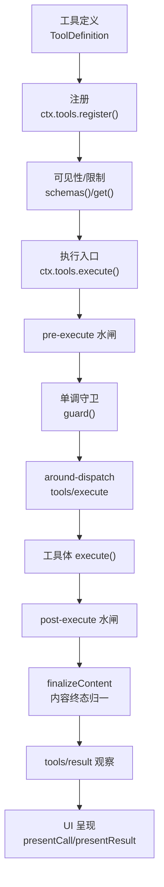
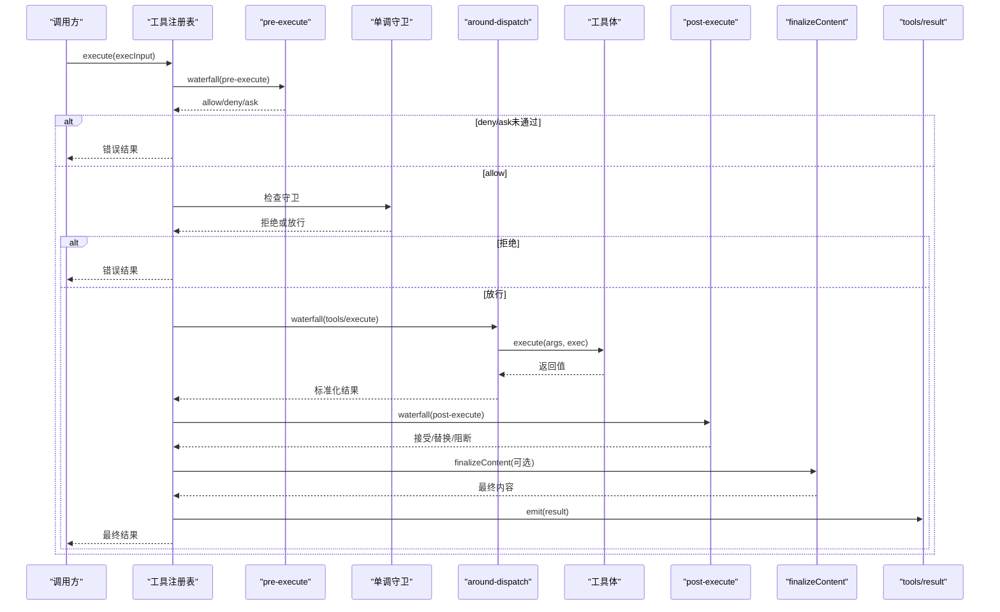
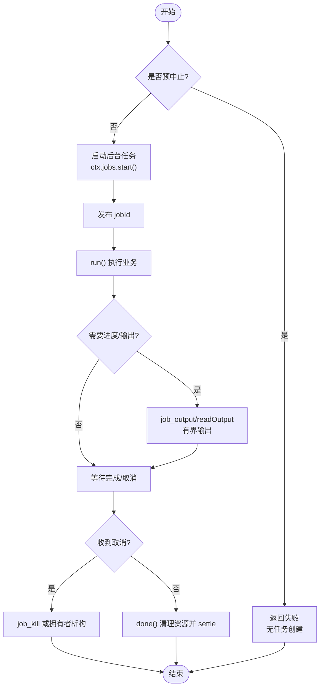
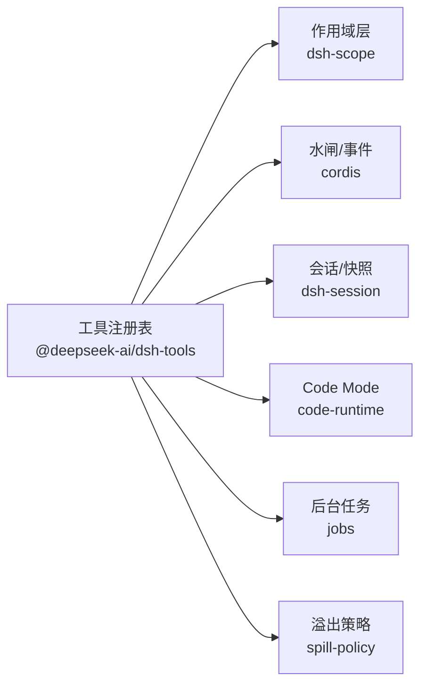

# 生命周期管理

<cite>
**本文引用的文件**
- [packages/core/tools/src/index.ts](file://packages/core/tools/src/index.ts)
- [docs/subsystems/tools.md](file://docs/subsystems/tools.md)
- [docs/tool-execution-pipeline.md](file://docs/tool-execution-pipeline.md)
- [docs/cookbook/adding-a-tool.md](file://docs/cookbook/adding-a-tool.md)
- [packages/jobs/tool-jobs/src/index.ts](file://packages/jobs/tool-jobs/src/index.ts)
- [packages/extensions/cordis-host-runner/src/guard.ts](file://packages/extensions/cordis-host-runner/src/guard.ts)
- [examples/headless-agent/tests/code-mode.e2e.ts](file://examples/headless-agent/tests/code-mode.e2e.ts)
- [packages/spill/spill-policy/src/index.ts](file://packages/spill/spill-policy/src/index.ts)
</cite>

## 目录
1. [简介](#简介)
2. [项目结构](#项目结构)
3. [核心组件](#核心组件)
4. [架构总览](#架构总览)
5. [详细组件分析](#详细组件分析)
6. [依赖关系分析](#依赖关系分析)
7. [性能考量](#性能考量)
8. [故障排查指南](#故障排查指南)
9. [结论](#结论)
10. [附录](#附录)

## 简介
本文件系统性阐述工具的生命周期：注册、初始化、执行与清理，重点说明 finalizeContent 回调的职责与实现要求（内容规范化与本地化支持），并给出资源管理机制（内存释放、文件句柄关闭、网络连接清理）以及长时运行工具的实践模式（后台任务、进度报告、取消机制）。同时提供最佳实践与性能优化建议。

## 项目结构
围绕工具生命周期，仓库的关键位置如下：
- 工具注册与执行管线：packages/core/tools/src/index.ts
- 工具文档与执行流程图：docs/subsystems/tools.md、docs/tool-execution-pipeline.md
- 工具作者指南与长时任务指引：docs/cookbook/adding-a-tool.md
- 后台作业工具与取消：packages/jobs/tool-jobs/src/index.ts
- 沙箱对工具注册的只读视图保护：packages/extensions/cordis-host-runner/src/guard.ts
- 长时任务取消行为验证用例：examples/headless-agent/tests/code-mode.e2e.ts
- 结果溢出策略（影响最终内容呈现）：packages/spill/spill-policy/src/index.ts

图示来源
- [packages/core/tools/src/index.ts:1031-1062](file://packages/core/tools/src/index.ts#L1031-L1062)
- [packages/core/tools/src/index.ts:1400-1600](file://packages/core/tools/src/index.ts#L1400-L1600)
- [docs/tool-execution-pipeline.md:8-58](file://docs/tool-execution-pipeline.md#L8-L58)

章节来源
- [packages/core/tools/src/index.ts:1031-1062](file://packages/core/tools/src/index.ts#L1031-L1062)
- [docs/subsystems/tools.md:9-96](file://docs/subsystems/tools.md#L9-L96)
- [docs/tool-execution-pipeline.md:8-58](file://docs/tool-execution-pipeline.md#L8-L58)

## 核心组件
- 工具定义与注册
  - ToolDefinition 包含模型可见的 schema、输出声明 output、可选的 finalizeContent、超时与并发安全标记、UI 呈现函数等。
  - ctx.tools.register() 校验 output.schema、timeoutMs 等约束，返回可调用析构器以注销工具。
- 执行管线
  - tools/pre-execute：允许/拒绝/询问（审批）。
  - 单调守卫：最终不可逆的拒绝。
  - tools/execute：超时、重试、指标等 around-dispatch。
  - tools/post-execute：接受/替换/阻断/附加上下文。
  - finalizeContent：最后一次内容转换，保证模型可见内容的不变式。
  - tools/result：最终不可变结果的观察者。
- 可见性与限制
  - schemas()/get() 暴露受限后的可见集合；reserved 名称受保护。
- UI 呈现
  - presentCall/presentResult 提供纯函数式的卡片渲染意图，不耦合具体 UI。

章节来源
- [docs/subsystems/tools.md:9-96](file://docs/subsystems/tools.md#L9-L96)
- [packages/core/tools/src/index.ts:1031-1062](file://packages/core/tools/src/index.ts#L1031-L1062)
- [packages/core/tools/src/index.ts:1100-1116](file://packages/core/tools/src/index.ts#L1100-L1116)
- [packages/core/tools/src/index.ts:1228-1261](file://packages/core/tools/src/index.ts#L1228-L1261)

## 架构总览
工具从注册到执行的完整时序如下：

图示来源
- [packages/core/tools/src/index.ts:1400-1600](file://packages/core/tools/src/index.ts#L1400-L1600)
- [docs/tool-execution-pipeline.md:8-58](file://docs/tool-execution-pipeline.md#L8-L58)

章节来源
- [packages/core/tools/src/index.ts:1400-1600](file://packages/core/tools/src/index.ts#L1400-L1600)
- [docs/tool-execution-pipeline.md:8-58](file://docs/tool-execution-pipeline.md#L8-L58)

## 详细组件分析

### 注册与初始化
- 注册阶段
  - 校验 output.schema 为受支持的 JSON Schema 子集，校验 timeoutMs 为正有限数。
  - 保留 reserved 名称（如 run_code）不被覆盖。
  - 返回精确的析构器，用于插件 fiber 销毁时自动注销。
- 初始化阶段
  - 构建可见视图：合并全局与层级作用域的注册，应用 allow/deny 限制。
  - 生成模型可见的 ToolSchema[]，不包含执行与呈现回调，避免泄漏到模型请求。

章节来源
- [packages/core/tools/src/index.ts:1031-1062](file://packages/core/tools/src/index.ts#L1031-L1062)
- [packages/core/tools/src/index.ts:1152-1193](file://packages/core/tools/src/index.ts#L1152-L1193)
- [packages/core/tools/src/index.ts:1228-1261](file://packages/core/tools/src/index.ts#L1228-L1261)

### 执行流程与取消
- 参数快照与冻结：在政策前将 arguments 深拷贝并冻结，确保执行身份不可变。
- 取消语义
  - 在 pre-execute 之前或期间取消：返回“调度前中止”。
  - 进入工具体后取消：返回“已启动后中止”，但不会硬杀进程，需工具体协作退出。
  - around-dispatch 可替换信号，但最终会与原始 caller 信号融合，无法脱离调用方取消。
- 管道扩展点
  - tools/pre-execute：权限、沙箱、审批。
  - tools/execute：超时、重试、指标。
  - tools/post-execute：结果替换、阻断、附加上下文。
  - tools/result：最终不可变结果观察。

章节来源
- [packages/core/tools/src/index.ts:1400-1600](file://packages/core/tools/src/index.ts#L1400-L1600)
- [docs/subsystems/tools.md:170-405](file://docs/subsystems/tools.md#L170-L405)

### finalizeContent 的作用与实现要求
- 职责定位
  - 最后一次针对模型可见内容的转换，发生在 post-execute 之后、持久化与 UI 呈现之前。
  - 必须是无副作用的同步函数，不得抛出；返回 undefined 表示保留现有内容。
- 内容规范化
  - 用于统一内容格式、截断超大文本、脱敏敏感信息、补充本地化文案等。
  - 可与 spill-policy 配合：当结果过大时，用提示替代内联内容，保持模型可见内容稳定。
- 本地化支持
  - 可在 finalizeContent 中根据当前会话/用户语言选择展示文案，确保多语言一致性。
  - 注意：本地化逻辑应保持幂等与可重放，因为可能在回放路径中被调用。
- 与 UI 呈现分离
  - finalizeContent 负责模型可见内容；UI 卡片由 presentCall/presentResult 负责，二者职责清晰。

章节来源
- [docs/subsystems/tools.md:41-52](file://docs/subsystems/tools.md#L41-L52)
- [docs/subsystems/tools.md:370-375](file://docs/subsystems/tools.md#L370-L375)
- [packages/spill/spill-policy/src/index.ts:180-209](file://packages/spill/spill-policy/src/index.ts#L180-L209)

### 资源管理与清理
- 内存释放
  - 工具体应避免持有大对象引用至执行结束；必要时显式置空或释放缓存。
  - 使用 bounded 输出（如 TextRetainer）控制文本大小，避免内存膨胀。
- 文件句柄关闭
  - 所有打开的文件流应在 finally 块中关闭；异步写入需等待完成或在 dispose 中 drain。
- 网络连接清理
  - HTTP 客户端、WebSocket、gRPC 通道需在取消或失败路径上显式关闭。
  - 对于外部进程/子进程，遵循优雅关停阶梯：先 EOF/SIGTERM，再 SIGKILL。
- 插件级清理
  - ctx.tools.register() 返回的析构器应绑定到插件 fiber 的 dispose，确保 HMR 与安全卸载。
  - 沙箱环境仅暴露只读视图，防止包代码绕过执行管线直接调用其他工具。

章节来源
- [packages/jobs/tool-jobs/src/index.ts:111-135](file://packages/jobs/tool-jobs/src/index.ts#L111-L135)
- [packages/extensions/cordis-host-runner/src/guard.ts:639-655](file://packages/extensions/cordis-host-runner/src/guard.ts#L639-L655)
- [docs/cookbook/adding-a-tool.md:40-66](file://docs/cookbook/adding-a-tool.md#L40-L66)

### 长时运行工具的实现模式
- 背景任务
  - 通过 ctx.jobs.start({ kind, label, owner, run }) 注册后台任务，返回结构化句柄（如 { kind:'background', jobId }）。
  - 生产者需提供同步 cancel、非拒绝的 done（在资源清理后 settle）、可选的 readOutput（有界输出格式化）。
- 进度报告
  - 使用 job_output/job_list 工具查询状态；notice 通知完成，注入到拥有者下一次请求。
- 取消机制
  - 预发布取消：无任务被创建，调用立即失败。
  - 发布后取消：外层调用取消仅停止等待，不杀死已发布的任务；需通过 job_kill 或拥有者析构来终止。
- 示例验证
  - 测试覆盖了“预中止不启动”和“发布后中止仍保留任务”的行为。

图示来源
- [docs/cookbook/adding-a-tool.md:51-56](file://docs/cookbook/adding-a-tool.md#L51-L56)
- [packages/jobs/tool-jobs/src/index.ts:362-402](file://packages/jobs/tool-jobs/src/index.ts#L362-L402)
- [examples/headless-agent/tests/code-mode.e2e.ts:212-237](file://examples/headless-agent/tests/code-mode.e2e.ts#L212-L237)

章节来源
- [docs/cookbook/adding-a-tool.md:51-56](file://docs/cookbook/adding-a-tool.md#L51-L56)
- [packages/jobs/tool-jobs/src/index.ts:362-402](file://packages/jobs/tool-jobs/src/index.ts#L362-L402)
- [examples/headless-agent/tests/code-mode.e2e.ts:212-237](file://examples/headless-agent/tests/code-mode.e2e.ts#L212-L237)

## 依赖关系分析
- 工具注册表依赖
  - 作用域层 dsh-scope：按作用域链组装可见工具与限制。
  - 事件与水闸 cordis：waterfall 机制串联 pre/around/post 钩子。
  - 会话与日志 dsh-session：参数快照、结果持久化。
  - 系统提示与 Code Mode：reserved 名称与 SDK 投影。
- 工具与子系统交互
  - jobs：后台任务生命周期与通知。
  - spill-policy：结果溢出时的内容替换。
  - code-runtime：Code Mode 下的工具可达性。

图示来源
- [packages/core/tools/src/index.ts:1-28](file://packages/core/tools/src/index.ts#L1-L28)
- [packages/core/tools/src/index.ts:1152-1193](file://packages/core/tools/src/index.ts#L1152-L1193)
- [packages/spill/spill-policy/src/index.ts:180-209](file://packages/spill/spill-policy/src/index.ts#L180-L209)

章节来源
- [packages/core/tools/src/index.ts:1-28](file://packages/core/tools/src/index.ts#L1-L28)
- [packages/core/tools/src/index.ts:1152-1193](file://packages/core/tools/src/index.ts#L1152-L1193)
- [packages/spill/spill-policy/src/index.ts:180-209](file://packages/spill/spill-policy/src/index.ts#L180-L209)

## 性能考量
- 参数与结果快照
  - 在执行前进行一次性深拷贝与冻结，避免后续重复序列化成本。
- 有界输出
  - 使用 TextRetainer 等机制限制输出字节数，减少内存占用与传输开销。
- 并行与独占
  - isConcurrencySafe 决定是否可以与其他调用并行；谨慎声明以避免竞争条件。
- 超时与取消
  - 合理设置 timeoutMs，并在工具体内及时响应 exec.signal，尽快达到静默状态。
- 内容裁剪
  - 结合 spill-policy 在 post-execute 阶段裁剪超大文本，避免阻塞 UI 与日志。

章节来源
- [docs/subsystems/tools.md:54-74](file://docs/subsystems/tools.md#L54-L74)
- [packages/jobs/tool-jobs/src/index.ts:111-135](file://packages/jobs/tool-jobs/src/index.ts#L111-L135)
- [packages/spill/spill-policy/src/index.ts:180-209](file://packages/spill/spill-policy/src/index.ts#L180-L209)

## 故障排查指南
- 常见错误
  - 未知工具：名称不在可见集合或被 collapse 规则拒绝。
  - 参数无效：arguments 无法无损 JSON 序列化或不符合 schema。
  - 输出无效：execute 返回值或 render/presentationMeta 抛出异常。
  - 超时：timeoutMs 未正确设置或未在工具体内响应取消。
- 诊断步骤
  - 检查 schemas() 输出确认工具可见性。
  - 在 tools/pre-execute 与 tools/post-execute 中添加日志，定位决策点。
  - 使用 tools/result 监听最终结果，核对 content/value/meta。
  - 对后台任务，使用 job_list/job_output 查看状态，必要时 job_kill 终止。
- 资源泄漏
  - 确认插件 fiber 析构时调用了 register 返回的析构器。
  - 检查文件句柄、网络连接的关闭路径，确保在 finally 或 dispose 中释放。

章节来源
- [packages/core/tools/src/index.ts:1400-1600](file://packages/core/tools/src/index.ts#L1400-L1600)
- [packages/core/tools/src/index.ts:1031-1062](file://packages/core/tools/src/index.ts#L1031-L1062)
- [packages/jobs/tool-jobs/src/index.ts:362-402](file://packages/jobs/tool-jobs/src/index.ts#L362-L402)

## 结论
工具生命周期通过严格的注册校验、可扩展的执行管线与最终的 finalizeContent 保障，实现了从输入到输出的全链路可控。资源管理强调显式释放与优雅关停，长时任务通过后台作业与取消机制解耦调用者与任务生命周期。遵循本文的最佳实践，可获得高可靠、高性能且易维护的工具实现。

## 附录
- 最佳实践清单
  - 始终使用 defineTool 声明 schema 与 output，避免手写脆弱契约。
  - 在 execute 中尊重 exec.signal，尽快达到静默状态。
  - 将 UI 呈现与模型内容分离：render 面向模型，presentCall/presentResult 面向 UI。
  - 使用 finalizeContent 做内容规范化与本地化，保持幂等与可重放。
  - 后台任务通过 ctx.jobs.start 管理，使用 job_kill 作为明确取消入口。
  - 在插件 fiber 析构时调用 register 返回的析构器，确保 HMR 安全。
- 性能优化技巧
  - 采用有界输出与内容裁剪，避免大对象常驻内存。
  - 合理使用 isConcurrencySafe，提升吞吐的同时避免竞争。
  - 设置合理的 timeoutMs，并在工具体内快速响应取消。
  - 利用 spill-policy 在 post-execute 阶段裁剪超大结果，降低 IO 压力。