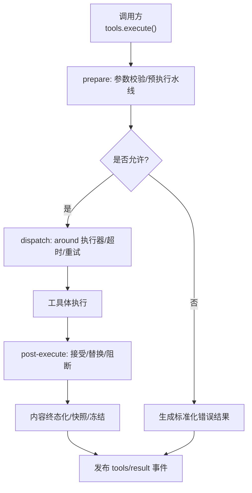
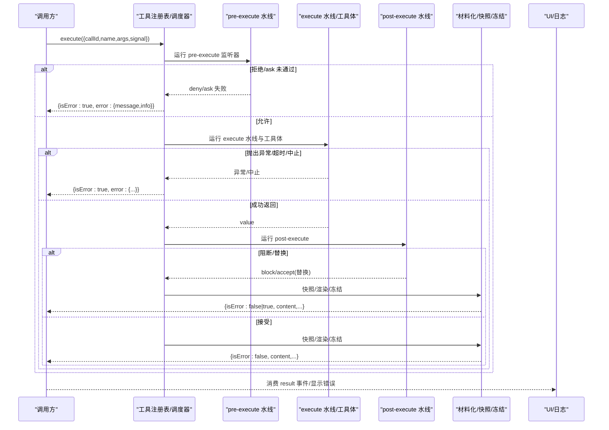
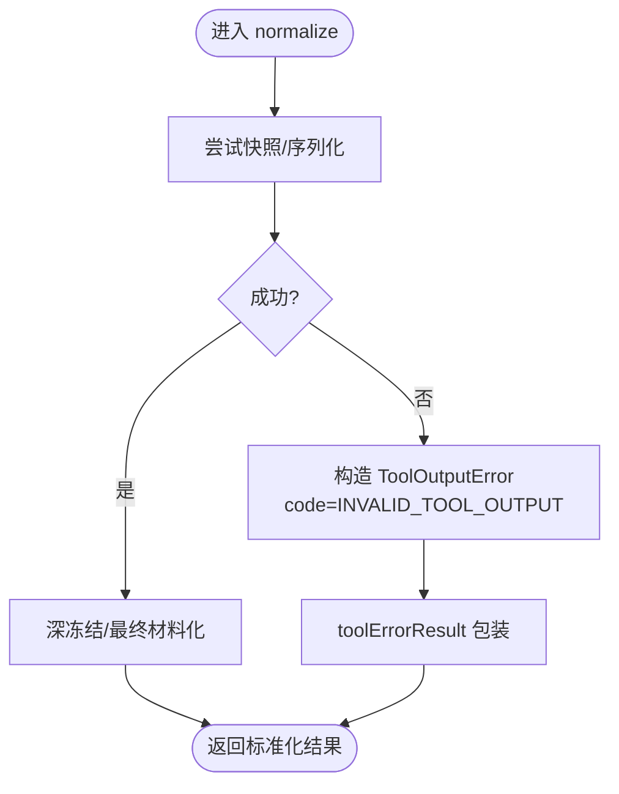
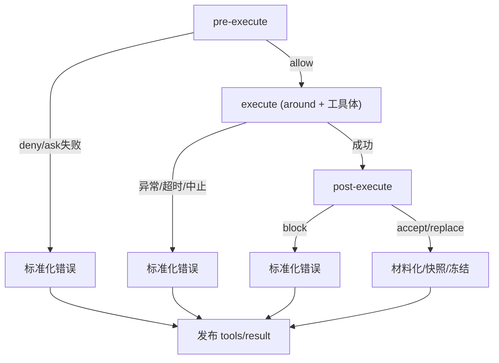
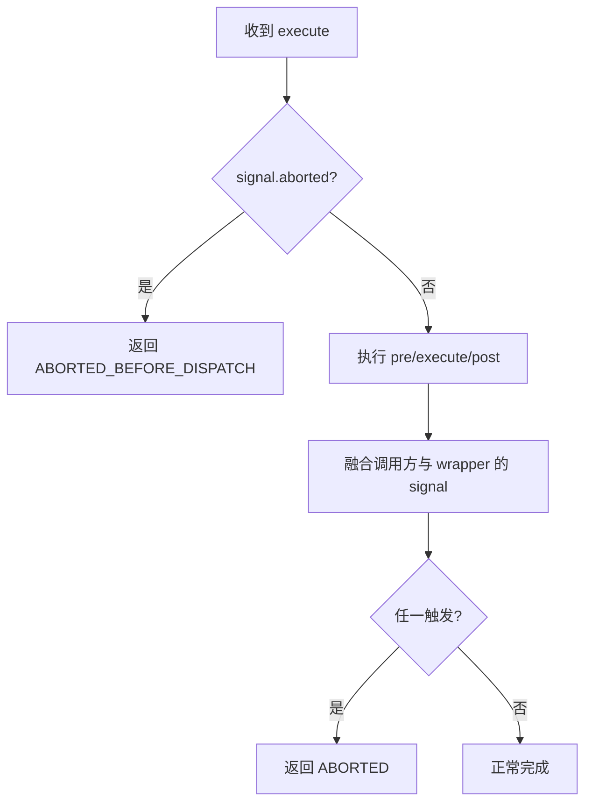
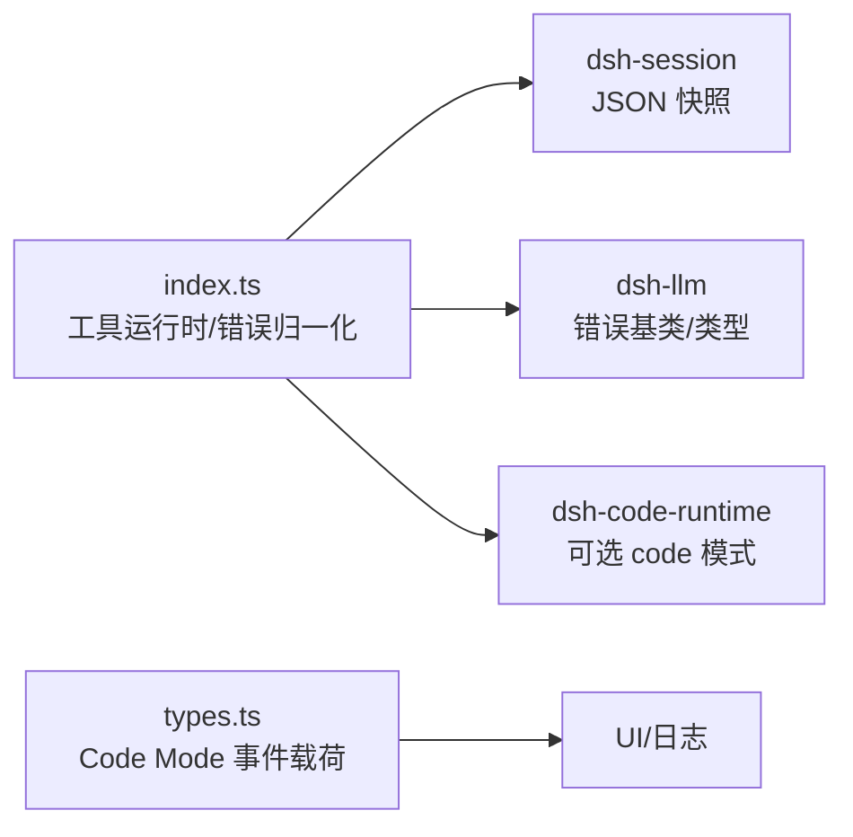

# 错误处理机制

<cite>
**本文引用的文件**
- [packages/core/tools/src/index.ts](file://packages/core/tools/src/index.ts)
- [packages/core/tools/tests/tools.spec.ts](file://packages/core/tools/tests/tools.spec.ts)
- [packages/core/tools/tests/scoped.spec.ts](file://packages/core/tools/tests/scoped.spec.ts)
- [packages/core/tools/tests/invariant.spec.ts](file://packages/core/tools/tests/invariant.spec.ts)
- [packages/subagent/subagent-in-process-driver/tests/structured.spec.ts](file://packages/subagent/subagent-in-process-driver/tests/structured.spec.ts)
- [packages/client/ui-conversation/src/client/conversation-nodes/turn-error.ts](file://packages/client/ui-conversation/src/client/conversation-nodes/turn-error.ts)
- [docs/subsystems/code-runtime.zh.md](file://docs/subsystems/code-runtime.zh.md)
</cite>

## 目录
1. [简介](#简介)
2. [项目结构](#项目结构)
3. [核心组件](#核心组件)
4. [架构总览](#架构总览)
5. [详细组件分析](#详细组件分析)
6. [依赖关系分析](#依赖关系分析)
7. [性能考量](#性能考量)
8. [故障排查指南](#故障排查指南)
9. [结论](#结论)
10. [附录](#附录)

## 简介
本文件系统性说明工具执行过程中的异常捕获、错误分类与错误传播策略，重点覆盖 normalize 阶段的错误标准化（包括快照失败转换为 isError 的机制），以及 pre-execute、execute、post-execute 各阶段的错误处理差异。同时提供错误恢复策略与调试技巧，帮助快速定位和解决常见工具执行错误。

## 项目结构
工具执行管道位于 core/tools 包中，通过事件水线（waterfall）组织 pre-execute、execute、post-execute 三个阶段，并在每个阶段进行输入/输出规范化、快照化、冻结与最终结果发布。错误在多处被统一归一为结构化失败对象，确保下游（UI、持久化、重试策略）可一致消费。

图表来源
- [packages/core/tools/src/index.ts:1459-1621](file://packages/core/tools/src/index.ts#L1459-L1621)
- [packages/core/tools/src/index.ts:1792-1823](file://packages/core/tools/src/index.ts#L1792-L1823)
- [packages/core/tools/src/index.ts:1870-1947](file://packages/core/tools/src/index.ts#L1870-L1947)

章节来源
- [packages/core/tools/src/index.ts:1459-1621](file://packages/core/tools/src/index.ts#L1459-L1621)
- [packages/core/tools/src/index.ts:1792-1823](file://packages/core/tools/src/index.ts#L1792-L1823)
- [packages/core/tools/src/index.ts:1870-1947](file://packages/core/tools/src/index.ts#L1870-L1947)

## 核心组件
- 工具运行时与调度器：负责准备、分发、收尾三个关键步骤，贯穿错误捕获与标准化。
- 错误类型与代码：
  - 未知工具：UNKNOWN_TOOL
  - 无效工具输出：INVALID_TOOL_OUTPUT
  - 中止：ABORTED / ABORTED_BEFORE_DISPATCH
- 错误归一化：将任意抛出的值或投影/快照失败统一转为 isError=true 的结构化结果，并附带人类可读消息与 info 元数据。
- 快照与冻结：对 body 返回值、render/presentationMeta 输出、最终结果进行 JSON 快照与深冻结，保证可序列化与不可变。

章节来源
- [packages/core/tools/src/index.ts:471-486](file://packages/core/tools/src/index.ts#L471-L486)
- [packages/core/tools/src/index.ts:524-553](file://packages/core/tools/src/index.ts#L524-L553)
- [packages/core/tools/src/index.ts:1870-1947](file://packages/core/tools/src/index.ts#L1870-L1947)

## 架构总览
下图展示一次工具调用的完整生命周期与错误传播路径，标注了各阶段可能产生错误的位置及处理方式。

图表来源
- [packages/core/tools/src/index.ts:1459-1621](file://packages/core/tools/src/index.ts#L1459-L1621)
- [packages/core/tools/src/index.ts:1792-1823](file://packages/core/tools/src/index.ts#L1792-L1823)
- [packages/core/tools/src/index.ts:1870-1947](file://packages/core/tools/src/index.ts#L1870-L1947)

## 详细组件分析

### 错误归一化与标准化（normalize）
- 任意异常捕获：工具体、pre/post 水线、投影 render/presentationMeta、快照过程均可能被异常击穿；统一通过 toolErrorResult 包装为 isError=true 的结果，content 包含“Error: ...”文本，error.message 为人类可读信息，error.info 携带 name/code。
- 快照失败标准化：body 返回值、render、presentationMeta 等都会经过 snapshotJsonValue；若不可序列化或 getter 抛错，会转化为 ToolOutputError（code=INVALID_TOOL_OUTPUT），并最终被归一化为标准错误结果。
- 宿主不可打印值保护：errorMessage 对无法检查的对象做兜底，避免二次崩溃。

图表来源
- [packages/core/tools/src/index.ts:524-553](file://packages/core/tools/src/index.ts#L524-L553)
- [packages/core/tools/src/index.ts:1870-1878](file://packages/core/tools/src/index.ts#L1870-L1878)

章节来源
- [packages/core/tools/src/index.ts:524-553](file://packages/core/tools/src/index.ts#L524-L553)
- [packages/core/tools/src/index.ts:1870-1878](file://packages/core/tools/src/index.ts#L1870-L1878)
- [packages/core/tools/tests/tools.spec.ts:132-155](file://packages/core/tools/tests/tools.spec.ts#L132-L155)
- [packages/core/tools/tests/tools.spec.ts:158-196](file://packages/core/tools/tests/tools.spec.ts#L158-L196)
- [packages/core/tools/tests/tools.spec.ts:262-282](file://packages/core/tools/tests/tools.spec.ts#L262-L282)

### 阶段差异：pre-execute / execute / post-execute
- pre-execute
  - 用于准入控制、审计、限流、权限审批等。可返回 allow/deny/ask。
  - 若拒绝或 ask 未通过，直接生成标准化错误结果，不进入后续阶段。
  - 支持异步门控，需观察 exec.signal；取消会在后续重新评估。
- execute
  - 围绕工具体的“around”水线，适合实现超时、重试、指标收集等。
  - 工具体抛错会被捕获并归一化；wrapper 也可直接返回 isError 结果。
  - 取消信号融合：调用方与 wrapper 的 AbortSignal 会被合并，任一触发即中止。
- post-execute
  - 对已结算结果进行接受、替换、附加上下文或阻断（block）。
  - 即使工具体抛错，也会以 isError 结果进入 post-execute，便于统一拦截。
  - 若 caller 在 post-execute 后取消且此前结果为成功，则升级为中止结果。

图表来源
- [packages/core/tools/src/index.ts:1459-1621](file://packages/core/tools/src/index.ts#L1459-L1621)
- [packages/core/tools/src/index.ts:1870-1947](file://packages/core/tools/src/index.ts#L1870-L1947)

章节来源
- [packages/core/tools/tests/tools.spec.ts:1158-1187](file://packages/core/tools/tests/tools.spec.ts#L1158-L1187)
- [packages/core/tools/tests/tools.spec.ts:1579-1612](file://packages/core/tools/tests/tools.spec.ts#L1579-L1612)
- [packages/core/tools/tests/tools.spec.ts:1719-1738](file://packages/core/tools/tests/tools.spec.ts#L1719-L1738)
- [packages/core/tools/tests/invariant.spec.ts:40-70](file://packages/core/tools/tests/invariant.spec.ts#L40-L70)

### 中止与取消传播
- 取消点：
  - 调用前取消：ABORTED_BEFORE_DISPATCH
  - 工具体已启动后取消：ABORTED
- 信号融合：fuseToolSignals 将调用方与 wrapper 的 AbortSignal 合并，任一触发即中止，避免嵌套 any。
- 行为：
  - 若工具体尚未执行即取消，走“调用前中止”路径。
  - 若工具体已执行但随后取消，成功结果会被覆盖为中止结果，保留 additionalContexts。

图表来源
- [packages/core/tools/src/index.ts:1880-1947](file://packages/core/tools/src/index.ts#L1880-L1947)

章节来源
- [packages/core/tools/src/index.ts:1880-1947](file://packages/core/tools/src/index.ts#L1880-L1947)
- [packages/core/tools/tests/tools.spec.ts:1158-1187](file://packages/core/tools/tests/tools.spec.ts#L1158-L1187)
- [packages/core/tools/tests/tools.spec.ts:1579-1612](file://packages/core/tools/tests/tools.spec.ts#L1579-L1612)

### 错误分类与传播
- 未知工具：UNKNOWN_TOOL（ToolNotFoundError）
- 无效输出：INVALID_TOOL_OUTPUT（ToolOutputError）
- 中止：ABORTED / ABORTED_BEFORE_DISPATCH
- 传播路径：
  - 任何阶段抛错 → toolErrorResult → isError=true 的标准结果
  - 投影/快照失败 → ToolOutputError → 标准化错误
  - 取消 → 根据是否已执行工具体选择不同中止码
- 下游消费：
  - UI 层从 turn/end 事件中读取 failure.code/message 进行展示
  - 持久化/诊断使用 info.name/info.code 进行分类与路由

章节来源
- [packages/core/tools/src/index.ts:471-522](file://packages/core/tools/src/index.ts#L471-L522)
- [packages/core/tools/src/index.ts:1870-1947](file://packages/core/tools/src/index.ts#L1870-L1947)
- [packages/client/ui-conversation/src/client/conversation-nodes/turn-error.ts:39-61](file://packages/client/ui-conversation/src/client/conversation-nodes/turn-error.ts#L39-L61)
- [packages/core/tools/tests/tools.spec.ts:630-642](file://packages/core/tools/tests/tools.spec.ts#L630-L642)

### 快照失败到 isError 的机制
- 场景：
  - 工具体返回非 JSON 可丢失的值
  - render/presentationMeta 抛出异常或返回非 JSON 可丢失值
  - 属性访问器（getter）在快照时抛错
- 机制：
  - snapshotToolValue/snapshotProjection 捕获异常并转为 ToolOutputError
  - 最终由 toolErrorResult 包装为 isError=true 的结果
  - finalizeContent 仍会被调用一次，以便裁剪/截断错误文本长度

章节来源
- [packages/core/tools/src/index.ts:524-553](file://packages/core/tools/src/index.ts#L524-L553)
- [packages/core/tools/src/index.ts:1792-1823](file://packages/core/tools/src/index.ts#L1792-L1823)
- [packages/core/tools/tests/tools.spec.ts:158-196](file://packages/core/tools/tests/tools.spec.ts#L158-L196)
- [packages/core/tools/tests/tools.spec.ts:262-282](file://packages/core/tools/tests/tools.spec.ts#L262-L282)

### 子代理与 pre-execute 拒绝的传播
- 在子代理场景中，pre-execute 拒绝不会提升其他执行的阶段，仅影响当前调用，并以 isError 形式返回。
- 这保证了同一 callId 复用时的阶段一致性，避免跨调用污染。

章节来源
- [packages/subagent/subagent-in-process-driver/tests/structured.spec.ts:712-744](file://packages/subagent/subagent-in-process-driver/tests/structured.spec.ts#L712-L744)

## 依赖关系分析
- 模块内依赖：
  - index.ts 集中实现了工具运行时、错误归一化、快照与冻结、信号融合等核心逻辑
  - types.ts 定义 Code Mode 子调度的事件载荷，供上层记录与 UI 消费
- 外部依赖：
  - dsh-session 提供 JSON 快照能力
  - dsh-llm 提供错误基类与类型
  - dsh-code-runtime 提供 code 模式下的执行环境（可选）

图表来源
- [packages/core/tools/src/index.ts:1-25](file://packages/core/tools/src/index.ts#L1-L25)
- [packages/core/tools/src/types.ts:10-57](file://packages/core/tools/src/types.ts#L10-L57)

章节来源
- [packages/core/tools/src/index.ts:1-25](file://packages/core/tools/src/index.ts#L1-L25)
- [packages/core/tools/src/types.ts:10-57](file://packages/core/tools/src/types.ts#L10-L57)

## 性能考量
- 快照与冻结：对每次成功结果进行 JSON 快照与深冻结，确保可序列化与不可变，代价是额外 CPU 与内存开销。应尽量避免在高频路径上创建复杂对象。
- 信号融合：仅在需要时监听 abort 事件，并在 settle 时释放，避免长期持有引用导致泄漏。
- 并行子调用：run_code 的 maxParallelSubCalls 默认 10，可根据负载调整以避免资源争用。

[本节为通用指导，无需特定文件来源]

## 故障排查指南
- 常见问题与定位
  - 未知工具：检查工具名是否正确注册，是否在可见范围内（受 scope/restrict/mode 影响）
  - 无效输出：检查工具 output.schema 与实际返回值是否匹配；render/presentationMeta 是否抛出异常或返回不可序列化值
  - 中止：确认调用方是否提前取消；wrapper 是否替换了 signal；工具体是否及时响应取消
  - 快照失败：定位具体 getter/投影函数，修复其可序列化性
- 调试技巧
  - 订阅 tools/pre-execute/tools/execute/tools/post-execute 观察阶段进入顺序与决策
  - 订阅 tools/result 获取最终冻结结果，核对 isError 与 error.info
  - 使用最小复现用例隔离问题（如只注册一个 echo 工具）
  - 结合单元测试断言（参考测试用例中的期望）验证行为

章节来源
- [packages/core/tools/tests/tools.spec.ts:132-155](file://packages/core/tools/tests/tools.spec.ts#L132-L155)
- [packages/core/tools/tests/tools.spec.ts:630-642](file://packages/core/tools/tests/tools.spec.ts#L630-L642)
- [packages/core/tools/tests/tools.spec.ts:1719-1738](file://packages/core/tools/tests/tools.spec.ts#L1719-L1738)
- [packages/core/tools/tests/invariant.spec.ts:40-70](file://packages/core/tools/tests/invariant.spec.ts#L40-L70)

## 结论
该工具执行管道通过严格的水线设计与统一的错误归一化，确保了异常捕获、错误分类与传播的一致性与可观测性。normalize 阶段将各类快照与投影失败稳定地转换为 isError 结果，配合中止码区分与下游消费模型，使系统具备高鲁棒性与易调试性。建议在使用中遵循最佳实践：明确声明 output.schema、保证 render/presentationMeta 的幂等与可序列化、正确处理取消信号，并通过事件水线扩展可观测性与策略控制。

[本节为总结，无需特定文件来源]

## 附录
- 相关文档参考：
  - 代码运行时失败类型与语义（正交报告）：见 docs/subsystems/code-runtime.zh.md

章节来源
- [docs/subsystems/code-runtime.zh.md:136-157](file://docs/subsystems/code-runtime.zh.md#L136-L157)