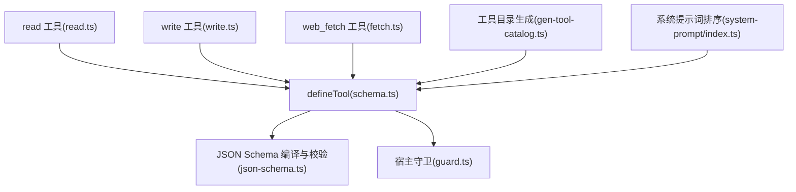
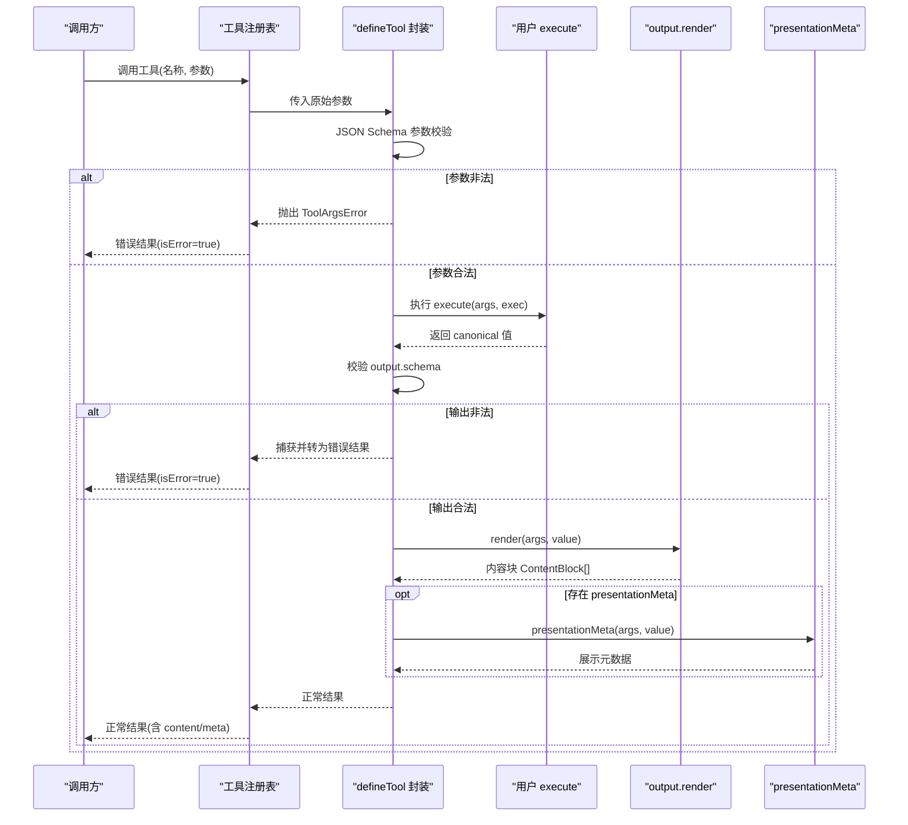
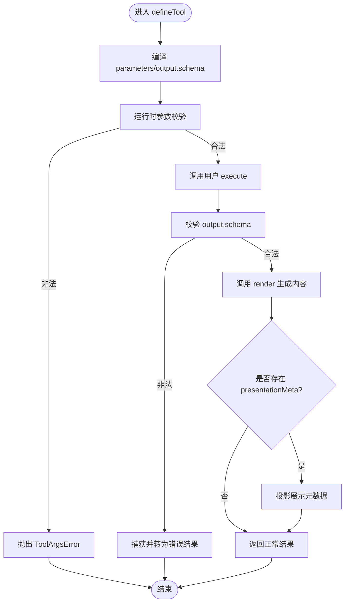
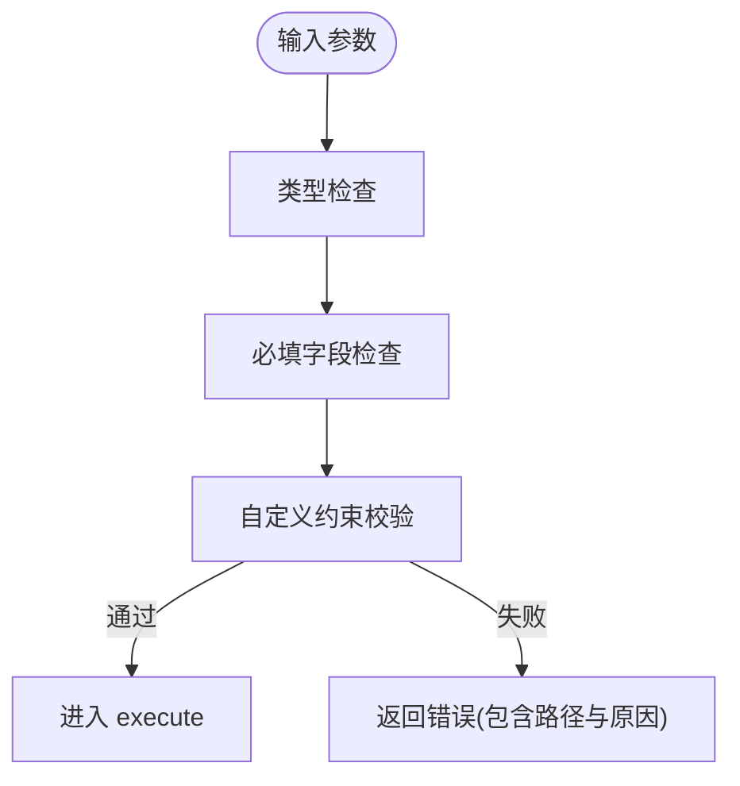
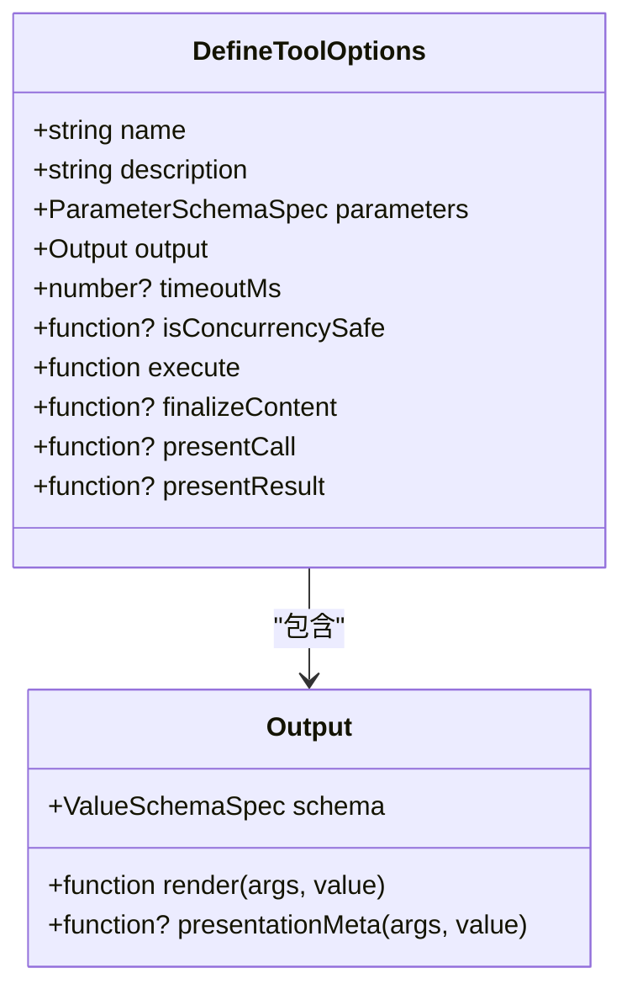
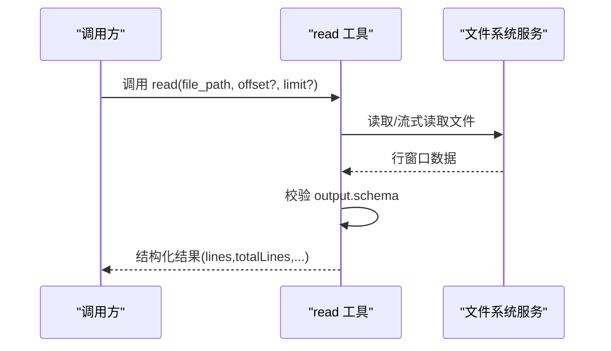
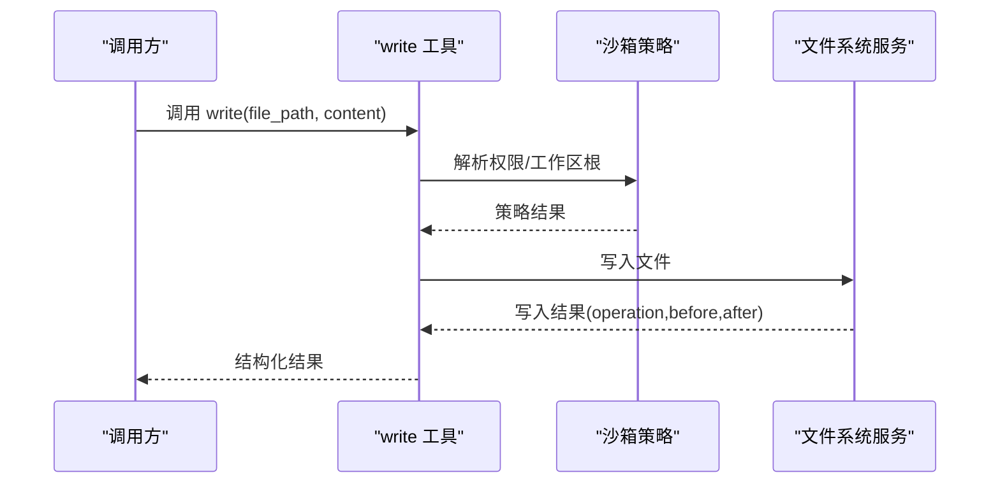
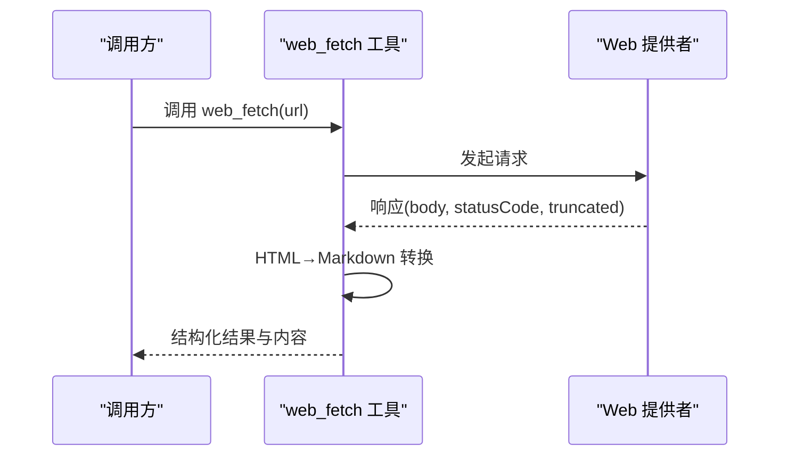
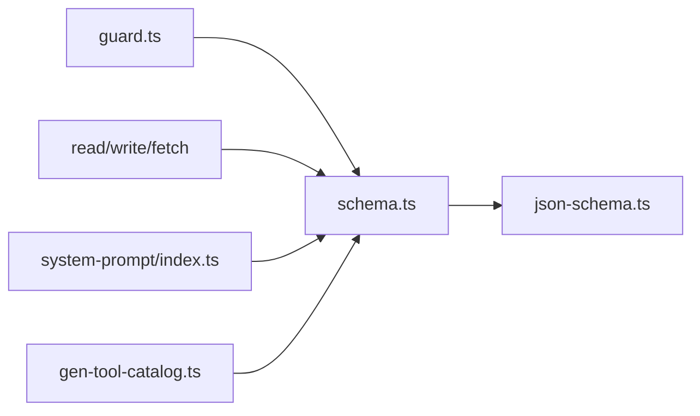

# 工具接口设计

<cite>
**本文引用的文件**
- [packages/core/tools/src/schema.ts](file://packages/core/tools/src/schema.ts)
- [packages/core/tools/src/json-schema.ts](file://packages/core/tools/src/json-schema.ts)
- [packages/extensions/cordis-host-runner/src/guard.ts](file://packages/extensions/cordis-host-runner/src/guard.ts)
- [packages/fs/tool-fs/src/read.ts](file://packages/fs/tool-fs/src/read.ts)
- [packages/fs/tool-fs/src/write.ts](file://packages/fs/tool-fs/src/write.ts)
- [packages/web/tool-web/src/fetch.ts](file://packages/web/tool-web/src/fetch.ts)
- [docs/cookbook/adding-a-tool.md](file://docs/cookbook/adding-a-tool.md)
- [scripts/gen-tool-catalog.ts](file://scripts/gen-tool-catalog.ts)
- [packages/core/system-prompt/src/index.ts](file://packages/core/system-prompt/src/index.ts)
- [packages/core/tools/tests/tools.spec.ts](file://packages/core/tools/tests/tools.spec.ts)
</cite>

## 目录
1. [简介](#简介)
2. [项目结构](#项目结构)
3. [核心组件](#核心组件)
4. [架构总览](#架构总览)
5. [详细组件分析](#详细组件分析)
6. [依赖关系分析](#依赖关系分析)
7. [性能考量](#性能考量)
8. [故障排查指南](#故障排查指南)
9. [结论](#结论)
10. [附录](#附录)

## 简介
本文件面向“工具接口设计”，聚焦 defineTool 函数的使用方式与参数配置，系统说明工具的元数据定义（name、description、parameters、output），参数验证机制（类型检查、必填字段、自定义约束），输出模式的设计原则（schema 定义与 render 函数实现），并提供文件操作、网络请求、数据处理等典型工具的接口设计示例。同时涵盖版本兼容性与向后兼容性策略、最佳实践与常见陷阱规避。

## 项目结构
围绕工具接口设计的代码主要分布在以下位置：
- 工具定义与校验核心：packages/core/tools/src/schema.ts、packages/core/tools/src/json-schema.ts
- 宿主侧守卫与规范化：packages/extensions/cordis-host-runner/src/guard.ts
- 典型工具实现：
  - 文件系统：packages/fs/tool-fs/src/read.ts、packages/fs/tool-fs/src/write.ts
  - 网络请求：packages/web/tool-web/src/fetch.ts
- 文档与规范：docs/cookbook/adding-a-tool.md
- 工具目录生成与清单校验：scripts/gen-tool-catalog.ts
- 系统提示词中的工具排序与可见性：packages/core/system-prompt/src/index.ts
- 行为测试与断言：packages/core/tools/tests/tools.spec.ts

**图表来源**
- [packages/core/tools/src/schema.ts:482-618](file://packages/core/tools/src/schema.ts#L482-L618)
- [packages/core/tools/src/json-schema.ts:202-577](file://packages/core/tools/src/json-schema.ts#L202-L577)
- [packages/extensions/cordis-host-runner/src/guard.ts:386-473](file://packages/extensions/cordis-host-runner/src/guard.ts#L386-L473)
- [packages/fs/tool-fs/src/read.ts:76-133](file://packages/fs/tool-fs/src/read.ts#L76-L133)
- [packages/fs/tool-fs/src/write.ts:69-103](file://packages/fs/tool-fs/src/write.ts#L69-L103)
- [packages/web/tool-web/src/fetch.ts:1-200](file://packages/web/tool-web/src/fetch.ts#L1-L200)
- [scripts/gen-tool-catalog.ts:568-750](file://scripts/gen-tool-catalog.ts#L568-L750)
- [packages/core/system-prompt/src/index.ts:159-183](file://packages/core/system-prompt/src/index.ts#L159-L183)

**章节来源**
- [packages/core/tools/src/schema.ts:482-618](file://packages/core/tools/src/schema.ts#L482-L618)
- [packages/core/tools/src/json-schema.ts:202-577](file://packages/core/tools/src/json-schema.ts#L202-L577)
- [packages/extensions/cordis-host-runner/src/guard.ts:386-473](file://packages/extensions/cordis-host-runner/src/guard.ts#L386-L473)
- [packages/fs/tool-fs/src/read.ts:76-133](file://packages/fs/tool-fs/src/read.ts#L76-L133)
- [packages/fs/tool-fs/src/write.ts:69-103](file://packages/fs/tool-fs/src/write.ts#L69-L103)
- [packages/web/tool-web/src/fetch.ts:1-200](file://packages/web/tool-web/src/fetch.ts#L1-L200)
- [scripts/gen-tool-catalog.ts:568-750](file://scripts/gen-tool-catalog.ts#L568-L750)
- [packages/core/system-prompt/src/index.ts:159-183](file://packages/core/system-prompt/src/index.ts#L159-L183)

## 核心组件
- defineTool 选项与返回契约
  - name：工具名，必须唯一。
  - description：人类可读描述，发送给模型。
  - parameters：按属性声明的参数 schema，隐式以对象为根；每个属性可标注 required: true 表示必填。
  - output：包含 schema、render、可选 presentationMeta。
    - schema：对每次成功返回值进行强制校验的 canonical 值 schema。
    - render：将已校验的 canonical 值渲染为模型可见的内容块。
    - presentationMeta：纯展示元数据，用于 UI 卡片持久化与回放。
  - timeoutMs：可选的正数超时预算（毫秒）。
  - isConcurrencySafe：可选并发安全分类器。
  - execute：执行主体，接收已校验参数与执行上下文，返回 canonical 值。
  - finalizeContent/presentCall/presentResult：可选的最终内容转换与呈现视图。

- 参数 schema 能力
  - 支持 string/number/integer/boolean/null/array/object/json/oneOf。
  - object 节点必须显式声明 additionalProperties: true | false。
  - 通过 required: true 标记必填属性；required 数组需与 properties 一致。
  - 支持 enum/const 字面量约束。
  - oneOf 至少两个分支。

- 运行时校验
  - 在 execute 之前，参数会被 JSON Schema 严格校验；不合法会抛出 ToolArgsError。
  - 输出值同样受 output.schema 约束，非法将被捕获并转为错误结果。

**章节来源**
- [packages/core/tools/src/schema.ts:482-618](file://packages/core/tools/src/schema.ts#L482-L618)
- [packages/core/tools/src/json-schema.ts:202-577](file://packages/core/tools/src/json-schema.ts#L202-L577)
- [packages/core/tools/tests/tools.spec.ts:2556-2586](file://packages/core/tools/tests/tools.spec.ts#L2556-L2586)

## 架构总览
下图展示了 defineTool 从注册到执行的完整链路，包括参数校验、执行、输出校验、渲染与展示元数据投影。

**图表来源**
- [packages/core/tools/src/schema.ts:545-618](file://packages/core/tools/src/schema.ts#L545-L618)
- [packages/core/tools/src/json-schema.ts:202-577](file://packages/core/tools/src/json-schema.ts#L202-L577)

## 详细组件分析

### defineTool 参数与生命周期
- 参数编译与校验
  - parameters 被编译为 JSON Schema 对象根，required 收集与校验由编译器完成。
  - 运行时 validateJsonSchemaValue 对传入参数进行路径级错误报告。
- 执行与输出
  - execute 仅负责业务逻辑，返回 canonical 值；所有模型可见文本应来自 render。
  - output.schema 保证返回值结构稳定，便于下游消费与 UI 呈现。
- 展示层
  - presentCall/presentResult 是纯函数，运行于回放场景，不得产生副作用。
  - presentationMeta 提供可持久化的结构化元数据，供 UI 卡片复用。

**图表来源**
- [packages/core/tools/src/schema.ts:545-618](file://packages/core/tools/src/schema.ts#L545-L618)
- [packages/core/tools/src/json-schema.ts:202-577](file://packages/core/tools/src/json-schema.ts#L202-L577)

**章节来源**
- [packages/core/tools/src/schema.ts:482-618](file://packages/core/tools/src/schema.ts#L482-L618)
- [packages/core/tools/src/json-schema.ts:202-577](file://packages/core/tools/src/json-schema.ts#L202-L577)

### 参数验证机制
- 类型检查
  - 支持 string/number/integer/boolean/null/array/object/json/oneOf。
  - 不支持的类型或非法组合会在校验阶段报错。
- 必填字段验证
  - 通过 required: true 标记必填；required 数组中的键必须在 properties 中声明。
  - 缺失必填字段会报告具体路径的错误信息。
- 自定义约束
  - 对于 DSL 无法表达的约束（如非空字符串、正整数、跨字段规则），在 execute 内部进行二次校验并抛错。
  - 宿主守卫会对 raw schema 做额外断言（例如 additionalProperties 必须显式布尔值）。

**图表来源**
- [packages/core/tools/src/json-schema.ts:202-577](file://packages/core/tools/src/json-schema.ts#L202-L577)
- [packages/extensions/cordis-host-runner/src/guard.ts:386-473](file://packages/extensions/cordis-host-runner/src/guard.ts#L386-L473)
- [packages/fs/tool-fs/src/read.ts:56-62](file://packages/fs/tool-fs/src/read.ts#L56-L62)
- [packages/fs/tool-fs/src/write.ts:25-28](file://packages/fs/tool-fs/src/write.ts#L25-L28)
- [packages/web/tool-web/src/fetch.ts:88-91](file://packages/web/tool-web/src/fetch.ts#L88-L91)

**章节来源**
- [packages/core/tools/src/json-schema.ts:202-577](file://packages/core/tools/src/json-schema.ts#L202-L577)
- [packages/extensions/cordis-host-runner/src/guard.ts:386-473](file://packages/extensions/cordis-host-runner/src/guard.ts#L386-L473)
- [packages/fs/tool-fs/src/read.ts:56-62](file://packages/fs/tool-fs/src/read.ts#L56-L62)
- [packages/fs/tool-fs/src/write.ts:25-28](file://packages/fs/tool-fs/src/write.ts#L25-L28)
- [packages/web/tool-web/src/fetch.ts:88-91](file://packages/web/tool-web/src/fetch.ts#L88-L91)

### 输出模式设计原则
- schema 定义
  - 作为程序化 API 的核心契约，推荐返回结构化句柄与字段，避免让模型解析自然语言。
  - 允许标量/数组/null 根，只要它们是“诚实”的值。
- render 函数
  - 负责模型可见内容的渲染；保持纯函数，无 I/O、无时钟/随机。
  - 复杂 UI 卡片通过 presentCall/presentResult 与 presentationMeta 解耦。
- 展示元数据
  - presentationMeta 用于持久化与回放，UI 可据此重建卡片状态。
  - 回放时若参数过时或格式不符，呈现层应软降级为通用卡片，不抛错。

**图表来源**
- [packages/core/tools/src/schema.ts:482-536](file://packages/core/tools/src/schema.ts#L482-L536)

**章节来源**
- [docs/cookbook/adding-a-tool.md:65-89](file://docs/cookbook/adding-a-tool.md#L65-L89)
- [packages/core/tools/src/schema.ts:482-618](file://packages/core/tools/src/schema.ts#L482-L618)

### 典型工具示例

#### 文件读取工具（read）
- 参数
  - file_path：必填字符串，文件路径。
  - offset：可选数字，起始行号（1-based）。
  - limit：可选数字，最大返回行数。
- 输出
  - path、offset、lines（每行包含 number 与 text）、totalLines。
- 渲染与展示
  - render 生成带行号的文本内容。
  - presentationMeta 保存结构化窗口以便 UI 回放。
  - presentResult 可呈现 read 专用卡片。

**图表来源**
- [packages/fs/tool-fs/src/read.ts:76-164](file://packages/fs/tool-fs/src/read.ts#L76-L164)

**章节来源**
- [packages/fs/tool-fs/src/read.ts:76-164](file://packages/fs/tool-fs/src/read.ts#L76-L164)

#### 文件写入工具（write）
- 参数
  - file_path：必填字符串。
  - content：必填字符串，完整 UTF-8 内容。
  - 可选沙箱升级字段（由宿主动态注入）。
- 输出
  - path、operation（create/update）、before（旧内容或 null）、after（新内容）。
- 渲染与展示
  - render 返回简短确认文本。
  - presentationMeta 计算 diff 片段，供 UI 显示差异。
  - presentCall/presentResult 使用 diff 卡片。

**图表来源**
- [packages/fs/tool-fs/src/write.ts:69-129](file://packages/fs/tool-fs/src/write.ts#L69-L129)

**章节来源**
- [packages/fs/tool-fs/src/write.ts:69-129](file://packages/fs/tool-fs/src/write.ts#L69-L129)

#### 网络请求工具（web_fetch）
- 参数
  - url：必填字符串，URL 地址。
- 输出
  - url、statusCode、body、truncated 等结构化字段。
- 渲染与展示
  - render 将 HTML 转换为 Markdown 并返回内容块。
  - presentationMeta 携带摘要信息，presentResult 可呈现 web/fetch 卡片。

**图表来源**
- [packages/web/tool-web/src/fetch.ts:1-200](file://packages/web/tool-web/src/fetch.ts#L1-L200)

**章节来源**
- [packages/web/tool-web/src/fetch.ts:1-200](file://packages/web/tool-web/src/fetch.ts#L1-L200)

### 版本兼容性与向后兼容
- 参数与输出的演进
  - 新增可选字段优先，避免破坏已有调用。
  - 对 display 路径（presentCall/presentResult）采用软校验：回放时若参数过时则回退到通用卡片，不抛错。
- 宿主守卫
  - 对 raw schema 进行断言（如 additionalProperties 必须布尔值），确保一致性。
- 工具目录与清单
  - 工具包需在启动清单中登记，未登记会在生成阶段报错，防止“静默遗漏”。

**章节来源**
- [packages/core/tools/src/schema.ts:594-615](file://packages/core/tools/src/schema.ts#L594-L615)
- [packages/extensions/cordis-host-runner/src/guard.ts:560-592](file://packages/extensions/cordis-host-runner/src/guard.ts#L560-L592)
- [scripts/gen-tool-catalog.ts:568-590](file://scripts/gen-tool-catalog.ts#L568-L590)

## 依赖关系分析
- 工具定义与校验
  - defineTool 依赖 JSON Schema 编译与校验模块，确保参数与输出的一致性。
- 宿主守卫
  - 在宿主侧对 schema 做进一步断言，增强健壮性。
- 工具编排
  - 系统提示词模块负责工具排序与可见性控制。
- 工具目录
  - 生成脚本扫描并校验工具包清单，保障文档与实现的同步。

**图表来源**
- [packages/core/tools/src/schema.ts:482-618](file://packages/core/tools/src/schema.ts#L482-L618)
- [packages/core/tools/src/json-schema.ts:202-577](file://packages/core/tools/src/json-schema.ts#L202-L577)
- [packages/extensions/cordis-host-runner/src/guard.ts:386-473](file://packages/extensions/cordis-host-runner/src/guard.ts#L386-L473)
- [packages/core/system-prompt/src/index.ts:159-183](file://packages/core/system-prompt/src/index.ts#L159-L183)
- [scripts/gen-tool-catalog.ts:568-750](file://scripts/gen-tool-catalog.ts#L568-L750)

**章节来源**
- [packages/core/tools/src/schema.ts:482-618](file://packages/core/tools/src/schema.ts#L482-L618)
- [packages/core/tools/src/json-schema.ts:202-577](file://packages/core/tools/src/json-schema.ts#L202-L577)
- [packages/extensions/cordis-host-runner/src/guard.ts:386-473](file://packages/extensions/cordis-host-runner/src/guard.ts#L386-L473)
- [packages/core/system-prompt/src/index.ts:159-183](file://packages/core/system-prompt/src/index.ts#L159-L183)
- [scripts/gen-tool-catalog.ts:568-750](file://scripts/gen-tool-catalog.ts#L568-L750)

## 性能考量
- 大文件读取
  - 根据文件大小选择流式读取，限制单行长度与总字节数以控制内存占用。
- HTML 转换
  - 设置最大转换深度以避免恶意嵌套导致的超线性开销。
- 超时与取消
  - 使用 timeoutMs 与 exec.signal 协作式取消，避免长时间阻塞。
- 输出裁剪
  - 通过配置阈值与头尾字符限制，控制结果大小，避免溢出。

[本节为通用指导，无需特定文件引用]

## 故障排查指南
- 参数校验失败
  - 检查 parameters 中各属性的 type、required、enum/const 是否匹配。
  - 关注路径级错误信息，定位具体字段。
- 输出校验失败
  - 确保 execute 返回的值符合 output.schema。
  - 若出现意外字段，考虑 additionalProperties=false 的限制。
- 展示回放异常
  - presentCall/presentResult 必须为纯函数；回放时若参数过时，应返回 undefined 以回退到通用卡片。
- 工具注册问题
  - 确保工具名唯一；监听器抛错时会回滚注册，避免泄漏。

**章节来源**
- [packages/core/tools/tests/tools.spec.ts:1999-2022](file://packages/core/tools/tests/tools.spec.ts#L1999-L2022)
- [packages/core/tools/tests/tools.spec.ts:2556-2586](file://packages/core/tools/tests/tools.spec.ts#L2556-L2586)

## 结论
defineTool 提供了强类型、可校验、可扩展的工具定义范式。通过统一的参数 schema、严格的运行时校验、稳定的输出 schema 以及纯展示的呈现层，既能满足模型的可靠调用，又能支撑丰富的 UI 体验。遵循本文的最佳实践与兼容性策略，可以构建稳健、可维护且易于演进的工具体系。

## 附录
- 最佳实践
  - 将业务语义建模为 canonical 值，render 仅负责模型可见文本。
  - 使用 presentationMeta 承载 UI 所需结构化数据，避免在 canonical 值中掺杂展示细节。
  - 对 DSL 无法表达的约束在 execute 中进行二次校验。
  - 使用 timeoutMs 与 exec.signal 管理长耗时任务。
- 常见陷阱
  - 忘记声明 additionalProperties 导致默认行为不符合预期。
  - 在 presentCall/presentResult 中引入副作用或读取会话状态。
  - 将中间值暴露为输出 schema，导致持久化与传输成本上升。
  - 忽略回放场景下的软校验，导致回放崩溃。

[本节为通用指导，无需特定文件引用]