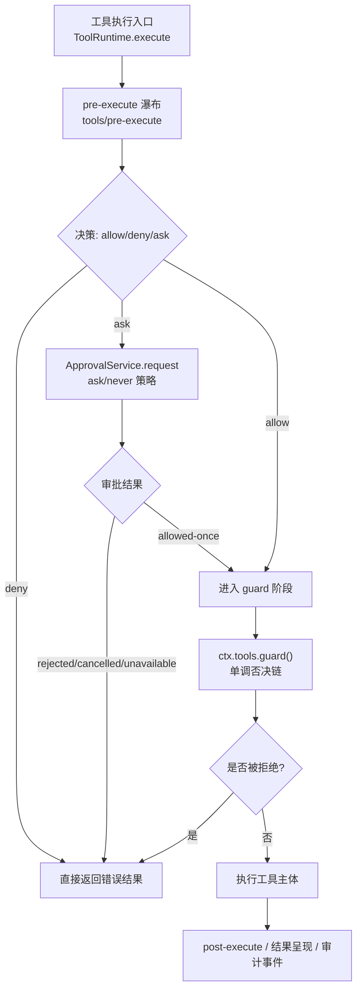
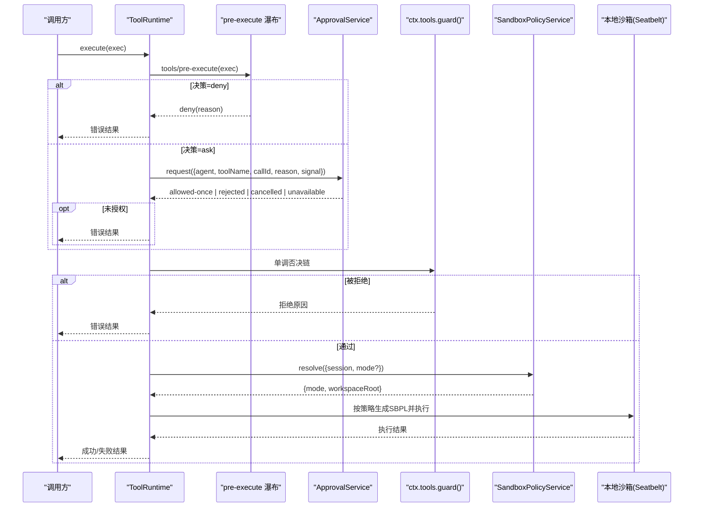
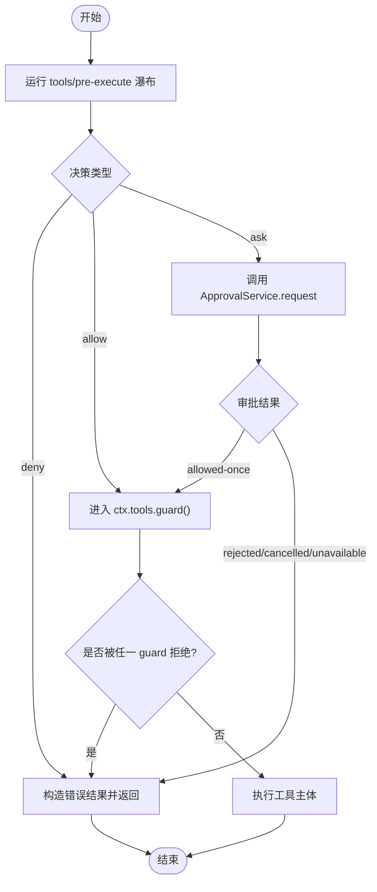
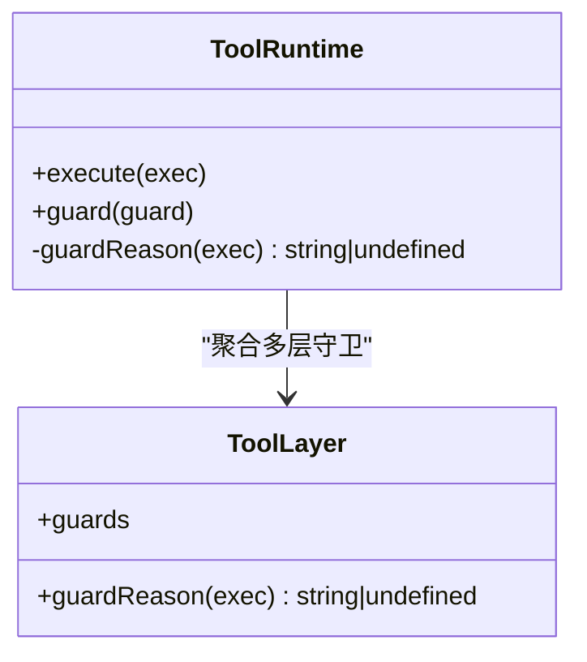
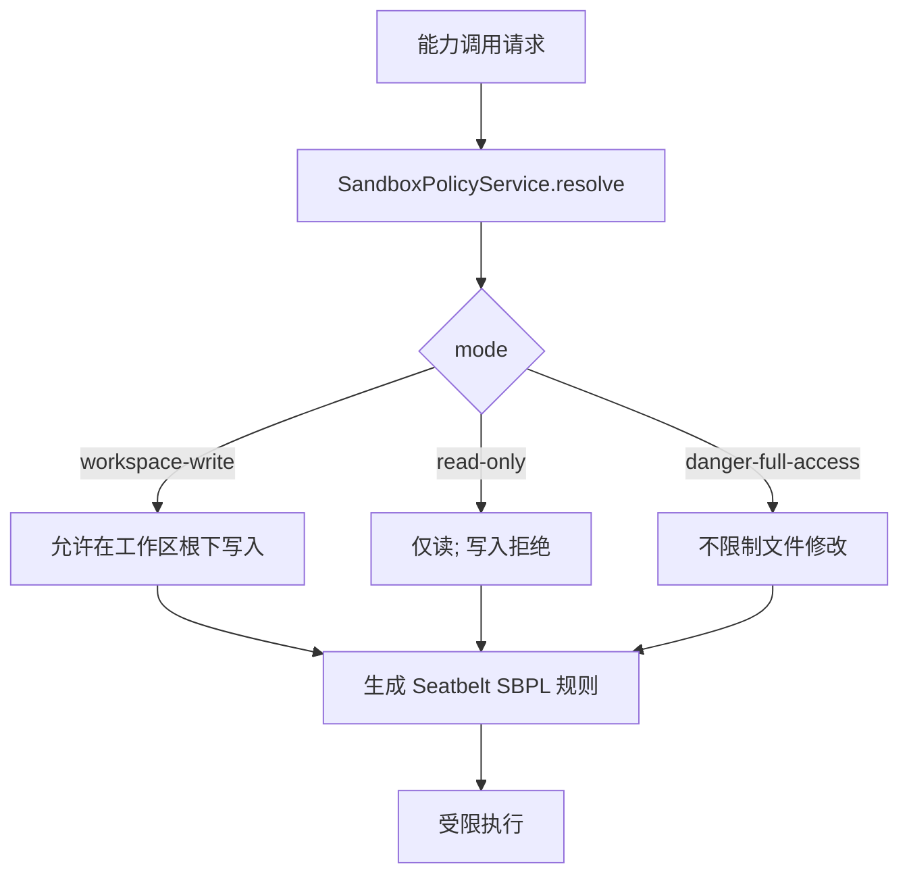
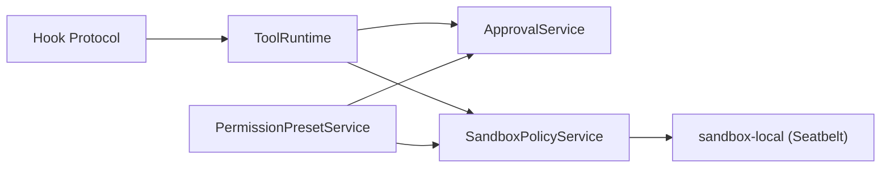

# 工具权限控制

<cite>
**本文引用的文件**
- [packages/core/tools/src/index.ts](file://packages/core/tools/src/index.ts)
- [packages/interaction/user-approval/src/index.ts](file://packages/interaction/user-approval/src/index.ts)
- [packages/sandbox/sandbox-policy/src/index.ts](file://packages/sandbox/sandbox-policy/src/index.ts)
- [packages/sandbox/sandbox-local/src/profiles.ts](file://packages/sandbox/sandbox-local/src/profiles.ts)
- [packages/fs/fs-sandbox/README.md](file://packages/fs/fs-sandbox/README.md)
- [packages/interaction/permission-presets/src/index.ts](file://packages/interaction/permission-presets/src/index.ts)
- [packages/hooks/hook-protocol/src/codec.ts](file://packages/hooks/hook-protocol/src/codec.ts)
- [.agents/notes/implemented/feature/2026-07-14-cross-family-fs-sandbox.md](file://.agents/notes/implemented/feature/2026-07-14-cross-family-fs-sandbox.md)
- [.agents/notes/implemented/bug-fix/2026-07-20-config-hot-reload-resilience.md](file://.agents/notes/implemented/bug-fix/2026-07-20-config-hot-reload-resilience.md)
</cite>

## 目录
1. [简介](#简介)
2. [项目结构](#项目结构)
3. [核心组件](#核心组件)
4. [架构总览](#架构总览)
5. [详细组件分析](#详细组件分析)
6. [依赖关系分析](#依赖关系分析)
7. [性能考量](#性能考量)
8. [故障排查指南](#故障排查指南)
9. [结论](#结论)
10. [附录](#附录)

## 简介
本文件系统化说明工具执行前的权限检查机制、tools/pre-execute 钩子策略（允许/拒绝/询问）、ctx.tools.guard() 的最终裁决作用，以及沙箱环境的配置与使用（文件系统访问限制与网络请求控制）。同时提供不同安全级别的权限配置示例、权限策略的动态更新与热重载机制，以及权限审计与日志记录的最佳实践。

## 项目结构
围绕“工具权限控制”的关键代码分布在以下模块：
- 工具注册与执行管线：packages/core/tools/src/index.ts
- 审批服务（ask/never）：packages/interaction/user-approval/src/index.ts
- 沙箱策略解析与上下文注入：packages/sandbox/sandbox-policy/src/index.ts
- 本地沙箱配置文件生成（Seatbelt SBPL）：packages/sandbox/sandbox-local/src/profiles.ts
- 文件系统沙箱威胁模型与行为说明：packages/fs/fs-sandbox/README.md
- 权限预设（sandbox + approval 组合）：packages/interaction/permission-presets/src/index.ts
- Hook 协议中 permissionDecision 的 allow/deny/ask 约束：packages/hooks/hook-protocol/src/codec.ts
- 跨家族文件系统沙箱设计要点：.agents/notes/implemented/feature/2026-07-14-cross-family-fs-sandbox.md
- 配置热重载与回滚保障：.agents/notes/implemented/bug-fix/2026-07-20-config-hot-reload-resilience.md

图表来源
- [packages/core/tools/src/index.ts:1459-1500](file://packages/core/tools/src/index.ts#L1459-L1500)
- [packages/core/tools/src/index.ts:1678-1729](file://packages/core/tools/src/index.ts#L1678-L1729)
- [packages/interaction/user-approval/src/index.ts:257-344](file://packages/interaction/user-approval/src/index.ts#L257-L344)

章节来源
- [packages/core/tools/src/index.ts:1459-1500](file://packages/core/tools/src/index.ts#L1459-L1500)
- [packages/core/tools/src/index.ts:1678-1729](file://packages/core/tools/src/index.ts#L1678-L1729)
- [packages/interaction/user-approval/src/index.ts:257-344](file://packages/interaction/user-approval/src/index.ts#L257-L344)

## 核心组件
- 工具运行时与执行管线：负责参数快照、可见性判定、pre-execute 瀑布、审批桥接、guard 单调否决、around/post 处理与最终结果物化。
- 审批服务：实现 ask/never 策略，维护会话级策略事件流，提供可取消的审批请求与审计事件对。
- 沙箱策略服务：统一解析部署默认模式与会话覆盖，向系统提示注入当前策略语义，供各能力消费。
- 本地沙箱配置：根据策略生成 Seatbelt SBPL 规则，限定可写根路径。
- 权限预设：将 sandbox 模式与 approval 策略打包为可切换的预设，支持命令式切换与持久化。
- Hook 协议：在 hookSpecificOutput.permissionDecision 中限定 allow/deny/ask 三态，避免与顶层 decision 混淆。

章节来源
- [packages/core/tools/src/index.ts:1087-1128](file://packages/core/tools/src/index.ts#L1087-L1128)
- [packages/interaction/user-approval/src/index.ts:81-147](file://packages/interaction/user-approval/src/index.ts#L81-L147)
- [packages/sandbox/sandbox-policy/src/index.ts:91-151](file://packages/sandbox/sandbox-policy/src/index.ts#L91-L151)
- [packages/sandbox/sandbox-local/src/profiles.ts:51-58](file://packages/sandbox/sandbox-local/src/profiles.ts#L51-L58)
- [packages/interaction/permission-presets/src/index.ts:154-183](file://packages/interaction/permission-presets/src/index.ts#L154-L183)
- [packages/hooks/hook-protocol/src/codec.ts:32-45](file://packages/hooks/hook-protocol/src/codec.ts#L32-L45)

## 架构总览
下图展示了从工具调用到最终结果的完整权限控制链路，包括 pre-execute 策略、审批服务、guard 最终裁决以及沙箱策略注入。

图表来源
- [packages/core/tools/src/index.ts:1459-1500](file://packages/core/tools/src/index.ts#L1459-L1500)
- [packages/core/tools/src/index.ts:1678-1729](file://packages/core/tools/src/index.ts#L1678-L1729)
- [packages/sandbox/sandbox-policy/src/index.ts:126-151](file://packages/sandbox/sandbox-policy/src/index.ts#L126-L151)
- [packages/sandbox/sandbox-local/src/profiles.ts:51-58](file://packages/sandbox/sandbox-local/src/profiles.ts#L51-L58)

## 详细组件分析

### 工具执行前权限检查与 tools/pre-execute 钩子
- 触发时机：每次工具调用在进入审批与 guard 之前，都会进入 tools/pre-execute 瀑布。
- 决策类型：
  - allow：继续后续流程。
  - deny：立即以错误结果返回。
  - ask：进入审批服务；若无审批通道或策略为 never，则降级为拒绝。
- 取消与审计：审批请求支持 AbortSignal 取消；审批过程会追加 asked/decided 审计事件对，保证可重放与一致性。

图表来源
- [packages/core/tools/src/index.ts:1459-1500](file://packages/core/tools/src/index.ts#L1459-L1500)
- [packages/core/tools/src/index.ts:1678-1729](file://packages/core/tools/src/index.ts#L1678-L1729)
- [packages/interaction/user-approval/src/index.ts:257-344](file://packages/interaction/user-approval/src/index.ts#L257-L344)

章节来源
- [packages/core/tools/src/index.ts:1459-1500](file://packages/core/tools/src/index.ts#L1459-L1500)
- [packages/core/tools/src/index.ts:1678-1729](file://packages/core/tools/src/index.ts#L1678-L1729)
- [packages/interaction/user-approval/src/index.ts:257-344](file://packages/interaction/user-approval/src/index.ts#L257-L344)

### ctx.tools.guard() 的最终权限控制
- 作用：在 pre-execute 之后、工具主体执行之前，执行单调否决链。任何匹配守卫均可返回拒绝原因；已拒绝的调用无法被后续守卫放行。
- 范围：全局守卫作用于所有调用；通过 agent.ctx 注册的守卫仅对该代理生效。
- 顺序：先全局层，再按代理作用域链自远及近依次评估，首个拒绝即终止。

图表来源
- [packages/core/tools/src/index.ts:1100-1128](file://packages/core/tools/src/index.ts#L1100-L1128)
- [packages/core/tools/src/index.ts:714-753](file://packages/core/tools/src/index.ts#L714-L753)

章节来源
- [packages/core/tools/src/index.ts:1100-1128](file://packages/core/tools/src/index.ts#L1100-L1128)
- [packages/core/tools/src/index.ts:714-753](file://packages/core/tools/src/index.ts#L714-L753)

### 沙箱环境配置与使用
- 策略解析：SandboxPolicyService 提供统一的 per-call 策略解析，包含 mode（read-only/workspace-write/danger-full-access）与 workspaceRoot。
- 上下文注入：在服务初始化时向 systemPrompt 注入当前策略语义，使模型知晓当前文件操作边界。
- 本地实现：sandbox-local 根据策略生成 Seatbelt SBPL 规则，默认禁止文件写入，仅显式允许的根路径可写。
- 威胁模型：fs-sandbox 明确为“策略围栏而非内核边界”，通过规范化路径+ containment 实现；拒绝以结构化 FS_SANDBOX_DENIED 返回，便于上层提示与重试引导。

图表来源
- [packages/sandbox/sandbox-policy/src/index.ts:126-151](file://packages/sandbox/sandbox-policy/src/index.ts#L126-L151)
- [packages/sandbox/sandbox-local/src/profiles.ts:51-58](file://packages/sandbox/sandbox-local/src/profiles.ts#L51-L58)
- [packages/fs/fs-sandbox/README.md:19-31](file://packages/fs/fs-sandbox/README.md#L19-L31)

章节来源
- [packages/sandbox/sandbox-policy/src/index.ts:91-151](file://packages/sandbox/sandbox-policy/src/index.ts#L91-L151)
- [packages/sandbox/sandbox-local/src/profiles.ts:51-58](file://packages/sandbox/sandbox-local/src/profiles.ts#L51-L58)
- [packages/fs/fs-sandbox/README.md:19-31](file://packages/fs/fs-sandbox/README.md#L19-L31)
- [.agents/notes/implemented/feature/2026-07-14-cross-family-fs-sandbox.md:38-40](file://.agents/notes/implemented/feature/2026-07-14-cross-family-fs-sandbox.md#L38-L40)

### 不同安全级别的权限配置示例
- 只读模式（read-only）：默认安全级别，禁止文件写入；适合浏览与搜索类任务。
- 工作区写入（workspace-write）：允许在工作区根目录下写入，并可扩展至平台临时目录；适合编辑代码与文档。
- 危险全量访问（danger-full-access）：不限制文件修改；仅在受控环境中启用。

上述三种模式由 SandboxMode 定义，并通过权限预设（PermissionPresetService）将 sandbox 与 approval 策略绑定为可切换项。

章节来源
- [packages/sandbox/sandbox-policy/src/index.ts:67-75](file://packages/sandbox/sandbox-policy/src/index.ts#L67-L75)
- [packages/interaction/permission-presets/src/index.ts:154-183](file://packages/interaction/permission-presets/src/index.ts#L154-L183)

### 权限策略的动态更新与热重载
- 动态切换：可通过命令或设置接口切换默认权限预设，进而改变会话的沙箱模式与审批策略；变更会追加到会话事件流，并在下一次模型步骤中通知。
- 热重载保障：配置更新采用补偿事务，导入变化后若应用失败会回滚；HMR 监听确切路径，串行合并刷新，失败广播但不中断后续刷新。

章节来源
- [packages/interaction/permission-presets/src/index.ts:379-433](file://packages/interaction/permission-presets/src/index.ts#L379-L433)
- [.agents/notes/implemented/bug-fix/2026-07-20-config-hot-reload-resilience.md:17-21](file://.agents/notes/implemented/bug-fix/2026-07-20-config-hot-reload-resilience.md#L17-L21)

### 权限审计与日志记录最佳实践
- 审批审计：每个审批请求会追加 asked/decided 事件对，确保可重放与一致性；策略变更追加 policy 事件。
- 工具结果审计：工具执行完成后，registry 会发出 tool/result 等事件，用于最终结果观察与审计。
- 建议：
  - 始终在 turn 内发起审批请求，以保证审计事件成对且位于提交边界内。
  - 对 ask 决策提供清晰的 reason，便于用户界面展示与审计定位。
  - 结合 session 事件流进行离线分析与合规审查。

章节来源
- [packages/interaction/user-approval/src/index.ts:22-73](file://packages/interaction/user-approval/src/index.ts#L22-L73)
- [packages/core/tools/src/index.ts:176-197](file://packages/core/tools/src/index.ts#L176-L197)

## 依赖关系分析
- ToolRuntime 依赖 ApprovalService 完成 ask 决策；若未挂载则降级为 deny。
- ToolRuntime 通过 ctx.sandboxPolicy 获取 per-call 策略，驱动后端沙箱（如 sandbox-local）生成执行约束。
- PermissionPresetService 组合 sandbox 与 approval 策略，提供可切换的预设。
- Hook 协议中的 permissionDecision 严格限定 allow/deny/ask，避免与顶层 decision 混淆。

图表来源
- [packages/core/tools/src/index.ts:1678-1729](file://packages/core/tools/src/index.ts#L1678-L1729)
- [packages/sandbox/sandbox-policy/src/index.ts:126-151](file://packages/sandbox/sandbox-policy/src/index.ts#L126-L151)
- [packages/sandbox/sandbox-local/src/profiles.ts:51-58](file://packages/sandbox/sandbox-local/src/profiles.ts#L51-L58)
- [packages/interaction/permission-presets/src/index.ts:154-183](file://packages/interaction/permission-presets/src/index.ts#L154-L183)
- [packages/hooks/hook-protocol/src/codec.ts:32-45](file://packages/hooks/hook-protocol/src/codec.ts#L32-L45)

章节来源
- [packages/core/tools/src/index.ts:1678-1729](file://packages/core/tools/src/index.ts#L1678-L1729)
- [packages/sandbox/sandbox-policy/src/index.ts:126-151](file://packages/sandbox/sandbox-policy/src/index.ts#L126-L151)
- [packages/sandbox/sandbox-local/src/profiles.ts:51-58](file://packages/sandbox/sandbox-local/src/profiles.ts#L51-L58)
- [packages/interaction/permission-presets/src/index.ts:154-183](file://packages/interaction/permission-presets/src/index.ts#L154-L183)
- [packages/hooks/hook-protocol/src/codec.ts:32-45](file://packages/hooks/hook-protocol/src/codec.ts#L32-L45)

## 性能考量
- 预执行与审批：审批请求可能阻塞，应合理设置超时与取消信号，避免长耗时影响整体吞吐。
- 沙箱策略解析：per-call 解析开销较小，但应避免频繁切换模式导致策略抖动。
- 守卫链：guard 为同步快速检查，保持轻量以避免成为瓶颈。
- 结果物化：最终结果需进行 JSON 快照与冻结，注意大对象序列化成本。

[本节为通用指导，无需特定文件引用]

## 故障排查指南
- 问而不批：当 tools/pre-execute 返回 ask，但未挂载 ApprovalService 或无可用回答者时，会降级为 deny。检查是否挂载审批服务与策略是否为 never。
- 审批取消：若审批请求被取消，将返回 cancelled，工具调用将被拒绝。确认上游取消逻辑与信号传播。
- 沙箱拒绝：文件写入被拒绝时，查看 FS_SANDBOX_DENIED 与当前 sandbox 模式；必要时提升为 workspace-write 或调整工作区根。
- 预设无效：切换预设后未生效，检查会话事件流中是否存在对应的 permission/preset 与 approval/policy 事件。

章节来源
- [packages/core/tools/src/index.ts:1678-1729](file://packages/core/tools/src/index.ts#L1678-L1729)
- [packages/interaction/user-approval/src/index.ts:257-344](file://packages/interaction/user-approval/src/index.ts#L257-L344)
- [packages/fs/fs-sandbox/README.md:19-31](file://packages/fs/fs-sandbox/README.md#L19-L31)
- [packages/interaction/permission-presets/src/index.ts:379-433](file://packages/interaction/permission-presets/src/index.ts#L379-L433)

## 结论
工具权限控制通过“pre-execute → 审批 → guard → 沙箱”的分层机制实现细粒度、可审计、可热更新的权限治理。pre-execute 提供灵活的策略扩展点，guard 作为最终裁决确保不可逾越的安全底线；沙箱策略与服务化审批共同构成运行时防护。配合权限预设与热重载，可在不同安全级别间平滑切换，满足从开发到生产的多场景需求。

## 附录
- 关键术语
  - 预执行（pre-execute）：工具执行前的可扩展策略瀑布。
  - 审批（approval）：基于 ask/never 策略的用户或自动化审批通道。
  - 守卫（guard）：单调否决的最终权限检查。
  - 沙箱（sandbox）：基于策略的文件系统访问限制与环境隔离。
  - 权限预设（permission preset）：将 sandbox 与 approval 策略打包的可切换项。

[本节为概念性说明，无需特定文件引用]