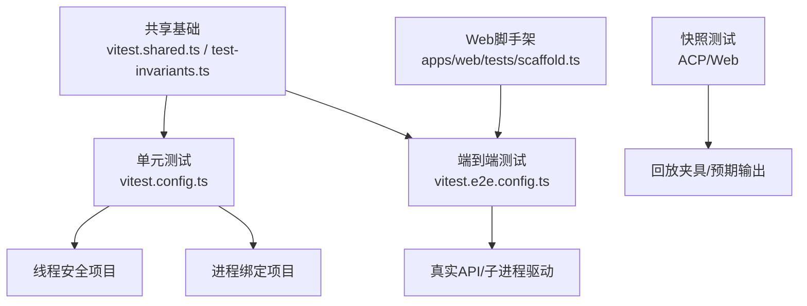
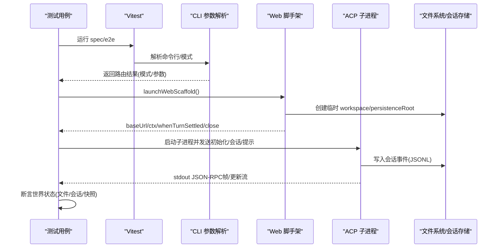
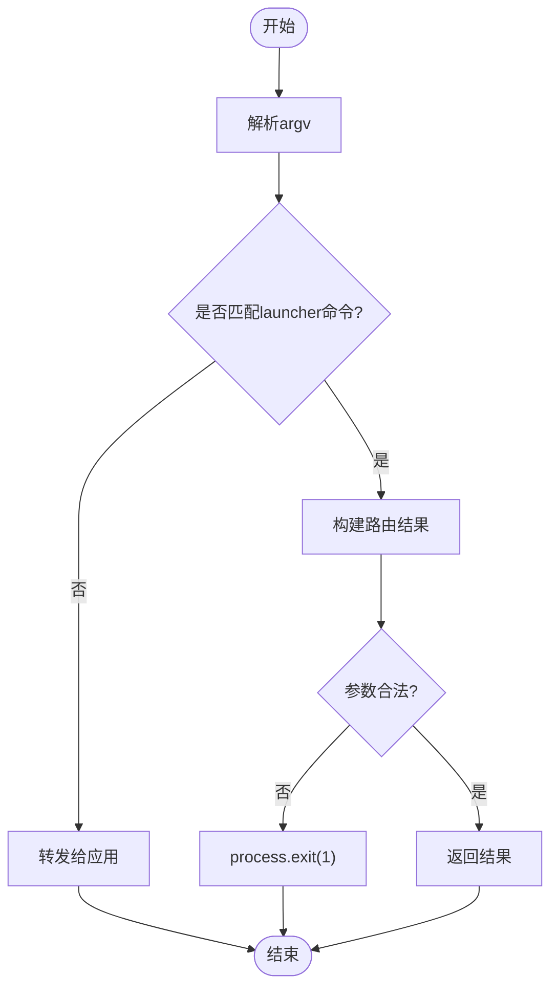
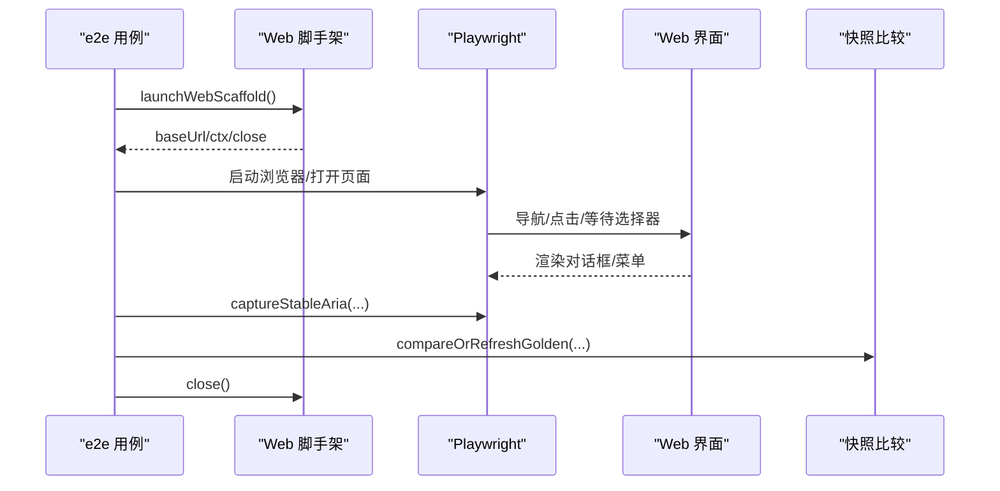
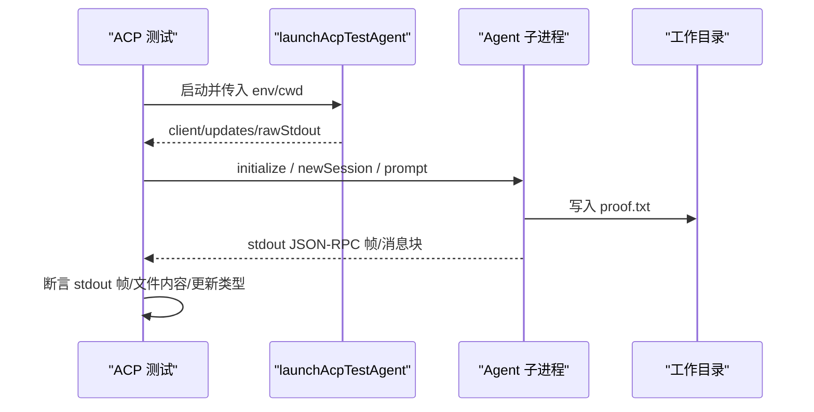
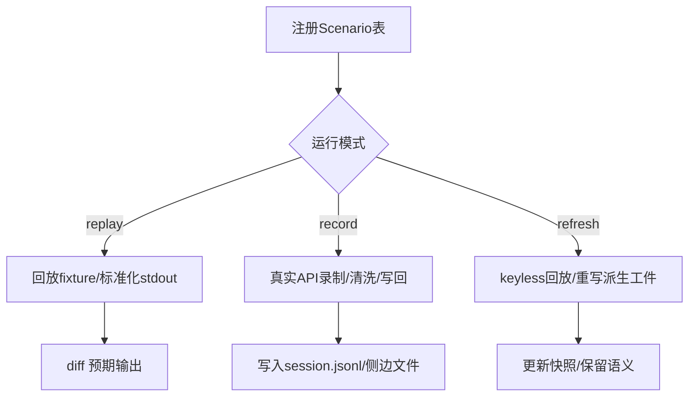
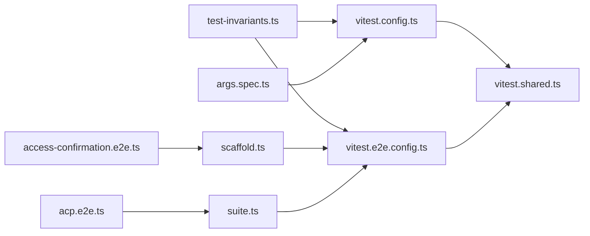

# 工具测试与调试

<cite>
**本文引用的文件**
- [vitest.config.ts](file://vitest.config.ts)
- [vitest.e2e.config.ts](file://vitest.e2e.config.ts)
- [vitest.shared.ts](file://vitest.shared.ts)
- [testing.md](file://docs/testing.md)
- [args.spec.ts](file://apps/cli/tests/args.spec.ts)
- [scaffold.ts](file://apps/web/tests/scaffold.ts)
- [access-confirmation.e2e.ts](file://apps/web/tests/access-confirmation.e2e.ts)
- [acp.e2e.ts](file://examples/acp-agent/tests/acp.e2e.ts)
- [suite.ts](file://packages/test-support/acp-snapshot/src/suite.ts)
- [test-invariants.ts](file://scripts/test-invariants.ts)
</cite>

## 目录
1. [简介](#简介)
2. [项目结构](#项目结构)
3. [核心组件](#核心组件)
4. [架构总览](#架构总览)
5. [详细组件分析](#详细组件分析)
6. [依赖关系分析](#依赖关系分析)
7. [性能考量](#性能考量)
8. [故障排查指南](#故障排查指南)
9. [结论](#结论)
10. [附录](#附录)

## 简介
本指南面向在 deepseek-harness 仓库中编写“工具”的单元测试、集成测试与端到端测试，并配套调试与性能分析实践。内容覆盖：
- 单元测试：如何模拟依赖、断言验证、错误路径与边界条件
- 集成测试：端到端测试与快照测试的设计模式
- 调试技巧：日志记录、断点调试、性能分析
- 测试数据：准备与管理策略（含会话 JSONL 与浏览器快照）
- 复杂度示例：从简单函数到复杂异步操作
- 持续集成：自动化测试配置与质量门禁

## 项目结构
仓库采用分层测试组织：
- 单元测试：位于各包与应用的 tests 目录，使用 Vitest 运行，按线程安全与进程绑定两类项目执行
- 端到端测试：独立 e2e 配置，支持真实 API 调用与重试、并发控制
- 快照测试：ACP 场景与 Web GUI 浏览器快照，分别维护预期输出与回放夹具
- 共享基础设施：Vitest 共享插件、不变量宿主、Web 脚手架等

图表来源
- [vitest.config.ts:117-159](file://vitest.config.ts#L117-L159)
- [vitest.e2e.config.ts:31-57](file://vitest.e2e.config.ts#L31-L57)
- [vitest.shared.ts:15-42](file://vitest.shared.ts#L15-L42)
- [test-invariants.ts:158-210](file://scripts/test-invariants.ts#L158-L210)
- [scaffold.ts:294-626](file://apps/web/tests/scaffold.ts#L294-L626)

章节来源
- [vitest.config.ts:85-159](file://vitest.config.ts#L85-L159)
- [vitest.e2e.config.ts:5-57](file://vitest.e2e.config.ts#L5-L57)
- [testing.md:7-15](file://docs/testing.md#L7-L15)

## 核心组件
- 测试框架与配置
  - Vitest 主配置：定义包含范围、排除规则、覆盖率阈值、多项目隔离（线程安全 vs 进程绑定）
  - E2E 配置：独立超时、重试、并发工作进程数、环境变量加载
  - 共享插件：TypeScript 装饰器预转换、Node Web Storage 标志处理
- 不变量宿主
  - 自动挂载各包的 invariant 伴随模块，保证服务拓扑与生命周期校验
- Web 脚手架
  - 启动真实 Web 组合、注入回放适配器或路由适配器、管理临时工作区与会话持久化根
- ACP 快照套件
  - 以子进程驱动真实 Agent，标准化 stdout 与 session.jsonl，支持 record/refresh/replay 三种模式

章节来源
- [vitest.config.ts:117-283](file://vitest.config.ts#L117-L283)
- [vitest.e2e.config.ts:31-57](file://vitest.e2e.config.ts#L31-L57)
- [vitest.shared.ts:15-42](file://vitest.shared.ts#L15-L42)
- [test-invariants.ts:158-210](file://scripts/test-invariants.ts#L158-L210)
- [scaffold.ts:294-626](file://apps/web/tests/scaffold.ts#L294-L626)
- [suite.ts:1-200](file://packages/test-support/acp-snapshot/src/suite.ts#L1-L200)

## 架构总览
下图展示从测试入口到被测系统的关键交互：CLI 参数解析、Web 端到端回放、ACP 子进程驱动与快照对比。

图表来源
- [args.spec.ts:1-107](file://apps/cli/tests/args.spec.ts#L1-L107)
- [scaffold.ts:294-626](file://apps/web/tests/scaffold.ts#L294-L626)
- [acp.e2e.ts:1-127](file://examples/acp-agent/tests/acp.e2e.ts#L1-L127)

## 详细组件分析

### CLI 参数解析单元测试
- 目标：验证 launcher 对 profile/web/dump-config/plugin 等参数的路由与边界
- 方法：
  - 使用 vi.spyOn 拦截 process.exit/stdout/stderr，捕获退出码
  - 构造不同 argv 组合，断言返回结构与非法输入的错误退出码
- 关键点：
  - 将应用级参数与 launcher 参数边界清晰分离
  - 通过失败路径覆盖被移除/冲突的参数组合

图表来源
- [args.spec.ts:1-107](file://apps/cli/tests/args.spec.ts#L1-L107)

章节来源
- [args.spec.ts:23-105](file://apps/cli/tests/args.spec.ts#L23-L105)

### Web 端到端与快照测试
- 目标：在无模型调用的情况下，验证权限确认对话框、UI 行为与快照一致性
- 方法：
  - 使用 launchWebScaffold 启动真实 Web 组合，注入回放或路由适配器
  - Playwright 驱动 Chromium，定位元素、交互、等待稳定后抓取 aria 快照
  - compareOrRefreshGolden 根据 DSH_SNAPSHOT 模式决定比较或刷新预期
- 关键点：
  - 严格隔离 $DSH_HOME、workspace、persistenceRoot
  - 通过 whenTurnSettled 等待 turn/end 并 flush 会话，确保可重现

图表来源
- [access-confirmation.e2e.ts:20-79](file://apps/web/tests/access-confirmation.e2e.ts#L20-L79)
- [scaffold.ts:294-626](file://apps/web/tests/scaffold.ts#L294-L626)

章节来源
- [access-confirmation.e2e.ts:20-79](file://apps/web/tests/access-confirmation.e2e.ts#L20-L79)
- [scaffold.ts:85-116](file://apps/web/tests/scaffold.ts#L85-L116)
- [scaffold.ts:294-626](file://apps/web/tests/scaffold.ts#L294-L626)

### ACP 端到端与快照测试
- 目标：以真实子进程驱动 Agent，验证 stdout 纯 JSON-RPC 帧、session/new 成功、以及真实提示下的文件写入效果
- 方法：
  - 使用 dsh-acp-snapshot 提供的 launchAcpTestAgent 启动被测 Agent
  - 无密钥场景仅验证 initialize 与 stdout 帧；有密钥场景发送 prompt 并断言磁盘产物
- 关键点：
  - 子进程拥有独立的 temp cwd 与持久化根，避免污染
  - 通过 rawStdout 检查每行均为有效 JSON，防止日志泄漏到协议通道

图表来源
- [acp.e2e.ts:14-127](file://examples/acp-agent/tests/acp.e2e.ts#L14-L127)

章节来源
- [acp.e2e.ts:42-97](file://examples/acp-agent/tests/acp.e2e.ts#L42-L97)
- [acp.e2e.ts:100-127](file://examples/acp-agent/tests/acp.e2e.ts#L100-L127)

### 快照测试套件与夹具管理
- 目标：以 keyless 方式回放/录制/刷新 ACP 场景，确保传输契约与呈现一致
- 方法：
  - 通过 suite 工厂声明 Scenario 表，区分 recorded/authored、pinsHeader、pwshOnly 等
  - normalize 与 scrub 去除敏感头、工具 schema、时间戳等不稳定因素
  - 支持 Windows 原生 stdout 侧边文件对比
- 关键点：
  - 每个场景目录必须注册，避免孤儿快照
  - 回放夹具与预期输出共同约束外部行为

图表来源
- [suite.ts:65-187](file://packages/test-support/acp-snapshot/src/suite.ts#L65-L187)
- [suite.ts:1440-1449](file://packages/test-support/acp-snapshot/src/suite.ts#L1440-L1449)

章节来源
- [suite.ts:1-200](file://packages/test-support/acp-snapshot/src/suite.ts#L1-L200)
- [suite.ts:1440-1449](file://packages/test-support/acp-snapshot/src/suite.ts#L1440-L1449)

### 测试不变量与生命周期保障
- 目标：在测试环境中自动挂载各包的 invariant 伴随模块，确保服务拓扑正确、生命周期完整
- 方法：
  - 通过 import.meta.glob 动态发现 companion 模块
  - 拦截 RegistryService.plugin，将伴随后置加入 ready 链，保证所有插件在不变量就绪后才激活
  - 为 attachment 相关测试提供最小化的测试存储实现
- 关键点：
  - 手动拓扑测试例外列表，避免干扰聚焦测试
  - 失败时抛出明确错误，便于定位缺失注入或无效插件

章节来源
- [test-invariants.ts:158-210](file://scripts/test-invariants.ts#L158-L210)
- [test-invariants.ts:227-274](file://scripts/test-invariants.ts#L227-L274)

## 依赖关系分析
- 测试配置层
  - vitest.config.ts 聚合 include/exclude、覆盖率阈值、多项目隔离
  - vitest.e2e.config.ts 提供 e2e 专用超时、重试、并发与工作进程限制
  - vitest.shared.ts 提供装饰器转译与 Node 环境标志处理
- 运行时支撑
  - test-invariants.ts 提供全局不变量宿主，贯穿所有包测试
  - scaffold.ts 提供 Web 端到端的真实组合启动与资源清理
  - suite.ts 提供 ACP 快照测试的通用编排与规范化
- 用例层
  - args.spec.ts 覆盖 CLI 参数路由与错误路径
  - access-confirmation.e2e.ts 覆盖 Web 权限确认流程与快照
  - acp.e2e.ts 覆盖 ACP 子进程驱动与真实文件写入

图表来源
- [vitest.config.ts:117-159](file://vitest.config.ts#L117-L159)
- [vitest.e2e.config.ts:31-57](file://vitest.e2e.config.ts#L31-L57)
- [vitest.shared.ts:15-42](file://vitest.shared.ts#L15-L42)
- [test-invariants.ts:158-210](file://scripts/test-invariants.ts#L158-L210)
- [scaffold.ts:294-626](file://apps/web/tests/scaffold.ts#L294-L626)
- [suite.ts:1-200](file://packages/test-support/acp-snapshot/src/suite.ts#L1-L200)
- [args.spec.ts:1-107](file://apps/cli/tests/args.spec.ts#L1-L107)
- [access-confirmation.e2e.ts:20-79](file://apps/web/tests/access-confirmation.e2e.ts#L20-L79)
- [acp.e2e.ts:14-127](file://examples/acp-agent/tests/acp.e2e.ts#L14-L127)

章节来源
- [vitest.config.ts:85-283](file://vitest.config.ts#L85-L283)
- [vitest.e2e.config.ts:5-57](file://vitest.e2e.config.ts#L5-L57)
- [vitest.shared.ts:1-42](file://vitest.shared.ts#L1-L42)
- [test-invariants.ts:1-274](file://scripts/test-invariants.ts#L1-L274)
- [scaffold.ts:1-800](file://apps/web/tests/scaffold.ts#L1-L800)
- [suite.ts:1-200](file://packages/test-support/acp-snapshot/src/suite.ts#L1-L200)
- [args.spec.ts:1-107](file://apps/cli/tests/args.spec.ts#L1-L107)
- [access-confirmation.e2e.ts:1-81](file://apps/web/tests/access-confirmation.e2e.ts#L1-L81)
- [acp.e2e.ts:1-127](file://examples/acp-agent/tests/acp.e2e.ts#L1-L127)

## 性能考量
- 并发与隔离
  - 线程安全项目使用 fork 池以避免 Node 24 在 worker 线程上的已知问题
  - 进程绑定测试单独列出，避免跨进程状态污染
  - E2E 通过 maxWorkers 与 fileParallelism 控制并发，支持 DSH_E2E_MAX_WORKERS 调整
- 覆盖率与耗时
  - 覆盖率阈值 perFile 100%，CI 下使用精确位置报告
  - 重型套件可按需豁免，避免影响整体时长
- 建议
  - 优先并行无关用例，串行涉及全局状态或外部资源的用例
  - 使用回放夹具减少网络与模型调用开销
  - 对长耗时步骤设置合理超时与重试

章节来源
- [vitest.config.ts:103-159](file://vitest.config.ts#L103-L159)
- [vitest.config.ts:160-283](file://vitest.config.ts#L160-L283)
- [vitest.e2e.config.ts:46-57](file://vitest.e2e.config.ts#L46-L57)

## 故障排查指南
- 常见问题
  - 子进程 stdout 非 JSON-RPC：检查日志是否泄漏到协议通道
  - 回放夹具未消费：关闭脚手架时会断言 fixture 完全消费
  - 环境变量缺失：E2E 需要 DEEPSEEK_API_KEY 或其他 provider 密钥
  - 快照不一致：确认 DSH_SNAPSHOT=replay 且本地刷新后人工审查差异
- 调试技巧
  - 使用 Playwright 截图与控制台监听保存失败快照
  - 通过 whenTurnSettled 等待 turn/end 并 flush 会话，确保断言基于持久化状态
  - 利用不变量宿主快速定位缺失注入或服务未激活
- 推荐断言
  - 对外部世界的断言（文件、会话、快照）优于对自报告的断言
  - 对错误路径与边界条件的显式覆盖（空值、非法参数、并发竞争）

章节来源
- [acp.e2e.ts:42-97](file://examples/acp-agent/tests/acp.e2e.ts#L42-L97)
- [scaffold.ts:592-626](file://apps/web/tests/scaffold.ts#L592-L626)
- [access-confirmation.e2e.ts:47-79](file://apps/web/tests/access-confirmation.e2e.ts#L47-L79)
- [test-invariants.ts:158-210](file://scripts/test-invariants.ts#L158-L210)

## 结论
本仓库提供了完善的测试基础设施与最佳实践：
- 单元测试强调错误路径与边界条件，配合不变量宿主保障服务拓扑
- 端到端测试通过真实组合与子进程驱动，断言世界状态而非自报告
- 快照测试以回放夹具与预期输出双重约束外部行为，支持录制与刷新
- 配置层面提供严格的覆盖率门禁与并发控制，确保 CI 稳定性
遵循上述指南，可在不同复杂度场景下高效编写与维护工具测试，并在持续集成中保持高质量交付。

## 附录
- 测试策略参考
  - 分层测试与 with-key 策略、真实入口路径、子进程启动模式等详见文档
- 关键命令
  - 单元测试：pnpm run test
  - 覆盖率：pnpm run test:coverage
  - 端到端：pnpm run test:e2e
  - 快照：pnpm run test:snapshot / :record / :refresh
  - Web 浏览器：pnpm run test:web

章节来源
- [testing.md:7-49](file://docs/testing.md#L7-L49)