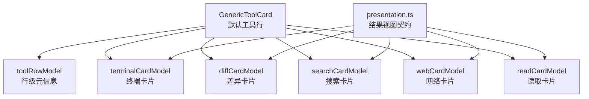
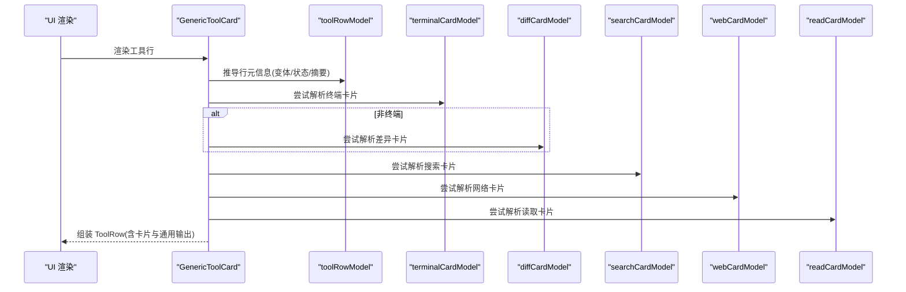
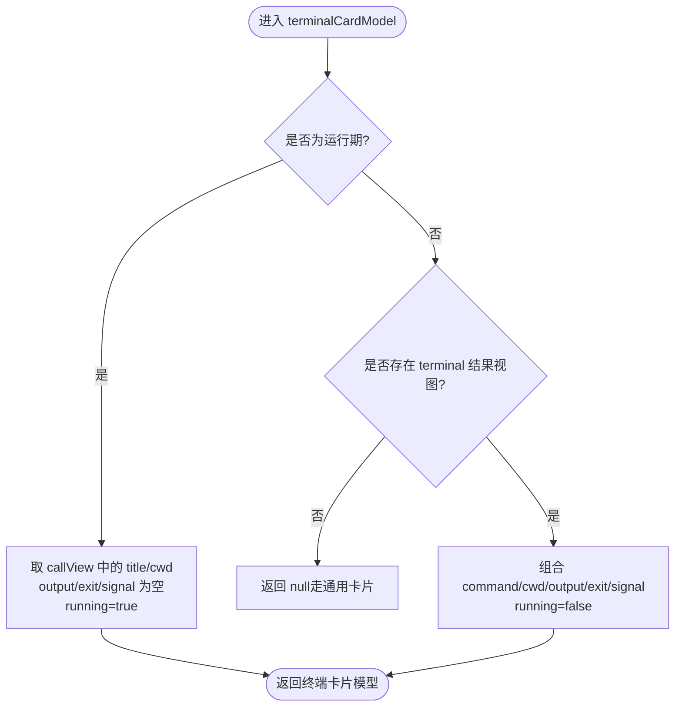
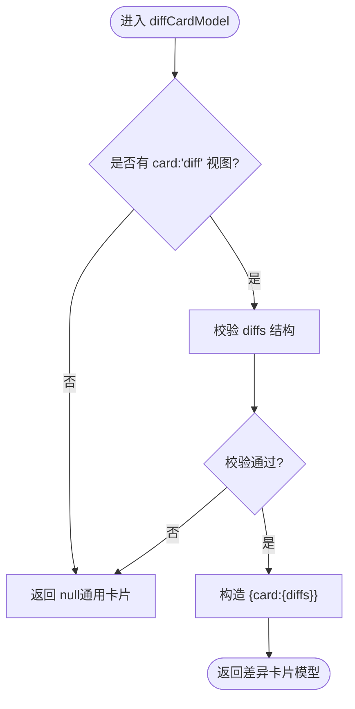
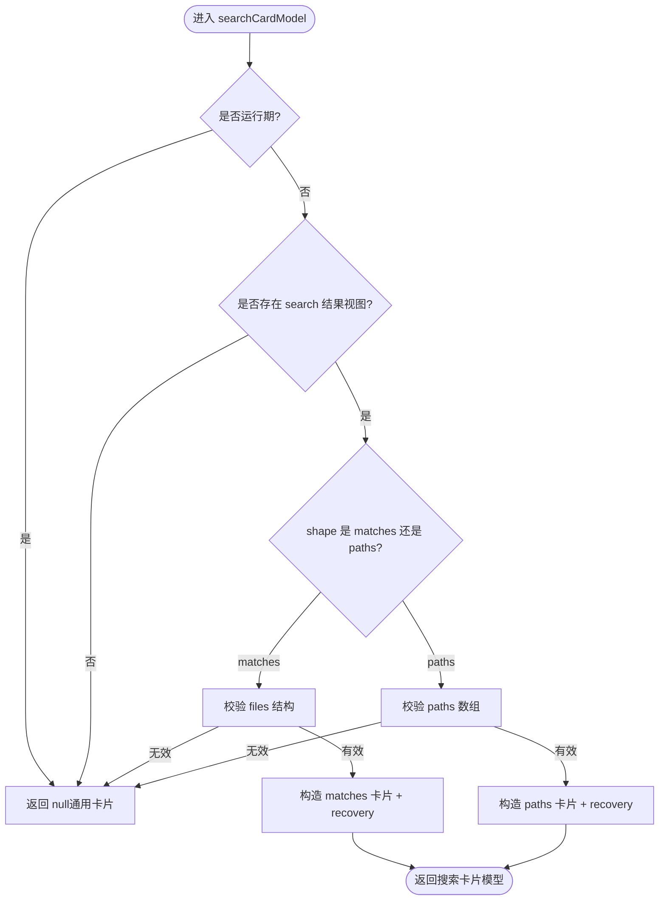
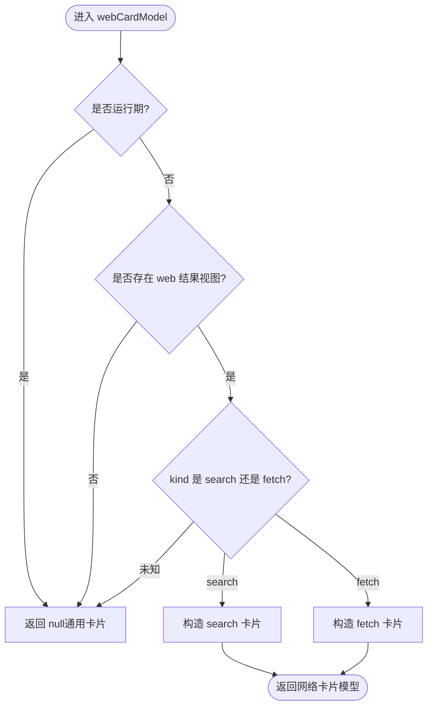
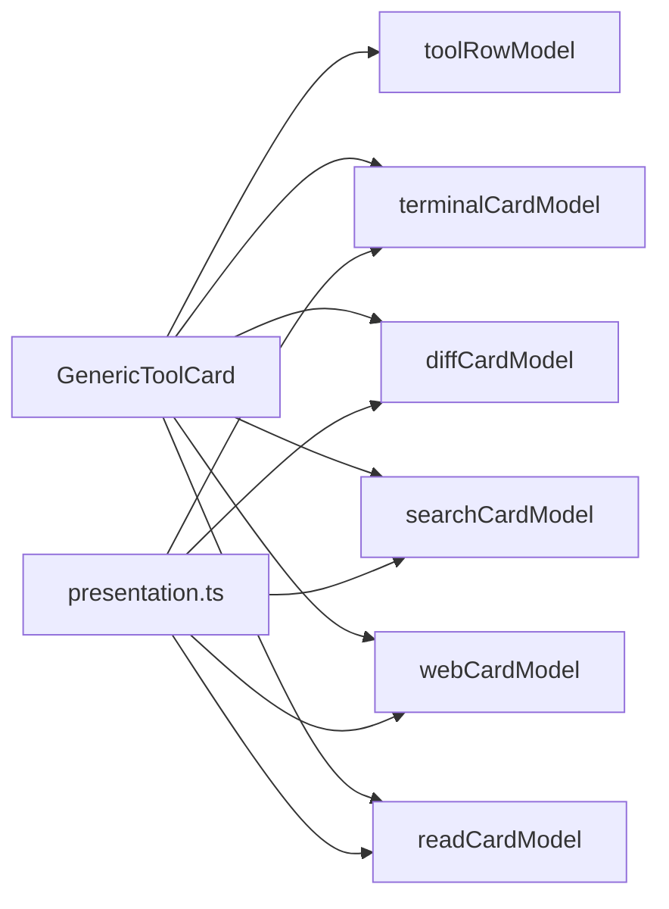

# 卡片类型详解

<cite>
**本文引用的文件**
- [packages/client/ui-tool/src/client/tool/models/tool-call-model.ts](file://packages/client/ui-tool/src/client/tool/models/tool-call-model.ts)
- [packages/client/ui-tool/src/client/tool/toolviews/GenericToolCard.tsx](file://packages/client/ui-tool/src/client/tool/toolviews/GenericToolCard.tsx)
- [packages/client/ui-tool/src/client/tool/models/terminal-card-model.ts](file://packages/client/ui-tool/src/client/tool/models/terminal-card-model.ts)
- [packages/client/ui-tool/src/client/tool/models/diff-card-model.ts](file://packages/client/ui-tool/src/client/tool/models/diff-card-model.ts)
- [packages/client/ui-tool/src/client/tool/models/search-card-model.ts](file://packages/client/ui-tool/src/client/tool/models/search-card-model.ts)
- [packages/client/ui-tool/src/client/tool/models/web-card-model.ts](file://packages/client/ui-tool/src/client/tool/models/web-card-model.ts)
- [packages/client/ui-tool/src/client/tool/models/read-card-model.ts](file://packages/client/ui-tool/src/client/tool/models/read-card-model.ts)
- [packages/core/tools/src/presentation.ts](file://packages/core/tools/src/presentation.ts)
</cite>

## 目录
1. [简介](#简介)
2. [项目结构](#项目结构)
3. [核心组件](#核心组件)
4. [架构总览](#架构总览)
5. [详细组件分析](#详细组件分析)
6. [依赖关系分析](#依赖关系分析)
7. [性能考量](#性能考量)
8. [故障排查指南](#故障排查指南)
9. [结论](#结论)
10. [附录](#附录)

## 简介
本文件系统化说明“工具调用卡片”的渲染与数据模型，覆盖以下卡片类型：
- generic（通用）：兜底展示，呈现原始结果或错误摘要。
- terminal（终端）：命令执行过程、工作目录、输出与退出状态。
- diff（差异）：文件前后对比，支持折叠与上下文行限制。
- search（搜索）：搜索结果分组匹配或路径列表，支持截断恢复提示。
- web（网络）：web_search 搜索结果与 web_fetch 抓取结果。
- read（读取）：文件内容片段、语言标识与总行数。

文档将解释每种卡片的适用场景、必需字段、可选配置、降级机制与最佳实践，并给出端到端的数据流与交互时序图。

## 项目结构
卡片相关代码集中在 ui-tool 包的 models 与 toolviews 中，由 presentation 层定义工具的结果视图契约。GenericToolCard 作为默认渲染入口，负责将不同卡片模型注入到统一的 ToolRow 中。

图表来源
- [packages/client/ui-tool/src/client/tool/toolviews/GenericToolCard.tsx:1-78](file://packages/client/ui-tool/src/client/tool/toolviews/GenericToolCard.tsx#L1-L78)
- [packages/client/ui-tool/src/client/tool/models/tool-call-model.ts:1-241](file://packages/client/ui-tool/src/client/tool/models/tool-call-model.ts#L1-L241)
- [packages/core/tools/src/presentation.ts:132-155](file://packages/core/tools/src/presentation.ts#L132-L155)

章节来源
- [packages/client/ui-tool/src/client/tool/toolviews/GenericToolCard.tsx:1-78](file://packages/client/ui-tool/src/client/tool/toolviews/GenericToolCard.tsx#L1-L78)
- [packages/client/ui-tool/src/client/tool/models/tool-call-model.ts:1-241](file://packages/client/ui-tool/src/client/tool/models/tool-call-model.ts#L1-L241)
- [packages/core/tools/src/presentation.ts:132-155](file://packages/core/tools/src/presentation.ts#L132-L155)

## 核心组件
- GenericToolCard：统一入口，计算行态、标题、摘要、展开体、输出与错误摘要，并将各卡片模型透传给 ToolRow。
- toolRowModel：基于工具名与快照切片推导行级元信息（变体、状态、摘要、文件路径等）。
- 各卡片模型：将 wire 层的 callView/resultView 转换为具体 UI 原语所需的 props，并进行严格校验与降级。

章节来源
- [packages/client/ui-tool/src/client/tool/toolviews/GenericToolCard.tsx:36-78](file://packages/client/ui-tool/src/client/tool/toolviews/GenericToolCard.tsx#L36-L78)
- [packages/client/ui-tool/src/client/tool/models/tool-call-model.ts:76-241](file://packages/client/ui-tool/src/client/tool/models/tool-call-model.ts#L76-L241)

## 架构总览
卡片渲染遵循“先尝试专用卡片，失败则回退到通用卡片”的策略。所有卡片均从冻结的快照切片派生，避免直接持有运行时引用。

图表来源
- [packages/client/ui-tool/src/client/tool/toolviews/GenericToolCard.tsx:36-78](file://packages/client/ui-tool/src/client/tool/toolviews/GenericToolCard.tsx#L36-L78)
- [packages/client/ui-tool/src/client/tool/models/tool-call-model.ts:211-241](file://packages/client/ui-tool/src/client/tool/models/tool-call-model.ts#L211-L241)

## 详细组件分析

### 通用卡片（generic）
- 适用场景：未知卡片类型、执行错误、无结构化视图、或后端返回 generic 视图时。
- 数据来源：resultText 将 content 块拼接为文本；若无文本且存在错误，则使用错误 name:code 行。
- 行为要点：
  - 保持原始结果或错误信息，确保可观测性。
  - 当其他专用卡片无法渲染时，自动回退至 generic。
- 关键实现位置：
  - 结果文本扁平化与错误首行提取：[packages/client/ui-tool/src/client/tool/models/tool-call-model.ts:100-117](file://packages/client/ui-tool/src/client/tool/models/tool-call-model.ts#L100-L117)
  - 行级元信息推导（状态、摘要、输出、错误摘要）：[packages/client/ui-tool/src/client/tool/models/tool-call-model.ts:211-241](file://packages/client/ui-tool/src/client/tool/models/tool-call-model.ts#L211-L241)

章节来源
- [packages/client/ui-tool/src/client/tool/models/tool-call-model.ts:100-117](file://packages/client/ui-tool/src/client/tool/models/tool-call-model.ts#L100-L117)
- [packages/client/ui-tool/src/client/tool/models/tool-call-model.ts:211-241](file://packages/client/ui-tool/src/client/tool/models/tool-call-model.ts#L211-L241)

### 终端卡片（terminal）
- 适用场景：shell/bash/pwsh 等命令执行，需要展示命令、工作目录、实时/最终输出与退出状态。
- 数据结构：
  - command：命令或替换标题（优先 result.title，其次 call.title，最后空串）。
  - cwd：工作目录（相对路径按会话工作区解析；缺失时显示裸 $）。
  - output：捕获的输出。
  - exitCode/signal：退出码或信号。
  - running：是否仍在运行。
- 行为要点：
  - 运行期仅显示命令与工作目录；完成后再填充输出与状态。
  - 失败退出（非零码或信号）在收起行以红色点提示。
  - 标签文案通过国际化函数生成。
- 关键实现位置：
  - 标签构建：[packages/client/ui-tool/src/client/tool/models/terminal-card-model.ts:24-39](file://packages/client/ui-tool/src/client/tool/models/terminal-card-model.ts#L24-L39)
  - 失败判定：[packages/client/ui-tool/src/client/tool/models/terminal-card-model.ts:72-75](file://packages/client/ui-tool/src/client/tool/models/terminal-card-model.ts#L72-L75)
  - 工作目录解析与规范化：[packages/client/ui-tool/src/client/tool/models/terminal-card-model.ts:89-154](file://packages/client/ui-tool/src/client/tool/models/terminal-card-model.ts#L89-L154)
  - 卡片模型推导（运行/完成两种分支）：[packages/client/ui-tool/src/client/tool/models/terminal-card-model.ts:182-219](file://packages/client/ui-tool/src/client/tool/models/terminal-card-model.ts#L182-L219)

图表来源
- [packages/client/ui-tool/src/client/tool/models/terminal-card-model.ts:182-219](file://packages/client/ui-tool/src/client/tool/models/terminal-card-model.ts#L182-L219)

章节来源
- [packages/client/ui-tool/src/client/tool/models/terminal-card-model.ts:24-39](file://packages/client/ui-tool/src/client/tool/models/terminal-card-model.ts#L24-L39)
- [packages/client/ui-tool/src/client/tool/models/terminal-card-model.ts:72-75](file://packages/client/ui-tool/src/client/tool/models/terminal-card-model.ts#L72-L75)
- [packages/client/ui-tool/src/client/tool/models/terminal-card-model.ts:89-154](file://packages/client/ui-tool/src/client/tool/models/terminal-card-model.ts#L89-L154)
- [packages/client/ui-tool/src/client/tool/models/terminal-card-model.ts:182-219](file://packages/client/ui-tool/src/client/tool/models/terminal-card-model.ts#L182-L219)

### 差异卡片（diff）
- 适用场景：write/edit 等写操作，展示文件前后差异。
- 数据结构：
  - diffs：数组项包含 path、oldText、newText。
- 行为要点：
  - 运行期使用 callView 的 diffs；完成后用 resultView 的已应用 hunks 替换。
  - 对 diffs 进行严格校验，非法数据回退到通用卡片。
  - 聊天行内限定上下文行数以保持扫描效率。
- 关键实现位置：
  - 常量与模型定义：[packages/client/ui-tool/src/client/tool/models/diff-card-model.ts:22-36](file://packages/client/ui-tool/src/client/tool/models/diff-card-model.ts#L22-L36)
  - 差异数据校验：[packages/client/ui-tool/src/client/tool/models/diff-card-model.ts:48-60](file://packages/client/ui-tool/src/client/tool/models/diff-card-model.ts#L48-L60)
  - 卡片模型推导（运行/完成）：[packages/client/ui-tool/src/client/tool/models/diff-card-model.ts:84-97](file://packages/client/ui-tool/src/client/tool/models/diff-card-model.ts#L84-L97)

图表来源
- [packages/client/ui-tool/src/client/tool/models/diff-card-model.ts:84-97](file://packages/client/ui-tool/src/client/tool/models/diff-card-model.ts#L84-L97)

章节来源
- [packages/client/ui-tool/src/client/tool/models/diff-card-model.ts:22-36](file://packages/client/ui-tool/src/client/tool/models/diff-card-model.ts#L22-L36)
- [packages/client/ui-tool/src/client/tool/models/diff-card-model.ts:48-60](file://packages/client/ui-tool/src/client/tool/models/diff-card-model.ts#L48-L60)
- [packages/client/ui-tool/src/client/tool/models/diff-card-model.ts:84-97](file://packages/client/ui-tool/src/client/tool/models/diff-card-model.ts#L84-L97)

### 搜索卡片（search）
- 适用场景：grep/glob 等搜索工具，展示匹配文件或路径列表。
- 数据结构：
  - shape：'matches' 或 'paths'。
  - matches：按文件分组的匹配项（行号、行内容）。
  - paths：字符串路径数组。
  - truncated/total：是否截断与总数。
  - title：可选替换标题。
  - recovery：当结果被截断时，提供原始结果文本以便定位被丢弃的行。
- 行为要点：
  - 仅结果期有效；运行期返回 null。
  - 对 files/paths 做严格校验，非法数据回退到通用卡片。
  - 截断时保留 recovery 文本，便于用户找回完整结果。
- 关键实现位置：
  - 常量与模型定义：[packages/client/ui-tool/src/client/tool/models/search-card-model.ts:37-75](file://packages/client/ui-tool/src/client/tool/models/search-card-model.ts#L37-L75)
  - 匹配项校验：[packages/client/ui-tool/src/client/tool/models/search-card-model.ts:87-96](file://packages/client/ui-tool/src/client/tool/models/search-card-model.ts#L87-L96)
  - 原始文本扁平化：[packages/client/ui-tool/src/client/tool/models/search-card-model.ts:107-113](file://packages/client/ui-tool/src/client/tool/models/search-card-model.ts#L107-L113)
  - 卡片模型推导（matches/paths）：[packages/client/ui-tool/src/client/tool/models/search-card-model.ts:130-160](file://packages/client/ui-tool/src/client/tool/models/search-card-model.ts#L130-L160)

图表来源
- [packages/client/ui-tool/src/client/tool/models/search-card-model.ts:130-160](file://packages/client/ui-tool/src/client/tool/models/search-card-model.ts#L130-L160)

章节来源
- [packages/client/ui-tool/src/client/tool/models/search-card-model.ts:37-75](file://packages/client/ui-tool/src/client/tool/models/search-card-model.ts#L37-L75)
- [packages/client/ui-tool/src/client/tool/models/search-card-model.ts:87-96](file://packages/client/ui-tool/src/client/tool/models/search-card-model.ts#L87-L96)
- [packages/client/ui-tool/src/client/tool/models/search-card-model.ts:107-113](file://packages/client/ui-tool/src/client/tool/models/search-card-model.ts#L107-L113)
- [packages/client/ui-tool/src/client/tool/models/search-card-model.ts:130-160](file://packages/client/ui-tool/src/client/tool/models/search-card-model.ts#L130-L160)

### 网络卡片（web）
- 适用场景：web_search 与 web_fetch 工具，分别展示搜索结果与 URL 抓取状态。
- 数据结构：
  - kind：'search' 或 'fetch'。
  - search：answer、sources（url/title/snippet/publishedAt）、truncated。
  - fetch：url、statusCode、truncated。
- 行为要点：
  - 仅结果期有效；运行期返回 null。
  - 对未知的 kind 值采取安全降级（回退通用卡片），避免渲染异常。
- 关键实现位置：
  - 卡片模型推导（search/fetch）：[packages/client/ui-tool/src/client/tool/models/web-card-model.ts:39-74](file://packages/client/ui-tool/src/client/tool/models/web-card-model.ts#L39-L74)

图表来源
- [packages/client/ui-tool/src/client/tool/models/web-card-model.ts:39-74](file://packages/client/ui-tool/src/client/tool/models/web-card-model.ts#L39-L74)

章节来源
- [packages/client/ui-tool/src/client/tool/models/web-card-model.ts:39-74](file://packages/client/ui-tool/src/client/tool/models/web-card-model.ts#L39-L74)

### 读取卡片（read）
- 适用场景：read 工具读取文件内容片段，展示行号、文本、语言与总行数。
- 数据结构：
  - label：标题或相对路径。
  - lines：行对象数组（number/text）。
  - totalLines：总行数。
  - lang：语言标识。
- 行为要点：
  - 仅结果期有效；运行期返回 null。
  - 复制行数据以避免持有运行时缓存引用。
  - 路径根据会话工作区相对化显示。
- 关键实现位置：
  - 常量与模型定义：[packages/client/ui-tool/src/client/tool/models/read-card-model.ts:19-36](file://packages/client/ui-tool/src/client/tool/models/read-card-model.ts#L19-L36)
  - 卡片模型推导（路径相对化与行拷贝）：[packages/client/ui-tool/src/client/tool/models/read-card-model.ts:62-76](file://packages/client/ui-tool/src/client/tool/models/read-card-model.ts#L62-L76)

章节来源
- [packages/client/ui-tool/src/client/tool/models/read-card-model.ts:19-36](file://packages/client/ui-tool/src/client/tool/models/read-card-model.ts#L19-L36)
- [packages/client/ui-tool/src/client/tool/models/read-card-model.ts:62-76](file://packages/client/ui-tool/src/client/tool/models/read-card-model.ts#L62-L76)

## 依赖关系分析
- 入口依赖：GenericToolCard 依赖 toolRowModel 与各卡片模型，统一装配 ToolRow。
- 契约依赖：各卡片模型依赖 presentation 层定义的 ToolResultView 联合类型，确保前后端一致。
- 行级依赖：toolRowModel 提供变体分类、状态、摘要、输出与错误摘要，供通用与专用卡片共用。

图表来源
- [packages/client/ui-tool/src/client/tool/toolviews/GenericToolCard.tsx:1-78](file://packages/client/ui-tool/src/client/tool/toolviews/GenericToolCard.tsx#L1-L78)
- [packages/core/tools/src/presentation.ts:132-155](file://packages/core/tools/src/presentation.ts#L132-L155)

章节来源
- [packages/client/ui-tool/src/client/tool/toolviews/GenericToolCard.tsx:1-78](file://packages/client/ui-tool/src/client/tool/toolviews/GenericToolCard.tsx#L1-L78)
- [packages/core/tools/src/presentation.ts:132-155](file://packages/core/tools/src/presentation.ts#L132-L155)

## 性能考量
- 行内折叠限制：diff/search/read 在聊天行内限制上下文行数，保证消息流的可扫描性。
- 纯派生：所有卡片模型均为纯函数，输入为冻结快照切片，避免额外内存占用与副作用。
- 严格校验：对不可信 wire 数据进行前置校验，减少渲染时的崩溃风险与重绘成本。
- 结果期优化：search/web/read 仅在结果期生效，避免运行期的无用计算。

[本节为通用指导，不直接分析具体文件]

## 故障排查指南
- 终端失败未高亮：检查 terminalFailed 判定逻辑（非零退出码或信号）以及行状态覆盖。
  - 参考：[packages/client/ui-tool/src/client/tool/models/terminal-card-model.ts:72-75](file://packages/client/ui-tool/src/client/tool/models/terminal-card-model.ts#L72-L75)
- 差异卡片不显示：确认 diffs 结构合法（path/oldText/newText），否则回退通用卡片。
  - 参考：[packages/client/ui-tool/src/client/tool/models/diff-card-model.ts:48-60](file://packages/client/ui-tool/src/client/tool/models/diff-card-model.ts#L48-L60)
- 搜索卡片结果为空：检查 shape 与 files/paths 是否合法；若被截断，查看 recovery 文本。
  - 参考：[packages/client/ui-tool/src/client/tool/models/search-card-model.ts:87-96](file://packages/client/ui-tool/src/client/tool/models/search-card-model.ts#L87-L96)
  - 参考：[packages/client/ui-tool/src/client/tool/models/search-card-model.ts:107-113](file://packages/client/ui-tool/src/client/tool/models/search-card-model.ts#L107-L113)
- 网络卡片异常：确认 kind 为已知值（search/fetch），未知值会回退通用卡片。
  - 参考：[packages/client/ui-tool/src/client/tool/models/web-card-model.ts:39-74](file://packages/client/ui-tool/src/client/tool/models/web-card-model.ts#L39-L74)
- 读取卡片路径不正确：检查会话工作区根与路径相对化逻辑。
  - 参考：[packages/client/ui-tool/src/client/tool/models/read-card-model.ts:62-76](file://packages/client/ui-tool/src/client/tool/models/read-card-model.ts#L62-L76)

章节来源
- [packages/client/ui-tool/src/client/tool/models/terminal-card-model.ts:72-75](file://packages/client/ui-tool/src/client/tool/models/terminal-card-model.ts#L72-L75)
- [packages/client/ui-tool/src/client/tool/models/diff-card-model.ts:48-60](file://packages/client/ui-tool/src/client/tool/models/diff-card-model.ts#L48-L60)
- [packages/client/ui-tool/src/client/tool/models/search-card-model.ts:87-96](file://packages/client/ui-tool/src/client/tool/models/search-card-model.ts#L87-L96)
- [packages/client/ui-tool/src/client/tool/models/search-card-model.ts:107-113](file://packages/client/ui-tool/src/client/tool/models/search-card-model.ts#L107-L113)
- [packages/client/ui-tool/src/client/tool/models/web-card-model.ts:39-74](file://packages/client/ui-tool/src/client/tool/models/web-card-model.ts#L39-L74)
- [packages/client/ui-tool/src/client/tool/models/read-card-model.ts:62-76](file://packages/client/ui-tool/src/client/tool/models/read-card-model.ts#L62-L76)

## 结论
本仓库采用“专用卡片优先、通用卡片兜底”的统一渲染策略，通过严格的 wire 数据校验与纯函数派生，确保在不同环境与版本间稳定展示。终端、差异、搜索、网络与读取卡片各自聚焦特定业务场景，同时共享一致的降级与错误处理机制。建议在扩展新卡片时遵循现有模式：明确结果视图契约、进行强校验、提供合理的行内折叠与恢复信息，并在 GenericToolCard 中按序尝试解析。

[本节为总结性内容，不直接分析具体文件]

## 附录
- 结果视图契约：工具可在完成时返回结构化视图以替代原始结果文本，便于 UI 渲染。
  - 参考：[packages/core/tools/src/presentation.ts:132-155](file://packages/core/tools/src/presentation.ts#L132-L155)
- 行级元信息：工具行变体、状态、摘要、输出与错误摘要均由 toolRowModel 统一推导。
  - 参考：[packages/client/ui-tool/src/client/tool/models/tool-call-model.ts:76-241](file://packages/client/ui-tool/src/client/tool/models/tool-call-model.ts#L76-L241)

章节来源
- [packages/core/tools/src/presentation.ts:132-155](file://packages/core/tools/src/presentation.ts#L132-L155)
- [packages/client/ui-tool/src/client/tool/models/tool-call-model.ts:76-241](file://packages/client/ui-tool/src/client/tool/models/tool-call-model.ts#L76-L241)