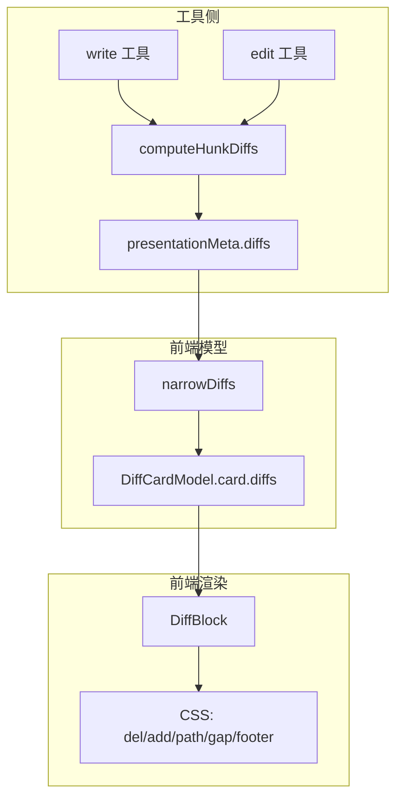
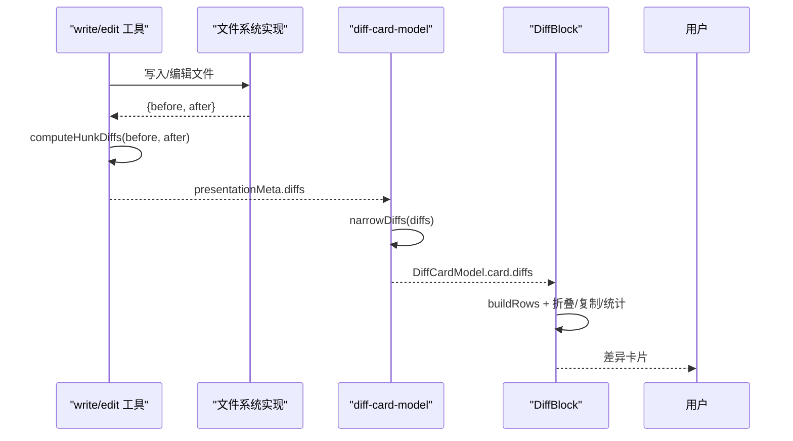
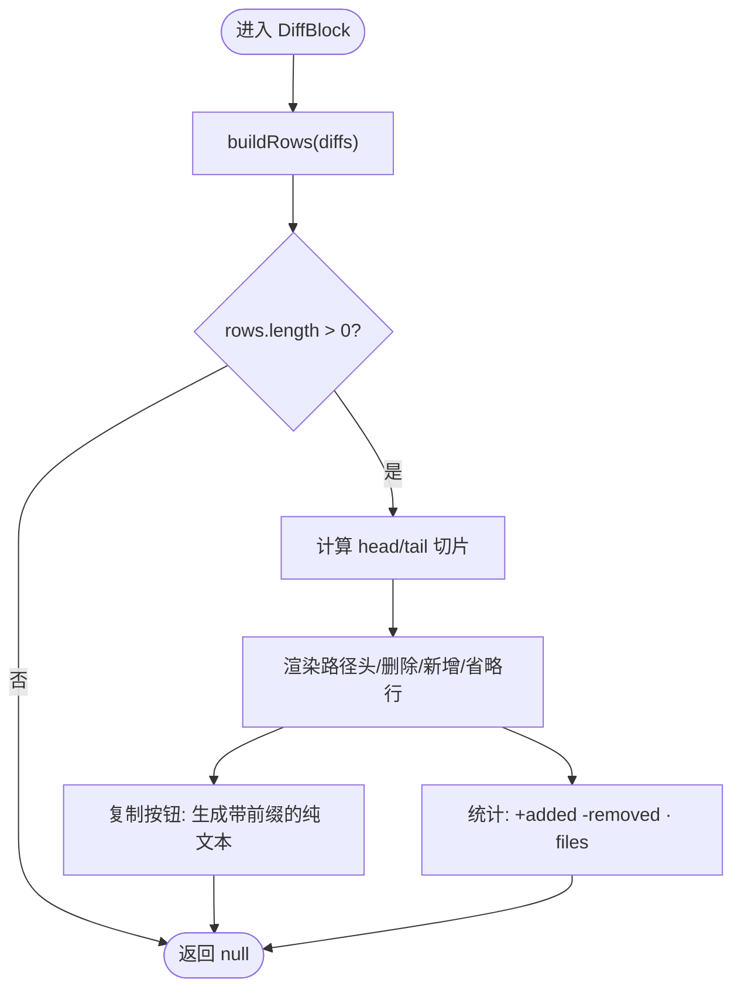
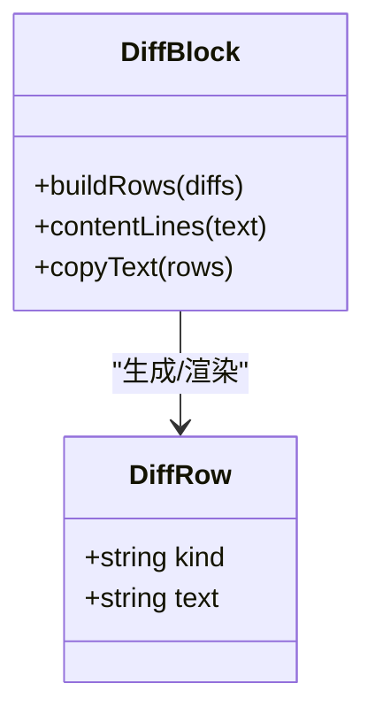
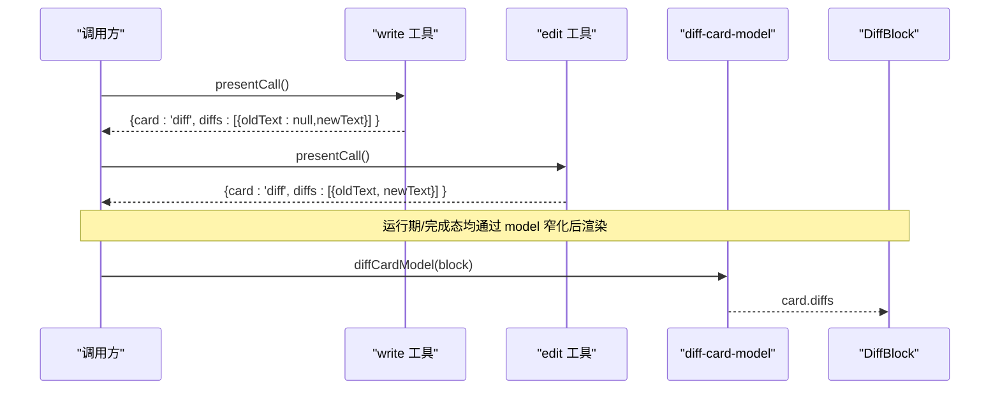
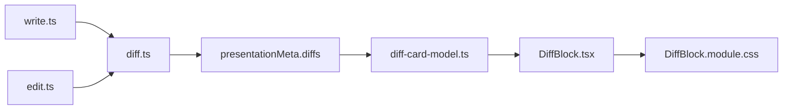

# 差异卡片

<cite>
**本文引用的文件**
- [packages/client/ui-primitives/src/DiffBlock.tsx](file://packages/client/ui-primitives/src/DiffBlock.tsx)
- [packages/client/ui-primitives/src/DiffBlock.module.css](file://packages/client/ui-primitives/src/DiffBlock.module.css)
- [packages/client/ui-tool/src/client/tool/models/diff-card-model.ts](file://packages/client/ui-tool/src/client/tool/models/diff-card-model.ts)
- [packages/fs/tool-fs/src/diff.ts](file://packages/fs/tool-fs/src/diff.ts)
- [packages/fs/tool-fs/src/edit.ts](file://packages/fs/tool-fs/src/edit.ts)
- [packages/fs/tool-fs/src/write.ts](file://packages/fs/tool-fs/src/write.ts)
- [packages/core/tools/src/presentation.ts](file://packages/core/tools/src/presentation.ts)
- [packages/fs/fs-local/src/index.ts](file://packages/fs/fs-local/src/index.ts)
- [packages/fs/fs-local/src/fsio.ts](file://packages/fs/fs-local/src/fsio.ts)
- [packages/client/connection/src/client/fixture.ts](file://packages/client/connection/src/client/fixture.ts)
- [packages/client/ui-primitives/tests/diff-block.client.spec.tsx](file://packages/client/ui-primitives/tests/diff-block.client.spec.tsx)
</cite>

## 目录
1. [简介](#简介)
2. [项目结构](#项目结构)
3. [核心组件](#核心组件)
4. [架构总览](#架构总览)
5. [详细组件分析](#详细组件分析)
6. [依赖关系分析](#依赖关系分析)
7. [性能考虑](#性能考虑)
8. [故障排查指南](#故障排查指南)
9. [结论](#结论)
10. [附录](#附录)

## 简介
差异卡片用于以“文件修改”的视角展示工具调用对文件系统产生的变更。它把一次或多次“已应用的上下文差异片段（hunks）”渲染为可复制、可折叠的块，提供删除行（红色）、新增行（绿色）、路径头与省略分隔符等视觉语义，并在底部汇总统计“+A -R · N file(s)”。该能力由工具层生成 diffs，前端模型层进行安全校验与适配，最终由 UI 原语组件 DiffBlock 渲染。

## 项目结构
- 工具侧（后端/执行侧）：write/edit 工具在结果中附带“应用后的上下文差异”，通过 presentationMeta 暴露给前端；diff 计算使用结构化补丁算法，按上下文行数切分为 hunks。
- 模型侧（前端）：将跨进程/跨版本传输的 card:'diff' 视图窄化为安全的 DiffHunk[]，并注入到 DiffBlock 的 props。
- 渲染侧（前端）：DiffBlock 负责扁平化行、高度折叠、复制、统计与样式高亮。



**图表来源**
- [packages/fs/tool-fs/src/write.ts:95-100](file://packages/fs/tool-fs/src/write.ts#L95-L100)
- [packages/fs/tool-fs/src/edit.ts:107-110](file://packages/fs/tool-fs/src/edit.ts#L107-L110)
- [packages/fs/tool-fs/src/diff.ts:33-57](file://packages/fs/tool-fs/src/diff.ts#L33-L57)
- [packages/client/ui-tool/src/client/tool/models/diff-card-model.ts:48-60](file://packages/client/ui-tool/src/client/tool/models/diff-card-model.ts#L48-L60)
- [packages/client/ui-primitives/src/DiffBlock.tsx:141-195](file://packages/client/ui-primitives/src/DiffBlock.tsx#L141-L195)
- [packages/client/ui-primitives/src/DiffBlock.module.css:49-107](file://packages/client/ui-primitives/src/DiffBlock.module.css#L49-L107)

**章节来源**
- [packages/fs/tool-fs/src/write.ts:95-100](file://packages/fs/tool-fs/src/write.ts#L95-L100)
- [packages/fs/tool-fs/src/edit.ts:107-110](file://packages/fs/tool-fs/src/edit.ts#L107-L110)
- [packages/fs/tool-fs/src/diff.ts:33-57](file://packages/fs/tool-fs/src/diff.ts#L33-L57)
- [packages/client/ui-tool/src/client/tool/models/diff-card-model.ts:48-60](file://packages/client/ui-tool/src/client/tool/models/diff-card-model.ts#L48-L60)
- [packages/client/ui-primitives/src/DiffBlock.tsx:141-195](file://packages/client/ui-primitives/src/DiffBlock.tsx#L141-L195)
- [packages/client/ui-primitives/src/DiffBlock.module.css:49-107](file://packages/client/ui-primitives/src/DiffBlock.module.css#L49-L107)

## 核心组件
- DiffHunk 数据结构：每个 hunk 包含 path、oldText、newText。path 是模型可见的文件路径；oldText 为变更前的文本，新建/覆盖时为 null；newText 为变更后文本。
- DiffBlockProps：接收 diffs 数组（每行一个已应用的 hunk，按文件顺序），以及 maxLines 控制折叠阈值。
- DiffCardModel：从 callView/resultView 中提取并校验 diffs，确保类型安全，再传递给 DiffBlock。
- computeHunkDiffs：基于结构化补丁，按上下文行数切分 hunks，过滤掉无实际内容的标记行，生成 FileDiff[]。

**章节来源**
- [packages/client/ui-primitives/src/DiffBlock.tsx:23-44](file://packages/client/ui-primitives/src/DiffBlock.tsx#L23-L44)
- [packages/client/ui-tool/src/client/tool/models/diff-card-model.ts:29-36](file://packages/client/ui-tool/src/client/tool/models/diff-card-model.ts#L29-L36)
- [packages/fs/tool-fs/src/diff.ts:22-57](file://packages/fs/tool-fs/src/diff.ts#L22-L57)

## 架构总览
差异卡片的端到端流程如下：
- write/edit 工具执行后，返回 before/after 文本，并通过 presentationMeta 附带应用后的上下文差异。
- 前端模型层对跨进程数据做严格窄化，避免异常数据导致崩溃。
- 渲染层将 hunks 扁平化为行，处理路径头、省略分隔符、删除/新增行高亮、折叠与复制，并输出统计信息。



**图表来源**
- [packages/fs/tool-fs/src/write.ts:95-100](file://packages/fs/tool-fs/src/write.ts#L95-L100)
- [packages/fs/tool-fs/src/edit.ts:107-110](file://packages/fs/tool-fs/src/edit.ts#L107-L110)
- [packages/fs/tool-fs/src/diff.ts:33-57](file://packages/fs/tool-fs/src/diff.ts#L33-L57)
- [packages/client/ui-tool/src/client/tool/models/diff-card-model.ts:84-97](file://packages/client/ui-tool/src/client/tool/models/diff-card-model.ts#L84-L97)
- [packages/client/ui-primitives/src/DiffBlock.tsx:141-195](file://packages/client/ui-primitives/src/DiffBlock.tsx#L141-L195)

## 详细组件分析

### 数据结构与渲染逻辑
- DiffHunk：path 用于显示路径头；oldText 为 null 表示新建/覆盖；newText 始终存在。
- buildRows：将 hunks 扁平化为行，遇到相同文件第二个 hunk 时插入省略分隔符；统计 added/removed/files。
- contentLines：按行分割文本，去除末尾换行作为终止符，不产生多余空行。
- 复制：将每行加上“- ”/“+ ”前缀拼接为纯文本，便于粘贴到编辑器。
- 折叠：超过 maxLines 时仅显示头部和尾部，并提供展开/收起按钮。



**图表来源**
- [packages/client/ui-primitives/src/DiffBlock.tsx:76-99](file://packages/client/ui-primitives/src/DiffBlock.tsx#L76-L99)
- [packages/client/ui-primitives/src/DiffBlock.tsx:110-134](file://packages/client/ui-primitives/src/DiffBlock.tsx#L110-L134)
- [packages/client/ui-primitives/src/DiffBlock.tsx:141-195](file://packages/client/ui-primitives/src/DiffBlock.tsx#L141-L195)

**章节来源**
- [packages/client/ui-primitives/src/DiffBlock.tsx:23-44](file://packages/client/ui-primitives/src/DiffBlock.tsx#L23-L44)
- [packages/client/ui-primitives/src/DiffBlock.tsx:76-99](file://packages/client/ui-primitives/src/DiffBlock.tsx#L76-L99)
- [packages/client/ui-primitives/src/DiffBlock.tsx:110-134](file://packages/client/ui-primitives/src/DiffBlock.tsx#L110-L134)
- [packages/client/ui-primitives/src/DiffBlock.tsx:141-195](file://packages/client/ui-primitives/src/DiffBlock.tsx#L141-L195)

### 文件路径匹配与高亮机制
- 路径头：每个新文件的第一个 hunk 会渲染路径头；同一文件的后续 hunk 用省略分隔符代替重复路径。
- 删除/新增高亮：删除行以错误色显示并带“- ”前缀；新增行以成功色显示并带“+ ”前缀。
- 统计脚注：底部显示“└ +A -R · N file(s)”，其中文件数为 distinct paths 的数量。



**图表来源**
- [packages/client/ui-primitives/src/DiffBlock.tsx:46-64](file://packages/client/ui-primitives/src/DiffBlock.tsx#L46-L64)
- [packages/client/ui-primitives/src/DiffBlock.tsx:76-99](file://packages/client/ui-primitives/src/DiffBlock.tsx#L76-L99)
- [packages/client/ui-primitives/src/DiffBlock.module.css:49-107](file://packages/client/ui-primitives/src/DiffBlock.module.css#L49-L107)

**章节来源**
- [packages/client/ui-primitives/src/DiffBlock.tsx:76-99](file://packages/client/ui-primitives/src/DiffBlock.tsx#L76-L99)
- [packages/client/ui-primitives/src/DiffBlock.module.css:49-107](file://packages/client/ui-primitives/src/DiffBlock.module.css#L49-L107)

### oldText/newText 处理与新文件 null 情况
- oldText 为 null：表示新建文件或覆盖（移除侧为空）。
- newText 为空字符串：表示整文件删除（新增侧为空）。
- 内容行处理：去除末尾换行作为终止符，内部空行保留。

**章节来源**
- [packages/fs/tool-fs/src/diff.ts:22-57](file://packages/fs/tool-fs/src/diff.ts#L22-L57)
- [packages/client/ui-primitives/src/DiffBlock.tsx:110-114](file://packages/client/ui-primitives/src/DiffBlock.tsx#L110-L114)
- [packages/client/ui-primitives/tests/diff-block.client.spec.tsx:108-115](file://packages/client/ui-primitives/tests/diff-block.client.spec.tsx#L108-L115)

### 文件编辑工具的集成示例
- write 工具：
  - presentCall：以 oldText:null 的新增形式展示意图。
  - presentResult：优先使用 result.meta 中的 hunks；若不可用则回退到 whole-file diff。
- edit 工具：
  - presentCall：以 literal 替换形式展示 old_string → new_string。
  - presentResult：使用 result.meta 中的 hunks 展示真实变更。



**图表来源**
- [packages/fs/tool-fs/src/write.ts:130-148](file://packages/fs/tool-fs/src/write.ts#L130-L148)
- [packages/fs/tool-fs/src/edit.ts:148-166](file://packages/fs/tool-fs/src/edit.ts#L148-L166)
- [packages/client/ui-tool/src/client/tool/models/diff-card-model.ts:84-97](file://packages/client/ui-tool/src/client/tool/models/diff-card-model.ts#L84-L97)

**章节来源**
- [packages/fs/tool-fs/src/write.ts:130-148](file://packages/fs/tool-fs/src/write.ts#L130-L148)
- [packages/fs/tool-fs/src/edit.ts:148-166](file://packages/fs/tool-fs/src/edit.ts#L148-L166)
- [packages/client/connection/src/client/fixture.ts:631-652](file://packages/client/connection/src/client/fixture.ts#L631-L652)

### 差异计算的算法与优化
- 算法：使用结构化补丁（context=3）生成 hunks，过滤掉无实际内容的标记行，按旧/新两侧分别拼接为 oldText/newText。
- 大文件保护：当 before/after 任一达到或超过配置上限时，放弃上下文差异 basis，转为 whole-file 回退，避免内存爆炸。
- 增量更新：write/edit 的结果 meta 携带“应用后的上下文差异”，回放时可重现一致的前端展示。

```mermaid
flowchart TD
A["before/after"] --> B["structuredPatch(context=3)"]
B --> C{"hunk.lines"}
C --> |'- ' -> D["oldLines.push(text)"]
C --> |'+ ' -> E["newLines.push(text)"]
C --> |' ' -> F["oldLines.push(text); newLines.push(text)"]
D --> G["跳过 '\\\\' 标记行"]
E --> G
F --> G
G --> H["生成 FileDiff(path, oldText?, newText)"]
H --> I{"是否超过 diffBasisMaxBytes?"}
I -- 是 --> J["放弃 context, 回退 whole-file"]
I -- 否 --> K["返回 hunks"]
```

**图表来源**
- [packages/fs/tool-fs/src/diff.ts:33-57](file://packages/fs/tool-fs/src/diff.ts#L33-L57)
- [packages/fs/fs-local/src/index.ts:190-219](file://packages/fs/fs-local/src/index.ts#L190-L219)
- [packages/fs/fs-local/src/fsio.ts:683-712](file://packages/fs/fs-local/src/fsio.ts#L683-L712)

**章节来源**
- [packages/fs/tool-fs/src/diff.ts:33-57](file://packages/fs/tool-fs/src/diff.ts#L33-L57)
- [packages/fs/fs-local/src/index.ts:190-219](file://packages/fs/fs-local/src/index.ts#L190-L219)
- [packages/fs/fs-local/src/fsio.ts:683-712](file://packages/fs/fs-local/src/fsio.ts#L683-L712)

## 依赖关系分析
- 工具侧依赖：write/edit 依赖 diff 计算模块，将 hunks 附加到 presentationMeta。
- 前端模型依赖：diff-card-model 依赖 ui-primitives 的 DiffHunk 类型，并对跨进程数据进行窄化。
- 渲染依赖：DiffBlock 依赖 CSS 模块进行高亮与布局。



**图表来源**
- [packages/fs/tool-fs/src/write.ts:95-100](file://packages/fs/tool-fs/src/write.ts#L95-L100)
- [packages/fs/tool-fs/src/edit.ts:107-110](file://packages/fs/tool-fs/src/edit.ts#L107-L110)
- [packages/fs/tool-fs/src/diff.ts:33-57](file://packages/fs/tool-fs/src/diff.ts#L33-L57)
- [packages/client/ui-tool/src/client/tool/models/diff-card-model.ts:48-60](file://packages/client/ui-tool/src/client/tool/models/diff-card-model.ts#L48-L60)
- [packages/client/ui-primitives/src/DiffBlock.tsx:141-195](file://packages/client/ui-primitives/src/DiffBlock.tsx#L141-L195)
- [packages/client/ui-primitives/src/DiffBlock.module.css:49-107](file://packages/client/ui-primitives/src/DiffBlock.module.css#L49-L107)

**章节来源**
- [packages/fs/tool-fs/src/write.ts:95-100](file://packages/fs/tool-fs/src/write.ts#L95-L100)
- [packages/fs/tool-fs/src/edit.ts:107-110](file://packages/fs/tool-fs/src/edit.ts#L107-L110)
- [packages/fs/tool-fs/src/diff.ts:33-57](file://packages/fs/tool-fs/src/diff.ts#L33-L57)
- [packages/client/ui-tool/src/client/tool/models/diff-card-model.ts:48-60](file://packages/client/ui-tool/src/client/tool/models/diff-card-model.ts#L48-L60)
- [packages/client/ui-primitives/src/DiffBlock.tsx:141-195](file://packages/client/ui-primitives/src/DiffBlock.tsx#L141-L195)
- [packages/client/ui-primitives/src/DiffBlock.module.css:49-107](file://packages/client/ui-primitives/src/DiffBlock.module.css#L49-L107)

## 性能考虑
- 行级折叠：默认最大显示行数限制，超出部分折叠，减少 DOM 节点与重排。
- 文本处理：contentLines 去除末尾换行，避免多余空行；复制时添加前缀保证一致性。
- 大文件保护：当 before/after 达到或超过字节上限时，放弃上下文差异 basis，回退到 whole-file 展示，防止内存占用过高。
- 统计计算：使用 Set 统计 distinct paths，O(n) 时间复杂度。

**章节来源**
- [packages/client/ui-primitives/src/DiffBlock.tsx:17-21](file://packages/client/ui-primitives/src/DiffBlock.tsx#L17-L21)
- [packages/client/ui-primitives/src/DiffBlock.tsx:76-99](file://packages/client/ui-primitives/src/DiffBlock.tsx#L76-L99)
- [packages/fs/fs-local/src/index.ts:190-219](file://packages/fs/fs-local/src/index.ts#L190-L219)
- [packages/fs/fs-local/src/fsio.ts:683-712](file://packages/fs/fs-local/src/fsio.ts#L683-L712)

## 故障排查指南
- 数据格式校验失败：如果 diffs 不是数组或缺少字段，narrowDiffs 返回 null，卡片降级为通用结果，避免崩溃。
- 二进制或非 UTF-8 文件：readTextForDiff 返回 null，write 回退到 whole-file 展示。
- 并发外部替换：打开描述符大小变化时视为无效 basis，回退到 whole-file。
- 测试用例参考：多 hunk 同文件显示省略分隔符；新建文件 oldText 为 null；高度折叠行为符合预期。

**章节来源**
- [packages/client/ui-tool/src/client/tool/models/diff-card-model.ts:48-60](file://packages/client/ui-tool/src/client/tool/models/diff-card-model.ts#L48-L60)
- [packages/fs/fs-local/src/fsio.ts:683-712](file://packages/fs/fs-local/src/fsio.ts#L683-L712)
- [packages/client/ui-primitives/tests/diff-block.client.spec.tsx:54-77](file://packages/client/ui-primitives/tests/diff-block.client.spec.tsx#L54-L77)
- [packages/client/ui-primitives/tests/diff-block.client.spec.tsx:108-133](file://packages/client/ui-primitives/tests/diff-block.client.spec.tsx#L108-L133)

## 结论
差异卡片通过工具侧的结构化补丁生成上下文差异，前端模型层进行安全窄化，最终由 UI 原语组件呈现为可读、可复制、可折叠的差异块。其设计兼顾了用户体验与性能，支持大文件保护与回放一致性。对于高级功能如撤销/重做，可在上层状态管理中对 diffs 进行快照与合并，结合本组件的扁平行与统计能力，实现高效的差异操作历史。

## 附录
- 接口定义：DiffHunk、DiffBlockProps、DiffCardModel、DiffResultView。
- 常量：DEFAULT_DIFF_MAX_LINES、CHAT_DIFF_MAX_LINES、DIFF_CONTEXT。
- 测试与示例：fixture 中演示多 hunk、新建文件、折叠等行为。

**章节来源**
- [packages/client/ui-primitives/src/DiffBlock.tsx:23-44](file://packages/client/ui-primitives/src/DiffBlock.tsx#L23-L44)
- [packages/client/ui-tool/src/client/tool/models/diff-card-model.ts:22-36](file://packages/client/ui-tool/src/client/tool/models/diff-card-model.ts#L22-L36)
- [packages/core/tools/src/presentation.ts:178-190](file://packages/core/tools/src/presentation.ts#L178-L190)
- [packages/client/connection/src/client/fixture.ts:631-652](file://packages/client/connection/src/client/fixture.ts#L631-L652)