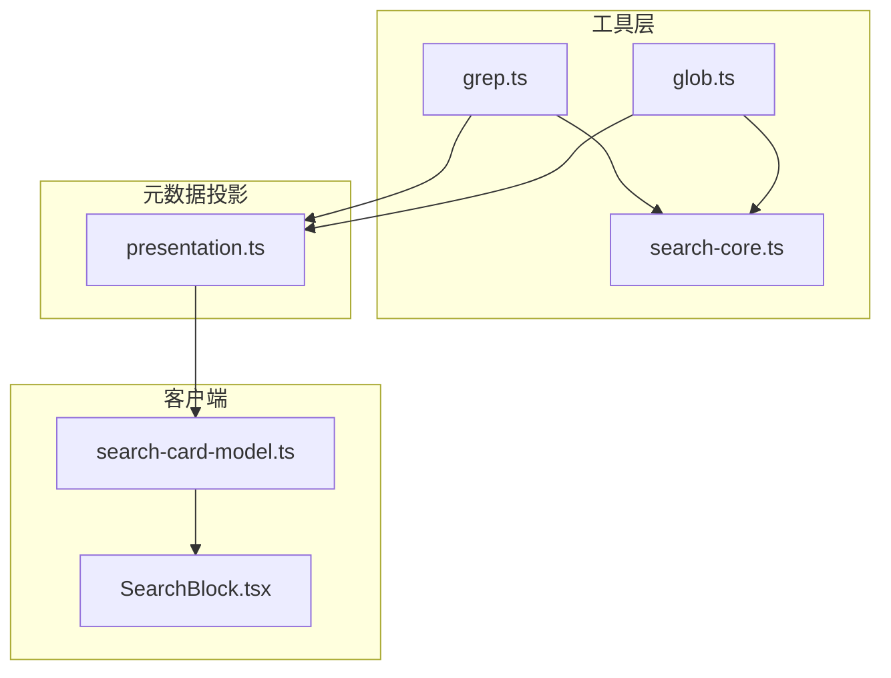
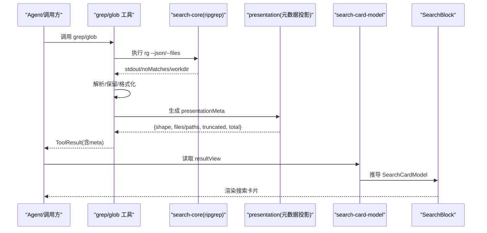
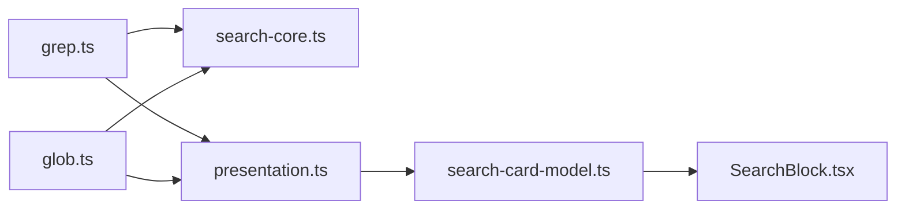

# 搜索卡片

<cite>
**本文引用的文件**
- [search-card-model.ts](file://packages/client/ui-tool/src/client/tool/models/search-card-model.ts)
- [SearchBlock.tsx](file://packages/client/ui-primitives/src/SearchBlock.tsx)
- [presentation.ts](file://packages/fs/tool-fs-search/src/presentation.ts)
- [glob.ts](file://packages/fs/tool-fs-search/src/glob.ts)
- [grep.ts](file://packages/fs/tool-fs-search/src/grep.ts)
- [search-core.ts](file://packages/fs/tool-fs-search/src/search-core.ts)
- [tools.spec.ts](file://packages/fs/tool-fs-search/tests/tools.spec.ts)
- [search-card.snapshot.ts](file://apps/web/tests/search-card.snapshot.ts)
</cite>

## 目录
1. [简介](#简介)
2. [项目结构](#项目结构)
3. [核心组件](#核心组件)
4. [架构总览](#架构总览)
5. [详细组件分析](#详细组件分析)
6. [依赖关系分析](#依赖关系分析)
7. [性能与优化](#性能与优化)
8. [故障排查](#故障排查)
9. [结论](#结论)
10. [附录](#附录)

## 简介
本文件面向“搜索结果呈现”的搜索卡片，说明其专门用途、数据格式（matches 与 paths）、截断与总量字段的作用、按文件分组与扁平路径列表的处理方式，以及 grep 与 glob 工具的集成示例。同时覆盖结果缓存、分页/采样机制、排序与过滤筛选等特性，帮助前端与后端共同实现一致、可恢复且高性能的搜索体验。

## 项目结构
搜索卡片由“工具层（grep/glob）— 元数据投影 — 客户端模型 — UI 渲染”四层组成：
- 工具层：执行 ripgrep，产出结构化结果与文本输出，并生成 presentationMeta。
- 元数据投影：将保留的结果页映射为 SearchMeta（包含 shape、files/paths、truncated、total）。
- 客户端模型：将 resultView 转换为 SearchCardModel，供两个渲染站点复用。
- UI 渲染：SearchBlock 以统一高度上限展示匹配或路径，提供复制、展开/收起等交互。

图表来源
- [grep.ts:275-365](file://packages/fs/tool-fs-search/src/grep.ts#L275-L365)
- [glob.ts:297-375](file://packages/fs/tool-fs-search/src/glob.ts#L297-L375)
- [search-core.ts:211-275](file://packages/fs/tool-fs-search/src/search-core.ts#L211-L275)
- [presentation.ts:120-206](file://packages/fs/tool-fs-search/src/presentation.ts#L120-L206)
- [search-card-model.ts:130-160](file://packages/client/ui-tool/src/client/tool/models/search-card-model.ts#L130-L160)
- [SearchBlock.tsx:173-278](file://packages/client/ui-primitives/src/SearchBlock.tsx#L173-L278)

章节来源
- [grep.ts:275-365](file://packages/fs/tool-fs-search/src/grep.ts#L275-L365)
- [glob.ts:297-375](file://packages/fs/tool-fs-search/src/glob.ts#L297-L375)
- [presentation.ts:120-206](file://packages/fs/tool-fs-search/src/presentation.ts#L120-L206)
- [search-card-model.ts:130-160](file://packages/client/ui-tool/src/client/tool/models/search-card-model.ts#L130-L160)
- [SearchBlock.tsx:173-278](file://packages/client/ui-primitives/src/SearchBlock.tsx#L173-L278)

## 核心组件
- 搜索卡片模型（search-card-model.ts）：从 resultView 推导 SearchCardModel，负责 matches 与 paths 两种形状的安全校验与转换，并在结果被截断时暴露 recovery 文本以便用户获取被省略的行。
- 搜索块 UI（SearchBlock.tsx）：统一渲染两类结果，支持高度上限折叠、复制、按文件组展开/收起、尾部补全文件头行等。
- 元数据投影（presentation.ts）：将保留的结果页映射为 SearchMeta，保证 text 与 card 对“保留了哪些结果”保持一致，并通过 meta 字节预算裁剪避免过大 payload。
- 工具实现（grep.ts / glob.ts）：封装 ripgrep 调用、参数构建、结果解析、内联保留与落盘恢复；提供 presentCall/presentResult 用于会话中的卡片呈现。
- 执行核心（search-core.ts）：统一的子进程执行、错误分类、原始输出预算、工作目录相对化、行预览裁剪、格式化结果落盘等。

章节来源
- [search-card-model.ts:1-161](file://packages/client/ui-tool/src/client/tool/models/search-card-model.ts#L1-L161)
- [SearchBlock.tsx:1-278](file://packages/client/ui-primitives/src/SearchBlock.tsx#L1-L278)
- [presentation.ts:1-206](file://packages/fs/tool-fs-search/src/presentation.ts#L1-L206)
- [grep.ts:1-366](file://packages/fs/tool-fs-search/src/grep.ts#L1-L366)
- [glob.ts:1-375](file://packages/fs/tool-fs-search/src/glob.ts#L1-L375)
- [search-core.ts:1-402](file://packages/fs/tool-fs-search/src/search-core.ts#L1-L402)

## 架构总览
搜索卡片的端到端流程如下：

图表来源
- [grep.ts:320-365](file://packages/fs/tool-fs-search/src/grep.ts#L320-L365)
- [glob.ts:342-375](file://packages/fs/tool-fs-search/src/glob.ts#L342-L375)
- [search-core.ts:211-275](file://packages/fs/tool-fs-search/src/search-core.ts#L211-L275)
- [presentation.ts:120-206](file://packages/fs/tool-fs-search/src/presentation.ts#L120-L206)
- [search-card-model.ts:130-160](file://packages/client/ui-tool/src/client/tool/models/search-card-model.ts#L130-L160)
- [SearchBlock.tsx:173-278](file://packages/client/ui-primitives/src/SearchBlock.tsx#L173-L278)

## 详细组件分析

### 数据格式：matches vs paths
- matches（grep）：按文件分组的匹配行，每个文件一组，组内为行号+行内容。适合“在文件中查找某模式”的场景。
- paths（glob）：扁平路径列表，按修改时间排序（或按顶层目录采样），适合“发现匹配路径”的场景。

两者都携带 truncated 与 total：
- truncated：是否对“内联结果”做了上限裁剪。
- total：搜索实际发现的总数（未裁剪前）。

UI 必须使用 truncated 与 total 组合显示“显示 X / 共 N …”，避免把截断结果误认为完整结果。

章节来源
- [presentation.ts:60-68](file://packages/fs/tool-fs-search/src/presentation.ts#L60-L68)
- [SearchBlock.tsx:40-55](file://packages/client/ui-primitives/src/SearchBlock.tsx#L40-L55)
- [search-card-model.ts:135-159](file://packages/client/ui-tool/src/client/tool/models/search-card-model.ts#L135-L159)

### 截断与恢复：truncated 与 total 的作用
- 当 truncated=true 时，卡片仅展示保留的部分；banner 摘要会显示“显示 X / 共 N …”。
- 当结果被截断时，原始 tool/result 文本中包含“完整结果存储位置”的恢复提示；search-card-model 会将其提取为 recovery，确保即使卡片替换了原始文本，用户仍可访问被省略的内容。
- 若无法保存完整结果（无 spill 后端或写入失败），会在 footer 中明确提示“无法保存完整结果，请缩小范围重试”。

章节来源
- [search-card-model.ts:16-22](file://packages/client/ui-tool/src/client/tool/models/search-card-model.ts#L16-L22)
- [search-card-model.ts:136-141](file://packages/client/ui-tool/src/client/tool/models/search-card-model.ts#L136-L141)
- [glob.ts:214-229](file://packages/fs/tool-fs-search/src/glob.ts#L214-L229)
- [grep.ts:216-226](file://packages/fs/tool-fs-search/src/grep.ts#L216-L226)
- [search-core.ts:371-401](file://packages/fs/tool-fs-search/src/search-core.ts#L371-L401)

### 按文件分组与扁平路径处理
- matches：通过 groupMatchesByFile 将扁平匹配按文件分组，保持首次出现顺序；UI 中以“文件头 + 匹配行”的形式渲染，支持展开/收起。
- paths：直接作为扁平数组渲染；当超过内联上限时，可选择“取修改时间头部”或“跨顶层目录采样”，以保证分布更均匀。

章节来源
- [presentation.ts:80-89](file://packages/fs/tool-fs-search/src/presentation.ts#L80-L89)
- [glob.ts:171-203](file://packages/fs/tool-fs-search/src/glob.ts#L171-L203)
- [SearchBlock.tsx:139-151](file://packages/client/ui-primitives/src/SearchBlock.tsx#L139-L151)

### 高度上限与展开/收起
- SearchBlock 默认最大行数（DEFAULT_SEARCH_MAX_LINES），超出后折叠中间部分，顶部与尾部可见；点击“展开其余 N 行”可查看全部。
- 对于尾部片段，若起始于某个文件的匹配段，会自动补齐该文件头，保证归属清晰。

章节来源
- [SearchBlock.tsx:18-23](file://packages/client/ui-primitives/src/SearchBlock.tsx#L18-L23)
- [SearchBlock.tsx:196-214](file://packages/client/ui-primitives/src/SearchBlock.tsx#L196-L214)
- [SearchBlock.tsx:256-266](file://packages/client/ui-primitives/src/SearchBlock.tsx#L256-L266)

### 复制行为
- 复制按钮始终复制“完整结构化结果”（无论当前是否展开/折叠），保证剪贴板内容与卡片显示解耦。

章节来源
- [SearchBlock.tsx:86-98](file://packages/client/ui-primitives/src/SearchBlock.tsx#L86-L98)

### grep 与 glob 集成示例
- grep：
  - 参数：pattern（正则）、path（可选目标）、include（单个正向 glob 过滤器）。
  - 执行：rg --json，解析 match 记录，按文件分组，应用每行预览预算与匹配数上限。
  - 输出：文本输出包含“Found N of M matches”与分组体；presentationMeta 提供结构化卡片数据。
  - 恢复：超限时尝试保存完整结果为 grep-results.txt，并提供检索提示。
- glob：
  - 参数：pattern（glob 模式）、path（可选搜索根）。
  - 执行：rg --files，按修改时间排序；超限可选择“头部”或“跨顶层目录采样”。
  - 输出：文本输出列出路径与统计信息；presentationMeta 提供扁平路径卡片数据。
  - 恢复：超限时尝试保存完整结果为 glob-results.txt，并提供检索提示。

章节来源
- [grep.ts:90-117](file://packages/fs/tool-fs-search/src/grep.ts#L90-L117)
- [grep.ts:170-178](file://packages/fs/tool-fs-search/src/grep.ts#L170-L178)
- [grep.ts:216-226](file://packages/fs/tool-fs-search/src/grep.ts#L216-L226)
- [grep.ts:320-365](file://packages/fs/tool-fs-search/src/grep.ts#L320-L365)
- [glob.ts:72-108](file://packages/fs/tool-fs-search/src/glob.ts#L72-L108)
- [glob.ts:214-241](file://packages/fs/tool-fs-search/src/glob.ts#L214-L241)
- [glob.ts:342-375](file://packages/fs/tool-fs-search/src/glob.ts#L342-L375)

### 结果缓存与分页/采样机制
- 内联结果保留：
  - grep：retainGrepMatches 保留前 N 个匹配，并对每行进行字节级预览裁剪。
  - glob：retainGlobPaths 保留前 N 条路径；当启用采样时，sampleAcrossTopLevel 按顶层目录轮询采样，保证分布性。
- 元数据字节预算：
  - capMetaBytes 在序列化 meta 超过预算时，丢弃尾部文件或路径，仍保留 total 与 truncated，确保 UI 不误导。
- 分页/采样：
  - 并非传统“下一页”分页，而是“内联上限 + 采样策略 + 完整结果落盘恢复”的组合。用户可通过缩小范围或查看恢复文件获取更多内容。

章节来源
- [search-core.ts:320-352](file://packages/fs/tool-fs-search/src/search-core.ts#L320-L352)
- [presentation.ts:96-117](file://packages/fs/tool-fs-search/src/presentation.ts#L96-L117)
- [glob.ts:171-203](file://packages/fs/tool-fs-search/src/glob.ts#L171-L203)
- [glob.ts:255-259](file://packages/fs/tool-fs-search/src/glob.ts#L255-L259)

### 排序与过滤
- 排序：
  - glob：默认按修改时间排序；采样模式下按顶层目录轮询，但组内仍保持原序。
- 过滤：
  - grep：支持 include 单个正向 glob 过滤器；不支持否定或逗号分隔列表。
  - glob：排除 VCS 元数据目录（如 .git/.svn 等），避免噪声。

章节来源
- [glob.ts:29-38](file://packages/fs/tool-fs-search/src/glob.ts#L29-L38)
- [glob.ts:90-108](file://packages/fs/tool-fs-search/src/glob.ts#L90-L108)
- [grep.ts:63-79](file://packages/fs/tool-fs-search/src/grep.ts#L63-L79)
- [grep.ts:112-117](file://packages/fs/tool-fs-search/src/grep.ts#L112-L117)

### 安全与健壮性
- 客户端侧防御：
  - search-card-model 对 files/paths 做严格类型检查，防止 wire 数据异常导致崩溃。
  - 未知 shape 或缺失字段回退到通用卡片路径。
- 工具侧错误分类：
  - 非法模式、启动失败、信号中断、原始输出溢出等均有稳定错误码，便于上层分支处理。

章节来源
- [search-card-model.ts:77-96](file://packages/client/ui-tool/src/client/tool/models/search-card-model.ts#L77-L96)
- [search-card-model.ts:141-159](file://packages/client/ui-tool/src/client/tool/models/search-card-model.ts#L141-L159)
- [search-core.ts:66-96](file://packages/fs/tool-fs-search/src/search-core.ts#L66-L96)
- [search-core.ts:118-154](file://packages/fs/tool-fs-search/src/search-core.ts#L118-L154)

## 依赖关系分析
- 工具层依赖 search-core 完成子进程执行、错误分类、路径相对化、行预览与落盘。
- 元数据投影依赖 retain 结果与预算控制，生成 SearchMeta。
- 客户端模型依赖 resultView 与 content 文本，推导 SearchCardModel。
- UI 依赖 SearchBlockProps，渲染统一卡片。

图表来源
- [grep.ts:320-365](file://packages/fs/tool-fs-search/src/grep.ts#L320-L365)
- [glob.ts:342-375](file://packages/fs/tool-fs-search/src/glob.ts#L342-L375)
- [presentation.ts:120-206](file://packages/fs/tool-fs-search/src/presentation.ts#L120-L206)
- [search-card-model.ts:130-160](file://packages/client/ui-tool/src/client/tool/models/search-card-model.ts#L130-L160)
- [SearchBlock.tsx:173-278](file://packages/client/ui-primitives/src/SearchBlock.tsx#L173-L278)

章节来源
- [grep.ts:320-365](file://packages/fs/tool-fs-search/src/grep.ts#L320-L365)
- [glob.ts:342-375](file://packages/fs/tool-fs-search/src/glob.ts#L342-L375)
- [presentation.ts:120-206](file://packages/fs/tool-fs-search/src/presentation.ts#L120-L206)
- [search-card-model.ts:130-160](file://packages/client/ui-tool/src/client/tool/models/search-card-model.ts#L130-L160)
- [SearchBlock.tsx:173-278](file://packages/client/ui-primitives/src/SearchBlock.tsx#L173-L278)

## 性能与优化
- 原始输出预算：限制 rg 完整 stdout 大小，避免内存膨胀；超限抛出明确错误。
- 行预览预算：对匹配行进行 UTF-8 安全的字节级裁剪，减少传输与渲染开销。
- 元数据预算：对 JSON meta 进行字节级裁剪，避免会话日志与请求体积过大。
- 采样策略：glob 超限可按顶层目录轮询采样，提升大树的浏览体验。
- 高度上限：SearchBlock 默认限制渲染行数，减少 DOM 压力。
- 子进程超时与优雅终止：结合工具超时与信号中止，避免长时间占用资源。

章节来源
- [search-core.ts:31-64](file://packages/fs/tool-fs-search/src/search-core.ts#L31-L64)
- [search-core.ts:131-154](file://packages/fs/tool-fs-search/src/search-core.ts#L131-L154)
- [search-core.ts:304-352](file://packages/fs/tool-fs-search/src/search-core.ts#L304-L352)
- [presentation.ts:96-117](file://packages/fs/tool-fs-search/src/presentation.ts#L96-L117)
- [glob.ts:171-203](file://packages/fs/tool-fs-search/src/glob.ts#L171-L203)
- [SearchBlock.tsx:18-23](file://packages/client/ui-primitives/src/SearchBlock.tsx#L18-L23)

## 故障排查
- 常见错误与定位：
  - 模式无效：SEARCH_INVALID_PATTERN（rg 拒绝正则/glob）。
  - 启动失败/信号中断：SEARCH_FAILED / SEARCH_ABORTED。
  - 原始输出溢出：SEARCH_RAW_OUTPUT_OVERFLOW（stdout 超过预算或被截断）。
- 现象与对策：
  - 卡片显示“显示 X / 共 N …”：表示结果被截断，应查看 recovery 提示或缩小查询范围。
  - 无法保存完整结果：footer 提示无法保存，需检查 spill 后端或调整范围。
  - 客户端崩溃：检查 files/paths 结构是否符合预期，确保 wire 数据版本兼容。

章节来源
- [search-core.ts:66-96](file://packages/fs/tool-fs-search/src/search-core.ts#L66-L96)
- [search-core.ts:118-154](file://packages/fs/tool-fs-search/src/search-core.ts#L118-L154)
- [search-core.ts:371-401](file://packages/fs/tool-fs-search/src/search-core.ts#L371-L401)
- [tools.spec.ts:1049-1055](file://packages/fs/tool-fs-search/tests/tools.spec.ts#L1049-L1055)

## 结论
搜索卡片通过“工具层 + 元数据投影 + 客户端模型 + UI 渲染”的分层设计，实现了：
- 明确区分 matches 与 paths 两种数据结构与使用场景。
- 用 truncated 与 total 防止 UI 将截断结果误认为完整结果。
- 按文件分组与扁平路径的统一渲染与交互。
- 通过采样与预算控制保障性能，并以落盘恢复保证可追溯性。
- 提供稳健的错误分类与防御性校验，提升整体可靠性。

## 附录
- 端到端快照测试验证了 assembled 应用中搜索卡片的渲染一致性，包括摘要、文件头、匹配行、展开控件与恢复提示。

章节来源
- [search-card.snapshot.ts:1-81](file://apps/web/tests/search-card.snapshot.ts#L1-L81)