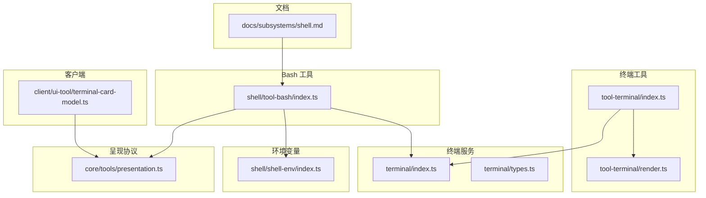
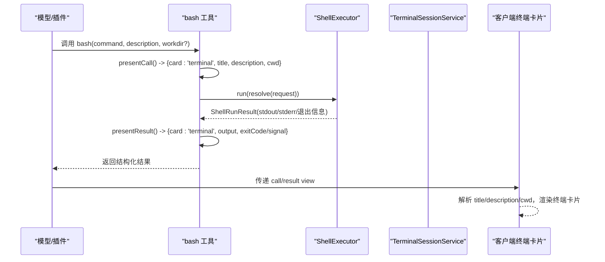
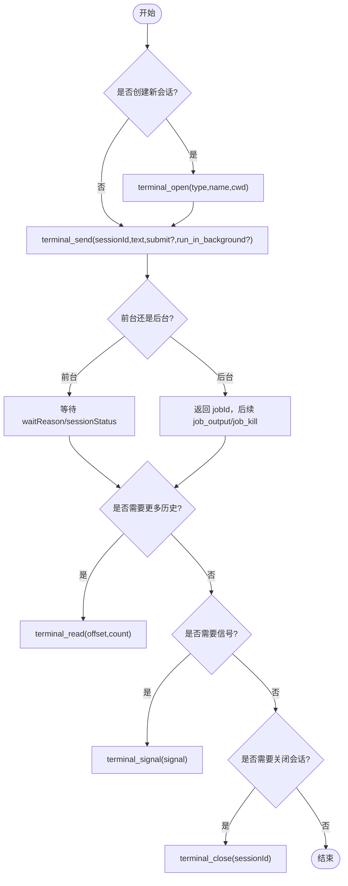
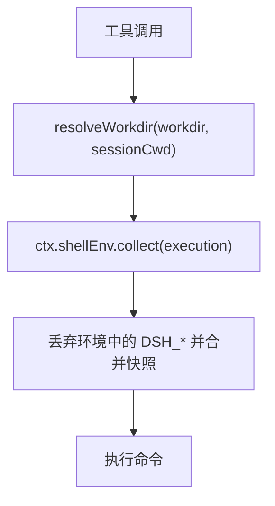
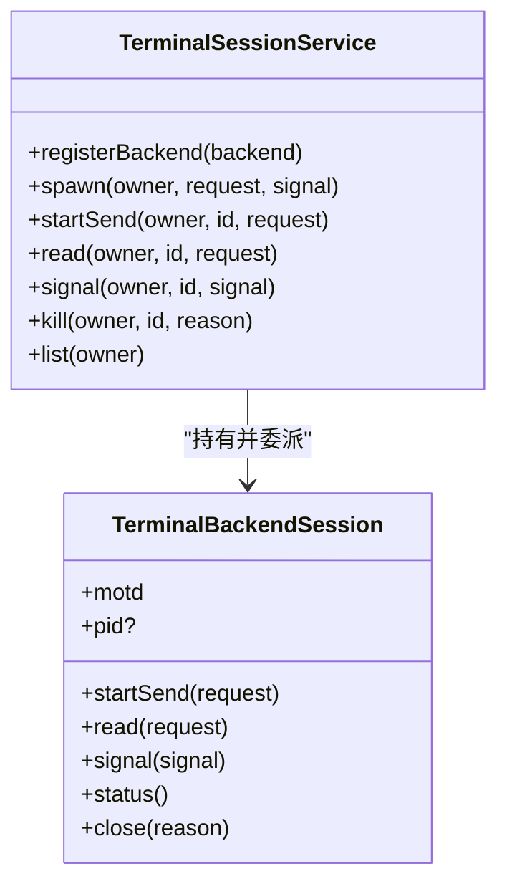
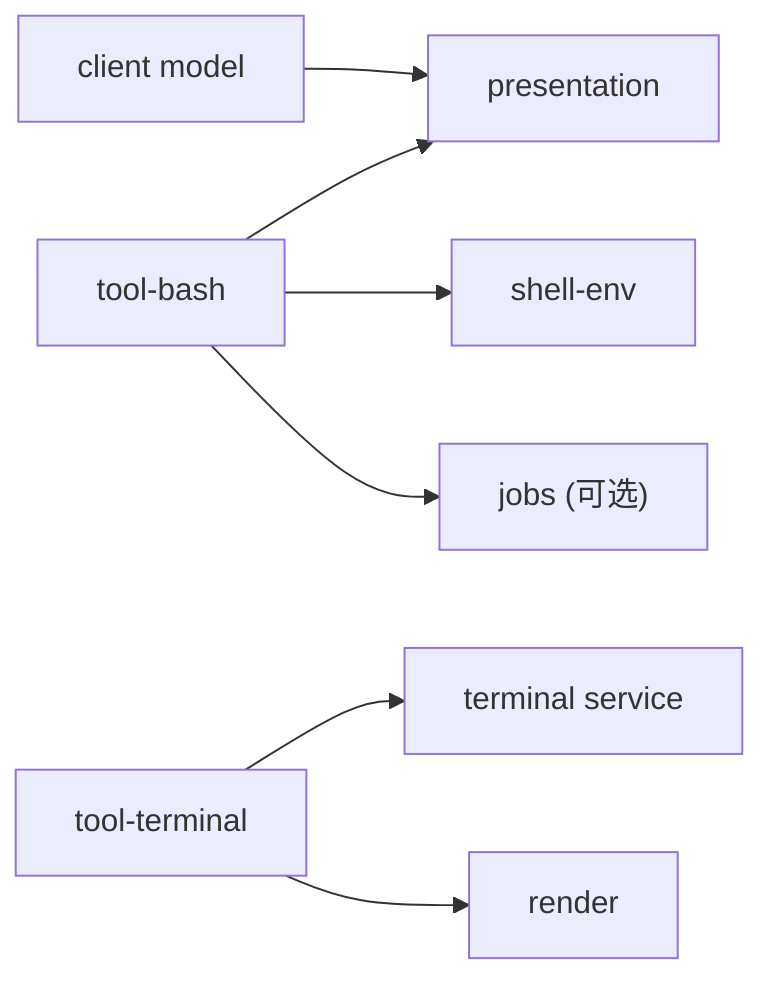

# 终端卡片

<cite>
**本文引用的文件**
- [packages/terminal/terminal/src/index.ts](file://packages/terminal/terminal/src/index.ts)
- [packages/terminal/terminal/src/types.ts](file://packages/terminal/terminal/src/types.ts)
- [packages/terminal/tool-terminal/src/index.ts](file://packages/terminal/tool-terminal/src/index.ts)
- [packages/terminal/tool-terminal/src/render.ts](file://packages/terminal/tool-terminal/src/render.ts)
- [packages/shell/tool-bash/src/index.ts](file://packages/shell/tool-bash/src/index.ts)
- [packages/core/tools/src/presentation.ts](file://packages/core/tools/src/presentation.ts)
- [packages/client/ui-tool/src/client/tool/models/terminal-card-model.ts](file://packages/client/ui-tool/src/client/tool/models/terminal-card-model.ts)
- [packages/shell/shell-env/src/index.ts](file://packages/shell/shell-env/src/index.ts)
- [docs/subsystems/shell.md](file://docs/subsystems/shell.md)
</cite>

## 目录
1. [简介](#简介)
2. [项目结构](#项目结构)
3. [核心组件](#核心组件)
4. [架构总览](#架构总览)
5. [详细组件分析](#详细组件分析)
6. [依赖关系分析](#依赖关系分析)
7. [性能考虑](#性能考虑)
8. [故障排查指南](#故障排查指南)
9. [结论](#结论)
10. [附录](#附录)

## 简介
本文件面向“终端卡片”的完整实现与使用，聚焦以下目标：
- 说明 terminal 卡片的专门用途：用于命令执行与交互式终端会话。
- 文档化 title、description、cwd 等字段的配置方法与解析规则。
- 解释终端输出的格式化处理与交互能力（发送输入、读取滚动输出、信号控制、后台任务）。
- 说明工作目录设置与环境变量继承机制（含 DSH_* 管理）。
- 提供 bash 工具集成示例与最佳实践。
- 详述终端会话管理与状态同步的实现细节。
- 说明长输出截断、错误处理、实时输出更新等特性。

## 项目结构
围绕终端卡片的相关代码分布在多个包中：
- 持久 PTY 服务与类型定义：packages/terminal/terminal
- 模型侧终端工具集（open/send/read/signal/close/list）：packages/terminal/tool-terminal
- Bash 工具与终端卡片呈现：packages/shell/tool-bash
- 通用呈现协议（TerminalCallView/TerminalResultView）：packages/core/tools
- 客户端终端卡片模型与 cwd 解析：packages/client/ui-tool
- Shell 环境变量注册表（DSH_*）：packages/shell/shell-env
- 子系统文档（Bash Executor）：docs/subsystems/shell.md

**图表来源**
- [packages/terminal/terminal/src/index.ts:105-477](file://packages/terminal/terminal/src/index.ts#L105-L477)
- [packages/terminal/terminal/src/types.ts:43-177](file://packages/terminal/terminal/src/types.ts#L43-L177)
- [packages/terminal/tool-terminal/src/index.ts:146-399](file://packages/terminal/tool-terminal/src/index.ts#L146-L399)
- [packages/terminal/tool-terminal/src/render.ts:87-177](file://packages/terminal/tool-terminal/src/render.ts#L87-L177)
- [packages/shell/tool-bash/src/index.ts:95-136](file://packages/shell/tool-bash/src/index.ts#L95-L136)
- [packages/core/tools/src/presentation.ts:77-176](file://packages/core/tools/src/presentation.ts#L77-L176)
- [packages/client/ui-tool/src/client/tool/models/terminal-card-model.ts:178-208](file://packages/client/ui-tool/src/client/tool/models/terminal-card-model.ts#L178-L208)
- [packages/shell/shell-env/src/index.ts:147-192](file://packages/shell/shell-env/src/index.ts#L147-L192)
- [docs/subsystems/shell.md:9-16](file://docs/subsystems/shell.md#L9-L16)

**章节来源**
- [packages/terminal/terminal/src/index.ts:105-477](file://packages/terminal/terminal/src/index.ts#L105-L477)
- [packages/terminal/terminal/src/types.ts:43-177](file://packages/terminal/terminal/src/types.ts#L43-L177)
- [packages/terminal/tool-terminal/src/index.ts:146-399](file://packages/terminal/tool-terminal/src/index.ts#L146-L399)
- [packages/terminal/tool-terminal/src/render.ts:87-177](file://packages/terminal/tool-terminal/src/render.ts#L87-L177)
- [packages/shell/tool-bash/src/index.ts:95-136](file://packages/shell/tool-bash/src/index.ts#L95-L136)
- [packages/core/tools/src/presentation.ts:77-176](file://packages/core/tools/src/presentation.ts#L77-L176)
- [packages/client/ui-tool/src/client/tool/models/terminal-card-model.ts:178-208](file://packages/client/ui-tool/src/client/tool/models/terminal-card-model.ts#L178-L208)
- [packages/shell/shell-env/src/index.ts:147-192](file://packages/shell/shell-env/src/index.ts#L147-L192)
- [docs/subsystems/shell.md:9-16](file://docs/subsystems/shell.md#L9-L16)

## 核心组件
- 持久 PTY 会话服务（TerminalSessionService）：负责后端注册、会话生命周期、授权、清理与快照。
- 终端工具集（tool-terminal）：暴露 terminal_open/send/read/signal/close/list 等工具，支持前台等待与后台任务。
- Bash 工具（tool-bash）：将一次 shell 调用呈现为终端卡片，并处理工作目录、超时、沙箱、环境变量等。
- 呈现协议（presentation）：定义 TerminalCallView/TerminalResultView，统一 UI 渲染契约。
- 客户端终端卡片模型：解析 call/result view，规范化 cwd、标题与输出展示。
- Shell 环境变量注册表（shell-env）：集中管理 DSH_* 变量，按执行上下文收集注入。

**章节来源**
- [packages/terminal/terminal/src/index.ts:105-477](file://packages/terminal/terminal/src/index.ts#L105-L477)
- [packages/terminal/tool-terminal/src/index.ts:146-399](file://packages/terminal/tool-terminal/src/index.ts#L146-L399)
- [packages/shell/tool-bash/src/index.ts:95-136](file://packages/shell/tool-bash/src/index.ts#L95-L136)
- [packages/core/tools/src/presentation.ts:77-176](file://packages/core/tools/src/presentation.ts#L77-L176)
- [packages/client/ui-tool/src/client/tool/models/terminal-card-model.ts:178-208](file://packages/client/ui-tool/src/client/tool/models/terminal-card-model.ts#L178-L208)
- [packages/shell/shell-env/src/index.ts:147-192](file://packages/shell/shell-env/src/index.ts#L147-L192)

## 架构总览
终端卡片贯穿“工具声明—执行—结果呈现—UI 渲染”的全链路：
- Bash 工具在调用时以 TerminalCallView 声明“这是一次终端执行”，携带 title/description/cwd。
- 执行后，presentResult 将结果转为 TerminalResultView，包含 output、exitCode/signal。
- 客户端根据 call/result view 构建终端卡片模型，规范化 cwd、标题与输出。
- 对于需要持久状态的场景，通过 tool-terminal 的 terminal_* 工具操作 PTY 会话。

**图表来源**
- [packages/shell/tool-bash/src/index.ts:95-136](file://packages/shell/tool-bash/src/index.ts#L95-L136)
- [packages/core/tools/src/presentation.ts:77-176](file://packages/core/tools/src/presentation.ts#L77-L176)
- [packages/client/ui-tool/src/client/tool/models/terminal-card-model.ts:178-208](file://packages/client/ui-tool/src/client/tool/models/terminal-card-model.ts#L178-L208)

## 详细组件分析

### 终端卡片字段与呈现契约
- TerminalCallView（调用时）
  - card: 'terminal'
  - title: 命令文本，作为卡片标题/首行
  - description: 一行摘要，显示在卡片上方
  - cwd: 工作目录；绝对路径原样使用，相对路径由 UI 桥接基于会话工作区解析；省略则默认使用会话工作区
- TerminalResultView（完成后）
  - card: 'terminal'
  - title?: 可替换标题（若提供则覆盖待处理标题）
  - output?: 捕获的输出（stdout+stderr 的组合）
  - exitCode?: 进程正常退出的退出码
  - signal?: 终止信号名（与 exitCode 互斥）

这些字段由 Bash 工具在 presentCall/presentResult 中填充，并由客户端模型进行规范化与展示。

**章节来源**
- [packages/core/tools/src/presentation.ts:77-176](file://packages/core/tools/src/presentation.ts#L77-L176)
- [packages/shell/tool-bash/src/index.ts:95-136](file://packages/shell/tool-bash/src/index.ts#L95-L136)
- [packages/client/ui-tool/src/client/tool/models/terminal-card-model.ts:178-208](file://packages/client/ui-tool/src/client/tool/models/terminal-card-model.ts#L178-L208)

### 工作目录（cwd）解析与显示
- Bash 工具在 presentCall 中将 workdir 透传为 cwd；未提供时使用会话工作区。
- 客户端模型对 cwd 进行规范化：
  - 绝对路径直接使用
  - 相对路径相对于会话工作区拼接并规范化（如 ..、.、UNC 路径等）
  - 无会话工作区时，相对路径保持原样，省略则不显示 cwd
- 这确保卡片显示的目录与实际运行目录一致，避免误导用户。

**章节来源**
- [packages/shell/tool-bash/src/index.ts:138-156](file://packages/shell/tool-bash/src/index.ts#L138-L156)
- [packages/client/ui-tool/src/client/tool/models/terminal-card-model.ts:178-208](file://packages/client/ui-tool/src/client/tool/models/terminal-card-model.ts#L178-L208)

### 终端输出格式化与长输出处理
- Bash 工具将 stdout/stderr 合并为输出文本，并通过 renderResult 生成最终文本；非零退出或信号会附加退出标记。
- 客户端终端卡片对输出进行：
  - 行级折叠：默认显示头部若干行 + 尾部若干行，中间隐藏部分可通过展开查看
  - ANSI 颜色还原：保留 SGR 颜色序列，按列状态回放，避免错位与 O(n^2) 膨胀
  - 复制行为：复制原始输出文本，不包含提示行与状态徽章
- 超长输出会被截断，并在结果中指示 truncated；必要时提供 spillPath 指向完整输出文件。

**章节来源**
- [packages/shell/tool-bash/src/index.ts:158-182](file://packages/shell/tool-bash/src/index.ts#L158-L182)
- [.agents/notes/implemented/feature/2026-07-28-web-terminal-card.md:17-24](file://.agents/notes/implemented/feature/2026-07-28-web-terminal-card.md#L17-L24)

### 交互功能：发送、读取、信号、后台任务
- 前台等待：terminal_send 默认提交回车并等待 prompt、stdin 就绪、静默/超时或会话退出；waitReason 明确返回原因。
- 后台任务：terminal_send 支持 run_in_background，立即返回 jobId，通过 job_output/job_kill 收集输出与停止。
- 读取历史：terminal_read 分页读取保留的滚动输出，支持 offset/count。
- 信号控制：terminal_signal 向当前前台进程组发送允许的信号（SIGINT/SIGTERM/SIGKILL/SIGTSTP/SIGHUP），其中 SIGKILL 针对 shell 被拒绝，应改用 terminal_close。
- 会话管理：terminal_open 创建持久会话（type/name/cwd），terminal_list 列出当前 Agent 拥有的会话，terminal_close 关闭并等待清理完成。

**图表来源**
- [packages/terminal/tool-terminal/src/index.ts:162-399](file://packages/terminal/tool-terminal/src/index.ts#L162-L399)
- [packages/terminal/terminal/src/types.ts:63-131](file://packages/terminal/terminal/src/types.ts#L63-L131)

**章节来源**
- [packages/terminal/tool-terminal/src/index.ts:162-399](file://packages/terminal/tool-terminal/src/index.ts#L162-L399)
- [packages/terminal/terminal/src/types.ts:63-131](file://packages/terminal/terminal/src/types.ts#L63-L131)

### 工作目录设置与环境变量继承机制
- Bash 工具的工作目录：
  - 优先使用显式 workdir；否则使用会话工作区（policy workspace root 或 session header cwd）
  - 相对路径相对于会话工作区解析，保证一致性
- 环境变量继承：
  - 每次 shell 调用前，executor 会丢弃环境中的 DSH_* 变量，再合并当前快照
  - 快照由 shellEnv.collect(execution) 生成，包含内置键与插件贡献的 DSH_* 变量
  - 插件可通过 register(contributor) 声明并动态解析新的 DSH_* 变量，作用域随 fiber 释放

**图表来源**
- [packages/shell/tool-bash/src/index.ts:138-156](file://packages/shell/tool-bash/src/index.ts#L138-L156)
- [packages/shell/shell-env/src/index.ts:147-192](file://packages/shell/shell-env/src/index.ts#L147-L192)
- [docs/subsystems/shell.md:9-16](file://docs/subsystems/shell.md#L9-L16)

**章节来源**
- [packages/shell/tool-bash/src/index.ts:138-156](file://packages/shell/tool-bash/src/index.ts#L138-L156)
- [packages/shell/shell-env/src/index.ts:147-192](file://packages/shell/shell-env/src/index.ts#L147-L192)
- [docs/subsystems/shell.md:9-16](file://docs/subsystems/shell.md#L9-L16)

### 终端会话管理与状态同步
- 会话身份与所有权：
  - TerminalSessionId 由服务签发，名称可选且仅对拥有者可见
  - 所有操作需校验 exact owner，防止跨 Agent 访问
- 生命周期：
  - spawn：创建并发布会话；失败时清理资源，可能抛出 TerminalBackendCleanupError
  - startSend：每会话仅允许一个活动 send；done 决议后释放
  - read：分页读取保留滚动输出
  - signal：向已验证的前台进程组发送信号
  - kill：关闭会话并等待清理完成；幂等，重复关闭返回 false
  - list：列出当前 Agent 的所有会话快照
- 状态同步：
  - status() 返回顶层 PTY 进程状态（running/exited）
  - waitReason 区分 stdin_read/inferred_idle/timeout/session_exit，不等同于子进程退出
  - 服务在 dispose 时中止所有挂起 spawn 并关闭所有会话，聚合失败

**图表来源**
- [packages/terminal/terminal/src/index.ts:105-477](file://packages/terminal/terminal/src/index.ts#L105-L477)
- [packages/terminal/terminal/src/types.ts:147-171](file://packages/terminal/terminal/src/types.ts#L147-L171)

**章节来源**
- [packages/terminal/terminal/src/index.ts:105-477](file://packages/terminal/terminal/src/index.ts#L105-L477)
- [packages/terminal/terminal/src/types.ts:28-41](file://packages/terminal/terminal/src/types.ts#L28-L41)

### Bash 工具集成示例与最佳实践
- 基本用法：
  - 提供 command 与 description；如需指定目录，传入 workdir
  - 前台执行：等待完成并返回 stdout/stderr 与退出信息
  - 后台执行：设置 run_in_background=true，返回 jobId，使用 job_output/job_kill 管理
- 安全与沙箱：
  - 若命令被沙箱拒绝，可在同一轮重试并附带 sandbox_permissions 与 justification，经审批后执行
  - 避免猜测权限，仅在真实拒绝后申请更宽模式
- 环境变量：
  - 使用 $DSH_* 获取 Harness 提供的执行事实（如会话 ID、JSONL 路径等）
- 输出处理：
  - 检查 [exit code: N] 或 [killed by signal: X] 标记
  - 长输出被截断时可查看 spillPath 获取完整内容

**章节来源**
- [packages/shell/tool-bash/src/index.ts:70-93](file://packages/shell/tool-bash/src/index.ts#L70-L93)
- [packages/shell/tool-bash/src/index.ts:235-240](file://packages/shell/tool-bash/src/index.ts#L235-L240)
- [docs/subsystems/shell.md:9-16](file://docs/subsystems/shell.md#L9-L16)

## 依赖关系分析
- Bash 工具依赖：
  - presentation 协议以声明终端卡片意图
  - shellEnv 提供 DSH_* 环境变量快照
  - 可选 jobs 用于后台任务
- 终端工具依赖：
  - TerminalSessionService 提供持久 PTY 会话
  - render 模块负责结果文本裁剪与格式化
- 客户端依赖：
  - 解析 call/result view，规范化 cwd、标题与输出

**图表来源**
- [packages/shell/tool-bash/src/index.ts:30-32](file://packages/shell/tool-bash/src/index.ts#L30-L32)
- [packages/terminal/tool-terminal/src/index.ts:24-27](file://packages/terminal/tool-terminal/src/index.ts#L24-L27)
- [packages/core/tools/src/presentation.ts:77-176](file://packages/core/tools/src/presentation.ts#L77-L176)

**章节来源**
- [packages/shell/tool-bash/src/index.ts:30-32](file://packages/shell/tool-bash/src/index.ts#L30-L32)
- [packages/terminal/tool-terminal/src/index.ts:24-27](file://packages/terminal/tool-terminal/src/index.ts#L24-L27)
- [packages/core/tools/src/presentation.ts:77-176](file://packages/core/tools/src/presentation.ts#L77-L176)

## 性能考虑
- 输出裁剪：
  - 终端工具结果有 maxResultBytes 上限，超出时在末尾追加截断标记
  - 长输出采用 head/tail 折叠，减少 UI 渲染压力
- ANSI 渲染：
  - 按列状态回放 SGR，避免重复序列导致 O(n^2) 字符膨胀
- 会话清理：
  - 服务 dispose 时批量中止挂起 spawn 并关闭会话，聚合失败但不阻塞整体清理流程

[本节为通用指导，无需特定文件引用]

## 故障排查指南
- 常见错误码与异常：
  - DUPLICATE_BACKEND/DUPLICATE_NAME：重复注册后端或会话名
  - NO_BACKEND/NO_SESSION：未注册后端或未知会话
  - FOREIGN_SESSION：尝试访问非自身 Agent 的会话
  - SEND_ACTIVE：会话已有活动 send
  - SERVICE_DISPOSING：服务正在销毁
- 启动失败与清理：
  - 后端启动失败时可能抛出 TerminalBackendCleanupError，需同时关注 spawnError 与 cleanupError
- 后台任务与取消：
  - 后台 send 通过 jobs.cancel 触发 operation.cancel()，done 状态为 killed
- 输出丢失：
  - 当 truncated=true 时，查看 spillPath 获取完整输出

**章节来源**
- [packages/terminal/terminal/src/index.ts:54-71](file://packages/terminal/terminal/src/index.ts#L54-L71)
- [packages/terminal/terminal/src/index.ts:154-224](file://packages/terminal/terminal/src/index.ts#L154-L224)
- [packages/terminal/terminal/src/types.ts:13-26](file://packages/terminal/terminal/src/types.ts#L13-L26)
- [packages/terminal/tool-terminal/src/index.ts:246-281](file://packages/terminal/tool-terminal/src/index.ts#L246-L281)

## 结论
终端卡片通过统一的呈现协议将“命令执行”与“交互式终端”无缝融入 UI：
- Bash 工具将单次命令执行呈现为终端卡片，title/description/cwd 清晰表达意图与上下文
- 持久 PTY 会话提供跨调用状态与交互能力，适合 REPL、调试、长期任务
- 环境变量与沙箱策略保障执行安全与可观测性
- 输出格式化与长输出处理提升可读性与性能
- 完善的错误处理与会话清理确保系统健壮性

[本节为总结，无需特定文件引用]

## 附录
- 术语
  - PTY：伪终端，提供进程间双向 I/O 通道
  - MOTD：会话初始输出，常用于提示或版本信息
  - DSH_*：Harness 管理的执行期环境变量命名空间
- 参考
  - Bash 执行器文档：docs/subsystems/shell.md
  - 终端子系统文档：docs/subsystems/terminal.md（英文版）

[本节为补充信息，无需特定文件引用]