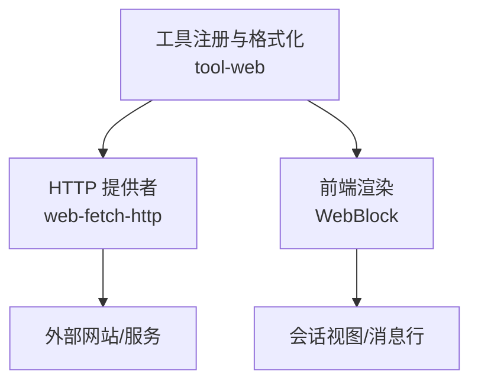
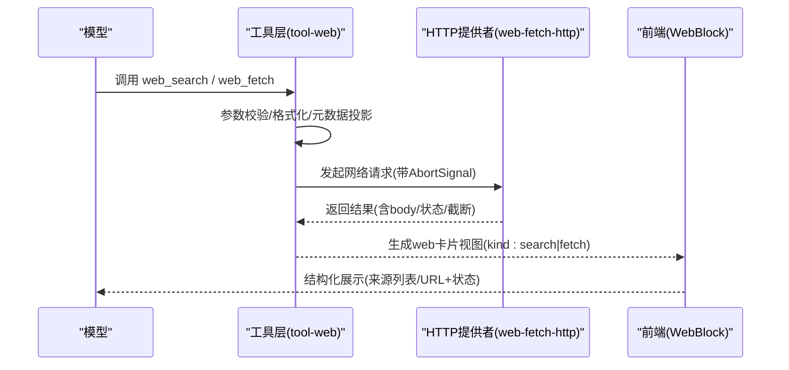
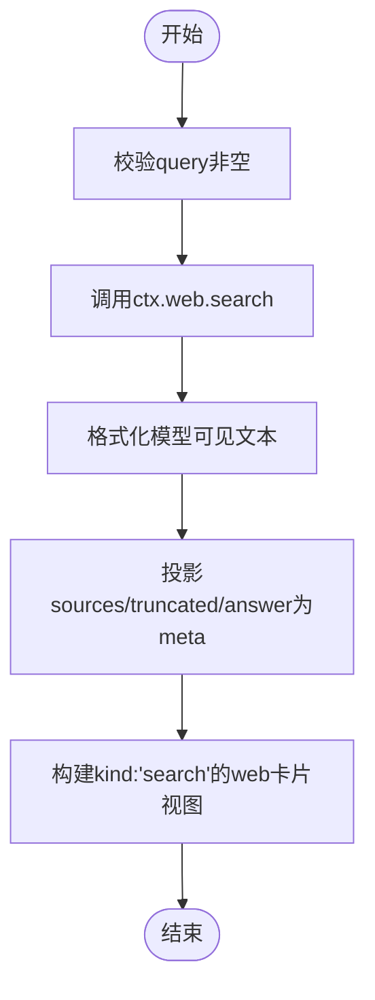
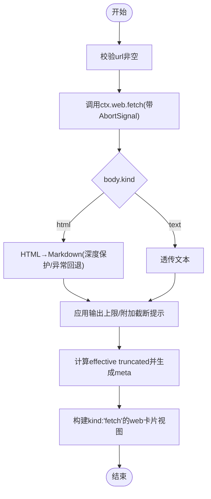
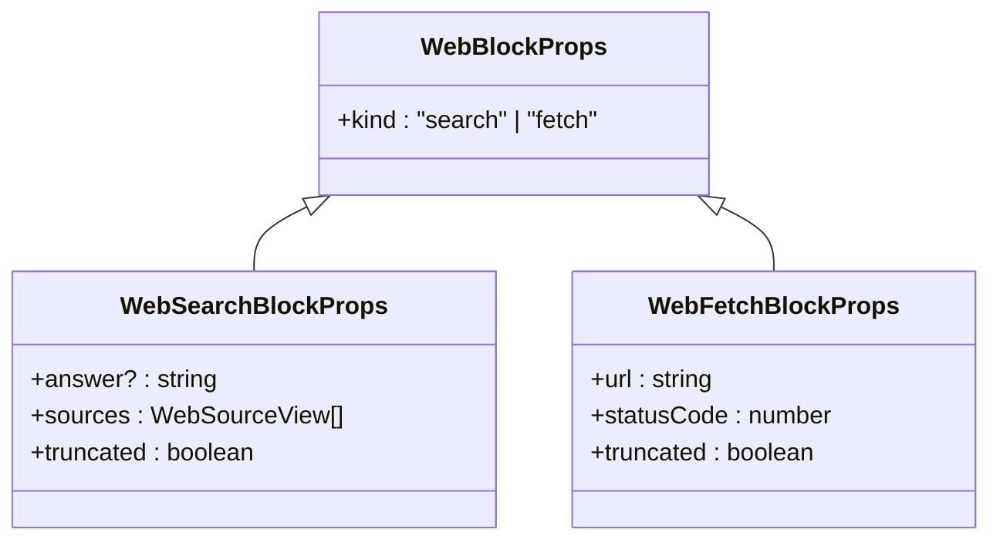
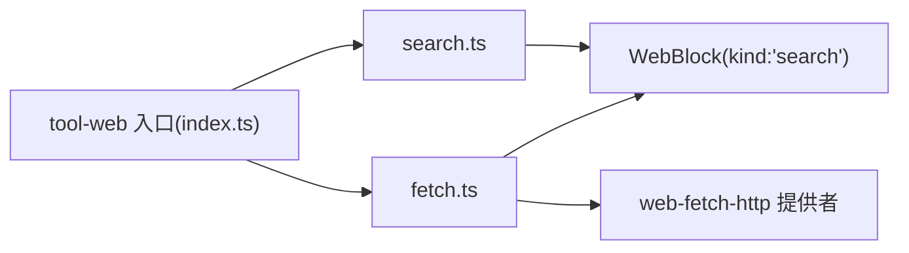

# 网络卡片

<cite>
**本文引用的文件**
- [packages/web/tool-web/src/index.ts](file://packages/web/tool-web/src/index.ts)
- [packages/web/tool-web/src/search.ts](file://packages/web/tool-web/src/search.ts)
- [packages/web/tool-web/src/fetch.ts](file://packages/web/tool-web/src/fetch.ts)
- [packages/client/ui-primitives/src/WebBlock.tsx](file://packages/client/ui-primitives/src/WebBlock.tsx)
- [packages/web/web-fetch-http/src/provider.ts](file://packages/web/web-fetch-http/src/provider.ts)
- [packages/web/web-fetch-http/tests/fetch-http.spec.ts](file://packages/web/web-fetch-http/tests/fetch-http.spec.ts)
- [apps/web/tests/smoke-real.e2e.ts](file://apps/web/tests/smoke-real.e2e.ts)
- [packages/llm/llm-retry/src/index.ts](file://packages/llm/llm-retry/src/index.ts)
- [packages/llm/llm/src/retry-policy.ts](file://packages/llm/llm/src/retry-policy.ts)
</cite>

## 目录
1. [简介](#简介)
2. [项目结构](#项目结构)
3. [核心组件](#核心组件)
4. [架构总览](#架构总览)
5. [详细组件分析](#详细组件分析)
6. [依赖关系分析](#依赖关系分析)
7. [性能考量](#性能考量)
8. [故障排查指南](#故障排查指南)
9. [结论](#结论)
10. [附录](#附录)

## 简介
本文件面向“网络卡片”这一专门用于展示网络请求结果的前端与工具集成方案。它围绕两个模型侧工具 web_search 与 web_fetch，说明：
- kind 字段的 'search' 与 'fetch' 两种模式如何区分并驱动不同渲染。
- 结构化搜索来源（sources）与 fetch 摘要（url、statusCode、truncated）的不同处理方式。
- 网络请求的元数据收集与结果格式化流程。
- 错误处理与重试机制在工具层与提供者层的职责边界。
- 内容类型处理、响应截断与输出上限控制等高级能力。
- 进度显示与缓存策略在实现中的现状与建议。

## 项目结构
网络卡片由“工具注册与格式化”和“前端渲染”两部分组成：
- 工具层（tool-web）负责定义 web_search 与 web_fetch 的工具契约、参数校验、结果格式化、呈现元数据（meta）以及系统提示引导。
- 前端层（ui-primitives/WebBlock）根据 kind 字段渲染两类卡片：搜索卡片（kind: 'search'）与抓取卡片（kind: 'fetch'）。
- HTTP 提供者（web-fetch-http）负责实际的网络访问、内容类型解码、超时与中止信号处理，并抛出结构化 WebError。

图表来源
- [packages/web/tool-web/src/index.ts:1-92](file://packages/web/tool-web/src/index.ts#L1-L92)
- [packages/web/tool-web/src/search.ts:210-275](file://packages/web/tool-web/src/search.ts#L210-L275)
- [packages/web/tool-web/src/fetch.ts:429-496](file://packages/web/tool-web/src/fetch.ts#L429-L496)
- [packages/client/ui-primitives/src/WebBlock.tsx:1-203](file://packages/client/ui-primitives/src/WebBlock.tsx#L1-L203)
- [packages/web/web-fetch-http/src/provider.ts:225-240](file://packages/web/web-fetch-http/src/provider.ts#L225-L240)

章节来源
- [packages/web/tool-web/src/index.ts:1-92](file://packages/web/tool-web/src/index.ts#L1-L92)
- [packages/client/ui-primitives/src/WebBlock.tsx:1-203](file://packages/client/ui-primitives/src/WebBlock.tsx#L1-L203)

## 核心组件
- web_search 工具
  - 负责搜索查询的参数校验、结果文本格式化、结构化 sources 投影为 meta，并在完成时生成 kind: 'search' 的 web 卡片视图。
  - 提供 pending 态的通用卡片（kind: 'search'），便于运行中展示。
- web_fetch 工具
  - 负责 URL 抓取、HTML→Markdown 转换、输出字符上限控制、有效截断标志计算，并在完成时生成 kind: 'fetch' 的 web 卡片视图。
  - 提供 pending 态的通用卡片（kind: 'fetch'）。
- WebBlock 前端组件
  - 根据 kind 选择渲染分支：搜索卡片（可选 answer + 可滚动 sources 列表）或抓取卡片（URL 链接 + HTTP 状态码 + 截断提示）。
  - 对非 http(s) 链接降级为纯文本，避免不安全跳转。

章节来源
- [packages/web/tool-web/src/search.ts:29-85](file://packages/web/tool-web/src/search.ts#L29-L85)
- [packages/web/tool-web/src/search.ts:184-196](file://packages/web/tool-web/src/search.ts#L184-L196)
- [packages/web/tool-web/src/fetch.ts:88-91](file://packages/web/tool-web/src/fetch.ts#L88-L91)
- [packages/web/tool-web/src/fetch.ts:338-340](file://packages/web/tool-web/src/fetch.ts#L338-L340)
- [packages/web/tool-web/src/fetch.ts:405-417](file://packages/web/tool-web/src/fetch.ts#L405-L417)
- [packages/client/ui-primitives/src/WebBlock.tsx:42-69](file://packages/client/ui-primitives/src/WebBlock.tsx#L42-L69)
- [packages/client/ui-primitives/src/WebBlock.tsx:156-202](file://packages/client/ui-primitives/src/WebBlock.tsx#L156-L202)

## 架构总览
下图展示了从调用到渲染的完整链路，包括工具注册、执行、格式化、元数据传递与前端渲染。

图表来源
- [packages/web/tool-web/src/search.ts:210-275](file://packages/web/tool-web/src/search.ts#L210-L275)
- [packages/web/tool-web/src/fetch.ts:429-496](file://packages/web/tool-web/src/fetch.ts#L429-L496)
- [packages/web/web-fetch-http/src/provider.ts:225-240](file://packages/web/web-fetch-http/src/provider.ts#L225-L240)
- [packages/client/ui-primitives/src/WebBlock.tsx:195-202](file://packages/client/ui-primitives/src/WebBlock.tsx#L195-L202)

## 详细组件分析

### web_search：结构化搜索来源与搜索卡片
- 参数与提示
  - 参数 query 必须为非空字符串；系统提示会引导模型使用 web_search 发现信息，并在启用 web_fetch 时建议后续抓取具体结果。
- 结果格式化
  - 将 provider 答案（若有）与 sources 列表拼接为模型可读文本；当无结果时输出“未找到结果”。
  - 若 truncated 为真，追加提示以引导更精确的查询。
- 元数据与回放
  - 通过 searchMetaFromValue 将 sources、truncated、answer 投影为 opaque JSON 存入 result.meta，以便回放时重建搜索卡片。
  - presentSearchResult 基于 meta 构建 card: 'web', kind: 'search' 的视图，包含 title、sources、truncated 与可选 answer。
- 运行时呈现
  - 运行中显示 kind: 'search' 的通用卡片，标题为查询词。

图表来源
- [packages/web/tool-web/src/search.ts:29-32](file://packages/web/tool-web/src/search.ts#L29-L32)
- [packages/web/tool-web/src/search.ts:54-75](file://packages/web/tool-web/src/search.ts#L54-L75)
- [packages/web/tool-web/src/search.ts:133-139](file://packages/web/tool-web/src/search.ts#L133-L139)
- [packages/web/tool-web/src/search.ts:184-196](file://packages/web/tool-web/src/search.ts#L184-L196)

章节来源
- [packages/web/tool-web/src/search.ts:29-85](file://packages/web/tool-web/src/search.ts#L29-L85)
- [packages/web/tool-web/src/search.ts:133-196](file://packages/web/tool-web/src/search.ts#L133-L196)
- [packages/web/tool-web/src/search.ts:210-275](file://packages/web/tool-web/src/search.ts#L210-L275)

### web_fetch：抓取摘要与抓取卡片
- 参数与提示
  - 参数 url 必须为非空字符串；系统提示引导模型用 web_fetch 获取特定 URL 的内容并以 Markdown 链接引用。
- HTML→Markdown 转换与深度保护
  - 使用 Turndown 将 HTML 转为 Markdown，禁用 script/style/noscript，并对表格进行 GFM 友好渲染。
  - 对嵌套过深的 HTML（超过固定深度阈值）直接回退为原始 HTML，避免同步阻塞。
- 输出上限与截断
  - 对输入内容进行同步前缀截取，限制 DOM 解析与 turndown 的工作量。
  - 最终输出包含头部（Fetched <url> (HTTP <status>)）、正文与截断提示；整体长度受部署配置的上限约束。
- 元数据与回放
  - 通过 fetchMetaFromValue 提取 url、statusCode 与 effective truncated（考虑提供者截断、源截取与输出上限），存入 result.meta。
  - presentFetchResult 基于 meta 构建 card: 'web', kind: 'fetch' 的视图。
- 运行时呈现
  - 运行中显示 kind: 'fetch' 的通用卡片，标题为 URL。

图表来源
- [packages/web/tool-web/src/fetch.ts:88-91](file://packages/web/tool-web/src/fetch.ts#L88-L91)
- [packages/web/tool-web/src/fetch.ts:224-244](file://packages/web/tool-web/src/fetch.ts#L224-L244)
- [packages/web/tool-web/src/fetch.ts:284-330](file://packages/web/tool-web/src/fetch.ts#L284-L330)
- [packages/web/tool-web/src/fetch.ts:374-376](file://packages/web/tool-web/src/fetch.ts#L374-L376)
- [packages/web/tool-web/src/fetch.ts:405-417](file://packages/web/tool-web/src/fetch.ts#L405-L417)

章节来源
- [packages/web/tool-web/src/fetch.ts:88-91](file://packages/web/tool-web/src/fetch.ts#L88-L91)
- [packages/web/tool-web/src/fetch.ts:224-330](file://packages/web/tool-web/src/fetch.ts#L224-L330)
- [packages/web/tool-web/src/fetch.ts:374-417](file://packages/web/tool-web/src/fetch.ts#L374-L417)
- [packages/web/tool-web/src/fetch.ts:429-496](file://packages/web/tool-web/src/fetch.ts#L429-L496)

### WebBlock：前端渲染与安全性
- kind 分发
  - kind: 'search' 渲染可选 answer 与 sources 列表（可滚动容器），并在 truncated 时显示“来源列表已截断”。
  - kind: 'fetch' 渲染 URL 链接与 HTTP 状态码，并在 truncated 时显示“内容已截断”。
- 安全外链
  - 仅 http(s) 协议生成可点击外链，其他协议或无法解析的 URL 降级为纯文本。
- 空结果处理
  - 搜索卡片在无 answer 且无 sources 时显示“未找到结果”，保持用户感知一致。

图表来源
- [packages/client/ui-primitives/src/WebBlock.tsx:42-69](file://packages/client/ui-primitives/src/WebBlock.tsx#L42-L69)
- [packages/client/ui-primitives/src/WebBlock.tsx:156-202](file://packages/client/ui-primitives/src/WebBlock.tsx#L156-L202)

章节来源
- [packages/client/ui-primitives/src/WebBlock.tsx:71-125](file://packages/client/ui-primitives/src/WebBlock.tsx#L71-L125)
- [packages/client/ui-primitives/src/WebBlock.tsx:156-202](file://packages/client/ui-primitives/src/WebBlock.tsx#L156-L202)

## 依赖关系分析
- 工具注册入口
  - tool-web 插件暴露 apply(ctx, config)，根据配置启用 web_search 与 web_fetch，并将超时预算与输出上限注入工具定义。
- 工具与提供者解耦
  - 工具层不持有具体提供者实现，仅通过 ctx.web 接口调用；提供者实现位于 web-fetch-http。
- 前端与工具视图解耦
  - 前端只消费 card: 'web' 与 kind 联合类型，不关心工具内部细节。

图表来源
- [packages/web/tool-web/src/index.ts:80-91](file://packages/web/tool-web/src/index.ts#L80-L91)
- [packages/web/tool-web/src/search.ts:210-275](file://packages/web/tool-web/src/search.ts#L210-L275)
- [packages/web/tool-web/src/fetch.ts:429-496](file://packages/web/tool-web/src/fetch.ts#L429-L496)
- [packages/client/ui-primitives/src/WebBlock.tsx:195-202](file://packages/client/ui-primitives/src/WebBlock.tsx#L195-L202)

章节来源
- [packages/web/tool-web/src/index.ts:1-92](file://packages/web/tool-web/src/index.ts#L1-L92)

## 性能考量
- 同步转换深度保护
  - HTML 转换采用最大嵌套深度限制，避免超长或畸形页面导致事件循环阻塞。
- 输出上限与缓存
  - 对 fetch 输出设置全局字符上限，并通过 WeakMap 缓存每结果的渲染产物，避免重复转换。
- 滚动容器与长列表
  - 搜索卡片的 sources 列表置于固定高度滚动容器内，避免卡片无限增长影响布局。
- 截断一致性
  - 文本渲染与卡片 truncated 标志保持一致，确保模型所见与用户所见一致。

[本节为通用性能讨论，不直接分析具体文件]

## 故障排查指南
- 常见错误分类
  - WEB_INVALID_URL：非 http(s) 或非法 URL 被拒绝。
  - WEB_BLOCKED_URL：URL 包含凭据等被阻止。
  - WEB_UNSUPPORTED_CONTENT_TYPE：响应缺少 content-type 或 charset 不被支持。
  - WEB_ABORTED：请求被中止（上游取消或外层超时）。
  - WEB_FETCH_TIMEOUT：达到提供者超时阈值。
  - WEB_PROVIDER_ERROR：传输/网络失败。
- 超时与中止
  - 工具调用携带 AbortSignal；提供者根据信号区分超时、中止与网络错误，并抛出对应 WebError。
- 重试机制
  - 工具层本身不内置重试；重试策略由上层 LLM 重试框架管理（如 llm-retry），可按模式与可重试代码集配置退避与最大重试次数。
  - 端到端测试验证了部分传输失败可通过组合的重试策略恢复。
- 内容类型与编码
  - 提供者会依据 content-type 与 charset 解码；不支持的 charset 会抛出 WEB_UNSUPPORTED_CONTENT_TYPE。
- 调试建议
  - 检查工具配置（searchMaxResults、fetchTimeoutMs、fetchMaxOutputChars）是否合理。
  - 查看 result.meta 中的 truncated 与 statusCode，确认截断与状态是否符合预期。
  - 对于 HTML 页面，若转换失败，会回退为原始 HTML，可在日志中定位问题。

章节来源
- [packages/web/web-fetch-http/src/provider.ts:225-240](file://packages/web/web-fetch-http/src/provider.ts#L225-L240)
- [packages/web/web-fetch-http/tests/fetch-http.spec.ts:146-170](file://packages/web/web-fetch-http/tests/fetch-http.spec.ts#L146-L170)
- [packages/web/web-fetch-http/tests/fetch-http.spec.ts:276-306](file://packages/web/web-fetch-http/tests/fetch-http.spec.ts#L276-L306)
- [packages/web/web-fetch-http/tests/fetch-http.spec.ts:353-380](file://packages/web/web-fetch-http/tests/fetch-http.spec.ts#L353-L380)
- [apps/web/tests/smoke-real.e2e.ts:298-328](file://apps/web/tests/smoke-real.e2e.ts#L298-L328)
- [packages/llm/llm-retry/src/index.ts:99-109](file://packages/llm/llm-retry/src/index.ts#L99-L109)
- [packages/llm/llm/src/retry-policy.ts:105-156](file://packages/llm/llm/src/retry-policy.ts#L105-L156)

## 结论
网络卡片通过 kind 字段清晰区分搜索与抓取两种模式，分别承载结构化来源与抓取摘要。工具层负责参数校验、结果格式化与元数据投影，前端按 kind 渲染统一风格的卡片。HTTP 提供者提供健壮的错误分类与超时/中止处理。输出上限与深度保护保障了性能与稳定性。重试机制由上层框架统一管理，工具层保持幂等与无副作用。

[本节为总结性内容，不直接分析具体文件]

## 附录

### web_search 与 web_fetch 工具集成示例
- 启用工具
  - 在插件配置中启用 search 与 fetch，并设置 searchMaxResults、fetchTimeoutMs、searchTimeoutMs、fetchMaxOutputChars。
- 调用方式
  - web_search(query): 返回可选 answer 与 sources 列表，前端以 kind: 'search' 卡片展示。
  - web_fetch(url): 返回 url、statusCode、body（html/text）与 truncated，前端以 kind: 'fetch' 卡片展示。
- 系统提示
  - 工具注册时会注入系统提示，指导模型如何使用这两个工具并正确引用来源。

章节来源
- [packages/web/tool-web/src/index.ts:36-91](file://packages/web/tool-web/src/index.ts#L36-L91)
- [packages/web/tool-web/src/search.ts:216-222](file://packages/web/tool-web/src/search.ts#L216-L222)
- [packages/web/tool-web/src/fetch.ts:429-434](file://packages/web/tool-web/src/fetch.ts#L429-L434)

### 内容类型、响应缓存与进度显示
- 内容类型
  - 提供者依据 content-type 与 charset 解码；不支持的类型会抛出 WEB_UNSUPPORTED_CONTENT_TYPE。
- 响应缓存
  - 工具层对 fetch 输出进行本地渲染缓存（WeakMap），避免重复转换；不提供跨请求的全局缓存。
- 进度显示
  - 当前实现未提供细粒度进度回调；可通过工具调用超时与中止信号间接反映长时间运行的状态。

章节来源
- [packages/web/web-fetch-http/tests/fetch-http.spec.ts:146-170](file://packages/web/web-fetch-http/tests/fetch-http.spec.ts#L146-L170)
- [packages/web/tool-web/src/fetch.ts:284-300](file://packages/web/tool-web/src/fetch.ts#L284-L300)