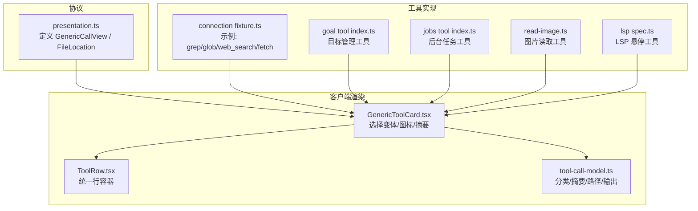
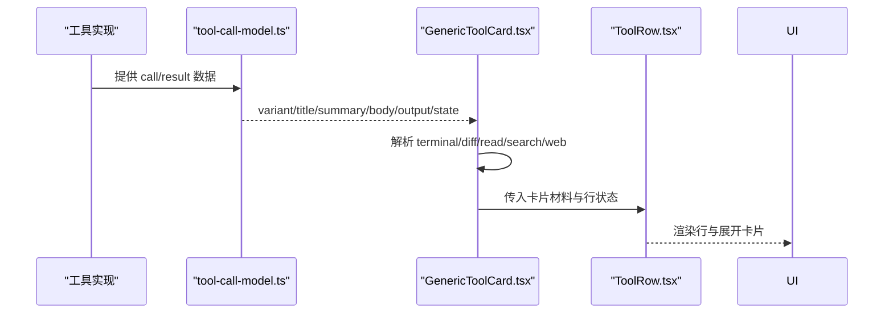
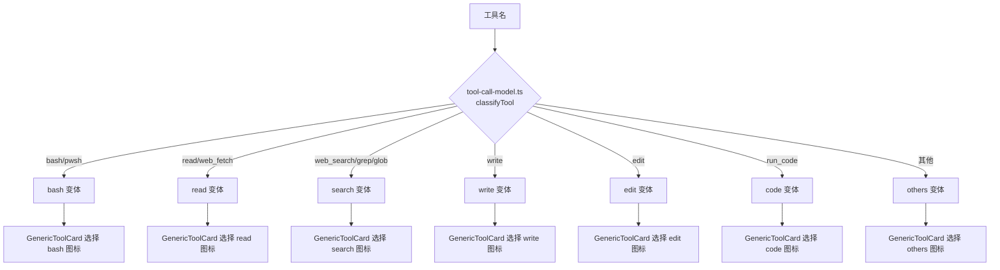
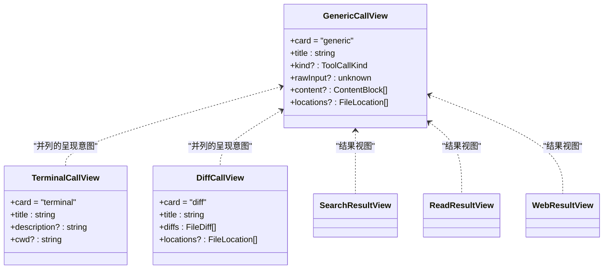
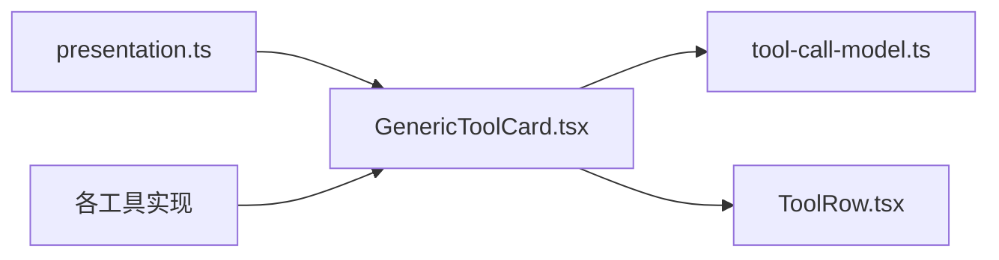

# 通用卡片

<cite>
**本文引用的文件**
- [packages/core/tools/src/presentation.ts](file://packages/core/tools/src/presentation.ts)
- [packages/client/ui-tool/src/client/tool/toolviews/GenericToolCard.tsx](file://packages/client/ui-tool/src/client/tool/toolviews/GenericToolCard.tsx)
- [packages/client/ui-tool/src/client/tool/models/tool-call-model.ts](file://packages/client/ui-tool/src/client/tool/models/tool-call-model.ts)
- [packages/client/ui-tool/src/client/tool/components/ToolRow.tsx](file://packages/client/ui-tool/src/client/tool/components/ToolRow.tsx)
- [packages/client/connection/src/client/fixture.ts](file://packages/client/connection/src/client/fixture.ts)
- [packages/goal/tool-goal/src/index.ts](file://packages/goal/tool-goal/src/index.ts)
- [packages/jobs/tool-jobs/src/index.ts](file://packages/jobs/tool-jobs/src/index.ts)
- [packages/fs/tool-fs/src/read-image.ts](file://packages/fs/tool-fs/src/read-image.ts)
- [packages/lsp/tool-lsp/tests/tool-lsp.spec.ts](file://packages/lsp/tool-lsp/tests/tool-lsp.spec.ts)
</cite>

## 目录
1. [简介](#简介)
2. [项目结构](#项目结构)
3. [核心组件](#核心组件)
4. [架构总览](#架构总览)
5. [详细组件分析](#详细组件分析)
6. [依赖关系分析](#依赖关系分析)
7. [性能考虑](#性能考虑)
8. [故障排查指南](#故障排查指南)
9. [结论](#结论)
10. [附录：配置与示例](#附录：配置与示例)

## 简介
通用卡片（GenericCallView）是工具调用的默认渲染意图。当工具未声明终端或差异卡时，UI 将以“带标题、可选分类图标、关键输入、附加内容块和可跟随的文件位置”的通用卡片展示调用过程与结果。它作为兜底渲染模式，确保所有工具在 UI 中都有可读、一致的表现。

## 项目结构
围绕通用卡片的关键代码分布在以下层次：
- 协议层：定义通用卡片类型与字段（title、kind、rawInput、content、locations）。
- 客户端渲染层：将协议映射为 ToolRow 行项，并组合其他专用卡片（终端、差异、读、搜索、Web）。
- 工具实现层：各工具通过 presentCall/presentResult 返回通用卡片或其他卡片，驱动 UI 行为。

**图表来源**
- [packages/core/tools/src/presentation.ts:48-75](file://packages/core/tools/src/presentation.ts#L48-L75)
- [packages/client/ui-tool/src/client/tool/toolviews/GenericToolCard.tsx:1-78](file://packages/client/ui-tool/src/client/tool/toolviews/GenericToolCard.tsx#L1-L78)
- [packages/client/ui-tool/src/client/tool/models/tool-call-model.ts:1-241](file://packages/client/ui-tool/src/client/tool/models/tool-call-model.ts#L1-L241)
- [packages/client/ui-tool/src/client/tool/components/ToolRow.tsx:60-93](file://packages/client/ui-tool/src/client/tool/components/ToolRow.tsx#L60-L93)
- [packages/client/connection/src/client/fixture.ts:631-670](file://packages/client/connection/src/client/fixture.ts#L631-L670)
- [packages/goal/tool-goal/src/index.ts:180-339](file://packages/goal/tool-goal/src/index.ts#L180-L339)
- [packages/jobs/tool-jobs/src/index.ts:200-399](file://packages/jobs/tool-jobs/src/index.ts#L200-L399)
- [packages/fs/tool-fs/src/read-image.ts:203-231](file://packages/fs/tool-fs/src/read-image.ts#L203-L231)
- [packages/lsp/tool-lsp/tests/tool-lsp.spec.ts:228-238](file://packages/lsp/tool-lsp/tests/tool-lsp.spec.ts#L228-L238)

**章节来源**
- [packages/core/tools/src/presentation.ts:48-75](file://packages/core/tools/src/presentation.ts#L48-L75)
- [packages/client/ui-tool/src/client/tool/toolviews/GenericToolCard.tsx:1-78](file://packages/client/ui-tool/src/client/tool/toolviews/GenericToolCard.tsx#L1-L78)
- [packages/client/ui-tool/src/client/tool/models/tool-call-model.ts:1-241](file://packages/client/ui-tool/src/client/tool/models/tool-call-model.ts#L1-L241)
- [packages/client/ui-tool/src/client/tool/components/ToolRow.tsx:60-93](file://packages/client/ui-tool/src/client/tool/components/ToolRow.tsx#L60-L93)

## 核心组件
- 通用卡片协议（GenericCallView）
  - card: 'generic'
  - title: 始终可见的人类可读标题
  - kind?: 分类（read/edit/delete/move/search/execute/fetch/other），用于图标与处理
  - rawInput?: 详情展开中的关键输入（字符串原样显示；对象以 JSON 美化显示）
  - content?: 附加内容块（ContentBlock[]），由 UI 映射到自身内容区域
  - locations?: 文件位置数组（FileLocation[]），供编辑器“跟随定位”
- 文件位置（FileLocation）
  - path: 操作文件路径
  - line?: 聚焦行号（1 起始）

这些字段共同决定通用卡片的标题、图标、展开内容与编辑器联动能力。

**章节来源**
- [packages/core/tools/src/presentation.ts:48-75](file://packages/core/tools/src/presentation.ts#L48-L75)

## 架构总览
通用卡片从工具侧的 presentCall/presentResult 产出，经客户端模型推导后，由 GenericToolCard 组装成统一的 ToolRow 行项。若存在终端/差异/读/搜索/Web 等专用卡片材料，则优先替换文本主体；否则回退到通用卡片。

**图表来源**
- [packages/client/ui-tool/src/client/tool/models/tool-call-model.ts:211-241](file://packages/client/ui-tool/src/client/tool/models/tool-call-model.ts#L211-L241)
- [packages/client/ui-tool/src/client/tool/toolviews/GenericToolCard.tsx:36-77](file://packages/client/ui-tool/src/client/tool/toolviews/GenericToolCard.tsx#L36-L77)
- [packages/client/ui-tool/src/client/tool/components/ToolRow.tsx:60-93](file://packages/client/ui-tool/src/client/tool/components/ToolRow.tsx#L60-L93)

## 详细组件分析

### 通用卡片字段说明与用法
- title
  - 作用：卡片标题/日志行，应简短明确描述本次调用做什么
  - 建议：避免冗长，突出动作与目标
- kind
  - 作用：分类图标与视觉处理
  - 取值：read/edit/delete/move/search/execute/fetch/other
  - 默认：省略时为 other
- rawInput
  - 作用：详情展开中的关键输入
  - 格式：任意值；字符串原样显示；对象以 JSON 美化显示
  - 建议：只放读者真正关心的关键信息，而非完整参数
- content
  - 作用：附加内容块，UI 会映射到其内容区
  - 格式：ContentBlock[]
- locations
  - 作用：编辑器“跟随定位”
  - 格式：FileLocation[]，path 必填，line 可选

**章节来源**
- [packages/core/tools/src/presentation.ts:48-75](file://packages/core/tools/src/presentation.ts#L48-L75)

### 图标映射机制
- 分类到图标的映射发生在客户端：
  - tool-call-model.ts 将工具名归类为 row 变体（search/read/bash/write/edit/code/others）
  - GenericToolCard.tsx 根据变体选择对应图标
- 注意：kind 影响语义分类；row 变体影响 UI 样式与交互（如是否显示文件路径链接）

**图表来源**
- [packages/client/ui-tool/src/client/tool/models/tool-call-model.ts:28-78](file://packages/client/ui-tool/src/client/tool/models/tool-call-model.ts#L28-L78)
- [packages/client/ui-tool/src/client/tool/toolviews/GenericToolCard.tsx:20-29](file://packages/client/ui-tool/src/client/tool/toolviews/GenericToolCard.tsx#L20-L29)

**章节来源**
- [packages/client/ui-tool/src/client/tool/models/tool-call-model.ts:28-78](file://packages/client/ui-tool/src/client/tool/models/tool-call-model.ts#L28-L78)
- [packages/client/ui-tool/src/client/tool/toolviews/GenericToolCard.tsx:20-29](file://packages/client/ui-tool/src/client/tool/toolviews/GenericToolCard.tsx#L20-L29)

### 文件位置跟随功能
- locations 用于让具备能力的 UI 在工具运行期间高亮或跳转到相应文件/行
- 典型场景：
  - read 工具：标注被读取文件的偏移行
  - write/edit 工具：标注修改的文件
  - LSP 悬停：标注目标文件与行
- 示例：
  - 图片读取工具：标注图片文件路径
  - LSP 悬停测试：标注 a.ts 第 2 行

**章节来源**
- [packages/fs/tool-fs/src/read-image.ts:203-231](file://packages/fs/tool-fs/src/read-image.ts#L203-L231)
- [packages/lsp/tool-lsp/tests/tool-lsp.spec.ts:228-238](file://packages/lsp/tool-lsp/tests/tool-lsp.spec.ts#L228-L238)

### 与其他卡片类型的关系与转换规则
- 默认回退：未声明终端/差异卡时，使用通用卡片
- 专用卡片优先级：
  - 终端卡（terminal）：命令执行，包含 cwd、输出、退出码
  - 差异卡（diff）：文件变更，oldText/newText
  - 读卡（read）：按行窗口显示文件片段
  - 搜索卡（search）：匹配分组或路径列表
  - Web 卡（web）：搜索结果或抓取摘要
- 通用卡片在这些专用卡片不存在时承担展示职责；当存在时，通用卡片仍可用于标题、rawInput、content、locations 等元信息

**图表来源**
- [packages/core/tools/src/presentation.ts:48-118](file://packages/core/tools/src/presentation.ts#L48-L118)
- [packages/core/tools/src/presentation.ts:140-390](file://packages/core/tools/src/presentation.ts#L140-L390)

**章节来源**
- [packages/core/tools/src/presentation.ts:48-118](file://packages/core/tools/src/presentation.ts#L48-L118)
- [packages/core/tools/src/presentation.ts:140-390](file://packages/core/tools/src/presentation.ts#L140-L390)

### 实际使用示例（以引用路径代替代码）
- 搜索类工具（grep/glob/web_search/web_fetch）
  - 在 pending 阶段返回通用卡片，kind 为 search/fetch，rawInput 携带查询参数
  - 参考路径：[packages/client/connection/src/client/fixture.ts:656-670](file://packages/client/connection/src/client/fixture.ts#L656-L670)
- 目标管理工具（create/update/get_goal）
  - 使用通用卡片，kind 为 read/other，rawInput 携带目标或原因
  - 参考路径：[packages/goal/tool-goal/src/index.ts:180-339](file://packages/goal/tool-goal/src/index.ts#L180-L339)
- 后台任务工具（job_output/job_list/job_kill）
  - 使用通用卡片，kind 为 read/execute，rawInput 携带 job_id
  - 参考路径：[packages/jobs/tool-jobs/src/index.ts:200-399](file://packages/jobs/tool-jobs/src/index.ts#L200-L399)
- 图片读取工具
  - 使用通用卡片，kind 为 read，locations 指向图片文件
  - 参考路径：[packages/fs/tool-fs/src/read-image.ts:203-231](file://packages/fs/tool-fs/src/read-image.ts#L203-L231)
- LSP 悬停工具
  - 使用通用卡片，kind 为 search，locations 指向目标文件与行
  - 参考路径：[packages/lsp/tool-lsp/tests/tool-lsp.spec.ts:228-238](file://packages/lsp/tool-lsp/tests/tool-lsp.spec.ts#L228-L238)

**章节来源**
- [packages/client/connection/src/client/fixture.ts:656-670](file://packages/client/connection/src/client/fixture.ts#L656-L670)
- [packages/goal/tool-goal/src/index.ts:180-339](file://packages/goal/tool-goal/src/index.ts#L180-L339)
- [packages/jobs/tool-jobs/src/index.ts:200-399](file://packages/jobs/tool-jobs/src/index.ts#L200-L399)
- [packages/fs/tool-fs/src/read-image.ts:203-231](file://packages/fs/tool-fs/src/read-image.ts#L203-L231)
- [packages/lsp/tool-lsp/tests/tool-lsp.spec.ts:228-238](file://packages/lsp/tool-lsp/tests/tool-lsp.spec.ts#L228-L238)

## 依赖关系分析
- 协议依赖：GenericCallView 依赖 ContentBlock、FileLocation
- 渲染依赖：GenericToolCard 依赖 tool-call-model（分类/摘要/路径）、ToolRow（统一行容器）
- 工具依赖：各工具通过 presentCall/presentResult 产出卡片，驱动 UI 行为

**图表来源**
- [packages/core/tools/src/presentation.ts:48-75](file://packages/core/tools/src/presentation.ts#L48-L75)
- [packages/client/ui-tool/src/client/tool/toolviews/GenericToolCard.tsx:1-78](file://packages/client/ui-tool/src/client/tool/toolviews/GenericToolCard.tsx#L1-L78)
- [packages/client/ui-tool/src/client/tool/models/tool-call-model.ts:1-241](file://packages/client/ui-tool/src/client/tool/models/tool-call-model.ts#L1-L241)
- [packages/client/ui-tool/src/client/tool/components/ToolRow.tsx:60-93](file://packages/client/ui-tool/src/client/tool/components/ToolRow.tsx#L60-L93)

**章节来源**
- [packages/core/tools/src/presentation.ts:48-75](file://packages/core/tools/src/presentation.ts#L48-L75)
- [packages/client/ui-tool/src/client/tool/toolviews/GenericToolCard.tsx:1-78](file://packages/client/ui-tool/src/client/tool/toolviews/GenericToolCard.tsx#L1-L78)
- [packages/client/ui-tool/src/client/tool/models/tool-call-model.ts:1-241](file://packages/client/ui-tool/src/client/tool/models/tool-call-model.ts#L1-L241)
- [packages/client/ui-tool/src/client/tool/components/ToolRow.tsx:60-93](file://packages/client/ui-tool/src/client/tool/components/ToolRow.tsx#L60-L93)

## 性能考虑
- 通用卡片仅承载轻量元信息（标题、分类、关键输入、内容块、位置），避免在 pending 阶段传递大量数据
- 专用卡片（终端/差异/读/搜索/Web）在需要结构化展示时使用，减少不必要的文本膨胀
- 对大输出（如终端输出）采用折叠与截断策略，避免 UI 卡顿

[本节为通用指导，不直接分析具体文件]

## 故障排查指南
- 标题缺失或过长
  - 检查 title 是否为空或过于冗长；保持简洁明了
  - 参考：[packages/core/tools/src/presentation.ts:55-59](file://packages/core/tools/src/presentation.ts#L55-L59)
- 图标不正确
  - 确认 kind 设置合理；若未设置，默认为 other
  - 检查工具名是否在 tool-call-model 的分类表中
  - 参考：[packages/client/ui-tool/src/client/tool/models/tool-call-model.ts:28-78](file://packages/client/ui-tool/src/client/tool/models/tool-call-model.ts#L28-L78)
- 文件位置无效
  - 确保 locations.path 有效；line 为 1 起始且不超过文件行数
  - 参考：[packages/core/tools/src/presentation.ts:18-26](file://packages/core/tools/src/presentation.ts#L18-L26)
- 展开内容异常
  - rawInput 为对象时会以 JSON 美化显示；如需纯文本，请传字符串
  - 参考：[packages/core/tools/src/presentation.ts:62-67](file://packages/core/tools/src/presentation.ts#L62-L67)

**章节来源**
- [packages/core/tools/src/presentation.ts:18-26](file://packages/core/tools/src/presentation.ts#L18-L26)
- [packages/core/tools/src/presentation.ts:55-67](file://packages/core/tools/src/presentation.ts#L55-L67)
- [packages/client/ui-tool/src/client/tool/models/tool-call-model.ts:28-78](file://packages/client/ui-tool/src/client/tool/models/tool-call-model.ts#L28-L78)

## 结论
通用卡片作为默认渲染模式，提供了稳定、一致的调用展示基础。通过合理的 title、kind、rawInput、content、locations 配置，既能满足大多数工具的展示需求，又能与专用卡片协同工作，提升用户体验与可维护性。遵循本文的字段规范与最佳实践，可在不同场景下获得清晰、高效的卡片表现。

[本节为总结，不直接分析具体文件]

## 附录：配置与示例
- 配置要点
  - 始终提供 title；必要时补充 kind 以改善图标与处理
  - 仅在详情中有价值时提供 rawInput；避免暴露完整参数
  - 使用 content 添加 UI 友好的内容块；使用 locations 启用编辑器跟随
- 自定义样式方法
  - 通过 ToolRow 的 variant 与 icon 控制行级样式；通用卡片内部已根据变体选择图标
  - 若需更深层定制，可在注册 keyed toolview 时覆盖默认行；否则通用卡片作为回退保证一致性
- 推荐实践
  - 搜索/读取类工具：kind 设为 search/read，locations 指向目标文件
  - 后台任务：kind 设为 execute/read，rawInput 携带 job_id
  - 目标管理：kind 设为 other/read，rawInput 携带目标或原因
- 示例路径（不含代码）
  - 搜索类：[packages/client/connection/src/client/fixture.ts:656-670](file://packages/client/connection/src/client/fixture.ts#L656-L670)
  - 目标管理：[packages/goal/tool-goal/src/index.ts:180-339](file://packages/goal/tool-goal/src/index.ts#L180-L339)
  - 后台任务：[packages/jobs/tool-jobs/src/index.ts:200-399](file://packages/jobs/tool-jobs/src/index.ts#L200-L399)
  - 图片读取：[packages/fs/tool-fs/src/read-image.ts:203-231](file://packages/fs/tool-fs/src/read-image.ts#L203-L231)
  - LSP 悬停：[packages/lsp/tool-lsp/tests/tool-lsp.spec.ts:228-238](file://packages/lsp/tool-lsp/tests/tool-lsp.spec.ts#L228-L238)

[本节为指引与示例路径，不直接分析具体文件]