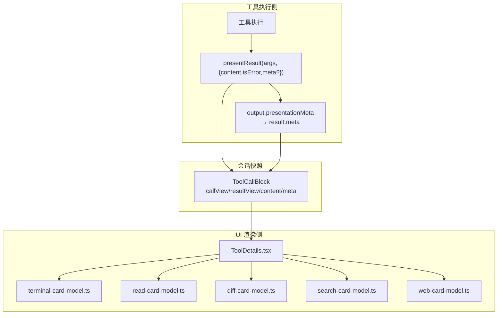
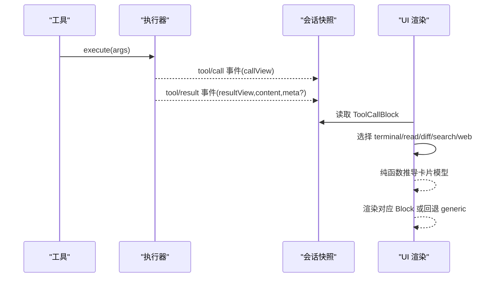
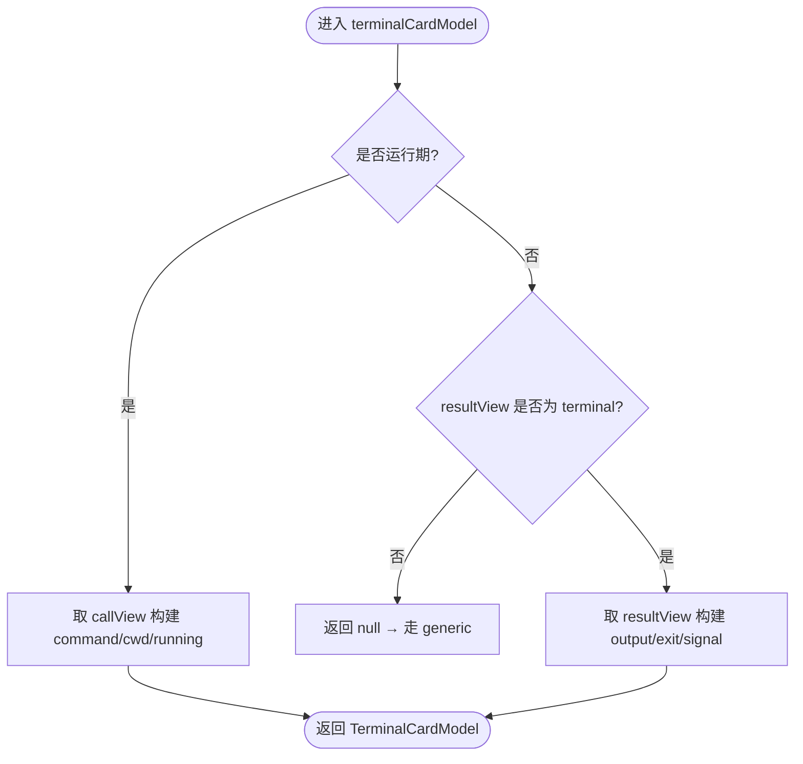
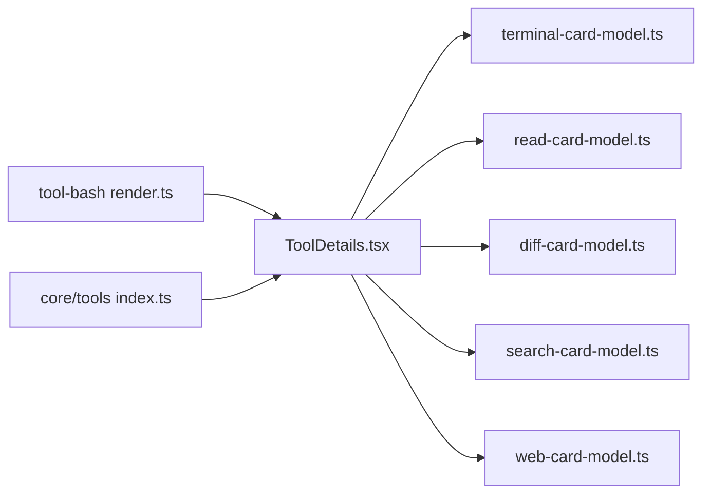

# 工具渲染系统

<cite>
**本文引用的文件**
- [packages/client/ui-tool/src/client/tool/ToolDetails.tsx](file://packages/client/ui-tool/src/client/tool/ToolDetails.tsx)
- [packages/client/ui-tool/src/client/tool/models/read-card-model.ts](file://packages/client/ui-tool/src/client/tool/models/read-card-model.ts)
- [packages/client/ui-tool/src/client/tool/models/diff-card-model.ts](file://packages/client/ui-tool/src/client/tool/models/diff-card-model.ts)
- [packages/client/ui-tool/src/client/tool/models/search-card-model.ts](file://packages/client/ui-tool/src/client/tool/models/search-card-model.ts)
- [packages/client/ui-tool/src/client/tool/models/web-card-model.ts](file://packages/client/ui-tool/src/client/tool/models/web-card-model.ts)
- [packages/client/ui-tool/src/client/tool/models/terminal-card-model.ts](file://packages/client/ui-tool/src/client/tool/models/terminal-card-model.ts)
- [packages/shell/tool-bash/src/render.ts](file://packages/shell/tool-bash/src/render.ts)
- [packages/core/tools/src/index.ts](file://packages/core/tools/src/index.ts)
- [packages/core/tools/tests/tools.spec.ts](file://packages/core/tools/tests/tools.spec.ts)
- [docs/cookbook/adding-a-tool.md](file://docs/cookbook/adding-a-tool.md)
- [docs/cookbook/adding-a-tool.zh.md](file://docs/cookbook/adding-a-tool.zh.md)
</cite>

## 目录
1. [简介](#简介)
2. [项目结构](#项目结构)
3. [核心组件](#核心组件)
4. [架构总览](#架构总览)
5. [详细组件分析](#详细组件分析)
6. [依赖关系分析](#依赖关系分析)
7. [性能考虑](#性能考虑)
8. [故障排查指南](#故障排查指南)
9. [结论](#结论)
10. [附录](#附录)

## 简介
本文件系统化说明“工具渲染系统”的设计与实现，聚焦于 output.render 的契约、presentCall/presentResult 的实现模式、presentationMeta 的作用与使用场景，以及纯函数渲染的要求（无副作用、可重放）。文档覆盖通用（generic）、终端（terminal）、差异（diff）、搜索（search）、网页（web）等卡片类型，并提供跨平台适配机制、性能优化与用户体验改进建议。

## 项目结构
工具渲染系统由两部分组成：
- 后端/执行侧：工具通过 presentCall/presentResult 声明渲染意图；output.presentationMeta 将结构化元数据持久化到 result.meta，供回放与 UI 消费。
- 前端/展示侧：UI 层根据 block 中的 callView/resultView 与 content/meta 推导具体卡片模型，并交由对应 Block 组件渲染。

图表来源
- [packages/client/ui-tool/src/client/tool/ToolDetails.tsx:19-55](file://packages/client/ui-tool/src/client/tool/ToolDetails.tsx#L19-L55)
- [packages/client/ui-tool/src/client/tool/models/terminal-card-model.ts:182-219](file://packages/client/ui-tool/src/client/tool/models/terminal-card-model.ts#L182-L219)
- [packages/client/ui-tool/src/client/tool/models/read-card-model.ts:62-76](file://packages/client/ui-tool/src/client/tool/models/read-card-model.ts#L62-L76)
- [packages/client/ui-tool/src/client/tool/models/diff-card-model.ts:84-97](file://packages/client/ui-tool/src/client/tool/models/diff-card-model.ts#L84-L97)
- [packages/client/ui-tool/src/client/tool/models/search-card-model.ts:130-160](file://packages/client/ui-tool/src/client/tool/models/search-card-model.ts#L130-L160)
- [packages/client/ui-tool/src/client/tool/models/web-card-model.ts:39-74](file://packages/client/ui-tool/src/client/tool/models/web-card-model.ts#L39-L74)
- [packages/core/tools/src/index.ts:290-302](file://packages/core/tools/src/index.ts#L290-L302)

章节来源
- [packages/client/ui-tool/src/client/tool/ToolDetails.tsx:19-55](file://packages/client/ui-tool/src/client/tool/ToolDetails.tsx#L19-L55)
- [packages/core/tools/src/index.ts:290-302](file://packages/core/tools/src/index.ts#L290-L302)

## 核心组件
- ToolDetails：统一入口，按优先级检测 terminal → read → diff → search → web，命中则渲染对应卡片，否则回退为通用文本。
- 各卡片模型：纯函数从冻结的 ToolCallBlock 推导 UI 所需字段，保证一次推导、多处复用。
- Bash 结果渲染：将 stdout/stderr、截断提示、沙箱拒绝、超时/信号/退出码等标记组合为模型可读的文本。
- presentationMeta：工具在 output 中声明的投影函数，将执行期结构化信息写入 result.meta，供 presentResult 与 UI 回放使用。

章节来源
- [packages/client/ui-tool/src/client/tool/ToolDetails.tsx:19-55](file://packages/client/ui-tool/src/client/tool/ToolDetails.tsx#L19-L55)
- [packages/shell/tool-bash/src/render.ts:28-63](file://packages/shell/tool-bash/src/render.ts#L28-L63)
- [packages/core/tools/src/index.ts:290-302](file://packages/core/tools/src/index.ts#L290-L302)
- [packages/core/tools/tests/tools.spec.ts:96-130](file://packages/core/tools/tests/tools.spec.ts#L96-L130)

## 架构总览
工具渲染采用“渲染意图 + 纯推导”的分层设计：
- 工具侧：presentCall 返回调用时（PENDING）的视图；presentResult 返回完成后的视图；output.presentationMeta 提供可持久化的结构化元数据。
- 会话侧：保存 ToolCallBlock（含 callView/resultView/content/meta），作为不可变快照。
- UI 侧：以纯函数从快照推导具体卡片模型，再交给对应 Block 渲染。未知或损坏的数据一律回退到 generic。

图表来源
- [packages/client/ui-tool/src/client/tool/ToolDetails.tsx:19-55](file://packages/client/ui-tool/src/client/tool/ToolDetails.tsx#L19-L55)
- [packages/core/tools/src/index.ts:290-302](file://packages/core/tools/src/index.ts#L290-L302)

## 详细组件分析

### 通用入口：ToolDetails
- 职责：按固定顺序尝试 terminal → read → diff → search → web，命中即渲染；否则保留原始结果文本。
- 行为要点：
  - terminal：若存在且失败（非零退出码或信号），行级状态显示错误点。
  - read：仅结果态可用；标签优先使用 title，否则相对工作区路径。
  - diff：运行期使用 callView 的 diffs，完成后用 resultView 的已应用 hunks 替换。
  - search：仅结果态；支持 matches（按文件分组）与 paths（扁平路径列表），并在被截断时提供 recovery 文本。
  - web：仅结果态；区分 search/fetch，未知 kind 走 generic。

章节来源
- [packages/client/ui-tool/src/client/tool/ToolDetails.tsx:19-55](file://packages/client/ui-tool/src/client/tool/ToolDetails.tsx#L19-L55)

### 终端卡片（terminal）
- 模型推导：
  - 运行期：从 callView 提取命令、cwd、running=true。
  - 完成期：从 resultView 提取输出、退出码/信号、running=false；title 遵循“替换标题”规则。
  - cwd 解析：相对路径与工作区根拼接，UNC/盘符/分隔符规范化处理。
  - 失败判定：非零退出码或存在信号即视为失败。
- Bash 结果文本：
  - 合并 stdout/stderr，追加截断提示、沙箱拒绝、超时/信号/退出码标记。
  - 后台进程增量读取同样附加丢失/沙箱提示。

图表来源
- [packages/client/ui-tool/src/client/tool/models/terminal-card-model.ts:182-219](file://packages/client/ui-tool/src/client/tool/models/terminal-card-model.ts#L182-L219)
- [packages/client/ui-tool/src/client/tool/models/terminal-card-model.ts:89-131](file://packages/client/ui-tool/src/client/tool/models/terminal-card-model.ts#L89-L131)
- [packages/shell/tool-bash/src/render.ts:28-63](file://packages/shell/tool-bash/src/render.ts#L28-L63)

章节来源
- [packages/client/ui-tool/src/client/tool/models/terminal-card-model.ts:182-219](file://packages/client/ui-tool/src/client/tool/models/terminal-card-model.ts#L182-L219)
- [packages/shell/tool-bash/src/render.ts:28-63](file://packages/shell/tool-bash/src/render.ts#L28-L63)

### 读取卡片（read）
- 仅结果态：运行期无内容，故返回 null，走 generic。
- 字段：label（title 或相对路径）、lines、totalLines、lang。
- 安全：复制 lines 避免持有运行时缓存引用。

章节来源
- [packages/client/ui-tool/src/client/tool/models/read-card-model.ts:62-76](file://packages/client/ui-tool/src/client/tool/models/read-card-model.ts#L62-L76)

### 差异卡片（diff）
- 运行期：使用 callView.diffs；完成后用 resultView.diffs 替换为已应用 hunks。
- 校验：严格验证 diffs 数组及每个 hunk 的 path/oldText/newText，非法则回退 generic。
- 标题：行级不展示 view.title，由行自身标题覆盖。

章节来源
- [packages/client/ui-tool/src/client/tool/models/diff-card-model.ts:84-97](file://packages/client/ui-tool/src/client/tool/models/diff-card-model.ts#L84-L97)
- [packages/client/ui-tool/src/client/tool/models/diff-card-model.ts:48-60](file://packages/client/ui-tool/src/client/tool/models/diff-card-model.ts#L48-L60)

### 搜索卡片（search）
- 仅结果态：运行期无匹配/路径，返回 null。
- 两种形状：
  - matches：按文件分组，包含 lineNumber/line 的匹配项。
  - paths：扁平路径列表。
- 截断恢复：当 truncated=true 时，从原始 content 抽取 recovery 文本（如“完整输出存储于…”）。
- 健壮性：对 files/paths 进行运行时校验，未知 shape 或非法数据走 generic。

章节来源
- [packages/client/ui-tool/src/client/tool/models/search-card-model.ts:130-160](file://packages/client/ui-tool/src/client/tool/models/search-card-model.ts#L130-L160)
- [packages/client/ui-tool/src/client/tool/models/search-card-model.ts:87-96](file://packages/client/ui-tool/src/client/tool/models/search-card-model.ts#L87-L96)
- [packages/client/ui-tool/src/client/tool/models/search-card-model.ts:107-113](file://packages/client/ui-tool/src/client/tool/models/search-card-model.ts#L107-L113)

### 网页卡片（web）
- 仅结果态：区分 kind=search/fetch；未知 kind 走 generic。
- search：携带 answer、sources（url/title/snippet/publishedAt）、truncated。
- fetch：携带 url、statusCode、truncated。

章节来源
- [packages/client/ui-tool/src/client/tool/models/web-card-model.ts:39-74](file://packages/client/ui-tool/src/client/tool/models/web-card-model.ts#L39-L74)

### presentCall 与 presentResult 模式
- presentCall：返回调用时的视图（PENDING），用于行级摘要与展开体。
- presentResult：返回完成后的视图，可能替换 pending 视图（如 diff/terminal 的完成态）。
- 卡片类型：
  - generic：默认，可选 title/content。
  - terminal：命令、描述、cwd、输出、退出码/信号。
  - diff：文件差异（旧/新文本）。
  - search：发现型结果（matches/paths），附带 truncated/total。
  - web：检索或抓取结果（search/fetch），来源于 meta 派生。

章节来源
- [docs/cookbook/adding-a-tool.md:71-82](file://docs/cookbook/adding-a-tool.md#L71-L82)
- [docs/cookbook/adding-a-tool.zh.md:73-84](file://docs/cookbook/adding-a-tool.zh.md#L73-L84)

### presentationMeta 的作用与使用场景
- 作用：将执行期的结构化信息（如 diff、read 窗口、search 结果等）投影到 result.meta，随会话持久化，使回放能重现结构化视图。
- 使用方式：在工具的 output 中声明 presentationMeta 函数，返回任意 JSON 值；执行器将其原样放入 result.meta。
- 示例：测试用例展示了 presentationMeta 返回 diffs，最终出现在 result.meta 中。

章节来源
- [packages/core/tools/src/index.ts:290-302](file://packages/core/tools/src/index.ts#L290-L302)
- [packages/core/tools/tests/tools.spec.ts:96-130](file://packages/core/tools/tests/tools.spec.ts#L96-L130)

### 纯函数渲染要求
- 无副作用：所有卡片模型均为纯函数，仅依赖冻结的 ToolCallBlock，不读写外部状态。
- 可重放性：相同输入必得相同输出，便于回放与快照对比。
- 健壮性：对来自网络的 card/shape/kind 等字段做防御性校验，未知或非法数据一律回退 generic，避免崩溃。

章节来源
- [packages/client/ui-tool/src/client/tool/models/terminal-card-model.ts:182-219](file://packages/client/ui-tool/src/client/tool/models/terminal-card-model.ts#L182-L219)
- [packages/client/ui-tool/src/client/tool/models/diff-card-model.ts:48-60](file://packages/client/ui-tool/src/client/tool/models/diff-card-model.ts#L48-L60)
- [packages/client/ui-tool/src/client/tool/models/search-card-model.ts:87-96](file://packages/client/ui-tool/src/client/tool/models/search-card-model.ts#L87-L96)
- [packages/client/ui-tool/src/client/tool/models/web-card-model.ts:39-74](file://packages/client/ui-tool/src/client/tool/models/web-card-model.ts#L39-L74)

### 不同工具类型的渲染示例
- 文件编辑（write/edit）：
  - presentCall：返回 diff 卡片，展示预期变更。
  - presentResult：返回已应用的 hunks，替换 pending 视图。
  - 参考：[packages/client/ui-tool/src/client/tool/models/diff-card-model.ts:84-97](file://packages/client/ui-tool/src/client/tool/models/diff-card-model.ts#L84-L97)
- 终端输出（bash/pwsh）：
  - presentCall：返回 terminal 卡片，包含命令与 cwd。
  - presentResult：返回输出、退出码/信号；Bash 渲染器负责组装文本与标记。
  - 参考：[packages/shell/tool-bash/src/render.ts:28-63](file://packages/shell/tool-bash/src/render.ts#L28-L63)、[packages/client/ui-tool/src/client/tool/models/terminal-card-model.ts:182-219](file://packages/client/ui-tool/src/client/tool/models/terminal-card-model.ts#L182-L219)
- 搜索结果（grep/glob）：
  - presentCall：保持 generic（无匹配前无法展示）。
  - presentResult：返回 search 卡片（matches 或 paths），并携带 truncated/total；必要时提供 recovery 文本。
  - 参考：[packages/client/ui-tool/src/client/tool/models/search-card-model.ts:130-160](file://packages/client/ui-tool/src/client/tool/models/search-card-model.ts#L130-L160)
- 网页检索/抓取（web_search/web_fetch）：
  - presentCall：generic。
  - presentResult：返回 web 卡片（search/fetch），来源于 result.meta 派生。
  - 参考：[packages/client/ui-tool/src/client/tool/models/web-card-model.ts:39-74](file://packages/client/ui-tool/src/client/tool/models/web-card-model.ts#L39-L74)

章节来源
- [packages/client/ui-tool/src/client/tool/models/diff-card-model.ts:84-97](file://packages/client/ui-tool/src/client/tool/models/diff-card-model.ts#L84-L97)
- [packages/shell/tool-bash/src/render.ts:28-63](file://packages/shell/tool-bash/src/render.ts#L28-L63)
- [packages/client/ui-tool/src/client/tool/models/search-card-model.ts:130-160](file://packages/client/ui-tool/src/client/tool/models/search-card-model.ts#L130-L160)
- [packages/client/ui-tool/src/client/tool/models/web-card-model.ts:39-74](file://packages/client/ui-tool/src/client/tool/models/web-card-model.ts#L39-L74)

### 跨平台渲染的适配机制
- 路径与 cwd：
  - 终端 cwd 解析支持 UNC、盘符、前后缀分隔符，确保 Windows/macOS/Linux 一致显示。
  - 相对路径与工作区根拼接，未知工作区时保持原样。
- 分隔符与路径归一化：
  - 自动识别反斜杠/正斜杠，UNC 根不被误弹出。
- 国际化：
  - 终端标签通过翻译键生成，保证多语言一致性。

章节来源
- [packages/client/ui-tool/src/client/tool/models/terminal-card-model.ts:89-131](file://packages/client/ui-tool/src/client/tool/models/terminal-card-model.ts#L89-L131)
- [packages/client/ui-tool/src/client/tool/models/terminal-card-model.ts:24-38](file://packages/client/ui-tool/src/client/tool/models/terminal-card-model.ts#L24-L38)

## 依赖关系分析
- ToolDetails 依赖各卡片模型，形成单一入口的多分支路由。
- 各模型仅依赖 ToolCallBlock 与基础类型，无循环依赖。
- Bash 渲染器独立于 UI，仅产出文本，便于复用与测试。
- presentationMeta 与 ToolResult.meta 构成执行侧与 UI 侧的桥梁。

图表来源
- [packages/client/ui-tool/src/client/tool/ToolDetails.tsx:19-55](file://packages/client/ui-tool/src/client/tool/ToolDetails.tsx#L19-L55)
- [packages/shell/tool-bash/src/render.ts:28-63](file://packages/shell/tool-bash/src/render.ts#L28-L63)
- [packages/core/tools/src/index.ts:290-302](file://packages/core/tools/src/index.ts#L290-L302)

章节来源
- [packages/client/ui-tool/src/client/tool/ToolDetails.tsx:19-55](file://packages/client/ui-tool/src/client/tool/ToolDetails.tsx#L19-L55)
- [packages/shell/tool-bash/src/render.ts:28-63](file://packages/shell/tool-bash/src/render.ts#L28-L63)
- [packages/core/tools/src/index.ts:290-302](file://packages/core/tools/src/index.ts#L290-L302)

## 性能考虑
- 纯函数推导：卡片模型为纯函数，避免重复计算；建议在渲染层缓存模型结果（例如 React memo）。
- 最小化拷贝：read 卡片复制 lines 以避免持有运行时缓存引用，减少意外共享。
- 大结果裁剪：search/terminal 均提供最大行数常量，避免长列表阻塞渲染。
- 回退策略：未知/非法数据直接回退 generic，避免昂贵异常处理。
- 文本渲染：Bash 渲染器仅在必要时追加标记，减少字符串拼接开销。

## 故障排查指南
- 终端失败但行级未标红：检查 terminalFailed 逻辑（非零退出码或信号）是否正确传递至行级状态。
- 搜索卡片不显示：确认 resultView.card 为 'search' 且 shape 为 'matches'/'paths'；检查 files/paths 是否通过运行时校验。
- 差异卡片为空：核对 diffs 数组与 hunk 字段是否符合约束；任一非法将回退 generic。
- Web 卡片不显示：确认 result.kind 为 'search' 或 'fetch'；未知 kind 会走 generic。
- 回放不一致：检查 output.presentationMeta 是否正确写入 result.meta；确保 presentResult 基于 meta 稳定推导。

章节来源
- [packages/client/ui-tool/src/client/tool/models/terminal-card-model.ts:72-75](file://packages/client/ui-tool/src/client/tool/models/terminal-card-model.ts#L72-L75)
- [packages/client/ui-tool/src/client/tool/models/search-card-model.ts:87-96](file://packages/client/ui-tool/src/client/tool/models/search-card-model.ts#L87-L96)
- [packages/client/ui-tool/src/client/tool/models/diff-card-model.ts:48-60](file://packages/client/ui-tool/src/client/tool/models/diff-card-model.ts#L48-L60)
- [packages/client/ui-tool/src/client/tool/models/web-card-model.ts:39-74](file://packages/client/ui-tool/src/client/tool/models/web-card-model.ts#L39-L74)

## 结论
工具渲染系统通过“渲染意图 + 纯推导”实现了高内聚、低耦合的可扩展架构。presentCall/presentResult 明确区分调用期与完成期视图，presentationMeta 将结构化元数据持久化，支撑回放与多端渲染。UI 层以纯函数从冻结快照推导卡片模型，具备强鲁棒性与可维护性。遵循纯函数、健壮校验与回退策略，可在复杂网络与版本演进中保持稳定体验。

## 附录
- 最佳实践清单
  - 始终返回明确的 card 标签，避免模糊对象。
  - 对来自网络的字段进行运行时校验，非法数据走 generic。
  - 使用 presentationMeta 承载结构化元数据，便于回放与多端复用。
  - 在 presentResult 中遵循“替换标题”规则，确保完成态语义正确。
  - 控制渲染体量：限制最大行数、延迟加载详情。
  - 跨平台路径与 cwd 解析保持一致，避免显示歧义。