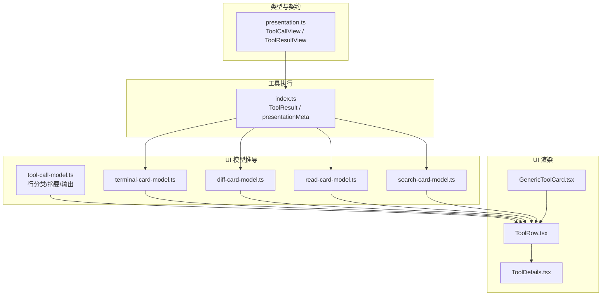
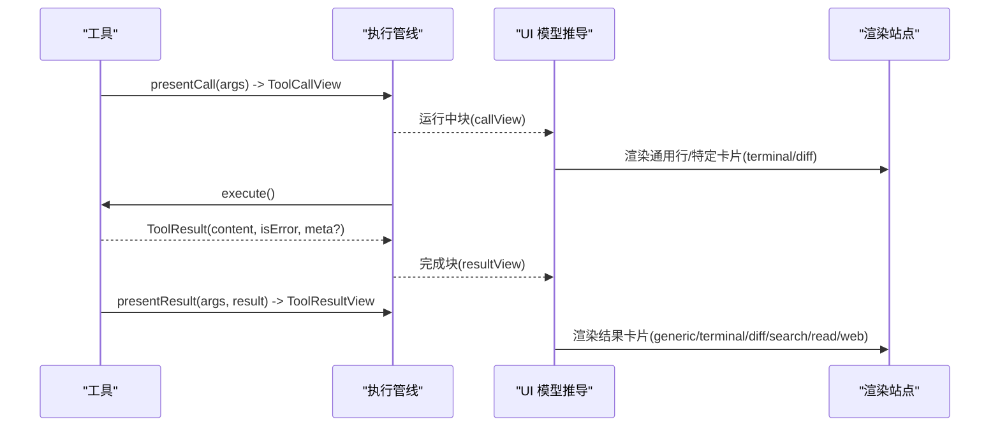
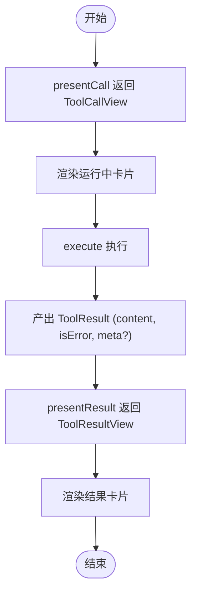
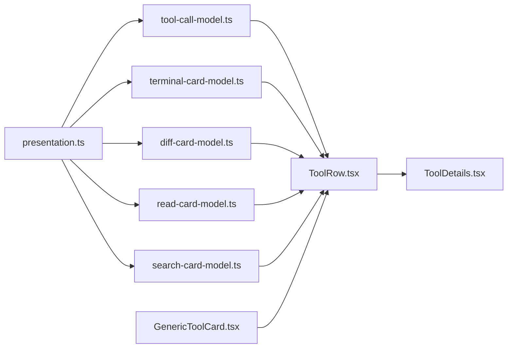

# 渲染意图联合类型

<cite>
**本文引用的文件**
- [packages/core/tools/src/presentation.ts](file://packages/core/tools/src/presentation.ts)
- [packages/core/tools/src/index.ts](file://packages/core/tools/src/index.ts)
- [packages/client/ui-tool/src/client/tool/models/tool-call-model.ts](file://packages/client/ui-tool/src/client/tool/models/tool-call-model.ts)
- [packages/client/ui-tool/src/client/tool/models/terminal-card-model.ts](file://packages/client/ui-tool/src/client/tool/models/terminal-card-model.ts)
- [packages/client/ui-tool/src/client/tool/models/diff-card-model.ts](file://packages/client/ui-tool/src/client/tool/models/diff-card-model.ts)
- [packages/client/ui-tool/src/client/tool/models/read-card-model.ts](file://packages/client/ui-tool/src/client/tool/models/read-card-model.ts)
- [packages/client/ui-tool/src/client/tool/models/search-card-model.ts](file://packages/client/ui-tool/src/client/tool/models/search-card-model.ts)
- [packages/client/ui-tool/src/client/tool/components/ToolRow.tsx](file://packages/client/ui-tool/src/client/tool/components/ToolRow.tsx)
- [packages/client/ui-tool/src/client/tool/toolviews/GenericToolCard.tsx](file://packages/client/ui-tool/src/client/tool/toolviews/GenericToolCard.tsx)
- [packages/client/ui-tool/src/client/tool/ToolDetails.tsx](file://packages/client/ui-tool/src/client/tool/ToolDetails.tsx)
- [packages/client/connection/src/client/fixture.ts](file://packages/client/connection/src/client/fixture.ts)
- [.agents/notes/implemented/architecture/2026-07-02-tool-render-intent-union.md](file://.agents/notes/implemented/architecture/2026-07-02-tool-render-intent-union.md)
- [docs/cookbook/adding-a-tool.md](file://docs/cookbook/adding-a-tool.md)
</cite>

## 目录
1. [简介](#简介)
2. [项目结构](#项目结构)
3. [核心组件](#核心组件)
4. [架构总览](#架构总览)
5. [详细组件分析](#详细组件分析)
6. [依赖关系分析](#依赖关系分析)
7. [性能考虑](#性能考虑)
8. [故障排查指南](#故障排查指南)
9. [结论](#结论)
10. [附录：类型定义与使用示例](#附录类型定义与使用示例)

## 简介
本文件系统化说明“渲染意图联合类型”的设计原理、实现机制与使用方式，覆盖以下要点：
- 为什么采用 card-tagged 的联合类型（closed union）来描述工具调用的待执行与已完成状态。
- 各类卡片类型的结构定义与适用场景：generic、terminal、diff、search、read、web。
- ToolCallView（调用时视图）与 ToolResultView（结果时视图）的接口规范与差异。
- 渲染意图在工具执行流程中的传递路径与作用点。
- 结合 UI 层的模型推导与渲染站点，给出端到端的数据流与交互行为。
- 提供类型定义与使用示例的路径指引，便于读者快速定位源码。

## 项目结构
围绕渲染意图的核心代码分布在三层：
- 类型与契约层：定义 ToolCallView 与 ToolResultView 及其子变体，位于 core/tools 的 presentation 模块。
- 工具执行层：工具执行管线产出 ToolResult（含 content、isError、meta），并在成功路径上可选地投影 presentationMeta，供 presentResult 使用。
- UI 呈现层：将 callView/resultView 转换为各卡片的展示模型（terminal/diff/read/search/web），并统一由 ToolRow 与详情面板渲染。

图表来源
- [packages/core/tools/src/presentation.ts:1-390](file://packages/core/tools/src/presentation.ts#L1-L390)
- [packages/core/tools/src/index.ts:290-302](file://packages/core/tools/src/index.ts#L290-L302)
- [packages/client/ui-tool/src/client/tool/models/tool-call-model.ts:1-241](file://packages/client/ui-tool/src/client/tool/models/tool-call-model.ts#L1-L241)
- [packages/client/ui-tool/src/client/tool/models/terminal-card-model.ts:1-220](file://packages/client/ui-tool/src/client/tool/models/terminal-card-model.ts#L1-L220)
- [packages/client/ui-tool/src/client/tool/models/diff-card-model.ts:1-98](file://packages/client/ui-tool/src/client/tool/models/diff-card-model.ts#L1-L98)
- [packages/client/ui-tool/src/client/tool/models/read-card-model.ts:1-77](file://packages/client/ui-tool/src/client/tool/models/read-card-model.ts#L1-L77)
- [packages/client/ui-tool/src/client/tool/models/search-card-model.ts:1-161](file://packages/client/ui-tool/src/client/tool/models/search-card-model.ts#L1-L161)
- [packages/client/ui-tool/src/client/tool/components/ToolRow.tsx:60-93](file://packages/client/ui-tool/src/client/tool/components/ToolRow.tsx#L60-L93)
- [packages/client/ui-tool/src/client/tool/toolviews/GenericToolCard.tsx:1-63](file://packages/client/ui-tool/src/client/tool/toolviews/GenericToolCard.tsx#L1-L63)
- [packages/client/ui-tool/src/client/tool/ToolDetails.tsx:1-55](file://packages/client/ui-tool/src/client/tool/ToolDetails.tsx#L1-L55)

章节来源
- [packages/core/tools/src/presentation.ts:1-390](file://packages/core/tools/src/presentation.ts#L1-L390)
- [packages/core/tools/src/index.ts:290-302](file://packages/core/tools/src/index.ts#L290-L302)
- [packages/client/ui-tool/src/client/tool/models/tool-call-model.ts:1-241](file://packages/client/ui-tool/src/client/tool/models/tool-call-model.ts#L1-L241)

## 核心组件
- 渲染意图联合类型
  - ToolCallView：调用时的渲染意图，包含 generic、terminal、diff 三种。
  - ToolResultView：完成后的渲染意图，包含 generic、terminal、diff、search、read、web 六种。
- 行级模型与分类
  - toolRowModel：根据工具名与块数据推导行变体、标题、摘要、展开体、输出、错误摘要与状态。
- 卡片模型推导
  - terminalCardModel：从 callView/resultView 推导终端卡片属性（命令、工作目录、输出、退出码/信号）。
  - diffCardModel：从 callView/resultView 推导差异卡片属性（hunks），并对数据进行健壮性校验。
  - readCardModel：仅结果侧存在，推导读文件卡片属性（路径、行窗口、语言提示等）。
  - searchCardModel：仅结果侧存在，推导搜索卡片属性（按文件分组匹配或路径列表），并处理截断恢复信息。
- 渲染站点
  - GenericToolCard：默认工具行，负责图标选择、摘要优先级、卡片展开体注入。
  - ToolRow：统一承载 terminal/diff/read/search/web 卡片，互斥渲染。
  - ToolDetails：详情面板中按卡片类型渲染结构化输出。

章节来源
- [packages/core/tools/src/presentation.ts:42-140](file://packages/core/tools/src/presentation.ts#L42-L140)
- [packages/core/tools/src/presentation.ts:140-390](file://packages/core/tools/src/presentation.ts#L140-L390)
- [packages/client/ui-tool/src/client/tool/models/tool-call-model.ts:16-98](file://packages/client/ui-tool/src/client/tool/models/tool-call-model.ts#L16-L98)
- [packages/client/ui-tool/src/client/tool/models/terminal-card-model.ts:41-75](file://packages/client/ui-tool/src/client/tool/models/terminal-card-model.ts#L41-L75)
- [packages/client/ui-tool/src/client/tool/models/diff-card-model.ts:24-36](file://packages/client/ui-tool/src/client/tool/models/diff-card-model.ts#L24-L36)
- [packages/client/ui-tool/src/client/tool/models/read-card-model.ts:19-36](file://packages/client/ui-tool/src/client/tool/models/read-card-model.ts#L19-L36)
- [packages/client/ui-tool/src/client/tool/models/search-card-model.ts:27-75](file://packages/client/ui-tool/src/client/tool/models/search-card-model.ts#L27-L75)
- [packages/client/ui-tool/src/client/tool/toolviews/GenericToolCard.tsx:20-63](file://packages/client/ui-tool/src/client/tool/toolviews/GenericToolCard.tsx#L20-L63)
- [packages/client/ui-tool/src/client/tool/components/ToolRow.tsx:60-93](file://packages/client/ui-tool/src/client/tool/components/ToolRow.tsx#L60-L93)
- [packages/client/ui-tool/src/client/tool/ToolDetails.tsx:19-55](file://packages/client/ui-tool/src/client/tool/ToolDetails.tsx#L19-L55)

## 架构总览
渲染意图贯穿“工具定义 → 执行管线 → UI 模型 → 渲染站点”的全链路：
- 工具通过 ToolDefinition.presentCall 返回调用时意图（ToolCallView），用于显示运行中的卡片。
- 工具执行完成后，管线产出 ToolResult（content、isError、meta），并可携带 presentationMeta。
- 工具通过 ToolDefinition.presentResult 基于 ToolResult 返回结果时意图（ToolResultView），用于替换或增强已完成状态的卡片。
- UI 层将 callView/resultView 分别推导为各卡片模型，并由 ToolRow/详情面板渲染。

图表来源
- [packages/core/tools/src/index.ts:290-302](file://packages/core/tools/src/index.ts#L290-L302)
- [packages/core/tools/src/index.ts:1792-1823](file://packages/core/tools/src/index.ts#L1792-L1823)
- [packages/client/ui-tool/src/client/tool/models/terminal-card-model.ts:156-220](file://packages/client/ui-tool/src/client/tool/models/terminal-card-model.ts#L156-L220)
- [packages/client/ui-tool/src/client/tool/models/diff-card-model.ts:62-98](file://packages/client/ui-tool/src/client/tool/models/diff-card-model.ts#L62-L98)
- [packages/client/ui-tool/src/client/tool/models/read-card-model.ts:38-77](file://packages/client/ui-tool/src/client/tool/models/read-card-model.ts#L38-L77)
- [packages/client/ui-tool/src/client/tool/models/search-card-model.ts:115-161](file://packages/client/ui-tool/src/client/tool/models/search-card-model.ts#L115-L161)

## 详细组件分析

### 渲染意图联合类型设计
- 设计原则
  - closed union：card 字段作为判别器，新增意图需修改桥接 switch，编译期报错避免静默丢弃。
  - 无效状态不可表示：例如 generic 不能携带终端输出；terminal 不能携带 diff。
  - 消费方只需 switch(card)，无需缝合多个可选字段。
- 关键类型
  - ToolCallView：generic、terminal、diff。
  - ToolResultView：generic、terminal、diff、search、read、web。
  - 辅助类型：ToolCallKind、FileLocation、FileDiff、ReadFileLine、SearchLineMatch、SearchFileMatches、WebSource。

章节来源
- [.agents/notes/implemented/architecture/2026-07-02-tool-render-intent-union.md:39-76](file://.agents/notes/implemented/architecture/2026-07-02-tool-render-intent-union.md#L39-L76)
- [packages/core/tools/src/presentation.ts:10-46](file://packages/core/tools/src/presentation.ts#L10-L46)
- [packages/core/tools/src/presentation.ts:120-140](file://packages/core/tools/src/presentation.ts#L120-L140)

### 各类卡片类型与适用场景
- generic
  - 用途：默认卡片，适用于大多数工具调用与结果。可携带标题、类别、原始输入、内容块、位置等。
  - 适用：非 terminal/diff 的调用；也可作为结果的通用回退。
- terminal
  - 用途：命令执行类工具（如 bash/pwsh）。调用时显示命令与工作目录，结果时显示输出与退出状态。
  - 注意：失败退出码不改变调用 isErrored，但会在行级以红色点提示。
- diff
  - 用途：文件写入/编辑类工具。调用时展示预期变更（旧文本可为 null），结果时展示已应用的 hunk。
- search
  - 用途：发现型工具（grep/glob）。仅在结果时出现，支持两种 shape：matches（按文件分组匹配）与 paths（扁平路径列表）。
  - 特性：携带 truncated/total 指示是否截断，并提供恢复信息（当被截断时）。
- read
  - 用途：文件读取类工具。结果时展示带行号、语法高亮提示的代码窗口。
- web
  - 用途：网络检索/抓取。区分 kind: search/fetch，承载结构化来源或抓取摘要。

章节来源
- [packages/core/tools/src/presentation.ts:48-118](file://packages/core/tools/src/presentation.ts#L48-L118)
- [packages/core/tools/src/presentation.ts:142-190](file://packages/core/tools/src/presentation.ts#L142-L190)
- [packages/core/tools/src/presentation.ts:192-267](file://packages/core/tools/src/presentation.ts#L192-L267)
- [packages/core/tools/src/presentation.ts:269-308](file://packages/core/tools/src/presentation.ts#L269-L308)
- [packages/core/tools/src/presentation.ts:310-390](file://packages/core/tools/src/presentation.ts#L310-L390)
- [docs/cookbook/adding-a-tool.md:71-82](file://docs/cookbook/adding-a-tool.md#L71-L82)

### ToolCallView 与 ToolResultView 接口规范
- ToolCallView（调用时）
  - generic：title、kind、rawInput、content、locations。
  - terminal：title、description、cwd。
  - diff：title、diffs、locations。
- ToolResultView（结果时）
  - generic：title、content。
  - terminal：title、output、exitCode、signal。
  - diff：title、diffs。
  - search：shape='matches' 或 'paths'，files/paths、truncated、total、title。
  - read：title、path、offset、lines、totalLines、lang、content。
  - web：kind='search'|'fetch'，sources/answer/truncated 或 url/statusCode/truncated/title。

章节来源
- [packages/core/tools/src/presentation.ts:48-118](file://packages/core/tools/src/presentation.ts#L48-L118)
- [packages/core/tools/src/presentation.ts:142-390](file://packages/core/tools/src/presentation.ts#L142-L390)

### 不同卡片类型的适用场景与数据格式要求
- generic
  - 场景：大多数工具调用与结果；无专用卡片时作为回退。
  - 数据：标题、可选类别、原始输入、内容块、文件位置。
- terminal
  - 场景：前台命令执行。
  - 数据：命令、描述、工作目录；结果包含输出、退出码或信号。
- diff
  - 场景：创建/修改文件。
  - 数据：每个文件的 oldText/newText；新文件 oldText 为 null。
- search
  - 场景：grep/glob 等发现任务。
  - 数据：按文件分组匹配或路径列表；必须携带 truncated/total。
- read
  - 场景：读取文件片段。
  - 数据：路径、偏移、行数组、总行数、语言提示；无能力 UI 回退到 content。
- web
  - 场景：web_search/web_fetch。
  - 数据：结构化来源或抓取摘要；无能力 UI 回退到原始结果内容。

章节来源
- [packages/core/tools/src/presentation.ts:48-390](file://packages/core/tools/src/presentation.ts#L48-L390)
- [packages/client/connection/src/client/fixture.ts:631-658](file://packages/client/connection/src/client/fixture.ts#L631-L658)

### 渲染意图在工具执行流程中的作用与传递机制
- 调用阶段
  - 工具返回 ToolCallView，UI 立即渲染运行中卡片（terminal/diff 或 generic）。
- 执行阶段
  - 执行管线产出 ToolResult，可能包含 presentationMeta（供 presentResult 使用）。
- 结果阶段
  - 工具返回 ToolResultView，UI 用其替换或增强已完成状态的卡片。
- 回退策略
  - 未知 card 值或无效数据会回退到 generic 路径，保证鲁棒性。

图表来源
- [packages/core/tools/src/index.ts:290-302](file://packages/core/tools/src/index.ts#L290-L302)
- [packages/core/tools/src/index.ts:1792-1823](file://packages/core/tools/src/index.ts#L1792-L1823)

章节来源
- [packages/core/tools/src/index.ts:290-302](file://packages/core/tools/src/index.ts#L290-L302)
- [packages/core/tools/src/index.ts:1792-1823](file://packages/core/tools/src/index.ts#L1792-L1823)

### 具体类型定义与使用示例（路径指引）
- 类型定义
  - ToolCallView/ToolResultView 及子类型：[packages/core/tools/src/presentation.ts:42-390](file://packages/core/tools/src/presentation.ts#L42-L390)
  - 工具执行结果与 presentationMeta：[packages/core/tools/src/index.ts:290-302](file://packages/core/tools/src/index.ts#L290-L302)
- 使用示例（映射与构造）
  - 工具调用与结果构造示例（read/edit/write/grep/glob/web）：[packages/client/connection/src/client/fixture.ts:631-658](file://packages/client/connection/src/client/fixture.ts#L631-L658)
  - 添加工具的文档说明（presentCall/presentResult 返回值约定）：[docs/cookbook/adding-a-tool.md:71-82](file://docs/cookbook/adding-a-tool.md#L71-L82)

章节来源
- [packages/core/tools/src/presentation.ts:42-390](file://packages/core/tools/src/presentation.ts#L42-L390)
- [packages/core/tools/src/index.ts:290-302](file://packages/core/tools/src/index.ts#L290-L302)
- [packages/client/connection/src/client/fixture.ts:631-658](file://packages/client/connection/src/client/fixture.ts#L631-L658)
- [docs/cookbook/adding-a-tool.md:71-82](file://docs/cookbook/adding-a-tool.md#L71-L82)

## 依赖关系分析
- 类型依赖
  - presentation.ts 是契约中心，被 UI 模型推导与渲染站点引用。
- 模型依赖
  - tool-call-model.ts 提供行级分类与摘要，被 GenericToolCard 与 ToolRow 引用。
  - 各卡片模型（terminal/diff/read/search）独立推导，互不耦合，统一输出给 ToolRow。
- 渲染依赖
  - ToolRow 接收多种卡片模型，按互斥规则渲染。
  - GenericToolCard 组合行级模型与各卡片模型，决定摘要优先级与展开体。
  - ToolDetails 在详情面板中按卡片类型渲染结构化输出。

图表来源
- [packages/core/tools/src/presentation.ts:42-390](file://packages/core/tools/src/presentation.ts#L42-L390)
- [packages/client/ui-tool/src/client/tool/models/tool-call-model.ts:16-98](file://packages/client/ui-tool/src/client/tool/models/tool-call-model.ts#L16-L98)
- [packages/client/ui-tool/src/client/tool/models/terminal-card-model.ts:156-220](file://packages/client/ui-tool/src/client/tool/models/terminal-card-model.ts#L156-L220)
- [packages/client/ui-tool/src/client/tool/models/diff-card-model.ts:62-98](file://packages/client/ui-tool/src/client/tool/models/diff-card-model.ts#L62-L98)
- [packages/client/ui-tool/src/client/tool/models/read-card-model.ts:38-77](file://packages/client/ui-tool/src/client/tool/models/read-card-model.ts#L38-L77)
- [packages/client/ui-tool/src/client/tool/models/search-card-model.ts:115-161](file://packages/client/ui-tool/src/client/tool/models/search-card-model.ts#L115-L161)
- [packages/client/ui-tool/src/client/tool/components/ToolRow.tsx:60-93](file://packages/client/ui-tool/src/client/tool/components/ToolRow.tsx#L60-L93)
- [packages/client/ui-tool/src/client/tool/toolviews/GenericToolCard.tsx:36-63](file://packages/client/ui-tool/src/client/tool/toolviews/GenericToolCard.tsx#L36-L63)
- [packages/client/ui-tool/src/client/tool/ToolDetails.tsx:19-55](file://packages/client/ui-tool/src/client/tool/ToolDetails.tsx#L19-L55)

章节来源
- [packages/client/ui-tool/src/client/tool/components/ToolRow.tsx:60-93](file://packages/client/ui-tool/src/client/tool/components/ToolRow.tsx#L60-L93)
- [packages/client/ui-tool/src/client/tool/toolviews/GenericToolCard.tsx:36-63](file://packages/client/ui-tool/src/client/tool/toolviews/GenericToolCard.tsx#L36-L63)
- [packages/client/ui-tool/src/client/tool/ToolDetails.tsx:19-55](file://packages/client/ui-tool/src/client/tool/ToolDetails.tsx#L19-L55)

## 性能考虑
- 行级摘要与展开体
  - toolRowModel 对 argsRaw 进行解析与裁剪，避免重复计算；对 code 变体直接提取程序体，减少 JSON 序列化开销。
- 卡片内容截断
  - 终端、差异、读取、搜索卡片在聊天行中均有限定最大行数常量（如 CHAT_*_MAX_LINES），保持消息流的可扫描性。
- 健壮性与回退
  - 各卡片模型对来自网络的未验证数据进行严格校验，异常时回退到 generic 路径，避免崩溃。

章节来源
- [packages/client/ui-tool/src/client/tool/models/tool-call-model.ts:119-202](file://packages/client/ui-tool/src/client/tool/models/tool-call-model.ts#L119-L202)
- [packages/client/ui-tool/src/client/tool/models/terminal-card-model.ts:156-220](file://packages/client/ui-tool/src/client/tool/models/terminal-card-model.ts#L156-L220)
- [packages/client/ui-tool/src/client/tool/models/diff-card-model.ts:38-60](file://packages/client/ui-tool/src/client/tool/models/diff-card-model.ts#L38-L60)
- [packages/client/ui-tool/src/client/tool/models/read-card-model.ts:19-29](file://packages/client/ui-tool/src/client/tool/models/read-card-model.ts#L19-L29)
- [packages/client/ui-tool/src/client/tool/models/search-card-model.ts:37-45](file://packages/client/ui-tool/src/client/tool/models/search-card-model.ts#L37-L45)

## 故障排查指南
- 常见症状与原因
  - 搜索结果未显示结构化卡片：检查 resultView.card 是否为 'search'，以及 shape 是否为 'matches'/'paths'；若为未知形状则回退 generic。
  - 终端卡片无输出：确认 resultView.card 为 'terminal'，且 output 存在；若 call 头被窗口裁剪，command 会回退至 title 或空字符串。
  - 差异卡片为空：检查 diffs 是否为有效数组且每条 hunk 具备 path/oldText/newText；否则回退 generic。
  - 读取卡片为空：read 卡片仅结果侧存在；运行中返回 null，属于正常。
- 定位建议
  - 查看对应卡片模型的推导函数返回值（null 表示走 generic）。
  - 核对 ToolResultView 的 card 与判别字段（shape/kind）是否与 UI 版本兼容。
  - 关注 truncated/total 与 recovery 信息，确保用户能访问被截断的结果。

章节来源
- [packages/client/ui-tool/src/client/tool/models/search-card-model.ts:77-96](file://packages/client/ui-tool/src/client/tool/models/search-card-model.ts#L77-L96)
- [packages/client/ui-tool/src/client/tool/models/search-card-model.ts:130-161](file://packages/client/ui-tool/src/client/tool/models/search-card-model.ts#L130-L161)
- [packages/client/ui-tool/src/client/tool/models/terminal-card-model.ts:156-220](file://packages/client/ui-tool/src/client/tool/models/terminal-card-model.ts#L156-L220)
- [packages/client/ui-tool/src/client/tool/models/diff-card-model.ts:38-60](file://packages/client/ui-tool/src/client/tool/models/diff-card-model.ts#L38-L60)
- [packages/client/ui-tool/src/client/tool/models/read-card-model.ts:38-77](file://packages/client/ui-tool/src/client/tool/models/read-card-model.ts#L38-L77)

## 结论
- card-tagged 联合类型为工具渲染提供了强约束、可扩展且易于消费的契约。
- 通过调用时与结果时两类视图，UI 可在不同阶段提供一致的体验，并在能力不足时优雅回退。
- 各卡片模型职责清晰、数据校验严谨，配合统一的 ToolRow 与详情面板，形成稳定高效的渲染体系。
- 新增卡片类型需同步更新桥接逻辑与 UI 分支，确保编译期可见性与一致性。

## 附录：类型定义与使用示例
- 类型定义路径
  - ToolCallView/ToolResultView 及子类型：[packages/core/tools/src/presentation.ts:42-390](file://packages/core/tools/src/presentation.ts#L42-L390)
  - 工具执行结果与 presentationMeta：[packages/core/tools/src/index.ts:290-302](file://packages/core/tools/src/index.ts#L290-L302)
- 使用示例路径
  - 工具调用与结果构造示例（read/edit/write/grep/glob/web）：[packages/client/connection/src/client/fixture.ts:631-658](file://packages/client/connection/src/client/fixture.ts#L631-L658)
  - 添加工具的文档说明（presentCall/presentResult 返回值约定）：[docs/cookbook/adding-a-tool.md:71-82](file://docs/cookbook/adding-a-tool.md#L71-L82)