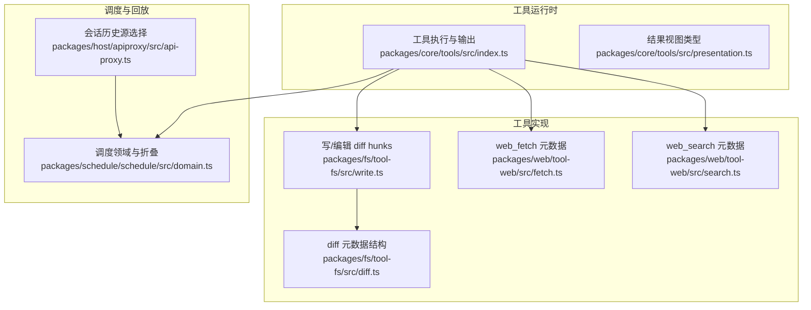
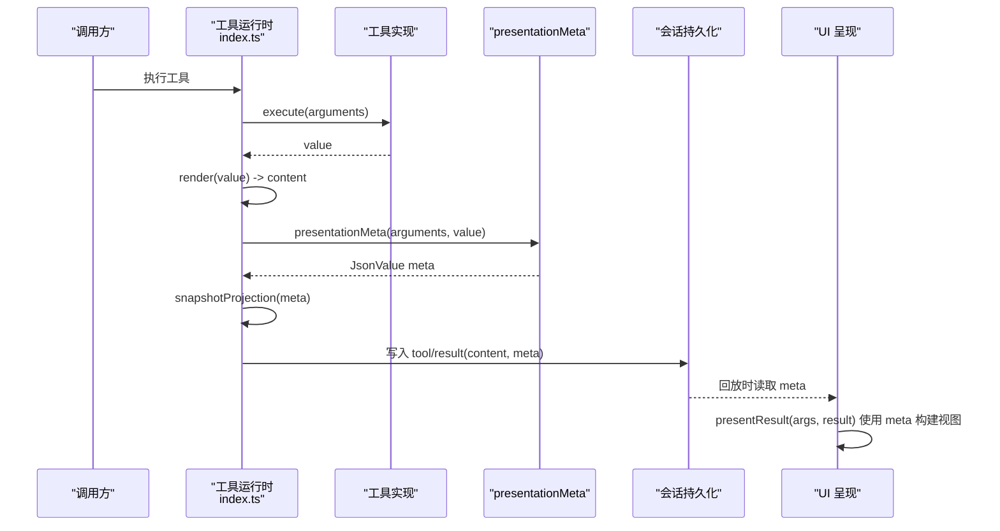
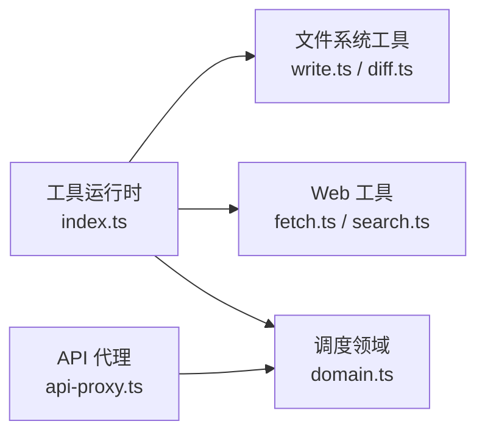

# 演示元数据

<cite>
**本文引用的文件**
- [packages/core/tools/src/index.ts](file://packages/core/tools/src/index.ts)
- [packages/core/tools/src/presentation.ts](file://packages/core/tools/src/presentation.ts)
- [packages/fs/tool-fs/src/diff.ts](file://packages/fs/tool-fs/src/diff.ts)
- [packages/fs/tool-fs/src/write.ts](file://packages/fs/tool-fs/src/write.ts)
- [packages/web/tool-web/src/fetch.ts](file://packages/web/tool-web/src/fetch.ts)
- [packages/web/tool-web/src/search.ts](file://packages/web/tool-web/src/search.ts)
- [packages/core/tools/tests/tools.spec.ts](file://packages/core/tools/tests/tools.spec.ts)
- [packages/core/agent-loop/tests/coverage-edges.spec.ts](file://packages/core/agent-loop/tests/coverage-edges.spec.ts)
- [packages/schedule/schedule/src/domain.ts](file://packages/schedule/schedule/src/domain.ts)
- [packages/schedule/schedule/tests/domain.spec.ts](file://packages/schedule/schedule/tests/domain.spec.ts)
- [packages/schedule/schedule/tests/invariant.spec.ts](file://packages/schedule/schedule/tests/invariant.spec.ts)
- [packages/host/apiproxy/src/api-proxy.ts](file://packages/host/apiproxy/src/api-proxy.ts)
- [.agents/notes/archived/architecture/2026-07-02-result-time-applied-hunk-diffs.md](file://.agents/notes/archived/architecture/2026-07-02-result-time-applied-hunk-diffs.md)
- [.agents/notes/implemented/feature/2026-07-30-search-render-card.md](file://.agents/notes/implemented/feature/2026-07-30-search-render-card.md)
- [.agents/notes/implemented/architecture/2026-07-20-canonical-tool-output-contract.md](file://.agents/notes/implemented/architecture/2026-07-20-canonical-tool-output-contract.md)
</cite>

## 目录
1. [简介](#简介)
2. [项目结构](#项目结构)
3. [核心组件](#核心组件)
4. [架构总览](#架构总览)
5. [详细组件分析](#详细组件分析)
6. [依赖关系分析](#依赖关系分析)
7. [性能考量](#性能考量)
8. [故障排查指南](#故障排查指南)
9. [结论](#结论)
10. [附录](#附录)

## 简介
本文件系统性说明“演示元数据”的设计与实现，聚焦 presentationMeta 的作用、可重放 JSON 的派生方式、result-time facts（结果时事实）在 write/edit 等 hunks 中的应用、持久化与回放中的元数据处理策略，以及嵌套 Code 调度中元数据投影器的跳过逻辑。文档同时给出最佳实践与常见陷阱，并附带具体实现位置与测试用例路径，帮助读者在不直接阅读源码的情况下理解整体机制。

## 项目结构
围绕演示元数据的关键代码分布在以下模块：
- 工具运行时与输出契约：定义 presentationMeta 的调用时机、快照与错误处理
- 文件系统工具：write/edit 的结果时 diff hunks 作为 meta 持久化
- Web 工具：web_search/web_fetch 的结构化来源与抓取摘要作为 meta 持久化
- 调度系统：schedule/change 事件的可重放与折叠，确保状态一致性
- API 代理：历史读取与呈现范围确定，支撑回放与呈现

图表来源
- [packages/core/tools/src/index.ts:1800-1823](file://packages/core/tools/src/index.ts#L1800-L1823)
- [packages/fs/tool-fs/src/write.ts:122-150](file://packages/fs/tool-fs/src/write.ts#L122-L150)
- [packages/fs/tool-fs/src/diff.ts:1-79](file://packages/fs/tool-fs/src/diff.ts#L1-L79)
- [packages/web/tool-web/src/fetch.ts:362-391](file://packages/web/tool-web/src/fetch.ts#L362-L391)
- [packages/web/tool-web/src/search.ts:104-139](file://packages/web/tool-web/src/search.ts#L104-L139)
- [packages/schedule/schedule/src/domain.ts:460-637](file://packages/schedule/schedule/src/domain.ts#L460-L637)
- [packages/host/apiproxy/src/api-proxy.ts:1525-1549](file://packages/host/apiproxy/src/api-proxy.ts#L1525-L1549)

章节来源
- [packages/core/tools/src/index.ts:1800-1823](file://packages/core/tools/src/index.ts#L1800-L1823)
- [packages/core/tools/src/presentation.ts:270-390](file://packages/core/tools/src/presentation.ts#L270-L390)
- [packages/fs/tool-fs/src/diff.ts:1-79](file://packages/fs/tool-fs/src/diff.ts#L1-L79)
- [packages/fs/tool-fs/src/write.ts:122-150](file://packages/fs/tool-fs/src/write.ts#L122-L150)
- [packages/web/tool-web/src/fetch.ts:362-391](file://packages/web/tool-web/src/fetch.ts#L362-L391)
- [packages/web/tool-web/src/search.ts:104-139](file://packages/web/tool-web/src/search.ts#L104-L139)
- [packages/schedule/schedule/src/domain.ts:460-637](file://packages/schedule/schedule/src/domain.ts#L460-L637)
- [packages/host/apiproxy/src/api-proxy.ts:1525-1549](file://packages/host/apiproxy/src/api-proxy.ts#L1525-L1549)

## 核心组件
- 工具输出契约与 presentationMeta
  - 工具必须声明 output.schema、output.render，可选 output.presentationMeta。presentationMeta 将模型侧 value 投影为可持久化的 JSON 元数据，用于回放时的结构化展示。
  - 仅在顶层调用（exec.parent === undefined）时计算 presentationMeta；嵌套调度会跳过，避免重复或不可重放的中间态进入模型上下文。
- 结果时事实（result-time facts）
  - 通过 tool/result 事件的 meta 字段持久化，例如 write/edit 的 diffs、web_search 的 sources、web_fetch 的 URL/状态码/截断标志。这些事实是 UI 在回放时重建卡片的基础。
- 回放与呈现
  - presentResult 从 result.meta 窄化为具体的结果视图（如 diff、read、web），保证回放与实时一致。
- 调度与历史
  - schedule/change 事件严格解码与折叠，确保可重放的一致性；API 代理根据会话头与事件决定呈现范围。

章节来源
- [packages/core/tools/src/index.ts:1800-1823](file://packages/core/tools/src/index.ts#L1800-L1823)
- [packages/core/tools/src/presentation.ts:270-390](file://packages/core/tools/src/presentation.ts#L270-L390)
- [packages/fs/tool-fs/src/diff.ts:1-79](file://packages/fs/tool-fs/src/diff.ts#L1-L79)
- [packages/web/tool-web/src/fetch.ts:362-391](file://packages/web/tool-web/src/fetch.ts#L362-L391)
- [packages/web/tool-web/src/search.ts:104-139](file://packages/web/tool-web/src/search.ts#L104-L139)
- [packages/schedule/schedule/src/domain.ts:460-637](file://packages/schedule/schedule/src/domain.ts#L460-L637)
- [packages/host/apiproxy/src/api-proxy.ts:1525-1549](file://packages/host/apiproxy/src/api-proxy.ts#L1525-L1549)

## 架构总览
下图展示了工具执行到结果元数据的完整流程，包括渲染、元数据投影、快照与最终结果物化。

图表来源
- [packages/core/tools/src/index.ts:1800-1823](file://packages/core/tools/src/index.ts#L1800-L1823)
- [packages/core/tools/src/presentation.ts:270-390](file://packages/core/tools/src/presentation.ts#L270-L390)

## 详细组件分析

### 工具运行时与 presentationMeta
- 作用与职责
  - 在成功执行后，若工具声明了 presentationMeta，则仅对顶层调用计算该元数据，并将其快照后附加到最终结果中。
  - 通过 snapshotProjection 确保元数据可被安全序列化（JSON 兼容），并在投影失败时抛出明确的工具输出错误。
- 关键行为
  - 仅在 exec.parent 未设置时计算 meta，避免嵌套调度污染模型上下文。
  - 错误处理：render 或 presentationMeta 抛错会被捕获并转换为统一的工具输出错误。
- 相关实现位置
  - 执行与投影：[packages/core/tools/src/index.ts:1800-1823](file://packages/core/tools/src/index.ts#L1800-L1823)
  - 错误与快照：[packages/core/tools/src/index.ts:525-539](file://packages/core/tools/src/index.ts#L525-L539)

章节来源
- [packages/core/tools/src/index.ts:1800-1823](file://packages/core/tools/src/index.ts#L1800-L1823)
- [packages/core/tools/src/index.ts:525-539](file://packages/core/tools/src/index.ts#L525-L539)

### 文件系统工具：write/edit 的 result-time hunks
- 设计理念
  - 将“应用后的上下文差异”作为 result-time fact 持久化，使 UI 能在回放时显示带上下文的 hunks，而非无上下文的片段替换。
  - 对于 create 或无法 diff 的二进制覆盖，回退到整文件 diff（oldText 为 null）。
- 数据结构
  - FsDiffMeta 包含 diffs 数组，每个 FileDiff 有 path、oldText、newText。
  - diffsFromMeta 负责防御性窄化，确保回放时不会因损坏的 meta 而崩溃。
- 呈现逻辑
  - presentResult 优先使用 meta 中的 diffs；若无 meta 则基于参数生成整文件 diff。
- 相关实现位置
  - 元数据结构与窄化：[packages/fs/tool-fs/src/diff.ts:1-79](file://packages/fs/tool-fs/src/diff.ts#L1-L79)
  - write 工具的 presentCall/presentResult：[packages/fs/tool-fs/src/write.ts:122-150](file://packages/fs/tool-fs/src/write.ts#L122-L150)

章节来源
- [packages/fs/tool-fs/src/diff.ts:1-79](file://packages/fs/tool-fs/src/diff.ts#L1-L79)
- [packages/fs/tool-fs/src/write.ts:122-150](file://packages/fs/tool-fs/src/write.ts#L122-L150)

### Web 工具：search/fetch 的元数据投影
- web_search
  - searchMetaFromValue 将搜索结果投影为 sources、truncated、answer 等字段，保持字节级一致的源形状，便于回放。
  - 搜索元数据有独立的字节预算控制，避免过大 meta 影响日志体积。
- web_fetch
  - fetchMetaFromValue 提取 url、statusCode、truncated，确保与渲染文本的截断一致，避免回放不一致。
  - fetchMetaFromResult 防御性窄化，异常情况下回退到通用卡片。
- 相关实现位置
  - 搜索元数据投影：[packages/web/tool-web/src/search.ts:104-139](file://packages/web/tool-web/src/search.ts#L104-L139)
  - 抓取元数据投影与窄化：[packages/web/tool-web/src/fetch.ts:362-391](file://packages/web/tool-web/src/fetch.ts#L362-L391)
  - 搜索元数据预算与回放回退说明：[.agents/notes/implemented/feature/2026-07-30-search-render-card.md:27-29](file://.agents/notes/implemented/feature/2026-07-30-search-render-card.md#L27-L29)

章节来源
- [packages/web/tool-web/src/search.ts:104-139](file://packages/web/tool-web/src/search.ts#L104-L139)
- [packages/web/tool-web/src/fetch.ts:362-391](file://packages/web/tool-web/src/fetch.ts#L362-L391)
- [.agents/notes/implemented/feature/2026-07-30-search-render-card.md:27-29](file://.agents/notes/implemented/feature/2026-07-30-search-render-card.md#L27-L29)

### 结果视图类型与回放
- ReadResultView、WebResultView 等定义了回放时可呈现的结构化视图。presentResult 从 meta 窄化为这些视图，确保回放与实时一致。
- 相关实现位置
  - 视图类型定义：[packages/core/tools/src/presentation.ts:270-390](file://packages/core/tools/src/presentation.ts#L270-L390)

章节来源
- [packages/core/tools/src/presentation.ts:270-390](file://packages/core/tools/src/presentation.ts#L270-L390)

### 嵌套 Code 调度中的元数据跳过
- 设计要点
  - 嵌套调度（exec.parent 存在）不计算 presentationMeta，也不产生独立的结果卡片；外层 run_code 仅保留最终内容，避免重复与不可重放的中间态。
  - 这保证了模型可见结果的唯一性与可重放性。
- 相关实现位置
  - 顶层判断与跳过：[packages/core/tools/src/index.ts:1806-1814](file://packages/core/tools/src/index.ts#L1806-L1814)
  - 设计说明（canonical tool output contract）：[.agents/notes/implemented/architecture/2026-07-20-canonical-tool-output-contract.md:37-37](file://.agents/notes/implemented/architecture/2026-07-20-canonical-tool-output-contract.md#L37-L37)

章节来源
- [packages/core/tools/src/index.ts:1806-1814](file://packages/core/tools/src/index.ts#L1806-L1814)
- [.agents/notes/implemented/architecture/2026-07-20-canonical-tool-output-contract.md:37-37](file://.agents/notes/implemented/architecture/2026-07-20-canonical-tool-output-contract.md#L37-L37)

### 调度系统与可重放一致性
- schedule/change 事件严格解码与折叠，确保创建、删除、分发的顺序与状态一致，避免回放中出现非法转换。
- 相关实现位置
  - 解码与折叠：[packages/schedule/schedule/src/domain.ts:460-637](file://packages/schedule/schedule/src/domain.ts#L460-L637)
  - 单元测试验证：[packages/schedule/schedule/tests/domain.spec.ts:117-147](file://packages/schedule/schedule/tests/domain.spec.ts#L117-L147)
  - 不变量测试：[packages/schedule/schedule/tests/invariant.spec.ts:50-68](file://packages/schedule/schedule/tests/invariant.spec.ts#L50-L68)

章节来源
- [packages/schedule/schedule/src/domain.ts:460-637](file://packages/schedule/schedule/src/domain.ts#L460-L637)
- [packages/schedule/schedule/tests/domain.spec.ts:117-147](file://packages/schedule/schedule/tests/domain.spec.ts#L117-L147)
- [packages/schedule/schedule/tests/invariant.spec.ts:50-68](file://packages/schedule/schedule/tests/invariant.spec.ts#L50-L68)

### API 代理与历史读取
- 决定单个转录读取的来源（附加会话或分离头与事件），以支持回放与呈现。
- 相关实现位置
  - 历史源选择：[packages/host/apiproxy/src/api-proxy.ts:1525-1549](file://packages/host/apiproxy/src/api-proxy.ts#L1525-L1549)

章节来源
- [packages/host/apiproxy/src/api-proxy.ts:1525-1549](file://packages/host/apiproxy/src/api-proxy.ts#L1525-L1549)

## 依赖关系分析
- 工具运行时依赖工具实现提供的 schema/render/presentationMeta，并将结果与元数据持久化。
- 文件系统与 Web 工具各自维护自己的元数据结构与窄化逻辑，确保回放健壮。
- 调度系统提供可重放的事件流，API 代理据此决定呈现范围。

图表来源
- [packages/core/tools/src/index.ts:1800-1823](file://packages/core/tools/src/index.ts#L1800-L1823)
- [packages/fs/tool-fs/src/write.ts:122-150](file://packages/fs/tool-fs/src/write.ts#L122-L150)
- [packages/fs/tool-fs/src/diff.ts:1-79](file://packages/fs/tool-fs/src/diff.ts#L1-L79)
- [packages/web/tool-web/src/fetch.ts:362-391](file://packages/web/tool-web/src/fetch.ts#L362-L391)
- [packages/web/tool-web/src/search.ts:104-139](file://packages/web/tool-web/src/search.ts#L104-L139)
- [packages/schedule/schedule/src/domain.ts:460-637](file://packages/schedule/schedule/src/domain.ts#L460-L637)
- [packages/host/apiproxy/src/api-proxy.ts:1525-1549](file://packages/host/apiproxy/src/api-proxy.ts#L1525-L1549)

章节来源
- [packages/core/tools/src/index.ts:1800-1823](file://packages/core/tools/src/index.ts#L1800-L1823)
- [packages/schedule/schedule/src/domain.ts:460-637](file://packages/schedule/schedule/src/domain.ts#L460-L637)
- [packages/host/apiproxy/src/api-proxy.ts:1525-1549](file://packages/host/apiproxy/src/api-proxy.ts#L1525-L1549)

## 性能考量
- 元数据大小控制
  - 搜索结果的 meta 需受字节预算限制，避免日志膨胀；当超出阈值时丢弃可丢弃项并标记 truncated。
- 内存占用
  - 覆盖操作在计算上下文 diff 时需持有前后文本，注意大文件场景下的内存压力。
- 回放一致性
  - 所有元数据必须 JSON 可序列化且幂等，确保回放与实时一致。

章节来源
- [.agents/notes/implemented/feature/2026-07-30-search-render-card.md:27-29](file://.agents/notes/implemented/feature/2026-07-30-search-render-card.md#L27-L29)
- [.agents/notes/archived/architecture/2026-07-02-result-time-applied-hunk-diffs.md:47-53](file://.agents/notes/archived/architecture/2026-07-02-result-time-applied-hunk-diffs.md#L47-L53)

## 故障排查指南
- 常见错误
  - 工具未声明 output.schema/render/presentationMeta：注册时会抛出类型错误。
  - presentationMeta 或 render 抛错：统一转换为工具输出错误，便于定位。
  - 元数据非 JSON 可序列化：快照阶段失败，导致结果错误。
- 排查步骤
  - 检查工具注册是否满足契约要求。
  - 确认 presentationMeta 返回值为纯 JSON 可序列化对象。
  - 查看回放日志中的 meta 是否完整与合法。
- 相关测试
  - 元数据记录与投影：[packages/core/agent-loop/tests/coverage-edges.spec.ts:364-379](file://packages/core/agent-loop/tests/coverage-edges.spec.ts#L364-L379)
  - 元数据缺失与错误处理：[packages/core/tools/tests/tools.spec.ts:100-156](file://packages/core/tools/tests/tools.spec.ts#L100-L156)
  - 投影器抛错处理：[packages/core/tools/tests/tools.spec.ts:284-299](file://packages/core/tools/tests/tools.spec.ts#L284-L299)

章节来源
- [packages/core/agent-loop/tests/coverage-edges.spec.ts:364-379](file://packages/core/agent-loop/tests/coverage-edges.spec.ts#L364-L379)
- [packages/core/tools/tests/tools.spec.ts:100-156](file://packages/core/tools/tests/tools.spec.ts#L100-L156)
- [packages/core/tools/tests/tools.spec.ts:284-299](file://packages/core/tools/tests/tools.spec.ts#L284-L299)

## 结论
演示元数据通过 presentationMeta 将工具结果投影为可持久化的 JSON，支撑回放时的结构化呈现。result-time facts（如 write/edit 的 hunks、web 工具的 sources）确保了 UI 的一致体验。嵌套调度跳过元数据投影，避免重复与不可重放。调度与 API 代理共同保障回放一致性。遵循最佳实践与规避常见陷阱，可在复杂场景中稳定运行。

## 附录
- 最佳实践
  - 始终声明 output.schema 与 output.render；如需结构化回放，补充 output.presentationMeta。
  - 元数据必须为纯 JSON 可序列化对象，避免函数、循环引用等。
  - 对可能较大的元数据实施预算控制（如搜索结果的 meta 字节上限）。
  - 在 presentResult 中防御性窄化 meta，确保回放健壮。
- 常见陷阱
  - 在嵌套调度中计算 presentationMeta，导致重复或不可重放。
  - 元数据与渲染文本不一致（如截断标志不同步）。
  - 忽略错误处理，导致回放时崩溃。
- 示例与测试
  - 元数据记录与投影：[packages/core/agent-loop/tests/coverage-edges.spec.ts:364-379](file://packages/core/agent-loop/tests/coverage-edges.spec.ts#L364-L379)
  - 文件系统 hunks 测试：[packages/fs/tool-fs/tests/tools.spec.ts:604-651](file://packages/fs/tool-fs/tests/tools.spec.ts#L604-L651)
  - 工具契约与错误处理：[packages/core/tools/tests/tools.spec.ts:100-299](file://packages/core/tools/tests/tools.spec.ts#L100-L299)