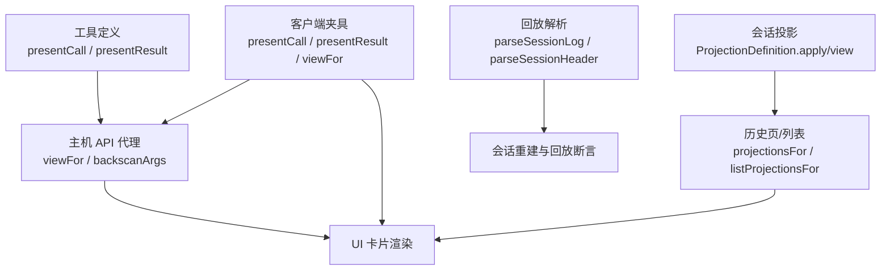
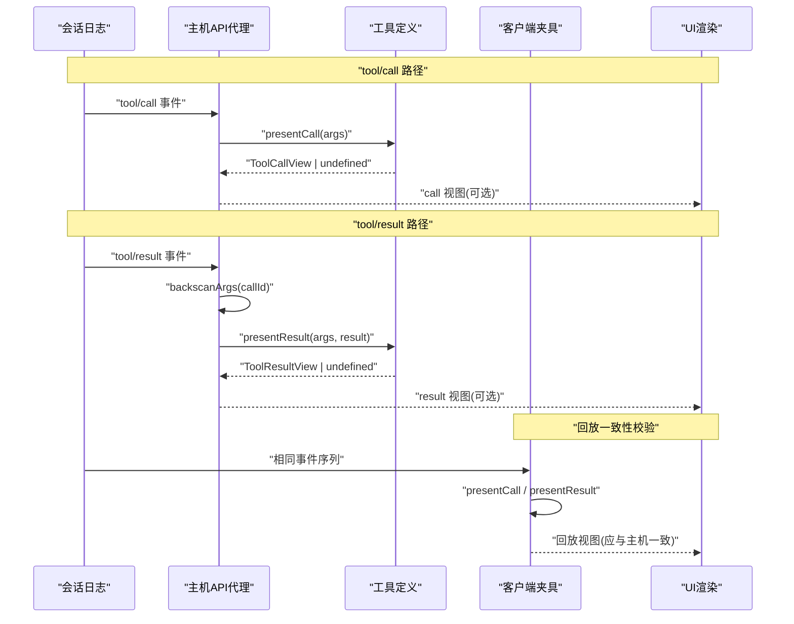
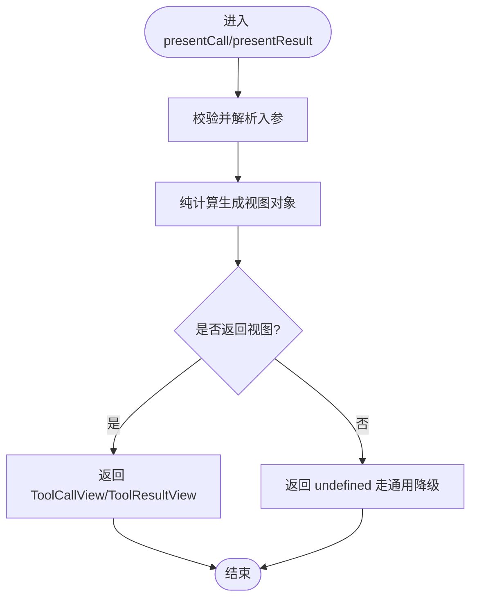
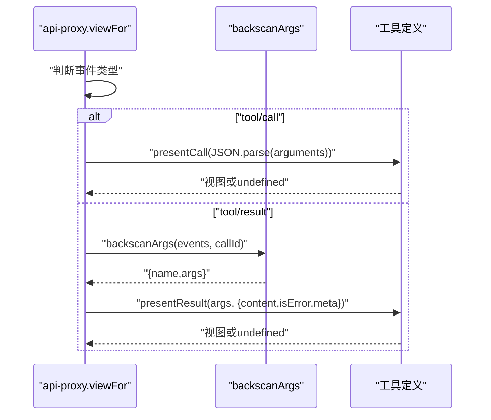
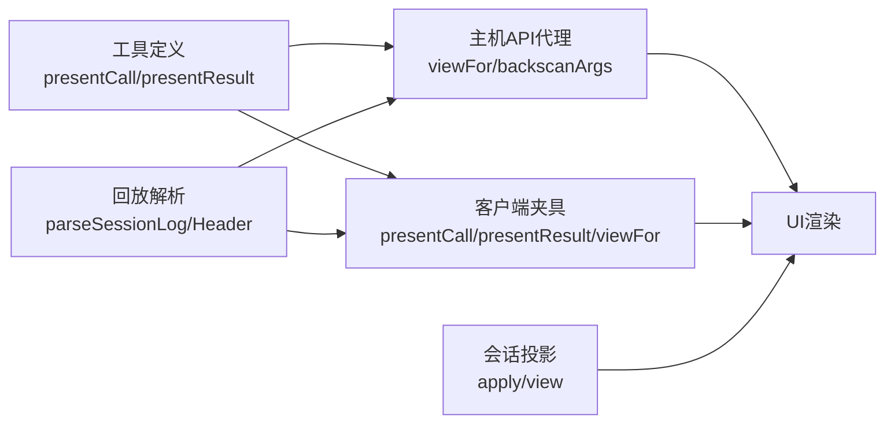

# 纯函数与回放

<cite>
**本文引用的文件**
- [packages/core/tools/src/index.ts](file://packages/core/tools/src/index.ts)
- [packages/core/tools/src/presentation.ts](file://packages/core/tools/src/presentation.ts)
- [packages/host/apiproxy/src/api-proxy.ts](file://packages/host/apiproxy/src/api-proxy.ts)
- [packages/client/connection/src/client/fixture.ts](file://packages/client/connection/src/client/fixture.ts)
- [docs/subsystems/session-projection.md](file://docs/subsystems/session-projection.md)
- [packages/test-support/llm-replay/src/index.ts](file://packages/test-support/llm-replay/src/index.ts)
- [packages/core/session/tests/session.spec.ts](file://packages/core/session/tests/session.spec.ts)
- [packages/core/session/tests/properties.spec.ts](file://packages/core/session/tests/properties.spec.ts)
- [examples/headless-agent/tests/session-format-guard.snapshot.ts](file://examples/headless-agent/tests/session-format-guard.snapshot.ts)
</cite>

## 目录
1. [简介](#简介)
2. [项目结构](#项目结构)
3. [核心组件](#核心组件)
4. [架构总览](#架构总览)
5. [详细组件分析](#详细组件分析)
6. [依赖关系分析](#依赖关系分析)
7. [性能考量](#性能考量)
8. [故障排查指南](#故障排查指南)
9. [结论](#结论)
10. [附录](#附录)

## 简介
本文件围绕“渲染器必须是纯函数”的约束展开，解释其在会话日志回放中的关键作用：presentCall 与 presentResult 必须在“实时流式”和“离线回放”两种执行环境中行为一致。为此，它们不得产生副作用、不得读取会话状态、不得访问 I/O、时钟或随机源。文档同时给出纯函数设计模式、测试策略，以及违反约束的检测与修复方法。

## 项目结构
与回放相关的代码主要分布在以下位置：
- 工具定义与呈现契约：packages/core/tools/src/index.ts、packages/core/tools/src/presentation.ts
- 主机侧回放与历史页渲染：packages/host/apiproxy/src/api-proxy.ts
- 客户端夹具（回放镜像）：packages/client/connection/src/client/fixture.ts
- 会话投影（纯函数状态机）：docs/subsystems/session-projection.md
- 回放数据解析与断言：packages/test-support/llm-replay/src/index.ts、packages/core/session/tests/*.spec.ts、examples/headless-agent/tests/session-format-guard.snapshot.ts

图表来源
- [packages/core/tools/src/index.ts:221-287](file://packages/core/tools/src/index.ts#L221-L287)
- [packages/host/apiproxy/src/api-proxy.ts:735-802](file://packages/host/apiproxy/src/api-proxy.ts#L735-L802)
- [packages/client/connection/src/client/fixture.ts:607-742](file://packages/client/connection/src/client/fixture.ts#L607-L742)
- [docs/subsystems/session-projection.md:9-55](file://docs/subsystems/session-projection.md#L9-L55)
- [packages/test-support/llm-replay/src/index.ts:158-191](file://packages/test-support/llm-replay/src/index.ts#L158-L191)

章节来源
- [packages/core/tools/src/index.ts:221-287](file://packages/core/tools/src/index.ts#L221-L287)
- [packages/host/apiproxy/src/api-proxy.ts:735-802](file://packages/host/apiproxy/src/api-proxy.ts#L735-L802)
- [packages/client/connection/src/client/fixture.ts:607-742](file://packages/client/connection/src/client/fixture.ts#L607-L742)
- [docs/subsystems/session-projection.md:9-55](file://docs/subsystems/session-projection.md#L9-L55)
- [packages/test-support/llm-replay/src/index.ts:158-191](file://packages/test-support/llm-replay/src/index.ts#L158-L191)

## 核心组件
- 工具呈现契约：ToolDefinition.presentCall / presentResult 是 UI 呈现意图声明点，必须为纯函数且仅依赖入参。
- 主机回放路径：api-proxy.viewFor 通过 argsFor 获取调用参数，并调用 presentCall / presentResult；失败时软降级到通用卡片。
- 客户端夹具镜像：client fixture 提供与主机一致的 presentCall / presentResult / viewFor，用于回放一致性验证。
- 会话投影：ProjectionDefinition.apply / view 为同步纯函数，驱动可重放的状态机。
- 回放数据：llm-replay.parseSessionLog / parseSessionHeader 将持久化日志解析为事件序列，供回放与断言使用。

章节来源
- [packages/core/tools/src/index.ts:221-287](file://packages/core/tools/src/index.ts#L221-L287)
- [packages/host/apiproxy/src/api-proxy.ts:735-802](file://packages/host/apiproxy/src/api-proxy.ts#L735-L802)
- [packages/client/connection/src/client/fixture.ts:607-742](file://packages/client/connection/src/client/fixture.ts#L607-L742)
- [docs/subsystems/session-projection.md:9-55](file://docs/subsystems/session-projection.md#L9-L55)
- [packages/test-support/llm-replay/src/index.ts:158-191](file://packages/test-support/llm-replay/src/index.ts#L158-L191)

## 架构总览
下图展示一次 tool/call → tool/result 在“实时”和“回放”两条路径上的呈现流程，强调 presentCall/presentResult 的纯函数约束与一致性。

图表来源
- [packages/host/apiproxy/src/api-proxy.ts:735-802](file://packages/host/apiproxy/src/api-proxy.ts#L735-L802)
- [packages/client/connection/src/client/fixture.ts:607-742](file://packages/client/connection/src/client/fixture.ts#L607-L742)

## 详细组件分析

### presentCall 与 presentResult 的纯函数约束
- presentCall：仅以解析后的 args 为输入，返回 ToolCallView 或 undefined。不得读取外部状态、I/O、时间或随机数。
- presentResult：以 args 与结果元信息为输入，返回 ToolResultView 或 undefined。同样禁止副作用。
- 原因：两者在“实时流式”和“会话回放”中都会被调用；若存在副作用或不稳定依赖，回放将不可重现。

图表来源
- [packages/core/tools/src/index.ts:221-287](file://packages/core/tools/src/index.ts#L221-L287)
- [packages/core/tools/src/presentation.ts:42-140](file://packages/core/tools/src/presentation.ts#L42-L140)

章节来源
- [packages/core/tools/src/index.ts:221-287](file://packages/core/tools/src/index.ts#L221-L287)
- [packages/core/tools/src/presentation.ts:42-140](file://packages/core/tools/src/presentation.ts#L42-L140)

### 主机侧回放：viewFor 与 backscanArgs
- viewFor：对 tool/call 直接调用 presentCall；对 tool/result 先通过 backscanArgs 找到对应 call 的 args，再调用 presentResult。任何异常均软降级为无视图。
- backscanArgs：从当前页面窗口的事件中向后扫描匹配 callId，提取 name 与 parsed args。跨页未配对时返回 undefined。

图表来源
- [packages/host/apiproxy/src/api-proxy.ts:735-802](file://packages/host/apiproxy/src/api-proxy.ts#L735-L802)

章节来源
- [packages/host/apiproxy/src/api-proxy.ts:735-802](file://packages/host/apiproxy/src/api-proxy.ts#L735-L802)

### 客户端夹具镜像：回放一致性
- client fixture 实现与主机一致的 presentCall / presentResult / viewFor，确保回放端与主机端对同一事件序列产生相同的视图。
- 对于 search/web/read 等结果型视图，夹具按工具名与约定构造结构化视图，保证回放与真实运行一致。

章节来源
- [packages/client/connection/src/client/fixture.ts:607-742](file://packages/client/connection/src/client/fixture.ts#L607-L742)

### 会话投影：纯函数状态机
- ProjectionDefinition 要求 apply 与 view 均为同步纯函数；state 必须为可序列化 JSON。框架在每个提交事件上驱动 apply，并在值变化时通知消费者。
- 该机制确保回放与实时的一致性：只要 apply/view 是纯函数，任意事件序列都可被重放得到确定状态。

章节来源
- [docs/subsystems/session-projection.md:9-55](file://docs/subsystems/session-projection.md#L9-L55)

### 回放数据解析与断言
- parseSessionLog：解析 .jsonl 为 SessionEvent[]，跳过首行 header，展开压缩块，保持顺序。
- parseSessionHeader：读取 id、createdAt、seedLength，用于回放身份与长度校验。
- 会话属性测试：验证 seq 单调连续、replay-from-seed 推导一致、重复 seed 不增长等。

章节来源
- [packages/test-support/llm-replay/src/index.ts:158-191](file://packages/test-support/llm-replay/src/index.ts#L158-L191)
- [packages/core/session/tests/properties.spec.ts:102-129](file://packages/core/session/tests/properties.spec.ts#L102-L129)
- [packages/core/session/tests/session.spec.ts:518-533](file://packages/core/session/tests/session.spec.ts#L518-L533)
- [examples/headless-agent/tests/session-format-guard.snapshot.ts:30-52](file://examples/headless-agent/tests/session-format-guard.snapshot.ts#L30-L52)

## 依赖关系分析
- 工具定义层（index.ts）导出 ToolDefinition 及其呈现接口，作为回放与实时共享的契约。
- 主机 API 代理（api-proxy.ts）消费工具定义，负责回放时的参数配对与视图生成。
- 客户端夹具（fixture.ts）镜像主机逻辑，用于端到端回放一致性验证。
- 会话投影（session-projection.md）提供纯函数状态机，支撑回放与缓存。
- 回放解析（llm-replay）提供从持久化日志到事件序列的转换，支撑回放断言。

图表来源
- [packages/core/tools/src/index.ts:221-287](file://packages/core/tools/src/index.ts#L221-L287)
- [packages/host/apiproxy/src/api-proxy.ts:735-802](file://packages/host/apiproxy/src/api-proxy.ts#L735-L802)
- [packages/client/connection/src/client/fixture.ts:607-742](file://packages/client/connection/src/client/fixture.ts#L607-L742)
- [docs/subsystems/session-projection.md:9-55](file://docs/subsystems/session-projection.md#L9-L55)
- [packages/test-support/llm-replay/src/index.ts:158-191](file://packages/test-support/llm-replay/src/index.ts#L158-L191)

## 性能考量
- 回放路径应避免昂贵 I/O：presentCall/presentResult 应只做轻量纯计算，避免网络、磁盘、随机或时间相关操作。
- 投影 apply/view 必须同步且纯，以保证快照一致性与零额外开销。
- 回退策略：当 presenter 抛出或参数无法解析时，系统软降级到通用视图，避免阻塞回放。

## 故障排查指南
- 症状：回放视图与实时不一致
  - 检查 presentCall/presentResult 是否读取了外部状态、I/O、时间或随机源。
  - 确认 host 与 client fixture 的实现保持一致。
- 症状：回放中断或视图缺失
  - 查看 api-proxy.viewFor 的异常捕获与降级路径，确认是否存在 presenter 抛错或参数解析失败。
- 症状：回放顺序或身份错误
  - 使用 llm-replay 的 parseSessionLog/Header 校验事件序列与头信息。
  - 通过 session 属性测试验证 seq 单调性与 replay-from-seed 一致性。

章节来源
- [packages/host/apiproxy/src/api-proxy.ts:735-802](file://packages/host/apiproxy/src/api-proxy.ts#L735-L802)
- [packages/test-support/llm-replay/src/index.ts:158-191](file://packages/test-support/llm-replay/src/index.ts#L158-L191)
- [packages/core/session/tests/properties.spec.ts:102-129](file://packages/core/session/tests/properties.spec.ts#L102-L129)
- [packages/core/session/tests/session.spec.ts:518-533](file://packages/core/session/tests/session.spec.ts#L518-L533)

## 结论
- presentCall 与 presentResult 必须是纯函数：仅依赖入参，不产生副作用，确保回放确定性。
- 回放一致性由主机与客户端夹具共同保障：二者对同一事件序列应产生相同视图。
- 会话投影采用纯函数状态机，支持高效、可重放的状态计算。
- 通过回放解析与属性测试，可在 CI 中持续验证回放正确性。
- 违反纯函数约束时应尽快定位并修复，优先采用注入可控依赖与参数化测试来隔离不稳定因素。

## 附录

### 纯函数设计模式
- 只读入参：所有可变上下文通过参数传入，不在闭包中读取外部状态。
- 无副作用：不调用 I/O、网络、文件系统、随机数、时间；如需，改为参数注入或测试替身。
- 幂等与可重放：相同输入始终产生相同输出，便于回放与断言。
- 明确降级：当输入无效或缺失时返回 undefined，交由上层统一处理。

### 测试策略
- 回放一致性测试：对同一 .jsonl 事件序列，比较主机与客户端夹具生成的视图。
- 属性测试：验证会话事件序列的单调性、连续性、replay-from-seed 一致性。
- 边界用例：非法参数、缺失字段、跨页未配对等场景下的降级行为。
- 快照测试：固定预期视图，防止无意改动破坏回放一致性。

### 违规检测与修复
- 静态检查：在构建阶段扫描 presentCall/presentResult 是否包含 I/O、时间、随机等调用。
- 运行时守卫：在回放路径增加白名单校验，拒绝非纯函数调用。
- 修复建议：
  - 将外部依赖抽象为接口并通过参数注入。
  - 将时间/随机源替换为确定性种子或测试替身。
  - 拆分复杂逻辑为纯函数组合，逐步消除副作用。