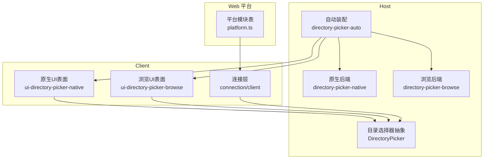
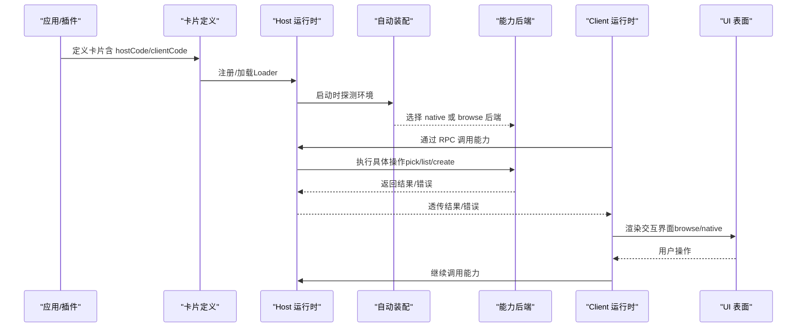
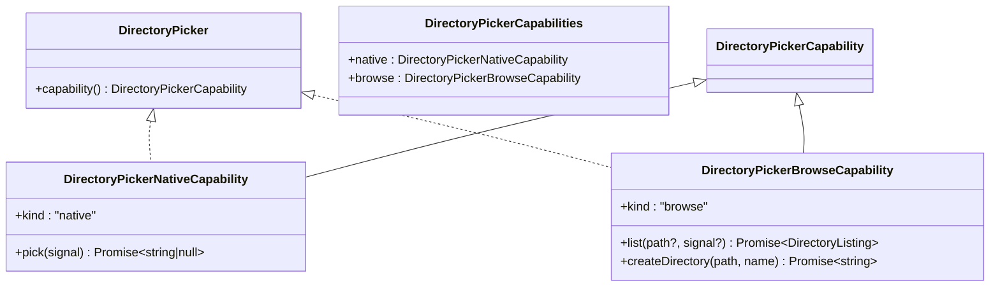
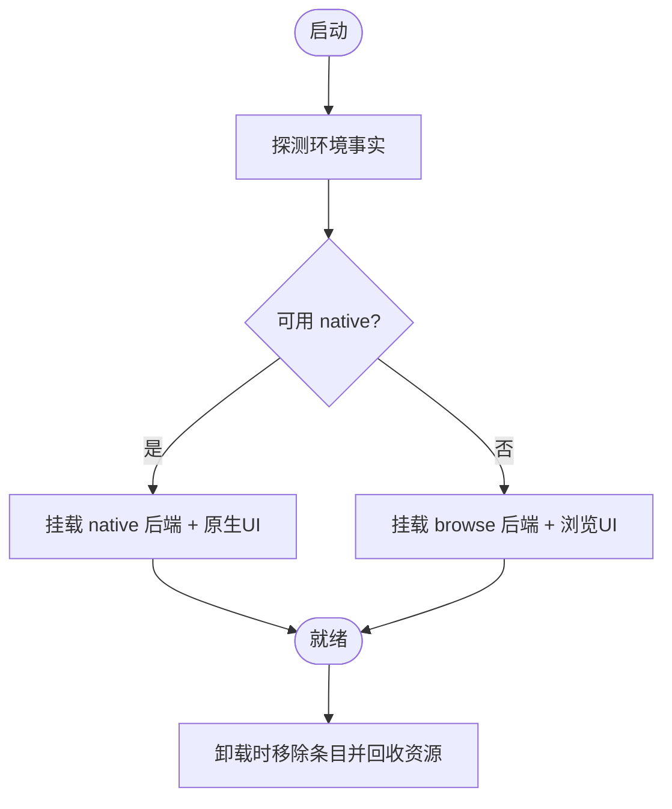
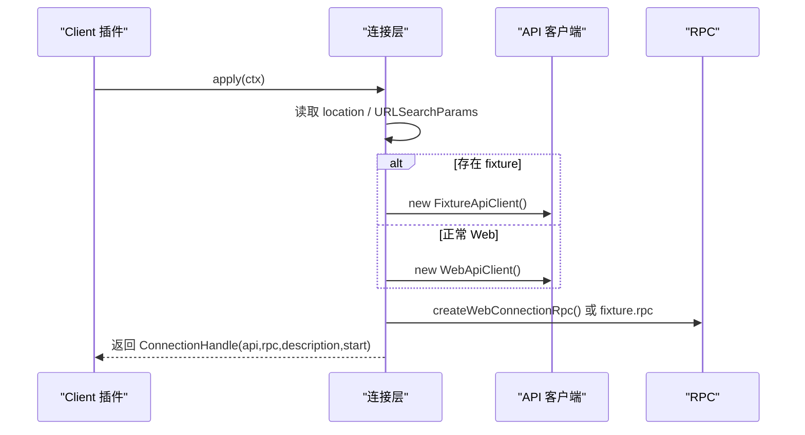
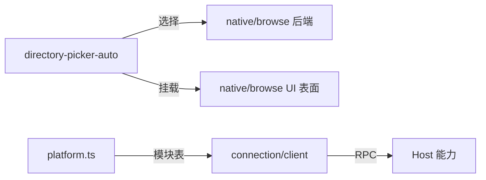

# 跨平台适配

<cite>
**本文引用的文件**
- [packages/host/directory-picker/src/index.ts](file://packages/host/directory-picker/src/index.ts)
- [packages/host/directory-picker-auto/src/index.ts](file://packages/host/directory-picker-auto/src/index.ts)
- [packages/client/ui-directory-picker-browse/src/index.ts](file://packages/client/ui-directory-picker-browse/src/index.ts)
- [packages/client/ui-directory-picker-native/src/index.ts](file://packages/client/ui-directory-picker-native/src/index.ts)
- [packages/client/web/src/platform.ts](file://packages/client/web/src/platform.ts)
- [packages/client/connection/src/client/index.ts](file://packages/client/connection/src/client/index.ts)
- [docs/subsystems/web.md](file://docs/subsystems/web.md)
- [.agents/notes/implemented/architecture/2026-07-19-gui-layering-and-rpc-protocol.md](file://.agents/notes/implemented/architecture/2026-07-19-gui-layering-and-rpc-protocol.md)
</cite>

## 目录
1. [简介](#简介)
2. [项目结构](#项目结构)
3. [核心组件](#核心组件)
4. [架构总览](#架构总览)
5. [详细组件分析](#详细组件分析)
6. [依赖关系分析](#依赖关系分析)
7. [性能考量](#性能考量)
8. [故障排查指南](#故障排查指南)
9. [结论](#结论)
10. [附录](#附录)

## 简介
本文件面向“跨平台适配”主题，聚焦 host/client 运行时如何将“卡片（card）”映射到各自视图，并解释不同平台的渲染差异与兼容性处理。文档围绕能力抽象层、能力检测与降级策略、RPC 传输与页面模式、以及测试与兼容性验证展开，提供可操作的实践建议与示例路径。

## 项目结构
仓库采用“host/client 双端 + 能力抽象 + 自动装配”的分层组织：
- Host 侧暴露能力接口（如目录选择器），并提供多种后端实现（原生对话框、浏览器内浏览）。
- Client 侧提供与宿主能力对应的 UI 表面（native/browse 两种交互面）。
- 自动装配插件在启动时探测运行环境，动态挂载匹配的 host 后端与 client 表面，确保同一能力在不同平台拥有一致的使用体验。
- Web 平台通过共享模块表与 Vite 别名管理外部依赖，保证冻结的模块身份一致。
- 连接层根据页面模式（Web/Headless/Fixture）选择 RPC 实现，屏蔽传输细节。

**图表来源**
- [packages/host/directory-picker/src/index.ts:1-144](file://packages/host/directory-picker/src/index.ts#L1-L144)
- [packages/host/directory-picker-auto/src/index.ts:1-99](file://packages/host/directory-picker-auto/src/index.ts#L1-L99)
- [packages/client/ui-directory-picker-browse/src/index.ts:1-11](file://packages/client/ui-directory-picker-browse/src/index.ts#L1-L11)
- [packages/client/ui-directory-picker-native/src/index.ts:1-11](file://packages/client/ui-directory-picker-native/src/index.ts#L1-L11)
- [packages/client/web/src/platform.ts:1-19](file://packages/client/web/src/platform.ts#L1-L19)
- [packages/client/connection/src/client/index.ts:80-115](file://packages/client/connection/src/client/index.ts#L80-L115)

**章节来源**
- [packages/host/directory-picker/src/index.ts:1-144](file://packages/host/directory-picker/src/index.ts#L1-L144)
- [packages/host/directory-picker-auto/src/index.ts:1-99](file://packages/host/directory-picker-auto/src/index.ts#L1-L99)
- [packages/client/ui-directory-picker-browse/src/index.ts:1-11](file://packages/client/ui-directory-picker-browse/src/index.ts#L1-L11)
- [packages/client/ui-directory-picker-native/src/index.ts:1-11](file://packages/client/ui-directory-picker-native/src/index.ts#L1-L11)
- [packages/client/web/src/platform.ts:1-19](file://packages/client/web/src/platform.ts#L1-L19)
- [packages/client/connection/src/client/index.ts:80-115](file://packages/client/connection/src/client/index.ts#L80-L115)

## 核心组件
- 目录选择器能力抽象（Host）
  - 定义 native 与 browse 两类能力形态，统一入口 capability()，消费者按 kind 分支调用。
  - 错误模型集中（DirectoryPickerError），业务码封闭，便于跨端一致处理。
- 自动装配（Host）
  - 启动时探测绑定主机、平台、显示会话、Linux 选择器二进制等事实，决定使用 native 或 browse。
  - 动态创建 Loader 条目，将后端与对应 UI 表面成对挂载；卸载时有序销毁。
- 客户端 UI 表面（Client）
  - 纯 UI 插件，空 apply 占位以进入宿主配置树；实际交互逻辑由 exports["./client"] 驱动。
  - 针对 native/browse 分别提供 UI 面，与宿主能力一一对应。
- Web 平台模块表（Client/Web）
  - 声明共享模块白名单，供 Seeding/Bundling/Vite 别名使用，避免模块身份漂移。
- 连接层（Client）
  - 根据 location 与 URLSearchParams 判断是否为 fixture 模式，选择 FixtureApiClient 或 WebApiClient。
  - 暴露 ctx.connection，维护 hostDescription 快照与订阅，封装 RPC 通道。

**章节来源**
- [packages/host/directory-picker/src/index.ts:1-144](file://packages/host/directory-picker/src/index.ts#L1-L144)
- [packages/host/directory-picker-auto/src/index.ts:1-99](file://packages/host/directory-picker-auto/src/index.ts#L1-L99)
- [packages/client/ui-directory-picker-browse/src/index.ts:1-11](file://packages/client/ui-directory-picker-browse/src/index.ts#L1-L11)
- [packages/client/ui-directory-picker-native/src/index.ts:1-11](file://packages/client/ui-directory-picker-native/src/index.ts#L1-L11)
- [packages/client/web/src/platform.ts:1-19](file://packages/client/web/src/platform.ts#L1-L19)
- [packages/client/connection/src/client/index.ts:80-115](file://packages/client/connection/src/client/index.ts#L80-L115)

## 架构总览
下图展示从“卡片定义”到“宿主能力”再到“客户端视图”的端到端流程，体现 host/client 运行时如何协作完成跨平台映射。

**图表来源**
- [packages/host/directory-picker-auto/src/index.ts:1-99](file://packages/host/directory-picker-auto/src/index.ts#L1-L99)
- [packages/host/directory-picker/src/index.ts:1-144](file://packages/host/directory-picker/src/index.ts#L1-L144)
- [packages/client/connection/src/client/index.ts:80-115](file://packages/client/connection/src/client/index.ts#L80-L115)

## 详细组件分析

### 能力抽象层：目录选择器
- 设计要点
  - 以 discriminated union 表达能力形态（native/browse），新增能力只需扩展类型与实现，不改动调用方。
  - 错误码封闭且可枚举，便于跨端统一处理。
  - 服务单例注册于上下文，生命周期稳定，允许跨调用复用。
- 复杂度与性能
  - 能力选择为 O(1) 分支；浏览列表支持截断标记 truncated，避免全量扫描。
- 错误处理
  - 抛出 DirectoryPickerError，携带 code/path/message，调用方可据此做降级或提示。

**图表来源**
- [packages/host/directory-picker/src/index.ts:1-144](file://packages/host/directory-picker/src/index.ts#L1-L144)

**章节来源**
- [packages/host/directory-picker/src/index.ts:1-144](file://packages/host/directory-picker/src/index.ts#L1-L144)

### 自动装配：能力检测与降级
- 检测维度
  - 绑定主机（webServer.host）、平台（process.platform）、环境变量（PATH）、是否存在 Linux 选择器二进制。
- 决策与挂载
  - 解析出 backend 后，动态创建 Loader 条目，先挂载后端，再挂载对应 UI 表面，形成完整交互对。
  - effect 返回清理函数，移除条目并等待纤维（fiber）收尾，保证卸载安全。
- 降级策略
  - 若无法使用 native（无 GUI/远程/无二进制），则回退到 browse；未知 kind 默认隐藏入口而非失败。

**图表来源**
- [packages/host/directory-picker-auto/src/index.ts:1-99](file://packages/host/directory-picker-auto/src/index.ts#L1-L99)

**章节来源**
- [packages/host/directory-picker-auto/src/index.ts:1-99](file://packages/host/directory-picker-auto/src/index.ts#L1-L99)

### 客户端连接与页面模式
- 页面模式识别
  - 通过 location 与 URLSearchParams('fixture') 判断是否处于 fixture 模式，从而选择模拟 API 客户端。
- 连接句柄
  - 暴露 api、rpc、isLoopback、hostDescription（getSnapshot/subscribe），start(sinks, config) 负责初始化。
- 传输无关性
  - 上层仅依赖 IApiClient 与 rpc，屏蔽 HTTP/IPC/本地进程等差异。

**图表来源**
- [packages/client/connection/src/client/index.ts:80-115](file://packages/client/connection/src/client/index.ts#L80-L115)

**章节来源**
- [packages/client/connection/src/client/index.ts:80-115](file://packages/client/connection/src/client/index.ts#L80-L115)

### Web 平台模块表与外部依赖
- 作用
  - 声明共享模块白名单，供 Seeding、Bundling、Vite 别名使用，确保模块标识在冻结表中一致。
- 影响范围
  - react、react-dom、@deepseek-ai/cordis、UI 组件库等关键依赖被显式列出，避免重复注入或版本漂移。

**章节来源**
- [packages/client/web/src/platform.ts:1-19](file://packages/client/web/src/platform.ts#L1-L19)

### 能力可用性检测与提供者选择
- 原则
  - provider.available() 为轻量本地检查（凭据、配置解析），禁止网络调用。
  - 选择基于明确 provider id 或唯一可用提供者；多候选未配置 id 时返回歧义错误。
- 与跨平台的关系
  - 能力可用性判定与平台无关，但具体实现可能受平台限制；通过能力抽象与自动装配屏蔽差异。

**章节来源**
- [docs/subsystems/web.md:120-124](file://docs/subsystems/web.md#L120-L124)

## 依赖关系分析
- 松耦合
  - 能力抽象与实现解耦；自动装配仅在启动期决定具体实现。
  - 客户端 UI 表面与宿主能力通过约定接口通信，不直接依赖具体后端。
- 关键依赖链
  - directory-picker-auto → 探测 → 选择 → loader.create → 后端/表面
  - connection/client → 页面模式 → API/RPC → 宿主能力
  - platform.ts → 构建期/运行期模块表 → 依赖一致性

**图表来源**
- [packages/host/directory-picker-auto/src/index.ts:1-99](file://packages/host/directory-picker-auto/src/index.ts#L1-L99)
- [packages/client/connection/src/client/index.ts:80-115](file://packages/client/connection/src/client/index.ts#L80-L115)
- [packages/client/web/src/platform.ts:1-19](file://packages/client/web/src/platform.ts#L1-L19)

**章节来源**
- [packages/host/directory-picker-auto/src/index.ts:1-99](file://packages/host/directory-picker-auto/src/index.ts#L1-L99)
- [packages/client/connection/src/client/index.ts:80-115](file://packages/client/connection/src/client/index.ts#L80-L115)
- [packages/client/web/src/platform.ts:1-19](file://packages/client/web/src/platform.ts#L1-L19)

## 性能考量
- 能力选择为常量时间分支，开销极低。
- 浏览列表支持截断（truncated），避免一次性加载大量目录项。
- 自动装配仅在启动阶段执行一次，后续切换通过 Loader 动态卸载/挂载，避免冷启动成本。
- 连接层缓存 hostDescription 快照，减少重复描述获取。

[本节为通用指导，无需特定文件引用]

## 故障排查指南
- 常见问题定位
  - 能力不可用：检查自动装配日志与探测条件（平台、PATH、显示会话）。
  - 远程/无头模式：确认已回退至 browse；若仍失败，检查后端权限与路径合法性。
  - 连接异常：确认页面模式（fixture/Web）与 RPC 通道是否正常建立。
- 错误码与降级
  - 使用 DirectoryPickerError.code 区分错误类型，结合 UI 提示与降级策略。
  - 未知能力 kind 默认隐藏入口，避免崩溃。
- 调试建议
  - 在连接层打印 isLoopback、hostDescription 变化。
  - 在自动装配中记录选择的 backend 及原因。

**章节来源**
- [packages/host/directory-picker/src/index.ts:102-116](file://packages/host/directory-picker/src/index.ts#L102-L116)
- [packages/host/directory-picker-auto/src/index.ts:62-99](file://packages/host/directory-picker-auto/src/index.ts#L62-L99)
- [packages/client/connection/src/client/index.ts:80-115](file://packages/client/connection/src/client/index.ts#L80-L115)

## 结论
该方案通过“能力抽象 + 自动装配 + 连接层隔离”实现了稳定的跨平台适配：
- 卡片到视图的映射由能力后端与 UI 表面共同完成，平台差异被封装在后端与 UI 表面中。
- 能力检测与降级策略确保在无 GUI/远程/受限环境中仍可工作。
- Web 平台模块表保障依赖一致性，连接层屏蔽传输差异。
遵循上述设计与实践，可在多平台上获得一致的卡片渲染与交互体验。

[本节为总结性内容，无需特定文件引用]

## 附录

### 跨平台开发注意事项与最佳实践
- 始终通过能力抽象访问宿主功能，不要直接依赖平台 API。
- 新增能力时，优先提供 browse 作为兜底，确保远程/无头场景可用。
- 错误信息需包含可机器可读的 code，便于跨端统一处理。
- 在自动装配中记录决策依据，便于问题回溯。
- 保持 UI 表面与宿主能力的契约稳定，变更需同步更新两端。

[本节为通用指导，无需特定文件引用]

### 平台特定的优化与适配示例
- 原生平台（macOS/Windows/Linux 桌面）
  - 优先使用 native 后端，利用系统对话框提升用户体验。
  - 注意权限与沙箱限制，必要时回退到 browse。
- 远程/无头环境
  - 自动回退 browse；确保服务端具备目录遍历与创建权限。
- Web 平台
  - 使用 platform.ts 中的模块表锁定依赖，避免重复注入。
  - 通过连接层选择合适 API 客户端，确保 RPC 稳定。

[本节为通用指导，无需特定文件引用]

### 测试策略与兼容性验证方法
- 单元测试
  - 覆盖能力抽象的错误分支与边界条件。
  - 验证自动装配在不同平台/环境下的选择逻辑。
- 集成测试
  - 使用 fixture 模式模拟宿主能力，验证客户端 UI 行为。
- 端到端测试
  - 在不同平台（含远程/无头）运行 e2e，验证目录选择全流程。
- 快照与回归
  - 对 UI 渲染进行快照对比，确保跨平台视觉一致性。

[本节为通用指导，无需特定文件引用]