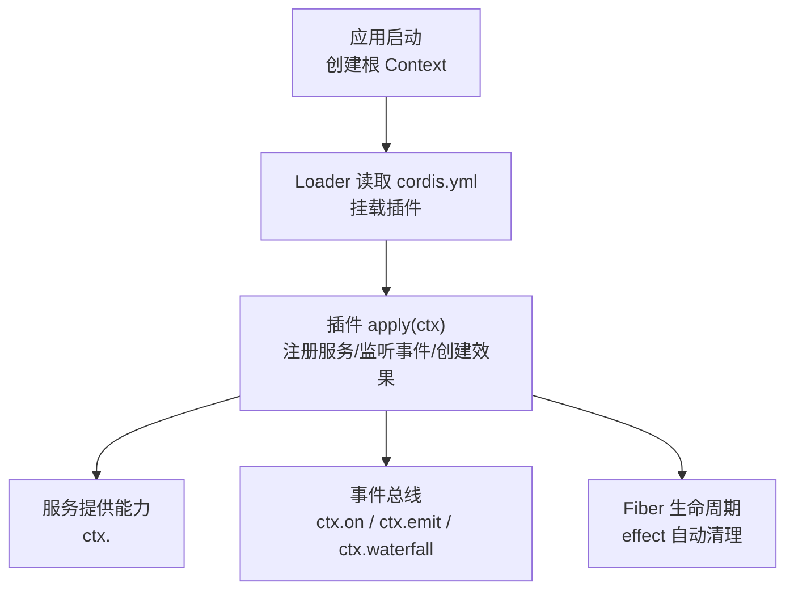
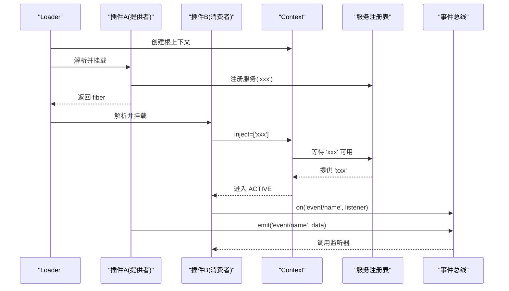
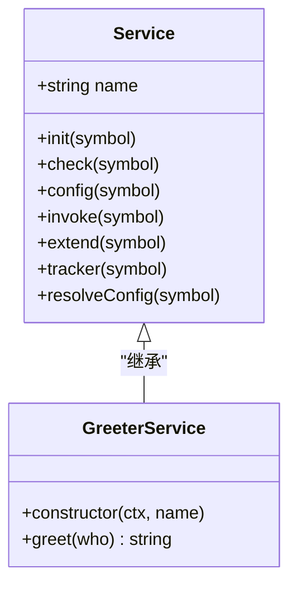
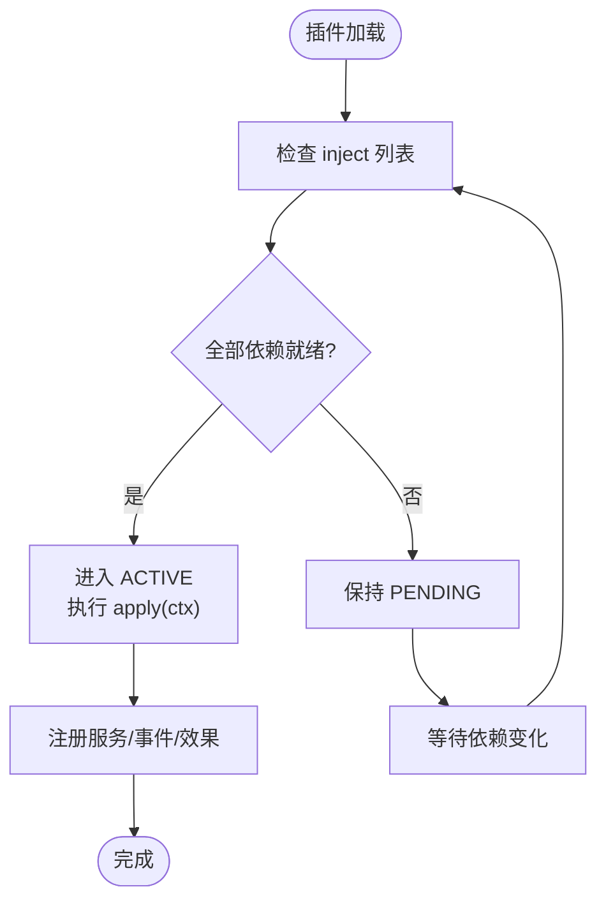
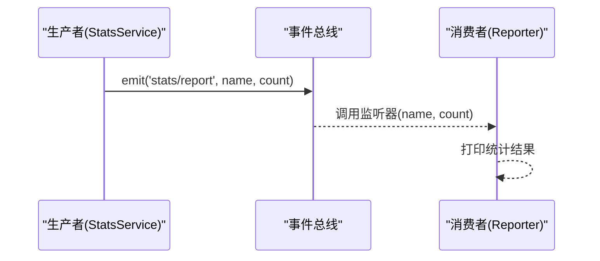
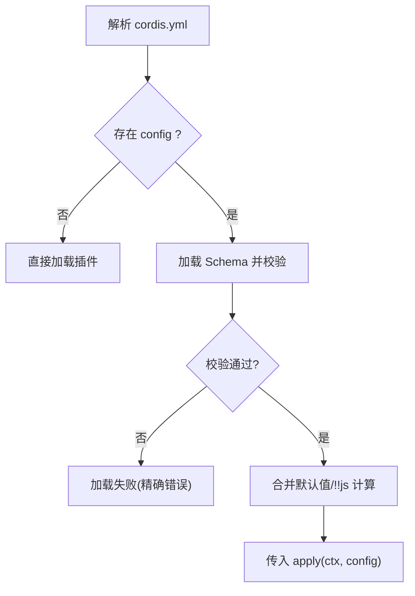
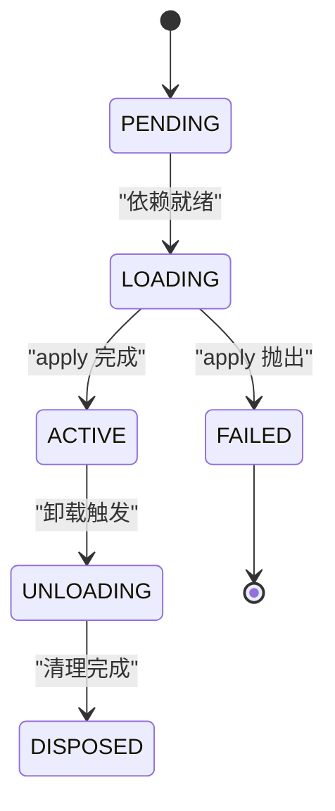

# 插件开发

<cite>
**本文引用的文件**
- [docs/cordis-tutorial/01-first-plugin.md](file://docs/cordis-tutorial/01-first-plugin.md)
- [docs/cordis-tutorial/02-lifecycle-and-effects.md](file://docs/cordis-tutorial/02-lifecycle-and-effects.md)
- [docs/cordis-tutorial/03-services.md](file://docs/cordis-tutorial/03-services.md)
- [docs/cordis-tutorial/04-events.md](file://docs/cordis-tutorial/04-events.md)
- [docs/cordis-tutorial/05-config.md](file://docs/cordis-tutorial/05-config.md)
- [docs/cordis-api/context.md](file://docs/cordis-api/context.md)
- [docs/cordis-api/events.md](file://docs/cordis-api/events.md)
- [docs/cordis-api/service.md](file://docs/cordis-api/service.md)
- [docs/cordis-primer.md](file://docs/cordis-primer.md)
- [docs/testing.md](file://docs/testing.md)
- [examples/README.md](file://examples/README.md)
</cite>

## 目录
1. [简介](#简介)
2. [项目结构](#项目结构)
3. [核心组件](#核心组件)
4. [架构总览](#架构总览)
5. [详细组件分析](#详细组件分析)
6. [依赖关系分析](#依赖关系分析)
7. [性能考虑](#性能考虑)
8. [故障排查指南](#故障排查指南)
9. [结论](#结论)
10. [附录](#附录)

## 简介
本指南面向希望基于 Cordis 框架开发插件的工程师，系统讲解插件的核心概念、Service 接口实现、生命周期钩子与依赖注入、配置与环境变量处理、事件通信机制、打包分发最佳实践，以及测试与质量保证方法。文档以教程与 API 参考为依据，配合示例工程说明从接口定义到测试部署的完整流程。

## 项目结构
Cordis 插件体系围绕“上下文（Context）—服务（Service）—事件（Events）—效果（Effects/Fiber）”展开：
- 上下文是插件运行时的能力仓库，所有服务、事件、生命周期 API 均通过 ctx 访问。
- 服务是插件对外暴露的稳定能力，其他插件通过名称消费，不关心具体实现。
- 事件用于松耦合通信，支持多种分发模式（emit/parallel/serial/bail/waterfall）。
- Fiber 表示一个已加载的插件实例，拥有状态机（PENDING→LOADING→ACTIVE→UNLOADING→DISPOSED），并管理其注册的效果。



图表来源
- [docs/cordis-tutorial/01-first-plugin.md:23-51](file://docs/cordis-tutorial/01-first-plugin.md#L23-L51)
- [docs/cordis-tutorial/02-lifecycle-and-effects.md:68-94](file://docs/cordis-tutorial/02-lifecycle-and-effects.md#L68-L94)
- [docs/cordis-api/context.md:8-12](file://docs/cordis-api/context.md#L8-L12)

章节来源
- [docs/cordis-tutorial/01-first-plugin.md:1-96](file://docs/cordis-tutorial/01-first-plugin.md#L1-L96)
- [docs/cordis-tutorial/02-lifecycle-and-effects.md:1-99](file://docs/cordis-tutorial/02-lifecycle-and-effects.md#L1-L99)
- [docs/cordis-api/context.md:1-365](file://docs/cordis-api/context.md#L1-L365)

## 核心组件
- 上下文（Context）：插件运行时容器，提供 get/provide/accessor/mixin/isolate/intercept 等能力，以及事件总线、日志、反射层和插件注册表。
- 服务（Service）：基于 Service 基类的可命名能力提供者，构造时即注册，随所属 fiber 卸载而自动移除。
- 事件（Events）：类型安全的声明式事件系统，支持 emit/parallel/serial/bail/waterfall 五种分发模式。
- 效果（Effects/Fiber）：插件注册的能力均为可逆效果，卸载时按反向顺序并发执行异步清理；fiber 状态机保证加载/卸载一致性。

章节来源
- [docs/cordis-api/context.md:8-12](file://docs/cordis-api/context.md#L8-L12)
- [docs/cordis-api/service.md:4-103](file://docs/cordis-api/service.md#L4-L103)
- [docs/cordis-api/events.md:1-208](file://docs/cordis-api/events.md#L1-L208)
- [docs/cordis-tutorial/02-lifecycle-and-effects.md:68-94](file://docs/cordis-tutorial/02-lifecycle-and-effects.md#L68-L94)

## 架构总览
下图展示了插件从加载到提供服务与事件的典型交互路径，以及依赖注入如何决定启动顺序。



图表来源
- [docs/cordis-tutorial/03-services.md:44-78](file://docs/cordis-tutorial/03-services.md#L44-L78)
- [docs/cordis-tutorial/04-events.md:7-79](file://docs/cordis-tutorial/04-events.md#L7-L79)
- [docs/cordis-api/context.md:237-314](file://docs/cordis-api/context.md#L237-L314)

## 详细组件分析

### Service 接口与生命周期
- 服务基类：继承 Service 并在构造函数中调用 super(ctx, name)，即可将实例以名称注册到当前 fiber 的作用域。
- 生命周期钩子：
  - init：类插件在构造后执行的初始化入口（通过静态符号标识）。
  - check：可用性谓词，配合 ctx.provide() 使用，控制服务是否可见。
  - resolveConfig：拦截配置解析辅助，用于合并/覆盖下游服务的配置。
- 扩展与追踪：extend/tracker/invoke 等静态符号用于扩展服务实例、上下文追踪与调用体封装。



图表来源
- [docs/cordis-api/service.md:14-103](file://docs/cordis-api/service.md#L14-L103)
- [docs/cordis-tutorial/03-services.md:20-42](file://docs/cordis-tutorial/03-services.md#L20-L42)

章节来源
- [docs/cordis-api/service.md:4-103](file://docs/cordis-api/service.md#L4-L103)
- [docs/cordis-tutorial/03-services.md:1-99](file://docs/cordis-tutorial/03-services.md#L1-L99)

### 依赖注入与加载顺序
- 通过 inject 声明硬依赖，Cordis 会保持插件处于 PENDING，直到所有依赖服务可用。
- 依赖关系在加载后持续跟踪：若依赖服务被卸载或热替换，依赖方也会随之卸载并重新加载，确保引用一致性。
- 可选依赖可通过 ctx.get(name) 探测，避免阻塞加载。



图表来源
- [docs/cordis-tutorial/03-services.md:44-78](file://docs/cordis-tutorial/03-services.md#L44-L78)
- [docs/cordis-tutorial/02-lifecycle-and-effects.md:68-82](file://docs/cordis-tutorial/02-lifecycle-and-effects.md#L68-L82)

章节来源
- [docs/cordis-tutorial/03-services.md:44-78](file://docs/cordis-tutorial/03-services.md#L44-L78)
- [docs/cordis-tutorial/02-lifecycle-and-effects.md:68-82](file://docs/cordis-tutorial/02-lifecycle-and-effects.md#L68-L82)

### 事件系统与通信模式
- 事件声明：通过合并 Events 接口为事件名与监听器签名提供类型安全。
- 分发模式：
  - emit：同步广播，忽略返回值。
  - parallel：并行执行所有监听器，统一 await。
  - serial：顺序执行，首个非空返回值短路。
  - bail：同步版本的 serial。
  - waterfall：中间件式链式调用，next() 委托后续逻辑，不调用 next() 即为否决。
- 监听器生命周期：ctx.on/once 注册的监听器随插件卸载自动移除，无需手动注销。



图表来源
- [docs/cordis-tutorial/04-events.md:7-79](file://docs/cordis-tutorial/04-events.md#L7-L79)
- [docs/cordis-api/events.md:8-123](file://docs/cordis-api/events.md#L8-L123)

章节来源
- [docs/cordis-tutorial/04-events.md:1-145](file://docs/cordis-tutorial/04-events.md#L1-L145)
- [docs/cordis-api/events.md:1-208](file://docs/cordis-api/events.md#L1-L208)

### 配置管理与环境变量
- 配置模式：每个 cordis.yml 条目可携带 config 块，插件导出同名 Schema 进行校验，错误会在加载阶段失败，避免半配置运行。
- 默认值与必填项：Schema 支持默认值与类型约束，apply 始终接收完整且已验证的配置。
- 动态计算：在 config 内可使用 !!js 标签在加载期计算值，常用于读取环境变量或平台判断。
- 作用域隔离：通过 ctx.intercept(serviceName, config) 可为下游插件注入特定服务的拦截配置，不影响父上下文。



图表来源
- [docs/cordis-tutorial/05-config.md:7-81](file://docs/cordis-tutorial/05-config.md#L7-L81)
- [docs/cordis-api/context.md:68-96](file://docs/cordis-api/context.md#L68-L96)

章节来源
- [docs/cordis-tutorial/05-config.md:1-85](file://docs/cordis-tutorial/05-config.md#L1-L85)
- [docs/cordis-api/context.md:68-96](file://docs/cordis-api/context.md#L68-L96)

### 生命周期与效果（Effects/Fiber）
- 效果：对非 Cordis 管理的资源（定时器、连接、观察者）使用 ctx.effect() 包装，返回清理函数，卸载时自动执行。
- Fiber 状态机：PENDING → LOADING → ACTIVE → UNLOADING → DISPOSED，异常则进入 FAILED。
- 内置效果：ctx.on、ctx.plugin、服务注册、工具注册等均为效果，卸载时自动回滚。
- 清理顺序：disposer 按注册逆序执行，多个异步 disposer 并发执行；如需顺序清理，应在同一 disposer 内串行 await。



图表来源
- [docs/cordis-tutorial/02-lifecycle-and-effects.md:68-94](file://docs/cordis-tutorial/02-lifecycle-and-effects.md#L68-L94)

章节来源
- [docs/cordis-tutorial/02-lifecycle-and-effects.md:1-99](file://docs/cordis-tutorial/02-lifecycle-and-effects.md#L1-L99)

### 插件间通信与事件处理模式
- 直接调用：通过服务方法（ctx.<service>.method）进行强耦合但高性能的调用。
- 事件广播：emit/parallel 适合多订阅者观察。
- 决策流水线：waterfall 适合拦截与改写，遵循“只观察必须调用 next()”的约定。
- 顺序决策：serial/bail 适合首个响应即生效的策略选择。

章节来源
- [docs/cordis-tutorial/04-events.md:80-141](file://docs/cordis-tutorial/04-events.md#L80-L141)
- [docs/cordis-primer.md:15-35](file://docs/cordis-primer.md#L15-L35)

### 从接口定义到测试部署的完整流程
- 接口定义：在服务或事件中明确输入输出类型，并通过 TypeScript 声明合并增强类型提示。
- 实现服务：继承 Service，注册名称，暴露方法；或在 apply 中通过 ctx.provide 提供裸对象。
- 声明依赖：使用 inject 声明必需服务，或使用 ctx.get 进行可选探测。
- 配置与校验：导出 Schema，定义默认值与约束，必要时使用 !!js 读取环境变量。
- 事件通信：在适当位置 emit/parallel/serial/waterfall，消费者通过 ctx.on 订阅。
- 本地调试：通过 cordis.yml 组合插件，使用 Loader 启动，观察 fiber 状态与日志。
- 测试：编写单元与快照测试，覆盖关键路径、错误分支与事件时序；必要时使用真实 API 的 e2e。
- 打包与分发：将插件作为独立包发布，或通过 overlay 方式叠加到宿主应用；确保入口导出符合 Loader 约定。
- 部署：在生产环境通过配置文件启用插件，结合环境变量与拦截配置定制行为。

章节来源
- [docs/cordis-tutorial/01-first-plugin.md:23-51](file://docs/cordis-tutorial/01-first-plugin.md#L23-L51)
- [docs/cordis-tutorial/03-services.md:1-99](file://docs/cordis-tutorial/03-services.md#L1-L99)
- [docs/cordis-tutorial/04-events.md:1-145](file://docs/cordis-tutorial/04-events.md#L1-L145)
- [docs/cordis-tutorial/05-config.md:1-85](file://docs/cordis-tutorial/05-config.md#L1-L85)
- [examples/README.md:1-30](file://examples/README.md#L1-L30)

## 依赖关系分析
- 低耦合高内聚：插件通过服务名与事件名解耦，不直接导入实现模块。
- 依赖图驱动加载：inject 声明形成隐式依赖图，Loader 据此调度加载顺序。
- 外部依赖：Schema 校验使用 Standard Schema 兼容库（如 Schemastery），事件与上下文由 Cordis 提供。
- 潜在循环：应避免在 apply 中引入循环依赖；通过事件或延迟解析打破环。

```mermaid
graph LR
A["插件A(提供者)"] --> |注册服务| S["服务名空间"]
B["插件B(消费者)"] --> |inject 依赖| S
C["插件C(事件消费者)"] --> |on('event')| E["事件总线"]
A --> |emit('event')| E
```

图表来源
- [docs/cordis-tutorial/03-services.md:44-78](file://docs/cordis-tutorial/03-services.md#L44-L78)
- [docs/cordis-tutorial/04-events.md:7-79](file://docs/cordis-tutorial/04-events.md#L7-L79)

章节来源
- [docs/cordis-primer.md:7-14](file://docs/cordis-primer.md#L7-L14)
- [docs/cordis-tutorial/03-services.md:44-78](file://docs/cordis-tutorial/03-services.md#L44-L78)

## 性能考虑
- 优先使用事件进行广播型通知，避免频繁服务调用带来的耦合与开销。
- 合理使用 waterfall 进行拦截与改写，注意不要遗漏 next() 导致下游行为被吞没。
- 批量操作与并行化：对于 I/O 密集任务，使用 parallel 模式提升吞吐。
- 资源管理：所有外部资源通过 effect 管理，避免泄漏；复杂清理在同一 disposer 内串行执行。
- 配置解析：尽量将常量配置放入 Schema 默认值，减少运行期计算。

[本节为通用指导，不直接分析具体文件]

## 故障排查指南
- 插件未运行：检查 cordis.yml 中的模块路径拼写与导出是否正确；无法解析的模块会通过日志报告而非崩溃。
- 插件处于 PENDING：确认 inject 依赖是否已提供；查看依赖服务是否成功注册。
- 配置错误：根据校验错误定位字段类型与必填项；使用 !!js 时注意仅在 config 与 disabled 字段生效。
- 事件未触发：确认事件名一致、监听器已注册且未被卸载；检查分发模式是否符合预期。
- 清理问题：确认 effect 返回了正确的清理函数；异步清理需在同一 disposer 内 await 以保证顺序。

章节来源
- [docs/cordis-tutorial/01-first-plugin.md:79-93](file://docs/cordis-tutorial/01-first-plugin.md#L79-L93)
- [docs/cordis-tutorial/02-lifecycle-and-effects.md:68-94](file://docs/cordis-tutorial/02-lifecycle-and-effects.md#L68-L94)
- [docs/cordis-tutorial/05-config.md:53-81](file://docs/cordis-tutorial/05-config.md#L53-L81)

## 结论
Cordis 提供了以 Context 为中心、以 Service 为能力边界、以 Events 为通信纽带、以 Effects/Fiber 为生命周期保障的插件框架。通过依赖注入、配置校验、事件分发与效果管理，开发者可以构建高内聚、低耦合、可热插拔的可扩展系统。遵循本指南的最佳实践，能够显著提升插件的质量、可维护性与可测试性。

[本节为总结性内容，不直接分析具体文件]

## 附录

### 快速上手清单
- 新建插件文件，导出 name 与 apply(ctx)。
- 在 cordis.yml 中注册插件。
- 如需能力共享，继承 Service 并注册名称。
- 使用 inject 声明依赖，或使用 ctx.get 做可选探测。
- 通过 Schema 定义配置，必要时使用 !!js 读取环境变量。
- 使用 ctx.on/emit/parallel/serial/bail/waterfall 进行事件通信。
- 使用 ctx.effect 管理外部资源，确保卸载时正确清理。
- 编写单元测试与快照测试，覆盖关键路径与错误分支。
- 打包为 npm 包或通过 overlay 集成到宿主应用。

章节来源
- [docs/cordis-tutorial/01-first-plugin.md:23-51](file://docs/cordis-tutorial/01-first-plugin.md#L23-L51)
- [docs/cordis-tutorial/03-services.md:1-99](file://docs/cordis-tutorial/03-services.md#L1-L99)
- [docs/cordis-tutorial/04-events.md:1-145](file://docs/cordis-tutorial/04-events.md#L1-L145)
- [docs/cordis-tutorial/05-config.md:1-85](file://docs/cordis-tutorial/05-config.md#L1-L85)

### 测试与质量保证
- 分层测试策略：
  - 单元测试：覆盖包与示例 specs，关注边缘情况、错误路径、事件顺序与并发竞态。
  - 覆盖率门禁：对 packages/*/*/src 逐文件 100% 行覆盖。
  - 真实 API e2e：带密钥测试真实模型与第三方 API，无密钥 CI 自跳过。
  - 快照测试：键无关的预期输出，覆盖传输契约与呈现；ACP 与 headless 场景分别维护。
  - Web 浏览器快照：Chromium 回放对比，CI 强制 replay 模式。
- 推荐实践：
  - 优先使用真实实现而非 mock，仅对昂贵或非确定性边界打桩。
  - 通过真实入口路径测试（构建产物），避免 tsx 掩盖的问题。
  - 每个非平凡变更增加或更新快照场景，确保回归可见。

章节来源
- [docs/testing.md:1-50](file://docs/testing.md#L1-L50)