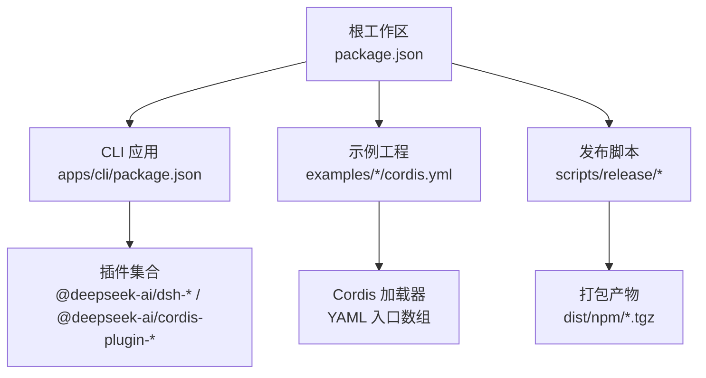
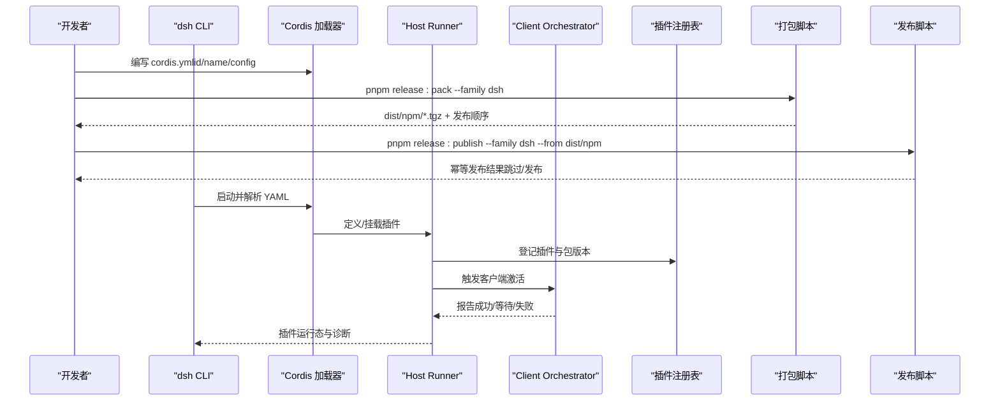
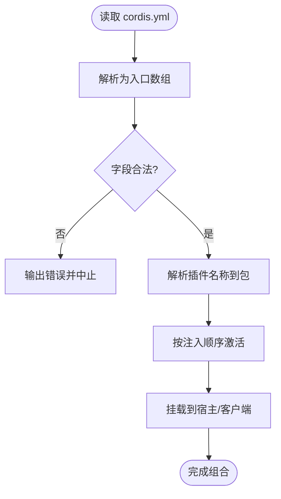
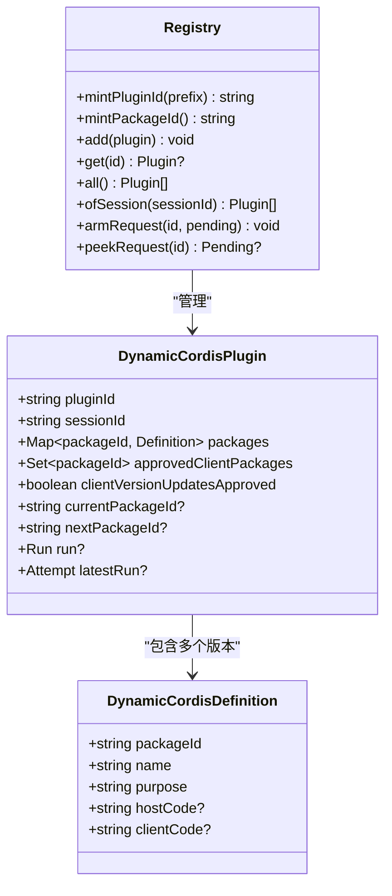
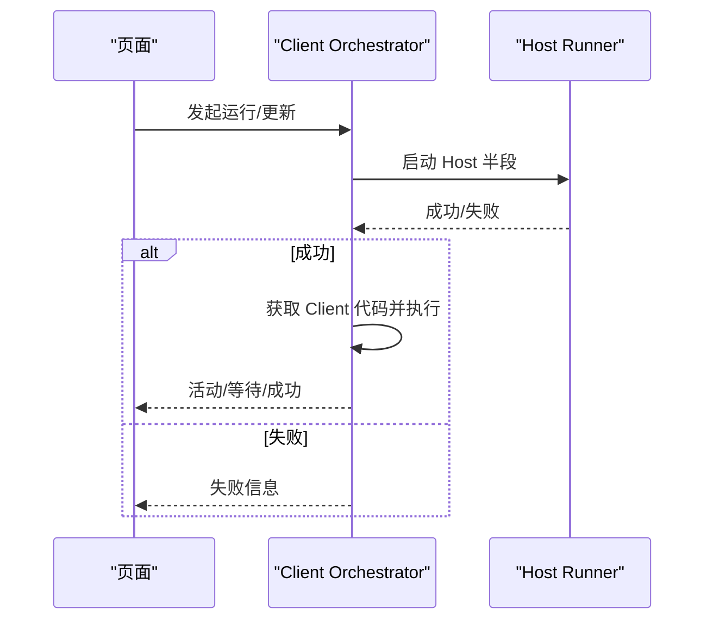
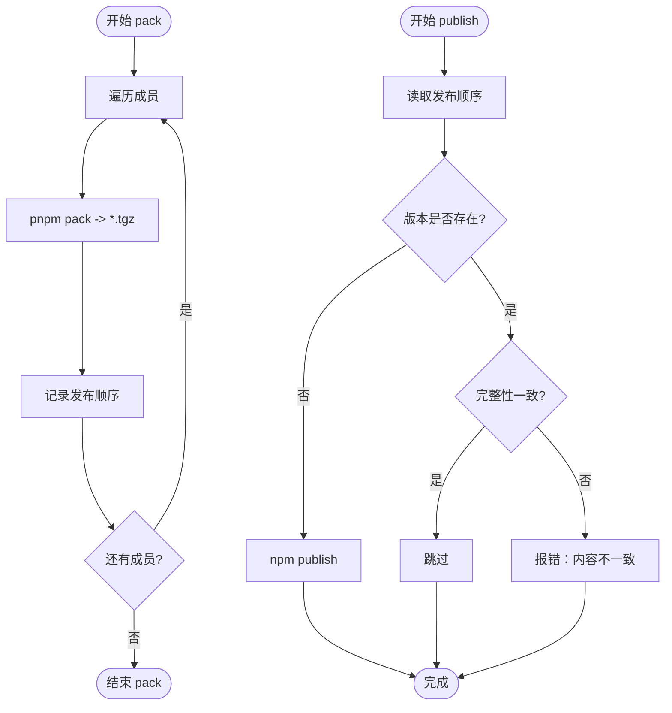
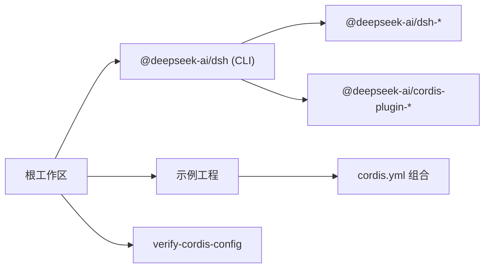

# 插件打包与分发

<cite>
**本文引用的文件**
- [package.json](file://package.json)
- [apps/cli/package.json](file://apps/cli/package.json)
- [scripts/release/pack.ts](file://scripts/release/pack.ts)
- [scripts/release/publish.ts](file://scripts/release/publish.ts)
- [examples/acp-agent/cordis.yml](file://examples/acp-agent/cordis.yml)
- [examples/headless-agent/cordis.yml](file://examples/headless-agent/cordis.yml)
- [scripts/verify-cordis-config.ts](file://scripts/verify-cordis-config.ts)
- [packages/extensions/cordis-host-runner/src/index.ts](file://packages/extensions/cordis-host-runner/src/index.ts)
- [packages/extensions/cordis-host-runner/src/registry.ts](file://packages/extensions/cordis-host-runner/src/registry.ts)
- [packages/extensions/cordis-client-runner/src/client/orchestrator.ts](file://packages/extensions/cordis-client-runner/src/client/orchestrator.ts)
- [docs/user/develop/basic/publish.md](file://docs/user/develop/basic/publish.md)
</cite>

## 目录
1. [简介](#简介)
2. [项目结构](#项目结构)
3. [核心组件](#核心组件)
4. [架构总览](#架构总览)
5. [详细组件分析](#详细组件分析)
6. [依赖分析](#依赖分析)
7. [性能考虑](#性能考虑)
8. [故障排查指南](#故障排查指南)
9. [结论](#结论)
10. [附录](#附录)

## 简介
本指南面向插件作者与维护者，系统说明如何在 deepseek-harness 中组织、构建、打包、发布与升级插件。内容覆盖：
- 插件项目的结构与组织方式（基于 Cordis Loader 的 YAML 配置）
- 构建过程与依赖管理（工作区、包管理器、校验脚本）
- 版本管理与兼容性策略（动态插件版本、回滚与审批）
- 打包工具与脚本使用（release pack/publish）
- 发布流程与最佳实践（幂等发布、完整性校验、预发布标签）
- 安装与激活机制（CLI 安装、Host/Client 双端激活）
- 分发渠道与版本控制策略（npm、tarball、示例配置）
- 更新与升级处理方法（update 模式、失败回退、审批流）

## 项目结构
deepseek-harness 采用 monorepo 与工作区管理，根 package.json 定义工作区范围与统一脚本；CLI 应用聚合大量插件能力；示例工程通过 cordis.yml 声明式组合插件；发布脚本位于 scripts/release。

**图示来源**
- [package.json:1-18](file://package.json#L1-L18)
- [apps/cli/package.json:1-20](file://apps/cli/package.json#L1-L20)
- [scripts/release/pack.ts:1-62](file://scripts/release/pack.ts#L1-L62)

**章节来源**
- [package.json:1-183](file://package.json#L1-L183)
- [apps/cli/package.json:1-102](file://apps/cli/package.json#L1-L102)

## 核心组件
- 插件配置与组合：通过 Cordis Loader 的 YAML 入口数组声明插件 id/name/config/inject 等元数据，并解析为可安装的 Package。
- 运行时注册表：Host Runner 维护动态插件与包的版本、激活状态与审批请求。
- 客户端编排：Client Orchestrator 驱动 Host→Client 激活顺序、活动态与失败态观测。
- 发布流水线：pack 生成 tarball 并记录发布顺序；publish 进行幂等发布与完整性校验。

**章节来源**
- [scripts/verify-cordis-config.ts:1-99](file://scripts/verify-cordis-config.ts#L1-L99)
- [packages/extensions/cordis-host-runner/src/index.ts:162-202](file://packages/extensions/cordis-host-runner/src/index.ts#L162-L202)
- [packages/extensions/cordis-host-runner/src/registry.ts:36-67](file://packages/extensions/cordis-host-runner/src/registry.ts#L36-L67)
- [packages/extensions/cordis-client-runner/src/client/orchestrator.ts:115-143](file://packages/extensions/cordis-client-runner/src/client/orchestrator.ts#L115-L143)
- [scripts/release/pack.ts:1-62](file://scripts/release/pack.ts#L1-L62)
- [scripts/release/publish.ts:1-170](file://scripts/release/publish.ts#L1-L170)

## 架构总览
下图展示从“插件源码 → 配置组合 → 运行期激活 → 打包发布”的端到端路径。

**图示来源**
- [examples/acp-agent/cordis.yml:1-193](file://examples/acp-agent/cordis.yml#L1-L193)
- [examples/headless-agent/cordis.yml:1-166](file://examples/headless-agent/cordis.yml#L1-L166)
- [packages/extensions/cordis-host-runner/src/index.ts:162-202](file://packages/extensions/cordis-host-runner/src/index.ts#L162-L202)
- [packages/extensions/cordis-host-runner/src/registry.ts:36-67](file://packages/extensions/cordis-host-runner/src/registry.ts#L36-L67)
- [packages/extensions/cordis-client-runner/src/client/orchestrator.ts:115-143](file://packages/extensions/cordis-client-runner/src/client/orchestrator.ts#L115-L143)
- [scripts/release/pack.ts:1-62](file://scripts/release/pack.ts#L1-L62)
- [scripts/release/publish.ts:1-170](file://scripts/release/publish.ts#L1-L170)

## 详细组件分析

### 插件配置与组合（Cordis Loader）
- 每个插件以 YAML 条目形式声明 id、name、config 等，Loader 负责解析、注入与装配。
- 校验脚本会检查根节点是否为数组、字段合法性以及示例与应用配置的解析一致性。
- 示例展示了如何组合 LLM、沙箱、子代理、工作流、文件系统、持久化等插件。

**图示来源**
- [scripts/verify-cordis-config.ts:1-99](file://scripts/verify-cordis-config.ts#L1-L99)
- [examples/acp-agent/cordis.yml:1-193](file://examples/acp-agent/cordis.yml#L1-L193)
- [examples/headless-agent/cordis.yml:1-166](file://examples/headless-agent/cordis.yml#L1-L166)

**章节来源**
- [scripts/verify-cordis-config.ts:1-99](file://scripts/verify-cordis-config.ts#L1-L99)
- [examples/acp-agent/cordis.yml:1-193](file://examples/acp-agent/cordis.yml#L1-L193)
- [examples/headless-agent/cordis.yml:1-166](file://examples/headless-agent/cordis.yml#L1-L166)

### 运行时插件注册与版本管理（Host Runner）
- define：创建或追加一个 Plugin 的 Package，返回稳定的 pluginId 与 packageId。
- registry：维护当前/下一个包版本、会话归属、客户端授权与审批请求。
- run/update：支持 run 与 update 两种模式；update 失败时保留 currentPackageId 并设置 nextPackageId，便于回滚。

**图示来源**
- [packages/extensions/cordis-host-runner/src/index.ts:162-202](file://packages/extensions/cordis-host-runner/src/index.ts#L162-L202)
- [packages/extensions/cordis-host-runner/src/registry.ts:36-67](file://packages/extensions/cordis-host-runner/src/registry.ts#L36-L67)
- [packages/extensions/cordis-host-runner/src/registry.ts:202-244](file://packages/extensions/cordis-host-runner/src/registry.ts#L202-L244)

**章节来源**
- [packages/extensions/cordis-host-runner/src/index.ts:162-202](file://packages/extensions/cordis-host-runner/src/index.ts#L162-L202)
- [packages/extensions/cordis-host-runner/src/registry.ts:36-67](file://packages/extensions/cordis-host-runner/src/registry.ts#L36-L67)
- [packages/extensions/cordis-host-runner/src/registry.ts:202-244](file://packages/extensions/cordis-host-runner/src/registry.ts#L202-L244)

### 客户端激活编排（Client Orchestrator）
- 驱动 Host 先于 Client 激活，确保所需处理器已存在。
- 跟踪每个插件的活动态与最近一次失败，提供可观察快照。
- 处理审批请求与并发限制，保证同一插件在同一页面不并发激活。

**图示来源**
- [packages/extensions/cordis-client-runner/src/client/orchestrator.ts:115-143](file://packages/extensions/cordis-client-runner/src/client/orchestrator.ts#L115-L143)

**章节来源**
- [packages/extensions/cordis-client-runner/src/client/orchestrator.ts:115-143](file://packages/extensions/cordis-client-runner/src/client/orchestrator.ts#L115-L143)

### 打包与发布流水线（Release Scripts）
- pack：按发布顺序对每个成员执行 pnpm pack，产出 tarball 并写入发布顺序文件；校验产物内容。
- publish：读取发布顺序，查询注册表状态，若版本不存在则发布；若已存在且完整性一致则跳过；否则报错提示版本不一致。

**图示来源**
- [scripts/release/pack.ts:1-62](file://scripts/release/pack.ts#L1-L62)
- [scripts/release/publish.ts:1-170](file://scripts/release/publish.ts#L1-L170)

**章节来源**
- [scripts/release/pack.ts:1-62](file://scripts/release/pack.ts#L1-L62)
- [scripts/release/publish.ts:1-170](file://scripts/release/publish.ts#L1-L170)

### 安装与激活机制（CLI 与用户文档）
- 支持通过 npm 发布预构建产物，用户使用 dsh plugin add 安装。
- 支持直接分发 tarball，用户通过本地路径安装。
- 安装后由 Loader 解析配置并进入 Host/Client 激活流程。

**章节来源**
- [docs/user/develop/basic/publish.md:175-184](file://docs/user/develop/basic/publish.md#L175-L184)

## 依赖分析
- 工作区依赖：根 package.json 将 apps、packages、native、website 纳入工作区，统一构建与测试。
- CLI 聚合：apps/cli/package.json 声明大量 dsh-* 与 cordis-plugin-* 依赖，体现插件生态。
- 校验约束：verify-cordis-config 确保 YAML 配置与包解析正确，避免运行时错误。

**图示来源**
- [package.json:1-18](file://package.json#L1-L18)
- [apps/cli/package.json:22-84](file://apps/cli/package.json#L22-L84)
- [scripts/verify-cordis-config.ts:1-99](file://scripts/verify-cordis-config.ts#L1-L99)

**章节来源**
- [package.json:1-183](file://package.json#L1-L183)
- [apps/cli/package.json:1-102](file://apps/cli/package.json#L1-L102)
- [scripts/verify-cordis-config.ts:1-99](file://scripts/verify-cordis-config.ts#L1-L99)

## 性能考虑
- 发布间隔与重试：publish 在连续发布间引入短暂间隔，降低注册表竞争导致的冲突。
- 幂等发布：通过完整性校验实现重复运行的安全跳过，提升 CI 稳定性。
- 客户端激活顺序：Host 先于 Client 激活，减少因依赖缺失导致的二次尝试。

[本节为通用指导，无需特定文件引用]

## 故障排查指南
- 配置校验失败：当 cordis.yml 根节点不是数组或字段非法时，verify-cordis-config 会输出具体错误并中止。
- 更新失败回滚：update 失败时保留 currentPackageId，nextPackageId 指向新版本，便于定位与回退。
- 发布失败处理：遇到临时网络错误会重试；若注册表已有不同内容的同名版本，需调整版本号或修复构建可重现性。

**章节来源**
- [scripts/verify-cordis-config.ts:69-99](file://scripts/verify-cordis-config.ts#L69-L99)
- [packages/extensions/cordis-host-runner/tests/versioning.spec.ts:1-31](file://packages/extensions/cordis-host-runner/tests/versioning.spec.ts#L1-L31)
- [scripts/release/publish.ts:97-124](file://scripts/release/publish.ts#L97-L124)

## 结论
deepseek-harness 提供了完整的插件生命周期支持：从声明式配置、严格的构建校验，到安全的打包发布与幂等部署；运行时具备版本管理与回滚能力，并通过 Host/Client 双端协作保障稳定性。遵循本文的流程与最佳实践，可高效地开发、分发与升级插件。

## 附录

### 常用命令速查
- 构建与校验：参考根 package.json 中的 build、typecheck、lint、verify-* 系列脚本。
- 打包发布：
  - 打包：pnpm release:pack --family dsh [--out dist/npm]
  - 发布：pnpm release:publish --family dsh --from dist/npm
- 安装插件：
  - 通过 npm 包：dsh plugin add your-package
  - 通过本地 tarball：dsh plugin add ./hello-plugin-0.1.0.tgz

**章节来源**
- [package.json:19-142](file://package.json#L19-L142)
- [scripts/release/pack.ts:37-58](file://scripts/release/pack.ts#L37-L58)
- [scripts/release/publish.ts:126-167](file://scripts/release/publish.ts#L126-L167)
- [docs/user/develop/basic/publish.md:175-184](file://docs/user/develop/basic/publish.md#L175-L184)