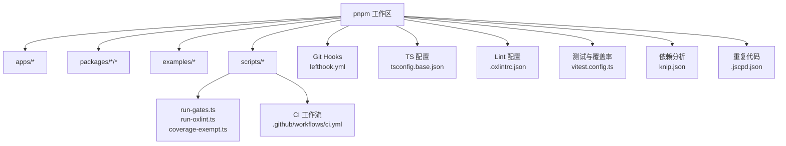
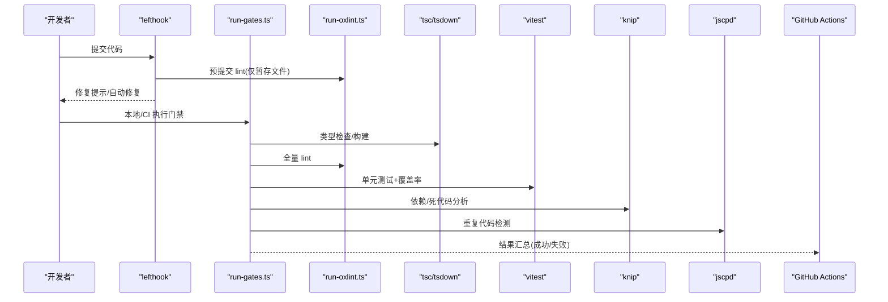
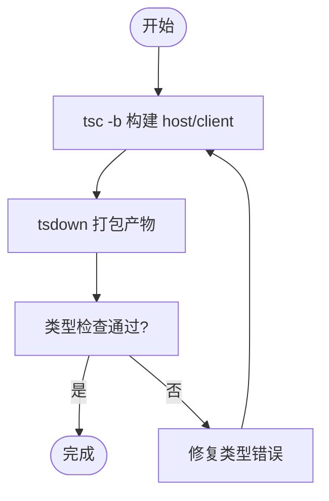
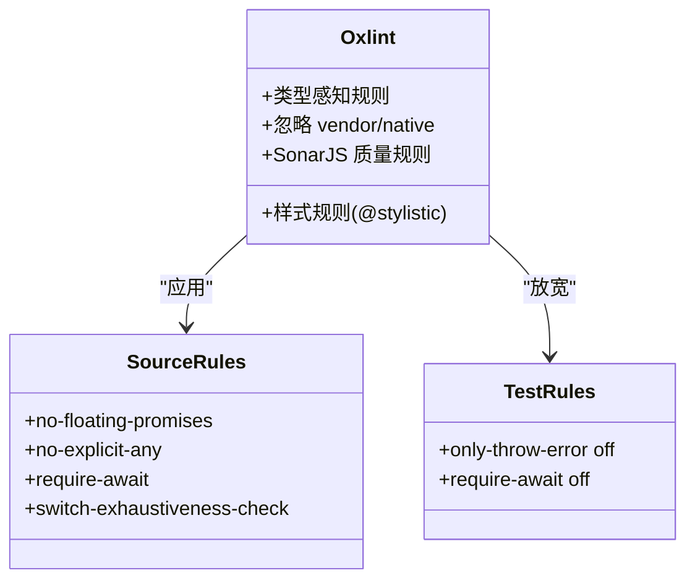
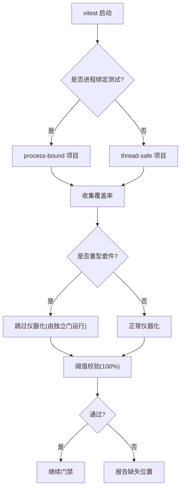
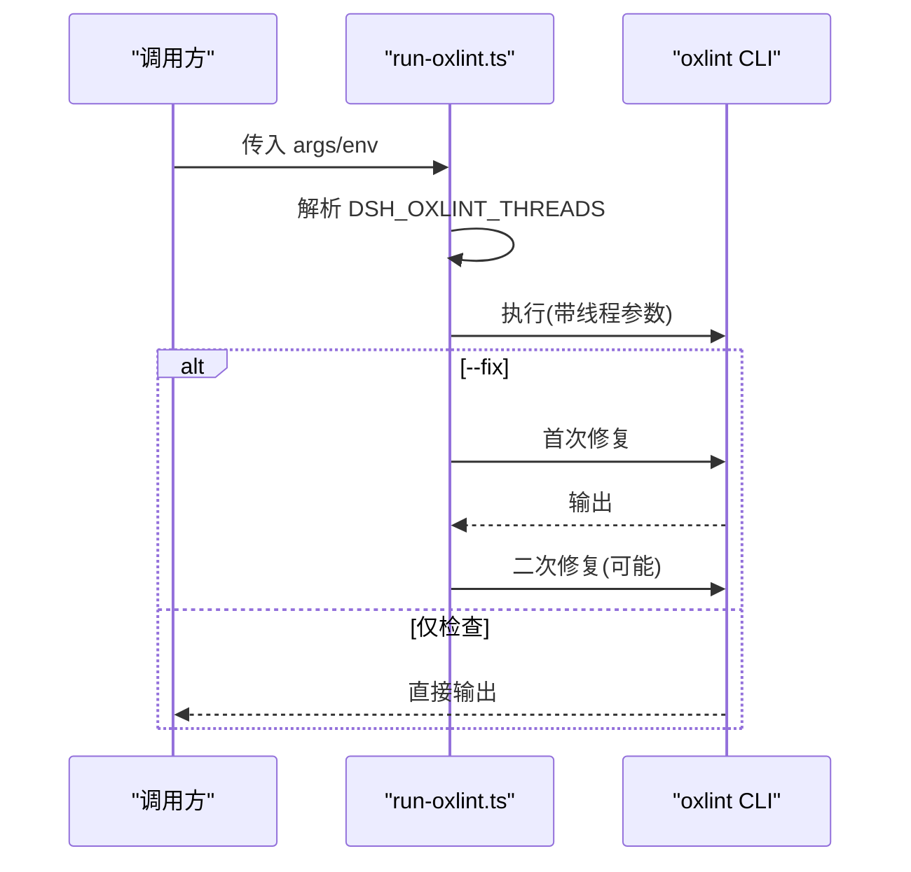
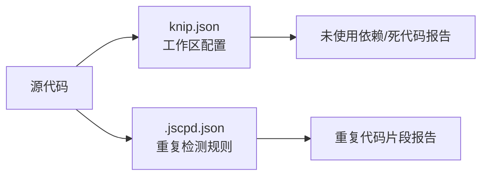
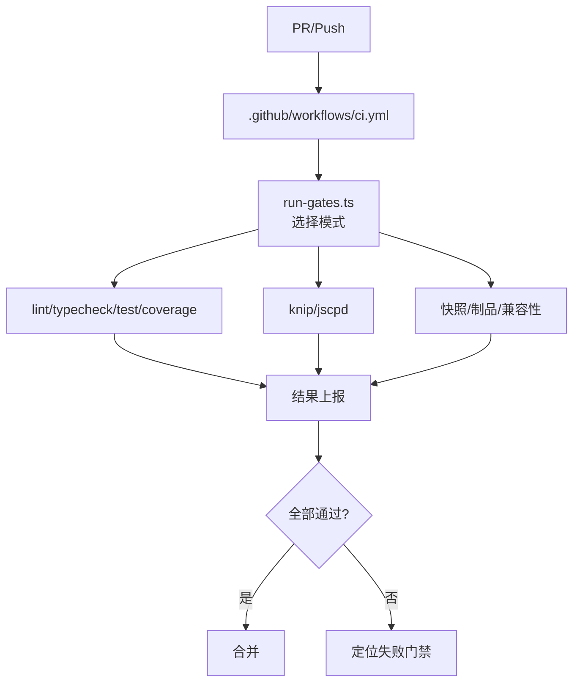

# 代码质量

<cite>
**本文引用的文件**
- [package.json](file://package.json)
- [tsconfig.base.json](file://tsconfig.base.json)
- [.oxlintrc.json](file://.oxlintrc.json)
- [vitest.config.ts](file://vitest.config.ts)
- [lefthook.yml](file://lefthook.yml)
- [knip.json](file://knip.json)
- [.jscpd.json](file://.jscpd.json)
- [scripts/run-gates.ts](file://scripts/run-gates.ts)
- [scripts/run-oxlint.ts](file://scripts/run-oxlint.ts)
- [scripts/coverage-exempt.ts](file://scripts/coverage-exempt.ts)
- [.github/workflows/ci.yml](file://.github/workflows/ci.yml)
</cite>

## 目录
1. [简介](#简介)
2. [项目结构](#项目结构)
3. [核心组件](#核心组件)
4. [架构总览](#架构总览)
5. [详细组件分析](#详细组件分析)
6. [依赖关系与冗余检测](#依赖关系与冗余检测)
7. [性能分析与内存泄漏检测](#性能分析与内存泄漏检测)
8. [安全扫描与重构建议](#安全扫描与重构建议)
9. [持续集成与门禁](#持续集成与门禁)
10. [结论](#结论)
11. [附录：配置速查](#附录：配置速查)

## 简介
本指南面向仓库的开发者与维护者，系统化说明代码质量工具链、TypeScript 类型检查与编译选项、代码风格与格式化规则、静态分析集成、质量门禁与持续集成、依赖关系与冗余检测、性能分析与内存泄漏检测、以及安全扫描与重构建议。目标是让不同背景的读者都能理解并落地执行一致的质量标准。

## 项目结构
仓库采用多包工作区（pnpm workspaces），根目录集中编排脚本与质量门控，应用位于 apps，可复用能力位于 packages，示例位于 examples，文档位于 docs，原生子模块位于 native。质量相关的关键入口包括：
- 根脚本：统一编排 lint、typecheck、test、coverage、duplication、knip 等
- 工作流：GitHub Actions 定义 CI 矩阵与门禁
- Git Hooks：lefthook 在提交前快速自检
- TypeScript：基于 tsconfig.base.json 的全局编译策略与路径映射
- Lint：oxlint + 样式插件 + SonarJS 规则
- 测试与覆盖率：Vitest + V8 覆盖率，严格阈值
- 依赖分析：Knip
- 重复代码：JSCPD

**图表来源**
- [package.json:1-18](file://package.json#L1-L18)
- [scripts/run-gates.ts:1-30](file://scripts/run-gates.ts#L1-L30)
- [.github/workflows/ci.yml:1-40](file://.github/workflows/ci.yml#L1-L40)
- [lefthook.yml:1-22](file://lefthook.yml#L1-L22)
- [tsconfig.base.json:1-26](file://tsconfig.base.json#L1-L26)
- [.oxlintrc.json:1-31](file://.oxlintrc.json#L1-L31)
- [vitest.config.ts:1-20](file://vitest.config.ts#L1-L20)
- [knip.json:1-24](file://knip.json#L1-L24)
- [.jscpd.json:1-16](file://.jscpd.json#L1-L16)

**章节来源**
- [package.json:1-18](file://package.json#L1-L18)

## 核心组件
- 类型检查与编译：通过 TypeScript 项目引用与全局 tsconfig.base.json 统一目标、模块解析、严格模式与路径映射；构建脚本将 host/client 分别编译。
- 代码风格与静态分析：oxlint 作为主引擎，启用类型感知规则，结合 @stylistic/eslint-plugin 进行格式规范，SonarJS 提供重复分支/条件等质量规则。
- 测试与覆盖率：Vitest 双项目模型（线程安全/进程绑定），V8 覆盖率强制每文件 100% 阈值，排除特定 UI/生成代码以聚焦业务逻辑。
- 依赖与冗余：Knip 按工作区粒度识别未使用依赖与死代码；JSCPD 检测跨包重复代码片段。
- 门禁与自动化：lefthook 在 pre-commit/pre-push 阶段执行轻量检查；run-gates.ts 聚合 CI 门禁；GitHub Actions 驱动完整矩阵。

**章节来源**
- [tsconfig.base.json:1-26](file://tsconfig.base.json#L1-L26)
- [.oxlintrc.json:1-31](file://.oxlintrc.json#L1-L31)
- [vitest.config.ts:117-159](file://vitest.config.ts#L117-L159)
- [knip.json:24-78](file://knip.json#L24-L78)
- [.jscpd.json:1-16](file://.jscpd.json#L1-L16)
- [lefthook.yml:5-56](file://lefthook.yml#L5-L56)
- [scripts/run-gates.ts:14-31](file://scripts/run-gates.ts#L14-L31)

## 架构总览
下图展示从开发到 CI 的质量流水线：开发者提交触发 lefthook 快速检查；本地或 CI 调用 run-gates.ts 编排 lint/typecheck/test/coverage/knip/duplication 等任务；GitHub Actions 根据 PR/分支事件运行不同门禁集合。

**图表来源**
- [lefthook.yml:5-56](file://lefthook.yml#L5-L56)
- [scripts/run-gates.ts:14-31](file://scripts/run-gates.ts#L14-L31)
- [scripts/run-oxlint.ts:1-39](file://scripts/run-oxlint.ts#L1-L39)
- [package.json:19-33](file://package.json#L19-L33)
- [vitest.config.ts:117-159](file://vitest.config.ts#L117-L159)
- [knip.json:24-78](file://knip.json#L24-L78)
- [.jscpd.json:1-16](file://.jscpd.json#L1-L16)
- [.github/workflows/ci.yml:43-114](file://.github/workflows/ci.yml#L43-L114)

## 详细组件分析

### TypeScript 类型检查与编译
- 目标与模块：ES2024 目标，esnext 模块，bundler 解析，开启声明与 sourcemap，增量编译。
- 严格性：strict、noUncheckedIndexedAccess、exactOptionalPropertyTypes、noImplicitOverride、noUnusedLocals/Parameters 等。
- 路径映射：大量 @deepseek-ai/* 别名指向源码路径，保证 IDE 与构建一致性；vendor 与 native 子树有独立边界。
- 构建流程：host/client 分别通过 tsc -b 与 tsdown 产出，确保类型与产物分离。

**图表来源**
- [tsconfig.base.json:1-26](file://tsconfig.base.json#L1-L26)
- [package.json:19-33](file://package.json#L19-L33)

**章节来源**
- [tsconfig.base.json:1-26](file://tsconfig.base.json#L1-L26)
- [package.json:19-33](file://package.json#L19-L33)

### 代码风格与静态分析
- 引擎：oxlint，启用 typeAware 类型感知规则，关闭 correctness 类别以避免与 TS 冲突。
- 规则集：
  - 通用：禁止 var、prefer-const、no-unused-vars、no-floating-promises、no-explicit-any 等。
  - 源码增强：no-non-null-assertion、require-await、switch-exhaustiveness-check、restrict-template-expressions。
  - 测试放宽：允许非 Error 抛出、不强制 require-await 等。
  - 样式：@stylistic/eslint-plugin 控制缩进、分号、引号、逗号、行宽等。
  - 质量：SonarJS 规则检测重复分支/条件/函数等。
- 忽略范围：vendor、native、配置文件、生成的临时目录等。

**图表来源**
- [.oxlintrc.json:1-31](file://.oxlintrc.json#L1-L31)
- [.oxlintrc.json:32-142](file://.oxlintrc.json#L32-L142)
- [.oxlintrc.json:143-177](file://.oxlintrc.json#L143-L177)
- [.oxlintrc.json:179-208](file://.oxlintrc.json#L179-L208)
- [.oxlintrc.json:209-301](file://.oxlintrc.json#L209-L301)

**章节来源**
- [.oxlintrc.json:1-31](file://.oxlintrc.json#L1-L31)
- [.oxlintrc.json:32-142](file://.oxlintrc.json#L32-L142)
- [.oxlintrc.json:143-177](file://.oxlintrc.json#L143-L177)
- [.oxlintrc.json:179-208](file://.oxlintrc.json#L179-L208)
- [.oxlintrc.json:209-301](file://.oxlintrc.json#L209-L301)

### 测试与覆盖率
- 项目划分：thread-safe 与 process-bound 两个 Vitest 项目，隔离进程级状态与时序敏感用例。
- 覆盖率：V8 provider，包含 packages/*/src/**，排除类型/入口/客户端 UI 债务区域；阈值 100%（语句/分支/函数/行）且 perFile 生效。
- 重型套件豁免：coverage-exempt.ts 列出编译器/子进程相关的重型测试，在仪器化覆盖率门中跳过，避免显著拖慢流水线。
- Windows 差异：针对不支持的 shell/sandbox 等包与 pwsh 可用性动态调整覆盖范围。

**图表来源**
- [vitest.config.ts:117-159](file://vitest.config.ts#L117-L159)
- [vitest.config.ts:160-283](file://vitest.config.ts#L160-L283)
- [scripts/coverage-exempt.ts:1-42](file://scripts/coverage-exempt.ts#L1-L42)

**章节来源**
- [vitest.config.ts:117-159](file://vitest.config.ts#L117-L159)
- [vitest.config.ts:160-283](file://vitest.config.ts#L160-L283)
- [scripts/coverage-exempt.ts:1-42](file://scripts/coverage-exempt.ts#L1-L42)

### 静态分析集成（Oxlint）
- 封装器：scripts/run-oxlint.ts 统一线程参数与环境变量，支持 --fix 二次修复。
- 线程控制：DSH_OXLINT_THREADS 环境变量限制并发，同时设置 GOMAXPROCS。
- 忽略与覆盖：遵循 .oxlintrc.json 的 ignorePatterns 与 overrides，对 vendor/native 与配置文件做差异化处理。

**图表来源**
- [scripts/run-oxlint.ts:1-39](file://scripts/run-oxlint.ts#L1-L39)
- [scripts/run-oxlint.ts:49-85](file://scripts/run-oxlint.ts#L49-L85)
- [.oxlintrc.json:14-31](file://.oxlintrc.json#L14-L31)

**章节来源**
- [scripts/run-oxlint.ts:1-39](file://scripts/run-oxlint.ts#L1-L39)
- [.oxlintrc.json:14-31](file://.oxlintrc.json#L14-L31)

### Git Hooks 与本地门禁
- pre-commit：翻译配对校验、归档笔记校验、staged 文件 lint（含自动修复）、第三方通知再生成、空白字符检查、vendor manifest 守卫。
- pre-push：执行完整 typecheck。
- 目的：在提交前快速反馈，减少 CI 失败成本。

**章节来源**
- [lefthook.yml:5-56](file://lefthook.yml#L5-L56)

## 依赖关系与冗余检测
- 依赖分析（Knip）：按工作区定义 entry/project 与 ignoreDependencies，识别未使用依赖与潜在死代码；对 client/web UI、扩展、示例等场景做了精细化配置。
- 重复代码（JSCPD）：最小 token/行数阈值、mild 模式、仅扫描 ts/tsx，忽略 tests 与构建配置；支持块级忽略注释。

**图表来源**
- [knip.json:24-78](file://knip.json#L24-L78)
- [.jscpd.json:1-16](file://.jscpd.json#L1-L16)

**章节来源**
- [knip.json:24-78](file://knip.json#L24-L78)
- [.jscpd.json:1-16](file://.jscpd.json#L1-L16)

## 性能分析与内存泄漏检测
- 性能分析：
  - 浏览器压力测试：apps/web/stress-tests 提供响应性与吞吐信号，配合 vitest.web-stress.config.ts 运行。
  - 覆盖率与耗时：Vitest 覆盖率在 CI 中并行执行，重型套件通过 coverage-exempt.ts 规避仪器化开销。
- 内存泄漏检测：
  - 推荐方法：Node Inspector/Chrome DevTools 堆快照对比、--inspect-brk 调试、使用 leak-detecting 测试框架（如 mocha-leaks 或自定义断言）。
  - 实践建议：在 e2e/perf 场景中记录 GC 指标，关注长生命周期对象与事件监听器清理；对 Worker/子进程/定时器/缓存进行显式释放。
  - 注意：当前仓库未内置专用内存泄漏扫描脚本，建议在关键子系统添加回归测试与监控。

[本节为通用指导，不直接分析具体文件]

## 安全扫描与重构建议
- 供应链与安全扫描：
  - 计划项：供应商漂移验证、依赖漏洞扫描（osv-scanner 或 pnpm audit）、许可证清单校验、Renovate 更新提案。
  - 现状：仓库已具备完善的门禁体系，可在现有 CI 中新增上述步骤。
- 重构建议：
  - 优先消除重复分支/条件（SonarJS 规则提示）。
  - 逐步收紧 any/非空断言，提升类型安全性。
  - 拆分大文件与复杂函数，提高可测性与可维护性。
  - 对 UI 债务区域补充测试，逐步纳入 100% 覆盖率门槛。

[本节为通用指导，不直接分析具体文件]

## 持续集成与门禁
- 门禁编排：scripts/run-gates.ts 定义多种模式（ci-primary、ci-static、ci-coverage、ci-snapshot、ci-consumers、windows-blocking/complete/observational、node-compat、check-all、doc-sync），负责依赖图校验、循环检测、并发调度与结果汇总。
- GitHub Actions：
  - 多矩阵：Linux/Windows、Node 版本兼容、Python SDK、Wine 模拟 Windows。
  - 关键门禁：静态分析、覆盖率、快照与制品、消费者兼容性、Windows 原生完整性。
  - 回退机制：自托管池切换变量，保障关键流水线可用。
- 本地与 CI 对齐：lefthook 与 run-gates 保持一致的规则与忽略策略，确保本地体验与 CI 行为一致。

**图表来源**
- [.github/workflows/ci.yml:43-114](file://.github/workflows/ci.yml#L43-L114)
- [scripts/run-gates.ts:14-31](file://scripts/run-gates.ts#L14-L31)
- [scripts/run-gates.ts:652-692](file://scripts/run-gates.ts#L652-L692)

**章节来源**
- [.github/workflows/ci.yml:43-114](file://.github/workflows/ci.yml#L43-L114)
- [scripts/run-gates.ts:14-31](file://scripts/run-gates.ts#L14-L31)
- [scripts/run-gates.ts:652-692](file://scripts/run-gates.ts#L652-L692)

## 结论
该仓库建立了完善的多层次质量保障体系：严格的 TypeScript 类型与编译策略、强大的 oxlint 静态分析与样式规范、高标准的测试覆盖率、细粒度的依赖与重复代码检测、以及健壮的 CI 门禁与回退机制。建议在此基础上逐步引入供应链安全扫描与内存泄漏检测，持续优化 UI 债务区域的测试覆盖，并通过 Renovate 保持依赖更新节奏。

[本节为总结，不直接分析具体文件]

## 附录：配置速查
- 类型与构建
  - 目标/模块/严格模式/路径映射：见 tsconfig.base.json
  - 构建脚本：见 package.json scripts
- 静态分析与样式
  - 规则与忽略：见 .oxlintrc.json
  - 线程与封装：见 scripts/run-oxlint.ts
- 测试与覆盖率
  - 项目划分/阈值/排除：见 vitest.config.ts
  - 重型套件豁免：见 scripts/coverage-exempt.ts
- 依赖与重复代码
  - 依赖分析：见 knip.json
  - 重复检测：见 .jscpd.json
- 门禁与自动化
  - Git Hooks：见 lefthook.yml
  - CI 矩阵：见 .github/workflows/ci.yml
  - 门禁编排：见 scripts/run-gates.ts

**章节来源**
- [tsconfig.base.json:1-26](file://tsconfig.base.json#L1-L26)
- [package.json:19-33](file://package.json#L19-L33)
- [.oxlintrc.json:1-31](file://.oxlintrc.json#L1-L31)
- [scripts/run-oxlint.ts:1-39](file://scripts/run-oxlint.ts#L1-L39)
- [vitest.config.ts:117-159](file://vitest.config.ts#L117-L159)
- [scripts/coverage-exempt.ts:1-42](file://scripts/coverage-exempt.ts#L1-L42)
- [knip.json:24-78](file://knip.json#L24-L78)
- [.jscpd.json:1-16](file://.jscpd.json#L1-L16)
- [lefthook.yml:5-56](file://lefthook.yml#L5-L56)
- [.github/workflows/ci.yml:43-114](file://.github/workflows/ci.yml#L43-L114)
- [scripts/run-gates.ts:14-31](file://scripts/run-gates.ts#L14-L31)