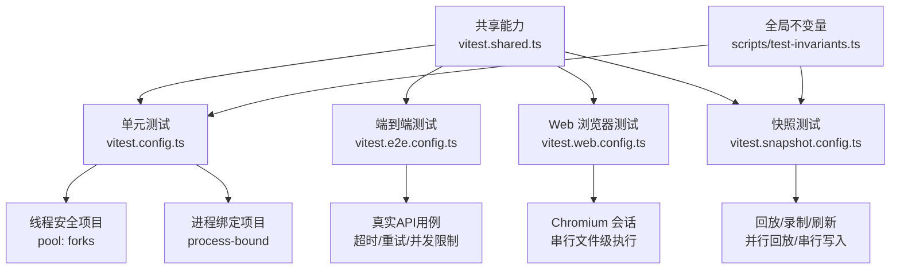
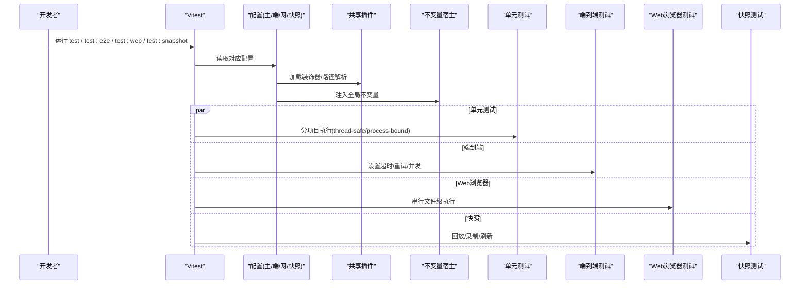
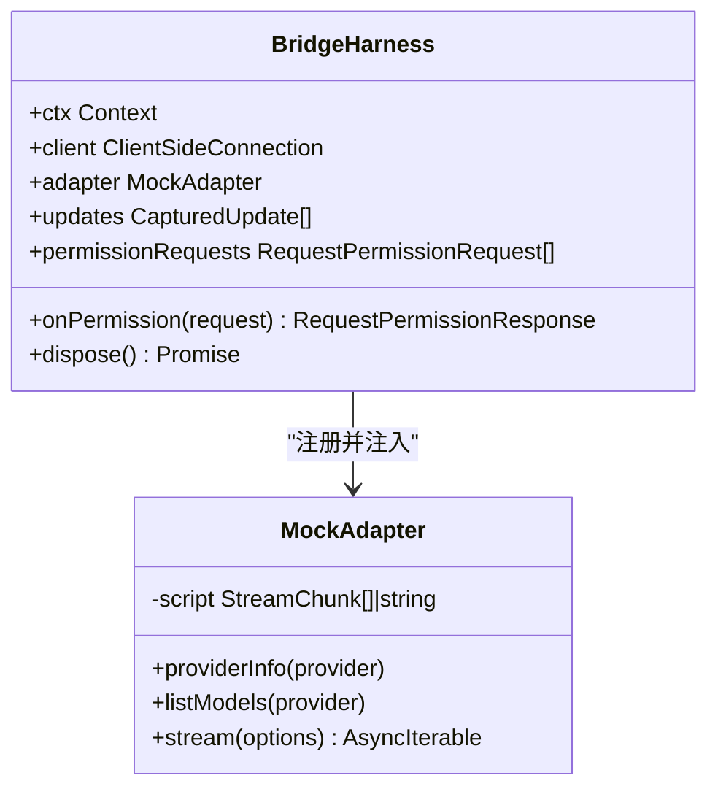
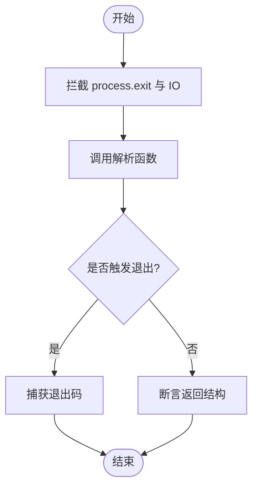
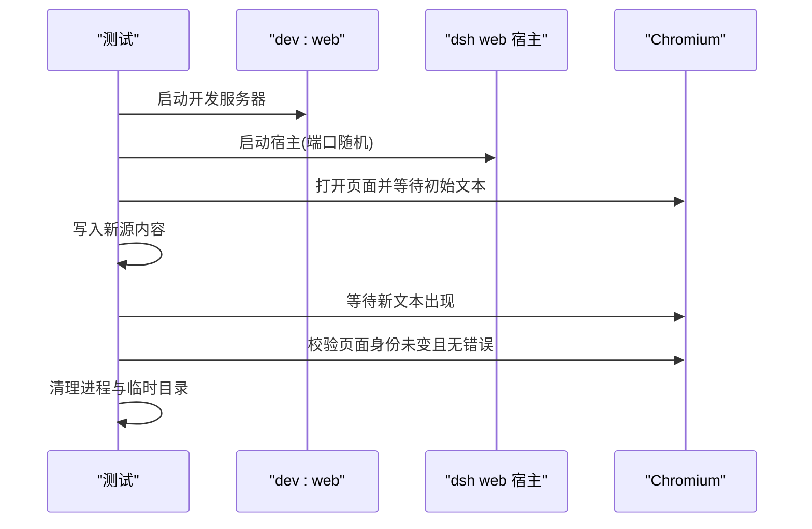
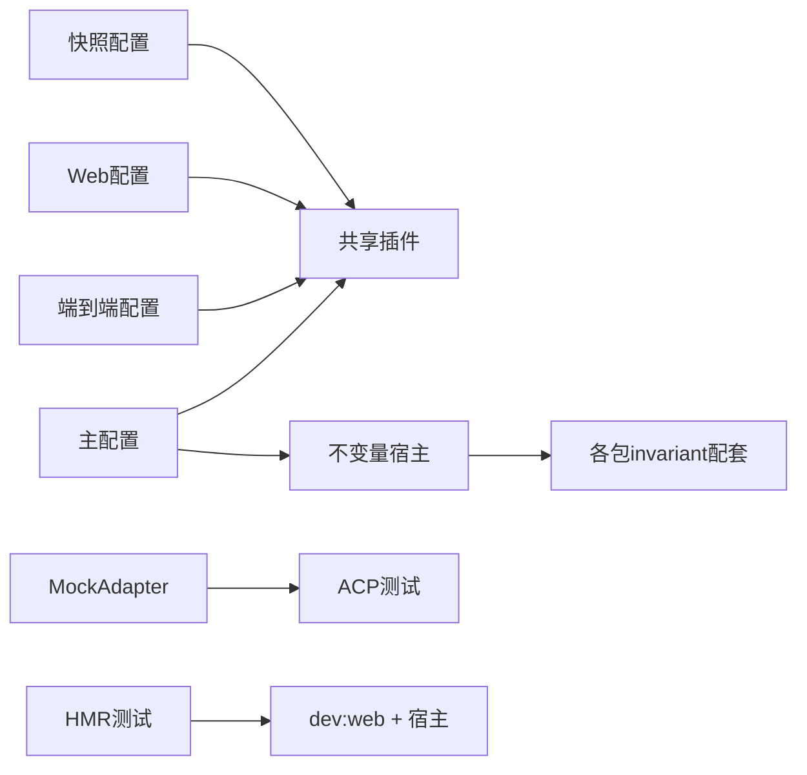

# 单元测试

<cite>
**本文引用的文件**
- [vitest.config.ts](file://vitest.config.ts)
- [vitest.shared.ts](file://vitest.shared.ts)
- [vitest.e2e.config.ts](file://vitest.e2e.config.ts)
- [vitest.web.config.ts](file://vitest.web.config.ts)
- [vitest.snapshot.config.ts](file://vitest.snapshot.config.ts)
- [scripts/test-invariants.ts](file://scripts/test-invariants.ts)
- [scripts/coverage-exempt.ts](file://scripts/coverage-exempt.ts)
- [docs/testing.md](file://docs/testing.md)
- [apps/cli/tests/args.spec.ts](file://apps/cli/tests/args.spec.ts)
- [packages/acp/acp/tests/approval.spec.ts](file://packages/acp/acp/tests/approval.spec.ts)
- [packages/acp/acp/tests/harness.ts](file://packages/acp/acp/tests/harness.ts)
- [apps/web/tests/hmr-live.e2e.ts](file://apps/web/tests/hmr-live.e2e.ts)
</cite>

## 目录
1. [简介](#简介)
2. [项目结构](#项目结构)
3. [核心组件](#核心组件)
4. [架构总览](#架构总览)
5. [详细组件分析](#详细组件分析)
6. [依赖关系分析](#依赖关系分析)
7. [性能考虑](#性能考虑)
8. [故障排查指南](#故障排查指南)
9. [结论](#结论)
10. [附录](#附录)

## 简介
本指南面向使用 Vitest 在本仓库进行单元测试、端到端测试与快照测试的开发者。文档覆盖：
- 测试分层与质量门禁（覆盖率、HMR 安全、真实 API e2e）
- 测试组织与命名约定
- 模拟与存根技巧（LLM 适配器、网络请求等外部依赖）
- 异步与并发场景测试方法
- HMR 安全测试编写要点
- 覆盖率要求与门禁机制
- 具体测试示例与常见模式

## 项目结构
仓库采用多配置驱动的分层测试体系，通过多个 Vitest 配置文件区分不同测试类型与运行环境：
- 单元测试：主配置聚合所有包与脚本的 spec 测试，并执行严格的 per-file 100% 覆盖率门禁
- 端到端测试：独立配置，针对真实 API 调用，具备超时与重试策略
- Web 浏览器测试：基于 Playwright + Chromium 的浏览器级 e2e 与快照对比
- 快照测试：keyless 回放与 keyed 录制/刷新，支持并行回放与串行写入
- 共享能力：装饰器预转换、路径解析、进程隔离与全局不变量注入

图表来源
- [vitest.config.ts:117-159](file://vitest.config.ts#L117-L159)
- [vitest.e2e.config.ts:31-57](file://vitest.e2e.config.ts#L31-L57)
- [vitest.web.config.ts:16-35](file://vitest.web.config.ts#L16-L35)
- [vitest.snapshot.config.ts:39-67](file://vitest.snapshot.config.ts#L39-L67)
- [vitest.shared.ts:15-42](file://vitest.shared.ts#L15-L42)
- [scripts/test-invariants.ts:1-47](file://scripts/test-invariants.ts#L1-L47)

章节来源
- [vitest.config.ts:85-159](file://vitest.config.ts#L85-L159)
- [vitest.e2e.config.ts:31-57](file://vitest.e2e.config.ts#L31-L57)
- [vitest.web.config.ts:16-35](file://vitest.web.config.ts#L16-L35)
- [vitest.snapshot.config.ts:39-67](file://vitest.snapshot.config.ts#L39-L67)
- [vitest.shared.ts:15-42](file://vitest.shared.ts#L15-L42)
- [scripts/test-invariants.ts:1-47](file://scripts/test-invariants.ts#L1-L47)

## 核心组件
- 测试入口与包含规则
  - 单元测试包含 packages、apps、examples 与 scripts 下的 spec 文件；Windows 平台排除不支持的 shell/sandbox 套件
  - 进程绑定测试单独成项目，避免 worker 线程对进程全局状态的影响
- 覆盖率门禁
  - 使用 v8 提供者，仅统计 packages/*/src 下的源码
  - 严格 per-file 100% 阈值（语句、分支、函数、行），未达标即失败
  - 提供“重型套件豁免”机制，在聚合覆盖率时以无插桩方式运行特定套件，避免编译器/子进程开销影响门禁
- 共享插件
  - 标准装饰器预转换：在 Vite 默认解析前将 TypeScript 装饰器转译为可执行代码
  - 路径解析：统一指向 tsconfig.base.json，确保测试阶段解析到 src 而非 lib
- 全局不变量宿主
  - 自动发现并挂载各包的 invariant 配套，保证服务拓扑与生命周期在测试中受控
  - 为需要附件能力的测试提供最小化 AttachmentStore 实现

章节来源
- [vitest.config.ts:117-283](file://vitest.config.ts#L117-L283)
- [scripts/coverage-exempt.ts:1-42](file://scripts/coverage-exempt.ts#L1-L42)
- [vitest.shared.ts:15-42](file://vitest.shared.ts#L15-L42)
- [scripts/test-invariants.ts:1-47](file://scripts/test-invariants.ts#L1-L47)

## 架构总览
下图展示了从测试配置到运行时的关键交互：Vitest 启动后加载共享插件与不变量宿主，按项目划分执行单元与进程绑定测试；端到端与 Web 浏览器测试分别走独立配置；快照测试根据环境变量切换回放/录制/刷新模式。

图表来源
- [vitest.config.ts:117-159](file://vitest.config.ts#L117-L159)
- [vitest.e2e.config.ts:31-57](file://vitest.e2e.config.ts#L31-L57)
- [vitest.web.config.ts:16-35](file://vitest.web.config.ts#L16-L35)
- [vitest.snapshot.config.ts:39-67](file://vitest.snapshot.config.ts#L39-L67)
- [vitest.shared.ts:15-42](file://vitest.shared.ts#L15-L42)
- [scripts/test-invariants.ts:1-47](file://scripts/test-invariants.ts#L1-L47)

## 详细组件分析

### 单元测试配置与最佳实践
- 测试组织与命名
  - 测试与源码同域放置：packages/*/tests、apps/*/tests、examples/*/tests、scripts/**/*.spec.ts
  - 文件名后缀 .spec.ts/.spec.tsx，便于被 include 规则捕获
- 进程隔离与稳定性
  - 默认 pool: forks 避免 Node 24 在 worker 线程的已知问题
  - 进程绑定测试单独项目，避免跨线程污染
- 覆盖率门禁
  - 每文件 100% 阈值，未覆盖行通常意味着死代码或需删除的路径
  - 重型套件可通过豁免清单在无插桩模式下运行，不影响门禁结果
- 装饰器与路径
  - 使用标准装饰器插件在编译前处理装饰器语法
  - 通过 vite-tsconfig-paths 指向 tsconfig.base.json，保证解析到 src

章节来源
- [vitest.config.ts:85-159](file://vitest.config.ts#L85-L159)
- [vitest.config.ts:160-283](file://vitest.config.ts#L160-L283)
- [vitest.shared.ts:15-42](file://vitest.shared.ts#L15-L42)
- [scripts/coverage-exempt.ts:1-42](file://scripts/coverage-exempt.ts#L1-L42)

### LLM 适配器与外部依赖的模拟/存根
- 使用内存传输与脚本化流构造 BridgeHarness，替代真实模型调用
- MockAdapter 继承 LlmAdapter，按脚本输出 StreamChunk，支持挂起、中止、错误等边界
- 通过 onPermission 回调控制权限决策，验证审批策略与协议映射
- 适用于：
  - 流式响应、中断、最大 token 限制、错误恢复
  - 权限请求、会话更新、异常关闭通道

图表来源
- [packages/acp/acp/tests/harness.ts:21-175](file://packages/acp/acp/tests/harness.ts#L21-L175)

章节来源
- [packages/acp/acp/tests/harness.ts:21-175](file://packages/acp/acp/tests/harness.ts#L21-L175)
- [packages/acp/acp/tests/approval.spec.ts:1-79](file://packages/acp/acp/tests/approval.spec.ts#L1-L79)

### CLI 参数解析测试（断言退出码与副作用）
- 使用 vi.spyOn 拦截 process.exit、stdout/stderr.write，捕获退出码并抑制输出
- 覆盖路由分支、未知标志、冲突输入、帮助/版本输出等场景
- 适合验证命令行工具的错误路径与健壮性

图表来源
- [apps/cli/tests/args.spec.ts:1-107](file://apps/cli/tests/args.spec.ts#L1-L107)

章节来源
- [apps/cli/tests/args.spec.ts:1-107](file://apps/cli/tests/args.spec.ts#L1-L107)

### 端到端测试（真实 API）
- 独立配置 vitest.e2e.config.ts，加载 .env（可选），设置较长超时与重试
- 文件级并行度可控（DSH_E2E_MAX_WORKERS），避免配额争用
- 每个用例自检测密钥是否存在，缺失则跳过，保障 keyless CI 绿色

章节来源
- [vitest.e2e.config.ts:1-59](file://vitest.e2e.config.ts#L1-L59)

### Web 浏览器测试与 HMR 安全
- 使用 vitest.web.config.ts 管理 apps/web 的 e2e 与 snapshot 用例
- 通过 Playwright 启动 Chromium，验证页面行为与快照一致性
- HMR 安全测试：
  - 启动 dev:web 与 dsh web 宿主，监听输出就绪
  - 修改源文件，断言页面热更新且无刷新、无错误
  - 清理临时目录与进程树，确保资源释放

图表来源
- [apps/web/tests/hmr-live.e2e.ts:70-133](file://apps/web/tests/hmr-live.e2e.ts#L70-L133)
- [vitest.web.config.ts:16-35](file://vitest.web.config.ts#L16-L35)

章节来源
- [apps/web/tests/hmr-live.e2e.ts:70-133](file://apps/web/tests/hmr-live.e2e.ts#L70-L133)
- [vitest.web.config.ts:16-35](file://vitest.web.config.ts#L16-L35)

### 快照测试（回放/录制/刷新）
- 回放模式（默认）：并行回放，比较已提交期望输出
- 录制模式：读取 .env，调用真实 API，生成/更新期望输出
- 刷新模式：基于已提交脚本重新回放，更新当前期望输出
- 并发控制：通过 DSH_SNAPSHOT_MAX_CONCURRENCY 调节

章节来源
- [vitest.snapshot.config.ts:1-69](file://vitest.snapshot.config.ts#L1-L69)

### 全局不变量与服务拓扑
- 自动发现并挂载各包 invariant 配套，确保服务生命周期在测试中受控
- 为附件相关测试提供最小化存储实现，避免真实 I/O
- 支持手动拓扑测试例外，允许聚焦测试自定义服务选择

章节来源
- [scripts/test-invariants.ts:1-274](file://scripts/test-invariants.ts#L1-L274)

## 依赖关系分析
- 配置间耦合
  - 主配置聚合 thread-safe 与 process-bound 两个项目，共享路径与装饰器插件
  - e2e/web/snapshot 配置复用 shared 插件与 execArgv 开关
- 运行时依赖
  - 单元测试依赖不变量宿主与包内 invariant 配套
  - e2e/web/snapshot 各自引入必要的环境变量与外部工具（Playwright、Chromium）
- 外部集成点
  - LLM 适配器通过 MockAdapter 解耦真实模型
  - 权限流程通过 onPermission 回调注入决策逻辑
  - HMR 测试依赖构建产物与 dev:web 工作流

图表来源
- [vitest.config.ts:117-159](file://vitest.config.ts#L117-L159)
- [vitest.e2e.config.ts:31-57](file://vitest.e2e.config.ts#L31-L57)
- [vitest.web.config.ts:16-35](file://vitest.web.config.ts#L16-L35)
- [vitest.snapshot.config.ts:39-67](file://vitest.snapshot.config.ts#L39-L67)
- [scripts/test-invariants.ts:1-47](file://scripts/test-invariants.ts#L1-L47)
- [packages/acp/acp/tests/harness.ts:21-175](file://packages/acp/acp/tests/harness.ts#L21-L175)
- [apps/web/tests/hmr-live.e2e.ts:70-133](file://apps/web/tests/hmr-live.e2e.ts#L70-L133)

## 性能考虑
- 单元测试
  - 使用 fork 池提升稳定性，避免线程共享状态导致的崩溃
  - 重型套件通过豁免清单在无插桩模式下运行，减少覆盖率采集开销
- 端到端测试
  - 合理设置 maxWorkers，避免配额争用与资源竞争
  - 长超时与重试降低偶发失败影响
- Web 浏览器测试
  - 文件级串行执行，共享浏览器实例，减少启动开销
- 快照测试
  - 回放并行加速，录制/刷新串行写入，防止竞争写损坏黄金文件

[本节为通用指导，不直接分析具体文件]

## 故障排查指南
- 覆盖率门禁失败
  - 检查未覆盖位置报告（CI 下会输出精确 path:line:col）
  - 确认是否为死代码或应删除路径；必要时调整 exclude 或补充测试
  - 若属于重型套件，确认是否在豁免清单中正确配置
- 进程绑定测试不稳定
  - 确认其归属 process-bound 项目，避免与线程安全项目混跑
- HMR 测试失败
  - 确保已构建产物存在；检查 dev:web 与宿主进程输出
  - 验证临时目录清理与进程树终止
- 端到端测试超时/失败
  - 调整 DSH_E2E_MAX_WORKERS 降低并发
  - 检查密钥与环境变量是否正确加载

章节来源
- [vitest.config.ts:160-283](file://vitest.config.ts#L160-L283)
- [scripts/coverage-exempt.ts:1-42](file://scripts/coverage-exempt.ts#L1-L42)
- [apps/web/tests/hmr-live.e2e.ts:70-133](file://apps/web/tests/hmr-live.e2e.ts#L70-L133)
- [vitest.e2e.config.ts:31-57](file://vitest.e2e.config.ts#L31-L57)

## 结论
本仓库通过多配置、强门禁与丰富的测试基础设施，实现了高可靠性的单元测试、端到端与快照测试体系。遵循本文规范与最佳实践，可有效提升代码质量、缩短反馈周期，并确保关键路径（如 HMR、权限、LLM 适配）在变更时保持稳定。

[本节为总结性内容，不直接分析具体文件]

## 附录
- 测试分层与政策参考
  - 测试层级、覆盖率门禁、真实 API e2e、快照策略与“优先真实实现”的原则
- 常用命令
  - 单元测试、覆盖率、端到端、Web 浏览器测试、快照回放/录制/刷新

章节来源
- [docs/testing.md:1-50](file://docs/testing.md#L1-L50)