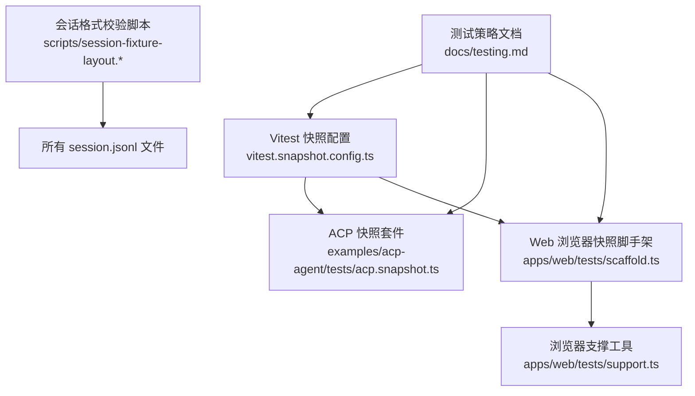
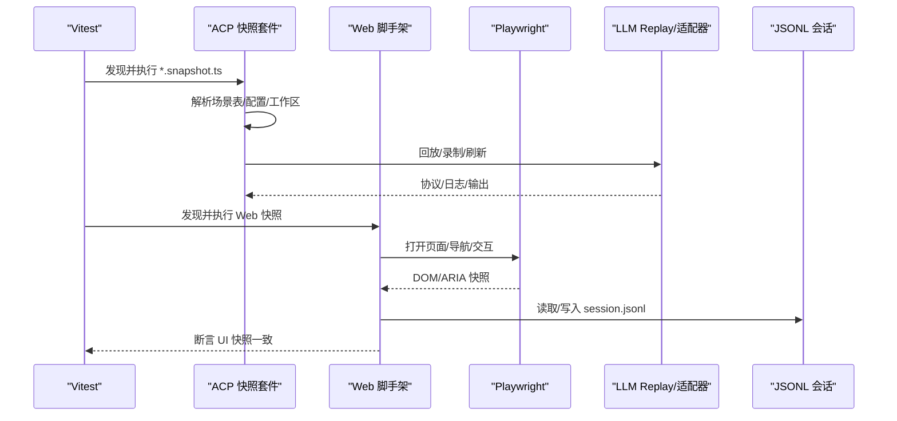
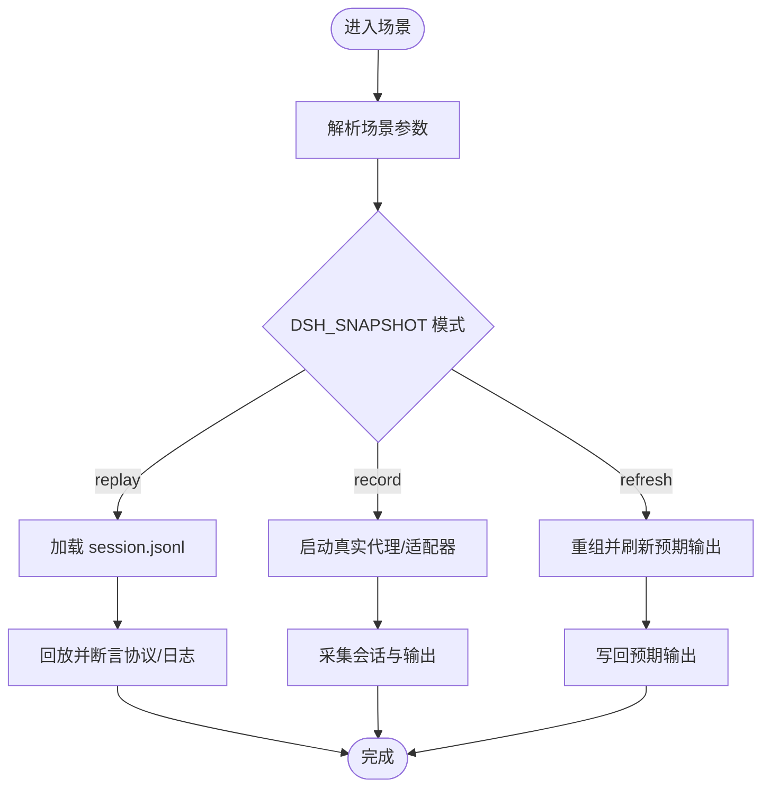
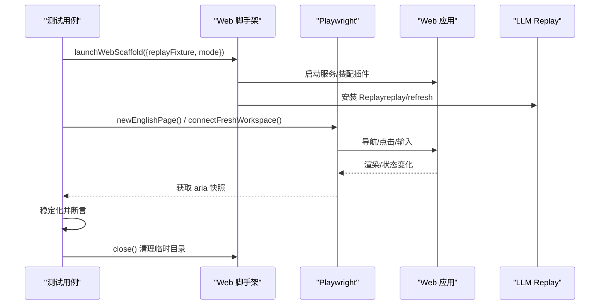
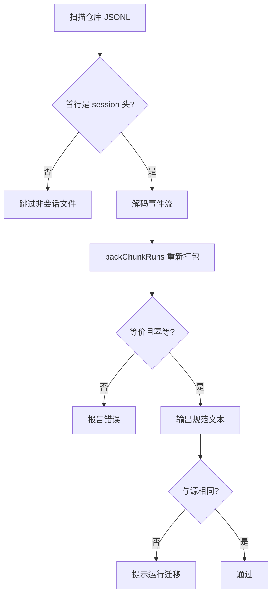
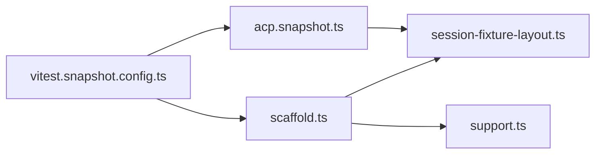

# 快照测试

<cite>
**本文引用的文件**
- [vitest.snapshot.config.ts](file://vitest.snapshot.config.ts)
- [testing.md](file://docs/testing.md)
- [acp.snapshot.ts](file://examples/acp-agent/tests/acp.snapshot.ts)
- [scaffold.ts](file://apps/web/tests/scaffold.ts)
- [support.ts](file://apps/web/tests/support.ts)
- [session-fixture-layout.snapshot.ts](file://scripts/session-fixture-layout.snapshot.ts)
- [session-fixture-layout.ts](file://scripts/session-fixture-layout.ts)
</cite>

## 目录
1. [简介](#简介)
2. [项目结构](#项目结构)
3. [核心组件](#核心组件)
4. [架构总览](#架构总览)
5. [详细组件分析](#详细组件分析)
6. [依赖关系分析](#依赖关系分析)
7. [性能考虑](#性能考虑)
8. [故障排查指南](#故障排查指南)
9. [结论](#结论)
10. [附录](#附录)

## 简介
本指南面向 DeepSeek Harness 仓库中的“快照测试”体系，覆盖原理、应用场景、用例编写与维护、会话格式与 JSONL 管理、浏览器快照配置与使用、界面渲染验证、更新最佳实践与审查流程、非确定性数据处理以及性能优化与自动化更新工具。目标是帮助读者在不深入源码细节的前提下，也能正确编写、运行和维护快照测试。

## 项目结构
仓库将快照测试分为三类：
- ACP/Headless 后端行为快照：通过示例工程（如 examples/acp-agent）驱动真实子进程，回放已录制的会话或刷新预期输出，校验协议与持久化日志。
- Web 浏览器快照：在真实 Chromium 中回放会话并比对 UI 渲染结果（aria 快照等），期望文件位于 apps/web/tests/snapshots。
- 会话格式一致性检查：确保所有 session.jsonl 采用统一的“压缩行布局”。

图表来源
- [vitest.snapshot.config.ts:1-69](file://vitest.snapshot.config.ts#L1-L69)
- [acp.snapshot.ts:1-662](file://examples/acp-agent/tests/acp.snapshot.ts#L1-L662)
- [scaffold.ts:1-908](file://apps/web/tests/scaffold.ts#L1-L908)
- [support.ts:1-136](file://apps/web/tests/support.ts#L1-L136)
- [session-fixture-layout.snapshot.ts:1-18](file://scripts/session-fixture-layout.snapshot.ts#L1-L18)
- [session-fixture-layout.ts:1-129](file://scripts/session-fixture-layout.ts#L1-L129)
- [testing.md:1-50](file://docs/testing.md#L1-L50)

章节来源
- [vitest.snapshot.config.ts:1-69](file://vitest.snapshot.config.ts#L1-L69)
- [testing.md:1-50](file://docs/testing.md#L1-L50)

## 核心组件
- Vitest 快照配置：定义快照测试的包含范围、并发度、超时、记录模式加载 .env 的行为，以及 replay/record/refresh 三种模式的差异。
- ACP 快照套件：以场景表驱动，组合 Cordis 配置、工作区准备、头信息固定、平台条件跳过（如 pwsh 缺失）、录制与刷新逻辑。
- Web 浏览器脚手架：启动真实 Web 组装树，注入 LLM Replay 或路由适配器，隔离工作区与持久化根，提供录制/回放/刷新能力，并生成稳定的 aria 快照。
- 会话格式校验：扫描仓库内所有 JSONL，若首行为 session 头则强制转换为“压缩行布局”，保证可重放与可比对。

章节来源
- [vitest.snapshot.config.ts:1-69](file://vitest.snapshot.config.ts#L1-L69)
- [acp.snapshot.ts:1-662](file://examples/acp-agent/tests/acp.snapshot.ts#L1-L662)
- [scaffold.ts:1-908](file://apps/web/tests/scaffold.ts#L1-L908)
- [session-fixture-layout.snapshot.ts:1-18](file://scripts/session-fixture-layout.snapshot.ts#L1-L18)
- [session-fixture-layout.ts:1-129](file://scripts/session-fixture-layout.ts#L1-L129)

## 架构总览
快照测试的整体流程如下：
- 通过 Vitest 快照配置发现并执行 *.snapshot.ts。
- ACP 套件根据场景表选择 Cordis 配置与工作区，必要时准备环境（如固定 mtime 的文件）。
- Web 脚手架启动真实 Web 应用，按模式装载 LLM Replay 或禁用真实模型，使用 Playwright 驱动浏览器进行交互，产出稳定化的 UI 快照。
- 所有 session.jsonl 必须满足统一布局，否则被格式校验脚本拒绝。

图表来源
- [vitest.snapshot.config.ts:1-69](file://vitest.snapshot.config.ts#L1-L69)
- [acp.snapshot.ts:1-662](file://examples/acp-agent/tests/acp.snapshot.ts#L1-L662)
- [scaffold.ts:1-908](file://apps/web/tests/scaffold.ts#L1-L908)

## 详细组件分析

### ACP 快照套件（后端行为与协议）
- 场景表驱动：每个场景声明名称、是否含模型轮次、是否录制、是否固定请求头、平台限制（如 posixOnly/pwshOnly）、Cordis 配置路径、工作区准备函数等。
- 录制与刷新：
  - record：调用真实 API，采集会话与预期输出，需具备密钥。
  - refresh：仅回放已提交输入，重写当前预期输出，不加载 .env。
  - replay：默认 keyless 模式，回放已录制数据并对比。
- 头信息与侧车：某些场景固定系统提示与工具 schema，避免无关变更导致抖动。
- 工作区准备：为需要确定性的文件系统操作创建固定时间戳的文件，保证排序稳定。

图表来源
- [acp.snapshot.ts:1-662](file://examples/acp-agent/tests/acp.snapshot.ts#L1-L662)
- [vitest.snapshot.config.ts:1-69](file://vitest.snapshot.config.ts#L1-L69)

章节来源
- [acp.snapshot.ts:1-662](file://examples/acp-agent/tests/acp.snapshot.ts#L1-L662)
- [vitest.snapshot.config.ts:1-69](file://vitest.snapshot.config.ts#L1-L69)

### Web 浏览器快照（UI 渲染）
- 脚手架职责：
  - 启动真实 Web 组装树，隔离工作区与持久化根，设置临时 Home。
  - 根据 DSH_SNAPSHOT 决定模式：replay（默认 keyless，禁用 llm-deepseek 并安装 Replay）、record（需要密钥）、refresh（keyless 回放并重写金值）。
  - 注入 LLM Replay 或路由适配器，确保无模型调用时仍保持 provider 路由可用。
  - 提供 whenTurnSettled 等待回合结束并 flush 持久化。
- 浏览器交互：
  - 使用 Playwright 打开构建产物，支持语言切换、工作区连接、对话框交互等。
  - 收集 aria 快照并进行稳定化处理（替换 UUID、路径、耗时等）。
- 录制与刷新：
  - record：从内存会话导出原始 JSONL，清洗请求头与可变标识符后写回 fixture。
  - refresh：keyless 回放并重写预期 UI 快照。

图表来源
- [scaffold.ts:1-908](file://apps/web/tests/scaffold.ts#L1-L908)
- [support.ts:1-136](file://apps/web/tests/support.ts#L1-L136)

章节来源
- [scaffold.ts:1-908](file://apps/web/tests/scaffold.ts#L1-L908)
- [support.ts:1-136](file://apps/web/tests/support.ts#L1-L136)

### 会话格式与 JSONL 管理
- 统一布局：所有 session.jsonl 必须采用“压缩行布局”，即首行为 session 头，后续行为压缩后的存储记录。
- 校验与迁移：
  - 脚本会扫描仓库中所有 JSONL，识别 session 头并计算“规范表示”。
  - 若当前布局与规范不一致，测试失败并提示运行迁移命令。
  - 规范化过程会解码事件流再打包，确保等价性与幂等性。

图表来源
- [session-fixture-layout.ts:1-129](file://scripts/session-fixture-layout.ts#L1-L129)
- [session-fixture-layout.snapshot.ts:1-18](file://scripts/session-fixture-layout.snapshot.ts#L1-L18)

章节来源
- [session-fixture-layout.ts:1-129](file://scripts/session-fixture-layout.ts#L1-L129)
- [session-fixture-layout.snapshot.ts:1-18](file://scripts/session-fixture-layout.snapshot.ts#L1-L18)

## 依赖关系分析
- Vitest 快照配置依赖 tsconfigPaths 与标准装饰器插件；根据 DSH_SNAPSHOT 控制并发与模式。
- ACP 套件依赖 dsh-acp-snapshot 套件工厂、pwsh 检测、会话解码工具。
- Web 脚手架依赖 Cordis Loader/Include/Group、dsh-app-boot、dsh-session、dsh-llm-replay、Playwright。
- 会话格式校验依赖 dsh-session 的解码与打包工具。

图表来源
- [vitest.snapshot.config.ts:1-69](file://vitest.snapshot.config.ts#L1-L69)
- [acp.snapshot.ts:1-662](file://examples/acp-agent/tests/acp.snapshot.ts#L1-L662)
- [scaffold.ts:1-908](file://apps/web/tests/scaffold.ts#L1-L908)
- [support.ts:1-136](file://apps/web/tests/support.ts#L1-L136)
- [session-fixture-layout.ts:1-129](file://scripts/session-fixture-layout.ts#L1-L129)

章节来源
- [vitest.snapshot.config.ts:1-69](file://vitest.snapshot.config.ts#L1-L69)
- [acp.snapshot.ts:1-662](file://examples/acp-agent/tests/acp.snapshot.ts#L1-L662)
- [scaffold.ts:1-908](file://apps/web/tests/scaffold.ts#L1-L908)
- [session-fixture-layout.ts:1-129](file://scripts/session-fixture-layout.ts#L1-L129)

## 性能考虑
- 并发控制：
  - 快照测试可通过环境变量控制最大并发，replay 模式允许文件级并行与文件内并发上限；record/refresh 串行以避免竞争写。
- 超时与钩子：
  - 设置合理的测试与钩子超时，避免长时间阻塞。
- 浏览器快照：
  - 使用最小必要交互与稳定化的窗口大小，减少渲染差异。
  - 仅在必要时启用 LLM Replay pacing，避免过快导致时序问题。
- 会话格式：
  - 使用压缩行布局减少文件大小与 I/O 开销，提升回放速度。

章节来源
- [vitest.snapshot.config.ts:1-69](file://vitest.snapshot.config.ts#L1-L69)
- [scaffold.ts:1-908](file://apps/web/tests/scaffold.ts#L1-L908)

## 故障排查指南
- 缺少密钥：
  - Web 录制模式需要 DEEPSEEK_API_KEY；未提供时会抛出明确错误。
- 构建产物缺失：
  - 浏览器测试要求先构建 dist；若不存在会报错并提示先执行构建。
- 会话格式不一致：
  - 当 session.jsonl 不符合压缩行布局时，校验脚本会失败并提示运行迁移命令。
- 平台依赖缺失：
  - 某些场景需要 pwsh 或 POSIX shell；若无对应环境，相关场景会被跳过或失败，需在本地补齐环境。
- 回放未消费：
  - Web 脚手架关闭时会检查 Replay 是否完全消费；若有未消费数据， teardown 会聚合错误。

章节来源
- [scaffold.ts:1-908](file://apps/web/tests/scaffold.ts#L1-L908)
- [support.ts:1-136](file://apps/web/tests/support.ts#L1-L136)
- [session-fixture-layout.snapshot.ts:1-18](file://scripts/session-fixture-layout.snapshot.ts#L1-L18)
- [session-fixture-layout.ts:1-129](file://scripts/session-fixture-layout.ts#L1-L129)

## 结论
该仓库的快照测试体系围绕“可回放、可刷新、可审计”的原则设计：
- ACP 快照聚焦后端协议与持久化日志的一致性。
- Web 快照聚焦浏览器渲染结果的稳定性。
- 会话格式校验确保底层数据契约的统一。
通过严格的模式控制、并发与超时配置、稳定化工具与自动化迁移，团队可以在不引入噪声的前提下持续演进产品功能。

## 附录

### 如何编写与维护快照测试用例
- 新增场景：
  - 在 ACP 套件中添加场景条目，指定名称、是否含模型轮次、是否录制、是否固定头、平台限制、Cordis 配置与工作区准备。
  - 在 Web 套件中使用脚手架启动真实应用，通过 Playwright 驱动交互，收集并断言稳定化的 UI 快照。
- 维护预期输出：
  - 当模型转录或协议变化时，使用 record 模式重新录制；当回放输入有效但预期输出过时，使用 refresh 模式刷新。
  - 每次更新都需人工审查 diff，确保变更符合预期。
- 会话格式：
  - 若校验失败，运行迁移命令将 session.jsonl 转换为压缩行布局后再提交。

章节来源
- [acp.snapshot.ts:1-662](file://examples/acp-agent/tests/acp.snapshot.ts#L1-L662)
- [scaffold.ts:1-908](file://apps/web/tests/scaffold.ts#L1-L908)
- [session-fixture-layout.snapshot.ts:1-18](file://scripts/session-fixture-layout.snapshot.ts#L1-L18)

### 会话格式与 JSONL 文件的管理
- 规则：
  - 首行必须是 session 头；后续行为压缩后的存储记录。
  - 所有 JSONL 必须通过格式校验，否则 CI 失败。
- 工具：
  - 使用脚本扫描并计算规范表示；若不匹配，提示运行迁移命令。
  - 迁移过程解码事件流再打包，确保等价性与幂等性。

章节来源
- [session-fixture-layout.ts:1-129](file://scripts/session-fixture-layout.ts#L1-L129)
- [session-fixture-layout.snapshot.ts:1-18](file://scripts/session-fixture-layout.snapshot.ts#L1-L18)

### 浏览器快照测试的配置与使用
- 配置要点：
  - 使用 Vitest 快照配置与 Web 脚手架；CI 强制 replay 模式，禁止写入预期输出。
  - 本地开发可使用 record/refresh 模式更新金值，但需人工审查。
- 使用方法：
  - 通过脚手架启动真实 Web 应用，注入 Replay 或路由适配器。
  - 使用 Playwright 打开页面，执行工作区连接、对话框交互等操作。
  - 收集 aria 快照并进行稳定化处理，断言与预期一致。

章节来源
- [vitest.snapshot.config.ts:1-69](file://vitest.snapshot.config.ts#L1-L69)
- [scaffold.ts:1-908](file://apps/web/tests/scaffold.ts#L1-L908)
- [support.ts:1-136](file://apps/web/tests/support.ts#L1-L136)

### 测试用户界面渲染结果
- 方法：
  - 使用 Playwright 驱动浏览器，模拟用户操作。
  - 收集 aria 快照并通过稳定化工具替换 UUID、路径、耗时等非确定性字段。
  - 断言快照与预期一致，确保 UI 回归。

章节来源
- [scaffold.ts:1-908](file://apps/web/tests/scaffold.ts#L1-L908)
- [support.ts:1-136](file://apps/web/tests/support.ts#L1-L136)

### 快照更新的最佳实践与审查流程
- 最佳实践：
  - 优先使用 replay 模式验证；仅在必要时使用 record/refresh。
  - 对关键场景固定请求头与工具 schema，减少无关变更。
  - 对工作区文件设置固定时间戳，保证排序稳定。
- 审查流程：
  - 任何预期输出的变更都必须人工审查，确保变更合理且可控。
  - 对于会话格式变更，运行迁移命令并提交机械性重写。

章节来源
- [acp.snapshot.ts:1-662](file://examples/acp-agent/tests/acp.snapshot.ts#L1-L662)
- [session-fixture-layout.ts:1-129](file://scripts/session-fixture-layout.ts#L1-L129)

### 处理非确定性输出和随机数据
- 策略：
  - 替换 UUID、会话 ID、工作区路径、RPC ID、耗时等为占位符。
  - 固定文件系统时间戳，保证排序稳定。
  - 使用 Replay 回放已录制数据，避免实时模型输出波动。

章节来源
- [scaffold.ts:1-908](file://apps/web/tests/scaffold.ts#L1-L908)
- [acp.snapshot.ts:1-662](file://examples/acp-agent/tests/acp.snapshot.ts#L1-L662)

### 自动化快照更新的工具与方法
- 工具：
  - Vitest 快照配置支持并发与环境变量控制。
  - 会话格式脚本提供扫描、规范化与迁移提示。
- 方法：
  - 在本地使用 record/refresh 模式更新金值。
  - 在 CI 中强制 replay 模式，确保只读比较。

章节来源
- [vitest.snapshot.config.ts:1-69](file://vitest.snapshot.config.ts#L1-L69)
- [session-fixture-layout.snapshot.ts:1-18](file://scripts/session-fixture-layout.snapshot.ts#L1-L18)