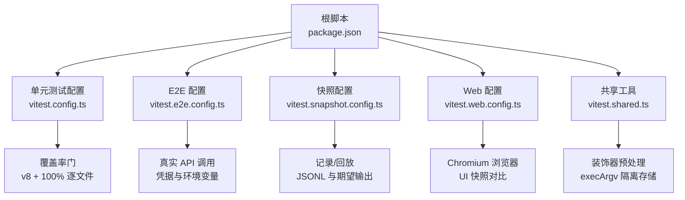
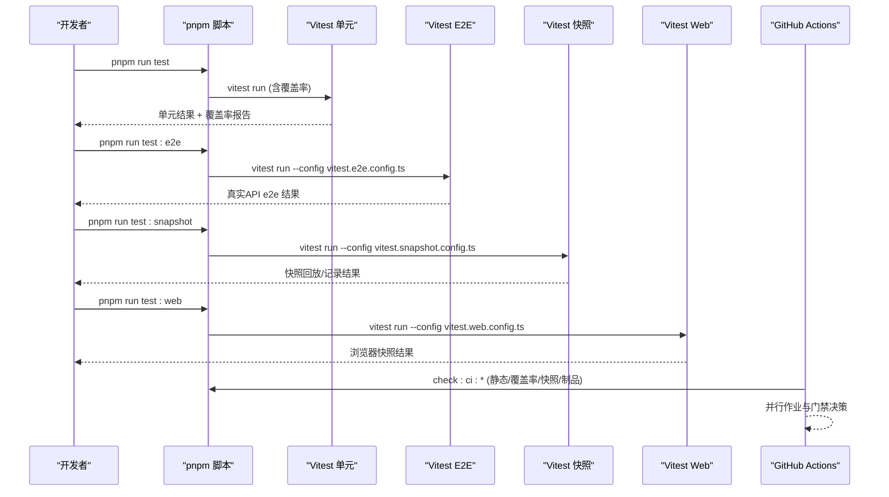
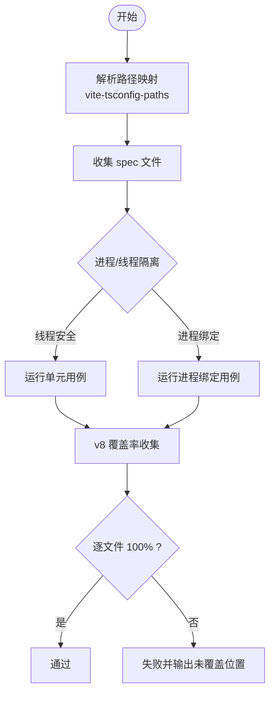
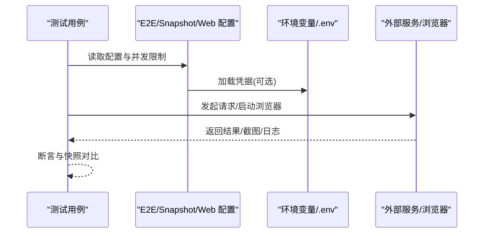
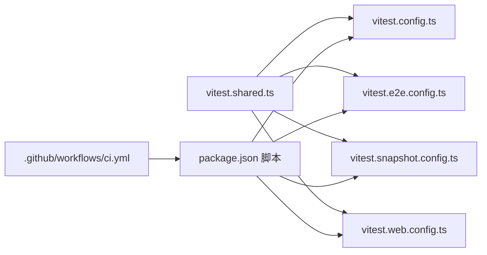

# 测试与质量保证

<cite>
**本文引用的文件**
- [docs/testing.md](file://docs/testing.md)
- [vitest.config.ts](file://vitest.config.ts)
- [vitest.e2e.config.ts](file://vitest.e2e.config.ts)
- [vitest.snapshot.config.ts](file://vitest.snapshot.config.ts)
- [vitest.web.config.ts](file://vitest.web.config.ts)
- [vitest.shared.ts](file://vitest.shared.ts)
- [package.json](file://package.json)
- [.github/workflows/ci.yml](file://.github/workflows/ci.yml)
- [apps/web/stress-tests/reasoning-chunks.stress.ts](file://apps/web/stress-tests/reasoning-chunks.stress.ts)
- [packages/test-support/client-runtime/src/sessions.ts](file://packages/test-support/client-runtime/src/sessions.ts)
</cite>

## 目录
1. [简介](#简介)
2. [项目结构](#项目结构)
3. [核心组件](#核心组件)
4. [架构总览](#架构总览)
5. [详细组件分析](#详细组件分析)
6. [依赖关系分析](#依赖关系分析)
7. [性能考虑](#性能考虑)
8. [故障排查指南](#故障排查指南)
9. [结论](#结论)
10. [附录](#附录)

## 简介
本指南面向插件开发与维护者，系统化说明本仓库的测试策略、方法论与落地实践。内容覆盖单元测试编写与运行、集成测试设计、测试环境搭建与配置、模拟与存根技巧、端到端测试方法、代码质量检查工具与流程、性能与负载测试方法，以及持续集成的配置与优化建议。目标是帮助你在保证质量的同时保持高迭代效率。

## 项目结构
仓库采用多包工作区组织，测试按层级与用途拆分到不同配置文件：
- 单元测试与覆盖率：基于 Vitest，聚合所有 packages/apps/examples/scripts 下的 spec 用例，并执行严格的逐文件 100% 覆盖率门禁。
- 真实 API 端到端测试：独立配置，支持凭据加载与并发控制，自动跳过无密钥场景。
- 快照测试：以“记录/回放”模式驱动关键外部行为（协议、呈现、持久化日志）的稳定性验证。
- Web 浏览器测试：构建前端产物后，使用 Chromium 进行 UI 交互与快照对比。
- 压力测试：可选的浏览器压力用例，评估极端场景下的响应性。

图表来源
- [package.json:19-47](file://package.json#L19-L47)
- [vitest.config.ts:117-283](file://vitest.config.ts#L117-L283)
- [vitest.e2e.config.ts:31-57](file://vitest.e2e.config.ts#L31-L57)
- [vitest.snapshot.config.ts:39-67](file://vitest.snapshot.config.ts#L39-L67)
- [vitest.web.config.ts:16-34](file://vitest.web.config.ts#L16-L34)
- [vitest.shared.ts:1-43](file://vitest.shared.ts#L1-L43)

章节来源
- [package.json:19-47](file://package.json#L19-L47)
- [vitest.config.ts:117-283](file://vitest.config.ts#L117-L283)
- [vitest.e2e.config.ts:31-57](file://vitest.e2e.config.ts#L31-L57)
- [vitest.snapshot.config.ts:39-67](file://vitest.snapshot.config.ts#L39-L67)
- [vitest.web.config.ts:16-34](file://vitest.web.config.ts#L16-L34)
- [vitest.shared.ts:1-43](file://vitest.shared.ts#L1-L43)

## 核心组件
- 测试分层与规则
  - 单元测试：快速、聚焦、就近放置；每个注册点需包含 HMR 安全测试（释放 fiber、断言清理）。
  - 覆盖率门禁：逐文件 100%，对未覆盖行视为潜在死代码；针对特定平台或依赖缺失的场景提供豁免。
  - 真实 API e2e：有密钥时调用真实模型与第三方服务；无密钥时自跳过，保障 keyless CI 稳定。
  - 快照测试：键无关的关键行为回归；ACP、headless、CLI、Web GUI 均有对应快照套件。
  - Web 浏览器快照：Linux PR 门禁，强制 replay 模式，禁止写入期望输出。
- 测试原则
  - 优先真实实现而非 mock；仅在昂贵或不确定边界（LLM、网络、时钟）使用模拟。
  - 通过外部可观测结果断言（文件、命令输出、协议报文），避免仅断言自身报告。
  - 测试资源在测试内创建并在 afterEach 中释放，避免跨测试污染。
  - 测试解析始终指向源码平面（src），避免加载已构建产物导致单例重复。
  - 子进程启动统一通过双模式启动器，不在测试中手写 tsx 参数。
  - 非平凡变更必须配套快照场景，确保装配后的行为被锁定。

章节来源
- [docs/testing.md:7-49](file://docs/testing.md#L7-L49)

## 架构总览
测试体系由多个 Vitest 配置协同构成，分别承担不同职责并通过环境变量与脚本命令组合形成完整流水线。

图表来源
- [package.json:19-47](file://package.json#L19-L47)
- [vitest.config.ts:117-283](file://vitest.config.ts#L117-L283)
- [vitest.e2e.config.ts:31-57](file://vitest.e2e.config.ts#L31-L57)
- [vitest.snapshot.config.ts:39-67](file://vitest.snapshot.config.ts#L39-L67)
- [vitest.web.config.ts:16-34](file://vitest.web.config.ts#L16-L34)
- [.github/workflows/ci.yml:115-200](file://.github/workflows/ci.yml#L115-L200)

## 详细组件分析

### 单元测试：编写与运行
- 入口与范围
  - 默认配置聚合 packages/apps/examples/scripts 下所有 spec 文件，并拆分为线程安全与进程绑定两类项目，避免全局状态干扰。
  - 使用 vite-tsconfig-paths 将裸导入解析到 src，避免加载 lib 产物造成单例重复。
- 覆盖率门禁
  - 使用 v8 提供者，逐文件 100% 阈值；对类型文件、bin/worker 入口、客户端 UI 债务区域等提供精确排除。
  - Windows 与 pwsh 缺失场景动态豁免，保证本地与 CI 一致性。
- 运行方式
  - 本地：pnpm run test / pnpm run test:coverage
  - CI：check:ci:coverage 触发全量覆盖率门禁

图表来源
- [vitest.config.ts:117-283](file://vitest.config.ts#L117-L283)

章节来源
- [vitest.config.ts:117-283](file://vitest.config.ts#L117-L283)

### 集成测试：设计与实现
- 真实 API e2e
  - 独立配置，支持从 .env 加载凭据；根据密钥存在情况自跳过，保障 keyless CI 稳定。
  - 放宽超时与重试，限制并发以避免配额争用。
- 快照测试
  - 回放模式为默认，禁止写入；record/refresh 明确区分，用于更新期望输出。
  - 并发可控，回放并行、记录/刷新串行，避免竞争写盘。
- Web 浏览器测试
  - 先构建前端产物，再运行 e2e/snapshot；CI 强制 replay 模式，禁止写入。

图表来源
- [vitest.e2e.config.ts:31-57](file://vitest.e2e.config.ts#L31-L57)
- [vitest.snapshot.config.ts:39-67](file://vitest.snapshot.config.ts#L39-L67)
- [vitest.web.config.ts:16-34](file://vitest.web.config.ts#L16-L34)

章节来源
- [vitest.e2e.config.ts:31-57](file://vitest.e2e.config.ts#L31-L57)
- [vitest.snapshot.config.ts:39-67](file://vitest.snapshot.config.ts#L39-L67)
- [vitest.web.config.ts:16-34](file://vitest.web.config.ts#L16-L34)

### 测试环境与配置
- Node 与包管理器
  - 要求 Node 版本范围与 pnpm 工作区；安装依赖使用 frozen lockfile。
- 路径解析
  - 所有测试通过 tsconfig.base.json 的路径映射解析到 src，避免加载 lib 产物。
- 装饰器与运行时
  - 预转换 TypeScript 装饰器；通过 execArgv 禁用 Node 进程级 Web Storage，确保 jsdom 隔离。
- 平台差异
  - Windows 不支持 Bash/PTY 相关套件；pwsh 缺失时豁免部分覆盖率。
- 环境变量
  - E2E：DSH_E2E_MAX_WORKERS、各 provider 密钥
  - 快照：DSH_SNAPSHOT(record/refresh/replay)、DSH_SNAPSHOT_MAX_CONCURRENCY
  - Web：DSH_EXAMPLE_MODE(lib/source)、DSH_WEB_STRESS_HEADFUL

章节来源
- [package.json:19-47](file://package.json#L19-L47)
- [vitest.config.ts:117-283](file://vitest.config.ts#L117-L283)
- [vitest.e2e.config.ts:31-57](file://vitest.e2e.config.ts#L31-L57)
- [vitest.snapshot.config.ts:39-67](file://vitest.snapshot.config.ts#L39-L67)
- [vitest.web.config.ts:16-34](file://vitest.web.config.ts#L16-L34)
- [vitest.shared.ts:1-43](file://vitest.shared.ts#L1-L43)

### 模拟与存根技巧
- 优先真实实现，仅在昂贵或不确定的边界使用模拟（LLM、网络、时钟）。
- 桥接工具测试：使用脚本化 mock 模型配合真实工具与执行器，验证字节流转。
- 会话夹具：通过测试支持包提供的会话面注入 prompt/readAttachment/updateQueue 等方法，未实现的接口会抛出错误，便于发现遗漏。
- 示例：客户端运行时会话夹具提供 fail-loud 存根，强制测试显式提供所需能力。

章节来源
- [docs/testing.md:21-35](file://docs/testing.md#L21-L35)
- [packages/test-support/client-runtime/src/sessions.ts:32-158](file://packages/test-support/client-runtime/src/sessions.ts#L32-L158)

### 端到端测试编写方法
- 真实 API e2e
  - 自跳过策略：无密钥时跳过，不阻塞 keyless CI。
  - 并发与超时：合理设置文件并发与最大工作进程数，避免配额争用。
- 快照测试
  - 回放模式默认，禁止写入；记录/刷新需显式开启，且每次变更需人工审查 diff。
- Web 浏览器 e2e
  - 先构建产物，再运行；CI 强制 replay，本地 record/refresh 单独流程。

章节来源
- [vitest.e2e.config.ts:31-57](file://vitest.e2e.config.ts#L31-L57)
- [vitest.snapshot.config.ts:39-67](file://vitest.snapshot.config.ts#L39-L67)
- [vitest.web.config.ts:16-34](file://vitest.web.config.ts#L16-L34)

### 代码质量检查工具与流程
- 静态分析与契约校验
  - 通过脚本统一执行 oxlint、publint、knip、约束检查等。
- 覆盖率门禁
  - 逐文件 100%；未覆盖行通常意味着死代码，应删除而非盲目补测。
- 文档与链接校验
  - 文档站点片段、Mermaid、Markdown 链接等自动化验证。

章节来源
- [package.json:25-142](file://package.json#L25-L142)
- [vitest.config.ts:160-283](file://vitest.config.ts#L160-L283)

### 性能测试与负载测试
- 浏览器压力测试
  - 可选 lane，专门针对极端场景（如大量推理分片渲染）评估主线程延迟与交互响应。
  - 通过 Playwright 启动 Chromium，注入指标探针，断言事件循环与交互处理预算。
- 性能回归
  - 结合快照与基准数据，关注渲染吞吐、内存占用与首帧时间。

章节来源
- [apps/web/stress-tests/reasoning-chunks.stress.ts:1-154](file://apps/web/stress-tests/reasoning-chunks.stress.ts#L1-L154)
- [vitest.web-stress.config.ts:1-15](file://vitest.web-stress.config.ts#L1-L15)

### 持续集成的配置与优化
- 作业划分
  - 静态检查、覆盖率、快照与制品、消费者链路等独立作业，降低耦合。
- 并发与缓存
  - 使用 pnpm store 缓存加速安装；快照并发可通过环境变量调节；覆盖率并发适配不同 runner。
- 门禁策略
  - 关键门禁：静态、覆盖率、快照、制品、消费者；Windows 与 Linux 差异化执行。
- 回退与容灾
  - 支持自建池回退；master push 保留自检演练，避免误取消。

章节来源
- [.github/workflows/ci.yml:43-200](file://.github/workflows/ci.yml#L43-L200)

## 依赖关系分析
测试配置之间的依赖关系清晰：共享工具提供通用能力，各配置按需引入；脚本层统一编排命令；CI 层串联各阶段。

图表来源
- [vitest.shared.ts:1-43](file://vitest.shared.ts#L1-L43)
- [vitest.config.ts:117-283](file://vitest.config.ts#L117-L283)
- [vitest.e2e.config.ts:31-57](file://vitest.e2e.config.ts#L31-L57)
- [vitest.snapshot.config.ts:39-67](file://vitest.snapshot.config.ts#L39-L67)
- [vitest.web.config.ts:16-34](file://vitest.web.config.ts#L16-L34)
- [package.json:19-47](file://package.json#L19-L47)
- [.github/workflows/ci.yml:115-200](file://.github/workflows/ci.yml#L115-L200)

章节来源
- [vitest.shared.ts:1-43](file://vitest.shared.ts#L1-L43)
- [vitest.config.ts:117-283](file://vitest.config.ts#L117-L283)
- [vitest.e2e.config.ts:31-57](file://vitest.e2e.config.ts#L31-L57)
- [vitest.snapshot.config.ts:39-67](file://vitest.snapshot.config.ts#L39-L67)
- [vitest.web.config.ts:16-34](file://vitest.web.config.ts#L16-L34)
- [package.json:19-47](file://package.json#L19-L47)
- [.github/workflows/ci.yml:115-200](file://.github/workflows/ci.yml#L115-L200)

## 性能考虑
- 并发控制
  - E2E 与快照均提供并发上限环境变量，避免配额争用与磁盘竞争。
- 资源隔离
  - 进程绑定用例单独运行，避免全局状态污染；jsdom 隔离 localStorage。
- 覆盖率开销
  - 覆盖率门禁严格但必要；对耗时或无关区域提供精确排除，减少尾部开销。
- 浏览器压力
  - 压力测试作为可选 lane，用于定位极端场景问题，不应混入常规快速反馈。

[本节为通用指导，无需具体文件引用]

## 故障排查指南
- 常见失败原因
  - 缺少凭据：E2E 自跳过；若意外执行，检查环境变量与 .env。
  - 快照不一致：确认是否处于 record/refresh 模式；CI 强制 replay，不得写入。
  - 覆盖率不达标：查看未覆盖位置报告，判断是否为死代码或需要补充测试。
  - 浏览器测试失败：确认已构建前端产物；检查 Chromium 可用性与 headless 模式。
- 调试建议
  - 使用本地 snapshot 记录与刷新，逐步缩小差异范围。
  - 降低并发，定位竞态问题。
  - 启用更详细的日志与超时，观察慢步骤。

章节来源
- [vitest.e2e.config.ts:31-57](file://vitest.e2e.config.ts#L31-L57)
- [vitest.snapshot.config.ts:39-67](file://vitest.snapshot.config.ts#L39-L67)
- [vitest.config.ts:160-283](file://vitest.config.ts#L160-L283)
- [vitest.web.config.ts:16-34](file://vitest.web.config.ts#L16-L34)

## 结论
本仓库建立了分层清晰、覆盖全面、门禁严格的测试与质量保证体系。通过单元测试、真实 API e2e、快照测试、Web 浏览器测试与压力测试的组合，既保证了日常迭代的快速反馈，又锁定了关键外部行为的稳定性。建议在开发插件时遵循“优先真实实现、最小化模拟、重视快照与外部断言”的原则，并利用现有工具链与 CI 门禁提升交付质量。

[本节为总结性内容，无需具体文件引用]

## 附录
- 常用命令速查
  - 单元测试：pnpm run test
  - 覆盖率：pnpm run test:coverage
  - 真实 API e2e：pnpm run test:e2e
  - 快照测试：pnpm run test:snapshot / :record / :refresh
  - Web 浏览器测试：pnpm run test:web / :refresh / :perf / :stress
- 关键环境变量
  - DSH_E2E_MAX_WORKERS：E2E 并发上限
  - DSH_SNAPSHOT：replay/record/refresh
  - DSH_SNAPSHOT_MAX_CONCURRENCY：快照并发
  - DSH_EXAMPLE_MODE：source/lib
  - DSH_WEB_STRESS_HEADFUL：浏览器压力测试前台模式

[本节为参考信息，无需具体文件引用]