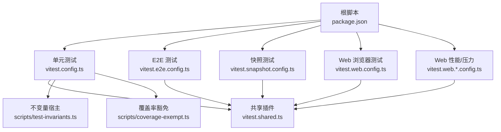
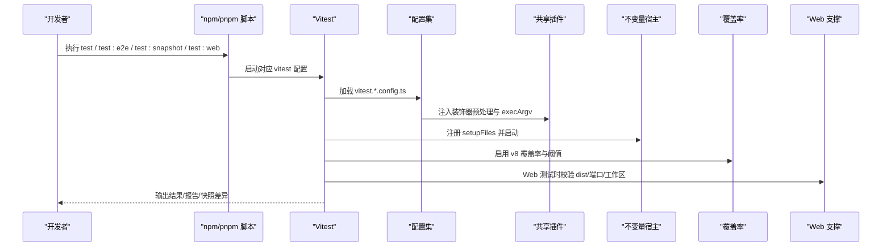
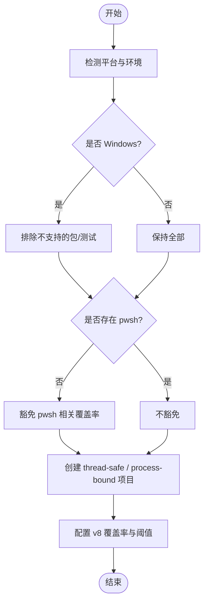
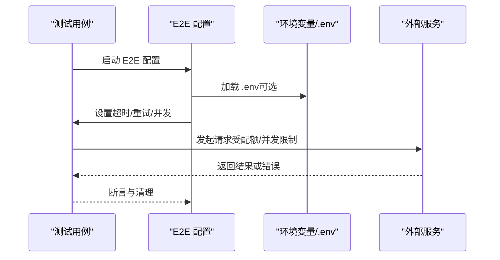
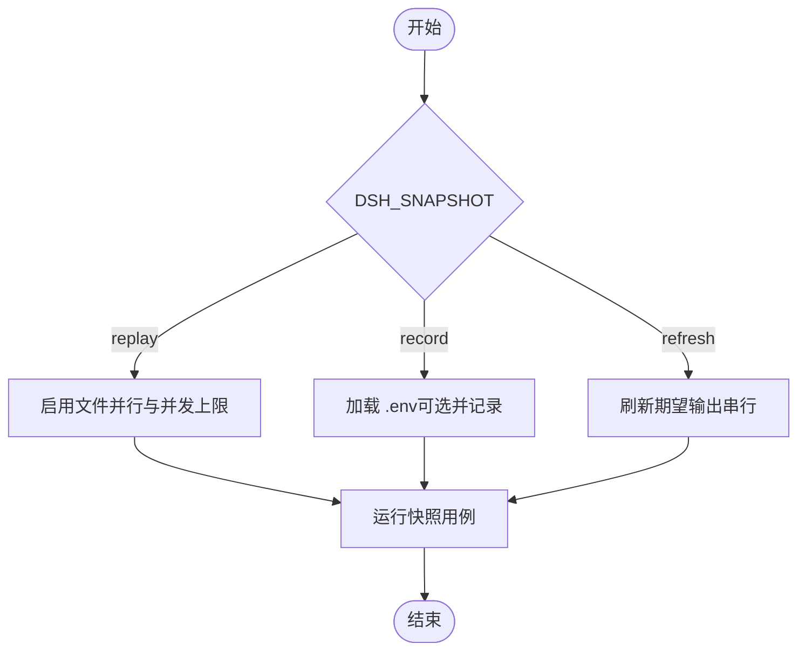
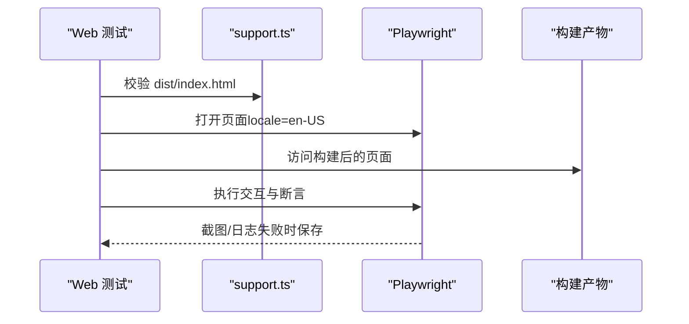
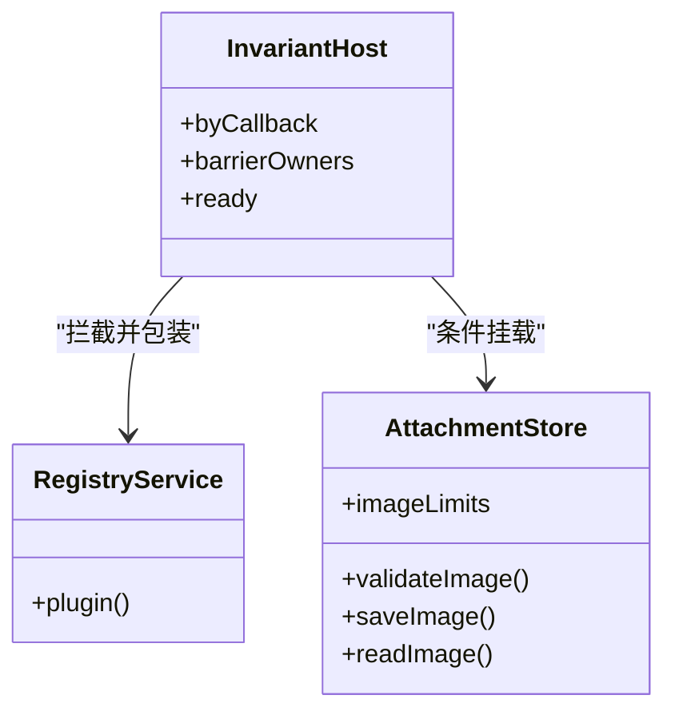
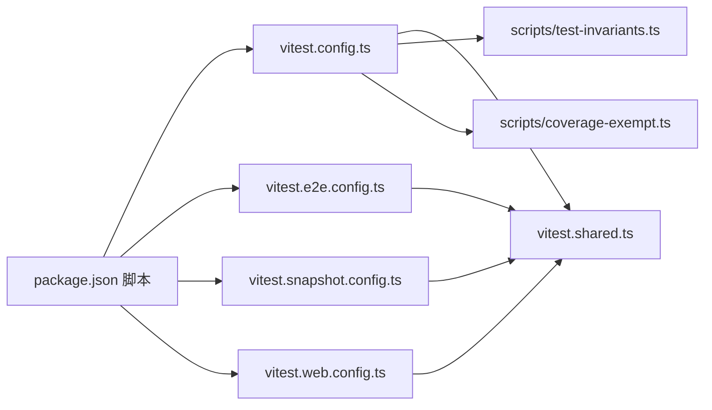

# 测试基础设施

<cite>
**本文引用的文件**
- [vitest.config.ts](file://vitest.config.ts)
- [vitest.e2e.config.ts](file://vitest.e2e.config.ts)
- [vitest.web.config.ts](file://vitest.web.config.ts)
- [vitest.snapshot.config.ts](file://vitest.snapshot.config.ts)
- [vitest.web.perf.config.ts](file://vitest.web.perf.config.ts)
- [vitest.web-stress.config.ts](file://vitest.web-stress.config.ts)
- [vitest.shared.ts](file://vitest.shared.ts)
- [package.json](file://package.json)
- [docs/testing.md](file://docs/testing.md)
- [scripts/test-invariants.ts](file://scripts/test-invariants.ts)
- [scripts/coverage-exempt.ts](file://scripts/coverage-exempt.ts)
- [apps/web/tests/support.ts](file://apps/web/tests/support.ts)
</cite>

## 目录
1. [简介](#简介)
2. [项目结构](#项目结构)
3. [核心组件](#核心组件)
4. [架构总览](#架构总览)
5. [详细组件分析](#详细组件分析)
6. [依赖关系分析](#依赖关系分析)
7. [性能与并行化](#性能与并行化)
8. [故障排除指南](#故障排除指南)
9. [结论](#结论)
10. [附录](#附录)

## 简介
本指南面向希望理解并扩展本仓库测试基础设施的工程师。内容覆盖测试框架配置与扩展、测试环境搭建与管理、测试数据与数据库处理策略、并行与分布式执行、第三方测试服务集成、报告生成与分析、缓存与性能优化、调试与排障，以及维护与升级建议。所有说明均基于仓库内现有配置与实践，确保可操作且与当前实现一致。

## 项目结构
仓库采用多工作区（workspaces）组织，测试按“层”划分：
- 单元测试：Vitest 运行 packages 与 scripts 下的 spec 文件，使用 v8 覆盖率门控（每文件 100%）。
- 端到端测试：独立配置，调用真实 API，具备超时与重试、并发控制。
- 快照测试：keyless 回放模式为主，支持 record/refresh；CI 强制 replay。
- Web 浏览器测试：构建产物驱动，串行执行，截图与快照对比。
- 性能/压力测试：独立配置，超长超时与禁用控制台拦截。

图表来源
- [package.json:19-47](file://package.json#L19-L47)
- [vitest.config.ts:117-159](file://vitest.config.ts#L117-L159)
- [vitest.e2e.config.ts:31-57](file://vitest.e2e.config.ts#L31-L57)
- [vitest.snapshot.config.ts:39-67](file://vitest.snapshot.config.ts#L39-L67)
- [vitest.web.config.ts:16-35](file://vitest.web.config.ts#L16-L35)
- [vitest.web.perf.config.ts:6-15](file://vitest.web.perf.config.ts#L6-L15)
- [vitest.web-stress.config.ts:6-15](file://vitest.web-stress.config.ts#L6-L15)
- [vitest.shared.ts:15-42](file://vitest.shared.ts#L15-L42)
- [scripts/test-invariants.ts:1-274](file://scripts/test-invariants.ts#L1-L274)
- [scripts/coverage-exempt.ts:1-42](file://scripts/coverage-exempt.ts#L1-L42)

章节来源
- [package.json:19-47](file://package.json#L19-L47)
- [docs/testing.md:7-15](file://docs/testing.md#L7-L15)

## 核心组件
- Vitest 多项目与多配置：通过多个配置文件区分不同测试层，统一通过共享插件与入口参数保持一致性。
- 装饰器预处理：在 Vite 解析前将 TypeScript 装饰器转译为 ESNext，避免运行时问题。
- 不变量宿主：自动发现并挂载各包的 invariant 配套，保证测试期服务拓扑与生命周期约束。
- 覆盖率门控：v8 提供者，严格到每文件 100%，对重型套件提供豁免机制。
- 环境变量与 .env 加载：E2E 与快照测试按需加载密钥，CI 默认 keyless。
- Web 测试支撑：构建产物校验、端口探测、工作区连接、失败截图等。

章节来源
- [vitest.shared.ts:15-42](file://vitest.shared.ts#L15-L42)
- [scripts/test-invariants.ts:1-274](file://scripts/test-invariants.ts#L1-L274)
- [vitest.config.ts:160-283](file://vitest.config.ts#L160-L283)
- [vitest.e2e.config.ts:5-14](file://vitest.e2e.config.ts#L5-L14)
- [vitest.snapshot.config.ts:24-37](file://vitest.snapshot.config.ts#L24-L37)
- [apps/web/tests/support.ts:34-55](file://apps/web/tests/support.ts#L34-L55)

## 架构总览
下图展示了测试执行从命令入口到具体配置的调用链，以及关键共享能力。

图表来源
- [package.json:34-47](file://package.json#L34-L47)
- [vitest.config.ts:117-159](file://vitest.config.ts#L117-L159)
- [vitest.e2e.config.ts:31-57](file://vitest.e2e.config.ts#L31-L57)
- [vitest.snapshot.config.ts:39-67](file://vitest.snapshot.config.ts#L39-L67)
- [vitest.web.config.ts:16-35](file://vitest.web.config.ts#L16-L35)
- [vitest.shared.ts:15-42](file://vitest.shared.ts#L15-L42)
- [scripts/test-invariants.ts:158-209](file://scripts/test-invariants.ts#L158-L209)
- [apps/web/tests/support.ts:34-55](file://apps/web/tests/support.ts#L34-L55)

## 详细组件分析

### 单元测试（vitest.config.ts）
- 多项目隔离：thread-safe 与 process-bound 两个项目分别以 fork 池运行，避免进程全局状态干扰。
- 平台适配：Windows 下排除不支持的包与测试；根据是否存在 pwsh 动态豁免覆盖率。
- 覆盖率策略：v8 提供者，包含 packages/*/src/**，严格 100% 阈值；自定义 reporter 输出未覆盖位置；重型套件可通过环境变量豁免。
- 路径解析：通过 tsconfig.base.json 的 paths 映射，确保源码优先于构建产物。

图表来源
- [vitest.config.ts:21-83](file://vitest.config.ts#L21-L83)
- [vitest.config.ts:117-159](file://vitest.config.ts#L117-L159)
- [vitest.config.ts:160-283](file://vitest.config.ts#L160-L283)

章节来源
- [vitest.config.ts:21-83](file://vitest.config.ts#L21-L83)
- [vitest.config.ts:117-159](file://vitest.config.ts#L117-L159)
- [vitest.config.ts:160-283](file://vitest.config.ts#L160-L283)

### 端到端测试（vitest.e2e.config.ts）
- 密钥管理：尝试加载根 .env，支持 provider 特定端点覆盖；无密钥时自跳过。
- 并发控制：通过 DSH_E2E_MAX_WORKERS 限制文件级并行与最大 worker 数，默认 4。
- 稳定性：较长超时与重试，适合调用外部模型与服务。

图表来源
- [vitest.e2e.config.ts:5-14](file://vitest.e2e.config.ts#L5-L14)
- [vitest.e2e.config.ts:16-29](file://vitest.e2e.config.ts#L16-L29)
- [vitest.e2e.config.ts:31-57](file://vitest.e2e.config.ts#L31-L57)

章节来源
- [vitest.e2e.config.ts:5-14](file://vitest.e2e.config.ts#L5-L14)
- [vitest.e2e.config.ts:16-29](file://vitest.e2e.config.ts#L16-L29)
- [vitest.e2e.config.ts:31-57](file://vitest.e2e.config.ts#L31-L57)

### 快照测试（vitest.snapshot.config.ts）
- 模式切换：replay（默认）、record、refresh；仅 record 读取密钥。
- 并发控制：replay 支持文件级并行与 maxConcurrency；record/refresh 串行以避免竞争写。
- 包含范围：scripts、apps/cli、examples 的 snapshot 文件；Web 快照需构建产物。

图表来源
- [vitest.snapshot.config.ts:24-37](file://vitest.snapshot.config.ts#L24-L37)
- [vitest.snapshot.config.ts:39-67](file://vitest.snapshot.config.ts#L39-L67)

章节来源
- [vitest.snapshot.config.ts:24-37](file://vitest.snapshot.config.ts#L24-L37)
- [vitest.snapshot.config.ts:39-67](file://vitest.snapshot.config.ts#L39-L67)

### Web 浏览器测试（vitest.web.config.ts）
- 构建前置：要求先构建前端产物，否则直接报错。
- 串行执行：文件级并行关闭，共享浏览器实例，降低资源竞争。
- 超时与钩子：较长的测试与钩子超时，适应浏览器启动与交互。

图表来源
- [vitest.web.config.ts:16-35](file://vitest.web.config.ts#L16-L35)
- [apps/web/tests/support.ts:34-55](file://apps/web/tests/support.ts#L34-L55)

章节来源
- [vitest.web.config.ts:16-35](file://vitest.web.config.ts#L16-L35)
- [apps/web/tests/support.ts:34-55](file://apps/web/tests/support.ts#L34-L55)

### 性能与压力测试（vitest.web.perf.config.ts, vitest.web-stress.config.ts）
- 性能测试：继承 web 配置，扩大超时，禁用控制台拦截以便采集指标。
- 压力测试：独立 include，关闭文件并行，长时间运行评估稳定性。

章节来源
- [vitest.web.perf.config.ts:6-15](file://vitest.web.perf.config.ts#L6-L15)
- [vitest.web-stress.config.ts:6-15](file://vitest.web-stress.config.ts#L6-L15)

### 共享能力（vitest.shared.ts）
- 装饰器预处理：在 Vite 解析前转译装饰器，兼容 TSX/TS。
- execArgv：为 Node 环境添加必要标志，避免存储冲突。

章节来源
- [vitest.shared.ts:15-42](file://vitest.shared.ts#L15-L42)

### 不变量宿主（scripts/test-invariants.ts）
- 自动发现：通过 import.meta.glob 扫描各包 invariant 配套，按测试归属挂载。
- 生命周期屏障：确保 companion 与附件存储等服务在插件启动前就绪。
- 手动拓扑例外：允许特定测试自行管理拓扑。

图表来源
- [scripts/test-invariants.ts:158-209](file://scripts/test-invariants.ts#L158-L209)
- [scripts/test-invariants.ts:114-134](file://scripts/test-invariants.ts#L114-L134)

章节来源
- [scripts/test-invariants.ts:1-274](file://scripts/test-invariants.ts#L1-L274)

### 覆盖率豁免（scripts/coverage-exempt.ts）
- 目的：将重型套件从仪器化运行中移除，减少编译/子进程开销，同时仍在全量运行中验证正确性。
- 规则：每个豁免项必须满足“被移除不影响覆盖率阈值”。

章节来源
- [scripts/coverage-exempt.ts:1-42](file://scripts/coverage-exempt.ts#L1-L42)

## 依赖关系分析
- 配置间复用：所有 vitest 配置均引用 vitest.shared.ts，统一装饰器与 execArgv。
- 脚本入口：package.json 中的 test 系列命令串联不同配置。
- 测试策略文档：docs/testing.md 定义了分层与规则，指导实践。

图表来源
- [package.json:34-47](file://package.json#L34-L47)
- [vitest.config.ts:117-159](file://vitest.config.ts#L117-L159)
- [vitest.e2e.config.ts:31-57](file://vitest.e2e.config.ts#L31-L57)
- [vitest.snapshot.config.ts:39-67](file://vitest.snapshot.config.ts#L39-L67)
- [vitest.web.config.ts:16-35](file://vitest.web.config.ts#L16-L35)
- [vitest.shared.ts:15-42](file://vitest.shared.ts#L15-L42)
- [scripts/test-invariants.ts:158-209](file://scripts/test-invariants.ts#L158-L209)
- [scripts/coverage-exempt.ts:28-41](file://scripts/coverage-exempt.ts#L28-L41)

章节来源
- [package.json:34-47](file://package.json#L34-L47)
- [docs/testing.md:7-15](file://docs/testing.md#L7-L15)

## 性能与并行化
- 单元测试：
  - 使用 fork 池隔离进程全局状态，避免线程安全问题的干扰。
  - 通过环境变量 DSH_COVERAGE_EXEMPT_HEAVY=1 将重型套件移出仪器化运行，缩短 CI 时间。
- E2E 测试：
  - 通过 DSH_E2E_MAX_WORKERS 控制并发，平衡本地与 CI 资源占用。
- 快照测试：
  - replay 模式支持文件级并行与 maxConcurrency；record/refresh 串行避免竞争写。
- Web 测试：
  - 串行执行，共享浏览器实例，降低资源争用。
- 覆盖率：
  - v8 提供者，严格阈值；自定义 reporter 输出未覆盖位置，便于定位。

章节来源
- [vitest.config.ts:117-159](file://vitest.config.ts#L117-L159)
- [vitest.config.ts:160-283](file://vitest.config.ts#L160-L283)
- [vitest.e2e.config.ts:16-29](file://vitest.e2e.config.ts#L16-L29)
- [vitest.e2e.config.ts:31-57](file://vitest.e2e.config.ts#L31-L57)
- [vitest.snapshot.config.ts:39-67](file://vitest.snapshot.config.ts#L39-L67)
- [vitest.web.config.ts:24-35](file://vitest.web.config.ts#L24-L35)

## 故障排除指南
- Web 构建缺失：若 dist/index.html 不存在，Web 测试会直接报错，需先执行构建。
- 端口冲突：使用 probeFreePort 获取空闲端口，避免端口占用导致启动失败。
- 工作区连接：通过 connectFreshWorkspace/connectFreshWorkspaceZh 自动化连接工作区，确保场景可复现。
- 失败证据：saveFailureShot 将截图保存到 .artifacts，便于定位 UI 问题。
- 密钥缺失：E2E 与快照 record 需要密钥；无密钥时自跳过，避免阻塞 CI。
- 覆盖率失败：查看自定义 reporter 输出的未覆盖位置，结合 perFile 阈值定位具体文件。

章节来源
- [apps/web/tests/support.ts:34-55](file://apps/web/tests/support.ts#L34-L55)
- [apps/web/tests/support.ts:74-121](file://apps/web/tests/support.ts#L74-L121)
- [vitest.e2e.config.ts:5-14](file://vitest.e2e.config.ts#L5-L14)
- [vitest.config.ts:160-283](file://vitest.config.ts#L160-L283)

## 结论
本仓库的测试基础设施以 Vitest 为核心，通过多配置分层、共享插件与不变量宿主，实现了高稳定、高覆盖、可扩展的测试体系。配合严格的覆盖率门控、灵活的并发控制与完善的 Web 测试支撑，能够在本地与 CI 环境中高效运行。遵循 docs/testing.md 的分层策略与最佳实践，可进一步扩展测试能力并保持质量基线。

## 附录
- 常用命令
  - 单元测试：pnpm run test
  - 覆盖率：pnpm run test:coverage
  - E2E：pnpm run test:e2e
  - 快照：pnpm run test:snapshot / test:snapshot:record / test:snapshot:refresh
  - Web：pnpm run test:web / test:web:refresh / test:web:perf / test:web:stress
- 环境变量
  - DSH_E2E_MAX_WORKERS：E2E 并发上限
  - DSH_SNAPSHOT：replay/record/refresh
  - DSH_SNAPSHOT_MAX_CONCURRENCY：快照并发上限
  - DSH_COVERAGE_EXEMPT_HEAVY：豁免重型套件

章节来源
- [package.json:34-47](file://package.json#L34-L47)
- [vitest.e2e.config.ts:16-29](file://vitest.e2e.config.ts#L16-L29)
- [vitest.snapshot.config.ts:19-22](file://vitest.snapshot.config.ts#L19-L22)
- [scripts/coverage-exempt.ts:21-26](file://scripts/coverage-exempt.ts#L21-L26)