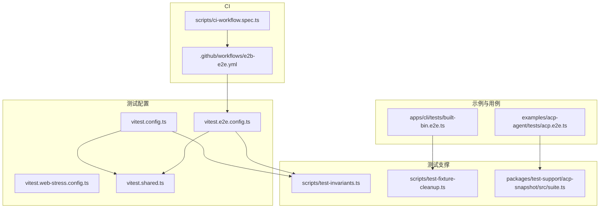
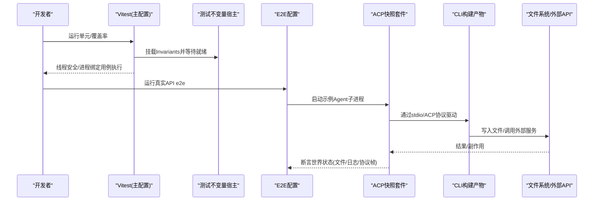
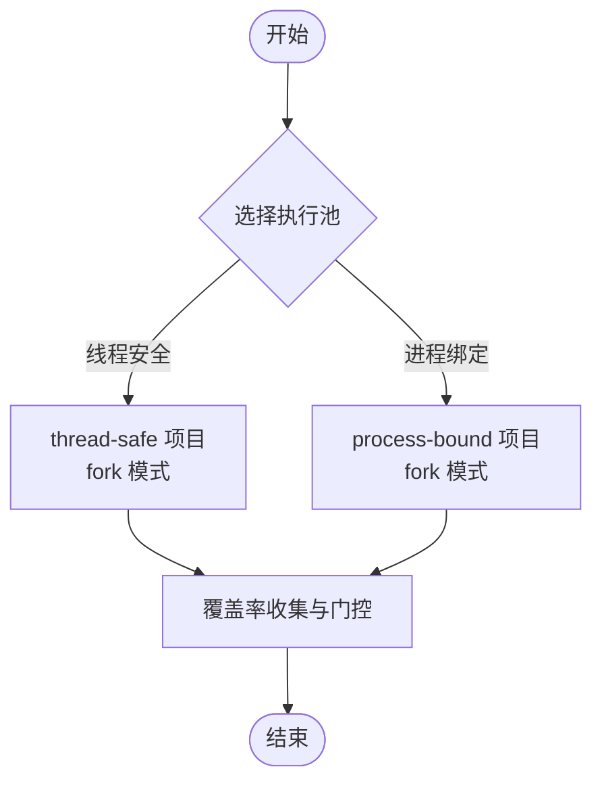
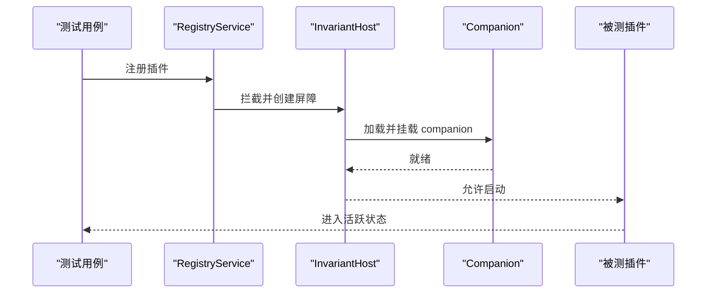
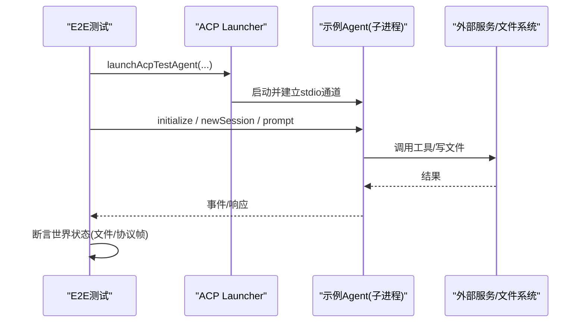
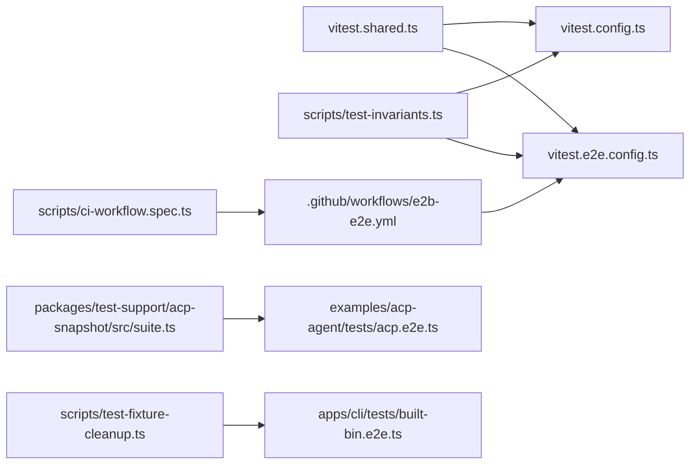

# 集成测试

<cite>
**本文引用的文件**
- [vitest.config.ts](file://vitest.config.ts)
- [vitest.e2e.config.ts](file://vitest.e2e.config.ts)
- [vitest.shared.ts](file://vitest.shared.ts)
- [testing.md](file://docs/testing.md)
- [test-invariants.ts](file://scripts/test-invariants.ts)
- [test-fixture-cleanup.ts](file://scripts/test-fixture-cleanup.ts)
- [acp.e2e.ts](file://examples/acp-agent/tests/acp.e2e.ts)
- [built-bin.e2e.ts](file://apps/cli/tests/built-bin.e2e.ts)
- [suite.ts](file://packages/test-support/acp-snapshot/src/suite.ts)
- [e2b-e2e.yml](file:.github/workflows/e2b-e2e.yml)
- [ci-workflow.spec.ts](file://scripts/ci-workflow.spec.ts)
- [vitest.web-stress.config.ts](file://vitest.web-stress.config.ts)
</cite>

## 目录
1. [简介](#简介)
2. [项目结构](#项目结构)
3. [核心组件](#核心组件)
4. [架构总览](#架构总览)
5. [详细组件分析](#详细组件分析)
6. [依赖关系分析](#依赖关系分析)
7. [性能考量](#性能考量)
8. [故障排查指南](#故障排查指南)
9. [结论](#结论)
10. [附录](#附录)

## 简介
本指南面向需要在 deepseek-harness 中编写与维护集成测试的工程师，覆盖以下目标：
- 集成测试的设计原则与分层策略
- 插件间交互与通信的测试方法
- 端到端（E2E）测试的编写规范
- 真实 API 测试的配置与使用
- 完整 Agent 生命周期的测试方式
- 测试环境搭建、数据准备与管理清理
- 性能测试与负载测试方法
- 持续集成配置与优化建议

## 项目结构
仓库采用多包 monorepo 组织，测试按层级与用途拆分到不同配置文件与目录：
- 单元测试与覆盖率门控：基于 Vitest，统一入口在根级 vitest.config.ts，包含线程安全与进程绑定两类执行池
- E2E 真实 API 测试：独立配置 vitest.e2e.config.ts，支持 .env 加载、并发控制与重试
- Web 浏览器快照与压力测试：单独配置，如 vitest.web-stress.config.ts
- 测试支撑工具：位于 packages/test-support，提供 ACP 快照套件、LLM 回放/模拟等能力
- CI 工作流：位于 .github/workflows，驱动关键门禁与可选的真实沙箱测试

图表来源
- [vitest.config.ts:117-159](file://vitest.config.ts#L117-L159)
- [vitest.e2e.config.ts:31-57](file://vitest.e2e.config.ts#L31-L57)
- [vitest.shared.ts:15-42](file://vitest.shared.ts#L15-L42)
- [test-invariants.ts:158-209](file://scripts/test-invariants.ts#L158-L209)
- [test-fixture-cleanup.ts:36-49](file://scripts/test-fixture-cleanup.ts#L36-L49)
- [suite.ts:1440-1449](file://packages/test-support/acp-snapshot/src/suite.ts#L1440-L1449)
- [acp.e2e.ts:14-28](file://examples/acp-agent/tests/acp.e2e.ts#L14-L28)
- [built-bin.e2e.ts:9-39](file://apps/cli/tests/built-bin.e2e.ts#L9-L39)
- [e2b-e2e.yml:1-58](file://.github/workflows/e2b-e2e.yml#L1-L58)
- [ci-workflow.spec.ts:30-42](file://scripts/ci-workflow.spec.ts#L30-L42)

章节来源
- [vitest.config.ts:1-286](file://vitest.config.ts#L1-L286)
- [vitest.e2e.config.ts:1-59](file://vitest.e2e.config.ts#L1-L59)
- [vitest.shared.ts:1-43](file://vitest.shared.ts#L1-L43)
- [testing.md:7-19](file://docs/testing.md#L7-L19)

## 核心组件
- 测试运行器与项目划分
  - 通过两个 Vitest 项目隔离“线程安全”和“进程绑定”用例，避免全局状态污染与平台差异
  - 覆盖率严格门控：每文件 100%，并针对 Windows/非 pwsh 环境做豁免
- 装饰器预处理
  - 共享插件在 Vite 解析前将 TypeScript 装饰器转译为可执行代码，保证测试对源码的无侵入性
- 测试不变量与生命周期屏障
  - 自动注入 InvariantRegistry，并在每个包的 companion 初始化完成后再启动被测插件，确保服务拓扑一致
- 测试夹具清理
  - 安全的删除流程，先解除符号链接/junction，再递归删除，避免跨平台陷阱
- E2E 真实 API 测试
  - 独立配置，支持从 .env 加载密钥，限制并发，设置较长超时与重试，适合调用外部模型或沙箱
- ACP 快照套件
  - 场景表驱动、标准化输出、持久化日志对比，保障协议与呈现契约稳定

章节来源
- [vitest.config.ts:117-159](file://vitest.config.ts#L117-L159)
- [vitest.config.ts:160-283](file://vitest.config.ts#L160-L283)
- [vitest.shared.ts:15-42](file://vitest.shared.ts#L15-L42)
- [test-invariants.ts:158-209](file://scripts/test-invariants.ts#L158-L209)
- [test-fixture-cleanup.ts:36-49](file://scripts/test-fixture-cleanup.ts#L36-L49)
- [vitest.e2e.config.ts:1-59](file://vitest.e2e.config.ts#L1-L59)
- [suite.ts:1440-1449](file://packages/test-support/acp-snapshot/src/suite.ts#L1440-L1449)

## 架构总览
下图展示从测试配置到具体用例的执行路径，以及关键支撑模块如何协作。

图表来源
- [vitest.config.ts:117-159](file://vitest.config.ts#L117-L159)
- [test-invariants.ts:158-209](file://scripts/test-invariants.ts#L158-L209)
- [vitest.e2e.config.ts:31-57](file://vitest.e2e.config.ts#L31-L57)
- [acp.e2e.ts:14-28](file://examples/acp-agent/tests/acp.e2e.ts#L14-L28)
- [built-bin.e2e.ts:9-39](file://apps/cli/tests/built-bin.e2e.ts#L9-L39)

## 详细组件分析

### 组件A：测试运行器与项目隔离（vitest.config.ts）
- 设计要点
  - 双项目隔离：thread-safe 与 process-bound，避免进程级全局状态互相影响
  - 覆盖率门控：每文件 100%；针对 Windows 不支持的包与缺失 pwsh 的环境进行豁免
  - 路径解析：统一指向 tsconfig.base.json，避免加载已构建产物导致单例重复
- 实践建议
  - 新增测试时优先放入 thread-safe 项目；涉及进程/时间/信号的用例归入 process-bound
  - 若新增包需要覆盖，需同步更新 include/exclude 与覆盖率豁免清单

图表来源
- [vitest.config.ts:117-159](file://vitest.config.ts#L117-L159)
- [vitest.config.ts:160-283](file://vitest.config.ts#L160-L283)

章节来源
- [vitest.config.ts:1-286](file://vitest.config.ts#L1-L286)

### 组件B：装饰器预处理（vitest.shared.ts）
- 作用
  - 在 Vite 默认解析前，将标准 TypeScript 装饰器转译为可执行代码，保证测试直接运行源码
- 影响
  - 所有使用源码模式的测试均可使用装饰器语法，无需额外编译步骤

章节来源
- [vitest.shared.ts:1-43](file://vitest.shared.ts#L1-L43)

### 组件C：测试不变量与插件生命周期（scripts/test-invariants.ts）
- 机制
  - 拦截插件注册，为每个被测包注入其 invariant companion，确保服务拓扑一致
  - 提供 ready 屏障，使被测插件在配套检查完成后启动
- 价值
  - 防止因服务未就绪导致的偶发失败；集中管理测试期行为约束

图表来源
- [test-invariants.ts:67-98](file://scripts/test-invariants.ts#L67-L98)
- [test-invariants.ts:158-209](file://scripts/test-invariants.ts#L158-L209)

章节来源
- [test-invariants.ts:1-274](file://scripts/test-invariants.ts#L1-L274)

### 组件D：夹具清理（scripts/test-fixture-cleanup.ts）
- 关键点
  - 先解除 junction/符号链接，再递归删除，避免跨平台误删仓库文件
  - 带重试的删除，兼容 Windows 异步句柄释放
- 最佳实践
  - 所有 after/beforeEach 中的临时目录都应通过该工具清理

章节来源
- [test-fixture-cleanup.ts:36-49](file://scripts/test-fixture-cleanup.ts#L36-L49)

### 组件E：真实 API 测试（vitest.e2e.config.ts + examples/acp-agent/tests/acp.e2e.ts）
- 配置要点
  - 支持从根目录 .env 加载密钥；可配置最大并发 DSH_E2E_MAX_WORKERS
  - 较长的超时与重试，适合调用外部模型或沙箱
- 用例要点
  - 以真实子进程启动示例 Agent，通过 ACP stdio 驱动，断言“世界状态”（如文件写入），而非仅断言自身输出
  - 无密钥用例仍可验证协议纯净性与基础握手

图表来源
- [vitest.e2e.config.ts:1-59](file://vitest.e2e.config.ts#L1-L59)
- [acp.e2e.ts:14-28](file://examples/acp-agent/tests/acp.e2e.ts#L14-L28)
- [acp.e2e.ts:100-126](file://examples/acp-agent/tests/acp.e2e.ts#L100-L126)

章节来源
- [vitest.e2e.config.ts:1-59](file://vitest.e2e.config.ts#L1-L59)
- [acp.e2e.ts:1-127](file://examples/acp-agent/tests/acp.e2e.ts#L1-L127)

### 组件F：CLI 构建产物验收（apps/cli/tests/built-bin.e2e.ts）
- 目标
  - 以发布产物 lib/bin.js 作为入口，验证参数错误、profile 生命周期、配置导出等
- 方法
  - 通过 execa 启动子进程，构造最小 profile bundle 与标记文件，断言生命周期事件顺序
  - 支持中断与优雅关闭验证

章节来源
- [built-bin.e2e.ts:9-39](file://apps/cli/tests/built-bin.e2e.ts#L9-L39)
- [built-bin.e2e.ts:57-147](file://apps/cli/tests/built-bin.e2e.ts#L57-L147)

### 组件G：ACP 快照套件（packages/test-support/acp-snapshot/src/suite.ts）
- 功能
  - 场景表驱动，记录/回放会话 JSONL，标准化输出，校验协议与呈现契约
  - 保护易变字段（时间、ID 等），只比较语义等价内容
- 维护
  - 扫描 snapshots 目录，确保无孤儿场景

章节来源
- [suite.ts:769-787](file://packages/test-support/acp-snapshot/src/suite.ts#L769-L787)
- [suite.ts:1440-1449](file://packages/test-support/acp-snapshot/src/suite.ts#L1440-L1449)

### 组件H：Web 压力测试（vitest.web-stress.config.ts）
- 特点
  - 显式性能通道，禁用文件并行，长超时，用于观察前端渲染与交互性能
- 适用
  - 大型历史、流式消息、长时间运行的 UI 场景

章节来源
- [vitest.web-stress.config.ts:1-15](file://vitest.web-stress.config.ts#L1-L15)

## 依赖关系分析
- 测试配置层
  - vitest.config.ts 与 vitest.e2e.config.ts 均复用 vitest.shared.ts 的装饰器插件与执行参数
  - 两者都引入 scripts/test-invariants.ts 作为 setupFiles，统一测试期不变量
- 用例层
  - examples/acp-agent/tests/acp.e2e.ts 依赖 ACP 快照套件与 CLI 构建产物
  - apps/cli/tests/built-bin.e2e.ts 依赖系统命令执行与文件系统
- CI 层
  - .github/workflows/e2b-e2e.yml 触发真实沙箱 e2e，读取 secrets 并限制并发
  - scripts/ci-workflow.spec.ts 校验 CI 工作流结构与必需作业存在

图表来源
- [vitest.shared.ts:15-42](file://vitest.shared.ts#L15-L42)
- [vitest.config.ts:117-159](file://vitest.config.ts#L117-L159)
- [vitest.e2e.config.ts:31-57](file://vitest.e2e.config.ts#L31-L57)
- [test-invariants.ts:158-209](file://scripts/test-invariants.ts#L158-L209)
- [suite.ts:1440-1449](file://packages/test-support/acp-snapshot/src/suite.ts#L1440-L1449)
- [test-fixture-cleanup.ts:36-49](file://scripts/test-fixture-cleanup.ts#L36-L49)
- [acp.e2e.ts:14-28](file://examples/acp-agent/tests/acp.e2e.ts#L14-L28)
- [built-bin.e2e.ts:9-39](file://apps/cli/tests/built-bin.e2e.ts#L9-L39)
- [e2b-e2e.yml:1-58](file://.github/workflows/e2b-e2e.yml#L1-L58)
- [ci-workflow.spec.ts:30-42](file://scripts/ci-workflow.spec.ts#L30-L42)

章节来源
- [vitest.config.ts:1-286](file://vitest.config.ts#L1-L286)
- [vitest.e2e.config.ts:1-59](file://vitest.e2e.config.ts#L1-L59)
- [test-invariants.ts:1-274](file://scripts/test-invariants.ts#L1-L274)
- [test-fixture-cleanup.ts:36-49](file://scripts/test-fixture-cleanup.ts#L36-L49)
- [suite.ts:1440-1449](file://packages/test-support/acp-snapshot/src/suite.ts#L1440-L1449)
- [acp.e2e.ts:1-127](file://examples/acp-agent/tests/acp.e2e.ts#L1-L127)
- [built-bin.e2e.ts:9-39](file://apps/cli/tests/built-bin.e2e.ts#L9-L39)
- [e2b-e2e.yml:1-58](file://.github/workflows/e2b-e2e.yml#L1-L58)
- [ci-workflow.spec.ts:30-42](file://scripts/ci-workflow.spec.ts#L30-L42)

## 性能考量
- 并发与资源
  - E2E 真实 API 测试通过 DSH_E2E_MAX_WORKERS 控制并发，避免配额争用；必要时设为 1 串行执行
  - 线程安全用例使用 fork 模式，规避 Node 线程问题；进程绑定用例单独隔离
- 超时与重试
  - E2E 配置设置较长 testTimeout/hookTimeout，并启用 retry，提高稳定性
- 浏览器压力测试
  - 专用配置禁用文件并行，延长超时，用于观察 UI 性能与可感知延迟
- 覆盖率门控
  - 每文件 100% 强制高质量覆盖；对无法覆盖的路径需明确豁免理由

章节来源
- [vitest.e2e.config.ts:16-57](file://vitest.e2e.config.ts#L16-L57)
- [vitest.config.ts:117-159](file://vitest.config.ts#L117-L159)
- [vitest.config.ts:160-283](file://vitest.config.ts#L160-L283)
- [vitest.web-stress.config.ts:1-15](file://vitest.web-stress.config.ts#L1-L15)

## 故障排查指南
- 常见问题定位
  - 插件未就绪：检查 test-invariants 是否成功挂载 companion 并 await 就绪
  - 夹具残留：确认 afterEach 使用 removeFixtureSafely 清理，避免 Windows 句柄未释放
  - E2E 超时/失败：适当调整 DSH_E2E_MAX_WORKERS、超时与重试；检查密钥与环境变量
  - 协议污染：在 ACP 测试中检查 stdout 是否仅包含 JSON-RPC 帧
- 调试技巧
  - 使用 ACP 快照套件记录/回放，缩小回归范围
  - 通过 CLI 构建产物验收用例验证入口行为与生命周期

章节来源
- [test-invariants.ts:158-209](file://scripts/test-invariants.ts#L158-L209)
- [test-fixture-cleanup.ts:36-49](file://scripts/test-fixture-cleanup.ts#L36-L49)
- [acp.e2e.ts:42-66](file://examples/acp-agent/tests/acp.e2e.ts#L42-L66)
- [built-bin.e2e.ts:9-39](file://apps/cli/tests/built-bin.e2e.ts#L9-L39)

## 结论
本仓库的集成测试体系以分层、隔离与真实路径为核心：
- 通过双项目隔离与不变量宿主，确保插件与服务在一致的测试拓扑下运行
- 以真实子进程与协议驱动实现端到端验证，强调“断言世界状态”
- 借助 ACP 快照套件与 CLI 构建产物验收，保障协议与产品行为的长期稳定
- 配合严格的覆盖率门控与 CI 门禁，形成高可信度的质量闭环

## 附录

### 测试环境与数据准备
- 环境变量
  - E2E 真实 API 测试：从根目录 .env 加载密钥；也可通过 CI secrets 注入
  - 沙箱测试：E2B_API_KEY 必须存在，否则预检失败
- 夹具与临时目录
  - 使用 mkdtemp/mkdtempSync 创建临时工作目录，并在 afterEach 中清理
  - 通过 removeFixtureSafely 安全删除，避免 junction 导致的误删

章节来源
- [vitest.e2e.config.ts:1-14](file://vitest.e2e.config.ts#L1-L14)
- [e2b-e2e.yml:31-58](file://.github/workflows/e2b-e2e.yml#L31-L58)
- [test-fixture-cleanup.ts:36-49](file://scripts/test-fixture-cleanup.ts#L36-L49)

### 插件间交互与通信测试
- 推荐做法
  - 通过真实子进程启动示例 Agent，使用 ACP 协议驱动，断言跨插件协作产生的外部效果（文件、日志、网络）
  - 使用 ACP 快照套件固定协议与呈现契约，便于回归检测
- 参考用例
  - ACP e2e：启动真实 Agent，发送提示，断言文件写入与事件流
  - CLI 构建产物：验证 profile 生命周期与插件装配

章节来源
- [acp.e2e.ts:14-28](file://examples/acp-agent/tests/acp.e2e.ts#L14-L28)
- [acp.e2e.ts:100-126](file://examples/acp-agent/tests/acp.e2e.ts#L100-L126)
- [built-bin.e2e.ts:57-147](file://apps/cli/tests/built-bin.e2e.ts#L57-L147)
- [suite.ts:1440-1449](file://packages/test-support/acp-snapshot/src/suite.ts#L1440-L1449)

### 端到端测试编写方法
- 原则
  - 以真实入口（构建产物/子进程）为起点，避免仅断言内部返回值
  - 断言外部世界状态（文件、协议帧、日志），而非仅代理自报告
- 步骤
  - 准备临时工作目录与环境变量
  - 启动被测进程，建立连接
  - 发送请求并等待完成
  - 断言外部效果与协议一致性
  - 清理资源

章节来源
- [testing.md:27-35](file://docs/testing.md#L27-L35)
- [acp.e2e.ts:100-126](file://examples/acp-agent/tests/acp.e2e.ts#L100-L126)
- [built-bin.e2e.ts:9-39](file://apps/cli/tests/built-bin.e2e.ts#L9-L39)

### 真实 API 测试配置与使用
- 配置
  - 使用 vitest.e2e.config.ts，加载 .env，设置并发与超时
- 使用
  - 通过环境变量注入密钥；无密钥时用例自跳过，保持 keyless CI 绿色
  - 可通过 DSH_E2E_MAX_WORKERS 控制并发，避免配额争用

章节来源
- [vitest.e2e.config.ts:1-59](file://vitest.e2e.config.ts#L1-L59)
- [testing.md:17-19](file://docs/testing.md#L17-L19)

### 完整 Agent 生命周期测试
- 方法
  - 使用 CLI 构建产物验收测试，构造最小 profile bundle，写入生命周期标记文件，断言 ready/settled/disposed/interrupt 顺序
  - 结合信号处理与平台差异（Windows 无 SIGTERM）进行健壮性验证
- 参考
  - built-bin.e2e.ts 中的 profile 生命周期测试

章节来源
- [built-bin.e2e.ts:57-147](file://apps/cli/tests/built-bin.e2e.ts#L57-L147)

### 性能测试与负载测试
- 浏览器压力测试
  - 使用 vitest.web-stress.config.ts 运行 stress-tests，禁用文件并行，设置长超时
- 指标关注
  - 渲染吞吐、首帧时间、内存占用、交互响应延迟
- 注意
  - 压力测试仅作为显式性能证据，不替代确定性聚焦测试

章节来源
- [vitest.web-stress.config.ts:1-15](file://vitest.web-stress.config.ts#L1-L15)

### 持续集成配置与优化建议
- 门禁
  - 单元测试与覆盖率门控：vitest.config.ts
  - 真实 API e2e：vitest.e2e.config.ts
  - 浏览器快照：web 配置
  - 可选沙箱 e2e：e2b-e2e.yml
- 优化建议
  - 合理设置并发与超时，避免配额争用
  - 使用快照与协议断言降低噪声
  - 对平台差异进行条件排除与豁免
  - 通过脚本校验 CI 工作流完整性

章节来源
- [vitest.config.ts:117-159](file://vitest.config.ts#L117-L159)
- [vitest.e2e.config.ts:31-57](file://vitest.e2e.config.ts#L31-L57)
- [e2b-e2e.yml:1-58](file://.github/workflows/e2b-e2e.yml#L1-L58)
- [ci-workflow.spec.ts:30-42](file://scripts/ci-workflow.spec.ts#L30-L42)