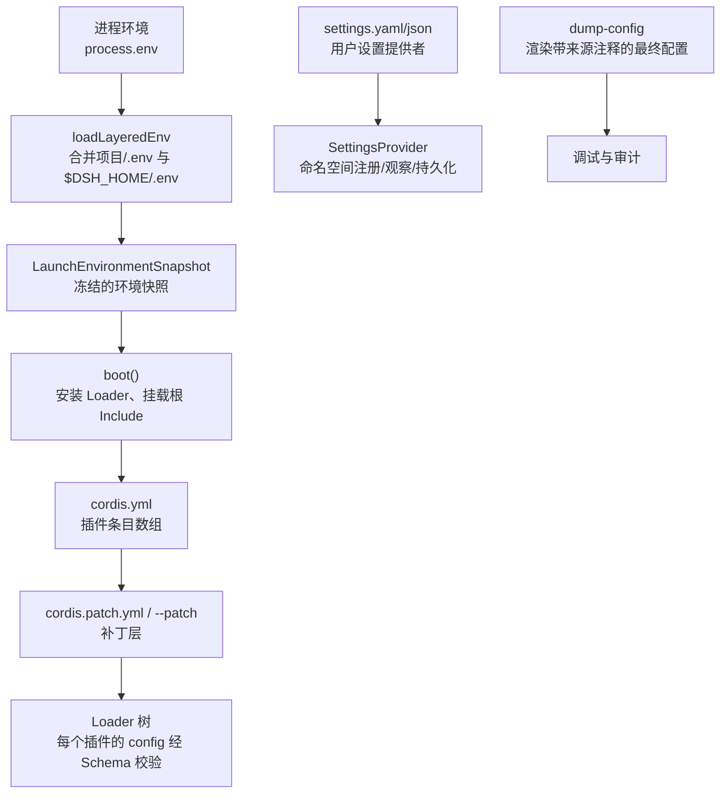
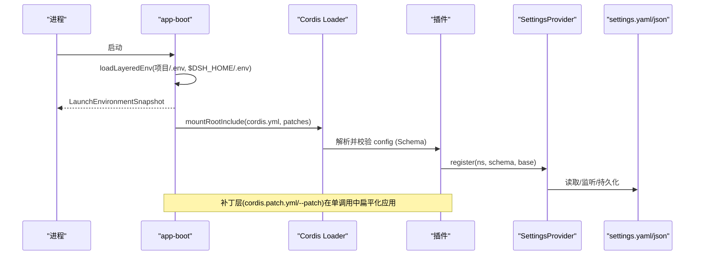
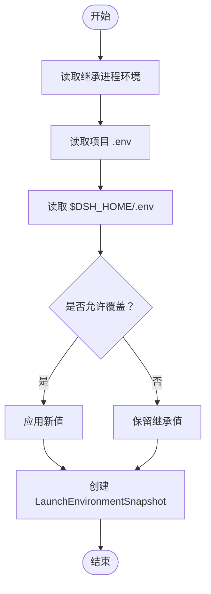
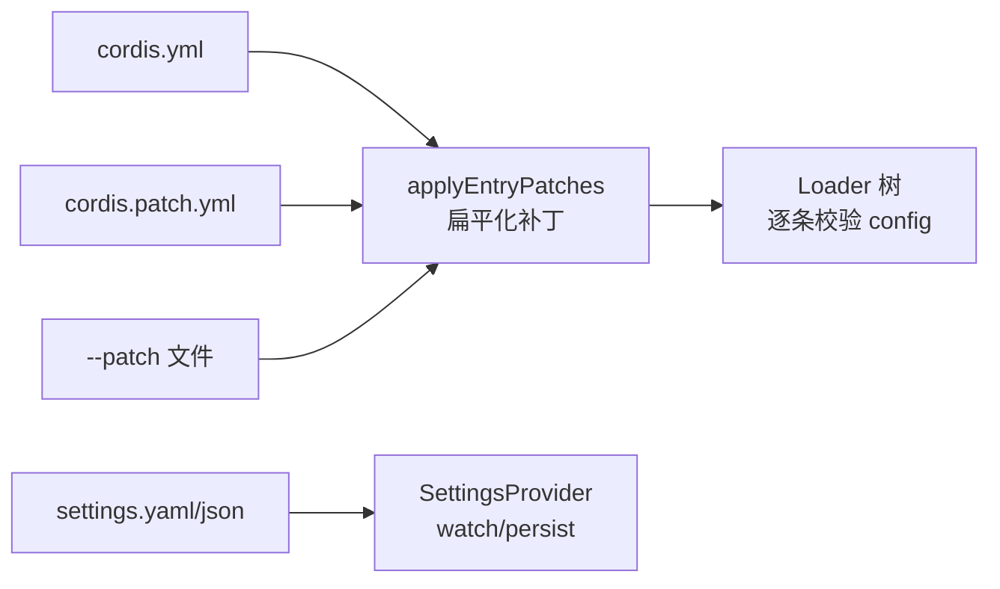
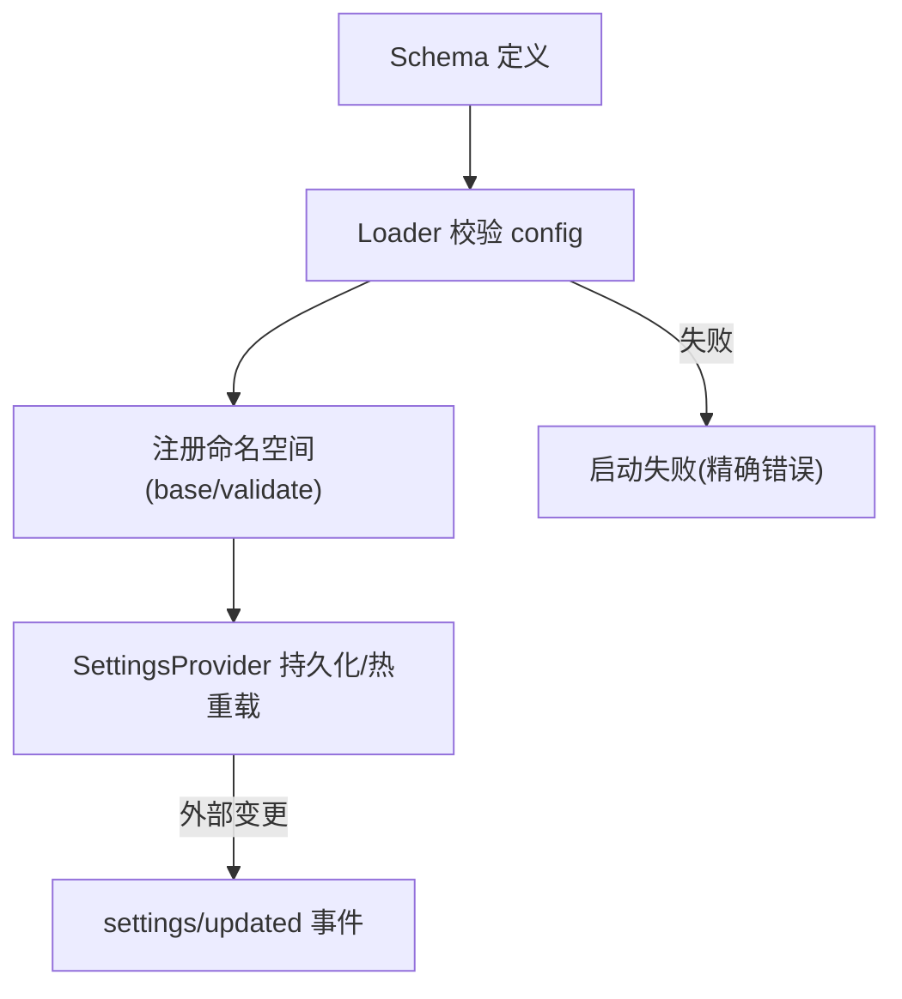
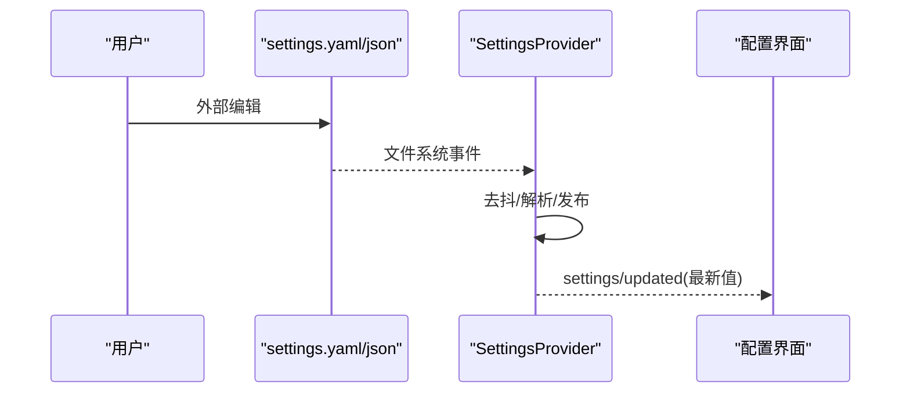
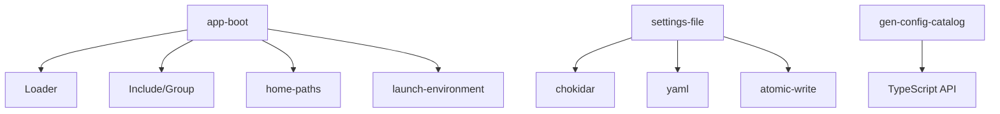

# 配置管理

<cite>
**本文引用的文件**
- [packages/boot/app-boot/src/index.ts](file://packages/boot/app-boot/src/index.ts)
- [apps/cli/src/dump-config.ts](file://apps/cli/src/dump-config.ts)
- [packages/settings/settings-file/src/index.ts](file://packages/settings/settings-file/src/index.ts)
- [docs/subsystems/settings.md](file://docs/subsystems/settings.md)
- [scripts/verify-cordis-config.ts](file://scripts/verify-cordis-config.ts)
- [scripts/gen-config-catalog.ts](file://scripts/gen-config-catalog.ts)
- [docs/config-catalog.md](file://docs/config-catalog.md)
- [docs/cordis-tutorial/05-config.md](file://docs/cordis-tutorial/05-config.md)
- [.agents/notes/implemented/architecture/2026-08-04-configuration-source-ownership.md](file://.agents/notes/implemented/architecture/2026-08-04-configuration-source-ownership.md)
- [.agents/notes/implemented/architecture/2026-08-04-credentials-yaml-and-user-environment-layer.md](file://.agents/notes/implemented/architecture/2026-08-04-credentials-yaml-and-user-environment-layer.md)
- [examples/acp-agent/cordis.yml](file://examples/acp-agent/cordis.yml)
- [packages/settings/settings/tests/settings.spec.ts](file://packages/settings/settings/tests/settings.spec.ts)
</cite>

## 目录
1. [简介](#简介)
2. [项目结构](#项目结构)
3. [核心组件](#核心组件)
4. [架构总览](#架构总览)
5. [详细组件分析](#详细组件分析)
6. [依赖关系分析](#依赖关系分析)
7. [性能考虑](#性能考虑)
8. [故障排查指南](#故障排查指南)
9. [结论](#结论)
10. [附录](#附录)

## 简介
本指南系统性说明 DeepSeek Harness 的配置管理机制，覆盖以下主题：
- 插件配置的层次结构与继承机制
- 配置文件格式与语法规范（YAML/JSON、补丁层、表达式）
- 环境变量解析与优先级规则（含引导变量保护）
- 配置验证与默认值处理策略（Schema + 运行时校验）
- 配置热重载与动态更新（设置文档、用户补丁层）
- 复杂配置场景的处理方法（组合、补丁、快照回放）
- 最佳实践与安全考虑（凭证隔离、最小权限、审计）
- 配置测试与验证方法（静态检查、单元测试、端到端）

## 项目结构
围绕配置管理的代码与文档分布在如下位置：
- 启动与环境装配：应用启动器负责加载 .env、构建环境快照、挂载根 Include 并驱动 Loader 树。
- 配置清单与补丁：cordis.yml 作为主配置，支持 cordis.patch.yml 与 --patch 叠加；提供 dump 能力以可视化最终组成。
- 用户设置：settings 子系统提供命名空间化的可编辑文档（YAML/JSON），支持热重载与持久化。
- 配置目录与类型：通过脚本生成配置目录，确保 Schema 与声明一致。
- 安全与校验：禁止在 .env 中设置“引导变量”，凭证与端点遵循独立排序。

**图示来源**
- [packages/boot/app-boot/src/index.ts:61-198](file://packages/boot/app-boot/src/index.ts#L61-L198)
- [packages/boot/app-boot/src/index.ts:278-338](file://packages/boot/app-boot/src/index.ts#L278-L338)
- [packages/settings/settings-file/src/index.ts:20-67](file://packages/settings/settings-file/src/index.ts#L20-L67)
- [apps/cli/src/dump-config.ts:30-52](file://apps/cli/src/dump-config.ts#L30-L52)

**章节来源**
- [packages/boot/app-boot/src/index.ts:61-198](file://packages/boot/app-boot/src/index.ts#L61-L198)
- [packages/boot/app-boot/src/index.ts:278-338](file://packages/boot/app-boot/src/index.ts#L278-L338)
- [packages/settings/settings-file/src/index.ts:20-67](file://packages/settings/settings-file/src/index.ts#L20-L67)
- [apps/cli/src/dump-config.ts:30-52](file://apps/cli/src/dump-config.ts#L30-L52)

## 核心组件
- 启动与环境装配
  - loadEnv/loadLayeredEnv：读取项目级与用户级 .env，拒绝“引导变量”写入，产出不可变的环境快照。
  - boot/mountRootInclude：安装 Loader，挂载根 Include，应用补丁，等待整棵树激活。
- 配置清单与补丁
  - cordis.yml：插件条目数组，每个条目可携带 config。
  - cordis.patch.yml 与 --patch：按顺序扁平化应用，实现跨层覆盖与插入。
  - renderConfigDump：输出带来源注释的可执行 YAML，便于诊断。
- 用户设置
  - settings-file：YAML/JSON 文档，支持外部编辑热重载、原子写、保留注释的最小差异写入。
  - settings 抽象：命名空间注册、Schema 校验、base 层注入、观察者与事件。
- 配置目录与校验
  - gen-config-catalog：从源码提取配置类型与 Schema，交叉校验键集一致性。
  - verify-cordis-config：校验 Loader 元数据与包解析。

**章节来源**
- [packages/boot/app-boot/src/index.ts:61-198](file://packages/boot/app-boot/src/index.ts#L61-L198)
- [packages/boot/app-boot/src/index.ts:379-473](file://packages/boot/app-boot/src/index.ts#L379-L473)
- [packages/settings/settings-file/src/index.ts:104-168](file://packages/settings/settings-file/src/index.ts#L104-L168)
- [docs/subsystems/settings.md:18-94](file://docs/subsystems/settings.md#L18-L94)
- [scripts/gen-config-catalog.ts:656-787](file://scripts/gen-config-catalog.ts#L656-L787)
- [scripts/verify-cordis-config.ts:1-99](file://scripts/verify-cordis-config.ts#L1-L99)

## 架构总览
下图展示从进程环境到插件运行的完整配置流，包括环境变量、清单、补丁、设置文档与热重载路径。

**图示来源**
- [packages/boot/app-boot/src/index.ts:177-198](file://packages/boot/app-boot/src/index.ts#L177-L198)
- [packages/boot/app-boot/src/index.ts:486-529](file://packages/boot/app-boot/src/index.ts#L486-L529)
- [packages/settings/settings-file/src/index.ts:232-269](file://packages/settings/settings-file/src/index.ts#L232-L269)

## 详细组件分析

### 环境变量解析与优先级
- 非密钥类值的统一排序（从高到低）：
  - 本次运行显式参数 > 每操作覆盖/CLI 参数
  - 用户设置（settings.yaml）
  - 组合（profile bundles、用户补丁层、--patch 叠加）
  - 本次启动的 shell 继承环境
  - 发现的文件（<invocation cwd>/.env，然后 $DSH_HOME/.env）
  - 默认值（Schema 默认、提供方公开默认）
- 密钥类值保持独立且更窄的排序：
  - 继承进程环境（只读、最高优先）
  - $DSH_HOME/.credentials.yaml（提供方管理、可写）
  - <invocation cwd>/.env
  - $DSH_HOME/.env
- 引导变量保护：
  - 禁止在 .env 中设置 PATH、HOME、NODE_*、SSL_*、代理相关等关键变量；这些只能由启动环境设定。

**图示来源**
- [packages/boot/app-boot/src/index.ts:92-164](file://packages/boot/app-boot/src/index.ts#L92-L164)
- [packages/boot/app-boot/src/index.ts:177-198](file://packages/boot/app-boot/src/index.ts#L177-L198)
- [.agents/notes/implemented/architecture/2026-08-04-configuration-source-ownership.md:17-39](file://.agents/notes/implemented/architecture/2026-08-04-configuration-source-ownership.md#L17-L39)
- [.agents/notes/implemented/architecture/2026-08-04-credentials-yaml-and-user-environment-layer.md:24-26](file://.agents/notes/implemented/architecture/2026-08-04-credentials-yaml-and-user-environment-layer.md#L24-L26)

**章节来源**
- [.agents/notes/implemented/architecture/2026-08-04-configuration-source-ownership.md:17-39](file://.agents/notes/implemented/architecture/2026-08-04-configuration-source-ownership.md#L17-L39)
- [.agents/notes/implemented/architecture/2026-08-04-credentials-yaml-and-user-environment-layer.md:24-26](file://.agents/notes/implemented/architecture/2026-08-04-credentials-yaml-and-user-environment-layer.md#L24-L26)
- [packages/boot/app-boot/src/index.ts:92-164](file://packages/boot/app-boot/src/index.ts#L92-L164)
- [packages/boot/app-boot/src/index.ts:177-198](file://packages/boot/app-boot/src/index.ts#L177-L198)

### 配置文件格式与语法规范
- cordis.yml：顶层为 Loader 条目数组；每个条目支持 id、name、config、inject、disabled 等元数据。
- cordis.patch.yml：顶层为补丁项数组，支持 id 目标覆盖与 insert 列表；缺失视为无层，但必须可读可解析。
- 表达式：config 与 disabled 字段支持 !!js 标签，在加载时求值；其他元数据保持静态。
- 用户设置文档：settings.yaml/json，支持多命名空间分区；外部编辑通过 chokidar 监听并热发布。

**图示来源**
- [packages/boot/app-boot/src/index.ts:278-338](file://packages/boot/app-boot/src/index.ts#L278-L338)
- [packages/boot/app-boot/src/index.ts:379-473](file://packages/boot/app-boot/src/index.ts#L379-L473)
- [packages/settings/settings-file/src/index.ts:232-269](file://packages/settings/settings-file/src/index.ts#L232-L269)
- [docs/cordis-tutorial/05-config.md:70-81](file://docs/cordis-tutorial/05-config.md#L70-L81)

**章节来源**
- [packages/boot/app-boot/src/index.ts:278-338](file://packages/boot/app-boot/src/index.ts#L278-L338)
- [packages/boot/app-boot/src/index.ts:379-473](file://packages/boot/app-boot/src/index.ts#L379-L473)
- [packages/settings/settings-file/src/index.ts:232-269](file://packages/settings/settings-file/src/index.ts#L232-L269)
- [docs/cordis-tutorial/05-config.md:70-81](file://docs/cordis-tutorial/05-config.md#L70-L81)

### 配置验证与默认值处理
- 插件配置：每个插件导出 Schema（Schemastery），Loader 在 apply 前完成严格校验；错误直接导致加载失败。
- 用户设置：注册命名空间时绑定 Schema，支持 base 层注入；validate 钩子用于跨字段约束；无效存储值会回退到“最后好值”。
- 目录生成：gen-config-catalog 将源码中的配置类型粘贴到文档，并与运行时 Schema 交叉校验键集一致性。

**图示来源**
- [docs/cordis-tutorial/05-config.md:5-68](file://docs/cordis-tutorial/05-config.md#L5-L68)
- [docs/subsystems/settings.md:18-94](file://docs/subsystems/settings.md#L18-L94)
- [scripts/gen-config-catalog.ts:656-787](file://scripts/gen-config-catalog.ts#L656-L787)

**章节来源**
- [docs/cordis-tutorial/05-config.md:5-68](file://docs/cordis-tutorial/05-config.md#L5-L68)
- [docs/subsystems/settings.md:18-94](file://docs/subsystems/settings.md#L18-L94)
- [scripts/gen-config-catalog.ts:656-787](file://scripts/gen-config-catalog.ts#L656-L787)

### 配置热重载与动态更新
- 用户设置热重载：settings-file 使用 chokidar 监听文档变化，去抖后重新解析并发布；原子写保证并发安全；保留注释的最小差异写入。
- 用户补丁层热重载：watchUserPatches 通过 Cordis HMR 监听 cordis.patch.yml，事务性重应用补丁到根 Include。
- 快照回放：resolveConfigPath 支持将 cordis.yml 替换为同名 cordis.snapshot.yml 进行回放。

**图示来源**
- [packages/settings/settings-file/src/index.ts:232-269](file://packages/settings/settings-file/src/index.ts#L232-L269)
- [packages/settings/settings-file/src/index.ts:304-338](file://packages/settings/settings-file/src/index.ts#L304-L338)
- [packages/boot/app-boot/src/index.ts:232-265](file://packages/boot/app-boot/src/index.ts#L232-L265)
- [packages/boot/app-boot/src/index.ts:61-69](file://packages/boot/app-boot/src/index.ts#L61-L69)

**章节来源**
- [packages/settings/settings-file/src/index.ts:232-269](file://packages/settings/settings-file/src/index.ts#L232-L269)
- [packages/settings/settings-file/src/index.ts:304-338](file://packages/settings/settings-file/src/index.ts#L304-L338)
- [packages/boot/app-boot/src/index.ts:232-265](file://packages/boot/app-boot/src/index.ts#L232-L265)
- [packages/boot/app-boot/src/index.ts:61-69](file://packages/boot/app-boot/src/index.ts#L61-L69)

### 复杂配置场景处理方法
- 组合与补丁：通过 profile bundles、用户补丁层与 --patch 叠加，形成单一扁平化补丁序列，避免多层冲突。
- 表达式与上下文：!!js 表达式在 Loader 上下文中求值，可访问 dshHomePath 等工具函数；示例中使用 process.env 控制行为。
- 调试与审计：dump-config 输出带来源注释的 YAML，标注每行来自哪个文件或补丁层。

**图示来源**
- [packages/boot/app-boot/src/index.ts:379-473](file://packages/boot/app-boot/src/index.ts#L379-L473)
- [apps/cli/src/dump-config.ts:30-52](file://apps/cli/src/dump-config.ts#L30-L52)
- [examples/acp-agent/cordis.yml:24-31](file://examples/acp-agent/cordis.yml#L24-L31)

**章节来源**
- [packages/boot/app-boot/src/index.ts:379-473](file://packages/boot/app-boot/src/index.ts#L379-L473)
- [apps/cli/src/dump-config.ts:30-52](file://apps/cli/src/dump-config.ts#L30-L52)
- [examples/acp-agent/cordis.yml:24-31](file://examples/acp-agent/cordis.yml#L24-L31)

### 最佳实践与安全考虑
- 凭证与端点：
  - 不要在 shipped 配置中内联凭据或端点；应通过 ctx.credentials 与环境快照解析。
  - 密钥类值遵循独立排序，继承进程环境最高优先。
- 最小权限与沙箱：
  - 通过 sandbox-policy 与工具插件配置限制 bash/文件系统的访问范围。
- 审计与可观测性：
  - 使用 dump-config 输出最终组成；利用 settings/updated 事件追踪变更来源。

**章节来源**
- [scripts/verify-config-source-ownership.ts:25-56](file://scripts/verify-config-source-ownership.ts#L25-L56)
- [.agents/notes/implemented/architecture/2026-08-04-configuration-source-ownership.md:17-39](file://.agents/notes/implemented/architecture/2026-08-04-configuration-source-ownership.md#L17-L39)
- [examples/acp-agent/cordis.yml:24-31](file://examples/acp-agent/cordis.yml#L24-L31)

### 配置的测试与验证方法
- 静态检查：
  - verify-cordis-config：校验 Loader 元数据与包解析。
  - gen-config-catalog：生成配置目录并交叉校验 Schema 与声明。
- 单元测试：
  - settings.spec：覆盖注册、更新、替换、观察者、并发、失效恢复等场景。
- 端到端：
  - 使用示例 cordis.yml 与快照模式记录/回放，验证实际行为。

**章节来源**
- [scripts/verify-cordis-config.ts:1-99](file://scripts/verify-cordis-config.ts#L1-L99)
- [scripts/gen-config-catalog.ts:656-787](file://scripts/gen-config-catalog.ts#L656-L787)
- [packages/settings/settings/tests/settings.spec.ts:88-152](file://packages/settings/settings/tests/settings.spec.ts#L88-L152)
- [packages/settings/settings/tests/settings.spec.ts:211-306](file://packages/settings/settings/tests/settings.spec.ts#L211-L306)
- [packages/settings/settings/tests/settings.spec.ts:529-579](file://packages/settings/settings/tests/settings.spec.ts#L529-L579)

## 依赖关系分析
- app-boot 依赖：
  - cordis-plugin-loader：加载与激活插件树。
  - cordis-plugin-include/group：组合与分组。
  - dsh-home-paths：解析 $DSH_HOME。
  - dsh-launch-environment：创建不可变环境快照。
- settings-file 依赖：
  - chokidar：文件监听。
  - yaml：解析与渲染。
  - dsh-atomic-write：原子写与文件锁。
- 配置目录生成：
  - TypeScript 编译器 API：抽取配置类型与 Schema。

**图示来源**
- [packages/boot/app-boot/src/index.ts:9-22](file://packages/boot/app-boot/src/index.ts#L9-L22)
- [packages/settings/settings-file/src/index.ts:10-18](file://packages/settings/settings-file/src/index.ts#L10-L18)
- [scripts/gen-config-catalog.ts:656-787](file://scripts/gen-config-catalog.ts#L656-L787)

**章节来源**
- [packages/boot/app-boot/src/index.ts:9-22](file://packages/boot/app-boot/src/index.ts#L9-L22)
- [packages/settings/settings-file/src/index.ts:10-18](file://packages/settings/settings-file/src/index.ts#L10-L18)
- [scripts/gen-config-catalog.ts:656-787](file://scripts/gen-config-catalog.ts#L656-L787)

## 性能考虑
- 补丁扁平化：applyEntryPatches 单次调用完成所有补丁应用，减少重复计算与状态不一致风险。
- 设置文档热重载：去抖窗口与内容相等性判断避免频繁重绘与无用写入。
- 原子写与文件锁：防止并发写导致的损坏与竞态。
- 环境快照：一次性创建并冻结，避免后续污染与额外开销。

[本节为通用指导，不直接分析具体文件]

## 故障排查指南
- 启动失败：
  - 检查 cordis.yml 与 cordis.patch.yml 的语法与类型；查看 Loader 日志与断言结果。
  - 使用 assertEntriesActivated 定位未激活或未解析的条目。
- 配置不生效：
  - 使用 dump-config 查看最终组成与来源；确认补丁顺序与覆盖逻辑。
- 设置文档问题：
  - 检查 settings.yaml/json 的 Schema 与 validate 约束；关注“最后好值”与事件来源。
- 环境变量问题：
  - 确认未在内嵌 .env 中设置引导变量；核对优先级与覆盖规则。

**章节来源**
- [packages/boot/app-boot/src/index.ts:658-725](file://packages/boot/app-boot/src/index.ts#L658-L725)
- [packages/boot/app-boot/src/index.ts:379-473](file://packages/boot/app-boot/src/index.ts#L379-L473)
- [packages/settings/settings-file/src/index.ts:271-295](file://packages/settings/settings-file/src/index.ts#L271-L295)
- [packages/boot/app-boot/src/index.ts:92-164](file://packages/boot/app-boot/src/index.ts#L92-L164)

## 结论
DeepSeek Harness 的配置体系以“强 Schema + 分层补丁 + 热重载”为核心，结合严格的环境变量保护与凭证隔离，提供了高可靠、可审计、易调试的配置管理能力。通过标准化流程与工具链（dump、验证、目录生成），可在复杂部署场景中保持配置的一致性与安全性。

[本节为总结，不直接分析具体文件]

## 附录
- 参考文档
  - 配置目录：docs/config-catalog.md
  - 用户设置：docs/subsystems/settings.md
  - 教程：docs/cordis-tutorial/05-config.md

**章节来源**
- [docs/config-catalog.md:1-10](file://docs/config-catalog.md#L1-L10)
- [docs/subsystems/settings.md:1-7](file://docs/subsystems/settings.md#L1-L7)
- [docs/cordis-tutorial/05-config.md:1-6](file://docs/cordis-tutorial/05-config.md#L1-L6)