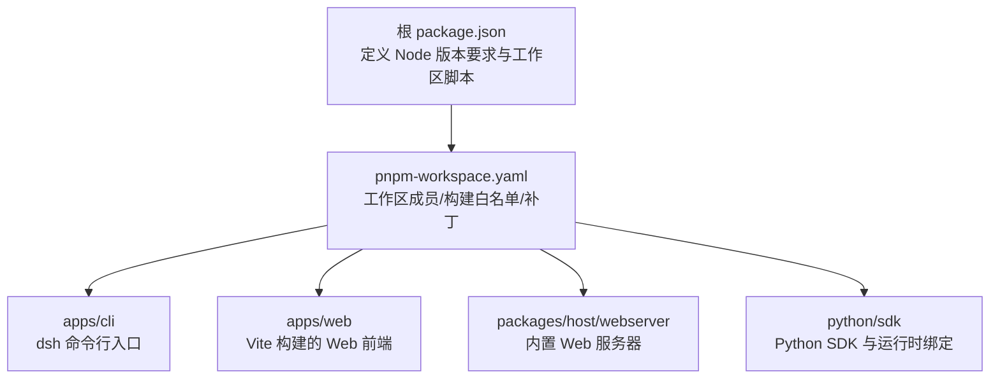
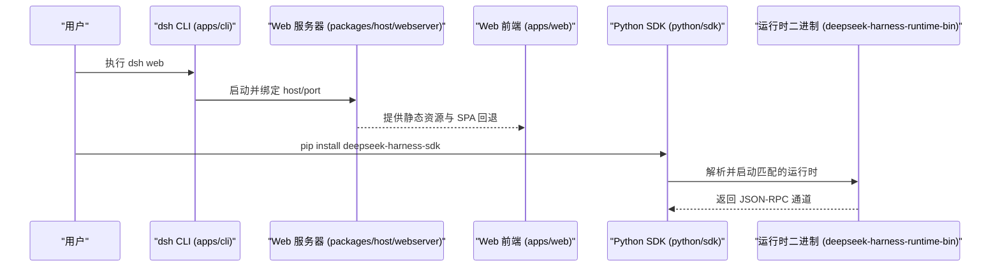
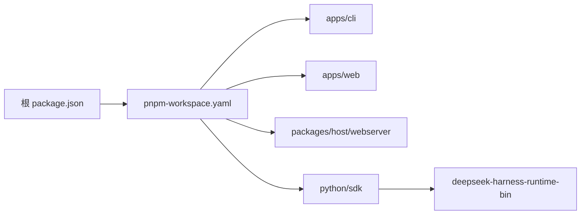

# 安装和部署问题

<cite>
**本文引用的文件**
- [package.json](file://package.json)
- [pnpm-workspace.yaml](file://pnpm-workspace.yaml)
- [README.md](file://README.md)
- [development.md](file://docs/development.md)
- [apps/cli/package.json](file://apps/cli/package.json)
- [apps/web/package.json](file://apps/web/package.json)
- [apps/cli/src/bin.ts](file://apps/cli/src/bin.ts)
- [packages/host/webserver/src/index.ts](file://packages/host/webserver/src/index.ts)
- [docs/subsystems/web-server.zh.md](file://docs/subsystems/web-server.zh.md)
- [python/sdk/pyproject.toml](file://python/sdk/pyproject.toml)
- [scripts/build-exe-for-python-sdk.ts](file://scripts/build-exe-for-python-sdk.ts)
</cite>

## 目录
1. [简介](#简介)
2. [项目结构](#项目结构)
3. [核心组件](#核心组件)
4. [架构总览](#架构总览)
5. [详细组件分析](#详细组件分析)
6. [依赖关系分析](#依赖关系分析)
7. [性能与稳定性考虑](#性能与稳定性考虑)
8. [故障排查指南](#故障排查指南)
9. [结论](#结论)
10. [附录](#附录)

## 简介
本指南聚焦于 DeepSeek Harness（dsh）在本地开发与生产部署中常见的安装与启动问题，覆盖 Node.js 环境配置、依赖安装失败、端口冲突、权限不足、CLI 工具不可用、Web 界面启动错误以及 Python SDK 安装异常等场景。文档提供可操作的检查步骤、错误信息解读与逐步修复方法，并针对 Windows、macOS、Linux 给出差异化建议。

## 项目结构
仓库采用 pnpm workspace 管理多包工程，包含 CLI、Web 前端、宿主服务、Python SDK 及原生组件等。根 package.json 声明了 Node 引擎范围与工作区脚本；pnpm-workspace.yaml 定义了工作区成员、构建白名单与补丁策略；apps/cli 暴露 dsh 命令行入口；apps/web 为 Web 前端构建产物；Python SDK 通过 pyproject.toml 声明运行时二进制依赖。

**图表来源**
- [package.json:1-18](file://package.json#L1-L18)
- [pnpm-workspace.yaml:1-22](file://pnpm-workspace.yaml#L1-L22)

**章节来源**
- [package.json:1-18](file://package.json#L1-L18)
- [pnpm-workspace.yaml:1-22](file://pnpm-workspace.yaml#L1-L22)

## 核心组件
- Node.js 与 pnpm：要求 Node 22.19+ 或 24+，使用 Corepack 管理的 pnpm 11.7.0。首次安装会配置 Lefthook 钩子与合并驱动。
- CLI（dsh）：通过 apps/cli 暴露 bin，支持 web、profile、plugin、dump-config 等模式。
- Web 界面：由 apps/web 构建，默认由 dsh web 启动，监听回环地址与端口。
- Python SDK：通过 python/sdk 发布，依赖 deepseek-harness-runtime-bin 提供的运行时二进制。

**章节来源**
- [development.md:9-24](file://docs/development.md#L9-L24)
- [apps/cli/package.json:1-20](file://apps/cli/package.json#L1-L20)
- [apps/web/package.json:1-26](file://apps/web/package.json#L1-L26)
- [python/sdk/pyproject.toml:1-16](file://python/sdk/pyproject.toml#L1-L16)

## 架构总览
下图展示了从 dsh CLI 到 Web 服务器的关键调用链，以及 Python SDK 与运行时的关系。

**图表来源**
- [apps/cli/src/bin.ts:1-54](file://apps/cli/src/bin.ts#L1-L54)
- [packages/host/webserver/src/index.ts:44-63](file://packages/host/webserver/src/index.ts#L44-L63)
- [apps/web/package.json:1-26](file://apps/web/package.json#L1-L26)
- [python/sdk/pyproject.toml:1-16](file://python/sdk/pyproject.toml#L1-L16)

## 详细组件分析

### Node.js 与 pnpm 环境
- 支持的 Node 版本：22.19+ 或 24+。若版本过低，安装或运行时会因特性缺失而失败。
- pnpm 通过 Corepack 锁定版本；若未启用 Corepack，需先启用后再安装。
- 首次安装会尝试配置 Lefthook 与 Git 合并驱动；若被跳过或缓存恢复导致缺失，需手动执行安装脚本。

常见症状与修复
- 报错提示 Node 版本不满足要求：升级至 22.19+ 或 24+。
- pnpm 命令不可用或版本不符：启用 Corepack 后重试。
- Lefthook 或合并驱动未生效：运行安装脚本重新配置。

**章节来源**
- [package.json:8-10](file://package.json#L8-L10)
- [development.md:9-24](file://docs/development.md#L9-L24)

### 依赖安装失败（含原生模块）
- 工作区允许构建的原生模块在白名单中；未列入的构建脚本会被拒绝。
- node-pty 用于持久 PTY 后端，跨平台包括 Windows ConPTY；其补丁位于 patches 目录。
- 某些依赖带有生命周期脚本但实际为空操作，可通过 allowBuilds 控制是否允许构建。

常见症状与修复
- 安装时报“不允许构建”的错误：确认该依赖是否在 allowBuilds 白名单内；必要时调整策略。
- 原生模块编译失败：确保系统具备编译工具链（如 Xcode Command Line Tools、Windows Build Tools），并检查 node-pty 补丁是否应用成功。
- 安装后缺少已声明依赖：检查打包/发布流程是否正确复制 node_modules 闭包。

**章节来源**
- [pnpm-workspace.yaml:35-56](file://pnpm-workspace.yaml#L35-L56)
- [pnpm-workspace.yaml:71-73](file://pnpm-workspace.yaml#L71-L73)
- [scripts/build-exe-for-python-sdk.ts:297-313](file://scripts/build-exe-for-python-sdk.ts#L297-L313)

### CLI 工具安装失败或不可用
- dsh 的 bin 指向 lib/bin.js；若构建产物缺失或路径不正确，命令行将不可用。
- 根脚本提供了以 tsx 直接运行的方式，便于开发调试。

常见症状与修复
- 全局安装后 dsh 命令不存在：确认包已正确安装且 bin 映射存在；或在源码树中使用根脚本运行。
- 运行时报找不到模块：先执行完整构建，再运行 dsh。

**章节来源**
- [apps/cli/package.json:14-20](file://apps/cli/package.json#L14-L20)
- [package.json:136-142](file://package.json#L136-L142)
- [apps/cli/src/bin.ts:1-54](file://apps/cli/src/bin.ts#L1-L54)

### Web 界面启动错误与端口冲突
- Web 服务器仅支持两个 host 值：127.0.0.1（默认）与 0.0.0.0（显式暴露）。端口为自然数，0 表示由操作系统分配。
- 无 TLS、认证或 Origin 策略；绑定到非回环地址会将服务暴露给所在网络。
- 默认通过 dsh web 启动，浏览器访问 http://127.0.0.1:3080。

常见症状与修复
- 端口占用：更换端口或关闭占用进程；也可使用端口 0 让系统自动分配。
- 无法从其他机器访问：使用 --host 0.0.0.0 显式暴露，并在防火墙与安全组中放行对应端口。
- 启动即失败：检查 host/port 配置合法性与权限；查看日志定位绑定失败原因。

**章节来源**
- [docs/subsystems/web-server.zh.md:27-41](file://docs/subsystems/web-server.zh.md#L27-L41)
- [packages/host/webserver/src/index.ts:44-63](file://packages/host/webserver/src/index.ts#L44-L63)
- [README.md:15-24](file://README.md#L15-L24)

### Python SDK 安装问题
- Python SDK 依赖 deepseek-harness-runtime-bin；本地开发时通过 editable 源指向 sdk-runtime。
- 构建/发布流程会校验并恢复遗留的依赖提升，确保运行时二进制可用。

常见症状与修复
- pip 安装失败或找不到运行时二进制：确认网络可达与镜像源；检查 Python 版本（>=3.10）；在本地开发时使用 editable 源。
- 运行时二进制权限问题（macOS）：确保可执行位正确设置；必要时重新安装或重建。
- 依赖缺失：检查打包脚本是否正确复制依赖闭包。

**章节来源**
- [python/sdk/pyproject.toml:1-16](file://python/sdk/pyproject.toml#L1-L16)
- [python/sdk/pyproject.toml:31-38](file://python/sdk/pyproject.toml#L31-L38)
- [scripts/build-exe-for-python-sdk.ts:297-313](file://scripts/build-exe-for-python-sdk.ts#L297-L313)

### 权限不足与文件系统限制
- 工作区在安装后会配置 Lefthook 与 Git 合并驱动；若权限不足，安装脚本可能失败。
- 某些原生模块需要写入系统目录或创建符号链接；请以合适权限运行安装命令。
- Windows 上替换目标文件时受 DACL 影响；只读目标无法替换。

常见症状与修复
- 安装脚本报权限错误：使用管理员权限或更改目录权限后重试。
- 无法写入临时文件或替换目标：检查目标目录权限与只读属性；在合适的目录下执行。
- macOS 上原生模块执行失败：确保可执行位正确；必要时清理并重新安装。

**章节来源**
- [development.md:16-33](file://docs/development.md#L16-L33)

## 依赖关系分析
- 根 package.json 声明 Node 引擎范围与工作区脚本；pnpm-workspace.yaml 定义工作区成员、构建白名单与补丁。
- apps/cli 依赖多个内部插件与服务；apps/web 依赖 React 与 Vite；Python SDK 依赖运行时二进制。

**图表来源**
- [package.json:1-18](file://package.json#L1-L18)
- [pnpm-workspace.yaml:1-22](file://pnpm-workspace.yaml#L1-L22)
- [apps/cli/package.json:22-84](file://apps/cli/package.json#L22-L84)
- [apps/web/package.json:28-50](file://apps/web/package.json#L28-L50)
- [python/sdk/pyproject.toml:13-16](file://python/sdk/pyproject.toml#L13-L16)

**章节来源**
- [package.json:1-18](file://package.json#L1-L18)
- [pnpm-workspace.yaml:1-22](file://pnpm-workspace.yaml#L1-L22)
- [apps/cli/package.json:22-84](file://apps/cli/package.json#L22-L84)
- [apps/web/package.json:28-50](file://apps/web/package.json#L28-L50)
- [python/sdk/pyproject.toml:13-16](file://python/sdk/pyproject.toml#L13-L16)

## 性能与稳定性考虑
- 使用稳定的 Node LTS 版本以获得最佳兼容性与性能。
- 避免在生产环境直接暴露 Web 服务器；建议使用反向代理与 TLS 终止。
- 合理配置端口与主机地址，避免端口冲突与意外暴露。
- 对原生模块进行最小化安装与缓存优化，减少构建时间与失败概率。

[本节为通用指导，无需特定文件引用]

## 故障排查指南

### 环境检查清单
- 验证 Node 版本：确保 22.19+ 或 24+。
- 验证 pnpm 版本：通过 Corepack 获取 11.7.0。
- 验证 Git 与钩子：确保 Lefthook 与合并驱动已安装。
- 验证 Python 版本：>=3.10。
- 验证端口占用：使用系统工具检查 3080 或其他自定义端口。

**章节来源**
- [development.md:9-24](file://docs/development.md#L9-L24)
- [README.md:15-24](file://README.md#L15-L24)

### 常见问题与修复步骤

#### 1) Node.js 版本不匹配
- 现象：安装或运行时报 Node 版本不支持。
- 处理：升级至 22.19+ 或 24+；使用 nvm/fnm 切换版本。

**章节来源**
- [package.json:8-10](file://package.json#L8-L10)

#### 2) pnpm 安装失败（构建脚本被拒绝）
- 现象：安装时报“不允许构建”。
- 处理：检查 pnpm-workspace.yaml 的 allowBuilds 白名单；确认原生模块是否需要构建；必要时调整策略或安装系统编译工具。

**章节来源**
- [pnpm-workspace.yaml:35-56](file://pnpm-workspace.yaml#L35-L56)

#### 3) 原生模块编译失败（node-pty）
- 现象：node-pty 编译失败。
- 处理：安装系统级编译工具；检查补丁是否应用；清理并重新安装。

**章节来源**
- [pnpm-workspace.yaml:71-73](file://pnpm-workspace.yaml#L71-L73)

#### 4) dsh 命令不可用
- 现象：全局安装后 dsh 不存在或运行失败。
- 处理：确认 bin 映射；在源码树中使用根脚本运行；执行完整构建。

**章节来源**
- [apps/cli/package.json:14-20](file://apps/cli/package.json#L14-L20)
- [package.json:136-142](file://package.json#L136-L142)
- [apps/cli/src/bin.ts:1-54](file://apps/cli/src/bin.ts#L1-L54)

#### 5) Web 界面无法启动或端口冲突
- 现象：端口占用或启动失败。
- 处理：更换端口或使用 0；关闭占用进程；检查 host/port 配置；如需远程访问，使用 0.0.0.0 并放行防火墙。

**章节来源**
- [docs/subsystems/web-server.zh.md:27-41](file://docs/subsystems/web-server.zh.md#L27-L41)
- [packages/host/webserver/src/index.ts:44-63](file://packages/host/webserver/src/index.ts#L44-L63)

#### 6) Python SDK 安装失败
- 现象：pip 安装失败或找不到运行时。
- 处理：检查 Python 版本；确认网络与镜像源；本地开发使用 editable 源；重新安装或重建。

**章节来源**
- [python/sdk/pyproject.toml:1-16](file://python/sdk/pyproject.toml#L1-L16)
- [python/sdk/pyproject.toml:31-38](file://python/sdk/pyproject.toml#L31-L38)
- [scripts/build-exe-for-python-sdk.ts:297-313](file://scripts/build-exe-for-python-sdk.ts#L297-L313)

#### 7) 权限不足
- 现象：安装脚本或写入文件失败。
- 处理：提升权限；检查目录权限与只读属性；在合适目录执行。

**章节来源**
- [development.md:16-33](file://docs/development.md#L16-L33)

### 不同操作系统的特定问题

#### Windows
- 原生模块编译：安装 Visual Studio Build Tools；确保 node-pty 补丁应用成功。
- 文件替换权限：只读目标无法替换；检查 DACL 与继承策略。
- 终端与 PTY：ConPTY 支持依赖系统版本；必要时更新系统或降级方案。

**章节来源**
- [pnpm-workspace.yaml:43-45](file://pnpm-workspace.yaml#L43-L45)
- [pnpm-workspace.yaml:71-73](file://pnpm-workspace.yaml#L71-L73)

#### macOS
- 原生模块可执行位：确保 node-pty 的 spawn helper 具有可执行位；必要时重新安装。
- 系统工具：安装 Xcode Command Line Tools。

**章节来源**
- [pnpm-workspace.yaml:53-55](file://pnpm-workspace.yaml#L53-L55)

#### Linux
- 编译工具链：安装 gcc/g++、make、pkg-config 等。
- 系统库：根据原生模块需求安装对应库（如 libuv、openssl）。

**章节来源**
- [pnpm-workspace.yaml:35-56](file://pnpm-workspace.yaml#L35-L56)

## 结论
通过遵循推荐的 Node/pnpm 版本、正确配置工作区与依赖白名单、合理设置 Web 服务器地址与端口、并确保 Python SDK 与运行时二进制可用，大多数安装与部署问题均可快速定位与解决。遇到权限或原生模块问题时，优先检查系统工具链与目录权限，并结合具体错误信息进行针对性修复。

[本节为总结性内容，无需特定文件引用]

## 附录

### 常用命令参考
- 安装依赖：pnpm install
- 类型检查：pnpm run typecheck
- 构建：pnpm run build
- 启动 Web：pnpm dsh web
- 开发 Web：pnpm dev:web

**章节来源**
- [development.md:16-38](file://docs/development.md#L16-L38)
- [package.json:19-44](file://package.json#L19-L44)