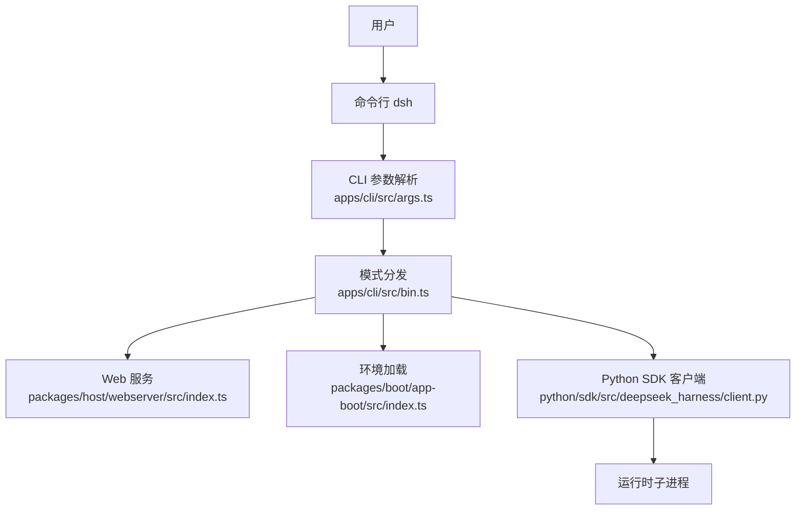
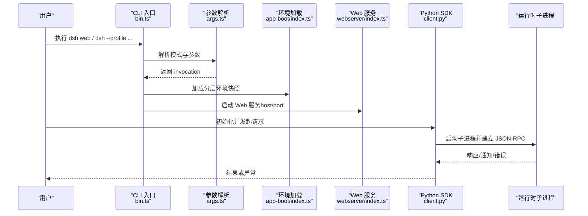
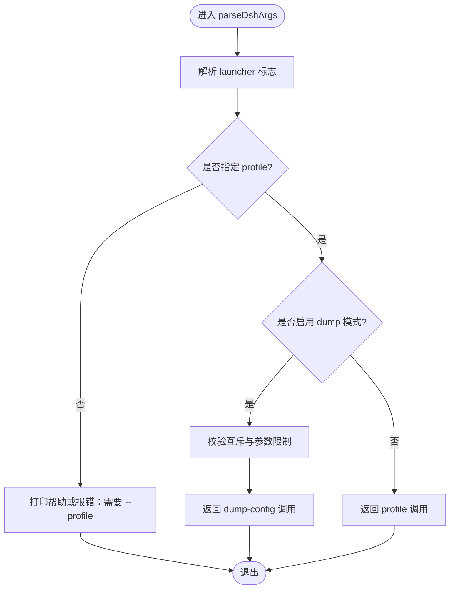
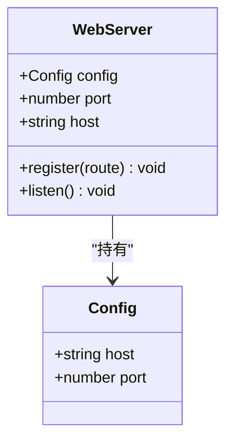
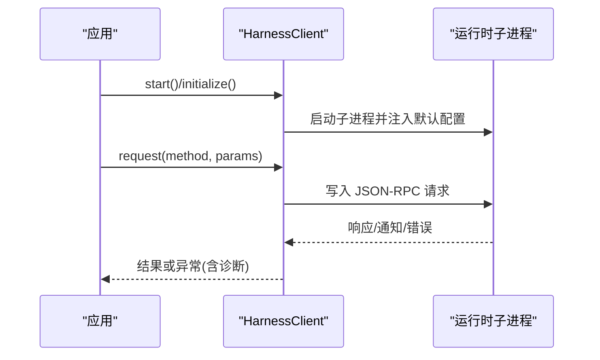
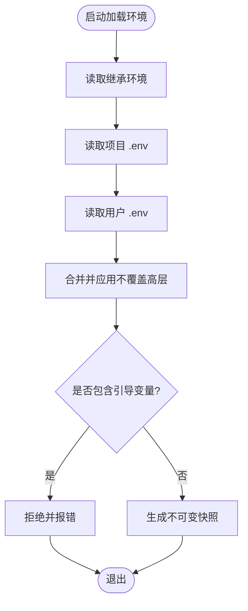
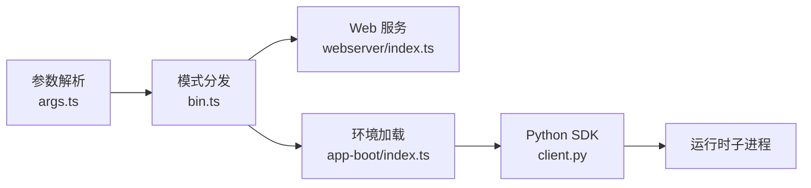

# 常见问题

<cite>
**本文引用的文件**
- [README.md](file://README.md)
- [apps/cli/src/bin.ts](file://apps/cli/src/bin.ts)
- [apps/cli/src/args.ts](file://apps/cli/src/args.ts)
- [packages/boot/app-boot/src/index.ts](file://packages/boot/app-boot/src/index.ts)
- [packages/host/webserver/src/index.ts](file://packages/host/webserver/src/index.ts)
- [packages/host/webserver/README.md](file://packages/host/webserver/README.md)
- [python/sdk/src/deepseek_harness/client.py](file://python/sdk/src/deepseek_harness/client.py)
- [python/sdk/src/deepseek_harness/errors.py](file://python/sdk/src/deepseek_harness/errors.py)
- [python/sdk/README.md](file://python/sdk/README.md)
- [packages/credentials/credentials-local/src/index.ts](file://packages/credentials/credentials-local/src/index.ts)
- [scripts/publish-npm-baseline.ts](file://scripts/publish-npm-baseline.ts)
- [docs/development.zh.md](file://docs/development.zh.md)
</cite>

## 目录
1. [简介](#简介)
2. [项目结构](#项目结构)
3. [核心组件](#核心组件)
4. [架构总览](#架构总览)
5. [详细组件分析](#详细组件分析)
6. [依赖关系分析](#依赖关系分析)
7. [性能注意事项](#性能注意事项)
8. [故障排查指南](#故障排查指南)
9. [结论](#结论)
10. [附录](#附录)

## 简介
本指南聚焦安装、配置与使用过程中最常见的错误场景，覆盖命令行工具、Web 界面与 Python SDK 三类使用方式。内容围绕环境依赖、端口冲突、权限与沙箱、网络访问限制等典型问题，提供错误信息解读、逐步排查方法与快速定位技巧，帮助你在不同平台与部署形态下高效解决问题。

## 项目结构
DeepSeek Harness（dsh）以“一切皆插件”的架构组织代码，CLI、Web、Python SDK 分别通过不同的入口启动并共享统一的配置与环境加载机制。常见问题的根因通常出现在以下位置：
- CLI 参数解析与模式分发
- Web 服务绑定地址与端口
- 环境变量与配置文件加载顺序
- Python SDK 子进程通信与运行时发现
- 凭据与权限策略

**图示来源**
- [apps/cli/src/args.ts:112-190](file://apps/cli/src/args.ts#L112-L190)
- [apps/cli/src/bin.ts:27-53](file://apps/cli/src/bin.ts#L27-L53)
- [packages/host/webserver/src/index.ts:59-101](file://packages/host/webserver/src/index.ts#L59-L101)
- [packages/boot/app-boot/src/index.ts:166-191](file://packages/boot/app-boot/src/index.ts#L166-L191)
- [python/sdk/src/deepseek_harness/client.py:63-85](file://python/sdk/src/deepseek_harness/client.py#L63-L85)

**章节来源**
- [README.md:15-35](file://README.md#L15-L35)
- [apps/cli/src/args.ts:112-190](file://apps/cli/src/args.ts#L112-L190)
- [apps/cli/src/bin.ts:27-53](file://apps/cli/src/bin.ts#L27-L53)

## 核心组件
- CLI 入口与参数解析：负责识别模式（web、profile、dump-config、plugin），将应用参数透传给被引导的插件树。
- Web 服务器：监听指定主机与端口，注册路由，处理 HTTP 升级；默认仅绑定回环地址，避免意外暴露。
- 环境加载：按优先级合并继承环境、项目 .env、用户 .env，拒绝危险变量，生成不可变快照。
- Python SDK：通过 stdio JSON-RPC 启动并管理运行时子进程，封装请求/通知/超时/关闭流程。
- 凭据存储：本地凭据文件读写，受所有者校验与环境遮蔽保护。

**章节来源**
- [apps/cli/src/args.ts:112-190](file://apps/cli/src/args.ts#L112-L190)
- [packages/host/webserver/src/index.ts:59-101](file://packages/host/webserver/src/index.ts#L59-L101)
- [packages/boot/app-boot/src/index.ts:166-191](file://packages/boot/app-boot/src/index.ts#L166-L191)
- [python/sdk/src/deepseek_harness/client.py:63-116](file://python/sdk/src/deepseek_harness/client.py#L63-L116)
- [packages/credentials/credentials-local/src/index.ts:405-435](file://packages/credentials/credentials-local/src/index.ts#L405-L435)

## 架构总览
下图展示从 CLI 到 Web 服务与 Python SDK 的关键调用链，以及环境与凭据在启动期的作用点。

**图示来源**
- [apps/cli/src/bin.ts:27-53](file://apps/cli/src/bin.ts#L27-L53)
- [apps/cli/src/args.ts:112-190](file://apps/cli/src/args.ts#L112-L190)
- [packages/boot/app-boot/src/index.ts:166-191](file://packages/boot/app-boot/src/index.ts#L166-L191)
- [packages/host/webserver/src/index.ts:59-101](file://packages/host/webserver/src/index.ts#L59-L101)
- [python/sdk/src/deepseek_harness/client.py:63-116](file://python/sdk/src/deepseek_harness/client.py#L63-L116)

## 详细组件分析

### 命令行工具（CLI）常见问题
- 未指定 profile 或参数冲突
  - 现象：提示需要 --profile，或 dump-config 与 --dump-default-config 互斥。
  - 原因：launcher 只解析自身标志，其余透传给被引导的应用；当缺少必要参数或组合非法时直接报错退出。
  - 排查：确认命令中是否包含 --profile；检查是否同时使用了互斥选项；查看 help 示例。
- 子命令不接受父级选项
  - 现象：对 web/plugin 子命令传入 --profile/--patch 等父级选项时报错。
  - 原因：子命令明确拒绝父级选项以避免歧义。
  - 排查：将相关选项移至正确层级；参考帮助文本中的用法示例。

**图示来源**
- [apps/cli/src/args.ts:112-190](file://apps/cli/src/args.ts#L112-L190)

**章节来源**
- [apps/cli/src/args.ts:112-190](file://apps/cli/src/args.ts#L112-L190)
- [apps/cli/src/bin.ts:27-53](file://apps/cli/src/bin.ts#L27-L53)

### Web 界面常见问题
- 端口占用
  - 现象：启动失败，提示端口不可用。
  - 原因：WebServer 在激活时立即监听；若端口已被占用则初始化失败。
  - 排查：更换端口或释放占用进程；若使用动态端口（port=0），请读取实际监听端口。
- 绑定地址与网络暴露
  - 现象：无法从其他机器访问，或担心意外暴露。
  - 原因：默认仅绑定回环地址；需显式选择全接口模式。
  - 排查：如需局域网访问，使用支持的 host 值；注意无内置鉴权与 TLS，建议前置反向代理。
- 路由重复
  - 现象：启动时报重复路由错误。
  - 原因：同一 kind+path 的路由重复注册被视为配置错误。
  - 排查：检查插件注册的路径是否冲突。

**图示来源**
- [packages/host/webserver/src/index.ts:59-101](file://packages/host/webserver/src/index.ts#L59-L101)

**章节来源**
- [packages/host/webserver/src/index.ts:59-101](file://packages/host/webserver/src/index.ts#L59-L101)
- [packages/host/webserver/README.md:19-23](file://packages/host/webserver/README.md#L19-L23)

### Python SDK 常见问题
- 找不到运行时二进制
  - 现象：抛出文件未找到错误，提示安装 deepseek-harness-runtime-bin 或设置 runtime_bin。
  - 原因：默认尝试从 bundled 包解析运行时路径，未安装或未导入时失败。
  - 排查：安装对应发行包；或通过配置显式指定 runtime_bin/bridge_bin。
- 传输关闭/子进程退出
  - 现象：TransportClosedError，附带退出码与 stderr 尾部诊断。
  - 原因：子进程退出或 stdout 关闭；可能由配置错误、模型端点不可达、权限不足等引起。
  - 排查：查看附加的诊断信息；检查环境变量（如 API key、BASE_URL）；必要时重启 SDK 实例。
- 请求超时
  - 现象：TimeoutError，附带运行时诊断摘要。
  - 原因：等待响应超时；可能是远端模型慢、网络问题或子进程卡死。
  - 排查：调整 request_timeout_seconds；检查网络与模型可用性；收集 stderr 日志定位。
- 协议错误
  - 现象：SdkProtocolError 或 JsonRpcError。
  - 原因：运行时发送了不符合协议的数据或返回了 JSON-RPC 错误。
  - 排查：核对 provider/model 配置；检查自定义 Cordis 配置；捕获并记录错误码与消息。

**图示来源**
- [python/sdk/src/deepseek_harness/client.py:63-116](file://python/sdk/src/deepseek_harness/client.py#L63-L116)
- [python/sdk/src/deepseek_harness/client.py:157-296](file://python/sdk/src/deepseek_harness/client.py#L157-L296)
- [python/sdk/src/deepseek_harness/client.py:399-422](file://python/sdk/src/deepseek_harness/client.py#L399-L422)

**章节来源**
- [python/sdk/src/deepseek_harness/client.py:63-116](file://python/sdk/src/deepseek_harness/client.py#L63-L116)
- [python/sdk/src/deepseek_harness/client.py:157-296](file://python/sdk/src/deepseek_harness/client.py#L157-L296)
- [python/sdk/src/deepseek_harness/client.py:399-422](file://python/sdk/src/deepseek_harness/client.py#L399-L422)
- [python/sdk/src/deepseek_harness/errors.py:4-23](file://python/sdk/src/deepseek_harness/errors.py#L4-L23)
- [python/sdk/README.md:5-52](file://python/sdk/README.md#L5-L52)

### 环境与配置常见问题
- 环境变量来源与优先级
  - 现象：配置不生效或被覆盖。
  - 原因：环境加载遵循严格顺序；某些变量为引导期专用，禁止从 .env 设置。
  - 排查：确认变量来自正确的层级；避免在 .env 中设置 PATH/NODE_OPTIONS 等引导变量；使用 dump-config 查看最终组成。
- 凭据文件权限与遮蔽
  - 现象：写入凭据失败或无效。
  - 原因：当前层写操作可能被上层环境遮蔽；凭据文件需满足所有者权限要求。
  - 排查：移除环境中同名只读变量；确保凭据文件权限正确；检查加载时的错误信息。
- 测试/发布环境的固定环境变量
  - 现象：行为不一致或安全告警。
  - 原因：发布脚本会清理敏感环境变量并设置固定语言/终端环境。
  - 排查：在 CI/发布流程中复用该环境构造；不要依赖未被显式设置的变量。

**图示来源**
- [packages/boot/app-boot/src/index.ts:166-191](file://packages/boot/app-boot/src/index.ts#L166-L191)
- [scripts/publish-npm-baseline.ts:911-927](file://scripts/publish-npm-baseline.ts#L911-L927)

**章节来源**
- [packages/boot/app-boot/src/index.ts:166-191](file://packages/boot/app-boot/src/index.ts#L166-L191)
- [packages/credentials/credentials-local/src/index.ts:405-435](file://packages/credentials/credentials-local/src/index.ts#L405-L435)
- [scripts/publish-npm-baseline.ts:911-927](file://scripts/publish-npm-baseline.ts#L911-L927)

## 依赖关系分析
- CLI 依赖 Commander 进行参数解析，并将应用参数透传至被引导的插件树。
- Web 服务依赖 Node http 模块，严格校验 host/port，并在启动时立即监听。
- Python SDK 依赖子进程与 stdio JSON-RPC，自动注入默认配置路径（当使用 bundled 运行时）。
- 环境加载依赖分层 .env 与继承环境，生成不可变快照供后续组件消费。

**图示来源**
- [apps/cli/src/args.ts:112-190](file://apps/cli/src/args.ts#L112-L190)
- [apps/cli/src/bin.ts:27-53](file://apps/cli/src/bin.ts#L27-L53)
- [packages/host/webserver/src/index.ts:59-101](file://packages/host/webserver/src/index.ts#L59-L101)
- [packages/boot/app-boot/src/index.ts:166-191](file://packages/boot/app-boot/src/index.ts#L166-L191)
- [python/sdk/src/deepseek_harness/client.py:63-116](file://python/sdk/src/deepseek_harness/client.py#L63-L116)

**章节来源**
- [apps/cli/src/args.ts:112-190](file://apps/cli/src/args.ts#L112-L190)
- [packages/host/webserver/src/index.ts:59-101](file://packages/host/webserver/src/index.ts#L59-L101)
- [packages/boot/app-boot/src/index.ts:166-191](file://packages/boot/app-boot/src/index.ts#L166-L191)
- [python/sdk/src/deepseek_harness/client.py:63-116](file://python/sdk/src/deepseek_harness/client.py#L63-L116)

## 性能注意事项
- Web 服务监听与路由注册发生在启动阶段，重复路由会导致启动失败；合理规划路由命名空间可避免冲突。
- Python SDK 的请求循环支持通知并发处理与超时控制；合理设置超时与关闭时间可减少资源占用。
- 环境加载在启动期完成，避免在运行期频繁修改环境变量；使用 dump-config 验证最终配置以减少调试成本。

[本节为通用指导，无需特定文件引用]

## 故障排查指南

### 安装与前置条件
- Node.js 版本过低或 pnpm/Corepack 未启用
  - 现象：安装失败或钩子脚本报错。
  - 排查：确认 Node.js 版本满足要求；启用 Corepack 并使用仓库固定的 pnpm 版本；重新运行安装脚本。
- Git 钩子或工作区配置异常
  - 现象：提交或合并时触发错误。
  - 排查：根据脚本诊断修复 worktree 元数据；移动检出目录后重新运行包装脚本。

**章节来源**
- [docs/development.zh.md:7-32](file://docs/development.zh.md#L7-L32)

### 端口冲突
- 症状：Web 启动失败，提示端口不可用。
- 步骤：
  1) 确认当前绑定的 host/port；
  2) 若使用动态端口，读取实际监听端口；
  3) 释放占用进程或更换端口；
  4) 如需局域网访问，显式选择全接口 host，并注意无鉴权/TLS 的限制。

**章节来源**
- [packages/host/webserver/src/index.ts:59-101](file://packages/host/webserver/src/index.ts#L59-L101)
- [packages/host/webserver/README.md:19-23](file://packages/host/webserver/README.md#L19-L23)

### 权限与凭据
- 症状：写入凭据失败或无效。
- 步骤：
  1) 检查是否存在同名只读环境变量遮蔽；
  2) 确认凭据文件所有者权限；
  3) 移除环境中只读变量后重试。

**章节来源**
- [packages/credentials/credentials-local/src/index.ts:405-435](file://packages/credentials/credentials-local/src/index.ts#L405-L435)

### 网络访问限制
- 症状：无法从外部访问 Web 界面或模型请求失败。
- 步骤：
  1) 确认 Web 服务 host 是否为回环地址；
  2) 如需外网访问，显式设置为全接口；
  3) 在前置反向代理处配置鉴权与 TLS；
  4) 检查模型端点可达性与代理设置。

**章节来源**
- [packages/host/webserver/README.md:19-23](file://packages/host/webserver/README.md#L19-L23)

### Python SDK 运行时错误
- 症状：TransportClosedError、TimeoutError、JsonRpcError。
- 步骤：
  1) 捕获异常并查看附加诊断（退出码、stderr 尾部）；
  2) 检查环境变量（API key、BASE_URL）与 Cordis 配置；
  3) 调整超时与关闭时间；
  4) 必要时重启 SDK 实例并重新初始化。

**章节来源**
- [python/sdk/src/deepseek_harness/client.py:157-296](file://python/sdk/src/deepseek_harness/client.py#L157-L296)
- [python/sdk/src/deepseek_harness/client.py:399-422](file://python/sdk/src/deepseek_harness/client.py#L399-L422)
- [python/sdk/src/deepseek_harness/errors.py:4-23](file://python/sdk/src/deepseek_harness/errors.py#L4-L23)

### 快速定位技巧
- 使用 CLI 的 dump-config 查看最终配置组成，排除 .env 与用户设置的干扰。
- 在 Python SDK 中开启更长的 stderr 采集窗口，便于定位子进程崩溃原因。
- 对于 Web 服务，优先在回环地址验证功能，再考虑扩展访问范围。

[本节为通用指导，无需特定文件引用]

## 结论
大多数问题可通过以下步骤快速解决：确认环境与依赖版本、检查 CLI 参数与模式、验证 Web 绑定地址与端口、审查环境变量与凭据权限、收集 Python SDK 的诊断信息。结合 dump-config 与 stderr 输出，通常能迅速定位根因并采取相应措施。

[本节为总结性内容，无需特定文件引用]

## 附录
- 常用命令参考
  - 启动 Web：参考 README 中的运行说明。
  - 导出配置：使用 CLI 的 dump-config 选项查看最终组成。
  - Python SDK 最小化使用：参考 SDK README 的安装与首次运行示例。

**章节来源**
- [README.md:15-35](file://README.md#L15-L35)
- [python/sdk/README.md:5-52](file://python/sdk/README.md#L5-L52)