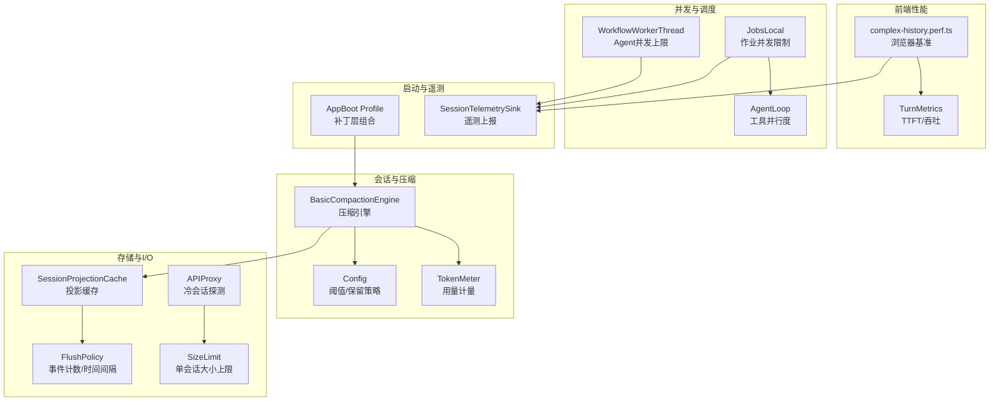
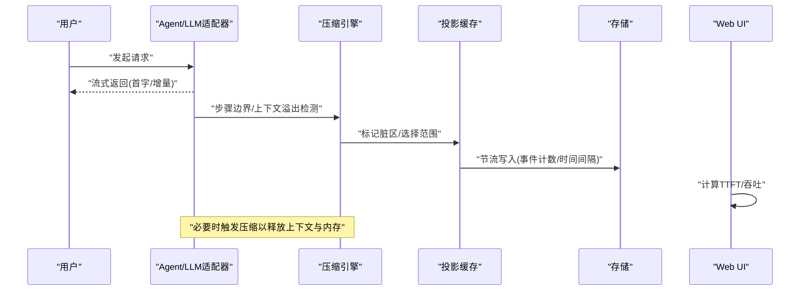
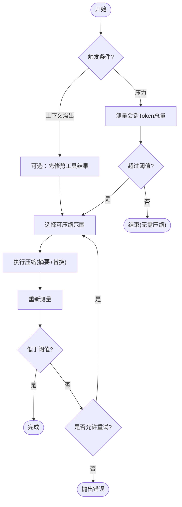
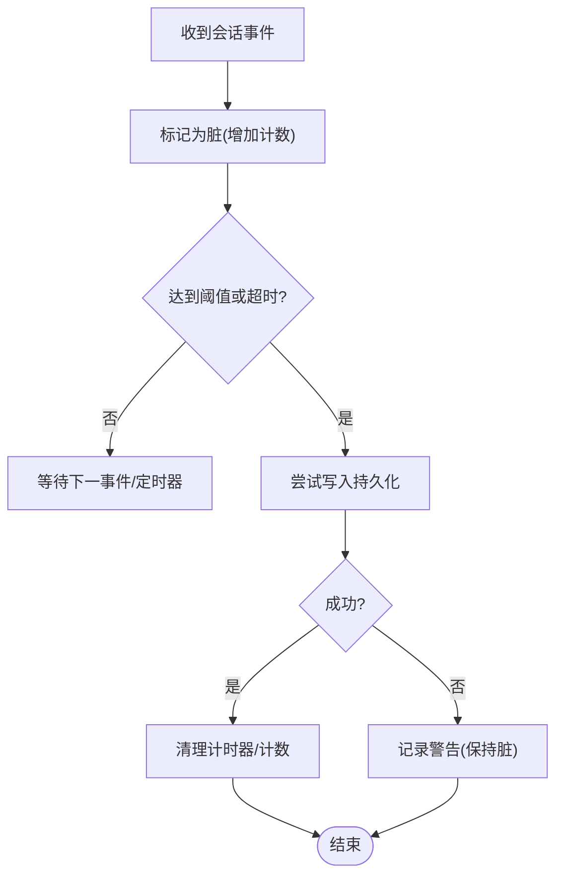
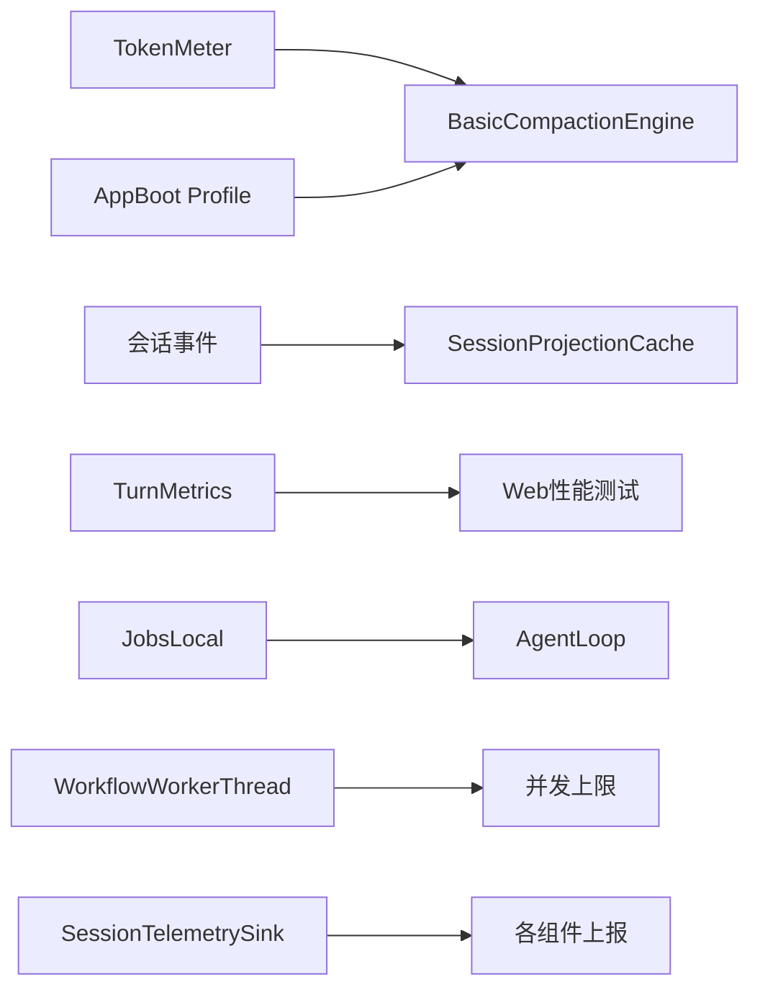

# 性能问题

<cite>
**本文引用的文件**
- [packages/compaction/compaction-basic/src/index.ts](file://packages/compaction/compaction-basic/src/index.ts)
- [packages/compaction/compaction-basic/src/config.ts](file://packages/compaction/compaction-basic/src/config.ts)
- [apps/web/tests/complex-history.perf.ts](file://apps/web/tests/complex-history.perf.ts)
- [vitest.web.perf.config.ts](file://vitest.web.perf.config.ts)
- [packages/client/ui-conversation/src/client/chat/turn-metrics.ts](file://packages/client/ui-conversation/src/client/chat/turn-metrics.ts)
- [packages/session/session-projection-cache/src/index.ts](file://packages/session/session-projection-cache/src/index.ts)
- [packages/host/apiproxy/src/api-proxy.ts](file://packages/host/apiproxy/src/api-proxy.ts)
- [packages/boot/app-boot/src/profile.ts](file://packages/boot/app-boot/src/profile.ts)
- [packages/session/session-telemetry/src/index.ts](file://packages/session/session-telemetry/src/index.ts)
- [packages/jobs/jobs-local/tests/jobs.spec.ts](file://packages/jobs/jobs-local/tests/jobs.spec.ts)
- [packages/core/agent-loop/tests/tool-calls.spec.ts](file://packages/core/agent-loop/tests/tool-calls.spec.ts)
- [packages/workflow/workflow-worker-thread/tests/session.spec.ts](file://packages/workflow/workflow-worker-thread/tests/session.spec.ts)
- [packages/shell/tool-bash/src/index.ts](file://packages/shell/tool-bash/src/index.ts)
- [packages/extensions/cordis-host-runner/tests/sandbox.spec.ts](file://packages/extensions/cordis-host-runner/tests/sandbox.spec.ts)
- [.agents/notes/implemented/architecture/2026-06-21-bounded-llm-request-recovery.md](file://.agents/notes/implemented/architecture/2026-06-21-bounded-llm-request-recovery.md)
</cite>

## 目录
1. [简介](#简介)
2. [项目结构](#项目结构)
3. [核心组件](#核心组件)
4. [架构总览](#架构总览)
5. [详细组件分析](#详细组件分析)
6. [依赖关系分析](#依赖关系分析)
7. [性能考量](#性能考量)
8. [故障排查指南](#故障排查指南)
9. [结论](#结论)
10. [附录](#附录)

## 简介
本指南聚焦于 DeepSeek Harness 在真实生产环境中的性能问题诊断与优化，覆盖响应慢、内存占用高、CPU 异常、并发能力不足等典型瓶颈，并针对 LLM 调用延迟、会话数据膨胀、工具执行效率低下、沙箱开销过大等具体场景给出可操作的监控、分析与调优策略。文档同时提供端到端的浏览器性能测试方法、流式指标采集、压缩（Compaction）机制、缓存与持久化节流、以及并发控制的最佳实践。

## 项目结构
本项目采用多包仓库组织，关键性能相关代码分布在以下区域：
- 会话与压缩：会话投影缓存、压缩引擎与配置、Token 计量
- 前端性能：Web 端复杂历史渲染的基准测试与指标度量
- 运行时与并发：作业调度、工具并行度、工作线程 Agent 并发限制
- 存储与 I/O：冷会话探测、写入节流与定时刷新
- 启动与配置：Profile 与补丁层组合，影响加载与运行时行为
- 遥测与指标：会话遥测接口，便于接入外部监控系统

图表来源
- [packages/compaction/compaction-basic/src/index.ts:103-130](file://packages/compaction/compaction-basic/src/index.ts#L103-L130)
- [packages/compaction/compaction-basic/src/config.ts:51-72](file://packages/compaction/compaction-basic/src/config.ts#L51-L72)
- [packages/session/session-projection-cache/src/index.ts:232-263](file://packages/session/session-projection-cache/src/index.ts#L232-L263)
- [packages/host/apiproxy/src/api-proxy.ts:565-601](file://packages/host/apiproxy/src/api-proxy.ts#L565-L601)
- [apps/web/tests/complex-history.perf.ts:1-200](file://apps/web/tests/complex-history.perf.ts#L1-L200)
- [packages/client/ui-conversation/src/client/chat/turn-metrics.ts:1-98](file://packages/client/ui-conversation/src/client/chat/turn-metrics.ts#L1-L98)
- [packages/jobs/jobs-local/tests/jobs.spec.ts:178-210](file://packages/jobs/jobs-local/tests/jobs.spec.ts#L178-L210)
- [packages/core/agent-loop/tests/tool-calls.spec.ts:290-320](file://packages/core/agent-loop/tests/tool-calls.spec.ts#L290-L320)
- [packages/workflow/workflow-worker-thread/tests/session.spec.ts:389-410](file://packages/workflow/workflow-worker-thread/tests/session.spec.ts#L389-L410)
- [packages/boot/app-boot/src/profile.ts:1-421](file://packages/boot/app-boot/src/profile.ts#L1-L421)
- [packages/session/session-telemetry/src/index.ts:162-178](file://packages/session/session-telemetry/src/index.ts#L162-L178)

章节来源
- [packages/compaction/compaction-basic/src/index.ts:103-130](file://packages/compaction/compaction-basic/src/index.ts#L103-L130)
- [packages/compaction/compaction-basic/src/config.ts:51-72](file://packages/compaction/compaction-basic/src/config.ts#L51-L72)
- [packages/session/session-projection-cache/src/index.ts:232-263](file://packages/session/session-projection-cache/src/index.ts#L232-L263)
- [packages/host/apiproxy/src/api-proxy.ts:565-601](file://packages/host/apiproxy/src/api-proxy.ts#L565-L601)
- [apps/web/tests/complex-history.perf.ts:1-200](file://apps/web/tests/complex-history.perf.ts#L1-L200)
- [packages/client/ui-conversation/src/client/chat/turn-metrics.ts:1-98](file://packages/client/ui-conversation/src/client/chat/turn-metrics.ts#L1-L98)
- [packages/jobs/jobs-local/tests/jobs.spec.ts:178-210](file://packages/jobs/jobs-local/tests/jobs.spec.ts#L178-L210)
- [packages/core/agent-loop/tests/tool-calls.spec.ts:290-320](file://packages/core/agent-loop/tests/tool-calls.spec.ts#L290-L320)
- [packages/workflow/workflow-worker-thread/tests/session.spec.ts:389-410](file://packages/workflow/workflow-worker-thread/tests/session.spec.ts#L389-L410)
- [packages/boot/app-boot/src/profile.ts:1-421](file://packages/boot/app-boot/src/profile.ts#L1-L421)
- [packages/session/session-telemetry/src/index.ts:162-178](file://packages/session/session-telemetry/src/index.ts#L162-L178)

## 核心组件
- 压缩引擎（BasicCompactionEngine）：基于 Token 计量与模型上下文容量，自动或手动触发会话压缩，缓解上下文溢出与内存膨胀。支持压力阈值、保留比例/令牌数、重试次数、目标模型策略等。
- 会话投影缓存（SessionProjectionCache）：对会话变更进行节流写入，按事件计数或时间间隔落盘，降低频繁 I/O 带来的 CPU/磁盘压力。
- API 代理（APIProxy）：冷会话元数据探测时进行大小限制与失败降级，避免大会话导致列表查询卡顿。
- Web 性能测试（complex-history.perf.ts）：在浏览器中模拟长历史、大量工具调用与流式增量，采集任务耗时、脚本耗时、布局/重排耗时、DOM 节点与监听器数量、堆内存变化等指标。
- 回合指标（TurnMetrics）：从助手消息节点推导首字延迟（TTFT）、解码耗时与吞吐（tokens/秒），用于 UI 展示与统计。
- 作业与并发控制（JobsLocal、AgentLoop、WorkflowWorkerThread）：通过作业并发上限、工具并行度、Agent 总数上限等限制，防止资源争用与雪崩。
- 启动与配置（AppBoot Profile）：通过补丁层组合动态调整服务挂载与行为，可用于在生产环境中裁剪功能、降低启动与运行开销。
- 遥测（SessionTelemetrySink）：定义会话级遥测记录的上报接口，便于接入外部监控系统。

章节来源
- [packages/compaction/compaction-basic/src/index.ts:258-332](file://packages/compaction/compaction-basic/src/index.ts#L258-L332)
- [packages/compaction/compaction-basic/src/config.ts:51-72](file://packages/compaction/compaction-basic/src/config.ts#L51-L72)
- [packages/session/session-projection-cache/src/index.ts:232-263](file://packages/session/session-projection-cache/src/index.ts#L232-L263)
- [packages/host/apiproxy/src/api-proxy.ts:565-601](file://packages/host/apiproxy/src/api-proxy.ts#L565-L601)
- [apps/web/tests/complex-history.perf.ts:1-200](file://apps/web/tests/complex-history.perf.ts#L1-L200)
- [packages/client/ui-conversation/src/client/chat/turn-metrics.ts:1-98](file://packages/client/ui-conversation/src/client/chat/turn-metrics.ts#L1-L98)
- [packages/jobs/jobs-local/tests/jobs.spec.ts:178-210](file://packages/jobs/jobs-local/tests/jobs.spec.ts#L178-L210)
- [packages/core/agent-loop/tests/tool-calls.spec.ts:290-320](file://packages/core/agent-loop/tests/tool-calls.spec.ts#L290-L320)
- [packages/workflow/workflow-worker-thread/tests/session.spec.ts:389-410](file://packages/workflow/workflow-worker-thread/tests/session.spec.ts#L389-L410)
- [packages/boot/app-boot/src/profile.ts:1-421](file://packages/boot/app-boot/src/profile.ts#L1-L421)
- [packages/session/session-telemetry/src/index.ts:162-178](file://packages/session/session-telemetry/src/index.ts#L162-L178)

## 架构总览
下图展示了性能相关的关键路径：用户请求进入后，可能触发 LLM 流式调用；若会话过长或上下文溢出，压缩引擎介入；会话变更经投影缓存节流写入；UI 层通过 TurnMetrics 计算 TTFT 与吞吐；后台作业与工作线程受并发上限保护；启动阶段可通过 Profile 裁剪模块以降低开销。

图表来源
- [packages/compaction/compaction-basic/src/index.ts:147-224](file://packages/compaction/compaction-basic/src/index.ts#L147-L224)
- [packages/session/session-projection-cache/src/index.ts:232-263](file://packages/session/session-projection-cache/src/index.ts#L232-L263)
- [packages/client/ui-conversation/src/client/chat/turn-metrics.ts:40-98](file://packages/client/ui-conversation/src/client/chat/turn-metrics.ts#L40-L98)

## 详细组件分析

### 压缩引擎（BasicCompactionEngine）
- 作用：在“压力”或“上下文溢出”两种触发条件下，依据 Token 计量与模型上下文容量，选择可压缩范围并生成摘要，从而降低后续请求的输入规模与内存占用。
- 关键点：
  - 自动注册：在“步骤前”与“请求错误”事件中触发压缩，支持重试与恢复。
  - 策略：阈值比率、保留比例/令牌数、重试次数、目标模型策略。
  - 安全：在压缩过程中传递取消信号，确保可中断；失败时不丢弃已完成的持久化进度。
- 优化建议：
  - 合理设置阈值与保留策略，避免过度压缩导致信息丢失。
  - 结合 Token 计量结果动态评估压缩收益。
  - 在高频场景中启用自动压缩，减少人工干预。

图表来源
- [packages/compaction/compaction-basic/src/index.ts:258-332](file://packages/compaction/compaction-basic/src/index.ts#L258-L332)
- [packages/compaction/compaction-basic/src/config.ts:51-72](file://packages/compaction/compaction-basic/src/config.ts#L51-L72)

章节来源
- [packages/compaction/compaction-basic/src/index.ts:147-224](file://packages/compaction/compaction-basic/src/index.ts#L147-L224)
- [packages/compaction/compaction-basic/src/index.ts:258-332](file://packages/compaction/compaction-basic/src/index.ts#L258-L332)
- [packages/compaction/compaction-basic/src/config.ts:51-72](file://packages/compaction/compaction-basic/src/config.ts#L51-L72)

### 会话投影缓存（SessionProjectionCache）
- 作用：将会话变更批量写入持久化层，避免每次事件都落盘造成的高频 I/O 与 CPU 抖动。
- 关键点：
  - 强制落盘点：回合结束、会话销毁。
  - 节流策略：按事件计数阈值或固定时间间隔触发写入。
  - 容错：写入失败仅告警，保持缓存状态一致。
- 优化建议：
  - 在高吞吐场景下调大写入门槛或延长间隔，平衡一致性与性能。
  - 监控写入失败率，及时定位存储后端问题。

图表来源
- [packages/session/session-projection-cache/src/index.ts:232-263](file://packages/session/session-projection-cache/src/index.ts#L232-L263)

章节来源
- [packages/session/session-projection-cache/src/index.ts:232-263](file://packages/session/session-projection-cache/src/index.ts#L232-L263)

### Web 性能测试与指标（complex-history.perf.ts 与 TurnMetrics）
- 作用：在浏览器中模拟高基数历史与工具调用，采集任务耗时、脚本耗时、布局/重排耗时、DOM 节点与监听器数量、堆内存变化等指标；并从助手消息节点推导 TTFT 与吞吐。
- 关键点：
  - 指标采集：wallMs、taskMs、scriptMs、layoutMs、recalcStyleMs、devtoolsMs、nodesDelta、listenersDelta、heapDeltaMb。
  - 回合指标：TTFT（首字延迟）、decodeMs（解码耗时）、tokensPerSecond（吞吐）。
- 优化建议：
  - 关注 layout/recalcStyle 耗时，优化 DOM 结构与样式计算。
  - 控制监听器数量与节点增长，避免内存泄漏。
  - 使用流式增量更新，减少整屏重绘。

章节来源
- [apps/web/tests/complex-history.perf.ts:1-200](file://apps/web/tests/complex-history.perf.ts#L1-L200)
- [packages/client/ui-conversation/src/client/chat/turn-metrics.ts:1-98](file://packages/client/ui-conversation/src/client/chat/turn-metrics.ts#L1-L98)

### 并发与调度（JobsLocal、AgentLoop、WorkflowWorkerThread）
- 作用：通过作业并发上限、工具并行度、Agent 总数上限等限制，防止资源争用与雪崩。
- 关键点：
  - JobsLocal：每个所有者默认最多 10 个活跃作业，超限拒绝。
  - AgentLoop：工具并行调用受 cap 限制，逐步补充。
  - WorkflowWorkerThread：总 Agent 数受限，队列按 FIFO 顺序执行。
- 优化建议：
  - 根据硬件与负载调整并发上限，避免 CPU 饱和与上下文切换开销。
  - 监控阻塞与拒绝率，识别热点工具或服务。

章节来源
- [packages/jobs/jobs-local/tests/jobs.spec.ts:178-210](file://packages/jobs/jobs-local/tests/jobs.spec.ts#L178-L210)
- [packages/core/agent-loop/tests/tool-calls.spec.ts:290-320](file://packages/core/agent-loop/tests/tool-calls.spec.ts#L290-L320)
- [packages/workflow/workflow-worker-thread/tests/session.spec.ts:389-410](file://packages/workflow/workflow-worker-thread/tests/session.spec.ts#L389-L410)

### 启动与配置（AppBoot Profile）
- 作用：通过 Profile 与补丁层组合，动态调整服务挂载与行为，可在生产环境中裁剪功能、降低启动与运行开销。
- 关键点：
  - 补丁层顺序：bundle 层 → 用户层 → 启动参数层。
  - 模块解析：安装优先，保证一致性。
- 优化建议：
  - 在生产启用最小必要 bundle，禁用非必要功能。
  - 使用补丁层覆盖默认配置，适配不同部署环境。

章节来源
- [packages/boot/app-boot/src/profile.ts:1-421](file://packages/boot/app-boot/src/profile.ts#L1-L421)

### 遥测（SessionTelemetrySink）
- 作用：定义会话级遥测记录的上报接口，便于接入外部监控系统，实现性能指标的可观测性。
- 关键点：
  - emit：上报逻辑记录。
  - flush：可选的批量刷新。
  - shutdown：优雅关闭，确保管线静默。
- 优化建议：
  - 采样与聚合上报，降低传输与存储成本。
  - 区分关键路径与非关键路径指标，聚焦瓶颈。

章节来源
- [packages/session/session-telemetry/src/index.ts:162-178](file://packages/session/session-telemetry/src/index.ts#L162-L178)

## 依赖关系分析
- 压缩引擎依赖 Token 计量与 LLM 模型信息，结合会话事件与状态进行决策。
- 投影缓存依赖会话生命周期与事件流，按策略触发写入。
- Web 性能测试依赖 Playwright 与 Chromium 指标，结合 UI 指标推导性能趋势。
- 并发控制依赖作业注册表与工具调用通道，确保资源不被滥用。
- 启动配置依赖补丁层组合，影响服务挂载与行为。

图表来源
- [packages/compaction/compaction-basic/src/index.ts:103-130](file://packages/compaction/compaction-basic/src/index.ts#L103-L130)
- [packages/session/session-projection-cache/src/index.ts:232-263](file://packages/session/session-projection-cache/src/index.ts#L232-L263)
- [apps/web/tests/complex-history.perf.ts:1-200](file://apps/web/tests/complex-history.perf.ts#L1-L200)
- [packages/client/ui-conversation/src/client/chat/turn-metrics.ts:1-98](file://packages/client/ui-conversation/src/client/chat/turn-metrics.ts#L1-L98)
- [packages/jobs/jobs-local/tests/jobs.spec.ts:178-210](file://packages/jobs/jobs-local/tests/jobs.spec.ts#L178-L210)
- [packages/core/agent-loop/tests/tool-calls.spec.ts:290-320](file://packages/core/agent-loop/tests/tool-calls.spec.ts#L290-L320)
- [packages/workflow/workflow-worker-thread/tests/session.spec.ts:389-410](file://packages/workflow/workflow-worker-thread/tests/session.spec.ts#L389-L410)
- [packages/boot/app-boot/src/profile.ts:1-421](file://packages/boot/app-boot/src/profile.ts#L1-L421)
- [packages/session/session-telemetry/src/index.ts:162-178](file://packages/session/session-telemetry/src/index.ts#L162-L178)

章节来源
- [packages/compaction/compaction-basic/src/index.ts:103-130](file://packages/compaction/compaction-basic/src/index.ts#L103-L130)
- [packages/session/session-projection-cache/src/index.ts:232-263](file://packages/session/session-projection-cache/src/index.ts#L232-L263)
- [apps/web/tests/complex-history.perf.ts:1-200](file://apps/web/tests/complex-history.perf.ts#L1-L200)
- [packages/client/ui-conversation/src/client/chat/turn-metrics.ts:1-98](file://packages/client/ui-conversation/src/client/chat/turn-metrics.ts#L1-L98)
- [packages/jobs/jobs-local/tests/jobs.spec.ts:178-210](file://packages/jobs/jobs-local/tests/jobs.spec.ts#L178-L210)
- [packages/core/agent-loop/tests/tool-calls.spec.ts:290-320](file://packages/core/agent-loop/tests/tool-calls.spec.ts#L290-L320)
- [packages/workflow/workflow-worker-thread/tests/session.spec.ts:389-410](file://packages/workflow/workflow-worker-thread/tests/session.spec.ts#L389-L410)
- [packages/boot/app-boot/src/profile.ts:1-421](file://packages/boot/app-boot/src/profile.ts#L1-L421)
- [packages/session/session-telemetry/src/index.ts:162-178](file://packages/session/session-telemetry/src/index.ts#L162-L178)

## 性能考量
- 响应速度慢
  - 关注 TTFT 与 decodeMs，识别首字延迟与解码阶段的瓶颈。
  - 检查 LLM 适配器空闲超时与重试策略，避免长时间挂起。
- 内存占用过高
  - 启用压缩引擎，控制会话规模；监控堆内存与 DOM 节点增长。
  - 使用投影缓存节流写入，减少频繁 I/O 导致的内存抖动。
- CPU 使用率异常
  - 调整作业与工具并行度，避免 CPU 饱和。
  - 优化布局与样式重算，降低 UI 渲染开销。
- 并发处理能力不足
  - 设置作业并发上限与 Agent 总数上限，防止资源争用。
  - 监控拒绝率与排队长度，识别热点路径。

[本节为通用指导，不直接分析具体文件]

## 故障排查指南
- LLM 调用延迟
  - 检查适配器空闲超时与重试策略，确认流式中断与恢复机制。
  - 使用 TurnMetrics 追踪 TTFT 与吞吐，定位慢点。
- 会话数据膨胀
  - 启用压缩引擎，观察压缩触发与效果；调整阈值与保留策略。
  - 监控投影缓存写入频率与失败率，确保持久化稳定。
- 工具执行效率低下
  - 调整工具并行度与作业并发上限，避免阻塞。
  - 使用沙箱隔离与权限策略，减少越权与安全检查开销。
- 沙箱开销过大
  - 评估沙箱模式与策略，必要时降级或裁剪功能。
  - 监控沙箱全局隔离与 Node-API 陷阱，避免额外开销。

章节来源
- [.agents/notes/implemented/architecture/2026-06-21-bounded-llm-request-recovery.md:75-121](file://.agents/notes/implemented/architecture/2026-06-21-bounded-llm-request-recovery.md#L75-L121)
- [packages/shell/tool-bash/src/index.ts:190-200](file://packages/shell/tool-bash/src/index.ts#L190-L200)
- [packages/extensions/cordis-host-runner/tests/sandbox.spec.ts:29-52](file://packages/extensions/cordis-host-runner/tests/sandbox.spec.ts#L29-L52)

## 结论
通过压缩引擎、投影缓存、并发控制与 Web 性能测试等手段，DeepSeek Harness 能够在复杂场景下维持良好的性能表现。生产环境中应结合 Token 计量、TTFT/吞吐指标、作业与工具并行度、以及启动配置裁剪，持续监控与调优，确保系统在高负载下的稳定性与效率。

[本节为总结，不直接分析具体文件]

## 附录
- 浏览器性能测试配置：使用 vitest.web.perf.config.ts 启用高性能测试套件，包含长超时与控制台输出，便于调试与分析。
- 冷会话探测：APIProxy 在列出会话时对冷会话进行大小限制与读取探测，避免大会话拖慢列表查询。

章节来源
- [vitest.web.perf.config.ts:1-16](file://vitest.web.perf.config.ts#L1-L16)
- [packages/host/apiproxy/src/api-proxy.ts:565-601](file://packages/host/apiproxy/src/api-proxy.ts#L565-L601)