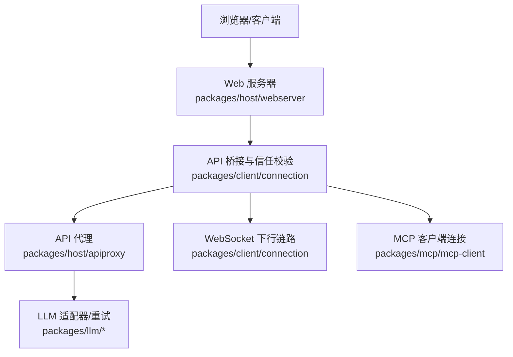
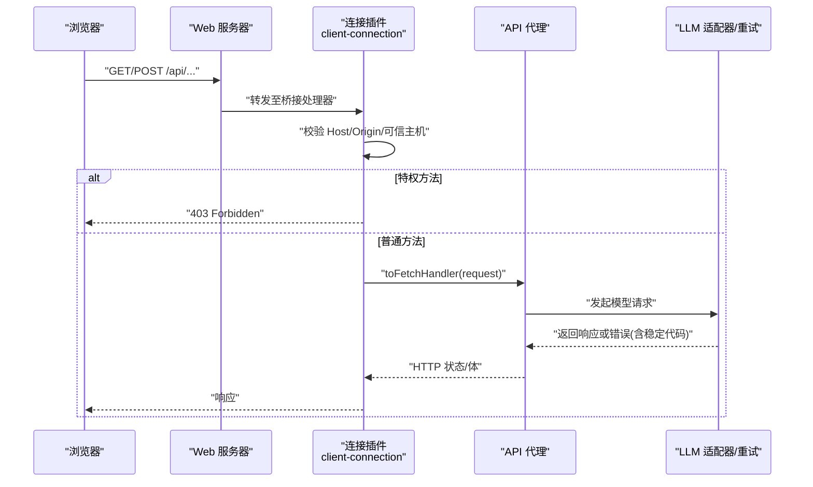
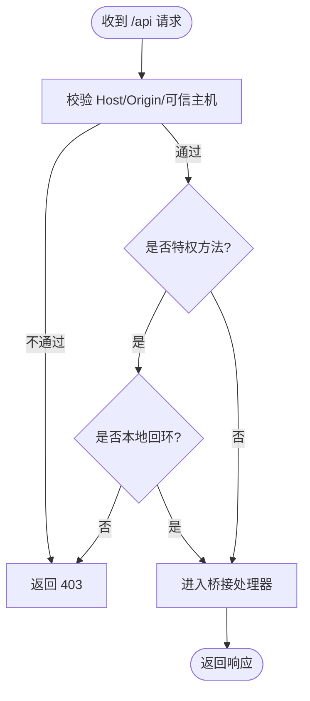
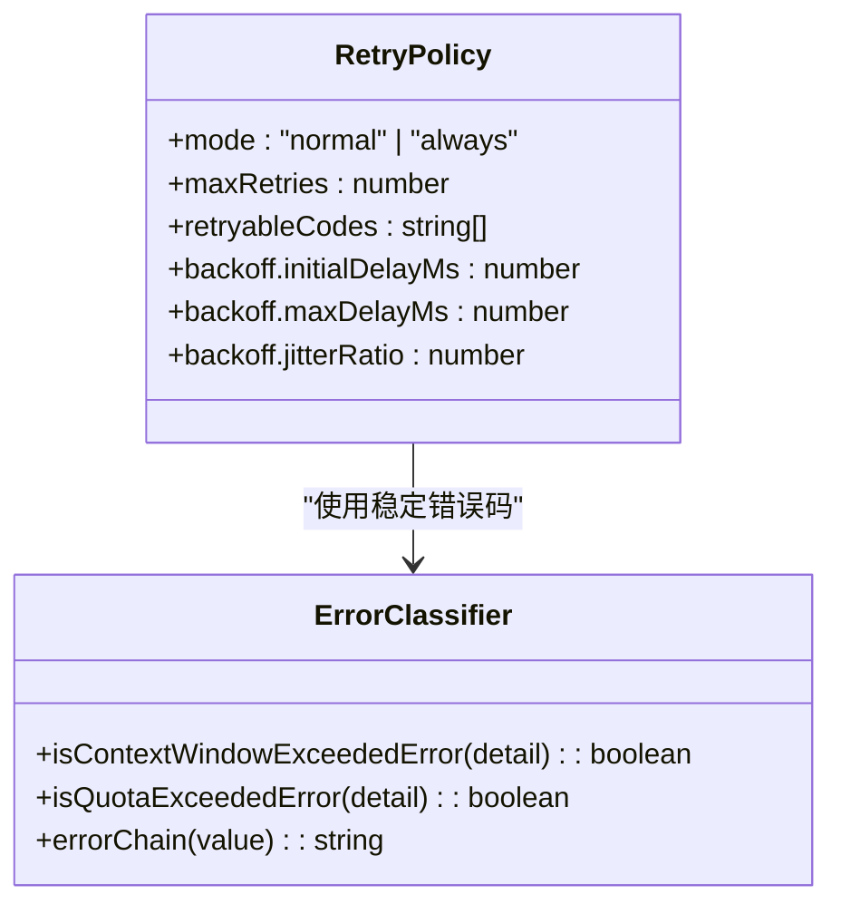
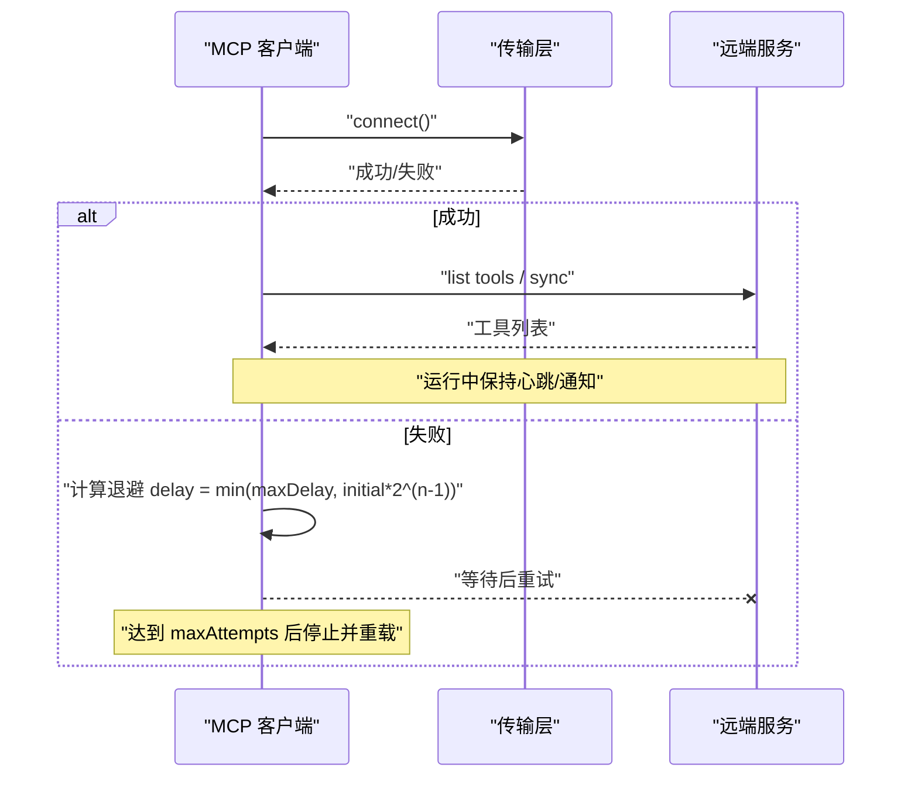
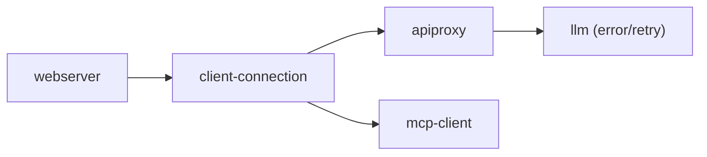

# 网络和网络安全问题

<cite>
**本文引用的文件**
- [packages/host/webserver/README.md](file://packages/host/webserver/README.md)
- [packages/client/connection/src/index.ts](file://packages/client/connection/src/index.ts)
- [packages/client/connection/src/api-request-trust.ts](file://packages/client/connection/src/api-request-trust.ts)
- [packages/client/connection/tests/api-request-trust.host.spec.ts](file://packages/client/connection/tests/api-request-trust.host.spec.ts)
- [packages/llm/llm/src/error.ts](file://packages/llm/llm/src/error.ts)
- [packages/llm/llm/src/retry-policy.ts](file://packages/llm/llm/src/retry-policy.ts)
- [packages/llm/llm-retry/src/index.ts](file://packages/llm/llm-retry/src/index.ts)
- [packages/mcp/mcp-client/src/connection.ts](file://packages/mcp/mcp-client/src/connection.ts)
- [packages/host/apiproxy/tests/client-handler.spec.ts](file://packages/host/apiproxy/tests/client-handler.spec.ts)
- [packages/test-support/llm-mock-server/tests/server.spec.ts](file://packages/test-support/llm-mock-server/tests/server.spec.ts)
- [packages/llm/llm-deepseek/tests/adapter.spec.ts](file://packages/llm/llm-deepseek/tests/adapter.spec.ts)
- [packages/session-query/tool-session-query/tests/tool-session-query.spec.ts](file://packages/session-query/tool-session-query/tests/tool-session-query.spec.ts)
</cite>

## 目录
1. [简介](#简介)
2. [项目结构](#项目结构)
3. [核心组件](#核心组件)
4. [架构总览](#架构总览)
5. [详细组件分析](#详细组件分析)
6. [依赖关系分析](#依赖关系分析)
7. [性能与稳定性](#性能与稳定性)
8. [故障排查指南](#故障排查指南)
9. [结论](#结论)
10. [附录：企业最佳实践清单](#附录企业最佳实践清单)

## 简介
本指南面向在企业环境中部署和运行 deepseek-harness 时遇到的网络与安全问题，覆盖网络连接失败、API 调用超时、SSL/TLS 与证书问题、防火墙限制、安全策略配置错误、权限验证失败、敏感信息泄露风险等。文档基于仓库中的实际实现，提供可操作的诊断步骤、配置检查项与修复方案，并给出企业级加固建议。

## 项目结构
与网络和安全相关的核心位置如下：
- Web 服务器与路由注册：packages/host/webserver（仅承载 HTTP/升级通道，不含 TLS/鉴权）
- 浏览器到宿主 API 桥接与信任边界：packages/client/connection（/api 前缀、可信主机白名单、特权方法圈定）
- LLM 请求错误分类与重试策略：packages/llm/llm（错误码、配额/上下文溢出识别）、packages/llm/llm-retry（退避与重试执行）
- MCP 客户端连接与重连：packages/mcp/mcp-client（指数退避、最大尝试次数、工具同步）
- API 代理错误映射：packages/host/apiproxy（HTTP 状态映射、传输失败）
- 测试支撑与用例：packages/test-support/llm-mock-server、packages/llm/llm-deepseek/tests（模拟各类网络/协议错误）
- 敏感信息防护：packages/session-query/tool-session-query（诊断输出脱敏）

图表来源
- [packages/host/webserver/README.md:1-23](file://packages/host/webserver/README.md#L1-L23)
- [packages/client/connection/src/index.ts:130-196](file://packages/client/connection/src/index.ts#L130-L196)
- [packages/host/apiproxy/tests/client-handler.spec.ts:333-344](file://packages/host/apiproxy/tests/client-handler.spec.ts#L333-L344)
- [packages/llm/llm/src/retry-policy.ts:145-191](file://packages/llm/llm/src/retry-policy.ts#L145-L191)
- [packages/mcp/mcp-client/src/connection.ts:123-351](file://packages/mcp/mcp-client/src/connection.ts#L123-L351)

章节来源
- [packages/host/webserver/README.md:1-23](file://packages/host/webserver/README.md#L1-L23)
- [packages/client/connection/src/index.ts:130-196](file://packages/client/connection/src/index.ts#L130-L196)

## 核心组件
- Web 服务器：负责监听、路由注册与升级握手；默认仅绑定回环地址，非回环暴露需前置反向代理加固；无内置 TLS/鉴权。
- 连接与信任边界：/api 前缀统一入口，强制 Host/Origin 校验与 DNS 重绑定防护；特权方法仅限本地回环。
- LLM 错误与重试：将底层网络/协议错误归一为稳定代码（如 RATE_LIMIT、TIMEOUT、TRANSPORT、QUOTA），并提供可控的指数退避重试。
- MCP 客户端：连接丢失后按策略自动重连，具备最大尝试次数与退避上限，失败则注销工具并告警。
- API 代理：将内部异常映射为标准 HTTP 状态，便于上层统一处理。
- 敏感信息保护：工具诊断输出对敏感信息进行脱敏，避免日志/结果泄露。

章节来源
- [packages/host/webserver/README.md:19-23](file://packages/host/webserver/README.md#L19-L23)
- [packages/client/connection/src/index.ts:49-119](file://packages/client/connection/src/index.ts#L49-L119)
- [packages/llm/llm/src/error.ts:13-100](file://packages/llm/llm/src/error.ts#L13-L100)
- [packages/llm/llm/src/retry-policy.ts:14-24](file://packages/llm/llm/src/retry-policy.ts#L14-L24)
- [packages/mcp/mcp-client/src/connection.ts:27-45](file://packages/mcp/mcp-client/src/connection.ts#L27-L45)
- [packages/host/apiproxy/tests/client-handler.spec.ts:333-344](file://packages/host/apiproxy/tests/client-handler.spec.ts#L333-L344)
- [packages/session-query/tool-session-query/tests/tool-session-query.spec.ts:860-866](file://packages/session-query/tool-session-query/tests/tool-session-query.spec.ts#L860-L866)

## 架构总览
下图展示一次 /api 请求从浏览器到后端服务的完整路径与安全控制点。

图表来源
- [packages/client/connection/src/index.ts:130-196](file://packages/client/connection/src/index.ts#L130-L196)
- [packages/host/apiproxy/tests/client-handler.spec.ts:333-344](file://packages/host/apiproxy/tests/client-handler.spec.ts#L333-L344)
- [packages/llm/llm/src/retry-policy.ts:145-191](file://packages/llm/llm/src/retry-policy.ts#L145-L191)

## 详细组件分析

### Web 服务器与网络暴露面
- 绑定策略：默认仅监听回环；若绑定 0.0.0.0，会暴露到所在网络，需通过反向代理提供 TLS、鉴权与源策略。
- 路由与升级：HTTP 路由与 WebSocket 升级分离；未匹配请求返回 404；升级失败关闭连接。
- 已知限制：v1 不包含 TLS/鉴权/源策略；Socket 选项固定。

章节来源
- [packages/host/webserver/README.md:1-23](file://packages/host/webserver/README.md#L1-L23)

### 连接插件与信任边界（/api 前缀）
- 可信主机白名单：trustedHosts 仅接受裸 host[:port] 规范形式，加载期即断言，防止 DNS 重绑定与跨站攻击。
- 特权方法锁定：settings、credentials、host 交互等方法仅在本地回环可用，即使部署在非回环地址。
- 请求大小限制：maxRequestBodyBytes 用于限制 JSON 体大小，并与图片附件容量做一致性校验。
- WebSocket 下行：MUX/HOST 事件通道同样受可信主机校验，不信任则拒绝升级。

图表来源
- [packages/client/connection/src/index.ts:130-196](file://packages/client/connection/src/index.ts#L130-L196)
- [packages/client/connection/src/api-request-trust.ts:30-58](file://packages/client/connection/src/api-request-trust.ts#L30-L58)
- [packages/client/connection/tests/api-request-trust.host.spec.ts:22-108](file://packages/client/connection/tests/api-request-trust.host.spec.ts#L22-L108)

章节来源
- [packages/client/connection/src/index.ts:49-119](file://packages/client/connection/src/index.ts#L49-L119)
- [packages/client/connection/src/api-request-trust.ts:30-58](file://packages/client/connection/src/api-request-trust.ts#L30-L58)
- [packages/client/connection/tests/api-request-trust.host.spec.ts:22-108](file://packages/client/connection/tests/api-request-trust.host.spec.ts#L22-L108)

### LLM 错误分类与重试策略
- 错误分类：将网络/协议错误归一为稳定代码（RATE_LIMIT、TIMEOUT、TRANSPORT、QUOTA、CONTEXT_WINDOW_EXCEEDED 等），便于上层统一处理。
- 配额与上下文溢出：区分“账户配额耗尽”与“瞬时速率限制”，以及“超出上下文窗口”的特定语义。
- 重试策略：支持 normal（限定可重试错误码）与 always（无限重试直到成功/取消/销毁）两种模式；退避参数包含初始延迟、最大延迟与抖动比例。
- 重试执行：在扩展点安装，支持可中断延迟与活跃操作追踪。

图表来源
- [packages/llm/llm/src/retry-policy.ts:14-24](file://packages/llm/llm/src/retry-policy.ts#L14-L24)
- [packages/llm/llm/src/retry-policy.ts:145-191](file://packages/llm/llm/src/retry-policy.ts#L145-L191)
- [packages/llm/llm/src/error.ts:24-100](file://packages/llm/llm/src/error.ts#L24-L100)
- [packages/llm/llm-retry/src/index.ts:93-109](file://packages/llm/llm-retry/src/index.ts#L93-L109)

章节来源
- [packages/llm/llm/src/error.ts:24-100](file://packages/llm/llm/src/error.ts#L24-L100)
- [packages/llm/llm/src/retry-policy.ts:14-24](file://packages/llm/llm/src/retry-policy.ts#L14-L24)
- [packages/llm/llm/src/retry-policy.ts:145-191](file://packages/llm/llm/src/retry-policy.ts#L145-L191)
- [packages/llm/llm-retry/src/index.ts:93-109](file://packages/llm/llm-retry/src/index.ts#L93-L109)

### MCP 客户端连接与重连
- 重连策略：指数退避（initialDelayMs 起，按 2^attempt 增长，上限 maxDelayMs），连续失败超过 maxAttempts 则放弃并重载/重启插件恢复。
- 工具同步：连接成功后同步工具列表；断开后重新同步；冲突以“包含”策略处理，启动时可配置严格模式。
- 生命周期：每次生成独立 Client，close 超时保护避免僵尸进程；dispose 确保清理所有资源。

图表来源
- [packages/mcp/mcp-client/src/connection.ts:27-45](file://packages/mcp/mcp-client/src/connection.ts#L27-L45)
- [packages/mcp/mcp-client/src/connection.ts:192-225](file://packages/mcp/mcp-client/src/connection.ts#L192-L225)
- [packages/mcp/mcp-client/src/connection.ts:237-305](file://packages/mcp/mcp-client/src/connection.ts#L237-L305)

章节来源
- [packages/mcp/mcp-client/src/connection.ts:123-351](file://packages/mcp/mcp-client/src/connection.ts#L123-L351)

### API 代理与错误映射
- 将内部异常映射为 HTTP 状态码（如未知方法 404、非法体 400、实现崩溃 500）。
- 客户端侧将 500 视为传输失败抛出，便于上层统一捕获。

章节来源
- [packages/host/apiproxy/tests/client-handler.spec.ts:333-344](file://packages/host/apiproxy/tests/client-handler.spec.ts#L333-L344)

### 敏感信息与诊断脱敏
- 工具查询类操作在失败时将诊断消息中的敏感片段替换为占位，并在服务端记录告警，避免泄露密钥、路径等。

章节来源
- [packages/session-query/tool-session-query/tests/tool-session-query.spec.ts:860-866](file://packages/session-query/tool-session-query/tests/tool-session-query.spec.ts#L860-L866)
- [packages/session-query/tool-session-query/tests/tool-session-query.spec.ts:1298-1341](file://packages/session-query/tool-session-query/tests/tool-session-query.spec.ts#L1298-L1341)

## 依赖关系分析
- Web 服务器作为最外层载体，仅负责网络 I/O 与路由分发。
- 连接插件位于 Web 服务器之上，承担信任校验与特权访问控制。
- API 代理屏蔽内部实现细节，向上提供稳定的 HTTP 契约。
- LLM 模块依赖错误分类与重试策略，保证在网络不稳定时的弹性。
- MCP 客户端独立于 LLM，但共享重连与退避思想，保障外部工具链可用性。

图表来源
- [packages/host/webserver/README.md:1-23](file://packages/host/webserver/README.md#L1-L23)
- [packages/client/connection/src/index.ts:130-196](file://packages/client/connection/src/index.ts#L130-L196)
- [packages/llm/llm/src/retry-policy.ts:145-191](file://packages/llm/llm/src/retry-policy.ts#L145-L191)
- [packages/mcp/mcp-client/src/connection.ts:123-351](file://packages/mcp/mcp-client/src/connection.ts#L123-L351)

## 性能与稳定性
- 重试预算与退避：合理设置 maxRetries、initialDelayMs、maxDelayMs、jitterRatio，避免雪崩与过度重试。
- 连接稳定性：MCP 客户端的重连预算与超时保护避免僵尸进程与工具泄漏。
- 请求体限制：根据附件能力调整 maxRequestBodyBytes，避免过大请求导致内存压力。
- 错误快速失败：对不可重试的错误（如 QUOTA、INVALID_CREDENTIAL）立即终止，减少无效重试。

[本节为通用指导，无需具体文件引用]

## 故障排查指南

### 网络连接失败
- 现象：ECONNREFUSED、DNS 解析失败、代理不可达。
- 定位：
  - 确认 Web 服务器绑定的 host/port 与期望一致；非回环绑定需前置反向代理。
  - 检查防火墙/安全组/代理规则是否放行目标端口。
  - 观察 MCP 客户端重连日志，确认是否达到 maxAttempts 并停止。
- 修复：
  - 开放必要端口或调整代理配置。
  - 调整 MCP 重连策略（initialDelayMs、maxDelayMs、maxAttempts）。
  - 对 LLM 请求启用正常重试模式，针对 TRANSPORT/TIMEOUT 进行有限重试。

章节来源
- [packages/host/webserver/README.md:19-23](file://packages/host/webserver/README.md#L19-L23)
- [packages/mcp/mcp-client/src/connection.ts:192-225](file://packages/mcp/mcp-client/src/connection.ts#L192-L225)
- [packages/llm/llm/src/retry-policy.ts:14-24](file://packages/llm/llm/src/retry-policy.ts#L14-L24)

### API 调用超时
- 现象：TIMEOUT、长时间无响应。
- 定位：
  - 检查上游服务负载与队列深度。
  - 查看重试策略是否过激导致放大效应。
- 修复：
  - 调大 backoff 上限与抖动比例，降低突发重试。
  - 对非幂等请求谨慎开启 always 模式。

章节来源
- [packages/llm/llm/src/retry-policy.ts:117-137](file://packages/llm/llm/src/retry-policy.ts#L117-L137)
- [packages/llm/llm/src/retry-policy.ts:145-191](file://packages/llm/llm/src/retry-policy.ts#L145-L191)

### SSL 证书与 HTTPS 问题
- 现状：开发服务器不提供 TLS；生产应通过反向代理提供 TLS 与证书管理。
- 建议：
  - 使用可信 CA 签发的证书，启用 HSTS、TLS1.2+。
  - 配置严格的源策略与 CORS，仅允许可信前端域名。
  - 定期轮换证书并监控过期时间。

章节来源
- [packages/host/webserver/README.md:19-23](file://packages/host/webserver/README.md#L19-L23)

### 防火墙限制
- 现象：内网无法访问、跨域受限、代理拦截。
- 定位：
  - 核对出口/入站规则、NAT 与代理白名单。
  - 检查浏览器 Origin/Sec-Fetch-Site 标记是否被误判。
- 修复：
  - 在白名单中添加可信主机（trustedHosts），并确保格式规范。
  - 在反向代理处正确透传 Host/Origin。

章节来源
- [packages/client/connection/src/api-request-trust.ts:30-58](file://packages/client/connection/src/api-request-trust.ts#L30-L58)
- [packages/client/connection/tests/api-request-trust.host.spec.ts:22-108](file://packages/client/connection/tests/api-request-trust.host.spec.ts#L22-L108)

### 安全策略配置错误
- 常见问题：
  - trustedHosts 条目不规范（带路径、用户信息、非规范化主机名）导致加载失败或授权扩大。
  - 特权方法在非回环环境被匿名调用。
- 修复：
  - 仅配置裸 host[:port]，大小写与端口规范化由系统处理。
  - 确保 settings/credentials/host 相关方法仅在本地回环可用。

章节来源
- [packages/client/connection/src/index.ts:49-119](file://packages/client/connection/src/index.ts#L49-L119)
- [packages/client/connection/src/api-request-trust.ts:30-58](file://packages/client/connection/src/api-request-trust.ts#L30-L58)

### 权限验证失败
- 现象：403 Forbidden、跨站请求被拒。
- 定位：
  - 检查 Host/Origin 是否与 trustedHosts 匹配。
  - 确认是否为特权方法且来自非回环。
- 修复：
  - 修正前端域名与端口；或在代理层正确重写 Host。
  - 将敏感接口迁移到本地回环或通过鉴权网关。

章节来源
- [packages/client/connection/tests/api-request-trust.host.spec.ts:22-108](file://packages/client/connection/tests/api-request-trust.host.spec.ts#L22-L108)

### 敏感信息泄露风险
- 现象：日志/诊断中包含密钥、路径等敏感信息。
- 修复：
  - 使用工具查询类的脱敏输出，避免将原始错误注入响应。
  - 在服务端记录告警而非向客户端暴露细节。

章节来源
- [packages/session-query/tool-session-query/tests/tool-session-query.spec.ts:860-866](file://packages/session-query/tool-session-query/tests/tool-session-query.spec.ts#L860-L866)

### 诊断工具与用例参考
- 使用 mock 服务器模拟 429/500/503/401/400 等错误，验证客户端行为与重试。
- 使用 adapter 测试验证不同错误码映射与上下文溢出识别。

章节来源
- [packages/test-support/llm-mock-server/tests/server.spec.ts:250-261](file://packages/test-support/llm-mock-server/tests/server.spec.ts#L250-L261)
- [packages/llm/llm-deepseek/tests/adapter.spec.ts:361-396](file://packages/llm/llm-deepseek/tests/adapter.spec.ts#L361-L396)

## 结论
- 网络层面：通过 Web 服务器的最小暴露面、连接插件的信任边界与 API 代理的稳定错误映射，构建可靠的请求通道。
- 安全层面：严格的主机白名单、特权方法回环锁定、敏感信息脱敏，有效降低越权与泄露风险。
- 稳定性层面：统一的错误分类与可配置的重试/重连策略，提升系统在弱网与上游波动下的韧性。
- 企业落地：在生产环境务必前置反向代理提供 TLS/鉴权/源策略，并结合组织网络策略与合规要求完成加固。

[本节为总结性内容，无需具体文件引用]

## 附录：企业最佳实践清单
- 网络
  - 仅绑定回环地址；对外暴露必须经反向代理。
  - 明确防火墙/代理白名单，确保 Host/Origin 透传正确。
  - 为关键链路配置健康检查与熔断。
- 安全
  - 配置 trustedHosts 为裸 host[:port]，禁止路径/用户信息。
  - 将敏感接口限制在本地回环或使用鉴权网关。
  - 启用 TLS1.2+、HSTS、强密码套件与证书监控。
  - 对所有诊断输出进行脱敏，仅服务端记录敏感细节。
- 稳定性
  - 为 LLM/MCP 配置合理的重试与重连策略，避免雪崩。
  - 对不可重试错误（配额耗尽、凭证无效）快速失败。
  - 定期演练故障场景（超时、限流、连接丢失）验证恢复流程。

[本节为通用指导，无需具体文件引用]