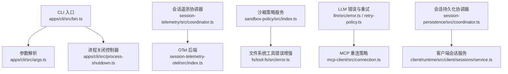
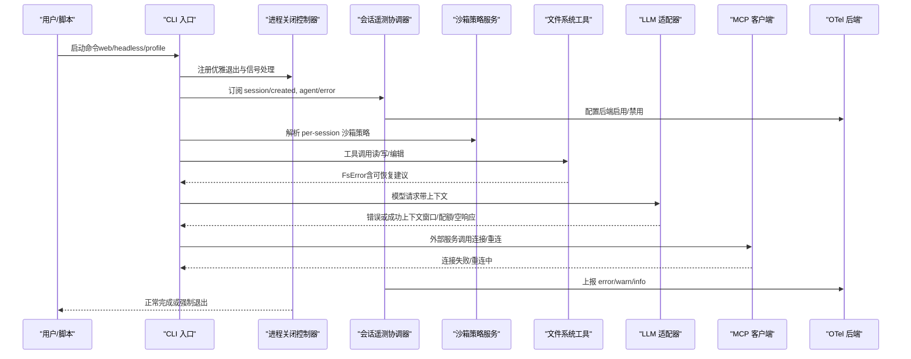
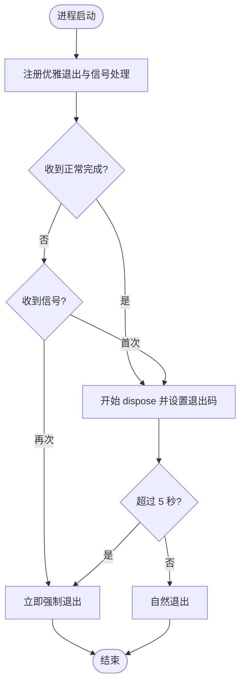
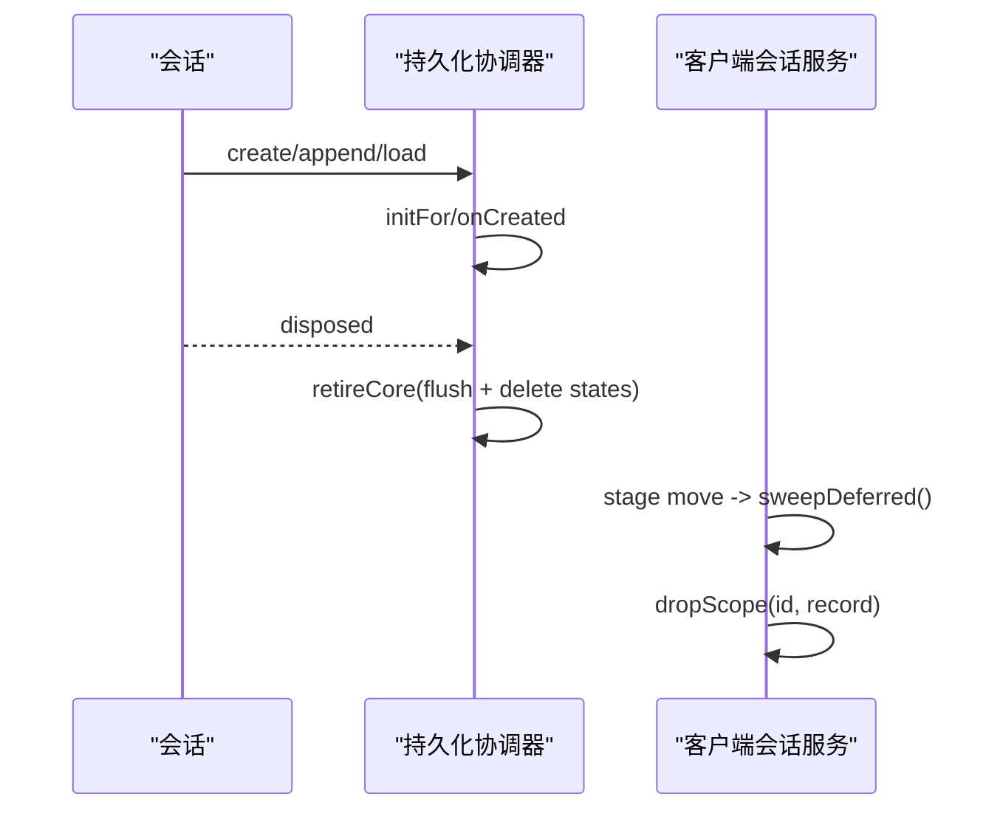
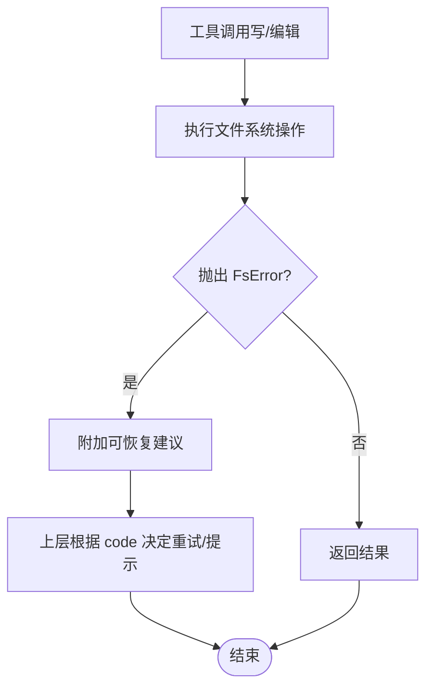
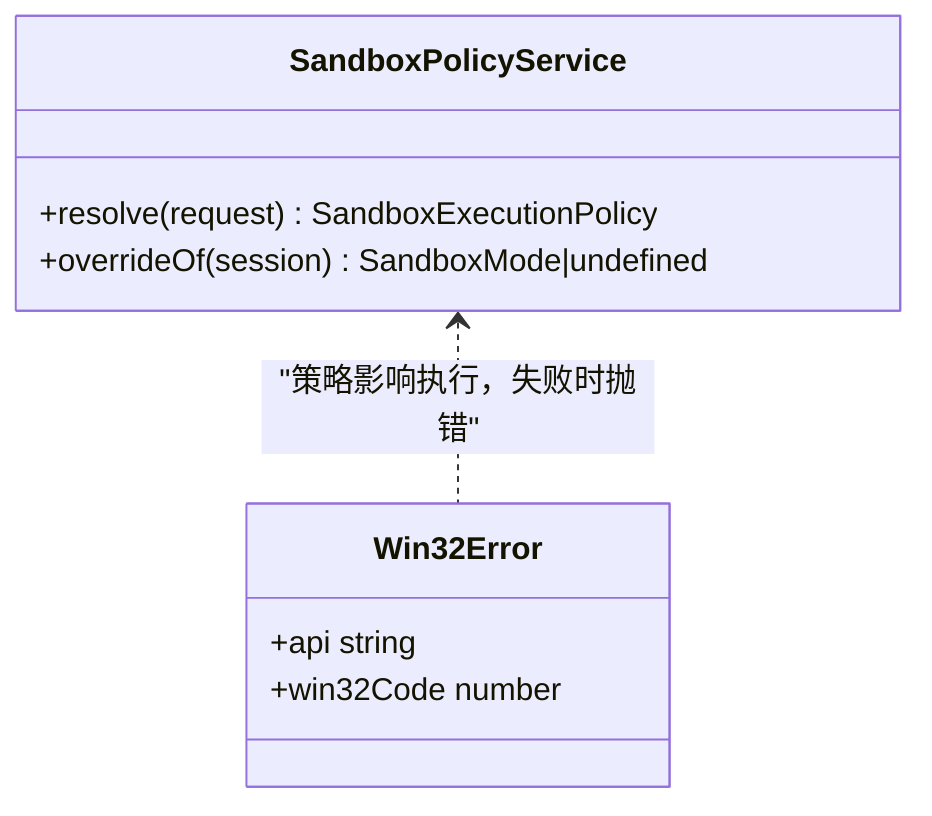
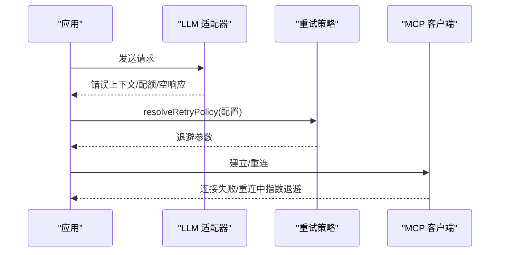
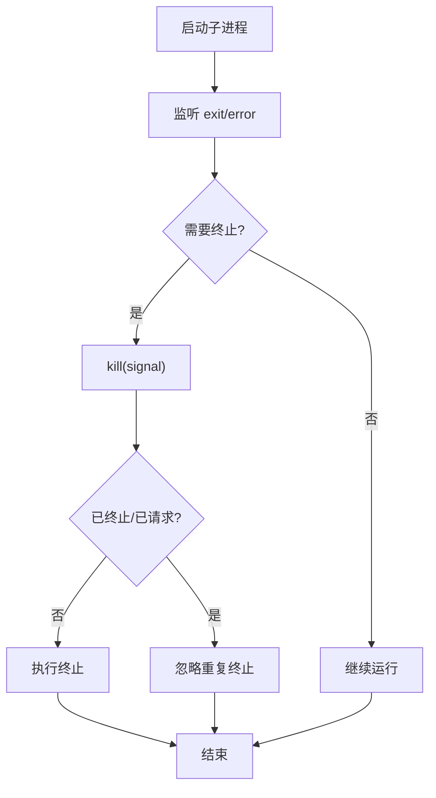
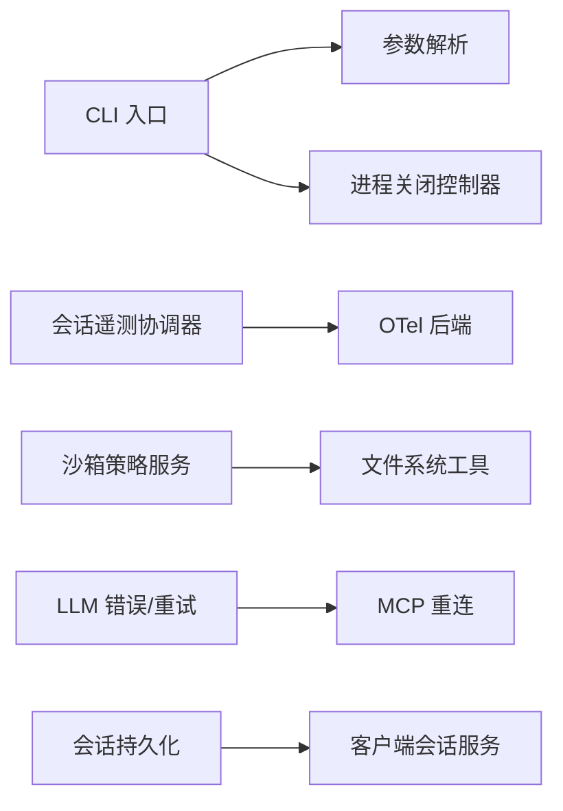

# 运行时错误

<cite>
**本文引用的文件**
- [bin.ts](file://apps/cli/src/bin.ts)
- [process-shutdown.ts](file://apps/cli/src/process-shutdown.ts)
- [args.ts](file://apps/cli/src/args.ts)
- [index.ts（沙箱策略）](file://packages/sandbox/sandbox-policy/src/index.ts)
- [README.md（沙箱策略）](file://packages/sandbox/sandbox-policy/README.md)
- [error.ts（文件系统工具）](file://packages/fs/tool-fs/src/error.ts)
- [error.ts（LLM 基础错误）](file://packages/llm/llm/src/error.ts)
- [retry-policy.ts（重试策略）](file://packages/llm/llm/src/retry-policy.ts)
- [connection.ts（MCP 重连策略）](file://packages/mcp/mcp-client/src/connection.ts)
- [coordinator.ts（会话遥测协调器）](file://packages/session/session-telemetry/src/coordinator.ts)
- [index.ts（OpenTelemetry 后端）](file://packages/session/session-telemetry-otel/src/index.ts)
- [service.ts（客户端会话服务）](file://packages/client/runtime/src/client/sessions/service.ts)
- [coordinator.ts（会话持久化协调器）](file://packages/session/session-persistence/src/coordinator.ts)
- [persistence.spec.ts（持久化测试）](file://packages/session/session-persistence/tests/persistence.spec.ts)
- [errors.ts（Windows ACL 错误）](file://packages/sandbox/sandbox-windows-acl/src/errors.ts)
- [process.ts（子进程生命周期）](file://packages/subagent/subagent-claude-code/src/process.ts)
- [telemetry-switch.spec.ts（遥测开关）](file://apps/cli/tests/telemetry-switch.spec.ts)
- [lazy-search-startup.compat.spec.ts（Web CLI 冒烟）](file://apps/cli/tests/lazy-search-startup.compat.spec.ts)
</cite>

## 目录
1. [简介](#简介)
2. [项目结构](#项目结构)
3. [核心组件](#核心组件)
4. [架构总览](#架构总览)
5. [详细组件分析](#详细组件分析)
6. [依赖关系分析](#依赖关系分析)
7. [性能与稳定性考量](#性能与稳定性考量)
8. [故障排查指南](#故障排查指南)
9. [结论](#结论)
10. [附录](#附录)

## 简介
本指南聚焦运行时错误的定位与修复，覆盖 Agent 执行异常、会话状态错误、工具调用失败、沙箱执行错误等典型场景，并补充内存泄漏、进程崩溃、网络超时、文件访问权限等问题的诊断方法。文档同时给出不同运行模式（CLI、Web、无头模式）下的特定处理方案，以及日志分析方法、性能监控与调试技巧。

## 项目结构
- CLI 入口与进程关闭：命令行入口负责解析参数并分发到不同模式；统一的进程关闭控制器提供有界、可升级的优雅退出机制。
- 会话与遥测：会话层提供事件采集与上报，支持本地丢弃或远端导出；协调器负责订阅会话生命周期并在终止时记录关闭标记。
- 沙箱与策略：沙箱策略服务集中解析每会话的执行模式与工作区根，供文件系统、一次性 Bash、终端等后端统一读取。
- 工具与子系统：文件系统工具对受保护写入的错误进行“可恢复”提示增强；LLM 层提供统一错误基类与上下文窗口/配额超限识别；MCP 客户端具备重连策略。
- 持久化与会话清理：会话持久化在创建/销毁时维护状态；客户端会话服务在阶段迁移时清理延迟移除的副作用。

**图表来源**
- [bin.ts:1-54](file://apps/cli/src/bin.ts#L1-L54)
- [args.ts:147-169](file://apps/cli/src/args.ts#L147-L169)
- [process-shutdown.ts:1-78](file://apps/cli/src/process-shutdown.ts#L1-L78)
- [coordinator.ts（会话遥测）:45-70](file://packages/session/session-telemetry/src/coordinator.ts#L45-L70)
- [index.ts（OTel 后端）:141-168](file://packages/session/session-telemetry-otel/src/index.ts#L141-L168)
- [index.ts（沙箱策略）:1-154](file://packages/sandbox/sandbox-policy/src/index.ts#L1-L154)
- [error.ts（文件系统工具）:1-35](file://packages/fs/tool-fs/src/error.ts#L1-L35)
- [error.ts（LLM 基础错误）:1-164](file://packages/llm/llm/src/error.ts#L1-L164)
- [retry-policy.ts:123-156](file://packages/llm/llm/src/retry-policy.ts#L123-L156)
- [connection.ts:55-225](file://packages/mcp/mcp-client/src/connection.ts#L55-L225)
- [coordinator.ts（持久化）:1153-1182](file://packages/session/session-persistence/src/coordinator.ts#L1153-L1182)
- [service.ts:768-791](file://packages/client/runtime/src/client/sessions/service.ts#L768-L791)

**章节来源**
- [bin.ts:1-54](file://apps/cli/src/bin.ts#L1-L54)
- [args.ts:147-169](file://apps/cli/src/args.ts#L147-L169)
- [process-shutdown.ts:1-78](file://apps/cli/src/process-shutdown.ts#L1-L78)

## 核心组件
- 进程关闭控制器：为 CLI/Web/Headless 提供统一的优雅退出与强制退出边界，避免遥测导出阻塞导致进程无法退出。
- 会话遥测协调器：在会话创建/销毁时注册监听，确保关闭事件被捕获并上报；后端支持禁用模式，仅本地告警。
- 沙箱策略服务：集中解析 per-session 的沙箱模式与工作区根，保证文件系统、Shell、终端等后端一致执行策略。
- 工具错误增强：对文件系统受保护写入错误附加“可恢复”操作建议，便于上层重试或 UI 引导。
- LLM 错误与重试：统一错误基类、上下文窗口/配额超限识别、退避重试策略校验。
- MCP 重连策略：连接丢失或建立失败时按指数退避重试，定时器不阻止进程退出。
- 会话持久化与清理：会话创建/销毁时的序列化与状态回收，防止资源泄漏。

**章节来源**
- [process-shutdown.ts:1-78](file://apps/cli/src/process-shutdown.ts#L1-L78)
- [coordinator.ts（会话遥测）:45-70](file://packages/session/session-telemetry/src/coordinator.ts#L45-L70)
- [index.ts（OTel 后端）:141-168](file://packages/session/session-telemetry-otel/src/index.ts#L141-L168)
- [index.ts（沙箱策略）:1-154](file://packages/sandbox/sandbox-policy/src/index.ts#L1-L154)
- [error.ts（文件系统工具）:1-35](file://packages/fs/tool-fs/src/error.ts#L1-L35)
- [error.ts（LLM 基础错误）:1-164](file://packages/llm/llm/src/error.ts#L1-L164)
- [retry-policy.ts:123-156](file://packages/llm/llm/src/retry-policy.ts#L123-L156)
- [connection.ts:55-225](file://packages/mcp/mcp-client/src/connection.ts#L55-L225)
- [coordinator.ts（持久化）:1153-1182](file://packages/session/session-persistence/src/coordinator.ts#L1153-L1182)
- [service.ts:768-791](file://packages/client/runtime/src/client/sessions/service.ts#L768-L791)

## 架构总览
下图展示从 CLI 启动到会话执行、工具调用、沙箱策略、网络请求与遥测上报的关键路径，以及错误在何处被捕获、分类与上报。

**图表来源**
- [bin.ts:1-54](file://apps/cli/src/bin.ts#L1-L54)
- [process-shutdown.ts:1-78](file://apps/cli/src/process-shutdown.ts#L1-L78)
- [coordinator.ts（会话遥测）:45-70](file://packages/session/session-telemetry/src/coordinator.ts#L45-L70)
- [index.ts（OTel 后端）:141-168](file://packages/session/session-telemetry-otel/src/index.ts#L141-L168)
- [index.ts（沙箱策略）:1-154](file://packages/sandbox/sandbox-policy/src/index.ts#L1-L154)
- [error.ts（文件系统工具）:1-35](file://packages/fs/tool-fs/src/error.ts#L1-L35)
- [error.ts（LLM 基础错误）:1-164](file://packages/llm/llm/src/error.ts#L1-L164)
- [connection.ts:55-225](file://packages/mcp/mcp-client/src/connection.ts#L55-L225)

## 详细组件分析

### 进程关闭与信号处理（CLI/Web/Headless）
- 行为要点
  - 首次信号触发优雅退出，设置 5 秒强制退出兜底；重复信号立即强制退出。
  - 正常完成通过设置退出码让 Node 自然排空句柄，避免 Windows 下 libuv 断言问题。
  - 遥测导出阻塞会导致优雅退出无限等待，需通过环境变量禁用遥测以快速定位。
- 常见症状
  - Headless 打印观察 URL 后卡死，Ctrl+C 无效；设置遥测禁用后恢复正常。
  - Web 模式下 SIGTERM 优雅退出，SIGINT 强制退出。
- 排查步骤
  - 检查是否启用了遥测；若怀疑导出阻塞，临时禁用遥测验证。
  - 使用进程关闭控制器的测试用例思路，模拟长时间 dispose 并验证强制退出。
  - 确认信号处理只安装一次，避免重复闩锁导致无法退出。

**图表来源**
- [process-shutdown.ts:1-78](file://apps/cli/src/process-shutdown.ts#L1-L78)
- [telemetry-switch.spec.ts:1-22](file://apps/cli/tests/telemetry-switch.spec.ts#L1-L22)
- [lazy-search-startup.compat.spec.ts:46-89](file://apps/cli/tests/lazy-search-startup.compat.spec.ts#L46-L89)

**章节来源**
- [process-shutdown.ts:1-78](file://apps/cli/src/process-shutdown.ts#L1-L78)
- [telemetry-switch.spec.ts:1-22](file://apps/cli/tests/telemetry-switch.spec.ts#L1-L22)
- [lazy-search-startup.compat.spec.ts:46-89](file://apps/cli/tests/lazy-search-startup.compat.spec.ts#L46-L89)

### 会话状态与持久化
- 行为要点
  - 会话创建时初始化持久化状态，销毁时刷新并回收 live 集合与状态映射。
  - 客户端会话服务在阶段迁移时清理延迟移除的作用域，防止资源泄漏。
- 常见症状
  - 会话删除后仍有残留作用域或存储项，导致内存增长。
  - 非 JSON 可序列化的元数据导致创建失败。
- 排查步骤
  - 检查会话销毁流程是否调用 flush 与 retireCore。
  - 验证客户端会话服务的 sweepDeferred 是否按预期清理。
  - 对非法元数据进行断言，确保创建前校验。

**图表来源**
- [coordinator.ts（持久化）:1153-1182](file://packages/session/session-persistence/src/coordinator.ts#L1153-L1182)
- [service.ts:768-791](file://packages/client/runtime/src/client/sessions/service.ts#L768-L791)
- [persistence.spec.ts:1800-1835](file://packages/session/session-persistence/tests/persistence.spec.ts#L1800-L1835)

**章节来源**
- [coordinator.ts（持久化）:1153-1182](file://packages/session/session-persistence/src/coordinator.ts#L1153-L1182)
- [service.ts:768-791](file://packages/client/runtime/src/client/sessions/service.ts#L768-L791)
- [persistence.spec.ts:1800-1835](file://packages/session/session-persistence/tests/persistence.spec.ts#L1800-L1835)

### 工具调用失败与文件系统错误
- 行为要点
  - 文件系统工具对受保护写入错误附加“可恢复”建议（如重新读取后重试）。
  - 错误保留原始 code，便于上层路由重试或 UI 提示。
- 常见症状
  - 编辑/写入失败，提示文件版本陈旧或未观测到变更。
- 排查步骤
  - 捕获 FsError 并检查 code，根据建议重新读取后再尝试。
  - 结合沙箱策略确认当前工作区根与模式是否为只读。

**图表来源**
- [error.ts（文件系统工具）:1-35](file://packages/fs/tool-fs/src/error.ts#L1-L35)
- [index.ts（沙箱策略）:1-154](file://packages/sandbox/sandbox-policy/src/index.ts#L1-L154)

**章节来源**
- [error.ts（文件系统工具）:1-35](file://packages/fs/tool-fs/src/error.ts#L1-L35)
- [index.ts（沙箱策略）:1-154](file://packages/sandbox/sandbox-policy/src/index.ts#L1-L154)

### 沙箱执行错误与权限
- 行为要点
  - 沙箱策略服务解析 per-session 模式与工作区根，所有执行后端统一读取。
  - Windows ACL 错误封装 Win32 错误码，防止 fail-open 的安全风险。
- 常见症状
  - 只读模式下写入失败；Windows 平台安全 API 调用失败。
- 排查步骤
  - 检查会话事件中的 sandbox/mode 覆盖是否生效。
  - 对 Windows 平台错误，查看 Win32 错误码并定位具体 API。

**图表来源**
- [index.ts（沙箱策略）:1-154](file://packages/sandbox/sandbox-policy/src/index.ts#L1-L154)
- [errors.ts（Windows ACL 错误）:1-22](file://packages/sandbox/sandbox-windows-acl/src/errors.ts#L1-L22)

**章节来源**
- [index.ts（沙箱策略）:1-154](file://packages/sandbox/sandbox-policy/src/index.ts#L1-L154)
- [errors.ts（Windows ACL 错误）:1-22](file://packages/sandbox/sandbox-windows-acl/src/errors.ts#L1-L22)

### 网络超时与重连（LLM/MCP）
- 行为要点
  - LLM 层提供统一错误基类与上下文窗口/配额超限识别；重试策略支持退避与抖动。
  - MCP 客户端在连接丢失或建立失败时按指数退避重试，定时器不阻止进程退出。
- 常见症状
  - 模型请求因上下文过长被拒绝；账户配额耗尽；MCP 连接不稳定。
- 排查步骤
  - 使用错误识别函数判断上下文窗口/配额问题，调整输入或切换模型。
  - 校验重试策略配置（初始延迟、最大延迟、抖动比例），避免过大或非法值。
  - 观察 MCP 重连日志，确认未持有进程句柄的重连定时器。

**图表来源**
- [error.ts（LLM 基础错误）:1-164](file://packages/llm/llm/src/error.ts#L1-L164)
- [retry-policy.ts:123-156](file://packages/llm/llm/src/retry-policy.ts#L123-L156)
- [connection.ts:55-225](file://packages/mcp/mcp-client/src/connection.ts#L55-L225)

**章节来源**
- [error.ts（LLM 基础错误）:1-164](file://packages/llm/llm/src/error.ts#L1-L164)
- [retry-policy.ts:123-156](file://packages/llm/llm/src/retry-policy.ts#L123-L156)
- [connection.ts:55-225](file://packages/mcp/mcp-client/src/connection.ts#L55-L225)

### 子进程与代理生命周期
- 行为要点
  - 子进程对象暴露 exitCode/signalCode，并提供 kill 方法将终止请求路由到树级所有者。
  - 已终止或已请求终止的子进程不再接受新的 kill。
- 常见症状
  - 子进程未正确退出；重复终止无效。
- 排查步骤
  - 监听 exit/error 事件，确认退出码与信号。
  - 检查 kill 调用时机，避免重复或无效终止。

**图表来源**
- [process.ts:111-170](file://packages/subagent/subagent-claude-code/src/process.ts#L111-L170)

**章节来源**
- [process.ts:111-170](file://packages/subagent/subagent-claude-code/src/process.ts#L111-L170)

## 依赖关系分析
- CLI 入口依赖参数解析与进程关闭控制器，确保各模式稳定启动与退出。
- 会话遥测协调器依赖后端实现（OTel），在禁用模式下仅本地告警。
- 沙箱策略服务为文件系统、Shell、终端等后端提供统一策略解析。
- LLM 错误与重试策略为网络请求提供健壮性；MCP 重连策略保障外部服务可用性。
- 会话持久化与客户端会话服务共同维护会话状态与资源清理。

**图表来源**
- [bin.ts:1-54](file://apps/cli/src/bin.ts#L1-L54)
- [args.ts:147-169](file://apps/cli/src/args.ts#L147-L169)
- [process-shutdown.ts:1-78](file://apps/cli/src/process-shutdown.ts#L1-L78)
- [coordinator.ts（会话遥测）:45-70](file://packages/session/session-telemetry/src/coordinator.ts#L45-L70)
- [index.ts（OTel 后端）:141-168](file://packages/session/session-telemetry-otel/src/index.ts#L141-L168)
- [index.ts（沙箱策略）:1-154](file://packages/sandbox/sandbox-policy/src/index.ts#L1-L154)
- [error.ts（文件系统工具）:1-35](file://packages/fs/tool-fs/src/error.ts#L1-L35)
- [error.ts（LLM 基础错误）:1-164](file://packages/llm/llm/src/error.ts#L1-L164)
- [retry-policy.ts:123-156](file://packages/llm/llm/src/retry-policy.ts#L123-L156)
- [connection.ts:55-225](file://packages/mcp/mcp-client/src/connection.ts#L55-L225)
- [coordinator.ts（持久化）:1153-1182](file://packages/session/session-persistence/src/coordinator.ts#L1153-L1182)
- [service.ts:768-791](file://packages/client/runtime/src/client/sessions/service.ts#L768-L791)

**章节来源**
- [bin.ts:1-54](file://apps/cli/src/bin.ts#L1-L54)
- [args.ts:147-169](file://apps/cli/src/args.ts#L147-L169)
- [process-shutdown.ts:1-78](file://apps/cli/src/process-shutdown.ts#L1-L78)
- [coordinator.ts（会话遥测）:45-70](file://packages/session/session-telemetry/src/coordinator.ts#L45-L70)
- [index.ts（OTel 后端）:141-168](file://packages/session/session-telemetry-otel/src/index.ts#L141-L168)
- [index.ts（沙箱策略）:1-154](file://packages/sandbox/sandbox-policy/src/index.ts#L1-L154)
- [error.ts（文件系统工具）:1-35](file://packages/fs/tool-fs/src/error.ts#L1-L35)
- [error.ts（LLM 基础错误）:1-164](file://packages/llm/llm/src/error.ts#L1-L164)
- [retry-policy.ts:123-156](file://packages/llm/llm/src/retry-policy.ts#L123-L156)
- [connection.ts:55-225](file://packages/mcp/mcp-client/src/connection.ts#L55-L225)
- [coordinator.ts（持久化）:1153-1182](file://packages/session/session-persistence/src/coordinator.ts#L1153-L1182)
- [service.ts:768-791](file://packages/client/runtime/src/client/sessions/service.ts#L768-L791)

## 性能与稳定性考量
- 优雅退出边界：5 秒强制退出兜底，避免遥测导出阻塞导致进程无法退出。
- 重试与退避：LLM 与 MCP 均提供退避策略，避免雪崩与资源争用。
- 资源清理：会话持久化与客户端会话服务在销毁时及时释放作用域与存储，防止内存泄漏。
- 沙箱策略一致性：统一解析策略，减少不一致导致的额外重试与错误。

[本节为通用指导，无需特定文件引用]

## 故障排查指南

### 通用日志分析方法
- 优先依据错误代码而非消息文本进行路由与分类。
- 使用错误链渲染工具输出完整 cause 链，避免包装错误掩盖底层原因。
- 对会话事件进行回放，重建运行时上下文快照，复现策略与权限。

**章节来源**
- [error.ts（LLM 基础错误）:102-164](file://packages/llm/llm/src/error.ts#L102-L164)
- [coordinator.ts（会话遥测）:45-70](file://packages/session/session-telemetry/src/coordinator.ts#L45-L70)
- [README.md（沙箱策略）:25-43](file://packages/sandbox/sandbox-policy/README.md#L25-L43)

### Agent 执行异常
- 现象：Agent 循环中出现错误，会话事件包含 agent-error。
- 排查：检查会话遥测协调器是否正确订阅 agent/error；确认后端启用且可导出。
- 处理：根据错误类型调整输入或重试策略；必要时降级或中断。

**章节来源**
- [coordinator.ts（会话遥测）:45-70](file://packages/session/session-telemetry/src/coordinator.ts#L45-L70)
- [index.ts（OTel 后端）:141-168](file://packages/session/session-telemetry-otel/src/index.ts#L141-L168)

### 会话状态错误
- 现象：会话创建/销毁异常，或状态不一致。
- 排查：检查持久化协调器的 onCreated/retireCore；确认客户端会话服务 sweepDeferred 清理。
- 处理：修正元数据格式；确保销毁流程完整。

**章节来源**
- [coordinator.ts（持久化）:1153-1182](file://packages/session/session-persistence/src/coordinator.ts#L1153-L1182)
- [service.ts:768-791](file://packages/client/runtime/src/client/sessions/service.ts#L768-L791)
- [persistence.spec.ts:1800-1835](file://packages/session/session-persistence/tests/persistence.spec.ts#L1800-L1835)

### 工具调用失败
- 现象：文件系统写入/编辑失败，提示版本陈旧或未观测。
- 排查：捕获 FsError 并检查 code；根据建议重新读取后重试。
- 处理：结合沙箱策略确认工作区根与模式。

**章节来源**
- [error.ts（文件系统工具）:1-35](file://packages/fs/tool-fs/src/error.ts#L1-L35)
- [index.ts（沙箱策略）:1-154](file://packages/sandbox/sandbox-policy/src/index.ts#L1-L154)

### 沙箱执行错误
- 现象：只读模式写入失败；Windows ACL 调用失败。
- 排查：检查 sandbox/mode 事件与工作区根；查看 Win32 错误码。
- 处理：调整模式或权限；修复安全 API 调用。

**章节来源**
- [index.ts（沙箱策略）:1-154](file://packages/sandbox/sandbox-policy/src/index.ts#L1-L154)
- [errors.ts（Windows ACL 错误）:1-22](file://packages/sandbox/sandbox-windows-acl/src/errors.ts#L1-L22)

### 网络超时与重连
- 现象：模型请求失败（上下文窗口/配额/空响应）；MCP 连接不稳定。
- 排查：使用错误识别函数判断上下文/配额问题；校验重试策略配置；观察 MCP 重连日志。
- 处理：调整输入长度或模型；优化重试参数；确保重连定时器不阻塞进程。

**章节来源**
- [error.ts（LLM 基础错误）:24-100](file://packages/llm/llm/src/error.ts#L24-L100)
- [retry-policy.ts:123-156](file://packages/llm/llm/src/retry-policy.ts#L123-L156)
- [connection.ts:55-225](file://packages/mcp/mcp-client/src/connection.ts#L55-L225)

### 内存泄漏与进程崩溃
- 现象：内存持续增长；进程无法正常退出。
- 排查：检查会话销毁流程与作用域清理；确认遥测导出不阻塞；验证子进程终止逻辑。
- 处理：完善 dispose 流程；禁用遥测验证；确保 kill 调用有效且不重复。

**章节来源**
- [service.ts:768-791](file://packages/client/runtime/src/client/sessions/service.ts#L768-L791)
- [process-shutdown.ts:1-78](file://apps/cli/src/process-shutdown.ts#L1-L78)
- [process.ts:111-170](file://packages/subagent/subagent-claude-code/src/process.ts#L111-L170)

### 不同运行模式的特定处理
- CLI
  - 参数解析错误由 Commander 直接打印并退出；避免自定义解析导致误路由。
  - 优雅退出与信号处理统一通过进程关闭控制器管理。
- Web
  - 启动后输出绑定 URL；SIGTERM 优雅退出，SIGINT 强制退出。
  - 开发模式下 HMR 与静态资源更新需确保服务可替换。
- Headless
  - 正常完成保持退出码语义；遥测阻塞可能导致无法退出，需禁用遥测验证。

**章节来源**
- [args.ts:147-169](file://apps/cli/src/args.ts#L147-L169)
- [bin.ts:1-54](file://apps/cli/src/bin.ts#L1-L54)
- [lazy-search-startup.compat.spec.ts:46-89](file://apps/cli/tests/lazy-search-startup.compat.spec.ts#L46-L89)
- [telemetry-switch.spec.ts:1-22](file://apps/cli/tests/telemetry-switch.spec.ts#L1-L22)

## 结论
本指南围绕运行时错误的定位与修复，提供了从 CLI 启动、会话管理、工具调用、沙箱策略、网络请求到进程关闭的全链路排查方法。通过统一错误分类、可恢复建议、重试与重连策略、以及有界优雅退出，系统能够在复杂环境下保持稳定与可观测。实际排查时，应优先依据错误代码与事件回放，结合遥测与日志逐步缩小范围，最终定位并解决问题。

## 附录
- 常用错误代码参考：CONTEXT_WINDOW_EXCEEDED、QUOTA、EMPTY_RESPONSE、INVALID_CREDENTIAL。
- 沙箱模式：read-only 等模式通过事件折叠与部署默认值解析，确保一致执行。
- 进程退出码：Headless 正常完成 0，业务错误 1，SIGINT 130，SIGTERM 143；Web 保持既有行为。

[本节为补充信息，无需特定文件引用]