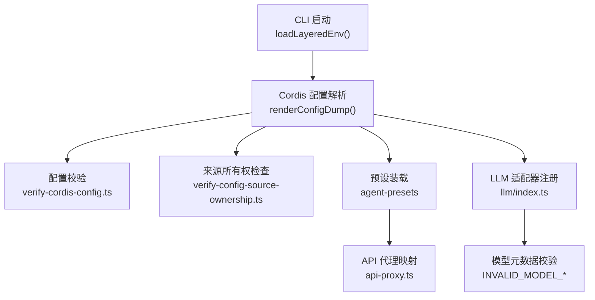
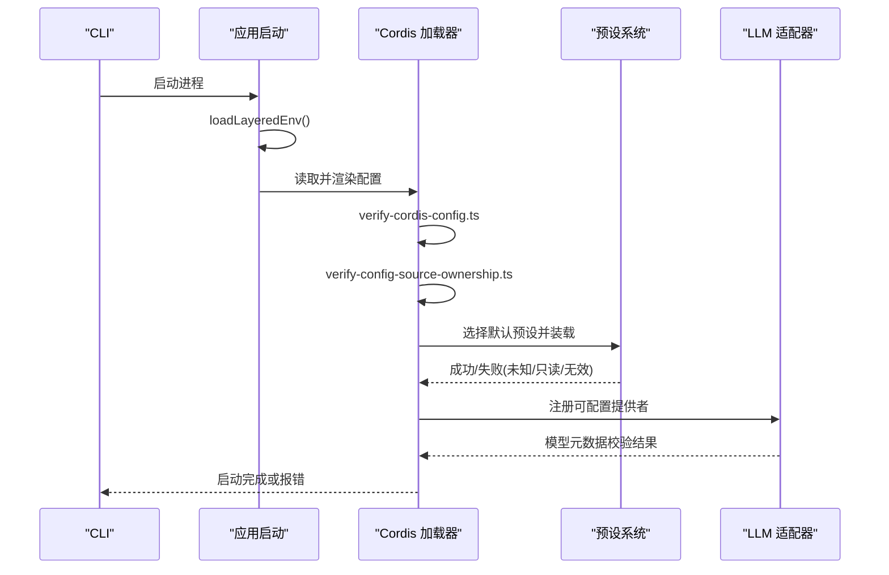
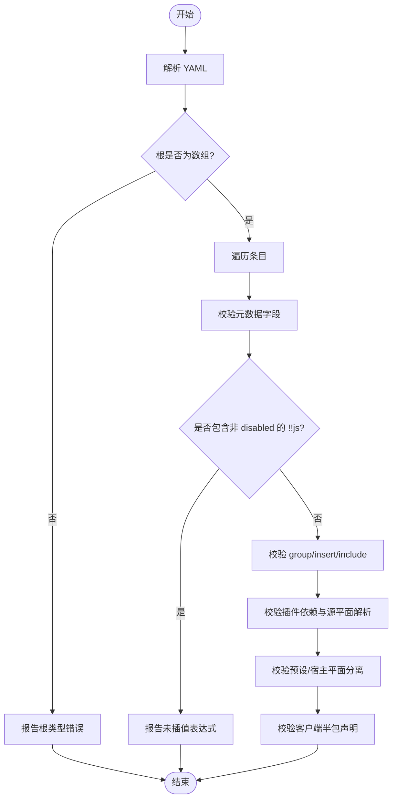
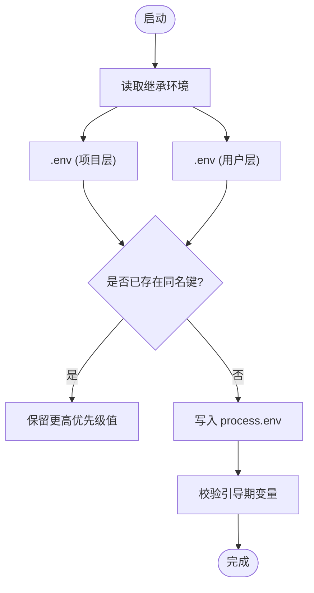
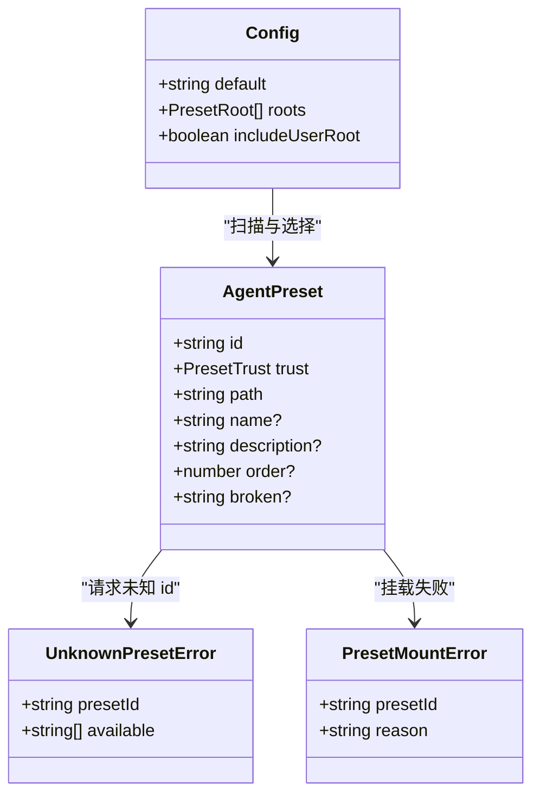
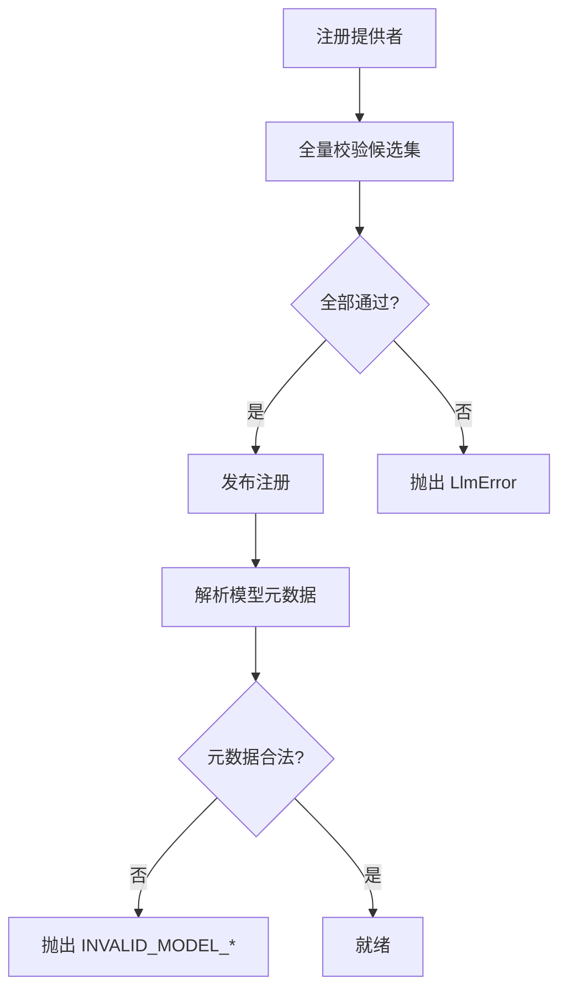
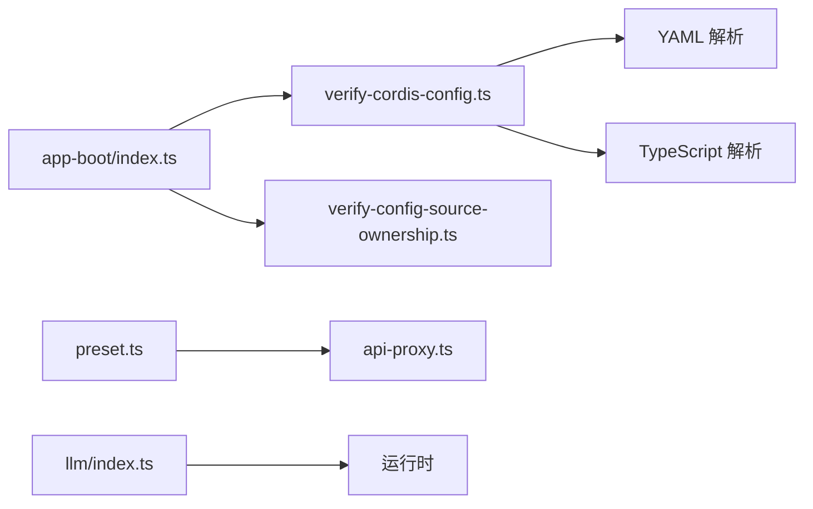

# 配置问题

<cite>
**本文引用的文件**
- [verify-cordis-config.ts](file://scripts/verify-cordis-config.ts)
- [verify-config-source-ownership.ts](file://scripts/verify-config-source-ownership.ts)
- [app-boot/index.ts](file://packages/boot/app-boot/src/index.ts)
- [preset.ts](file://packages/preset/agent-presets/src/preset.ts)
- [api-proxy.ts](file://packages/host/apiproxy/src/api-proxy.ts)
- [llm/index.ts](file://packages/llm/llm/src/index.ts)
- [agent.cordis.yml（code 预设）](file://apps/cli/config/agent-presets/code/agent.cordis.yml)
- [cordis.yml（ACP 示例）](file://examples/acp-agent/cordis.yml)
- [invalid-provider.cordis.yml](file://apps/cli/tests/fixtures/invalid-provider.cordis.yml)
- [fiber.md](file://docs/cordis-api/fiber.md)
</cite>

## 目录
1. [简介](#简介)
2. [项目结构](#项目结构)
3. [核心组件](#核心组件)
4. [架构总览](#架构总览)
5. [详细组件分析](#详细组件分析)
6. [依赖关系分析](#依赖关系分析)
7. [性能考虑](#性能考虑)
8. [故障排查指南](#故障排查指南)
9. [结论](#结论)
10. [附录](#附录)

## 简介
本指南聚焦于 Cordis 配置问题的定位与修复，覆盖以下常见问题：
- cordis.yml 配置文件语法错误、字段类型错误、表达式使用不当
- 环境变量设置问题（优先级、注入位置、敏感信息泄露）
- Agent 预设配置错误（默认预设缺失、预设不可用、权限与隔离域不匹配）
- LLM 提供商配置失败（模型元数据非法、路由冲突、凭据解析失败）
- 配置验证失败、配置项冲突、权限策略配置不当等场景
并提供正确格式示例路径、配置项说明、调试方法与不同场景下的最佳实践。

## 项目结构
与配置相关的关键位置：
- 配置校验脚本：scripts/verify-cordis-config.ts、scripts/verify-config-source-ownership.ts
- 启动与环境加载：packages/boot/app-boot/src/index.ts
- 预设系统：packages/preset/agent-presets/src/preset.ts、packages/host/apiproxy/src/api-proxy.ts
- LLM 运行时与错误：packages/llm/llm/src/index.ts
- 示例与预设：apps/cli/config/agent-presets/*/agent.cordis.yml、examples/acp-agent/cordis.yml
- 文档与错误定义：docs/cordis-api/fiber.md

**图表来源**
- [app-boot/index.ts:166-191](file://packages/boot/app-boot/src/index.ts#L166-L191)
- [app-boot/index.ts:367-397](file://packages/boot/app-boot/src/index.ts#L367-L397)
- [verify-cordis-config.ts:69-99](file://scripts/verify-cordis-config.ts#L69-L99)
- [verify-config-source-ownership.ts:25-56](file://scripts/verify-config-source-ownership.ts#L25-L56)
- [preset.ts:51-93](file://packages/preset/agent-presets/src/preset.ts#L51-L93)
- [api-proxy.ts:993-1026](file://packages/host/apiproxy/src/api-proxy.ts#L993-L1026)
- [llm/index.ts:423-440](file://packages/llm/llm/src/index.ts#L423-L440)
- [llm/index.ts:657-689](file://packages/llm/llm/src/index.ts#L657-L689)

**章节来源**
- [verify-cordis-config.ts:69-99](file://scripts/verify-cordis-config.ts#L69-L99)
- [verify-config-source-ownership.ts:25-56](file://scripts/verify-config-source-ownership.ts#L25-L56)
- [app-boot/index.ts:166-191](file://packages/boot/app-boot/src/index.ts#L166-L191)
- [app-boot/index.ts:367-397](file://packages/boot/app-boot/src/index.ts#L367-L397)

## 核心组件
- 配置解析与渲染：在启动阶段读取并渲染配置，输出带来源注释的 YAML，便于定位覆盖来源。
- 配置校验：对 Loader 条目进行静态校验，包括根节点类型、嵌套 group/insert、插件引用、表达式合法性、源平面解析、预设与宿主平面分离等。
- 来源所有权检查：禁止在随附配置中内联敏感或端点环境变量，强制通过受管凭据层与启动环境快照解析。
- 预设系统：管理默认预设、扫描根目录、信任级别、挂载失败诊断；会话创建时固定组合，避免切换导致工具调用不一致。
- LLM 适配器：提供可配置提供者注册、模型元数据校验、错误标准化与稳定错误码。

**章节来源**
- [app-boot/index.ts:367-397](file://packages/boot/app-boot/src/index.ts#L367-L397)
- [verify-cordis-config.ts:173-231](file://scripts/verify-cordis-config.ts#L173-L231)
- [verify-config-source-ownership.ts:25-56](file://scripts/verify-config-source-ownership.ts#L25-L56)
- [preset.ts:51-93](file://packages/preset/agent-presets/src/preset.ts#L51-L93)
- [api-proxy.ts:993-1026](file://packages/host/apiproxy/src/api-proxy.ts#L993-L1026)
- [llm/index.ts:423-440](file://packages/llm/llm/src/index.ts#L423-L440)
- [llm/index.ts:657-689](file://packages/llm/llm/src/index.ts#L657-L689)

## 架构总览
配置从 CLI 启动到运行时的关键流程如下：
1. 加载分层环境变量（继承 > 项目 .env > 用户 .env），拒绝引导期变量出现在文件中。
2. 读取并渲染配置，生成带来源注释的 YAML，便于追踪覆盖来源。
3. 执行配置校验：语法、表达式、插件解析、源平面、预设平面分离、客户端半包声明一致性。
4. 执行来源所有权检查：禁止内联敏感或端点环境变量。
5. 装载预设：根据默认预设与可用根目录构建可用列表，会话创建后固定组合。
6. 注册 LLM 适配器：校验提供者配置与模型元数据，抛出稳定错误码。

**图表来源**
- [app-boot/index.ts:166-191](file://packages/boot/app-boot/src/index.ts#L166-L191)
- [app-boot/index.ts:367-397](file://packages/boot/app-boot/src/index.ts#L367-L397)
- [verify-cordis-config.ts:69-99](file://scripts/verify-cordis-config.ts#L69-L99)
- [verify-config-source-ownership.ts:25-56](file://scripts/verify-config-source-ownership.ts#L25-L56)
- [preset.ts:51-93](file://packages/preset/agent-presets/src/preset.ts#L51-L93)
- [api-proxy.ts:993-1026](file://packages/host/apiproxy/src/api-proxy.ts#L993-L1026)
- [llm/index.ts:423-440](file://packages/llm/llm/src/index.ts#L423-L440)
- [llm/index.ts:657-689](file://packages/llm/llm/src/index.ts#L657-L689)

## 详细组件分析

### 配置校验与表达式规则
- 根节点必须为 Loader 条目数组；每个条目需为对象。
- 仅 disabled 字段允许 !!js 表达式；其他元数据字段必须静态。
- 支持 group/insert 递归校验；include 补丁行也需校验。
- 示例与应用覆写文件的插件依赖必须声明在对应 manifest 中。
- 本地工作区包必须通过 tsconfig paths 解析到源码，而非 lib 产物。
- 预设与宿主平面不得重复激活同一行；浏览器客户端半包需声明一致。

**图表来源**
- [verify-cordis-config.ts:69-99](file://scripts/verify-cordis-config.ts#L69-L99)
- [verify-cordis-config.ts:173-231](file://scripts/verify-cordis-config.ts#L173-L231)
- [verify-cordis-config.ts:237-340](file://scripts/verify-cordis-config.ts#L237-L340)
- [verify-cordis-config.ts:416-485](file://scripts/verify-cordis-config.ts#L416-L485)

**章节来源**
- [verify-cordis-config.ts:69-99](file://scripts/verify-cordis-config.ts#L69-L99)
- [verify-cordis-config.ts:173-231](file://scripts/verify-cordis-config.ts#L173-L231)
- [verify-cordis-config.ts:237-340](file://scripts/verify-cordis-config.ts#L237-L340)
- [verify-cordis-config.ts:416-485](file://scripts/verify-cordis-config.ts#L416-L485)

### 环境变量与凭据优先级
- 非敏感配置优先级：显式运行参数 > 用户设置 > 组合（profile/patch/--patch）> 当前 shell 继承 > 发现文件（项目 .env、用户 .env）> 默认值。
- 凭据优先级：继承进程环境（只读且最高）> $DSH_HOME/.credentials.yaml（受管、可写）> 项目 .env > 用户 .env。
- 引导期变量不允许出现在 .env 文件中；若出现将拒绝应用。
- 启动时先解析两层 .env，再应用，确保不会部分生效。

**图表来源**
- [app-boot/index.ts:166-191](file://packages/boot/app-boot/src/index.ts#L166-L191)

**章节来源**
- [app-boot/index.ts:166-191](file://packages/boot/app-boot/src/index.ts#L166-L191)

### 预设配置与错误映射
- 默认预设必须在配置中声明；不存在则挂载失败。
- 预设根目录按顺序扫描，前者优先覆盖相同 id。
- 会话创建时固定组合，后续切换预设会报错（避免工具调用不一致）。
- API 代理将预设错误映射为稳定代码：未找到、只读、无效、内部错误。

**图表来源**
- [preset.ts:51-93](file://packages/preset/agent-presets/src/preset.ts#L51-L93)
- [api-proxy.ts:993-1026](file://packages/host/apiproxy/src/api-proxy.ts#L993-L1026)

**章节来源**
- [preset.ts:51-93](file://packages/preset/agent-presets/src/preset.ts#L51-L93)
- [api-proxy.ts:993-1026](file://packages/host/apiproxy/src/api-proxy.ts#L993-L1026)

### LLM 提供商配置与错误
- 可配置提供者注册全有或全无；空列表、无效条目或重复 provider 名称会抛出 LlmError。
- 模型元数据校验：defaultMaxTokens 必须为正整数；reasoning.efforts 不能为空；effort.id/name 必须为非空字符串。
- 错误标准化：对外部错误进行安全提取，无法识别时回退为 UNKNOWN。

**图表来源**
- [llm/index.ts:423-440](file://packages/llm/llm/src/index.ts#L423-L440)
- [llm/index.ts:657-689](file://packages/llm/llm/src/index.ts#L657-L689)

**章节来源**
- [llm/index.ts:423-440](file://packages/llm/llm/src/index.ts#L423-L440)
- [llm/index.ts:657-689](file://packages/llm/llm/src/index.ts#L657-L689)

### 配置示例与最佳实践
- 代码模式预设：展示 agent-plane 组合、工具呈现、计划模式、压缩、委托与工作流、Web 工具等。参考路径：[agent.cordis.yml（code 预设）](file://apps/cli/config/agent-presets/code/agent.cordis.yml)
- ACP 自动化示例：展示 DeepSeek 适配器、沙箱策略、子代理、工作流、文件系统策略、钩子等。参考路径：[cordis.yml（ACP 示例）](file://examples/acp-agent/cordis.yml)
- 无效提供商测试用例：用于证明启动失败能收敛并退出。参考路径：[invalid-provider.cordis.yml](file://apps/cli/tests/fixtures/invalid-provider.cordis.yml)

最佳实践要点：
- 仅在 disabled 字段使用 !!js 表达式；其他字段保持静态。
- 不要在内联配置中直接写入 apiKey/baseURL/authToken/headers；通过凭据层与环境快照解析。
- 预设与宿主平面职责清晰：服务注册在宿主，工具呈现与行为在预设。
- 浏览器客户端半包需在 package.json 中声明 dsh.client，并与 exports "./client" 一致。
- 本地工作区包必须通过 tsconfig paths 解析到源码，避免依赖构建产物。

**章节来源**
- [agent.cordis.yml（code 预设）:1-263](file://apps/cli/config/agent-presets/code/agent.cordis.yml#L1-L263)
- [cordis.yml（ACP 示例）:1-193](file://examples/acp-agent/cordis.yml#L1-L193)
- [invalid-provider.cordis.yml:1-8](file://apps/cli/tests/fixtures/invalid-provider.cordis.yml#L1-L8)
- [verify-cordis-config.ts:115-128](file://scripts/verify-cordis-config.ts#L115-L128)
- [verify-cordis-config.ts:291-340](file://scripts/verify-cordis-config.ts#L291-L340)
- [verify-config-source-ownership.ts:25-56](file://scripts/verify-config-source-ownership.ts#L25-L56)

## 依赖关系分析
- 配置校验脚本依赖 YAML 解析与 TypeScript 模块解析，确保插件引用与源平面一致性。
- 启动模块负责环境加载与配置渲染，为后续校验与装载提供基础。
- 预设系统与 API 代理协作，保证会话组合的稳定性和错误映射。
- LLM 适配器与运行时协作，确保模型元数据与错误处理的一致性。

**图表来源**
- [verify-cordis-config.ts:69-99](file://scripts/verify-cordis-config.ts#L69-L99)
- [app-boot/index.ts:166-191](file://packages/boot/app-boot/src/index.ts#L166-L191)
- [verify-config-source-ownership.ts:25-56](file://scripts/verify-config-source-ownership.ts#L25-L56)
- [preset.ts:51-93](file://packages/preset/agent-presets/src/preset.ts#L51-L93)
- [api-proxy.ts:993-1026](file://packages/host/apiproxy/src/api-proxy.ts#L993-L1026)
- [llm/index.ts:423-440](file://packages/llm/llm/src/index.ts#L423-L440)

**章节来源**
- [verify-cordis-config.ts:69-99](file://scripts/verify-cordis-config.ts#L69-L99)
- [app-boot/index.ts:166-191](file://packages/boot/app-boot/src/index.ts#L166-L191)
- [verify-config-source-ownership.ts:25-56](file://scripts/verify-config-source-ownership.ts#L25-L56)
- [preset.ts:51-93](file://packages/preset/agent-presets/src/preset.ts#L51-L93)
- [api-proxy.ts:993-1026](file://packages/host/apiproxy/src/api-proxy.ts#L993-L1026)
- [llm/index.ts:423-440](file://packages/llm/llm/src/index.ts#L423-L440)

## 性能考虑
- 配置渲染与校验在启动阶段执行，建议减少不必要的复杂表达式与深层嵌套，以缩短启动时间。
- 预设与宿主平面分离可减少重复注册与资源竞争，提升多会话并发稳定性。
- LLM 适配器注册采用全量校验后发布，避免部分注册导致的中间状态开销。

## 故障排查指南
常见症状与定位步骤：
- 启动时报错“根必须为 Loader 条目数组”：检查 cordis.yml 顶层是否为数组。参考路径：[verify-cordis-config.ts:69-99](file://scripts/verify-cordis-config.ts#L69-L99)
- 表达式错误“!!js is not interpolated here”：确认仅在 disabled 字段使用 !!js。参考路径：[verify-cordis-config.ts:416-485](file://scripts/verify-cordis-config.ts#L416-L485)
- 插件依赖缺失：在对应 manifest 中声明依赖。参考路径：[verify-cordis-config.ts:237-340](file://scripts/verify-cordis-config.ts#L237-L340)
- 源平面解析失败：添加 tsconfig paths 映射至源码。参考路径：[verify-cordis-config.ts:291-340](file://scripts/verify-cordis-config.ts#L291-L340)
- 预设未找到或只读：检查默认预设与可用根目录；避免修改只读预设。参考路径：[preset.ts:51-93](file://packages/preset/agent-presets/src/preset.ts#L51-L93)、[api-proxy.ts:993-1026](file://packages/host/apiproxy/src/api-proxy.ts#L993-L1026)
- LLM 模型元数据非法：检查 defaultMaxTokens、reasoning.efforts 与 effort.id/name。参考路径：[llm/index.ts:657-689](file://packages/llm/llm/src/index.ts#L657-L689)
- 凭据或端点内联：移除内联，改用凭据层与环境快照。参考路径：[verify-config-source-ownership.ts:25-56](file://scripts/verify-config-source-ownership.ts#L25-L56)
- 环境变量覆盖异常：确认继承环境优先，.env 仅作为后备。参考路径：[app-boot/index.ts:166-191](file://packages/boot/app-boot/src/index.ts#L166-L191)

错误类型参考：
- ValidationError：插件配置未通过 schema 校验。参考路径：[fiber.md:357-376](file://docs/cordis-api/fiber.md#L357-L376)

**章节来源**
- [verify-cordis-config.ts:69-99](file://scripts/verify-cordis-config.ts#L69-L99)
- [verify-cordis-config.ts:416-485](file://scripts/verify-cordis-config.ts#L416-L485)
- [verify-cordis-config.ts:237-340](file://scripts/verify-cordis-config.ts#L237-L340)
- [preset.ts:51-93](file://packages/preset/agent-presets/src/preset.ts#L51-L93)
- [api-proxy.ts:993-1026](file://packages/host/apiproxy/src/api-proxy.ts#L993-L1026)
- [llm/index.ts:657-689](file://packages/llm/llm/src/index.ts#L657-L689)
- [verify-config-source-ownership.ts:25-56](file://scripts/verify-config-source-ownership.ts#L25-L56)
- [app-boot/index.ts:166-191](file://packages/boot/app-boot/src/index.ts#L166-L191)
- [fiber.md:357-376](file://docs/cordis-api/fiber.md#L357-L376)

## 结论
通过严格的配置校验、来源所有权检查、预设管理与 LLM 适配器注册机制，系统能够在启动阶段快速暴露配置问题并提供明确的错误信息。遵循本文的最佳实践与排查步骤，可有效降低配置错误的概率并提高排障效率。

## 附录
- 配置渲染与调试：使用 renderConfigDump 输出带来源注释的配置，便于定位覆盖来源。参考路径：[app-boot/index.ts:367-397](file://packages/boot/app-boot/src/index.ts#L367-L397)
- 示例参考：
  - 代码模式预设：[agent.cordis.yml（code 预设）](file://apps/cli/config/agent-presets/code/agent.cordis.yml)
  - ACP 自动化示例：[cordis.yml（ACP 示例）](file://examples/acp-agent/cordis.yml)
  - 无效提供商用例：[invalid-provider.cordis.yml](file://apps/cli/tests/fixtures/invalid-provider.cordis.yml)