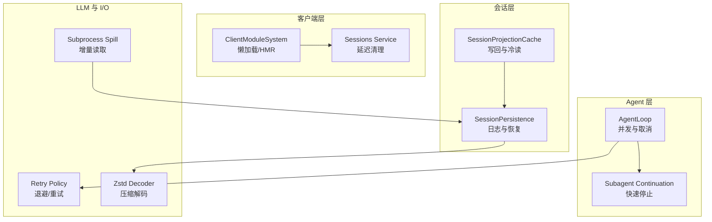
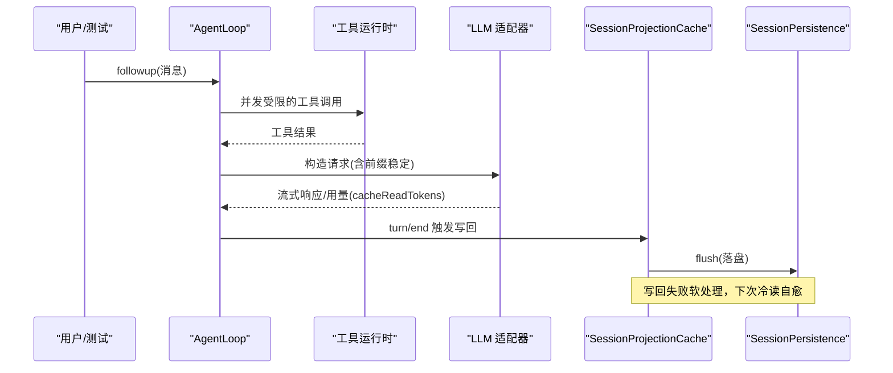
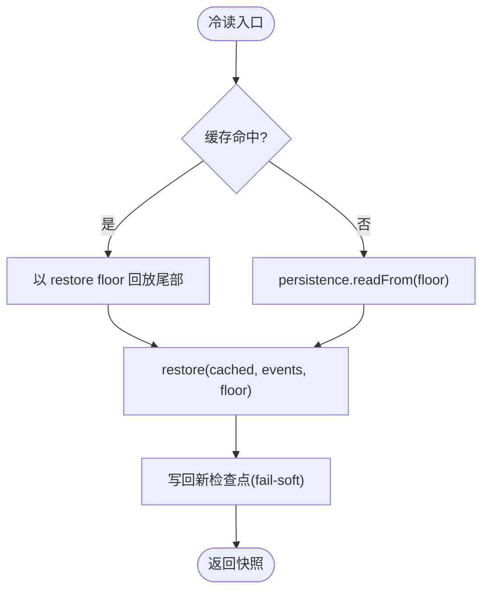
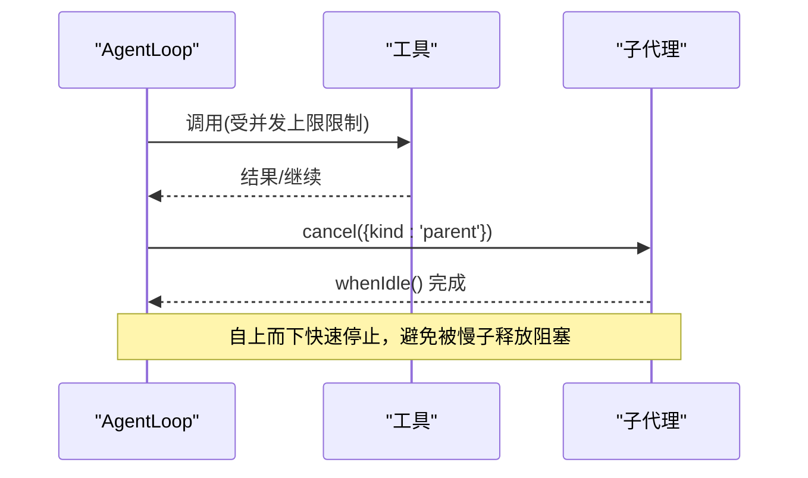
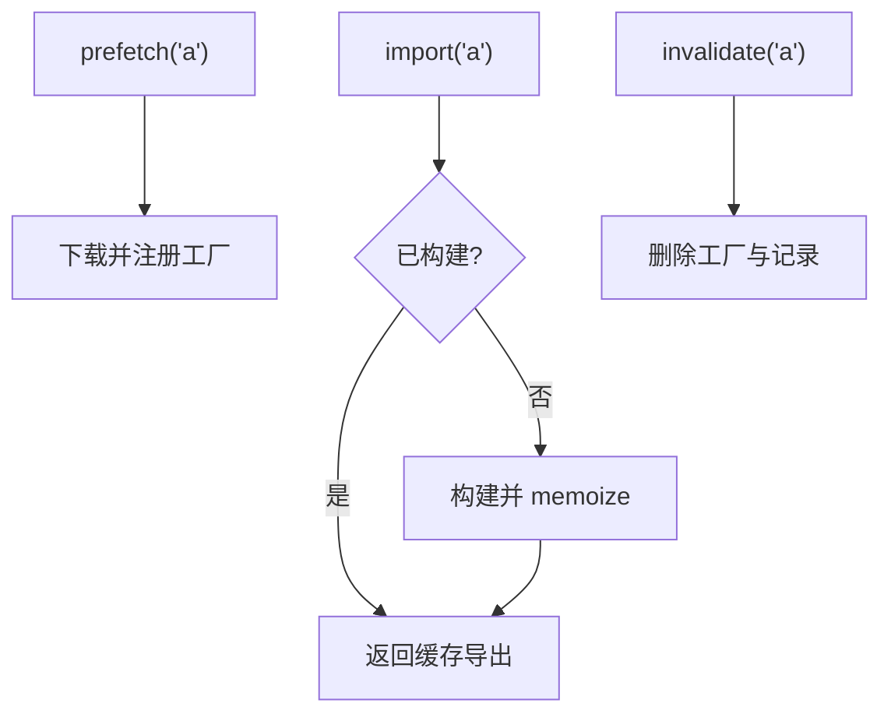
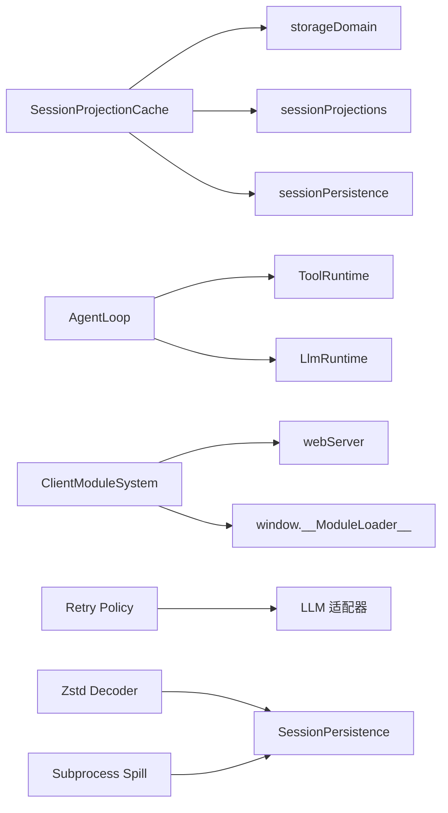

# 优化策略

<cite>
**本文引用的文件**
- [packages/session/session-projection-cache/src/index.ts](file://packages/session/session-projection-cache/src/index.ts)
- [packages/core/agent-loop/src/index.ts](file://packages/core/agent-loop/src/index.ts)
- [packages/client/modules/tests/loader.client.spec.ts](file://packages/client/modules/tests/loader.client.spec.ts)
- [packages/client/modules/src/index.ts](file://packages/client/modules/src/index.ts)
- [packages/client/runtime/src/client/sessions/service.ts](file://packages/client/runtime/src/client/sessions/service.ts)
- [packages/subagent/subagent/src/continuation.ts](file://packages/subagent/subagent/src/continuation.ts)
- [packages/llm/llm/src/retry-policy.ts](file://packages/llm/llm/src/retry-policy.ts)
- [packages/core/agent-loop/tests/request-cache.e2e.ts](file://packages/core/agent-loop/tests/request-cache.e2e.ts)
- [apps/web/tests/complex-history.perf.ts](file://apps/web/tests/complex-history.perf.ts)
- [packages/compaction/compaction-basic/src/config.ts](file://packages/compaction/compaction-basic/src/config.ts)
- [packages/session/session-persistence-jsonl/src/zstd-private-decoder.ts](file://packages/session/session-persistence-jsonl/src/zstd-private-decoder.ts)
- [packages/subprocess/subprocess-local/src/spawn.ts](file://packages/subprocess/subprocess-local/src/spawn.ts)
- [BENCHMARK.md](file://BENCHMARK.md)
</cite>

## 目录
1. [引言](#引言)
2. [项目结构](#项目结构)
3. [核心组件](#核心组件)
4. [架构总览](#架构总览)
5. [详细组件分析](#详细组件分析)
6. [依赖关系分析](#依赖关系分析)
7. [性能考量](#性能考量)
8. [故障排查指南](#故障排查指南)
9. [结论](#结论)
10. [附录](#附录)

## 引言
本指南聚焦于在 Agent 执行、会话管理、LLM 调用、客户端资源加载与内存管理等关键路径上的性能优化策略。内容基于仓库中的实际实现，涵盖缓存策略、并发控制、I/O 节流、流式渲染与持久化压缩等主题，并提供代码级调优建议与可复现的评估方法。

## 项目结构
本项目采用多包（monorepo）组织，按子系统划分：
- 会话与投影缓存：session-projection-cache 提供“冷读+写回”的投影状态缓存，降低重放成本。
- Agent 循环与并发：core/agent-loop 负责工具调用并发上限、取消传播与生命周期。
- 客户端模块系统：client/modules 提供懒加载、预取、HMR 失效与样式回收。
- 子代理与终止：subagent/continuation 提供自上而下的快速停止与子树释放。
- LLM 重试与压缩：llm retry-policy 提供退避与重试策略；session-persistence-jsonl 使用 zstd 进行高效压缩解码。
- 进程输出与溢出：subprocess-local 提供增量读取与 spill 文件回退。
- Web 性能基准：apps/web/tests/complex-history.perf.ts 提供端到端浏览器指标采集与回归断言。

图表来源
- [packages/session/session-projection-cache/src/index.ts:62-197](file://packages/session/session-projection-cache/src/index.ts#L62-L197)
- [packages/core/agent-loop/src/index.ts:108-139](file://packages/core/agent-loop/src/index.ts#L108-L139)
- [packages/client/modules/src/index.ts:215-248](file://packages/client/modules/src/index.ts#L215-L248)
- [packages/llm/llm/src/retry-policy.ts:158-191](file://packages/llm/llm/src/retry-policy.ts#L158-L191)
- [packages/session/session-persistence-jsonl/src/zstd-private-decoder.ts:57-94](file://packages/session/session-persistence-jsonl/src/zstd-private-decoder.ts#L57-L94)
- [packages/subprocess/subprocess-local/src/spawn.ts:199-218](file://packages/subprocess/subprocess-local/src/spawn.ts#L199-L218)

章节来源
- [packages/session/session-projection-cache/src/index.ts:62-197](file://packages/session/session-projection-cache/src/index.ts#L62-L197)
- [packages/core/agent-loop/src/index.ts:108-139](file://packages/core/agent-loop/src/index.ts#L108-L139)
- [packages/client/modules/src/index.ts:215-248](file://packages/client/modules/src/index.ts#L215-L248)
- [packages/llm/llm/src/retry-policy.ts:158-191](file://packages/llm/llm/src/retry-policy.ts#L158-L191)
- [packages/session/session-persistence-jsonl/src/zstd-private-decoder.ts:57-94](file://packages/session/session-persistence-jsonl/src/zstd-private-decoder.ts#L57-L94)
- [packages/subprocess/subprocess-local/src/spawn.ts:199-218](file://packages/subprocess/subprocess-local/src/spawn.ts#L199-L218)

## 核心组件
- 会话投影缓存（SessionProjectionCache）
  - 写路径：事件计数与时间间隔双阈值节流；turn/end 与会话销毁为强制落盘点。
  - 读路径：冷读优先命中缓存行，再 tail 回放至 restore floor，失败软处理并写回。
  - 安全语义：记录带 identity 校验，避免跨生命周期污染；所有持久化写入 fail-soft。
- Agent 循环（AgentLoop）
  - 并发控制：maxParallelToolCalls 限制并行工具调用，避免资源争用与下游过载。
  - 取消传播：AbortController 组合 caller/factory 信号，确保快速中止与资源释放。
- 客户端模块系统（ClientModuleSystem）
  - 懒加载与预取：prefetch 仅下载不执行；import 首次构建并 memoize。
  - HMR 支持：invalidate 清除工厂与记录，按需重新拉取。
  - 样式回收：维护 style 标签清单，卸载时清理。
- 子代理终止（Subagent Continuation）
  - 自上而下 cancel + whenIdle，保证父级不被慢子释放阻塞。
- LLM 重试策略（Retry Policy）
  - 模式 normal/always，支持可重试错误码与指数退避参数校验。
- 压缩解码（Zstd Private Decoder）
  - 利用 Node 私有流句柄复用上下文，减少分配与拷贝，提升大日志解压吞吐。
- 子进程输出（Spill）
  - 增量读取 with offset，超出窗口则 lossy 并提示 spill 路径，避免全量驻留内存。

章节来源
- [packages/session/session-projection-cache/src/index.ts:62-197](file://packages/session/session-projection-cache/src/index.ts#L62-L197)
- [packages/core/agent-loop/src/index.ts:108-139](file://packages/core/agent-loop/src/index.ts#L108-L139)
- [packages/client/modules/tests/loader.client.spec.ts:63-111](file://packages/client/modules/tests/loader.client.spec.ts#L63-L111)
- [packages/client/modules/src/index.ts:215-248](file://packages/client/modules/src/index.ts#L215-L248)
- [packages/subagent/subagent/src/continuation.ts:1292-1307](file://packages/subagent/subagent/src/continuation.ts#L1292-L1307)
- [packages/llm/llm/src/retry-policy.ts:158-191](file://packages/llm/llm/src/retry-policy.ts#L158-L191)
- [packages/session/session-persistence-jsonl/src/zstd-private-decoder.ts:57-94](file://packages/session/session-persistence-jsonl/src/zstd-private-decoder.ts#L57-L94)
- [packages/subprocess/subprocess-local/src/spawn.ts:199-218](file://packages/subprocess/subprocess-local/src/spawn.ts#L199-L218)

## 架构总览
下图展示从用户请求到模型响应、再到会话持久化的关键路径，以及各层的优化点。

图表来源
- [packages/core/agent-loop/src/index.ts:108-139](file://packages/core/agent-loop/src/index.ts#L108-L139)
- [packages/session/session-projection-cache/src/index.ts:201-239](file://packages/session/session-projection-cache/src/index.ts#L201-L239)
- [packages/core/agent-loop/tests/request-cache.e2e.ts:71-103](file://packages/core/agent-loop/tests/request-cache.e2e.ts#L71-L103)

## 详细组件分析

### 会话投影缓存：冷读与写回
- 设计要点
  - 写路径：事件计数与时间间隔双阈值节流；turn/end 与会话销毁为强制落盘点。
  - 读路径：coldSnapshot 先查缓存行，再以 persistence.readFrom 从 restore floor 起 tail 回放，成功后写回。
  - 一致性：identity 校验防止跨生命周期污染；fail-soft 写入保障主路径不受影响。
- 复杂度
  - 冷读：O(k) 回放 k 条事件至 restore floor，通常远小于全量日志。
  - 写回：每次 checkpoint 序列化与 KV 写入，受节流控制。
- 优化建议
  - 合理设置 writeEveryEvents 与 writeIntervalMs，平衡实时性与 IO 压力。
  - 对超大会话，关注 restore floor 的选择，避免频繁退化到全量回放。

图表来源
- [packages/session/session-projection-cache/src/index.ts:154-197](file://packages/session/session-projection-cache/src/index.ts#L154-L197)

章节来源
- [packages/session/session-projection-cache/src/index.ts:62-197](file://packages/session/session-projection-cache/src/index.ts#L62-L197)

### Agent 执行优化：并发与取消
- 并发控制
  - maxParallelToolCalls 限制同时运行的工具调用数，避免下游服务拥塞与资源竞争。
- 取消传播
  - 通过 AbortController 组合 caller 与 factory 信号，确保在卸载或外部取消时尽快中断。
- 最佳实践
  - 将耗时工具调用置于并发上限内，结合超时与重试策略。
  - 对长任务使用 whenIdle 等待，避免阻塞父流程。

图表来源
- [packages/core/agent-loop/src/index.ts:108-139](file://packages/core/agent-loop/src/index.ts#L108-L139)
- [packages/subagent/subagent/src/continuation.ts:1292-1307](file://packages/subagent/subagent/src/continuation.ts#L1292-L1307)

章节来源
- [packages/core/agent-loop/src/index.ts:108-139](file://packages/core/agent-loop/src/index.ts#L108-L139)
- [packages/subagent/subagent/src/continuation.ts:1292-1307](file://packages/subagent/subagent/src/continuation.ts#L1292-L1307)

### 会话管理优化：延迟清理与阶段切换
- 延迟移除
  - 会话服务在阶段移动时 sweepDeferred，批量清理不再需要的 scope，避免频繁 GC 抖动。
- 最佳实践
  - 将昂贵清理操作延后到空闲阶段，减少热路径开销。
  - 对活跃会话集合做惰性扫描，避免 O(n) 全量遍历。

章节来源
- [packages/client/runtime/src/client/sessions/service.ts:768-791](file://packages/client/runtime/src/client/sessions/service.ts#L768-L791)

### LLM 调用优化：请求前缀与缓存命中
- 前缀稳定性
  - 通过稳定的系统提示与工具调用顺序，使后续请求共享字节级前缀，触发提供商 prompt cache hit。
- 观测方式
  - 通过 assistant/message 的 usage.cacheReadTokens > 0 验证缓存命中。
- 配置建议
  - 固定 persona/system prompt，减少无关变化；工具调用顺序稳定。

章节来源
- [packages/core/agent-loop/tests/request-cache.e2e.ts:71-103](file://packages/core/agent-loop/tests/request-cache.e2e.ts#L71-L103)

### 客户端资源加载优化：懒加载、预取与 HMR
- 懒加载与预取
  - prefetch 仅下载并注册工厂，不执行；import 首次构建并 memoize，重复 import 直接命中缓存。
- HMR 失效
  - invalidate 删除工厂与记录，下次加载重新拉取并注册，避免脏状态。
- 样式回收
  - 记录 style 标签 id，卸载时清理，防止内存泄漏。
- 并发到达
  - 同一 bundle 的多次 import/prefetch 合并为一次 in-flight 任务，减少网络与解析开销。

图表来源
- [packages/client/modules/tests/loader.client.spec.ts:63-111](file://packages/client/modules/tests/loader.client.spec.ts#L63-L111)
- [packages/client/modules/tests/loader.client.spec.ts:144-168](file://packages/client/modules/tests/loader.client.spec.ts#L144-L168)
- [packages/client/modules/tests/loader.client.spec.ts:226-238](file://packages/client/modules/tests/loader.client.spec.ts#L226-L238)
- [packages/client/modules/src/index.ts:215-248](file://packages/client/modules/src/index.ts#L215-L248)

章节来源
- [packages/client/modules/tests/loader.client.spec.ts:63-111](file://packages/client/modules/tests/loader.client.spec.ts#L63-L111)
- [packages/client/modules/tests/loader.client.spec.ts:144-168](file://packages/client/modules/tests/loader.client.spec.ts#L144-L168)
- [packages/client/modules/tests/loader.client.spec.ts:226-238](file://packages/client/modules/tests/loader.client.spec.ts#L226-L238)
- [packages/client/modules/src/index.ts:215-248](file://packages/client/modules/src/index.ts#L215-L248)

### 内存管理与 I/O 优化：压缩与增量读取
- Zstd 解码
  - 利用 Node 私有流句柄复用上下文，减少分配与拷贝，提升大日志解压吞吐。
- 子进程输出
  - readFrom(offset) 增量读取，超出窗口则 lossy 并附带 spill 路径，避免全量驻留内存。
- 建议
  - 对超长输出启用 spill；合理设置 chunkSize 与窗口大小，平衡内存与回溯能力。

章节来源
- [packages/session/session-persistence-jsonl/src/zstd-private-decoder.ts:57-94](file://packages/session/session-persistence-jsonl/src/zstd-private-decoder.ts#L57-L94)
- [packages/subprocess/subprocess-local/src/spawn.ts:199-218](file://packages/subprocess/subprocess-local/src/spawn.ts#L199-L218)

### 压缩与保留策略：Compaction
- 目标策略
  - 针对特定 provider/model 覆盖保留比例、最大 token、摘要模型与重试次数。
- 建议
  - 根据模型上下文窗口与成本，调整 retainRatio/maxTokens；对高成本模型启用更激进的摘要。

章节来源
- [packages/compaction/compaction-basic/src/config.ts:99-125](file://packages/compaction/compaction-basic/src/config.ts#L99-L125)

## 依赖关系分析
- SessionProjectionCache 依赖 storageDomain、sessionProjections、sessionPersistence 与 sessions 事件，形成“写回-冷读”闭环。
- AgentLoop 依赖 ToolRuntime、LlmRuntime 与 AgentRegistry，并通过 AbortController 协调取消。
- ClientModuleSystem 依赖 loader entries、webServer 与 window.__ModuleLoader__，实现懒加载与 HMR。
- Retry Policy 与 LLM 适配器协作，决定失败时的重试与退避。
- Zstd Decoder 与 SessionPersistence 协作，加速日志解压。
- Subprocess Spill 与 Persistence 协作，提供增量读取与回退。

图表来源
- [packages/session/session-projection-cache/src/index.ts:71-89](file://packages/session/session-projection-cache/src/index.ts#L71-L89)
- [packages/core/agent-loop/src/index.ts:108-139](file://packages/core/agent-loop/src/index.ts#L108-L139)
- [packages/client/modules/src/index.ts:215-248](file://packages/client/modules/src/index.ts#L215-L248)
- [packages/llm/llm/src/retry-policy.ts:158-191](file://packages/llm/llm/src/retry-policy.ts#L158-L191)
- [packages/session/session-persistence-jsonl/src/zstd-private-decoder.ts:57-94](file://packages/session/session-persistence-jsonl/src/zstd-private-decoder.ts#L57-L94)
- [packages/subprocess/subprocess-local/src/spawn.ts:199-218](file://packages/subprocess/subprocess-local/src/spawn.ts#L199-L218)

## 性能考量
- 识别瓶颈
  - 前端渲染：使用复杂历史基准测量 wall/task/script/layout/recalcStyle/delta 节点与监听器数量。
  - 后端 I/O：关注投影缓存写回频率与冷读回放长度；监控 spill 路径出现频率。
  - LLM 调用：观察 cacheReadTokens 增长趋势，验证前缀稳定性。
- 优化技术
  - 缓存：启用投影缓存与 LLM 前缀缓存；客户端模块懒加载与 HMR 失效。
  - 资源加载：prefetch 预热关键模块；合并重复请求；样式回收。
  - 并发控制：限制工具调用并发；子代理快速停止；延迟清理。
  - 内存管理：增量读取与 spill；zstd 解码复用上下文；避免全量日志驻留。
- 评估方法
  - 使用 apps/web/tests/complex-history.perf.ts 进行端到端基准；结合 BENCHMARK.md 指引运行独立任务。

章节来源
- [apps/web/tests/complex-history.perf.ts:1-800](file://apps/web/tests/complex-history.perf.ts#L1-L800)
- [BENCHMARK.md:1-4](file://BENCHMARK.md#L1-L4)

## 故障排查指南
- 投影缓存写回失败
  - 现象：冷读回放变长，日志中出现警告。
  - 处理：确认 writeEveryEvents/writeIntervalMs 配置；检查存储域可用性与权限；观察下一次冷读是否自愈。
- 客户端模块重复注册或循环依赖
  - 现象：抛出重复注册或 require cycle 错误。
  - 处理：确保每个 bundle 仅注册一次；检查模块图无环；必要时使用 invalidate 重置。
- 子代理无法及时停止
  - 现象：父流程被慢子释放阻塞。
  - 处理：确认 cancel({kind:'parent'}) 已触发；等待 whenIdle；检查子代理内部是否有未捕获阻塞。
- LLM 缓存未命中
  - 现象：cacheReadTokens 始终为 0。
  - 处理：检查 system prompt 与工具调用顺序是否稳定；确认 provider 支持 prompt cache。
- 子进程输出丢失
  - 现象：readFrom 返回 lossy=true 并附带 spillPath。
  - 处理：从 spill 文件恢复缺失片段；增大内存窗口或调整消费速率。

章节来源
- [packages/session/session-projection-cache/src/index.ts:241-281](file://packages/session/session-projection-cache/src/index.ts#L241-L281)
- [packages/client/modules/tests/loader.client.spec.ts:192-223](file://packages/client/modules/tests/loader.client.spec.ts#L192-L223)
- [packages/subagent/subagent/src/continuation.ts:1292-1307](file://packages/subagent/subagent/src/continuation.ts#L1292-L1307)
- [packages/core/agent-loop/tests/request-cache.e2e.ts:71-103](file://packages/core/agent-loop/tests/request-cache.e2e.ts#L71-L103)
- [packages/subprocess/subprocess-local/src/spawn.ts:199-218](file://packages/subprocess/subprocess-local/src/spawn.ts#L199-L218)

## 结论
通过在会话层引入投影缓存与冷读自愈、在 Agent 层实施并发上限与快速停止、在客户端层采用懒加载与 HMR、在 I/O 层使用压缩与增量读取，可以在保证一致性的前提下显著提升吞吐与响应性。配合端到端基准与 LLM 缓存观测，可量化优化效果并持续迭代。

## 附录
- 运行基准
  - 遵循 BENCHMARK.md 指引安装 SDK 并运行 jsonrpc-agent 最小变体，使用独立工作区与会话 ID 隔离任务。
- 关键配置项
  - 投影缓存：writeEveryEvents、writeIntervalMs。
  - Agent 循环：maxParallelToolCalls。
  - 压缩：chunkSize（zstd）。
  - 子进程：内存窗口与 spill 策略。

章节来源
- [BENCHMARK.md:1-4](file://BENCHMARK.md#L1-L4)
- [packages/session/session-projection-cache/src/index.ts:42-52](file://packages/session/session-projection-cache/src/index.ts#L42-L52)
- [packages/core/agent-loop/src/index.ts:132-139](file://packages/core/agent-loop/src/index.ts#L132-L139)
- [packages/session/session-persistence-jsonl/src/zstd-private-decoder.ts:57-94](file://packages/session/session-persistence-jsonl/src/zstd-private-decoder.ts#L57-L94)
- [packages/subprocess/subprocess-local/src/spawn.ts:199-218](file://packages/subprocess/subprocess-local/src/spawn.ts#L199-L218)