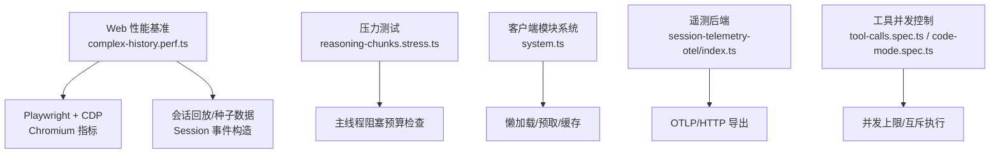
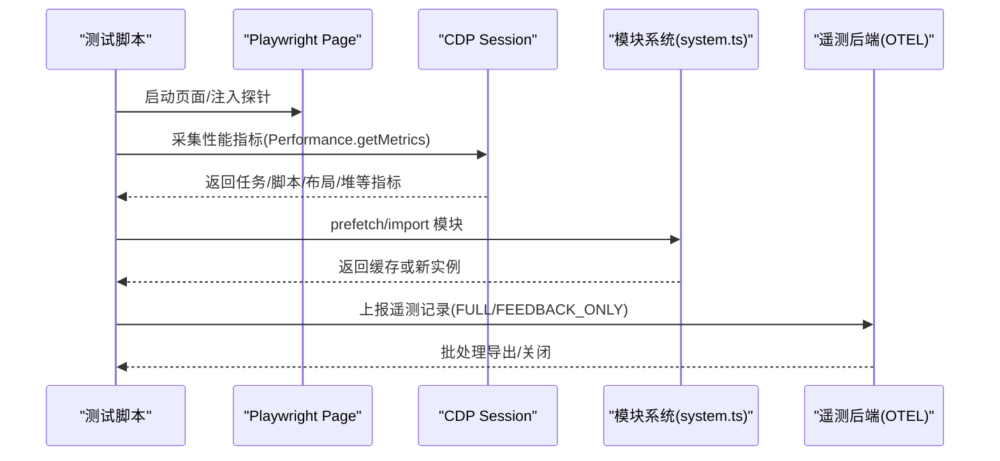
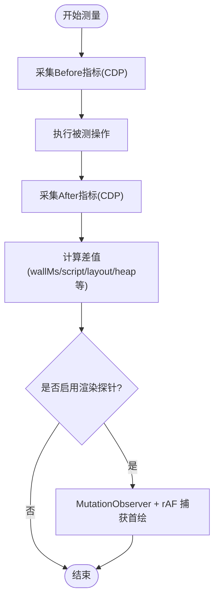
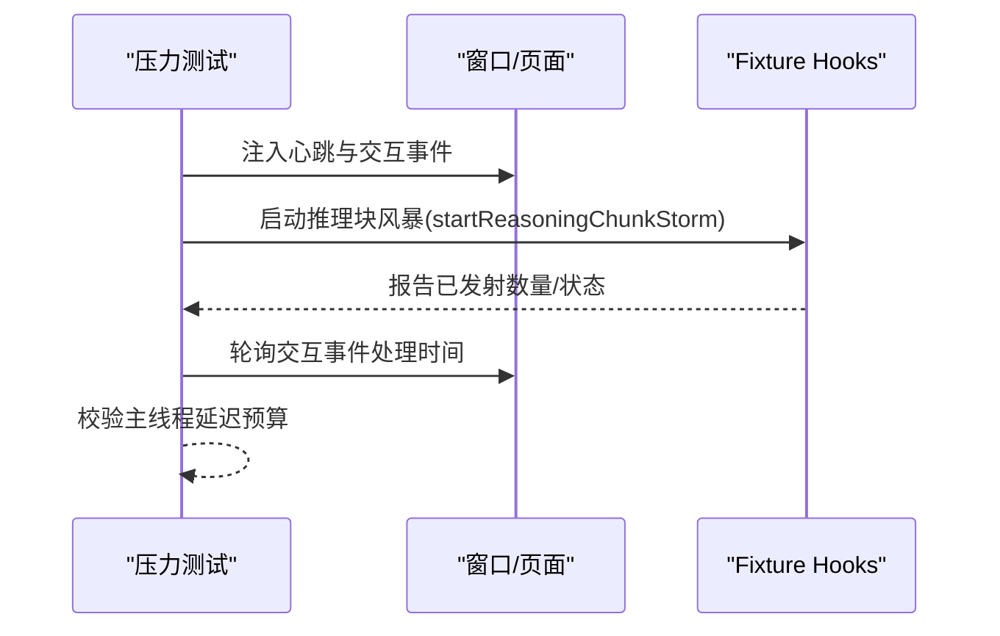
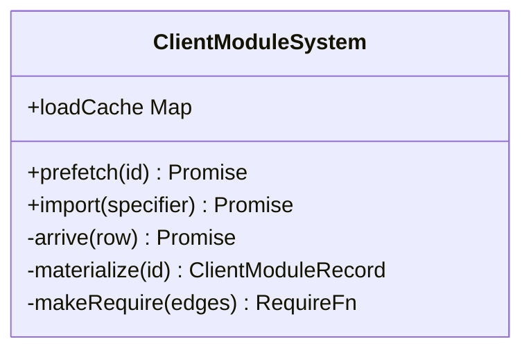
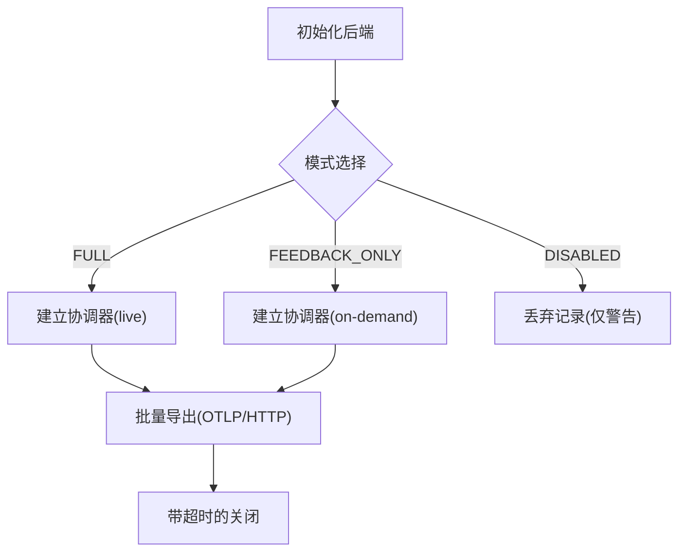
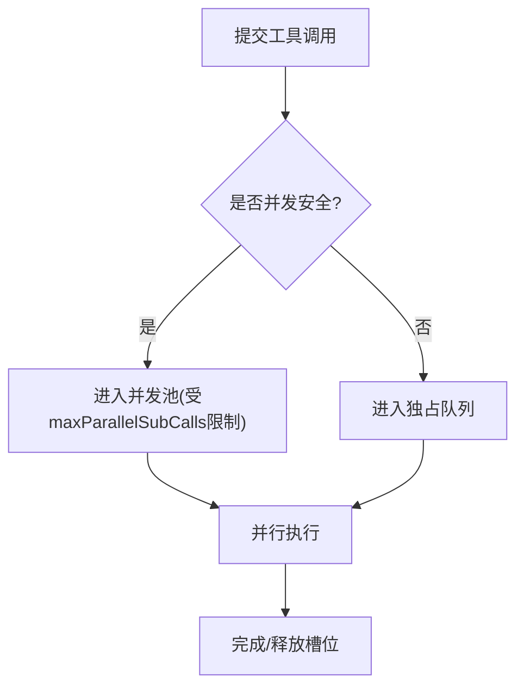
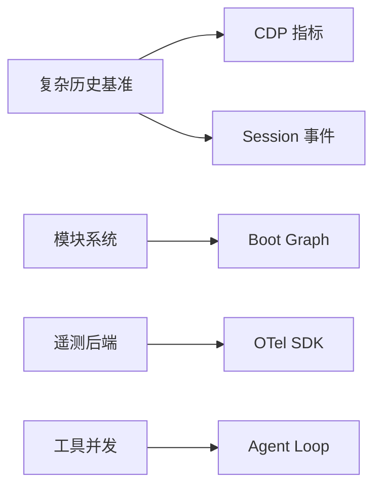

# 性能优化

<cite>
**本文引用的文件**
- [BENCHMARK.md](file://BENCHMARK.md)
- [complex-history.perf.ts](file://apps/web/tests/complex-history.perf.ts)
- [reasoning-chunks.stress.ts](file://apps/web/stress-tests/reasoning-chunks.stress.ts)
- [vitest.web-stress.config.ts](file://vitest.web-stress.config.ts)
- [token-meter.spec.ts](file://packages/llm/token-meter/tests/token-meter.spec.ts)
- [session-telemetry-otel/index.ts](file://packages/session/session-telemetry-otel/src/index.ts)
- [client/system.ts](file://packages/client/modules/src/client/system.ts)
- [loader.client.spec.ts](file://packages/client/modules/tests/loader.client.spec.ts)
- [tool-calls.spec.ts](file://packages/core/agent-loop/tests/tool-calls.spec.ts)
- [code-mode.spec.ts](file://packages/core/tools/tests/code-mode.spec.ts)
</cite>

## 目录
1. [简介](#简介)
2. [项目结构](#项目结构)
3. [核心组件](#核心组件)
4. [架构总览](#架构总览)
5. [详细组件分析](#详细组件分析)
6. [依赖关系分析](#依赖关系分析)
7. [性能考量](#性能考量)
8. [故障排查指南](#故障排查指南)
9. [结论](#结论)
10. [附录](#附录)

## 简介
本指南聚焦于如何在 DeepSeek Harness 中识别与分析性能瓶颈，覆盖 CPU、内存、网络延迟等关键维度；提供基准测试与压力测试方法；文档化常见性能问题与优化策略（缓存、资源加载、并发控制）；并给出生产环境监控与告警配置建议，以及持续性能监控与回归检测的最佳实践。

## 项目结构
仓库包含面向 Web 的性能基准与压力测试、客户端模块系统、遥测后端、工具调用并发控制等与性能密切相关的实现。关键位置如下：
- Web 端性能基准与压力测试：apps/web/tests/complex-history.perf.ts、apps/web/stress-tests/reasoning-chunks.stress.ts
- 浏览器指标采集与度量：通过 Playwright CDP 获取 Chromium 性能指标
- 客户端模块系统与懒加载：packages/client/modules/src/client/system.ts
- 遥测与上报：packages/session/session-telemetry-otel/src/index.ts
- 工具调用并发与限流：packages/core/agent-loop/tests/tool-calls.spec.ts、packages/core/tools/tests/code-mode.spec.ts
- 基准运行说明：BENCHMARK.md

图表来源
- [complex-history.perf.ts:519-580](file://apps/web/tests/complex-history.perf.ts#L519-L580)
- [reasoning-chunks.stress.ts:46-153](file://apps/web/stress-tests/reasoning-chunks.stress.ts#L46-L153)
- [client/system.ts:98-190](file://packages/client/modules/src/client/system.ts#L98-L190)
- [session-telemetry-otel/index.ts:147-253](file://packages/session/session-telemetry-otel/src/index.ts#L147-L253)
- [tool-calls.spec.ts:117-142](file://packages/core/agent-loop/tests/tool-calls.spec.ts#L117-L142)
- [code-mode.spec.ts:509-590](file://packages/core/tools/tests/code-mode.spec.ts#L509-L590)

章节来源
- [BENCHMARK.md:1-4](file://BENCHMARK.md#L1-L4)

## 核心组件
- 浏览器性能测量与保留状态评估：通过 CDP 收集 TaskDuration、ScriptDuration、LayoutDuration、RecalcStyleDuration、Nodes、JSEventListeners、JSHeapUsedSize 等指标，计算前后差值，得到 wallMs、scriptMs、layoutMs、heapDeltaMb 等度量。
- 用户交互渲染探针：使用 MutationObserver 与 requestAnimationFrame 捕获“发送→DOM插入→首次绘制”的端到端时延，统计 mutation batches/records。
- 客户端模块懒加载与缓存：prefetch 仅下载不执行，import 惰性实例化并缓存导出，支持并发请求合并与循环保护。
- 遥测后端：基于 OpenTelemetry SDK，支持 FULL/FEEDBACK_ONLY/DISABLED 模式，批处理导出与关闭超时控制。
- 工具调用并发控制：支持并发安全工具的并行执行、独占工具串行化、最大并发数限制。

章节来源
- [complex-history.perf.ts:88-168](file://apps/web/tests/complex-history.perf.ts#L88-L168)
- [complex-history.perf.ts:519-580](file://apps/web/tests/complex-history.perf.ts#L519-L580)
- [client/system.ts:98-190](file://packages/client/modules/src/client/system.ts#L98-L190)
- [session-telemetry-otel/index.ts:147-253](file://packages/session/session-telemetry-otel/src/index.ts#L147-L253)
- [tool-calls.spec.ts:117-142](file://packages/core/agent-loop/tests/tool-calls.spec.ts#L117-L142)
- [code-mode.spec.ts:509-590](file://packages/core/tools/tests/code-mode.spec.ts#L509-L590)

## 架构总览
下图展示了从 Web 基准到浏览器指标采集、再到遥测上报的整体流程，以及客户端模块系统的懒加载路径。

图表来源
- [complex-history.perf.ts:519-580](file://apps/web/tests/complex-history.perf.ts#L519-L580)
- [client/system.ts:98-190](file://packages/client/modules/src/client/system.ts#L98-L190)
- [session-telemetry-otel/index.ts:147-253](file://packages/session/session-telemetry-otel/src/index.ts#L147-L253)

## 详细组件分析

### 浏览器性能基准与指标采集
- 指标采集：通过 CDP 的 Performance.getMetrics 获取任务、脚本、布局、样式重算、DevTools 命令耗时等，结合 JSHeapUsedSize 跟踪内存变化。
- 增量度量：在操作前后分别采集指标，计算差值得到 wallMs、taskMs、scriptMs、layoutMs、recalcStyleMs、devtoolsMs、nodesDelta、listenersDelta、heapDeltaMb。
- 用户渲染探针：使用 MutationObserver 监听目标区域变更，配合 requestAnimationFrame 捕获 DOM 可见与首次绘制时间，统计 mutation batches/records。
- 稳定性判定：对行计数等动态指标进行稳定读取，避免抖动导致的误判。

图表来源
- [complex-history.perf.ts:519-580](file://apps/web/tests/complex-history.perf.ts#L519-L580)
- [complex-history.perf.ts:582-779](file://apps/web/tests/complex-history.perf.ts#L582-L779)

章节来源
- [complex-history.perf.ts:519-580](file://apps/web/tests/complex-history.perf.ts#L519-L580)
- [complex-history.perf.ts:582-779](file://apps/web/tests/complex-history.perf.ts#L582-L779)

### 推理流压力测试（主线程阻塞预算）
- 场景：以固定间隔向正常异步通道推送大量推理块，保持一个“思考”行处于运行态，验证主线程响应性。
- 探针：周期性心跳测量主线程最大延迟，触发一次调度交互以测量交互延迟。
- 断言：确保在预算内完成全部块输出，且主线程延迟与交互延迟不超过阈值。

图表来源
- [reasoning-chunks.stress.ts:46-153](file://apps/web/stress-tests/reasoning-chunks.stress.ts#L46-L153)

章节来源
- [reasoning-chunks.stress.ts:46-153](file://apps/web/stress-tests/reasoning-chunks.stress.ts#L46-L153)

### 客户端模块系统（懒加载与缓存）
- 预取与惰性实例化：prefetch 仅下载并注册工厂，不执行；import 首次调用才执行工厂并缓存导出。
- 并发合并：同一模块的多次 import/prefetch 共享一次 in-flight 到达任务，避免重复下载与执行。
- 循环保护：materializing 集合防止工厂递归导致的部分导出问题。
- 静态模块与种子：优先命中 seed/statics，再查 loadCache，最后按需加载。

图表来源
- [client/system.ts:59-190](file://packages/client/modules/src/client/system.ts#L59-L190)

章节来源
- [client/system.ts:98-190](file://packages/client/modules/src/client/system.ts#L98-L190)
- [loader.client.spec.ts:63-111](file://packages/client/modules/tests/loader.client.spec.ts#L63-L111)

### 遥测后端（OpenTelemetry）
- 模式：FULL（全量）、FEEDBACK_ONLY（仅反馈）、DISABLED（本地）。
- 批处理与导出：使用 BatchLogRecordProcessor 与 OTLP/HTTP 导出器，支持自定义处理器选项。
- 关闭与超时：shutdown 提供外部超时保护，避免进程退出时长时间等待。
- 配置校验：在插件加载阶段校验 exporter.url、processor.maxExportBatchSize、shutdownTimeoutMillis 等。

图表来源
- [session-telemetry-otel/index.ts:147-253](file://packages/session/session-telemetry-otel/src/index.ts#L147-L253)
- [session-telemetry-otel/index.ts:283-298](file://packages/session/session-telemetry-otel/src/index.ts#L283-L298)

章节来源
- [session-telemetry-otel/index.ts:147-253](file://packages/session/session-telemetry-otel/src/index.ts#L147-L253)
- [session-telemetry-otel/index.ts:283-298](file://packages/session/session-telemetry-otel/src/index.ts#L283-L298)

### 工具调用并发控制
- 并发安全工具可并行执行，独占工具需串行化，形成屏障。
- 最大并发数限制：通过配置限制同时进行的子调用数量，避免资源竞争。
- 顺序与隔离：并发安全的调用先排队，独占调用独占执行，后续调用等待。

图表来源
- [tool-calls.spec.ts:117-142](file://packages/core/agent-loop/tests/tool-calls.spec.ts#L117-L142)
- [code-mode.spec.ts:509-590](file://packages/core/tools/tests/code-mode.spec.ts#L509-L590)

章节来源
- [tool-calls.spec.ts:117-142](file://packages/core/agent-loop/tests/tool-calls.spec.ts#L117-L142)
- [code-mode.spec.ts:509-590](file://packages/core/tools/tests/code-mode.spec.ts#L509-L590)

## 依赖关系分析
- 基准测试依赖 Playwright 与 CDP 访问浏览器内部指标，并通过 Session 事件构造模拟长历史与流式响应。
- 客户端模块系统依赖 boot graph 与外部脚本加载钩子，保证模块按需加载与缓存。
- 遥测后端依赖 OpenTelemetry SDK，将逻辑记录映射为日志记录并批量导出。
- 工具调用并发控制依赖 agent-loop 与 tools 子系统的事件与调度机制。

图表来源
- [complex-history.perf.ts:519-580](file://apps/web/tests/complex-history.perf.ts#L519-L580)
- [client/system.ts:98-190](file://packages/client/modules/src/client/system.ts#L98-L190)
- [session-telemetry-otel/index.ts:147-253](file://packages/session/session-telemetry-otel/src/index.ts#L147-L253)
- [tool-calls.spec.ts:117-142](file://packages/core/agent-loop/tests/tool-calls.spec.ts#L117-L142)

章节来源
- [complex-history.perf.ts:519-580](file://apps/web/tests/complex-history.perf.ts#L519-L580)
- [client/system.ts:98-190](file://packages/client/modules/src/client/system.ts#L98-L190)
- [session-telemetry-otel/index.ts:147-253](file://packages/session/session-telemetry-otel/src/index.ts#L147-L253)
- [tool-calls.spec.ts:117-142](file://packages/core/agent-loop/tests/tool-calls.spec.ts#L117-L142)

## 性能考量
- CPU 使用率与主线程阻塞
  - 通过 CDP 的 ScriptDuration、TaskDuration 衡量脚本与任务耗时；在压力测试中设定主线程延迟预算，确保高吞吐下仍保持交互响应。
  - 建议：拆分大任务、使用 requestIdleCallback 或分片渲染、避免同步阻塞。
- 内存占用
  - 使用 JSHeapUsedSize、Nodes、JSEventListeners 跟踪内存增长与泄漏风险；在基准中定期触发 GC 后采样，比较 heapDeltaMb。
  - 建议：及时解绑事件监听、释放大对象引用、避免全局累积。
- 网络延迟与资源加载
  - 利用客户端模块系统的 prefetch/import 减少首屏与功能点加载时延；并发请求合并避免重复下载。
  - 建议：合理设置预取时机、按路由/功能拆分模块、使用缓存与版本化 URL。
- 并发控制
  - 对并发安全工具允许并行以提升吞吐；对独占工具串行化以避免竞争；通过 maxParallelSubCalls 限制并发度。
  - 建议：根据资源类型（CPU/IO/锁）选择合适的并发策略，监控峰值并发与等待时间。
- 流式渲染与 UI 响应
  - 使用 MutationObserver 与 rAF 捕获首绘时延，统计 mutation batches/records，避免过多 DOM 更新批次。
  - 建议：批量更新 DOM、减少不必要的重排/重绘、虚拟化长列表。

[本节为通用指导，无需特定文件来源]

## 故障排查指南
- 遥测上报失败或丢失
  - 现象：DISABLED 模式下反馈仅本地；FULL/FEEDBACK_ONLY 模式下可能因 exporter.url 无效或 batch size 配置不当导致异常。
  - 排查：检查 exporter.url 是否为 http(s) 且有效；确认 processor.maxExportBatchSize 为正整数；关注 shutdown 超时。
  - 参考实现：[session-telemetry-otel/index.ts:170-195](file://packages/session/session-telemetry-otel/src/index.ts#L170-L195)、[session-telemetry-otel/index.ts:283-298](file://packages/session/session-telemetry-otel/src/index.ts#L283-L298)
- 模块加载异常
  - 现象：重复注册、未注册工厂、循环依赖报错。
  - 排查：确认 boot graph 条目唯一；确保 bundle 执行后通过 __ModuleLoader__.load 注册；避免工厂间循环依赖。
  - 参考实现：[client/system.ts:87-95](file://packages/client/modules/src/client/system.ts#L87-L95)、[client/system.ts:113-133](file://packages/client/modules/src/client/system.ts#L113-L133)
- 基准测试不稳定
  - 现象：行计数或节点数波动导致断言失败。
  - 排查：使用稳定读取函数等待计数收敛；确保在 GC 后进行内存采样；避免并发测试干扰。
  - 参考实现：[complex-history.perf.ts:781-797](file://apps/web/tests/complex-history.perf.ts#L781-L797)

章节来源
- [session-telemetry-otel/index.ts:170-195](file://packages/session/session-telemetry-otel/src/index.ts#L170-L195)
- [session-telemetry-otel/index.ts:283-298](file://packages/session/session-telemetry-otel/src/index.ts#L283-L298)
- [client/system.ts:87-95](file://packages/client/modules/src/client/system.ts#L87-L95)
- [client/system.ts:113-133](file://packages/client/modules/src/client/system.ts#L113-L133)
- [complex-history.perf.ts:781-797](file://apps/web/tests/complex-history.perf.ts#L781-L797)

## 结论
通过浏览器级指标采集、压力测试与客户端模块懒加载、遥测上报与工具并发控制，DeepSeek Harness 提供了完整的性能观测与优化基础。建议在开发阶段引入基准与压力用例，在生产环境启用遥测与告警，持续追踪关键指标，防范性能回归。

[本节为总结，无需特定文件来源]

## 附录
- 基准运行方式
  - 遵循仓库中的基准说明，安装 Python SDK 并运行最小化 jsonrpc-agent 变体，使用独立工作区与会话 ID 隔离任务。
  - 参考：[BENCHMARK.md:1-4](file://BENCHMARK.md#L1-L4)
- 压力测试配置
  - 使用独立的 Vitest 配置文件启用浏览器压力测试，禁用文件并行以降低噪声，延长超时以适应大规模场景。
  - 参考：[vitest.web-stress.config.ts:5-15](file://vitest.web-stress.config.ts#L5-L15)
- 令牌用量与不可变结果
  - 测量结果采用深冻结结构，防止意外修改；空会话返回零基线，便于对比增量。
  - 参考：[token-meter.spec.ts:148-167](file://packages/llm/token-meter/tests/token-meter.spec.ts#L148-L167)

章节来源
- [BENCHMARK.md:1-4](file://BENCHMARK.md#L1-L4)
- [vitest.web-stress.config.ts:5-15](file://vitest.web-stress.config.ts#L5-L15)
- [token-meter.spec.ts:148-167](file://packages/llm/token-meter/tests/token-meter.spec.ts#L148-L167)