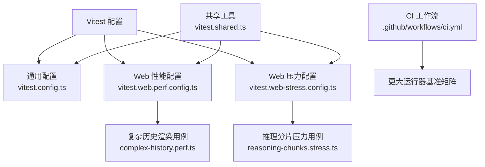
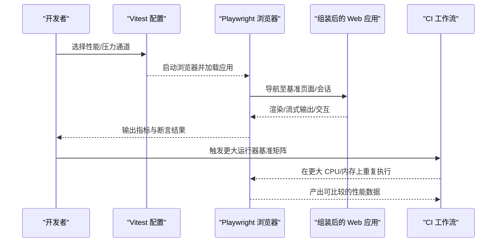
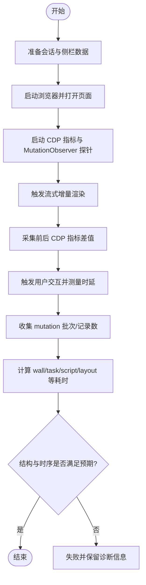
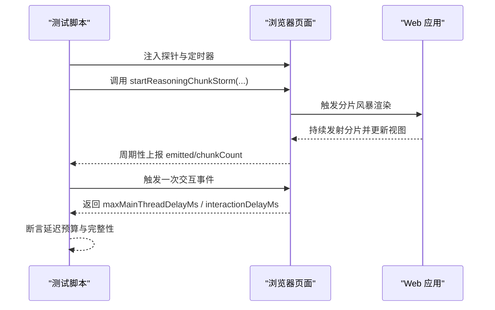
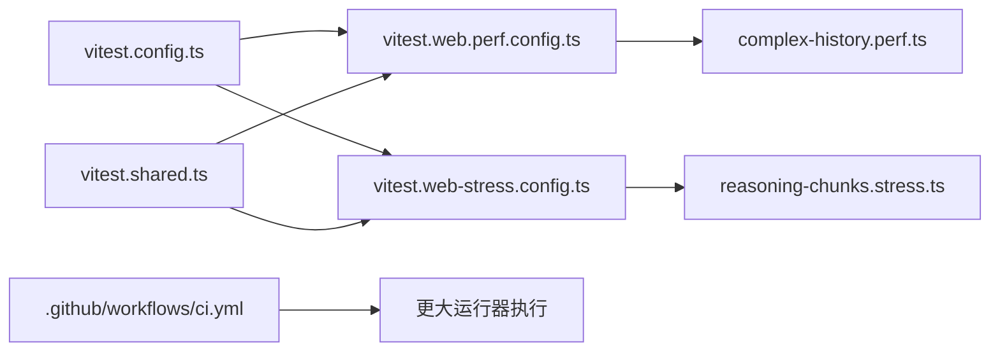

# 性能基准测试

<cite>
**本文引用的文件**
- [BENCHMARK.md](file://BENCHMARK.md)
- [vitest.config.ts](file://vitest.config.ts)
- [vitest.shared.ts](file://vitest.shared.ts)
- [vitest.web-stress.config.ts](file://vitest.web-stress.config.ts)
- [vitest.web.perf.config.ts](file://vitest.web.perf.config.ts)
- [apps/web/stress-tests/reasoning-chunks.stress.ts](file://apps/web/stress-tests/reasoning-chunks.stress.ts)
- [apps/web/tests/complex-history.perf.ts](file://apps/web/tests/complex-history.perf.ts)
- [.github/workflows/ci.yml](file://.github/workflows/ci.yml)
</cite>

## 目录
1. [简介](#简介)
2. [项目结构](#项目结构)
3. [核心组件](#核心组件)
4. [架构总览](#架构总览)
5. [详细组件分析](#详细组件分析)
6. [依赖关系分析](#依赖关系分析)
7. [性能注意事项](#性能注意事项)
8. [故障排查指南](#故障排查指南)
9. [结论](#结论)
10. [附录](#附录)

## 简介
本指南面向希望在本仓库中设计、执行与分析性能基准测试的工程师。仓库已内置基于 Vitest + Playwright 的浏览器性能与压力测试能力，并提供可选的高并发/高基数场景用例；同时通过 CI 工作流提供更大规模运行器的基准对比入口。本文覆盖：
- 负载测试、压力测试、并发测试的设计与执行方法
- 基准测试框架使用与测试用例编写规范
- 性能回归检测方案与自动化流程
- 测试结果分析、报告生成与基准数据管理

## 项目结构
仓库将性能相关配置与用例集中在以下位置：
- 通用测试配置：vitest.config.ts（含覆盖率门控、进程隔离策略）
- Web 性能专用配置：vitest.web.perf.config.ts（包含 .perf.ts 用例）
- Web 压力测试专用配置：vitest.web-stress.config.ts（包含 *.stress.ts 用例）
- 共享工具：vitest.shared.ts（装饰器预处理、execArgv 等）
- 浏览器压力用例：apps/web/stress-tests/reasoning-chunks.stress.ts
- 浏览器性能用例：apps/web/tests/complex-history.perf.ts
- CI 基准作业：.github/workflows/ci.yml（更大运行器矩阵）

**图示来源**
- [vitest.config.ts:117-159](file://vitest.config.ts#L117-L159)
- [vitest.web.perf.config.ts:1-16](file://vitest.web.perf.config.ts#L1-L16)
- [vitest.web-stress.config.ts:1-16](file://vitest.web-stress.config.ts#L1-L16)
- [vitest.shared.ts:1-43](file://vitest.shared.ts#L1-L43)
- [apps/web/tests/complex-history.perf.ts:1-120](file://apps/web/tests/complex-history.perf.ts#L1-L120)
- [apps/web/stress-tests/reasoning-chunks.stress.ts:1-60](file://apps/web/stress-tests/reasoning-chunks.stress.ts#L1-L60)
- [.github/workflows/ci.yml:698-738](file://.github/workflows/ci.yml#L698-L738)

**章节来源**
- [vitest.config.ts:117-159](file://vitest.config.ts#L117-L159)
- [vitest.web.perf.config.ts:1-16](file://vitest.web.perf.config.ts#L1-L16)
- [vitest.web-stress.config.ts:1-16](file://vitest.web-stress.config.ts#L1-L16)
- [vitest.shared.ts:1-43](file://vitest.shared.ts#L1-L43)
- [apps/web/tests/complex-history.perf.ts:1-120](file://apps/web/tests/complex-history.perf.ts#L1-L120)
- [apps/web/stress-tests/reasoning-chunks.stress.ts:1-60](file://apps/web/stress-tests/reasoning-chunks.stress.ts#L1-L60)
- [.github/workflows/ci.yml:698-738](file://.github/workflows/ci.yml#L698-L738)

## 核心组件
- 通用测试运行时与覆盖率门控：通过 fork 池隔离进程边界用例，统一覆盖率阈值（语句/分支/函数/行 100%），并针对 Windows/平台差异做排除。
- Web 性能通道：启用长超时、禁用控制台拦截，仅包含 .perf.ts 用例，适合高基数渲染与流式输出测量。
- Web 压力通道：仅包含 *.stress.ts 用例，关闭文件并行，设置更长超时，用于真实组装应用的响应性压力验证。
- 共享插件：预转换 TypeScript 装饰器，确保测试环境一致性与可测性。
- 浏览器探针：在页面内注入指标采集（如主线程延迟、交互延迟、MutationObserver 批次数、CDP 指标差值等）。

**章节来源**
- [vitest.config.ts:117-159](file://vitest.config.ts#L117-L159)
- [vitest.config.ts:160-283](file://vitest.config.ts#L160-L283)
- [vitest.web.perf.config.ts:1-16](file://vitest.web.perf.config.ts#L1-L16)
- [vitest.web-stress.config.ts:1-16](file://vitest.web-stress.config.ts#L1-L16)
- [vitest.shared.ts:1-43](file://vitest.shared.ts#L1-L43)

## 架构总览
下图展示从配置到用例执行的端到端路径，以及 CI 中的更大运行器基准矩阵。

**图示来源**
- [vitest.web.perf.config.ts:1-16](file://vitest.web.perf.config.ts#L1-L16)
- [vitest.web-stress.config.ts:1-16](file://vitest.web-stress.config.ts#L1-L16)
- [apps/web/tests/complex-history.perf.ts:1-120](file://apps/web/tests/complex-history.perf.ts#L1-L120)
- [apps/web/stress-tests/reasoning-chunks.stress.ts:1-60](file://apps/web/stress-tests/reasoning-chunks.stress.ts#L1-L60)
- [.github/workflows/ci.yml:698-738](file://.github/workflows/ci.yml#L698-L738)

## 详细组件分析

### 组件A：复杂历史渲染性能用例（complex-history.perf.ts）
该用例构建大量侧栏会话与超长历史会话，模拟高基数 DOM 与流式增量渲染，并通过 CDP 指标与 MutationObserver 采集关键性能信号。

- 关键目标
  - 评估长历史、多会话下的渲染与内存占用
  - 测量流式增量渲染的批次与记录数
  - 捕获用户交互到可见渲染的时延
- 数据采集
  - 通过 CDP 获取 TaskDuration、ScriptDuration、LayoutDuration、RecalcStyleDuration、Nodes、JSEventListeners、JSHeapUsedSize 等指标
  - 计算前后差值得到 wall/task/script/layout/recalc/devtools 耗时及节点/监听器/堆变化
  - 使用 MutationObserver 统计 mutation 批次数与记录数
  - 通过自定义事件与时间戳测量“发送→DOM插入→绘制”的链路时延
- 断言策略
  - 不直接断言绝对耗时（主机差异大），而是断言结构不变（如会话数量、轨迹行数）
  - 对关键时序进行稳定性检查（稳定计数、等待标记出现）

**图示来源**
- [apps/web/tests/complex-history.perf.ts:519-580](file://apps/web/tests/complex-history.perf.ts#L519-L580)
- [apps/web/tests/complex-history.perf.ts:582-617](file://apps/web/tests/complex-history.perf.ts#L582-L617)
- [apps/web/tests/complex-history.perf.ts:619-779](file://apps/web/tests/complex-history.perf.ts#L619-L779)
- [apps/web/tests/complex-history.perf.ts:894-916](file://apps/web/tests/complex-history.perf.ts#L894-L916)

**章节来源**
- [apps/web/tests/complex-history.perf.ts:37-120](file://apps/web/tests/complex-history.perf.ts#L37-L120)
- [apps/web/tests/complex-history.perf.ts:519-580](file://apps/web/tests/complex-history.perf.ts#L519-L580)
- [apps/web/tests/complex-history.perf.ts:582-617](file://apps/web/tests/complex-history.perf.ts#L582-L617)
- [apps/web/tests/complex-history.perf.ts:619-779](file://apps/web/tests/complex-history.perf.ts#L619-L779)
- [apps/web/tests/complex-history.perf.ts:894-916](file://apps/web/tests/complex-history.perf.ts#L894-L916)

### 组件B：推理分片压力用例（reasoning-chunks.stress.ts）
该用例向真实组装应用注入海量推理分片，验证主线程阻塞与交互响应性。

- 关键目标
  - 在高吞吐分片下保持 UI 响应
  - 监控主线程最大延迟与交互处理延迟
- 数据采集
  - 页面内定时器采样主线程 tick 间隔，记录最大延迟
  - 通过自定义事件测量交互处理延迟
  - 读取内部状态（分片计数、每间隔分片数、已发射数等）
- 断言策略
  - 校验最终发射的分片总数与参数一致
  - 心跳样本数大于 0
  - 主线程延迟与交互延迟低于预算阈值
  - 无页面错误与警告

**图示来源**
- [apps/web/stress-tests/reasoning-chunks.stress.ts:46-154](file://apps/web/stress-tests/reasoning-chunks.stress.ts#L46-L154)

**章节来源**
- [apps/web/stress-tests/reasoning-chunks.stress.ts:1-154](file://apps/web/stress-tests/reasoning-chunks.stress.ts#L1-L154)

### 组件C：Vitest 通道与共享工具
- 通用通道（vitest.config.ts）
  - 使用 fork 池避免进程全局状态干扰
  - 按平台排除不支持的包/测试
  - 覆盖率阈值严格（100%）
- Web 性能通道（vitest.web.perf.config.ts）
  - 仅包含 .perf.ts 用例
  - 禁用控制台拦截，延长钩子/测试超时
- Web 压力通道（vitest.web-stress.config.ts）
  - 仅包含 *.stress.ts 用例
  - 关闭文件并行，延长超时
- 共享工具（vitest.shared.ts）
  - 预转换装饰器，保证测试一致性
  - 设置 execArgv 以避免存储冲突

**章节来源**
- [vitest.config.ts:117-159](file://vitest.config.ts#L117-L159)
- [vitest.config.ts:160-283](file://vitest.config.ts#L160-L283)
- [vitest.web.perf.config.ts:1-16](file://vitest.web.perf.config.ts#L1-L16)
- [vitest.web-stress.config.ts:1-16](file://vitest.web-stress.config.ts#L1-L16)
- [vitest.shared.ts:1-43](file://vitest.shared.ts#L1-L43)

## 依赖关系分析
- 配置层
  - vitest.config.ts 定义基础测试环境与覆盖率门控
  - vitest.web.perf.config.ts 与 vitest.web-stress.config.ts 分别扩展 web 通道
  - vitest.shared.ts 提供跨通道共享能力
- 用例层
  - complex-history.perf.ts 依赖 Playwright、CDP、Session/LLM 类型以构造高基数场景
  - reasoning-chunks.stress.ts 依赖 Playwright 与页面内探针接口
- 运行层
  - CI 工作流提供更大运行器矩阵，用于横向对比不同 CPU/平台上的表现

**图示来源**
- [vitest.config.ts:117-159](file://vitest.config.ts#L117-L159)
- [vitest.web.perf.config.ts:1-16](file://vitest.web.perf.config.ts#L1-L16)
- [vitest.web-stress.config.ts:1-16](file://vitest.web-stress.config.ts#L1-L16)
- [vitest.shared.ts:1-43](file://vitest.shared.ts#L1-L43)
- [apps/web/tests/complex-history.perf.ts:1-120](file://apps/web/tests/complex-history.perf.ts#L1-L120)
- [apps/web/stress-tests/reasoning-chunks.stress.ts:1-60](file://apps/web/stress-tests/reasoning-chunks.stress.ts#L1-L60)
- [.github/workflows/ci.yml:698-738](file://.github/workflows/ci.yml#L698-L738)

**章节来源**
- [vitest.config.ts:117-159](file://vitest.config.ts#L117-L159)
- [vitest.web.perf.config.ts:1-16](file://vitest.web.perf.config.ts#L1-L16)
- [vitest.web-stress.config.ts:1-16](file://vitest.web-stress.config.ts#L1-L16)
- [vitest.shared.ts:1-43](file://vitest.shared.ts#L1-L43)
- [apps/web/tests/complex-history.perf.ts:1-120](file://apps/web/tests/complex-history.perf.ts#L1-L120)
- [apps/web/stress-tests/reasoning-chunks.stress.ts:1-60](file://apps/web/stress-tests/reasoning-chunks.stress.ts#L1-L60)
- [.github/workflows/ci.yml:698-738](file://.github/workflows/ci.yml#L698-L738)

## 性能注意事项
- 通道选择
  - 常规性能测量：使用 .perf.ts 通道（更宽松的控制台输出，适合诊断）
  - 压力与响应性：使用 *.stress.ts 通道（关闭文件并行，更接近真实负载）
- 资源隔离
  - 使用 fork 池避免进程级污染
  - 注意 Windows 平台不支持的包/测试集合
- 指标解读
  - 优先关注相对变化（前后差值）而非绝对数值
  - 结合 CDP 指标与页面内探针（MutationObserver、自定义事件）交叉验证
- 稳定性
  - 使用稳定计数与等待标记，避免竞态导致的误判
  - 合理设置超时，避免长时间任务被提前中断

[本节为通用指导，不直接分析具体文件]

## 故障排查指南
- 浏览器未就绪或页面未加载
  - 确认 waitForSelector 条件与超时设置
  - 检查页面样式注入是否影响定位
- 探针未生效
  - 确认页面内探针对象已注入且未被清理
  - 检查 MutationObserver 观察的目标元素是否存在
- 指标缺失
  - 确认 CDP 会话可用且指标名称正确
  - 若某指标不可用，应抛出明确错误以便定位
- 清理失败
  - 关闭浏览器与脚手架时捕获异常并聚合报错
  - 临时目录应在 finally 中清理

**章节来源**
- [apps/web/tests/complex-history.perf.ts:894-916](file://apps/web/tests/complex-history.perf.ts#L894-L916)
- [apps/web/stress-tests/reasoning-chunks.stress.ts:149-154](file://apps/web/stress-tests/reasoning-chunks.stress.ts#L149-L154)

## 结论
本仓库提供了完善的性能基准基础设施：
- 通过 Vitest 的多通道配置区分性能测量与压力测试
- 借助 Playwright 与 CDP 实现细粒度指标采集
- 在 CI 中支持更大运行器矩阵，便于横向对比
建议：
- 新增用例遵循 .perf.ts 与 *.stress.ts 命名约定
- 指标采集尽量采用“前后差值+结构断言”的组合
- 将关键性能用例纳入自动化流程，形成回归基线

[本节为总结性内容，不直接分析具体文件]

## 附录

### 如何设计与执行基准测试
- 负载测试
  - 使用 complex-history.perf.ts 模式构造大量会话与历史条目
  - 通过 CDP 指标与 MutationObserver 采集渲染与内存变化
- 压力测试
  - 使用 reasoning-chunks.stress.ts 模式注入海量分片，验证主线程与交互响应性
- 并发测试
  - 在默认 Vitest 配置中使用 fork 池隔离进程边界用例
  - 对于需要更高并发的工作负载，可通过 CI 的更大运行器矩阵横向对比

**章节来源**
- [vitest.config.ts:117-159](file://vitest.config.ts#L117-L159)
- [apps/web/tests/complex-history.perf.ts:519-580](file://apps/web/tests/complex-history.perf.ts#L519-L580)
- [apps/web/stress-tests/reasoning-chunks.stress.ts:46-154](file://apps/web/stress-tests/reasoning-chunks.stress.ts#L46-L154)
- [.github/workflows/ci.yml:698-738](file://.github/workflows/ci.yml#L698-L738)

### 基准测试框架使用方法
- 运行性能通道：使用 vitest.web.perf.config.ts 包含 .perf.ts 用例
- 运行压力通道：使用 vitest.web-stress.config.ts 包含 *.stress.ts 用例
- 共享能力：装饰器预转换与 execArgv 设置由 vitest.shared.ts 提供

**章节来源**
- [vitest.web.perf.config.ts:1-16](file://vitest.web.perf.config.ts#L1-L16)
- [vitest.web-stress.config.ts:1-16](file://vitest.web-stress.config.ts#L1-L16)
- [vitest.shared.ts:1-43](file://vitest.shared.ts#L1-L43)

### 测试用例编写规范
- 命名与组织
  - 性能用例放在 apps/web/tests/*.perf.ts
  - 压力用例放在 apps/web/stress-tests/*.stress.ts
- 指标采集
  - 优先使用 CDP 指标差值与页面内探针
  - 明确标注测量起止点与上下文
- 断言策略
  - 结构断言优先（会话数、轨迹行数等）
  - 时序断言谨慎使用，避免硬件差异导致不稳定

**章节来源**
- [apps/web/tests/complex-history.perf.ts:1-120](file://apps/web/tests/complex-history.perf.ts#L1-L120)
- [apps/web/stress-tests/reasoning-chunks.stress.ts:46-154](file://apps/web/stress-tests/reasoning-chunks.stress.ts#L46-L154)

### 性能回归检测与自动化流程
- 本地执行
  - 选择对应通道运行用例，观察指标与断言结果
- CI 执行
  - 通过 workflow_dispatch 触发更大运行器基准矩阵，横向对比不同 CPU/平台
- 基线管理
  - 将关键指标写入报告或持久化存储，作为后续对比基线

**章节来源**
- [.github/workflows/ci.yml:698-738](file://.github/workflows/ci.yml#L698-L738)

### 测试结果分析与报告生成
- 指标维度
  - 总体耗时：wall/task/script/layout/recalc/devtools
  - DOM 变更：nodes/listeners 增量
  - 内存：heapDeltaMb、heapMb
  - 交互：maxMainThreadDelayMs、interactionDelayMs
- 报告输出
  - 通过 process.stdout 输出结构化 JSON 片段
  - 可在 CI 中收集日志并归档

**章节来源**
- [apps/web/tests/complex-history.perf.ts:519-580](file://apps/web/tests/complex-history.perf.ts#L519-L580)
- [apps/web/stress-tests/reasoning-chunks.stress.ts:113-134](file://apps/web/stress-tests/reasoning-chunks.stress.ts#L113-L134)

### 基准数据管理
- 数据存储
  - 将每次运行的指标序列化为 JSON 并保存至固定目录
- 版本控制
  - 将基线数据纳入版本管理，便于回溯与对比
- 清理策略
  - 测试结束后清理临时目录，避免累积占用

**章节来源**
- [apps/web/tests/complex-history.perf.ts:894-916](file://apps/web/tests/complex-history.perf.ts#L894-L916)

### Python SDK 基准提示
- 按照仓库指引安装 Python SDK 并运行最小变体，使用独立工作区与会话 ID 执行独立基准任务

**章节来源**
- [BENCHMARK.md:1-4](file://BENCHMARK.md#L1-L4)