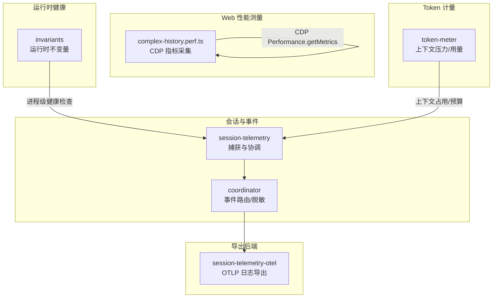
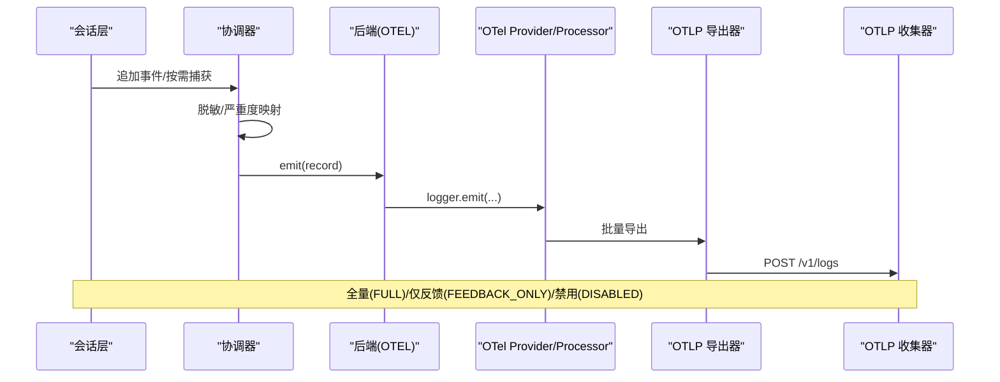
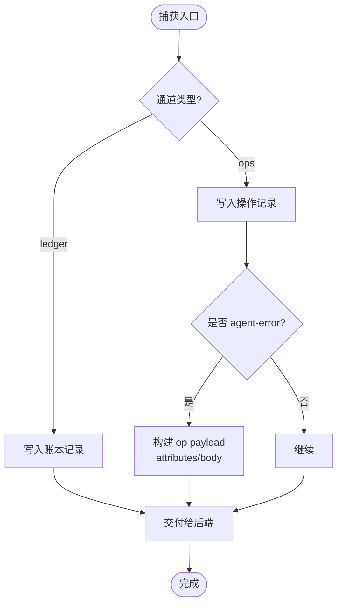
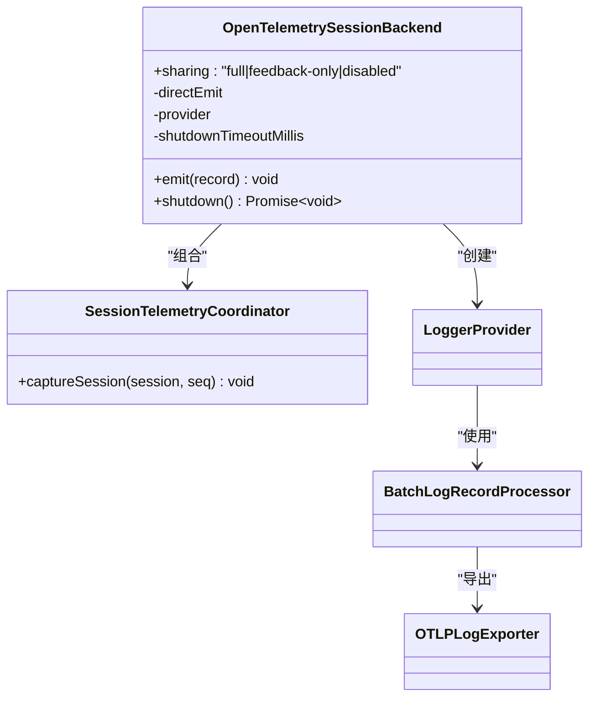
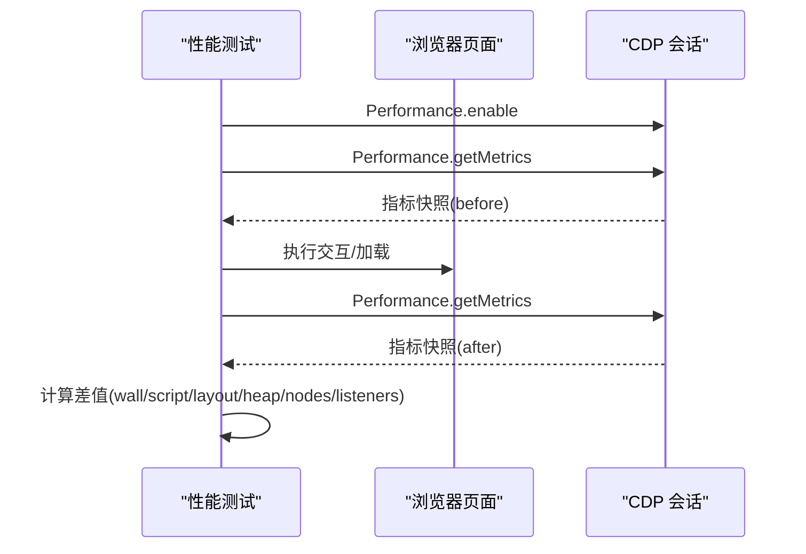
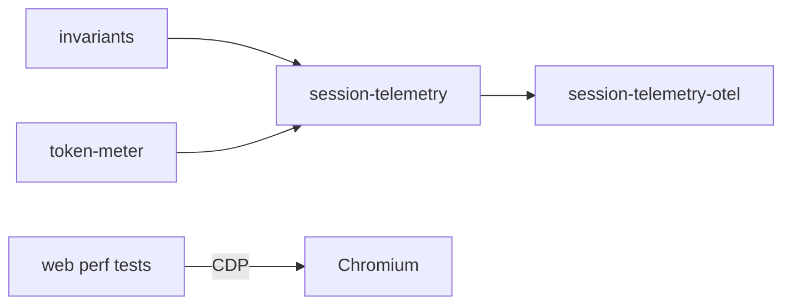

# 性能监控

<cite>
**本文引用的文件**
- [packages/session/session-telemetry/src/index.ts](file://packages/session/session-telemetry/src/index.ts)
- [packages/session/session-telemetry/src/coordinator.ts](file://packages/session/session-telemetry/src/coordinator.ts)
- [packages/session/session-telemetry-otel/src/index.ts](file://packages/session/session-telemetry-otel/src/index.ts)
- [apps/web/tests/complex-history.perf.ts](file://apps/web/tests/complex-history.perf.ts)
- [examples/headless-agent/tests/fixtures/session-telemetry-otel-driver.ts](file://examples/headless-agent/tests/fixtures/session-telemetry-otel-driver.ts)
- [packages/runtime-diagnostics/invariants/src/index.ts](file://packages/runtime-diagnostics/invariants/src/index.ts)
- [packages/llm/token-meter/tests/token-meter.spec.ts](file://packages/llm/token-meter/tests/token-meter.spec.ts)
- [packages/llm/token-meter/tests/token-usage-projection.spec.ts](file://packages/llm/token-meter/tests/token-usage-projection.spec.ts)
- [docs/subsystems/session-telemetry.md](file://docs/subsystems/session-telemetry.md)
</cite>

## 目录
1. [简介](#简介)
2. [项目结构](#项目结构)
3. [核心组件](#核心组件)
4. [架构总览](#架构总览)
5. [详细组件分析](#详细组件分析)
6. [依赖关系分析](#依赖关系分析)
7. [性能考量](#性能考量)
8. [故障排查指南](#故障排查指南)
9. [结论](#结论)
10. [附录](#附录)

## 简介
本文件面向生产与测试环境，系统化说明如何在 DeepSeek Harness 中设置和配置运行时诊断工具，覆盖 CPU、内存、网络延迟等关键指标的采集方式；文档化指标收集方法、仪表板配置思路与告警规则建议；并给出日志聚合、指标收集、异常检测的最佳实践，以及性能回归检测与持续监控的实现方案。

## 项目结构
本项目将“会话事件遥测”与“OpenTelemetry 后端”解耦：
- 会话侧负责捕获与脱敏（session-telemetry）
- OTLP 导出由 OpenTelemetry 后端实现（session-telemetry-otel）
- Web 端通过 CDP 抓取浏览器性能指标（复杂历史场景的 perf 测试）
- 运行期内在检查提供运行时不变量注册（runtime-diagnostics/invariants）
- Token 用量计量用于上下文窗口压力与成本估算（llm/token-meter）

图表来源
- [packages/session/session-telemetry/src/index.ts:1-179](file://packages/session/session-telemetry/src/index.ts#L1-L179)
- [packages/session/session-telemetry/src/coordinator.ts:228-268](file://packages/session/session-telemetry/src/coordinator.ts#L228-L268)
- [packages/session/session-telemetry-otel/src/index.ts:1-302](file://packages/session/session-telemetry-otel/src/index.ts#L1-L302)
- [apps/web/tests/complex-history.perf.ts:519-568](file://apps/web/tests/complex-history.perf.ts#L519-L568)
- [packages/runtime-diagnostics/invariants/src/index.ts:94-197](file://packages/runtime-diagnostics/invariants/src/index.ts#L94-L197)
- [packages/llm/token-meter/tests/token-meter.spec.ts:148-167](file://packages/llm/token-meter/tests/token-meter.spec.ts#L148-L167)

章节来源
- [packages/session/session-telemetry/src/index.ts:1-179](file://packages/session/session-telemetry/src/index.ts#L1-L179)
- [packages/session/session-telemetry-otel/src/index.ts:1-302](file://packages/session/session-telemetry-otel/src/index.ts#L1-L302)
- [apps/web/tests/complex-history.perf.ts:519-568](file://apps/web/tests/complex-history.perf.ts#L519-L568)
- [packages/runtime-diagnostics/invariants/src/index.ts:94-197](file://packages/runtime-diagnostics/invariants/src/index.ts#L94-L197)
- [packages/llm/token-meter/tests/token-meter.spec.ts:148-167](file://packages/llm/token-meter/tests/token-meter.spec.ts#L148-L167)

## 核心组件
- 会话遥测接口与会话记录模型：定义 channel、severity、attributes、body 等字段，明确“账本”与“操作”两类通道，以及 info/warn/error 三级严重度映射。
- 协调器：在会话追加或按需读取时，对记录进行脱敏与分发，并将 agent 错误等转为操作型记录。
- OTLP 后端：基于 OpenTelemetry JS SDK 的 LoggerProvider + BatchLogRecordProcessor + OTLPLogExporter，将记录映射为日志条目，支持 FULL/FEEDBACK_ONLY/DISABLED 三种模式，并在 shutdown 时带超时保护。
- Web 性能测量：通过 CDP 获取 Chromium 指标（TaskDuration、ScriptDuration、LayoutDuration、RecalcStyleDuration、JSHeapUsedSize、Nodes、JSEventListeners），计算差值以评估渲染与内存变化。
- 运行期内在检查：可配置的包级不变量注册与过滤，便于在生产开启关键契约校验。
- Token 计量：提供不可变测量结果，用于上下文窗口压力与用量统计。

章节来源
- [packages/session/session-telemetry/src/index.ts:47-179](file://packages/session/session-telemetry/src/index.ts#L47-L179)
- [packages/session/session-telemetry/src/coordinator.ts:228-268](file://packages/session/session-telemetry/src/coordinator.ts#L228-L268)
- [packages/session/session-telemetry-otel/src/index.ts:43-139](file://packages/session/session-telemetry-otel/src/index.ts#L43-L139)
- [apps/web/tests/complex-history.perf.ts:519-568](file://apps/web/tests/complex-history.perf.ts#L519-L568)
- [packages/runtime-diagnostics/invariants/src/index.ts:14-22](file://packages/runtime-diagnostics/invariants/src/index.ts#L14-L22)
- [packages/llm/token-meter/tests/token-meter.spec.ts:148-167](file://packages/llm/token-meter/tests/token-meter.spec.ts#L148-L167)

## 架构总览
下图展示了从会话事件捕获到 OTLP 导出的完整链路，以及 Web 端通过 CDP 采集浏览器性能指标的方式。

图表来源
- [packages/session/session-telemetry/src/coordinator.ts:228-268](file://packages/session/session-telemetry/src/coordinator.ts#L228-L268)
- [packages/session/session-telemetry-otel/src/index.ts:197-232](file://packages/session/session-telemetry-otel/src/index.ts#L197-L232)
- [examples/headless-agent/tests/fixtures/session-telemetry-otel-driver.ts:19-32](file://examples/headless-agent/tests/fixtures/session-telemetry-otel-driver.ts#L19-L32)

## 详细组件分析

### 会话遥测接口与会话记录
- 记录模型包含 channel（ledger/ops）、time、severity（info/warn/error）、attributes、body。
- 严重度在捕获阶段预映射，便于接收方零配置告警。
- 属性保持最小化，避免冗余；正文保留完整负载但受策略控制。

章节来源
- [packages/session/session-telemetry/src/index.ts:47-87](file://packages/session/session-telemetry/src/index.ts#L47-L87)

### 协调器：事件路由与异常隔离
- 将 agent 错误转换为 ops 记录，携带 session.id、agent.id、turn、step、error.name 等关键属性。
- 捕获步骤异常被包裹，确保不会阻塞主循环。

图表来源
- [packages/session/session-telemetry/src/coordinator.ts:228-268](file://packages/session/session-telemetry/src/coordinator.ts#L228-L268)

章节来源
- [packages/session/session-telemetry/src/coordinator.ts:228-268](file://packages/session/session-telemetry/src/coordinator.ts#L228-L268)

### OpenTelemetry 后端：模式、配置与关闭
- 模式：FULL（实时）、FEEDBACK_ONLY（仅在反馈时捕获）、DISABLED（本地）。
- 配置：exporter.url 必填（非 DISABLED），processor 透传至 SDK，shutdownTimeoutMillis 限制 provider 关闭耗时。
- 资源属性：service.name/version、user.id（匿名 ID）随批次发送。
- 关闭保护：provider.shutdown() 与自定义超时竞争，避免卡死。

图表来源
- [packages/session/session-telemetry-otel/src/index.ts:147-232](file://packages/session/session-telemetry-otel/src/index.ts#L147-L232)
- [packages/session/session-telemetry-otel/src/index.ts:283-298](file://packages/session/session-telemetry-otel/src/index.ts#L283-L298)

章节来源
- [packages/session/session-telemetry-otel/src/index.ts:43-139](file://packages/session/session-telemetry-otel/src/index.ts#L43-L139)
- [packages/session/session-telemetry-otel/src/index.ts:197-232](file://packages/session/session-telemetry-otel/src/index.ts#L197-L232)
- [packages/session/session-telemetry-otel/src/index.ts:283-298](file://packages/session/session-telemetry-otel/src/index.ts#L283-L298)

### Web 性能测量：CPU/内存/布局指标
- 通过 CDP 启用并读取 Performance.getMetrics，获取 TaskDuration、ScriptDuration、LayoutDuration、RecalcStyleDuration、DevToolsCommandDuration、JSHeapUsedSize、Nodes、JSEventListeners。
- 通过前后差值计算 wallMs、script/layout 耗时、节点数与监听器增量、堆内存增量等。
- 可用于长会话打开、流式输出、工具调用等场景的性能回归检测。

图表来源
- [apps/web/tests/complex-history.perf.ts:519-568](file://apps/web/tests/complex-history.perf.ts#L519-L568)

章节来源
- [apps/web/tests/complex-history.perf.ts:519-568](file://apps/web/tests/complex-history.perf.ts#L519-L568)

### 运行期内在检查：进程级健康与契约保障
- 提供 InvariantRegistry，支持全局开关与包名白名单/黑名单过滤。
- 违反不变量抛出 InvariantError，便于快速定位问题模块。
- 适合在生产开启关键契约校验，配合日志/告警系统形成闭环。

章节来源
- [packages/runtime-diagnostics/invariants/src/index.ts:14-22](file://packages/runtime-diagnostics/invariants/src/index.ts#L14-L22)
- [packages/runtime-diagnostics/invariants/src/index.ts:94-197](file://packages/runtime-diagnostics/invariants/src/index.ts#L94-L197)

### Token 计量：上下文窗口压力与用量
- measure 返回不可变对象，包含 baseline、surfaceDeltaTokens、totalTokens、surfaceTokens、nodes 等。
- 结合上下文窗口容量，可估算当前请求的占用比例，辅助容量规划与限流。

章节来源
- [packages/llm/token-meter/tests/token-meter.spec.ts:148-167](file://packages/llm/token-meter/tests/token-meter.spec.ts#L148-L167)

## 依赖关系分析
- session-telemetry 定义捕获侧契约，不关心下游批处理与传输。
- session-telemetry-otel 依赖 OpenTelemetry SDK，负责将记录映射为日志并通过 OTLP HTTP 导出。
- Web 性能测试独立于会话遥测，通过 CDP 直接访问浏览器内核指标。
- invariants 作为横切能力，可被任意包注册运行时检查。
- token-meter 提供用量与压力数据，供上层决策或展示。

图表来源
- [packages/session/session-telemetry/src/index.ts:1-179](file://packages/session/session-telemetry/src/index.ts#L1-L179)
- [packages/session/session-telemetry-otel/src/index.ts:1-302](file://packages/session/session-telemetry-otel/src/index.ts#L1-L302)
- [apps/web/tests/complex-history.perf.ts:519-568](file://apps/web/tests/complex-history.perf.ts#L519-L568)
- [packages/runtime-diagnostics/invariants/src/index.ts:94-197](file://packages/runtime-diagnostics/invariants/src/index.ts#L94-L197)
- [packages/llm/token-meter/tests/token-meter.spec.ts:148-167](file://packages/llm/token-meter/tests/token-meter.spec.ts#L148-L167)

章节来源
- [packages/session/session-telemetry/src/index.ts:1-179](file://packages/session/session-telemetry/src/index.ts#L1-L179)
- [packages/session/session-telemetry-otel/src/index.ts:1-302](file://packages/session/session-telemetry-otel/src/index.ts#L1-L302)
- [apps/web/tests/complex-history.perf.ts:519-568](file://apps/web/tests/complex-history.perf.ts#L519-L568)
- [packages/runtime-diagnostics/invariants/src/index.ts:94-197](file://packages/runtime-diagnostics/invariants/src/index.ts#L94-L197)
- [packages/llm/token-meter/tests/token-meter.spec.ts:148-167](file://packages/llm/token-meter/tests/token-meter.spec.ts#L148-L167)

## 性能考量
- 采集开销控制
  - 协调器 emit 必须非阻塞，仅入队；避免影响会话热路径。
  - OTLP 后端采用批量处理器，按 SDK 调度周期导出，减少网络抖动。
- 关闭与资源释放
  - provider.shutdown() 有外部超时保护，防止因网络拥塞导致进程挂起。
- 指标粒度与精度
  - Web CDP 指标为浏览器内核级度量，适合做端到端性能基线对比。
  - Token 计量用于上下文窗口压力估算，注意其近似性。
- 生产部署建议
  - 默认禁用遥测（DISABLED），仅在需要时开启 FULL 或 FEEDBACK_ONLY。
  - exporter.url 必须为 http(s)，且需具备鉴权与限流策略。
  - processor.maxExportBatchSize 必须为正整数，避免队列堆积。

[本节为通用指导，无需特定文件引用]

## 故障排查指南
- 遥测未上报
  - 检查 mode 是否为 DISABLED；若为 FEEDBACK_ONLY，确认是否存在 feedback/record 事件。
  - 验证 exporter.url 是否有效且可达；headers 是否正确。
  - 查看协调器日志中的捕获失败警告。
- 关闭卡顿
  - 关注 shutdownTimeoutMillis 是否过小；必要时调大。
  - 检查网络出口与代理配置，确保 OTLP 端口可达。
- 指标缺失
  - Web 性能测试需先 enable Performance API，再读取指标。
  - 某些指标可能不可用，需在代码中做存在性检查。
- 不变量触发
  - 根据 InvariantError 的 packageName 定位问题模块，修复契约违规。

章节来源
- [packages/session/session-telemetry-otel/src/index.ts:170-195](file://packages/session/session-telemetry-otel/src/index.ts#L170-L195)
- [packages/session/session-telemetry-otel/src/index.ts:283-298](file://packages/session/session-telemetry-otel/src/index.ts#L283-L298)
- [apps/web/tests/complex-history.perf.ts:519-568](file://apps/web/tests/complex-history.perf.ts#L519-L568)
- [packages/runtime-diagnostics/invariants/src/index.ts:49-66](file://packages/runtime-diagnostics/invariants/src/index.ts#L49-L66)

## 结论
DeepSeek Harness 提供了可扩展的会话事件遥测与浏览器性能测量能力。通过协调器与 OTLP 后端的解耦设计，既能满足生产环境的低侵入采集，也能在测试环境中灵活回放与断言。配合运行期内在检查与 Token 计量，可构建完整的性能与健康观测体系。建议在生产默认禁用遥测，按需开启并严格配置导出端点与关闭超时，同时建立基于指标与日志的告警与回归检测流程。

[本节为总结，无需特定文件引用]

## 附录

### 运行时诊断工具设置与配置清单
- 会话遥测模式
  - FULL：实时导出所有会话事件
  - FEEDBACK_ONLY：仅在用户反馈时导出
  - DISABLED：本地保留，不上报
- OTLP 导出配置
  - exporter.url：必填（非 DISABLED），http(s) 协议
  - processor：透传给 SDK，如 maxExportBatchSize、scheduledDelayMillis
  - shutdownTimeoutMillis：provider 关闭超时上限
- Web 性能测量
  - 通过 CDP 启用 Performance API 并读取指标
  - 计算前后差值，监控 script/layout/heap/nodes/listeners 等
- 运行期内在检查
  - enabled：全局开关
  - package_allowlist/package_blocklist：包名过滤
- Token 计量
  - 使用 measure 获取不可变用量与压力数据

章节来源
- [packages/session/session-telemetry-otel/src/index.ts:43-139](file://packages/session/session-telemetry-otel/src/index.ts#L43-L139)
- [packages/runtime-diagnostics/invariants/src/index.ts:14-22](file://packages/runtime-diagnostics/invariants/src/index.ts#L14-L22)
- [apps/web/tests/complex-history.perf.ts:519-568](file://apps/web/tests/complex-history.perf.ts#L519-L568)
- [packages/llm/token-meter/tests/token-meter.spec.ts:148-167](file://packages/llm/token-meter/tests/token-meter.spec.ts#L148-L167)

### 指标收集方法与仪表板配置建议
- 指标类别
  - 浏览器性能：TaskDuration、ScriptDuration、LayoutDuration、RecalcStyleDuration、JSHeapUsedSize、Nodes、JSEventListeners
  - 会话事件：channel=ledger/ops，severity=info/warn/error，attributes 含 session/agent/turn/step 等
  - Token 用量：baseline、surfaceDeltaTokens、totalTokens、surfaceTokens
- 仪表板维度
  - 按 session.id、event.type、telemetry.op 分组
  - 按 severity 过滤 error/warn 事件
  - 按时间窗口观察 script/layout/heap 趋势
- 告警规则建议
  - error 级别事件突增
  - ScriptDuration/LayoutDuration 显著上升
  - JSHeapUsedSize 持续增长
  - Nodes/JSEventListeners 异常增长
  - Token 压力接近上下文窗口上限

[本节为概念性内容，无需特定文件引用]

### 生产环境最佳实践
- 日志聚合
  - 统一接入 OTLP 收集器，集中存储与检索
  - 对敏感字段实施脱敏策略（在 session-telemetry/record 管道中挂载规则）
- 指标收集
  - 默认禁用遥测，按需开启；严格校验 exporter.url 与 batch size
  - 使用 CDP 指标做端到端性能基线，定期回归
- 异常检测
  - 基于 severity=error 的事件与 invariants 抛错快速定位
  - 结合 Token 计量与上下文窗口容量，预测过载风险

章节来源
- [packages/session/session-telemetry/src/index.ts:24-44](file://packages/session/session-telemetry/src/index.ts#L24-L44)
- [packages/session/session-telemetry-otel/src/index.ts:197-232](file://packages/session/session-telemetry-otel/src/index.ts#L197-L232)
- [packages/runtime-diagnostics/invariants/src/index.ts:94-197](file://packages/runtime-diagnostics/invariants/src/index.ts#L94-L197)

### 性能回归检测与持续监控
- 回归检测
  - 在复杂历史场景下，比较打开长会话、继续对话、流式输出的 wall/script/layout/heap 差值
  - 设定阈值，超过则标记为回归
- 持续监控
  - 将 OTLP 日志接入监控系统，建立告警规则
  - 定期运行性能测试，产出报告并归档

章节来源
- [apps/web/tests/complex-history.perf.ts:519-568](file://apps/web/tests/complex-history.perf.ts#L519-L568)
- [examples/headless-agent/tests/fixtures/session-telemetry-otel-driver.ts:19-32](file://examples/headless-agent/tests/fixtures/session-telemetry-otel-driver.ts#L19-L32)