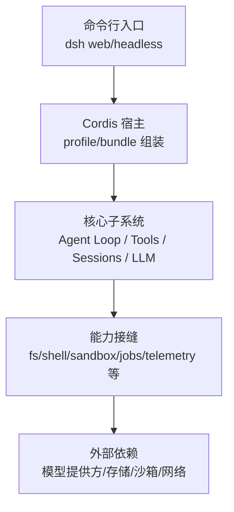
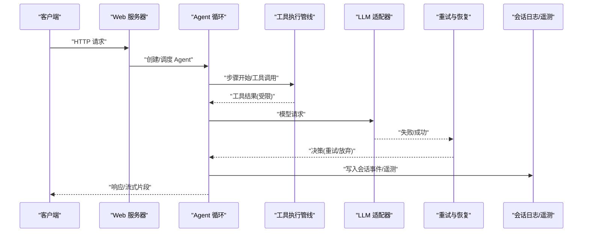
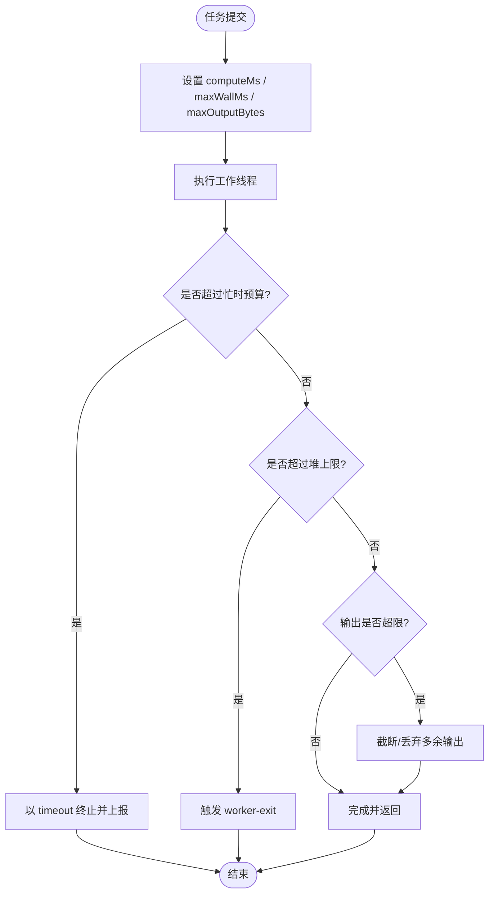
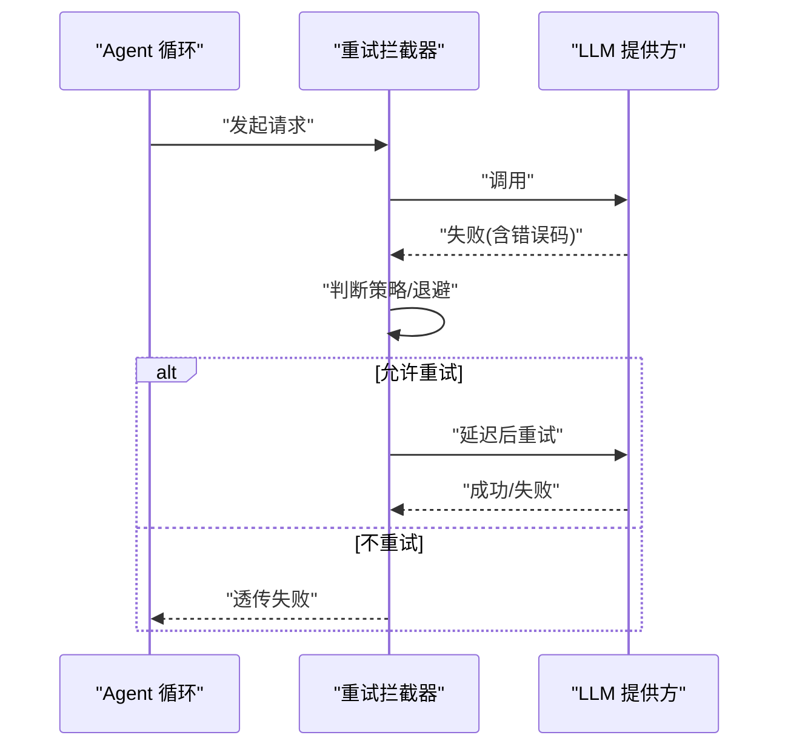
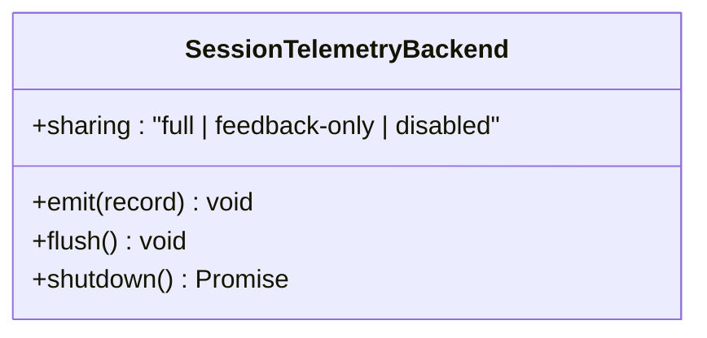
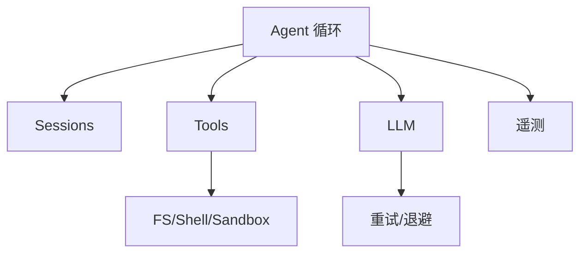

# 生产环境性能

<cite>
**本文引用的文件**
- [package.json](file://package.json)
- [README.md](file://README.md)
- [架构文档](file://docs/architecture.md)
- [配置目录](file://docs/config-catalog.md)
- [代码运行时工作线程配置](file://packages/code-runtime/code-runtime-worker-thread/src/index.ts)
- [LLM 重试策略](file://packages/llm/llm/src/retry-policy.ts)
- [LLM 重试实现](file://packages/llm/llm-retry/src/index.ts)
- [会话遥测后端接口](file://packages/session/session-telemetry/src/index.ts)
- [CLI 遥测开关测试](file://apps/cli/tests/telemetry-switch.spec.ts)
- [Web 服务器已知限制说明](file://packages/host/webserver/README.md)
- [连接与信任主机配置](file://packages/client/connection/src/index.ts)
- [工具搜索资源限制应用](file://packages/fs/tool-fs-search/src/index.ts)
- [目标域默认轮次配置](file://packages/goal/goal/src/index.ts)
- [工作流执行器上限校验](file://packages/workflow/workflow-worker-thread/tests/workflow-worker-thread.spec.ts)
- [原生构建矩阵脚本](file://native/landlock-run/scripts/github-matrix.mjs)
- [原生静态构建脚本](file://native/landlock-run/scripts/build.ts)
</cite>

## 目录
1. [简介](#简介)
2. [项目结构](#项目结构)
3. [核心组件](#核心组件)
4. [架构总览](#架构总览)
5. [详细组件分析](#详细组件分析)
6. [依赖关系分析](#依赖关系分析)
7. [性能考量](#性能考量)
8. [故障排查指南](#故障排查指南)
9. [结论](#结论)
10. [附录](#附录)

## 简介
本文件面向生产环境的性能优化，围绕资源限制、负载均衡、故障恢复、容器化部署（Docker/Kubernetes）、容量规划、弹性伸缩与可观测性等方面，结合仓库中已有的插件化能力、配置体系与运行边界控制，给出可落地的实践建议。内容基于仓库内可验证的配置项、错误恢复机制与遥测能力进行组织，避免空泛描述。

## 项目结构
DeepSeek Harness 采用“一切皆插件”的架构，通过 Cordis 在启动时按层组合 profile/bundle，形成可替换的服务树。关键要点：
- 插件即服务：模型适配器、工具注册表、会话日志、Agent 循环等均可由配置替换。
- 配置即能力：任何需要跨部署差异化的值都应暴露为配置字段，禁止硬编码。
- 事件驱动：session/agent/capability 三类事件贯穿系统，便于扩展与观测。
- 生成式配置目录：所有可配置的插件字段集中在配置目录中，便于部署侧查阅与校验。

**章节来源**
- [架构文档:9-37](file://docs/architecture.md#L9-L37)
- [配置目录:1-10](file://docs/config-catalog.md#L1-L10)

## 核心组件
- 执行预算与资源限制
  - 代码执行工作线程提供 computeMs、maxWallMs、maxOutputBytes、maxOldGenerationSizeMb 等边界，防止单任务拖垮进程。
- 请求级故障恢复
  - LLM 重试模块支持 always/normal 模式、可配置退避与抖动，屏蔽瞬时失败。
- 会话遥测与隐私开关
  - 会话遥测后端抽象出 sharing 策略，CLI 提供一键关闭遥测的能力，满足合规与成本约束。
- Web 网关与安全边界
  - Web 服务器仅绑定 host/port；对外暴露需通过 trustedHosts 白名单与请求体大小限制。
- 工具与 I/O 资源保护
  - 文件搜索/匹配等工具具备超时、输出字节、元数据大小等限制，避免资源滥用。
- 目标与工作流上限
  - 目标创建默认轮次上限、工作流 per-run 最大 Agent 数等，防止并发失控。

**章节来源**
- [代码运行时工作线程配置:24-54](file://packages/code-runtime/code-runtime-worker-thread/src/index.ts#L24-L54)
- [LLM 重试策略:123-156](file://packages/llm/llm/src/retry-policy.ts#L123-L156)
- [LLM 重试实现:99-179](file://packages/llm/llm-retry/src/index.ts#L99-L179)
- [会话遥测后端接口:133-178](file://packages/session/session-telemetry/src/index.ts#L133-L178)
- [CLI 遥测开关测试:1-22](file://apps/cli/tests/telemetry-switch.spec.ts#L1-L22)
- [连接与信任主机配置:46-67](file://packages/client/connection/src/index.ts#L46-L67)
- [工具搜索资源限制应用:141-160](file://packages/fs/tool-fs-search/src/index.ts#L141-L160)
- [目标域默认轮次配置:115-155](file://packages/goal/goal/src/index.ts#L115-L155)
- [工作流执行器上限校验:285-312](file://packages/workflow/workflow-worker-thread/tests/workflow-worker-thread.spec.ts#L285-L312)

## 架构总览
下图展示从请求进入、Agent 循环到工具执行与 LLM 调用的主路径，并标注了可观测与限流点。

**图表来源**
- [架构文档:63-90](file://docs/architecture.md#L63-L90)
- [LLM 重试实现:99-179](file://packages/llm/llm-retry/src/index.ts#L99-L179)
- [会话遥测后端接口:133-178](file://packages/session/session-telemetry/src/index.ts#L133-L178)

## 详细组件分析

### 执行预算与内存隔离（代码执行工作线程）
- 关键指标
  - computeMs：基于事件循环活跃时间的“忙时”预算，公平且不可作弊。
  - maxWallMs：绝对墙钟上限，兜底无法被忙时捕获的挂起。
  - maxOutputBytes：序列化负载上限，防止大对象阻塞。
  - maxOldGenerationSizeMb：堆上限，溢出直接终止 worker，转为明确退出事件。
- 生产建议
  - 根据任务类型设置 computeMs/maxWallMs，避免长耗时任务阻塞队列。
  - 对大输出场景严格限制 maxOutputBytes，必要时分片或落盘。
  - 将 maxOldGenerationSizeMb 与容器内存限制联动，确保 OOM Kill 可控。

**图表来源**
- [代码运行时工作线程配置:24-54](file://packages/code-runtime/code-runtime-worker-thread/src/index.ts#L24-L54)

**章节来源**
- [代码运行时工作线程配置:24-54](file://packages/code-runtime/code-runtime-worker-thread/src/index.ts#L24-L54)

### 请求级故障恢复（LLM 重试）
- 策略
  - always：始终尝试下游恢复，若下游决定重试则继续。
  - normal：仅对可重试错误码进行恢复。
  - 退避：初始延迟、最大延迟、抖动比例均受校验。
- 生产建议
  - 针对不稳定网络/上游限流启用 always 模式，配合合理退避。
  - 对幂等请求谨慎使用 always，避免放大流量。
  - 监控重试次数与失败率，设置告警阈值。

**图表来源**
- [LLM 重试实现:99-179](file://packages/llm/llm-retry/src/index.ts#L99-L179)
- [LLM 重试策略:123-156](file://packages/llm/llm/src/retry-policy.ts#L123-L156)

**章节来源**
- [LLM 重试实现:99-179](file://packages/llm/llm-retry/src/index.ts#L99-L179)
- [LLM 重试策略:123-156](file://packages/llm/llm/src/retry-policy.ts#L123-L156)

### 可观测性与隐私（会话遥测）
- 能力
  - 后端抽象共享策略 full/feedback-only/disabled，供 UI 披露。
  - CLI 支持一键禁用遥测（非空值即禁用），满足合规需求。
- 生产建议
  - 生产默认 disabled 或 feedback-only，按需开启 full。
  - 对遥测管道做 flush/shutdown 保障，避免丢失关键记录。
  - 将遥测指标纳入整体 SLO 看板（延迟、错误、吞吐）。

**图表来源**
- [会话遥测后端接口:133-178](file://packages/session/session-telemetry/src/index.ts#L133-L178)
- [CLI 遥测开关测试:1-22](file://apps/cli/tests/telemetry-switch.spec.ts#L1-L22)

**章节来源**
- [会话遥测后端接口:133-178](file://packages/session/session-telemetry/src/index.ts#L133-L178)
- [CLI 遥测开关测试:1-22](file://apps/cli/tests/telemetry-switch.spec.ts#L1-L22)

### Web 网关与访问控制
- 限制
  - 内置 Web 服务器无 TLS/鉴权/源策略，绑定 host/port 即可；对外暴露需前置反向代理。
  - trustedHosts 白名单拒绝非预期 Host 头；maxRequestBodyBytes 限制请求体大小。
- 生产建议
  - 生产必须置于反向代理之后，启用 TLS、鉴权、速率限制。
  - 严格配置 trustedHosts，避免误开放。
  - 结合 WAF/网关做请求体与频率防护。

**图表来源**
- [Web 服务器已知限制说明:19-23](file://packages/host/webserver/README.md#L19-L23)
- [连接与信任主机配置:46-67](file://packages/client/connection/src/index.ts#L46-L67)

**章节来源**
- [Web 服务器已知限制说明:19-23](file://packages/host/webserver/README.md#L19-L23)
- [连接与信任主机配置:46-67](file://packages/client/connection/src/index.ts#L46-L67)

### 工具与 I/O 资源保护
- 关键点
  - 文件搜索/匹配工具统一注入超时、输出字节、元数据大小、grace 期等限制。
  - Bash 执行具备超时、输出 spill、grace 期等保护。
- 生产建议
  - 为不同租户/任务设定差异化配额，避免热点查询打满 CPU/IO。
  - 对大目录扫描限制采样与结果条数，必要时异步化。

**章节来源**
- [工具搜索资源限制应用:141-160](file://packages/fs/tool-fs-search/src/index.ts#L141-L160)
- [配置目录:343-367](file://docs/config-catalog.md#L343-L367)

### 并发与上限控制（目标/工作流）
- 目标域
  - 默认最大轮次可通过配置覆盖，防止无限循环。
- 工作流
  - per-run 最大 Agent 数受引擎上限保护，非法值直接拒绝。
- 生产建议
  - 依据业务峰值与资源池设定上限，预留安全余量。
  - 对批量任务采用排队与背压，避免雪崩。

**章节来源**
- [目标域默认轮次配置:115-155](file://packages/goal/goal/src/index.ts#L115-L155)
- [工作流执行器上限校验:285-312](file://packages/workflow/workflow-worker-thread/tests/workflow-worker-thread.spec.ts#L285-L312)

## 依赖关系分析
- 插件间耦合
  - Agent 循环依赖 sessions、tools、llm、systemPrompt；各子系统通过事件解耦。
  - 遥测、重试、工具执行均为可选能力，通过配置挂载/卸载。
- 外部依赖
  - LLM 提供方、文件系统、沙箱、子进程等通过能力接缝替换，便于在不同环境切换。

**图表来源**
- [架构文档:39-61](file://docs/architecture.md#L39-L61)

**章节来源**
- [架构文档:39-61](file://docs/architecture.md#L39-L61)

## 性能考量
- 资源限制与隔离
  - 使用 computeMs/maxWallMs/maxOutputBytes/maxOldGenerationSizeMb 控制单任务资源占用。
  - 将工作线程堆上限与容器内存限制对齐，确保 OOM 行为可预测。
- 负载均衡与弹性
  - 通过多实例横向扩展，结合反向代理做健康检查与权重路由。
  - 利用工作流/Agent 上限与队列背压，削峰填谷。
- 故障恢复
  - 对不稳定上游启用重试与退避，区分幂等与非幂等请求。
  - 对关键路径增加熔断/降级策略（如跳过非核心工具）。
- 可观测性
  - 启用最小必要遥测，采集延迟、错误、吞吐、重试次数、资源使用率。
  - 建立 SLO 与告警，覆盖端到端链路。
- 容器化与编排
  - Docker 镜像：精简基础镜像、多阶段构建、仅拷贝产物、固定 Node 版本。
  - Kubernetes：合理设置 requests/limits、HPA 基于 CPU/内存/自定义指标、PodDisruptionBudget 保证可用性。
- 容量规划
  - 基于历史峰值与增长趋势评估 QPS、CPU、内存、磁盘 IO 与模型调用限额。
  - 预留 20%-30% 冗余，应对突发流量与模型方限流。
- 最佳实践
  - 配置即能力：所有可调参数外置，禁止硬编码。
  - 失败快速：超时、限流、熔断、降级四件套。
  - 渐进发布：灰度/蓝绿发布，结合指标回滚。

[本节为通用指导，不直接分析具体文件]

## 故障排查指南
- 常见问题定位
  - 任务超时：检查 computeMs/maxWallMs 与上游响应时间，必要时调整或拆分任务。
  - 内存溢出：核对 maxOldGenerationSizeMb 与容器 limits，关注堆快照与 GC 日志。
  - 重试风暴：检查重试策略与退避参数，降低抖动与并发重试。
  - 请求过大：收紧 maxRequestBodyBytes 与工具输出限制，避免反压失效。
  - 遥测缺失：确认遥测后端已挂载且未被关闭，检查 flush/shutdown 流程。
- 工具与命令
  - 使用 dsh --dump-config 查看实际装配树与生效配置。
  - 通过 session 事件与遥测指标定位慢步骤与异常路径。
  - 结合系统工具（top/htop、pidstat、perf、node --prof）定位 CPU/IO/JS 热点。

**章节来源**
- [架构文档:29-37](file://docs/architecture.md#L29-L37)
- [会话遥测后端接口:133-178](file://packages/session/session-telemetry/src/index.ts#L133-L178)

## 结论
本仓库提供了完善的生产可用基线：插件化架构、严格的资源边界、可插拔的重试与遥测、以及清晰的配置目录。生产落地应围绕“可观测、可限制、可恢复、可扩展”四个维度，结合容器与编排能力，持续校准容量与弹性策略，确保在高负载下稳定交付。

## 附录
- 构建与平台矩阵
  - 原生二进制构建矩阵与 CI 矩阵由脚本集中管理，新增平台仅需更新 prebuilds.json。
  - 静态 musl 构建确保产物自包含，减少运行时依赖风险。

**章节来源**
- [原生构建矩阵脚本:1-66](file://native/landlock-run/scripts/github-matrix.mjs#L1-L66)
- [原生静态构建脚本:40-86](file://native/landlock-run/scripts/build.ts#L40-L86)