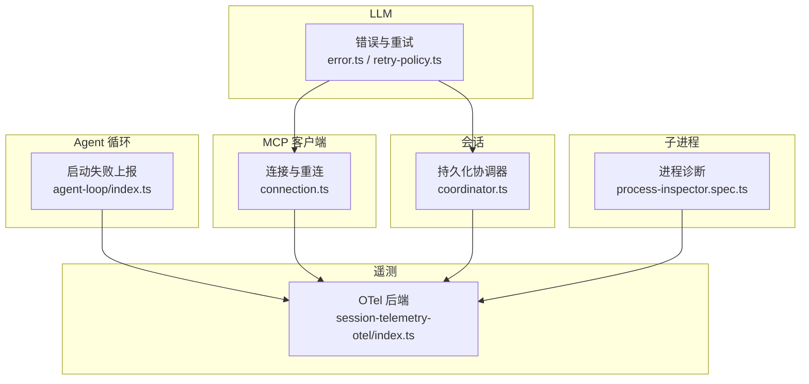
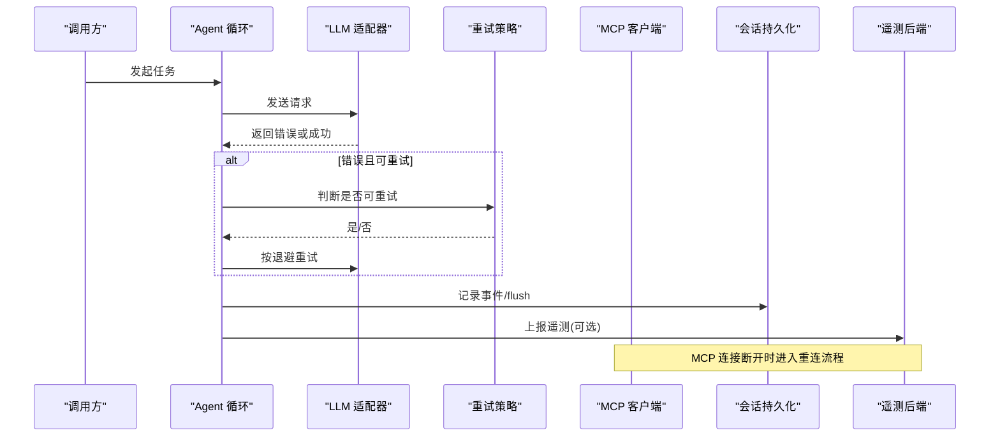
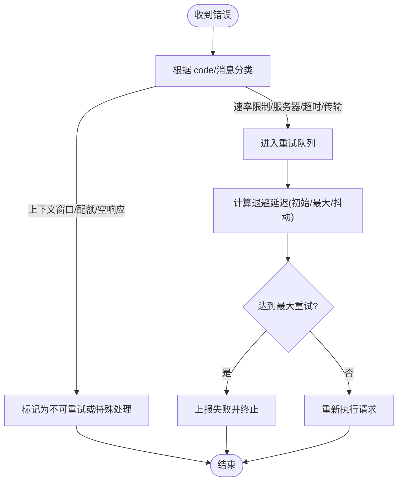
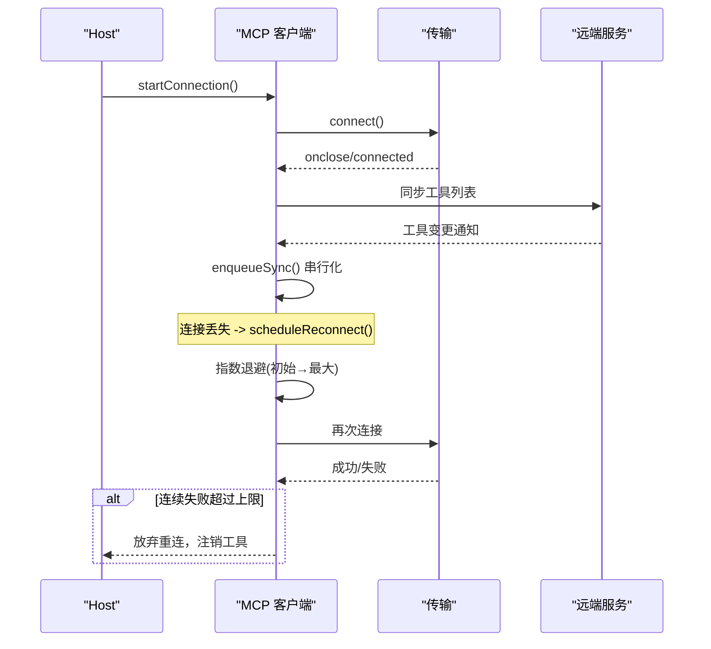
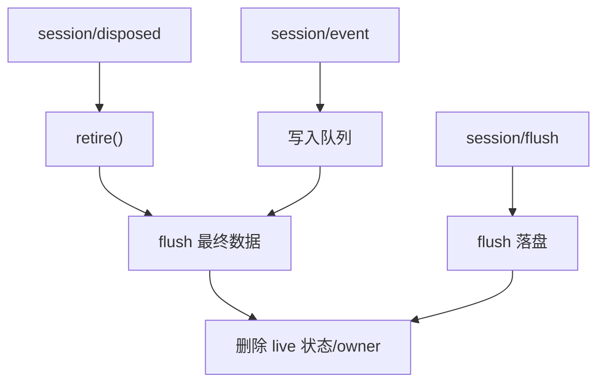
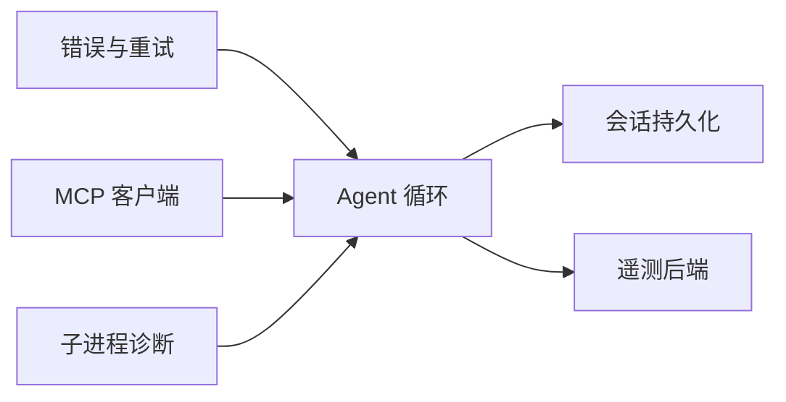

# 故障排除

<cite>
**本文引用的文件**
- [packages/llm/llm/src/error.ts](file://packages/llm/llm/src/error.ts)
- [packages/llm/llm/src/retry-policy.ts](file://packages/llm/llm/src/retry-policy.ts)
- [packages/mcp/mcp-client/src/connection.ts](file://packages/mcp/mcp-client/src/connection.ts)
- [packages/session/session-persistence/src/coordinator.ts](file://packages/session/session-persistence/src/coordinator.ts)
- [packages/core/agent-loop/src/index.ts](file://packages/core/agent-loop/src/index.ts)
- [packages/session/session-telemetry-otel/src/index.ts](file://packages/session/session-telemetry-otel/src/index.ts)
- [packages/subprocess/subprocess-local/tests/process-inspector.spec.ts](file://packages/subprocess/subprocess-local/tests/process-inspector.spec.ts)
</cite>

## 目录
1. [简介](#简介)
2. [项目结构](#项目结构)
3. [核心组件](#核心组件)
4. [架构总览](#架构总览)
5. [详细组件分析](#详细组件分析)
6. [依赖关系分析](#依赖关系分析)
7. [性能注意事项](#性能注意事项)
8. [故障排查指南](#故障排查指南)
9. [结论](#结论)
10. [附录](#附录)

## 简介
本指南面向使用 deepseek-harness 的工程师与运维人员，聚焦“如何快速定位并解决问题”。内容覆盖：
- 常见错误分类、错误信息解读与诊断方法
- 网络问题（MCP 连接）排查与恢复策略
- 性能瓶颈分析与优化建议
- 内存泄漏检测与调试方法
- 日志与遥测采集、分析和问题定位工具
- 已知问题与临时解决方案
- 社区支持与问题报告模板

## 项目结构
本项目采用多包（monorepo）组织，关键子系统包括：
- LLM 层：错误模型、重试策略、上下文窗口/配额判定
- MCP 客户端：连接生命周期、自动重连、工具同步
- 会话持久化：会话创建、写入、回收与冲突处理
- Agent 循环：配置驱动的启动失败上报
- 遥测后端：OpenTelemetry 集成、模式控制、关闭超时
- 子进程诊断：Linux 下等待状态检测（stdin 等待等）

**图示来源**
- [packages/llm/llm/src/error.ts:1-164](file://packages/llm/llm/src/error.ts#L1-L164)
- [packages/llm/llm/src/retry-policy.ts:1-192](file://packages/llm/llm/src/retry-policy.ts#L1-L192)
- [packages/mcp/mcp-client/src/connection.ts:1-352](file://packages/mcp/mcp-client/src/connection.ts#L1-L352)
- [packages/session/session-persistence/src/coordinator.ts:1077-1182](file://packages/session/session-persistence/src/coordinator.ts#L1077-L1182)
- [packages/core/agent-loop/src/index.ts:384-404](file://packages/core/agent-loop/src/index.ts#L384-L404)
- [packages/session/session-telemetry-otel/src/index.ts:1-302](file://packages/session/session-telemetry-otel/src/index.ts#L1-L302)
- [packages/subprocess/subprocess-local/tests/process-inspector.spec.ts:127-157](file://packages/subprocess/subprocess-local/tests/process-inspector.spec.ts#L127-L157)

**章节来源**
- [packages/llm/llm/src/error.ts:1-164](file://packages/llm/llm/src/error.ts#L1-L164)
- [packages/llm/llm/src/retry-policy.ts:1-192](file://packages/llm/llm/src/retry-policy.ts#L1-L192)
- [packages/mcp/mcp-client/src/connection.ts:1-352](file://packages/mcp/mcp-client/src/connection.ts#L1-L352)
- [packages/session/session-persistence/src/coordinator.ts:1077-1182](file://packages/session/session-persistence/src/coordinator.ts#L1077-L1182)
- [packages/core/agent-loop/src/index.ts:384-404](file://packages/core/agent-loop/src/index.ts#L384-L404)
- [packages/session/session-telemetry-otel/src/index.ts:1-302](file://packages/session/session-telemetry-otel/src/index.ts#L1-L302)
- [packages/subprocess/subprocess-local/tests/process-inspector.spec.ts:127-157](file://packages/subprocess/subprocess-local/tests/process-inspector.spec.ts#L127-L157)

## 核心组件
- 结构化错误体系
  - 提供统一基类与稳定 code，便于跨 seam 路由与重试决策。
  - 支持 cause 链与 AggregateError 成员渲染，避免底层异常被掩盖。
  - 内置上下文窗口超限、配额耗尽、空响应等语义识别。
- 重试策略
  - 支持 normal（有限次重试，基于可重试 code）与 always（无限重试直到取消/销毁）。
  - 指数退避 + 抖动，带边界校验与默认值。
- MCP 连接管理
  - 自动重连、预算上限、稳定性窗口重置、工具列表同步。
  - 失败时注销工具并停止重试，需重载插件或重启 Host 恢复。
- 会话持久化
  - 会话创建、事件落盘、flush 屏障、回收与冲突保护。
  - 冷加载保留 ID、替换生命周期中的竞态防护。
- Agent 循环启动失败上报
  - 将配置驱动的 restore/resume 失败以结构化方式上报给监听者。
- 遥测后端
  - 三种模式：FULL、FEEDBACK_ONLY、DISABLED；导出到 OTLP 收集器。
  - 关闭超时保护，防止 SDK 阻塞进程退出。
- 子进程诊断
  - Linux 下通过 /proc 检测子进程是否阻塞在 stdin 等待等系统调用。

**章节来源**
- [packages/llm/llm/src/error.ts:1-164](file://packages/llm/llm/src/error.ts#L1-L164)
- [packages/llm/llm/src/retry-policy.ts:1-192](file://packages/llm/llm/src/retry-policy.ts#L1-L192)
- [packages/mcp/mcp-client/src/connection.ts:1-352](file://packages/mcp/mcp-client/src/connection.ts#L1-L352)
- [packages/session/session-persistence/src/coordinator.ts:1077-1182](file://packages/session/session-persistence/src/coordinator.ts#L1077-L1182)
- [packages/core/agent-loop/src/index.ts:384-404](file://packages/core/agent-loop/src/index.ts#L384-L404)
- [packages/session/session-telemetry-otel/src/index.ts:1-302](file://packages/session/session-telemetry-otel/src/index.ts#L1-L302)
- [packages/subprocess/subprocess-local/tests/process-inspector.spec.ts:127-157](file://packages/subprocess/subprocess-local/tests/process-inspector.spec.ts#L127-L157)

## 架构总览
下图展示从请求到重试、重连、持久化与遥测的关键路径，以及错误如何被捕获、分类与上报。

**图示来源**
- [packages/core/agent-loop/src/index.ts:384-404](file://packages/core/agent-loop/src/index.ts#L384-L404)
- [packages/llm/llm/src/retry-policy.ts:105-192](file://packages/llm/llm/src/retry-policy.ts#L105-L192)
- [packages/mcp/mcp-client/src/connection.ts:192-225](file://packages/mcp/mcp-client/src/connection.ts#L192-L225)
- [packages/session/session-persistence/src/coordinator.ts:1122-1137](file://packages/session/session-persistence/src/coordinator.ts#L1122-L1137)
- [packages/session/session-telemetry-otel/src/index.ts:221-252](file://packages/session/session-telemetry-otel/src/index.ts#L221-L252)

## 详细组件分析

### 错误与重试（LLM）
- 错误分类与渲染
  - 统一的 HarnessError 携带稳定 code，便于下游按码路由。
  - errorChain 能展开 cause 链与 AggregateError 成员，输出可读的诊断文本。
  - 内置 isContextWindowExceededError、isQuotaExceededError 识别特定业务错误。
- 重试策略
  - normal 模式：仅对指定 code 重试，限制最大次数，指数退避+抖动。
  - always 模式：无界重试，适合幂等或可恢复场景。
  - 参数严格校验，未知键直接报错，避免静默忽略。

**图示来源**
- [packages/llm/llm/src/error.ts:102-164](file://packages/llm/llm/src/error.ts#L102-L164)
- [packages/llm/llm/src/retry-policy.ts:105-192](file://packages/llm/llm/src/retry-policy.ts#L105-L192)

**章节来源**
- [packages/llm/llm/src/error.ts:1-164](file://packages/llm/llm/src/error.ts#L1-L164)
- [packages/llm/llm/src/retry-policy.ts:1-192](file://packages/llm/llm/src/retry-policy.ts#L1-L192)

### MCP 连接与重连
- 连接生命周期
  - 首次连接成功后注册工具；后续工具变更通知触发重同步。
  - 连接丢失后按指数退避重连，超过 maxAttempts 则放弃并重载/重启。
- 稳定性窗口
  - 若连接存活超过 maxDelayMs，视为一次新的断线周期，失败计数重置。
- 资源清理
  - 每代 client/close 信号有超时保护，避免僵尸进程；dispose 会等待并释放所有工具。

**图示来源**
- [packages/mcp/mcp-client/src/connection.ts:123-352](file://packages/mcp/mcp-client/src/connection.ts#L123-L352)

**章节来源**
- [packages/mcp/mcp-client/src/connection.ts:1-352](file://packages/mcp/mcp-client/src/connection.ts#L1-L352)

### 会话持久化协调器
- 写入路径
  - 监听 session/event，入队写缓冲；flush 作为即时持久化屏障。
- 回收路径
  - 会话 dispose 触发 retire，flush 后清理状态；失败以 warn 记录。
- 冲突与竞态
  - 冷加载保留 ID；替换生命周期中 pending drain 的精确守卫，避免误删后继者。

**图示来源**
- [packages/session/session-persistence/src/coordinator.ts:1122-1182](file://packages/session/session-persistence/src/coordinator.ts#L1122-L1182)

**章节来源**
- [packages/session/session-persistence/src/coordinator.ts:1077-1182](file://packages/session/session-persistence/src/coordinator.ts#L1077-L1182)

### Agent 循环启动失败上报
- 当配置驱动的 restore/resume 失败时，记录警告并通过事件派发，供外部监听者处理。
- 使用 errorChain 渲染 cause 链，确保底层原因可见。

**章节来源**
- [packages/core/agent-loop/src/index.ts:384-404](file://packages/core/agent-loop/src/index.ts#L384-L404)

### 遥测后端（OpenTelemetry）
- 模式
  - FULL：实时记录全部会话事件；FEEDBACK_ONLY：仅在反馈事件上按需捕获；DISABLED：本地丢弃并告警。
- 导出
  - 通过 BatchLogRecordProcessor + OTLPLogExporter 批量导出；支持自定义处理器选项。
- 关闭
  - 外层 shutdownTimeoutMillis 保护，避免 SDK 关闭阻塞进程。

**章节来源**
- [packages/session/session-telemetry-otel/src/index.ts:1-302](file://packages/session/session-telemetry-otel/src/index.ts#L1-L302)

### 子进程诊断（Linux）
- 通过读取 /proc 信息判断子进程是否阻塞在 stdin 等待（read/select/poll/epoll 等），辅助定位“卡住”的问题。

**章节来源**
- [packages/subprocess/subprocess-local/tests/process-inspector.spec.ts:127-157](file://packages/subprocess/subprocess-local/tests/process-inspector.spec.ts#L127-L157)

## 依赖关系分析
- LLM 错误与重试策略为上层 Agent 循环提供可路由的错误与恢复能力。
- MCP 客户端依赖重试与日志，并在连接异常时影响工具可用性。
- 会话持久化与遥测后端均受 Agent 循环驱动，形成“事件→落盘→上报”的链路。
- 子进程诊断可作为外围工具，帮助定位子进程级阻塞。

**图示来源**
- [packages/llm/llm/src/error.ts:1-164](file://packages/llm/llm/src/error.ts#L1-L164)
- [packages/llm/llm/src/retry-policy.ts:1-192](file://packages/llm/llm/src/retry-policy.ts#L1-L192)
- [packages/mcp/mcp-client/src/connection.ts:1-352](file://packages/mcp/mcp-client/src/connection.ts#L1-L352)
- [packages/session/session-persistence/src/coordinator.ts:1122-1182](file://packages/session/session-persistence/src/coordinator.ts#L1122-L1182)
- [packages/session/session-telemetry-otel/src/index.ts:221-252](file://packages/session/session-telemetry-otel/src/index.ts#L221-L252)
- [packages/subprocess/subprocess-local/tests/process-inspector.spec.ts:127-157](file://packages/subprocess/subprocess-local/tests/process-inspector.spec.ts#L127-L157)

**章节来源**
- [packages/llm/llm/src/error.ts:1-164](file://packages/llm/llm/src/error.ts#L1-L164)
- [packages/llm/llm/src/retry-policy.ts:1-192](file://packages/llm/llm/src/retry-policy.ts#L1-L192)
- [packages/mcp/mcp-client/src/connection.ts:1-352](file://packages/mcp/mcp-client/src/connection.ts#L1-L352)
- [packages/session/session-persistence/src/coordinator.ts:1122-1182](file://packages/session/session-persistence/src/coordinator.ts#L1122-L1182)
- [packages/session/session-telemetry-otel/src/index.ts:221-252](file://packages/session/session-telemetry-otel/src/index.ts#L221-L252)
- [packages/subprocess/subprocess-local/tests/process-inspector.spec.ts:127-157](file://packages/subprocess/subprocess-local/tests/process-inspector.spec.ts#L127-L157)

## 性能注意事项
- 重试退避与抖动
  - 合理设置 initialDelayMs、maxDelayMs、jitterRatio，避免雪崩与过度重试。
- MCP 重连预算
  - 利用 maxAttempts 与 maxDelayMs 控制崩溃循环；保持连接超过稳定性窗口可重置失败计数。
- 会话 flush 频率
  - 频繁 flush 会增加 I/O 压力；结合业务容忍度调整批处理与刷新时机。
- 遥测导出
  - 使用合适的 batch size 与 exporter 超时，避免阻塞关闭或丢尾数据。
- 子进程阻塞
  - 通过 /proc 诊断 stdin 等待，定位 shell/命令阻塞导致的整体卡顿。

[本节为通用指导，不直接分析具体文件]

## 故障排查指南

### 常见问题与解决方案
- 模型请求失败（上下文窗口超限/配额耗尽/空响应）
  - 现象：请求被拒绝或返回空结果。
  - 诊断：检查错误 message/code 是否命中上下文窗口或配额相关模式；确认输入长度与模型限制。
  - 解决：裁剪上下文、拆分请求、充值或切换模型；空响应可重试。
  - 参考实现：错误分类与渲染、重试策略。
- MCP 连接反复失败
  - 现象：工具未注册或服务不可用；日志出现重连尝试与放弃。
  - 诊断：查看重连日志（attempt/延迟）、是否超过 maxAttempts；检查远端服务健康与网络。
  - 解决：修复远端服务；必要时重载插件或重启 Host；调整 initialDelayMs/maxDelayMs/maxAttempts。
  - 参考实现：连接管理与重连策略。
- 会话无法恢复/冲突
  - 现象：加载会话时报身份不匹配或重复拥有。
  - 诊断：检查存储元数据与请求 ID 是否一致；确认是否存在并发创建/替换。
  - 解决：清理损坏的会话数据；避免并发创建同一 ID；等待异步修复完成。
  - 参考实现：持久化协调器的身份校验与回收。
- Agent 配置驱动启动失败
  - 现象：restore/resume 失败，日志包含错误链。
  - 诊断：查看 agent-loop 上报的事件与错误链；确认配置项与依赖服务可用。
  - 解决：修正配置或依赖；必要时回滚版本。
  - 参考实现：启动失败上报。
- 遥测未上报
  - 现象：未看到遥测数据。
  - 诊断：确认 mode 是否为 FULL/FEEDBACK_ONLY；检查 exporter.url 与协议；查看关闭超时是否触发。
  - 解决：修正 URL/协议；增大 shutdownTimeoutMillis；检查收集器可达性。
  - 参考实现：OTel 后端配置与关闭保护。
- 子进程卡死
  - 现象：命令长时间无输出。
  - 诊断：通过 /proc 检测是否阻塞在 read/select/poll/epoll；检查 stdin 是否就绪。
  - 解决：修复命令交互逻辑；确保输入流正确关闭或提供足够数据。
  - 参考实现：进程诊断测试用例。

**章节来源**
- [packages/llm/llm/src/error.ts:1-164](file://packages/llm/llm/src/error.ts#L1-L164)
- [packages/llm/llm/src/retry-policy.ts:105-192](file://packages/llm/llm/src/retry-policy.ts#L105-L192)
- [packages/mcp/mcp-client/src/connection.ts:192-225](file://packages/mcp/mcp-client/src/connection.ts#L192-L225)
- [packages/session/session-persistence/src/coordinator.ts:1077-1182](file://packages/session/session-persistence/src/coordinator.ts#L1077-L1182)
- [packages/core/agent-loop/src/index.ts:384-404](file://packages/core/agent-loop/src/index.ts#L384-L404)
- [packages/session/session-telemetry-otel/src/index.ts:170-196](file://packages/session/session-telemetry-otel/src/index.ts#L170-L196)
- [packages/subprocess/subprocess-local/tests/process-inspector.spec.ts:127-157](file://packages/subprocess/subprocess-local/tests/process-inspector.spec.ts#L127-L157)

### 错误信息解读与诊断方法
- 优先依据 code 进行路由判断，而非解析 message。
- 使用 errorChain 获取完整 cause 链，定位最内层真实原因。
- 对网络/传输错误，关注底层 TypeError/fetch failed 等包装类型，确保其 cause 可见。

**章节来源**
- [packages/llm/llm/src/error.ts:102-164](file://packages/llm/llm/src/error.ts#L102-L164)

### 性能问题的分析与优化技巧
- 重试退避：调大 initialDelayMs 与 maxDelayMs，降低瞬时压力；启用 jitter 分散重试风暴。
- MCP 重连：合理设置 maxAttempts，避免崩溃循环；利用稳定性窗口减少无效重连。
- 会话持久化：合并 flush，减少磁盘写放大；监控 flush 耗时。
- 遥测导出：增大 batch size，降低网络开销；确保 exporter 超时合理，避免拖慢关闭。
- 子进程：避免阻塞的系统调用；必要时分离 IO 线程或改用非阻塞 API。

[本节为通用指导，不直接分析具体文件]

### 内存泄漏检测与调试方法
- 观察长生命周期对象：如 MCP 工具注册表、会话状态、遥测队列。
- 验证 dispose 路径：确保连接、定时器、监听器在 dispose 中被清理。
- 使用堆快照对比：在典型操作前后采集堆快照，查找持续增长的对象图。
- 关注 unref 定时器：重连定时器应 unref，避免阻止进程退出。

[本节为通用指导，不直接分析具体文件]

### 网络问题的排查和解决方案
- 检查 MCP 连接日志：attempt、delay、giving up 等关键字。
- 验证远端服务：端口可达性、证书、鉴权、限流。
- 调整重连策略：initialDelayMs、maxDelayMs、maxAttempts。
- 网络层错误：关注 transport 层异常与超时，必要时更换传输或代理。

**章节来源**
- [packages/mcp/mcp-client/src/connection.ts:192-225](file://packages/mcp/mcp-client/src/connection.ts#L192-L225)

### 日志分析和问题定位的工具和方法
- 集中式日志：启用 OTel 后端，将 ops/ledger 日志导出至收集器。
- 过滤关键字：reconnect、attempt、giving up、shutdown exceeded、context window、quota。
- 关联追踪：通过 sessionId、user.id、service.name/version 关联一次请求的全链路日志。
- 关闭超时：若进程退出缓慢，检查 telemetry shutdownTimeoutMillis 与 exporter 行为。

**章节来源**
- [packages/session/session-telemetry-otel/src/index.ts:197-218](file://packages/session/session-telemetry-otel/src/index.ts#L197-L218)
- [packages/session/session-telemetry-otel/src/index.ts:283-298](file://packages/session/session-telemetry-otel/src/index.ts#L283-L298)

### 已知问题和临时解决方案
- MCP 连接崩溃循环：即使短暂成功也会消耗预算，直至放弃；需重载插件或重启 Host。
- 遥测关闭阻塞：若 exporter 无法建立连接，provider.shutdown 可能超时；通过 shutdownTimeoutMillis 保护。
- 会话冷加载竞态：异步修复期间禁止重复创建相同 ID；等待修复完成后重试。

**章节来源**
- [packages/mcp/mcp-client/src/connection.ts:201-214](file://packages/mcp/mcp-client/src/connection.ts#L201-L214)
- [packages/session/session-telemetry-otel/src/index.ts:283-298](file://packages/session/session-telemetry-otel/src/index.ts#L283-L298)
- [packages/session/session-persistence/src/coordinator.ts:1140-1161](file://packages/session/session-persistence/src/coordinator.ts#L1140-L1161)

### 社区支持和获取帮助的渠道
- 提交 Issue：附上最小复现、环境信息、日志片段与遥测数据。
- 参与讨论：在仓库讨论区描述问题背景与已尝试方案。
- 贡献代码：遵循贡献指南，附带测试与文档更新。

[本节为通用指导，不直接分析具体文件]

### 问题报告模板与信息收集指南
- 基本信息：操作系统、Node 版本、Harness 版本、部署方式。
- 问题描述：期望行为与实际行为、发生频率、触发条件。
- 日志与遥测：相关时间段的日志、OTel 导出链接或样本。
- 配置清单：重试策略、MCP 重连策略、遥测模式与导出端点。
- 复现步骤：最小化配置与操作步骤。
- 附加材料：堆快照、网络抓包、子进程诊断输出。

[本节为通用指导，不直接分析具体文件]

## 结论
通过结构化错误、可控重试、稳健的重连机制、可靠的会话持久化与可观测的遥测体系，deepseek-harness 提供了完善的故障定位与恢复能力。配合本文的排查方法与最佳实践，可显著缩短 MTTR 并提升系统稳定性。

[本节为总结，不直接分析具体文件]

## 附录
- 常用关键字检索：reconnect、attempt、giving up、shutdown exceeded、context window、quota、empty response、tool re-sync failed。
- 关键配置项速查：
  - 重试策略：mode、maxRetries、retryableCodes、backoff.initialDelayMs、backoff.maxDelayMs、backoff.jitterRatio
  - MCP 重连：enabled、initialDelayMs、maxDelayMs、maxAttempts
  - 遥测：mode、exporter.url、processor.maxExportBatchSize、shutdownTimeoutMillis

[本节为补充说明，不直接分析具体文件]