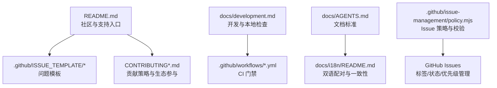
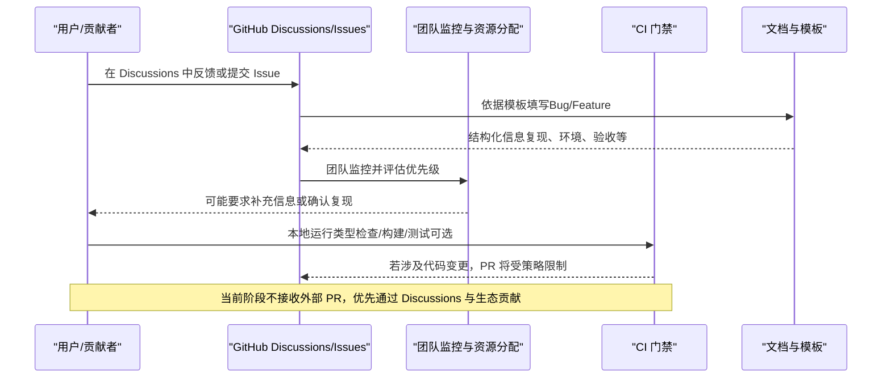
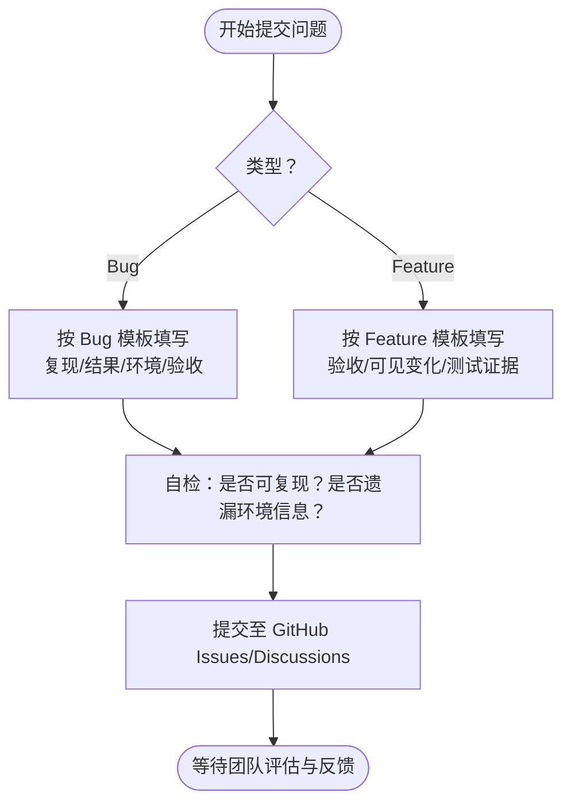
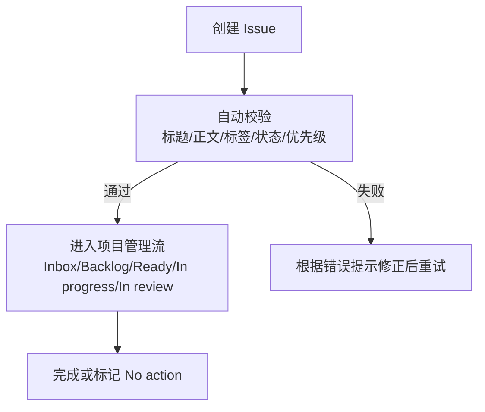
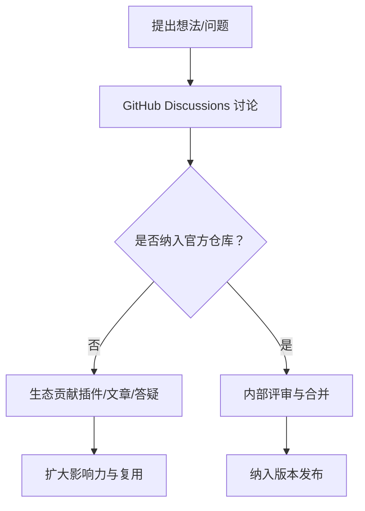
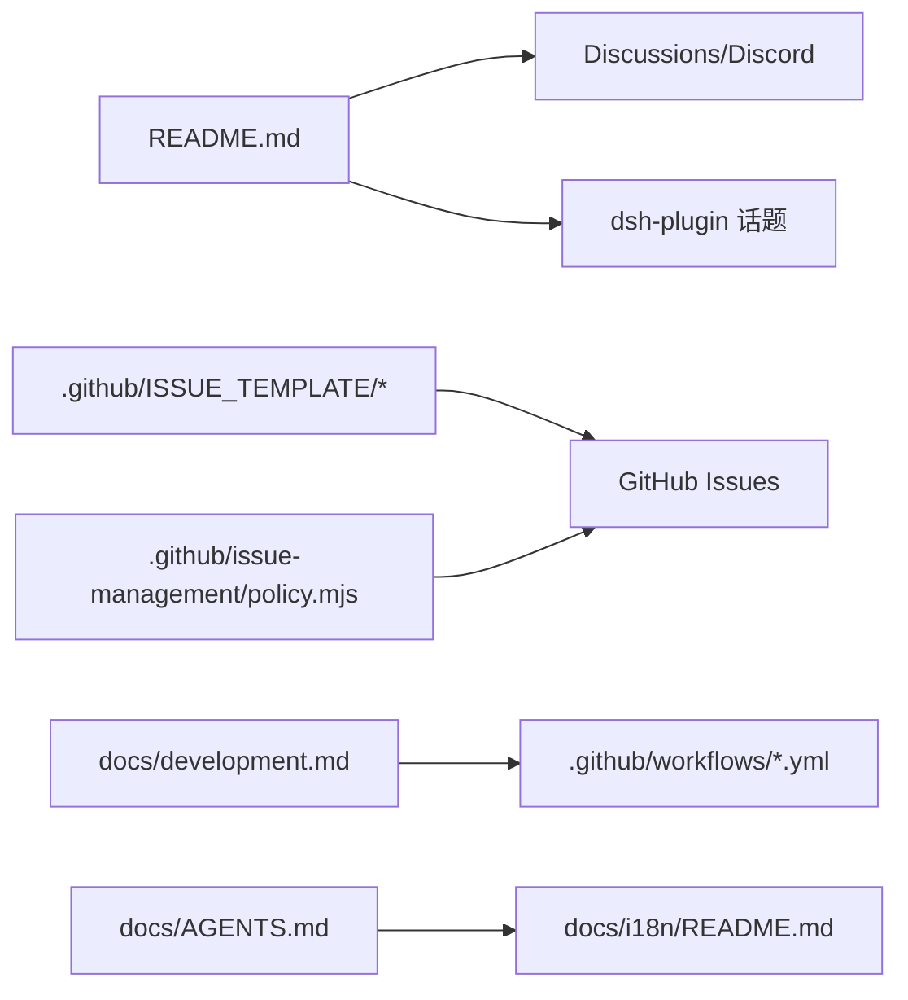

# 社区支持

<cite>
**本文引用的文件**
- [README.md](file://README.md)
- [CONTRIBUTING.md](file://CONTRIBUTING.md)
- [CONTRIBUTING.zh.md](file://CONTRIBUTING.zh.md)
- [docs/development.md](file://docs/development.md)
- [docs/AGENTS.md](file://docs/AGENTS.md)
- [docs/i18n/README.md](file://docs/i18n/README.md)
- [.github/ISSUE_TEMPLATE/bug.md](file://.github/ISSUE_TEMPLATE/bug.md)
- [.github/ISSUE_TEMPLATE/feature.md](file://.github/ISSUE_TEMPLATE/feature.md)
- [.github/pull_request_template.md](file://.github/pull_request_template.md)
- [.github/issue-management/policy.mjs](file://.github/issue-management/policy.mjs)
</cite>

## 目录
1. [简介](#简介)
2. [项目结构](#项目结构)
3. [核心组件](#核心组件)
4. [架构总览](#架构总览)
5. [详细组件分析](#详细组件分析)
6. [依赖关系分析](#依赖关系分析)
7. [性能与可复现性建议](#性能与可复现性建议)
8. [故障排查指南](#故障排查指南)
9. [结论](#结论)
10. [附录](#附录)

## 简介
本指南面向希望参与 DeepSeek Harness 社区讨论、提问与获取技术支持的开发者与用户。内容涵盖：
- 如何参与社区讨论与提问
- 如何提交高质量的问题报告（含模板与信息收集清单）
- GitHub Issues 的使用规范与最佳实践
- 社区贡献流程与代码审查过程说明
- 学习资源与相关文档链接
- 如何参与项目改进与功能请求

## 项目结构
围绕“社区支持”的相关材料主要分布在以下位置：
- 仓库根级 README 提供社区与支持入口（Discussions、Discord、插件话题）
- CONTRIBUTING 系列说明当前对外部 PR 的策略与生态贡献方式
- .github/ISSUE_TEMPLATE 提供 Bug 与 Feature 等模板，统一问题描述格式
- docs 下 development.md、AGENTS.md、i18n/README.md 提供开发、文档与协作规范
- .github/issue-management/policy.mjs 定义 Issue 生命周期与校验规则

**图表来源**
- [README.md:37-45](file://README.md#L37-L45)
- [.github/ISSUE_TEMPLATE/bug.md:1-23](file://.github/ISSUE_TEMPLATE/bug.md#L1-L23)
- [.github/ISSUE_TEMPLATE/feature.md:1-21](file://.github/ISSUE_TEMPLATE/feature.md#L1-L21)
- [docs/development.md:119-125](file://docs/development.md#L119-L125)
- [docs/AGENTS.md:15-33](file://docs/AGENTS.md#L15-L33)
- [docs/i18n/README.md:7-23](file://docs/i18n/README.md#L7-L23)
- [.github/issue-management/policy.mjs:127-145](file://.github/issue-management/policy.mjs#L127-L145)

**章节来源**
- [README.md:37-45](file://README.md#L37-L45)
- [CONTRIBUTING.md:9-21](file://CONTRIBUTING.md#L9-L21)
- [CONTRIBUTING.zh.md:9-21](file://CONTRIBUTING.zh.md#L9-L21)
- [docs/development.md:119-125](file://docs/development.md#L119-L125)
- [docs/AGENTS.md:15-33](file://docs/AGENTS.md#L15-L33)
- [docs/i18n/README.md:7-23](file://docs/i18n/README.md#L7-L23)
- [.github/issue-management/policy.mjs:127-145](file://.github/issue-management/policy.mjs#L127-L145)

## 核心组件
- 社区支持与反馈渠道
  - GitHub Discussions：用于反馈与 bug 报告、投票提升关注
  - Discord 社区：加入交流
  - 插件生态：使用 dsh-plugin 话题分享插件
- 问题报告模板
  - Bug 模板：要求一句话错误结果 + 复现步骤、实际结果、预期结果、环境、验收条件
  - Feature 模板：要求一句话预期结果 + 验收条件、可见变化、测试证据
- 贡献策略
  - 当前不接受外部 PR；鼓励通过 Discussions、生态贡献、写作与答疑等方式参与
- 开发与本地验证
  - 使用 pnpm 脚本进行类型检查、构建与文档同步
  - CI 门禁保障多 Node 版本兼容与端到端测试
- 文档与国际化
  - 文档遵循 AGENTS.md 分层与写作规范
  - 中英双语配对与一致性校验

**章节来源**
- [README.md:37-45](file://README.md#L37-L45)
- [.github/ISSUE_TEMPLATE/bug.md:10-22](file://.github/ISSUE_TEMPLATE/bug.md#L10-L22)
- [.github/ISSUE_TEMPLATE/feature.md:10-20](file://.github/ISSUE_TEMPLATE/feature.md#L10-L20)
- [CONTRIBUTING.md:9-21](file://CONTRIBUTING.md#L9-L21)
- [CONTRIBUTING.zh.md:9-21](file://CONTRIBUTING.zh.md#L9-L21)
- [docs/development.md:119-125](file://docs/development.md#L119-L125)
- [docs/AGENTS.md:15-33](file://docs/AGENTS.md#L15-L33)
- [docs/i18n/README.md:7-23](file://docs/i18n/README.md#L7-L23)

## 架构总览
下图展示从“提出问题”到“被追踪处理”的流程，以及社区与工具链的交互关系。

**图表来源**
- [README.md:37-45](file://README.md#L37-L45)
- [.github/ISSUE_TEMPLATE/bug.md:10-22](file://.github/ISSUE_TEMPLATE/bug.md#L10-L22)
- [.github/ISSUE_TEMPLATE/feature.md:10-20](file://.github/ISSUE_TEMPLATE/feature.md#L10-L20)
- [docs/development.md:119-125](file://docs/development.md#L119-L125)
- [CONTRIBUTING.md:9-21](file://CONTRIBUTING.md#L9-L21)

## 详细组件分析

### 社区讨论与提问
- 首选渠道：GitHub Discussions
  - 适合反馈、提问、发现并报告问题或 bug
  - 可通过投票提升关注度，团队会持续监控并在资源分配时考虑
- 其他渠道：Discord 社区
  - 快速交流与互助
- 插件生态：为插件添加 dsh-plugin 话题，便于他人发现

**章节来源**
- [README.md:37-45](file://README.md#L37-L45)
- [CONTRIBUTING.md:9-21](file://CONTRIBUTING.md#L9-L21)
- [CONTRIBUTING.zh.md:9-21](file://CONTRIBUTING.zh.md#L9-L21)

### 问题报告模板与信息收集清单
- Bug 报告应包含：
  - 一句话错误结果
  - 复现步骤
  - 实际结果
  - 预期结果
  - 环境信息
  - 验收条件
- Feature 请求应包含：
  - 一句话预期结果
  - 验收条件
  - 用户或模型可见变化
  - 测试证据

**图表来源**
- [.github/ISSUE_TEMPLATE/bug.md:10-22](file://.github/ISSUE_TEMPLATE/bug.md#L10-L22)
- [.github/ISSUE_TEMPLATE/feature.md:10-20](file://.github/ISSUE_TEMPLATE/feature.md#L10-L20)

**章节来源**
- [.github/ISSUE_TEMPLATE/bug.md:10-22](file://.github/ISSUE_TEMPLATE/bug.md#L10-L22)
- [.github/ISSUE_TEMPLATE/feature.md:10-20](file://.github/ISSUE_TEMPLATE/feature.md#L10-L20)

### GitHub Issues 使用规范与最佳实践
- 标题与正文
  - 标题需为中文行动或结果句；外露正文不超过 50 单位
  - 正文按模板结构化填写，确保可复现与可验收
- 标签与类型
  - 使用原生 Type（Idea/Feature/Bug/Research/Task）
  - 禁止使用 PR kind 或旧版标签
- 优先级与状态
  - Priority 可为空或 P0–P3
  - Status 需在 Project 中且合法；Done/No action 对应关闭原因
- 所有者与指派
  - 零或一个 Assignee 时不得写 Owner 行；Owner 用于明确负责人
- 自动化校验
  - 由 issue-policy 脚本对 Body、标签、状态、优先级等进行校验

**图表来源**
- [.github/ISSUE_TEMPLATE/bug.md:10-22](file://.github/ISSUE_TEMPLATE/bug.md#L10-L22)
- [.github/ISSUE_TEMPLATE/feature.md:10-20](file://.github/ISSUE_TEMPLATE/feature.md#L10-L20)
- [.github/issue-management/policy.mjs:127-145](file://.github/issue-management/policy.mjs#L127-L145)
- [.github/issue-management/policy.mjs:283-323](file://.github/issue-management/policy.mjs#L283-L323)

**章节来源**
- [.github/issue-management/policy.mjs:127-145](file://.github/issue-management/policy.mjs#L127-L145)
- [.github/issue-management/policy.mjs:283-323](file://.github/issue-management/policy.mjs#L283-L323)

### 社区贡献流程与代码审查
- 当前策略
  - 暂不接受外部 PR；欢迎通过 Discussions、生态贡献、写作与答疑参与
- 生态贡献
  - 创建插件并添加 dsh-plugin 话题
  - 撰写博客与操作指南
  - 回答社区问题，帮助他人
- 代码审查（内部）
  - 若未来开放 PR，将遵循仓库工作流与 CI 门禁
  - 本地先运行类型检查与必要构建，确保变更可验证

**图表来源**
- [CONTRIBUTING.md:9-21](file://CONTRIBUTING.md#L9-L21)
- [CONTRIBUTING.zh.md:9-21](file://CONTRIBUTING.zh.md#L9-L21)
- [docs/development.md:119-125](file://docs/development.md#L119-L125)

**章节来源**
- [CONTRIBUTING.md:9-21](file://CONTRIBUTING.md#L9-L21)
- [CONTRIBUTING.zh.md:9-21](file://CONTRIBUTING.zh.md#L9-L21)
- [docs/development.md:119-125](file://docs/development.md#L119-L125)

### 学习资源与相关文档
- 入门与运行
  - 通过 npm 或源码运行 Web UI
- 开发指南
  - 本地设置、日常命令、CI 门禁概览
- 文档标准与国际化
  - 文档分层、写作规范、双语配对与一致性校验
- 子系统与 API
  - 子系统参考、Cordis 核心 API、工具与配置目录

**章节来源**
- [README.md:13-35](file://README.md#L13-L35)
- [docs/development.md:7-40](file://docs/development.md#L7-L40)
- [docs/AGENTS.md:15-33](file://docs/AGENTS.md#L15-L33)
- [docs/i18n/README.md:7-23](file://docs/i18n/README.md#L7-L23)

## 依赖关系分析
社区支持相关的依赖关系如下：
- README 指向 Discussions、Discord 与插件话题
- 问题模板驱动高质量 Issue 内容
- 开发指南与 CI 门禁保障本地与远程质量
- 文档标准与国际化保证一致性与可维护性
- Issue 策略脚本约束标签、状态、优先级与标题规范

**图表来源**
- [README.md:37-45](file://README.md#L37-L45)
- [.github/ISSUE_TEMPLATE/bug.md:10-22](file://.github/ISSUE_TEMPLATE/bug.md#L10-L22)
- [.github/ISSUE_TEMPLATE/feature.md:10-20](file://.github/ISSUE_TEMPLATE/feature.md#L10-L20)
- [docs/development.md:119-125](file://docs/development.md#L119-L125)
- [docs/AGENTS.md:15-33](file://docs/AGENTS.md#L15-L33)
- [docs/i18n/README.md:7-23](file://docs/i18n/README.md#L7-L23)
- [.github/issue-management/policy.mjs:127-145](file://.github/issue-management/policy.mjs#L127-L145)

**章节来源**
- [README.md:37-45](file://README.md#L37-L45)
- [docs/development.md:119-125](file://docs/development.md#L119-L125)
- [docs/AGENTS.md:15-33](file://docs/AGENTS.md#L15-L33)
- [docs/i18n/README.md:7-23](file://docs/i18n/README.md#L7-L23)
- [.github/issue-management/policy.mjs:127-145](file://.github/issue-management/policy.mjs#L127-L145)

## 性能与可复现性建议
- 本地验证
  - 提交前运行类型检查与必要构建，确保变更可验证
- 环境信息
  - 在 Issue 中明确 Node 版本、pnpm 版本、操作系统与关键环境变量
- 最小复现
  - 提供最小可复现步骤与配置，避免无关干扰
- 日志与快照
  - 附上关键日志片段与必要的快照/输出，便于定位

[本节为通用指导，无需特定文件引用]

## 故障排查指南
- 常见问题
  - 无法复现：请补充环境与步骤，尽量提供最小用例
  - 模板不完整：按 Bug/Feature 模板补齐必填项
  - 标签/状态错误：遵循 Issue 策略中的标签与状态规范
- 本地检查
  - 使用 pnpm run typecheck 与 pnpm run build 确保本地通过
  - 文档修改使用 pnpm run doc-sync 保持结构与链接有效
- 国际化
  - 修改任一语言文档需同步更新另一语言并重新记录配对哈希

**章节来源**
- [.github/ISSUE_TEMPLATE/bug.md:10-22](file://.github/ISSUE_TEMPLATE/bug.md#L10-L22)
- [.github/ISSUE_TEMPLATE/feature.md:10-20](file://.github/ISSUE_TEMPLATE/feature.md#L10-L20)
- [docs/development.md:119-125](file://docs/development.md#L119-L125)
- [docs/i18n/README.md:24-38](file://docs/i18n/README.md#L24-L38)

## 结论
- 当前阶段优先通过 Discussions 与生态贡献参与社区
- 使用标准化模板提交高质量问题与功能请求
- 遵循 Issue 策略与文档规范，提高沟通效率与可维护性
- 借助本地检查与 CI 门禁，确保变更质量与可复现性

[本节为总结，无需特定文件引用]

## 附录
- 快速入口
  - 社区与支持：README 中的 Discussions、Discord 与插件话题
  - 贡献策略：CONTRIBUTING 系列
  - 开发指南：docs/development.md
  - 文档标准：docs/AGENTS.md 与 docs/i18n/README.md
  - Issue 策略：.github/issue-management/policy.mjs
  - 模板：.github/ISSUE_TEMPLATE/*
  - PR 模板：.github/pull_request_template.md（供内部参考）

**章节来源**
- [README.md:37-45](file://README.md#L37-L45)
- [CONTRIBUTING.md:9-21](file://CONTRIBUTING.md#L9-L21)
- [CONTRIBUTING.zh.md:9-21](file://CONTRIBUTING.zh.md#L9-L21)
- [docs/development.md:119-125](file://docs/development.md#L119-L125)
- [docs/AGENTS.md:15-33](file://docs/AGENTS.md#L15-L33)
- [docs/i18n/README.md:7-23](file://docs/i18n/README.md#L7-L23)
- [.github/ISSUE_TEMPLATE/bug.md:10-22](file://.github/ISSUE_TEMPLATE/bug.md#L10-L22)
- [.github/ISSUE_TEMPLATE/feature.md:10-20](file://.github/ISSUE_TEMPLATE/feature.md#L10-L20)
- [.github/pull_request_template.md:1-14](file://.github/pull_request_template.md#L1-L14)
- [.github/issue-management/policy.mjs:127-145](file://.github/issue-management/policy.mjs#L127-L145)