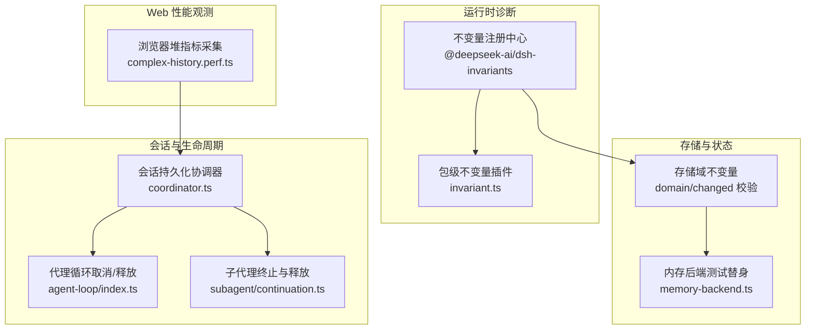
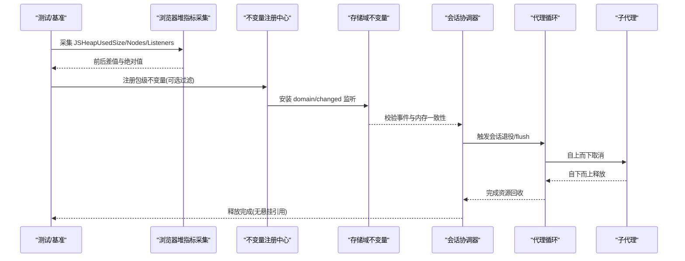
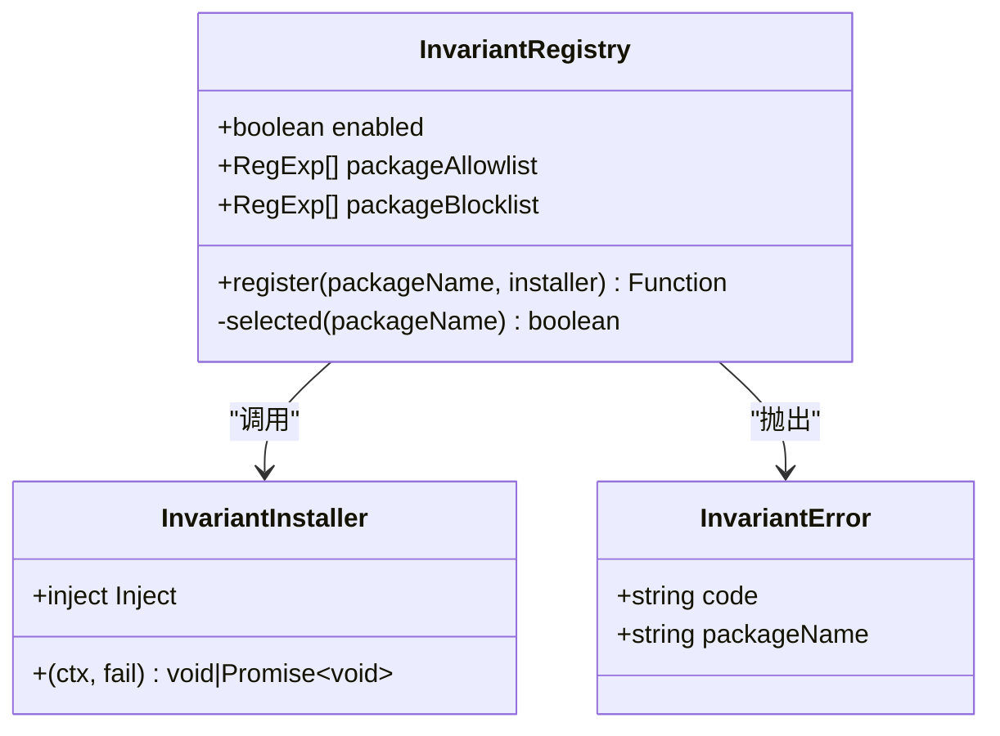
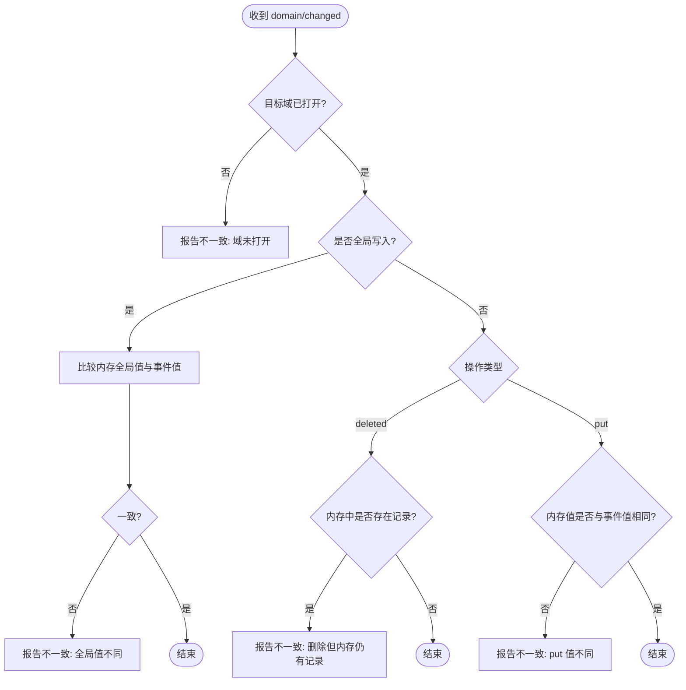
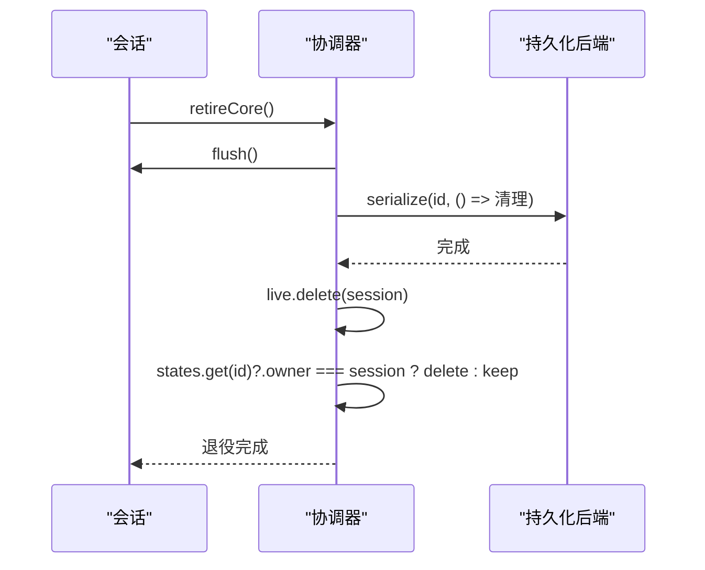
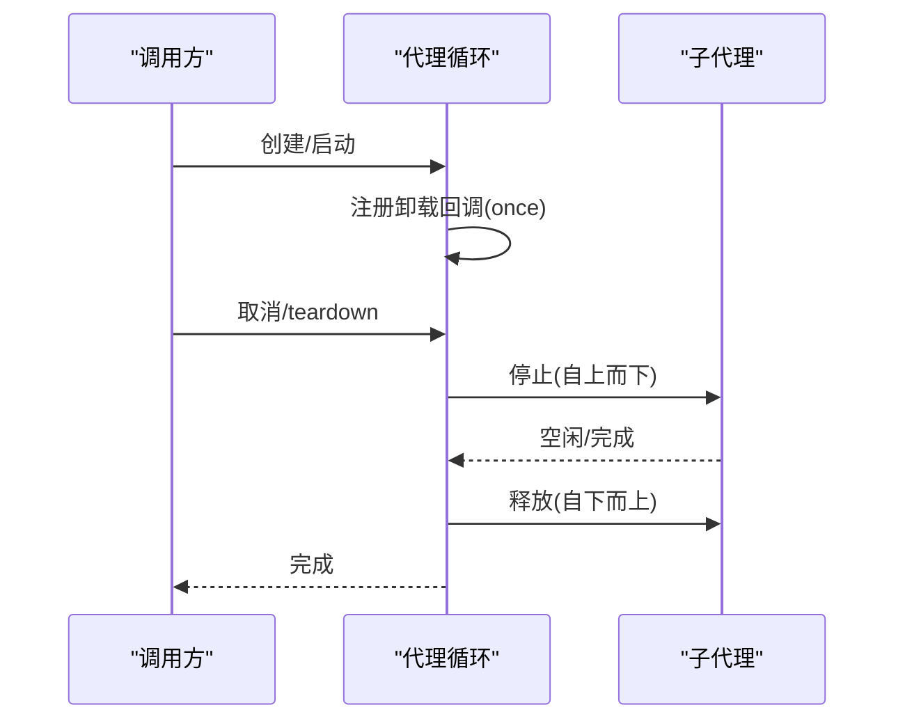
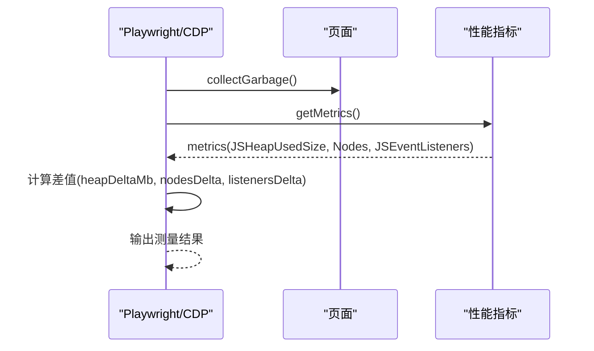
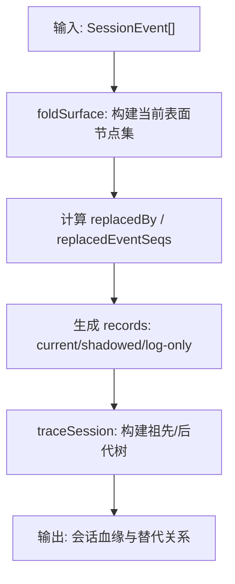
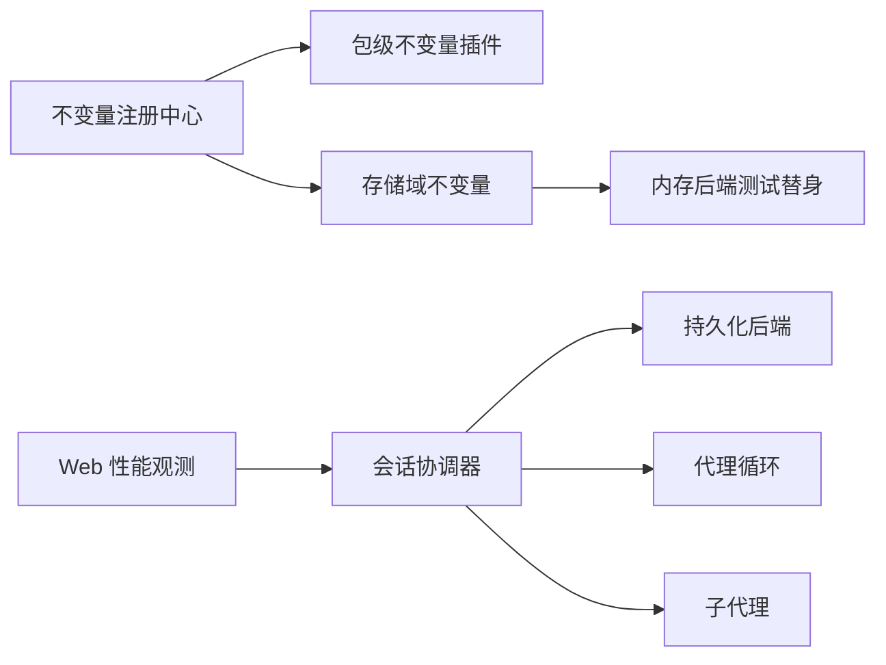

# 内存调试工具

<cite>
**本文引用的文件**
- [packages/runtime-diagnostics/invariants/src/index.ts](file://packages/runtime-diagnostics/invariants/src/index.ts)
- [packages/runtime-diagnostics/invariants/src/invariant.ts](file://packages/runtime-diagnostics/invariants/src/invariant.ts)
- [packages/storage/storage-domain/tests/helpers/memory-backend.ts](file://packages/storage/storage-domain/tests/helpers/memory-backend.ts)
- [apps/web/tests/complex-history.perf.ts](file://apps/web/tests/complex-history.perf.ts)
- [packages/session-query/session-query/src/tracing.ts](file://packages/session-query/session-query/src/tracing.ts)
- [packages/core/agent-loop/src/index.ts](file://packages/core/agent-loop/src/index.ts)
- [packages/subagent/subagent/src/continuation.ts](file://packages/subagent/subagent/src/continuation.ts)
- [packages/session/session-persistence/src/coordinator.ts](file://packages/session/session-persistence/src/coordinator.ts)
- [examples/mcp-memory/memorix.cordis.yml](file://examples/mcp-memory/memorix.cordis.yml)
- [examples/mcp-memory/mcp-reference-memory.cordis.yml](file://examples/mcp-memory/mcp-reference-memory.cordis.yml)
- [examples/mcp-memory/engram.cordis.yml](file://examples/mcp-memory/engram.cordis.yml)
</cite>

## 目录
1. [简介](#简介)
2. [项目结构](#项目结构)
3. [核心组件](#核心组件)
4. [架构总览](#架构总览)
5. [详细组件分析](#详细组件分析)
6. [依赖关系分析](#依赖关系分析)
7. [性能考量](#性能考量)
8. [故障排查指南](#故障排查指南)
9. [结论](#结论)
10. [附录](#附录)

## 简介
本文件面向需要在工程中定位、诊断与优化内存问题的开发者，系统化介绍仓库中的内存调试能力与最佳实践。内容涵盖：
- 内存泄漏检测机制与工具使用方法
- 堆快照分析与引用链追踪技术
- 内存断言与不变量检查的配置和使用
- 实际内存问题排查案例与解决方案
- 内存使用优化的工程化建议

本仓库提供了两类关键能力：
- 运行时不变量（invariants）注册与执行框架，用于在运行期对内存与状态一致性进行强约束，快速暴露不一致导致的“隐式泄漏”或“悬挂引用”。
- 会话持久化与生命周期管理，提供资源回收、清理与可观测性，避免会话级对象长期驻留导致内存增长。

此外，测试与基准代码中展示了如何采集浏览器堆指标、触发垃圾回收并计算增量，便于在端到端场景下验证内存回归。

## 项目结构
围绕内存调试与诊断的相关代码主要分布在以下位置：
- 运行时不变量服务：定义配置、注册器、错误类型与包级过滤策略
- 存储域不变量：校验事件与内存状态的一致性，防止“已删除仍驻留”等异常
- 会话持久化协调器：负责会话的创建、刷新、退役与资源释放
- 子代理与代理循环：实现自上而下的取消与自底向上的释放，确保资源及时回收
- Web 性能测试：通过 CDP 获取堆大小、节点数、监听器数量等指标，辅助发现内存泄漏
- 示例 MCP 内存配置：展示第三方内存服务的接入方式（作为用例参考）

图表来源
- [packages/runtime-diagnostics/invariants/src/index.ts:94-197](file://packages/runtime-diagnostics/invariants/src/index.ts#L94-L197)
- [packages/runtime-diagnostics/invariants/src/invariant.ts:10-29](file://packages/runtime-diagnostics/invariants/src/invariant.ts#L10-L29)
- [packages/storage/storage-domain/tests/helpers/memory-backend.ts:21-161](file://packages/storage/storage-domain/tests/helpers/memory-backend.ts#L21-L161)
- [packages/session/session-persistence/src/coordinator.ts:1153-1182](file://packages/session/session-persistence/src/coordinator.ts#L1153-L1182)
- [packages/core/agent-loop/src/index.ts:474-487](file://packages/core/agent-loop/src/index.ts#L474-L487)
- [packages/subagent/subagent/src/continuation.ts:1270-1307](file://packages/subagent/subagent/src/continuation.ts#L1270-L1307)
- [apps/web/tests/complex-history.perf.ts:515-568](file://apps/web/tests/complex-history.perf.ts#L515-L568)

章节来源
- [packages/runtime-diagnostics/invariants/src/index.ts:94-197](file://packages/runtime-diagnostics/invariants/src/index.ts#L94-L197)
- [packages/storage/storage-domain/tests/helpers/memory-backend.ts:21-161](file://packages/storage/storage-domain/tests/helpers/memory-backend.ts#L21-L161)
- [packages/session/session-persistence/src/coordinator.ts:1153-1182](file://packages/session/session-persistence/src/coordinator.ts#L1153-L1182)
- [apps/web/tests/complex-history.perf.ts:515-568](file://apps/web/tests/complex-history.perf.ts#L515-L568)

## 核心组件
- 运行时不变量注册中心
  - 提供全局开关与包名白名单/黑名单过滤，支持按包粒度启用/禁用不变量检查
  - 以插件形式为每个包安装检查，失败时抛出带包名的稳定错误码
- 存储域不变量
  - 监听 domain/changed 事件，校验内存态与事件快照的一致性，防止“删除未同步”“值不一致”等问题
- 会话持久化协调器
  - 维护会话生命周期，负责 flush、序列化、退役与清理，避免会话对象长期驻留
- 代理与子代理的生命周期管理
  - 自上而下取消、自下而上释放，确保资源在异常路径也能被回收
- Web 性能观测
  - 通过 CDP 收集 JSHeapUsedSize、Nodes、JSEventListeners 等指标，结合 GC 触发与差值计算，辅助定位内存泄漏

章节来源
- [packages/runtime-diagnostics/invariants/src/index.ts:14-22](file://packages/runtime-diagnostics/invariants/src/index.ts#L14-L22)
- [packages/runtime-diagnostics/invariants/src/index.ts:49-66](file://packages/runtime-diagnostics/invariants/src/index.ts#L49-L66)
- [packages/runtime-diagnostics/invariants/src/index.ts:94-197](file://packages/runtime-diagnostics/invariants/src/index.ts#L94-L197)
- [packages/storage/storage-domain/tests/helpers/memory-backend.ts:23-54](file://packages/storage/storage-domain/tests/helpers/memory-backend.ts#L23-L54)
- [packages/session/session-persistence/src/coordinator.ts:1153-1182](file://packages/session/session-persistence/src/coordinator.ts#L1153-L1182)
- [packages/core/agent-loop/src/index.ts:474-487](file://packages/core/agent-loop/src/index.ts#L474-L487)
- [packages/subagent/subagent/src/continuation.ts:1270-1307](file://packages/subagent/subagent/src/continuation.ts#L1270-L1307)
- [apps/web/tests/complex-history.perf.ts:515-568](file://apps/web/tests/complex-history.perf.ts#L515-L568)

## 架构总览
下图展示了内存调试相关组件之间的交互关系：不变量注册中心驱动各包的检查；存储域不变量保障事件与内存一致；会话协调器管理资源生命周期；代理与子代理保证释放顺序；Web 性能观测提供外部指标输入。

图表来源
- [apps/web/tests/complex-history.perf.ts:515-568](file://apps/web/tests/complex-history.perf.ts#L515-L568)
- [packages/runtime-diagnostics/invariants/src/index.ts:94-197](file://packages/runtime-diagnostics/invariants/src/index.ts#L94-L197)
- [packages/storage/storage-domain/tests/helpers/memory-backend.ts:23-54](file://packages/storage/storage-domain/tests/helpers/memory-backend.ts#L23-L54)
- [packages/session/session-persistence/src/coordinator.ts:1153-1182](file://packages/session/session-persistence/src/coordinator.ts#L1153-L1182)
- [packages/core/agent-loop/src/index.ts:474-487](file://packages/core/agent-loop/src/index.ts#L474-L487)
- [packages/subagent/subagent/src/continuation.ts:1270-1307](file://packages/subagent/subagent/src/continuation.ts#L1270-L1307)

## 详细组件分析

### 运行时不变量注册中心
- 功能要点
  - 提供 enabled、package_allowlist、package_blocklist 配置项，控制是否启用以及哪些包参与检查
  - register(packageName, installer) 将包级检查以插件形式安装到独立子上下文，失败时抛出 InvariantError
  - 支持异步安装与清理，确保资源正确释放
- 复杂度与性能
  - 注册过程 O(1)，过滤匹配基于正则集合，整体开销低
  - 仅在启用且匹配时才执行检查，避免不必要的性能影响
- 错误处理
  - 非法包名、重复注册会直接报错
  - 检查失败抛出带包名的稳定错误码，便于定位

图表来源
- [packages/runtime-diagnostics/invariants/src/index.ts:14-22](file://packages/runtime-diagnostics/invariants/src/index.ts#L14-L22)
- [packages/runtime-diagnostics/invariants/src/index.ts:49-66](file://packages/runtime-diagnostics/invariants/src/index.ts#L49-L66)
- [packages/runtime-diagnostics/invariants/src/index.ts:94-197](file://packages/runtime-diagnostics/invariants/src/index.ts#L94-L197)

章节来源
- [packages/runtime-diagnostics/invariants/src/index.ts:14-22](file://packages/runtime-diagnostics/invariants/src/index.ts#L14-L22)
- [packages/runtime-diagnostics/invariants/src/index.ts:49-66](file://packages/runtime-diagnostics/invariants/src/index.ts#L49-L66)
- [packages/runtime-diagnostics/invariants/src/index.ts:94-197](file://packages/runtime-diagnostics/invariants/src/index.ts#L94-L197)

### 存储域不变量（内存一致性检查）
- 功能要点
  - 监听 domain/changed 事件，对比内存态与事件快照
  - 针对 delete/put/global 写操作进行一致性校验，防止“删除后仍存在”“值不一致”等异常
- 适用场景
  - 当系统通过事件驱动更新内存时，该不变量可作为“内存与事件契约”的守门员
- 性能与扩展
  - 仅在全局监听内做轻量比对，适合在生产环境按需开启
  - 可通过不变量注册中心的包过滤精确控制生效范围

图表来源
- [packages/storage/storage-domain/tests/helpers/memory-backend.ts:23-54](file://packages/storage/storage-domain/tests/helpers/memory-backend.ts#L23-L54)

章节来源
- [packages/storage/storage-domain/tests/helpers/memory-backend.ts:23-54](file://packages/storage/storage-domain/tests/helpers/memory-backend.ts#L23-L54)

### 会话持久化协调器（资源回收与退役）
- 功能要点
  - retireCore：flush 后从 live 集合移除，清理 states 中的 owner 引用
  - initFor：为会话建立生命周期控制器，必要时恢复预准备状态
- 内存意义
  - 明确退役流程，避免会话对象及其内部缓存长期驻留
  - 与上层取消/释放配合，确保无悬挂引用

图表来源
- [packages/session/session-persistence/src/coordinator.ts:1153-1182](file://packages/session/session-persistence/src/coordinator.ts#L1153-L1182)

章节来源
- [packages/session/session-persistence/src/coordinator.ts:1153-1182](file://packages/session/session-persistence/src/coordinator.ts#L1153-L1182)

### 代理与子代理生命周期（取消与释放）
- 功能要点
  - 代理循环在创建前注册卸载回调，确保工厂 teardown 或调用方取消能立即中止
  - 子代理 dispose：先唤醒并停止，再自上而下取消，最后自下而上释放子资源
- 内存意义
  - 保证异常路径也能释放资源，避免“僵尸任务”持有大对象
  - 通过明确的父子释放顺序，减少循环引用导致的泄漏

图表来源
- [packages/core/agent-loop/src/index.ts:474-487](file://packages/core/agent-loop/src/index.ts#L474-L487)
- [packages/subagent/subagent/src/continuation.ts:1270-1307](file://packages/subagent/subagent/src/continuation.ts#L1270-L1307)

章节来源
- [packages/core/agent-loop/src/index.ts:474-487](file://packages/core/agent-loop/src/index.ts#L474-L487)
- [packages/subagent/subagent/src/continuation.ts:1270-1307](file://packages/subagent/subagent/src/continuation.ts#L1270-L1307)

### Web 性能观测（堆快照与指标采集）
- 功能要点
  - 通过 CDP 获取 Performance.getMetrics，提取 JSHeapUsedSize、Nodes、JSEventListeners 等
  - 触发 HeapProfiler.collectGarbage 后进行测量，计算差值以识别泄漏趋势
- 使用建议
  - 在关键用户流程前后采集，关注 heapDeltaMb、nodesDelta、listenersDelta
  - 结合会话退役与不变量检查，交叉验证内存健康度

图表来源
- [apps/web/tests/complex-history.perf.ts:515-568](file://apps/web/tests/complex-history.perf.ts#L515-L568)

章节来源
- [apps/web/tests/complex-history.perf.ts:515-568](file://apps/web/tests/complex-history.perf.ts#L515-L568)

### 会话事件溯源（引用链追踪）
- 功能要点
  - 对会话事件日志进行分析，构建当前表面节点集合与被替换关系
  - 提供 traceSession 能力，递归追踪祖先与后代，形成完整血缘图
- 内存意义
  - 通过事件血缘定位“谁持有了谁”，辅助识别长生命周期引用导致的泄漏

图表来源
- [packages/session-query/session-query/src/tracing.ts:175-248](file://packages/session-query/session-query/src/tracing.ts#L175-L248)

章节来源
- [packages/session-query/session-query/src/tracing.ts:175-248](file://packages/session-query/session-query/src/tracing.ts#L175-L248)

## 依赖关系分析
- 不变量注册中心依赖 Cordis 上下文与服务注入，包级不变量插件通过 apply 注册
- 存储域不变量依赖 domain/changed 事件流，与内存后端测试替身共同验证一致性
- 会话协调器依赖持久化后端，并在退役阶段清理引用
- 代理与子代理通过取消信号与空闲等待，协同完成释放
- Web 性能观测通过 CDP 与页面交互，提供外部指标输入

图表来源
- [packages/runtime-diagnostics/invariants/src/index.ts:94-197](file://packages/runtime-diagnostics/invariants/src/index.ts#L94-L197)
- [packages/runtime-diagnostics/invariants/src/invariant.ts:10-29](file://packages/runtime-diagnostics/invariants/src/invariant.ts#L10-L29)
- [packages/storage/storage-domain/tests/helpers/memory-backend.ts:21-161](file://packages/storage/storage-domain/tests/helpers/memory-backend.ts#L21-L161)
- [packages/session/session-persistence/src/coordinator.ts:1153-1182](file://packages/session/session-persistence/src/coordinator.ts#L1153-L1182)
- [packages/core/agent-loop/src/index.ts:474-487](file://packages/core/agent-loop/src/index.ts#L474-L487)
- [packages/subagent/subagent/src/continuation.ts:1270-1307](file://packages/subagent/subagent/src/continuation.ts#L1270-L1307)
- [apps/web/tests/complex-history.perf.ts:515-568](file://apps/web/tests/complex-history.perf.ts#L515-L568)

章节来源
- [packages/runtime-diagnostics/invariants/src/index.ts:94-197](file://packages/runtime-diagnostics/invariants/src/index.ts#L94-L197)
- [packages/storage/storage-domain/tests/helpers/memory-backend.ts:21-161](file://packages/storage/storage-domain/tests/helpers/memory-backend.ts#L21-L161)
- [packages/session/session-persistence/src/coordinator.ts:1153-1182](file://packages/session/session-persistence/src/coordinator.ts#L1153-L1182)
- [packages/core/agent-loop/src/index.ts:474-487](file://packages/core/agent-loop/src/index.ts#L474-L487)
- [packages/subagent/subagent/src/continuation.ts:1270-1307](file://packages/subagent/subagent/src/continuation.ts#L1270-L1307)
- [apps/web/tests/complex-history.perf.ts:515-568](file://apps/web/tests/complex-history.perf.ts#L515-L568)

## 性能考量
- 不变量检查应谨慎启用
  - 生产环境默认关闭或通过包过滤精确启用，避免额外开销
  - 优先在高价值路径（如会话创建/销毁、批量写入）开启
- 会话退役与释放要尽早
  - 在异常路径也需确保 flush 与 retire 被执行
  - 避免在热点路径中频繁创建长生命周期对象
- 指标采集频率与成本
  - 堆指标采集与 GC 触发有成本，建议在关键流程前后采样
  - 关注相对变化（差值）而非单次绝对值，减少噪声

[本节为通用指导，不直接分析具体文件]

## 故障排查指南
- 常见症状
  - JSHeapUsedSize 持续上升，GC 后不回降
  - DOM 节点数或事件监听器数量持续增长
  - 会话结束后仍有大量对象未被释放
- 排查步骤
  - 使用 Web 性能观测采集前后指标，确认泄漏区间
  - 启用存储域不变量，观察 domain/changed 是否报不一致
  - 检查会话协调器的退役流程是否被调用，确认 flush 与 retire 执行
  - 检查代理与子代理的取消与释放路径，确保异常路径也能回收
  - 使用事件溯源工具构建血缘图，定位“谁持有谁”
- 修复建议
  - 显式释放资源，避免闭包持有大对象
  - 缩短对象生命周期，及时断开引用
  - 将不变量检查纳入回归测试，提前发现问题

章节来源
- [apps/web/tests/complex-history.perf.ts:515-568](file://apps/web/tests/complex-history.perf.ts#L515-L568)
- [packages/storage/storage-domain/tests/helpers/memory-backend.ts:23-54](file://packages/storage/storage-domain/tests/helpers/memory-backend.ts#L23-L54)
- [packages/session/session-persistence/src/coordinator.ts:1153-1182](file://packages/session/session-persistence/src/coordinator.ts#L1153-L1182)
- [packages/core/agent-loop/src/index.ts:474-487](file://packages/core/agent-loop/src/index.ts#L474-L487)
- [packages/subagent/subagent/src/continuation.ts:1270-1307](file://packages/subagent/subagent/src/continuation.ts#L1270-L1307)
- [packages/session-query/session-query/src/tracing.ts:175-248](file://packages/session-query/session-query/src/tracing.ts#L175-L248)

## 结论
本仓库提供了完整的内存调试基础设施：以不变量为核心的运行时契约校验，以会话协调器为核心的资源回收流程，以及以 CDP 指标为核心的外部观测手段。通过合理配置与组合使用这些能力，可以在开发、测试与生产环境中高效定位与修复内存问题，持续提升系统的稳定性与性能。

[本节为总结性内容，不直接分析具体文件]

## 附录
- 内存断言与不变量检查配置
  - enabled：全局开关，默认开启
  - package_allowlist：包名白名单（正则），为空则允许所有
  - package_blocklist：包名黑名单（正则），优先级高于白名单
- 实际案例参考
  - 通过 Web 性能观测发现堆增长，结合会话退役与不变量检查定位到未释放的会话对象
  - 通过事件溯源构建血缘图，发现某工具回调持有旧会话引用，导致无法回收

章节来源
- [packages/runtime-diagnostics/invariants/src/index.ts:14-22](file://packages/runtime-diagnostics/invariants/src/index.ts#L14-L22)
- [apps/web/tests/complex-history.perf.ts:515-568](file://apps/web/tests/complex-history.perf.ts#L515-L568)
- [packages/session/session-persistence/src/coordinator.ts:1153-1182](file://packages/session/session-persistence/src/coordinator.ts#L1153-L1182)
- [packages/session-query/session-query/src/tracing.ts:175-248](file://packages/session-query/session-query/src/tracing.ts#L175-L248)